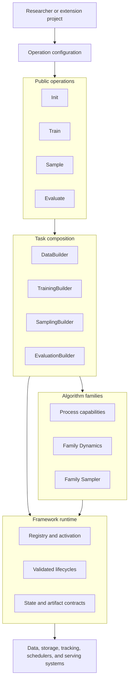

# Stochaflow Architecture

> Status: Normative architecture overview
>
> Applies to: the current source tree
>
> Last reviewed: 2026-08-11

This document defines the stable ownership, dependency, and composition model
of Stochaflow. It explains how the product contract in [`SPEC.md`](SPEC.md) is
implemented without turning the framework into a task-specific monolith or a
universal ML platform.

Detailed current behavior lives in [`docs/framework.md`](docs/framework.md).
Long-term product scope and non-goals live in [`SPEC.md`](SPEC.md). Development
plans under `docs/development/` may explore changes, but they are not
authoritative until the stable contract is reflected here and in public
documentation.

## 1. Architecture Drivers

The architecture prioritizes:

1. **Explicit composition** — configuration selects stable components; narrow
   Builders assemble complete task collaborations.
2. **Reproducible lifecycles** — supported runs preserve the state and identity
   required for validation, resume, inference, and evaluation.
3. **Open-closed extension** — new compatible components do not require edits to
   core name-based dispatch.
4. **Family-owned mathematics** — unrelated generative methods are not forced
   through one artificial mathematical interface.
5. **Fail-closed compatibility** — ambiguous configuration, state, or artifact
   semantics are rejected rather than guessed.
6. **Thin integration boundaries** — mature external infrastructure is adapted,
   not reimplemented.

## 2. System Context



Stochaflow owns the middle composition and lifecycle layer. Extension projects
own task semantics; algorithm families own their mathematics; external systems
own infrastructure control planes.

## 3. Layer Model

| Layer | Owns | Must not own |
| --- | --- | --- |
| Framework | Registry activation, configuration authority, dependency injection, supported execution, state and artifact lifecycles | Task-name dispatch, universal mathematical APIs, external platform control planes |
| Algorithm family | Family-specific Process capabilities, prediction semantics, Dynamics, transitions, solvers, and Samplers | Project batch schemas, UI concerns, unrelated-family abstractions |
| Task/project | Data recipes, batch interpretation, model adaptation, conditioning, guidance, initialization, objectives, and domain outputs | Core dispatch changes or private semantics promoted to global schemas without evidence |
| External systems | Data distribution, object storage, tracking, scheduling, monitoring, permissions, and serving | Stochaflow's internal algorithm and workflow semantics |

Dependency direction follows ownership. Runtime coordinators depend on public
contracts and capabilities. Concrete implementations are selected at registry
or Builder composition boundaries and injected inward.

## 4. Source Package Map

The package uses a `src` layout under `src/stochaflow/`:

| Package | Primary responsibility |
| --- | --- |
| `data` | DataSource, DataArtifact, DataBuilder, and runtime data composition |
| `models` | Reusable model implementations and narrow model capabilities |
| `families` | Process-free tensor semantics shared within one algorithm family |
| `processes` | Model-free probability paths, schedules, and mathematical capabilities |
| `training` | TrainingBuilder, TrainingPlan, Strategy, Trainer, metrics binding, EMA, precision, and outcomes |
| `sampling` | SamplingBuilder, model/Dynamics adaptation, Samplers, execution, observers, and writers |
| `inference` | Read-only checkpoint asset projection shared by inference consumers |
| `evaluation` | Evaluation subjects, Builders, plans, prediction artifacts, runtime, completeness, and result bundles |
| `metrics` | Task-neutral metric contracts, construction, state, and reference providers |
| `extensions` | Stable public extension imports and activation support |
| `projects` | Extension-project scaffolding and templates |
| `scripts` | CLI parsing and thin operation entry points |
| `utils` | Cross-cutting configuration, registries, checkpoint/state, logging, and manifest infrastructure |

Folders describe implementation ownership, not permission to create new public
cross-layer imports. Stable external imports are exposed through documented
package surfaces and `stochaflow.extensions`.

## 5. Composition Roots

Builders are the boundary between declarative selection and complex Python
composition.

### 5.1 Data

```text
external data
    -> DataSource
    -> DataArtifactStore
    -> sealed DataArtifact
    -> DataBuilder
    -> Dataset views / partitions / samplers / collate / loaders
```

The Source owns materialization and verification. The Builder owns runtime data
views. Artifact identity crosses into checkpoints, inference, and evaluation;
runtime partition policy does not leak back into source identity.

`DataArtifactStore` is the framework-owned publication boundary. It owns
canonical identity and inventory, locators, locking, staging, verification,
quarantine, atomic publication, and strict-resume identity comparison. Managed
and referenced artifacts are ownership strategies within the same contract;
payload and domain semantics remain owned by the source family and the consuming
Builder. Core consumes ready iterables whose batches are structured `Any` and
does not define universal Dataset, DataLoader, or PyTorch data-sampler schemas.

The Store is also the sole runtime issuer of `DataArtifact`. A handle is sealed
against direct construction, subclass substitution, copying, serialization,
and receipt reuse by another object. Its ephemeral receipt is bound to the
exact handle, the logical request represented by its `DataSourceContext`, and
the verification strength. Handles therefore use object identity; stable value
comparison belongs to `DataArtifactIdentity`.
The `DataSource` base checks receipt origin and verification strength at every
inheritance/composition layer. The outermost call for each `DataSourceContext`
also checks that context's expected identity and source; only the outer logical
request is recorded as a Builder selection. `materialize_data_source()` is the
explicit composition entry point.
Calling `super().materialize(context)` with the same context is final-result
delegation and preserves strict expected-object lookup. A derived source that
uses its parent artifact only as an intermediate must pass an explicitly
derived nested context, then publish its own final artifact on the outer
context.
One context is one logical request and also uses object identity. Explicitly
derived nested contexts share its request state and token, and neither the outer
nor nested context is reusable for another selection.
Formal `build_data_loaders()` captures source-accepted handles for one Builder
execution and rejects identity-only, stale, direct-Store, or unbound
declarations before they can enter checkpoint provenance.
Every outermost call for a distinct context contributes to the capture window,
including nested worker contexts; only the outer logical result becomes a
binding candidate. The window closes when the Builder returns, so a parent
cannot hide unfinished work by catching its own lifecycle error. Unfinished
source requests and results arriving after closure fail rather than escaping
provenance checks.
Serialized `DataArtifactIdentity` and `DataArtifactBindings` intentionally exclude this
runtime evidence. The Builder remains the trusted owner of payload use and
binding-role semantics; receipt validation does not inspect its Dataset or
iterables.

A composite source derives `nested_source_context()` only while its outer
parent context is active, and all nested workers finish before that direct
parent source returns. Nested producers retain Store verification but are not
recorded as independent Builder selections. The outer producer therefore owns
binding every nested identity or digest that affects its result into the final
artifact's authenticated source/materialization facts; core cannot infer that
semantic dependency from arbitrary payload code.

This boundary is modality-neutral: any family-local source registry may return
an arbitrary project payload after local managed or filesystem-referenced
materialization. Remote storage control planes, snapshot-free streams, and
payload semantics remain outside the Store rather than becoming image-specific
branches or a framework-global source registry.

### 5.2 Training

```text
injected model/process/objective/auxiliary assets
    -> TrainingBuilder
    -> TrainingPlan
    -> TrainingStrategy + Trainer lifecycle
    -> TrainingRunOutcome + checkpoints + manifests
```

The Builder assembles and validates assets. The Strategy interprets a batch and
computes loss and metric updates. The Trainer owns the automatic-loop lifecycle.
This separation prevents a task recipe from taking over device, optimizer,
checkpoint, or serialization policy.

`TrainingPlan` may declare named managed auxiliary modules, one-to-one
inference-asset projections, and a fixed `SamplingRecipe`. A projection records
how a declared managed asset is reconstructed for a narrow inference role; it
does not preserve a training-time acquisition path. The recipe freezes the
task-owned SamplingBuilder identity and JSON-safe semantic contract, while a
later sample invocation supplies its own mutable runtime values.

The automatic Trainer owns one optimizer and backward lifecycle, precision,
gradient accumulation, scheduler advancement, primary-model EMA, checkpoint
state, and structured outcomes. Process, Objective, and auxiliary modules retain
raw state; EMA tracks only the primary model. Independent optimizers,
alternating updates, closure-driven optimization, or manual backward require a
separate training-loop family.

Training runtime composition also constructs each Diagnostic from a narrow
`DiagnosticBuildContext`. It injects logging/output ownership, protected model
access, and only the explicit Strategy or Process capabilities requested by the
Diagnostic. Missing capabilities fail before training begins; configuration
cannot replace runtime-owned values. The Trainer dispatches fact-only fit,
successful-step, and epoch events under isolated RNG state. A Strategy may attach
one opaque family-owned observation to a successful step, but core neither
interprets it nor exposes the Trainer or complete step result to callbacks.

Protected Diagnostic model access serializes temporary model use and owns
inference mode, deterministic RNG, raw/EMA selection, managed-module eval mode,
and complete restoration. It exposes no model, Trainer, optimizer, scheduler,
checkpoint manager, or EMA object. Restoration failures remain fatal even for a
Diagnostic whose own provider failures are configured to degrade. Built-in
Gaussian observations are typed within that family rather than becoming a
framework-wide Diagnostic schema.

A configured epoch validation evaluator is a narrow collaboration at the
Trainer boundary. On its absolute epoch cadence it builds an `EvaluationPlan`
for the current raw or EMA snapshot, executes the task-owned sampling and metric
protocol, and returns only its declared canonical `valid/metrics/*`
observations. The Trainer feeds those observations into the same monitor,
`best.pt`, and early-stopping lifecycle used by ordinary validation metrics.
The evaluator profile digest, cadence, metric keys, interval/final observation
history, and last completed result are strict-resume state; non-due epochs do
not reuse a stale value or consume patience. A registry catalog injected at this
composition boundary remains the authority for the complete collaboration:
EvaluationBuilder construction,
MetricEngine construction, and writer-free SamplingBuilder execution all use
the corresponding registries from that same catalog rather than falling back
to process-global registries.

### 5.3 Sampling

```text
checkpoint + complete sample config
    -> read-only inference asset projection
    -> SamplingBuilder
    -> model adapter / family Dynamics / Sampler
    -> SamplingResult + artifacts
```

The Sampler owns the numerical algorithm. The Builder owns conditioning,
guidance, initialization, compatibility, and output composition. Sampling does
not restore training-only optimizer, scheduler, or RNG state.

Sampling has two explicit authorities: the checkpoint preserves the training
configuration, portable inference state, and fixed recipe contract; the required
sample configuration supplies sampler options, shape, count, batch size, seed,
and writers for one invocation. The read-only inference projection reconstructs
only the primary raw/EMA model, optional Process, and explicitly declared
inference assets. SamplingBuilder execution produces validated in-memory output;
each `SamplingBatch` carries a modality-neutral exact count, and core validates
the total against the complete request without inspecting payload shape. The
ordinary sampling runtime separately owns writers and manifest publication. It
loads one stable checkpoint snapshot, binds SHA-256 plus epoch/global-step
identity, confines writers to a private sibling directory, writes portable
relative artifact references, and atomically publishes the completed bundle to
an absent destination. The artifact-free execution seam is reusable by formal
evaluation.

### 5.4 Evaluation

```text
checkpoint subject or prediction-artifact subject
    + data/protocol/metrics/output config
    -> EvaluationBuilder
    -> EvaluationPlan
    -> Evaluation runtime
    -> immutable EvaluationResult bundle
```

Formal checkpoint evaluation reuses narrow inference composition. Prediction-artifact
evaluation validates version, producer lineage, sample-plan completeness, and
record identity before metric replay. Evaluation owns formal protocol and result
identity; training diagnostics do not substitute for it.

`EvaluationBuilder` receives the resolved subject, re-iterable data, data
identity, protocol, metric declarations, and optional narrow inference or
sampling capability. It returns an `EvaluationPlan` without starting the
runtime. The task-owned Evaluator interprets opaque batches or typed prediction
records and emits exact counts, stable sample IDs, metric updates, measurements,
and optional records. Core owns inference-mode execution, declared-module mode,
metric state, global identity and completeness checks, optional prediction-sink
finalization, and atomic publication of the immutable result bundle.

The Plan also carries task-owned `EvaluationProtocolIdentity`: explicit,
non-empty provider/backbone/weights and preprocessing facts plus any nested
Metric Registry providers and distribution dependencies. Core does not infer
these from task params or Metric internals. Before the data loop it binds the
declaration to registered module/class identities and distribution, Python, and
runtime versions and fails closed on missing dependencies. After the loop it
finalizes protocol identity from that bound implementation record and the
observed ordered sample-ID digest; the same implementation record also enters
result provenance. Device and hardware remain execution provenance so the same
protocol can be compared across supported execution environments.
Exact checkpoint or prediction-artifact content belongs to subject identity,
not protocol compatibility; two subjects evaluated with the same governed
data/sample plan and implementation therefore retain the same protocol digest.

Offline prediction-artifact evaluation has no checkpoint model, original
DataBuilder, or sampling capability. It joins authenticated records against the
artifact's exact sample plan and cannot silently rerun inference.

Training may execute the same plan/runtime against an explicit live snapshot at
epoch end. This path has no prediction sink or immutable benchmark bundle: it
returns validation observations to the Trainer's existing checkpoint-selection
lifecycle. Post-training comparison is the same Evaluation repeated for each
explicit checkpoint subject followed by an ordinary comparison of result
metrics; it does not require a second selector runtime.

## 6. Algorithm-Family Structure

The root `Process`, `GenerativeDynamics`, and `Sampler` roles are deliberately
small:

- `Process` is optional and model-free. A family adds cohesive capabilities
  required by its mathematics.
- `GenerativeDynamics` is a semantic root for an assembled generation
  direction. Family contracts define actual prediction or transition methods.
- `Sampler` owns a complete solver or numerical sampling lifecycle.

For the discrete Gaussian family:

```text
families.gaussian   prediction tensor semantics and C/2C layout
processes.gaussian  VP path, schedules, marginals, posterior and variance bounds
training.gaussian   denoising recipes and learned-range hybrid loss
sampling.gaussian   model Dynamics, DDPM/DDIM transitions and CFG composition
```

Training MUST NOT depend on Sampling policy, and Process MUST NOT depend on a
model, Objective, batch, or sampling loop. Shared mathematics belongs in the
narrowest model-free family layer that has all required inputs.

Within this family, pure epsilon/x0/v/score conversion and C/2C model-output
layout belong to `families.gaussian`; schedules, marginals, posterior
coefficients, and variance bounds belong to `processes.gaussian`; targets, SNR,
simple/VB loss, and batch reduction belong to concrete training recipes;
clipping, model adaptation, CFG, and solver semantics belong to sampling.

A family may expose narrow model-free transition or schedule primitives used by
multiple solvers. Such primitives do not become requirements of root Process,
Dynamics, or Sampler contracts, and built-in complete samplers delegate to them
instead of maintaining duplicate mathematics.

## 7. Registry and Extension Model

Registries provide stable selection points, not a universal service locator.
Each registry has a documented construction and lifecycle contract. Extension
distributions activate explicitly through entry points before configuration
resolution.

Stochaflow-owned built-ins have one process-wide activation owner in
`stochaflow._builtin_activation`. Importing a component facade defines classes
but does not write built-in names into registries. After an operation has
successfully prepared its inputs, it activates a fixed scope before importing
any selected Extension code: training activates Data, Metrics, Models,
Processes, Sampling, Training, Diagnostics, and Logger components; sampling
activates only Models, Processes, and Sampling; evaluation activates Data,
Metrics, Models, Processes, and Sampling. Evaluation does not invent a built-in
`EvaluationBuilder`.

Activation uses one reentrant process lock, a completed-module set, and a
terminal failure state. Repeated, overlapping, and concurrent scope requests
are idempotent. Reentry, import failure, wrong-base registration, or a name
conflict poisons activation for the process: the first cause is retained and
later calls require a process restart. Registry writes that occurred before a
failure are not rolled back, so no operation may continue from partial state.
Resolved execution checks the completed scope without importing modules.

Shared checkpoint reconstruction depends on the narrow internal
`stochaflow._component_factory`, which constructs only registered Model,
Process, and Objective declarations. Complete training runtime assembly belongs
to `stochaflow.training.composition`. The old `stochaflow.utils.factory`
functions remain compatibility forwards, but framework operation code does not
depend on them. The CLI also keeps training runtime imports inside training
dispatch, so parsing or running sampling and evaluation does not import Trainer
or training Diagnostics.

Extension discovery and provenance preflight are separate from activation.
Preflight resolves entry-point name, canonical distribution, version, and pure
module target without importing extension code; activation imports only the
validated selection. Component registry names are a second identity layer and
should use a project namespace. Provenance detects declared identity/version
changes but does not freeze source code or the execution environment.

Preflight also deep-copies and validates configuration into a plan-private
snapshot. The plan exposes only detached copies for inspection; activation
materializes the resolved configuration from the captured snapshot and returns
a receipt tied to that exact plan. This prevents callers from changing the
validated activation input between prepare and activate while preserving valid
Python configuration values such as tuples and `torch.dtype`. It is an
activation-boundary guarantee, not a configuration serialization format.

A new extension should normally require:

1. an implementation of a documented public contract;
2. registration under a project namespace;
3. configuration selecting that registration;
4. contract, validation, and integration tests.

If adding a compatible extension requires a core branch keyed by its registered
name or concrete class, the extension boundary is incomplete and must be
revised.

Native dependency providers are separate from Stochaflow-owned registries.
They are appropriate when an upstream library already defines the complete
constructor and lifecycle contract, such as ordinary PyTorch optimizers.

## 8. State and Artifact Architecture

State is divided by lifecycle:

- **training state**: managed module state, optimizer/scheduler state, EMA,
  progress, framework RNG, monitor state, and resolved training facts;
- **inference state**: only the model/process/assets and frozen semantics needed
  to interpret a checkpoint for sampling or evaluation;
- **run evidence**: manifests, structured outcomes, metrics, logs, and published
  artifact references;
- **prediction evidence**: versioned records, sample-plan identity, producer
  lineage, completeness, and optional deterministic gallery identity;
- **evaluation evidence**: subject, data, protocol, provider, metric, result, and
  artifact identities.

Schemas are versioned and validated at read boundaries. Unsupported versions
fail closed. Writers use staging and atomic publication whenever partial output
could be mistaken for a completed result. Sampling and formal evaluation are
immutable bundle boundaries: neither may reuse or partially populate an
existing destination.

## 9. Cross-Cutting Policies

### Validation

Validate local parameter shape near construction and cross-component
compatibility where the complete collaboration is known. Runtime checks remain
necessary for capabilities that cannot be declared statically, such as an
external model's output layout.

### Errors

Errors should identify the responsible configuration path, component role, or
artifact field. Silent fallback is forbidden when it changes mathematical,
state, or identity semantics.

### Observability

Metrics receive explicit, task-interpreted updates. Loggers, diagnostics, and
artifact writers are replaceable collaborators. A collaborator declares a
failure policy only when it genuinely supports degraded execution; state
restoration failures are never degradable.
Validation observations alone control checkpoint selection.

### Reproducibility

The framework preserves declared configuration, identities, seeds, state, and
progress. It does not promise cross-device bitwise equivalence or freeze source
code, operating systems, drivers, hardware, and remote services.

## 10. Architecture Change Rules

A material architecture change must:

1. identify the responsibility or dependency boundary being changed;
2. update this document and [`SPEC.md`](SPEC.md) when observable behavior moves;
3. include an independent extension or contract fixture when substitutability is
   part of the claim;
4. update stable public documentation before merge;
5. record the user-visible effect in [`CHANGELOG.md`](CHANGELOG.md);
6. update [`ROADMAP.md`](ROADMAP.md) only if priority or milestone status changes.

Temporary design exploration belongs under `docs/development/`. Once a feature
is implemented, stable architecture belongs here. Public `docs/` describe the
current behavior and user workflow derived from this authority; they do not
become a second normative architecture source. The temporary plan must not
remain the sole source of truth.
