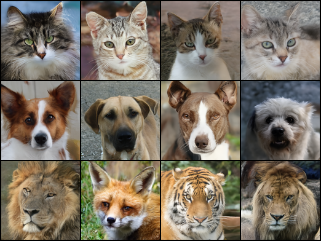
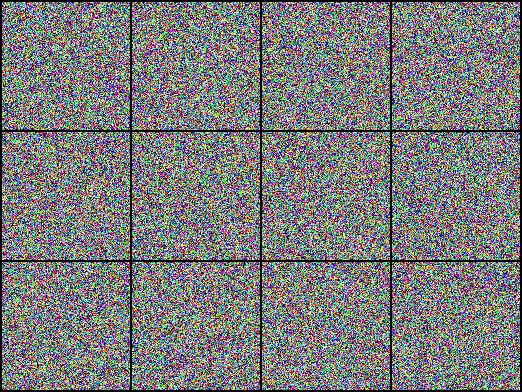
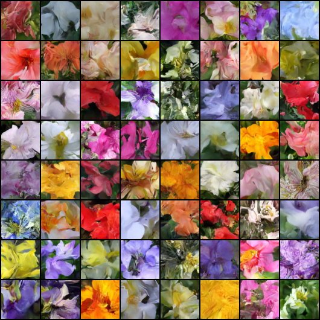
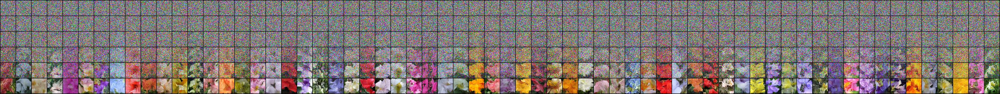

# Stochaflow

Stochaflow is a research-oriented Python framework for generative modeling
through probability paths, generative dynamics, and numerical samplers. The
current built-in implementation focuses on config-driven discrete-Gaussian
denoising training and DDPM/DDIM sampling. The maintained built-in runnable
configuration uses MNIST; the image data sources and recipes remain reusable by
projects targeting other compatible datasets.

The codebase is organized around registries and config-driven components. Thin
data builders, models, optional probability processes, complete samplers, task
sampling builders, training builders, artifact writers, objectives, diagnostics,
and loggers are selected through registries. Standard PyTorch optimizers and LR
schedulers use validated direct native target paths instead of copied Registry
aliases.

Start with the [framework overview](docs/framework.md) or the
[configuration and workflow handbook](docs/configuration/index.md).

## Scope

The normative architecture boundary, explicit non-goals, and admission criteria
for new core abstractions are defined in
[Stochaflow Architecture Scope and Non-goals](docs/design/scope.md). The summary
below describes the algorithm-family boundary; it is not a claim that every
listed family is already implemented.

Stochaflow is intended to grow across the probability-transport family of
generative methods. Its architectural scope includes diffusion and score-based
models, probability-flow ODEs, flow matching, rectified flows, stochastic
interpolants, continuous flows, and their ODE/SDE/discrete samplers. This is a
roadmap boundary, not a claim that every family is already implemented. These
methods may use stochastic or deterministic trajectories, but all transport
samples from a simple reference distribution toward a data distribution.

The project is not intended to define one universal abstraction for every
generative model. Autoregressive models, GANs, VAEs, energy-based models, and
discrete invertible flows may be integrated through compatible extension
lifecycles, but the core runtime will not acquire task-specific branches or
artificial Process/Sampler requirements solely to encompass them.

The architectural boundary is deliberately compositional, but it is not one
universal mathematical interface. The framework standardizes registration,
configuration, checkpointing, and the complete Sampler lifecycle. Each
algorithm family defines the Process and Dynamics capabilities it needs, while a
SamplingBuilder assembles compatible family components with task-specific
models, conditions, guidance, and initial states. Not every method is required
to use every role.

| Layer | Shared responsibility | Deliberately not shared |
| --- | --- | --- |
| Framework | Registry, config, checkpoint, `Sampler.sample()` lifecycle | Mathematical compatibility |
| Algorithm family | Cohesive optional Process, Dynamics, and Sampler contracts | A universal `predict`, `drift`, or `step` API |
| Task | Model adaptation, condition, guidance, initialization, artifacts | Core runner branches |

The implemented Gaussian family uses `DiscreteGaussianDenoisingProcess`,
`GaussianDenoisingDynamics`, and DDPM/DDIM. A future flow-matching or score-SDE
family may define a vector field or reverse SDE with its own compatible solver;
it does not need to implement Gaussian behavior or change the core runtime.

## Framework features

Implemented:

- discrete-Gaussian denoising training with epsilon/x0/v/score prediction targets
- model-free discrete Gaussian Process with marginal and posterior mathematics
- Gaussian model Dynamics with epsilon/x0/v/score prediction conversion
- registered DDPM and DDIM Samplers with one complete `sample()` interface and
  reusable discrete-Gaussian transition/schedule primitives
- registered SamplingBuilder composition and observer-based trajectories
- beta-native linear and alpha-bar-native cosine noise schedules
- a thin, modality-neutral `DataBuilder -> DataLoaders` extension contract
- built-in image, super-resolution-data, and multi-resolution image recipes;
  conditional super-resolution models and training/sampling composition remain
  project extensions
- torchvision and stable local image-folder sources for built-in recipes
- recipe-local holdout/K-fold, multi-source mixtures, and dynamic pixel batches
- registered tensor, image, and user-defined sampling artifact writers
- registered TrainingBuilder composition with thin task-specific TrainingStrategy
- reusable scalar Objectives and managed auxiliary modules for single-optimizer
  training compositions
- a fully exercised frozen-teacher distillation reference; offline and
  multi-teacher policies remain extension-defined rather than core modes
- UNet backbone with optional attention blocks
- EMA tracking and EMA sampling
- a project-owned warmup-cosine scheduler and validated direct native PyTorch
  optimizer/LR scheduler construction
- multi-sampler diffusion diagnostics with denoiser metrics and visual artifacts
- Rich terminal reporting, checkpointing, and local/TensorBoard/W&B logging
- one `stochaflow` CLI with `init`, `train`, and `sample` subcommands
- pytest, ruff, and pyright configuration

Still evolving:

- faster samplers and broader learned/perceptual evaluation metrics
- multi-optimizer and manual-optimization training loop families
- probability-flow ODE, flow-matching, rectified-flow, and continuous-flow
  implementations beyond the current diffusion baseline

## Installation

Once a package release is available from your configured Python package index,
install it into a virtual environment with:

```bash
python -m venv .venv
source .venv/bin/activate
python -m pip install stochaflow
stochaflow --help
```

Windows PowerShell uses `.venv\Scripts\Activate.ps1`. A local wheel can be
installed with `python -m pip install path/to/stochaflow.whl`.

Optional dependency groups:

| Extra | Purpose |
| --- | --- |
| `wandb` | Weights & Biases logging |
| `quality` | KID/FID dependency stack |
| `docs` | Sphinx documentation and research-figure toolchain |
| `dev` | Pytest, Ruff, and Pyright for source contributors |

TensorBoard support is part of the base installation; it does not need a
separate extra.

For development from a source checkout:

```bash
uv sync --extra dev
```

Add `--extra quality`, `--extra wandb`, or `--extra docs` when working on those
features. An editable pip workflow is also supported:

```bash
python -m pip install -e ".[dev]"
```

Platform notes:

- Python `>=3.12` is required.
- **Deprecated / best effort:** Intel macOS uses CPython 3.12 with pinned
  PyTorch/Torchvision wheels. It is no longer a fully supported target; the
  transitional install path and CI lane do not guarantee complete features,
  performance, or fixes. Its legacy PyTorch 2.2 DataLoader helper processes can
  hang during interpreter shutdown, so use `num_workers: 0`,
  `persistent_workers: false`, and `prefetch_factor: null` on that platform.
- The source checkout's `uv` configuration routes Windows GPU dependencies
  through the PyTorch CUDA 12.8 wheel index and can use Python 3.14.
- `trainer.device: auto` selects CUDA first, then Apple MPS when available,
  and otherwise falls back to CPU.
- Apple MPS does not support `float64` module parameters or Process buffers.
  Use `float32`, or select a CPU/CUDA device when double precision is required.

See the [platform support policy](docs/platform-support.md) for the current
validation matrix and the exact meaning of Deprecated / best effort.

Windows GPU setup example:

```powershell
uv python install 3.14
uv sync --python 3.14 --extra dev
uv run python -c "import torch; print(torch.__version__, torch.version.cuda, torch.cuda.is_available())"
```

## Extension projects

Create a package-manager-neutral extension repository with:

```bash
stochaflow init my-research-project
cd my-research-project
```

`init` writes an installable Python distribution, a small end-to-end extension,
and a runnable experiment config. It does not create an environment, install
dependencies, overwrite a non-empty directory, or require `uv`. Install the
generated distribution into the same Python environment as the Stochaflow CLI:

```bash
python -m venv .venv
source .venv/bin/activate
python -m pip install -e ".[test]"
stochaflow train --config experiments/example/train.yaml
```

If `stochaflow` is not available from the environment's package index, install a
local Stochaflow wheel first; the generated distribution declares Stochaflow as
a normal package dependency.

When the platform provides secure descriptor-relative filesystem operations,
`init` can also populate an existing empty real directory. On other platforms,
remove that empty directory and let `init` create it.

An optional `uv` workflow works as well:

```bash
uv sync --extra test
uv run stochaflow train --config experiments/example/train.yaml
```

The generated repository is an ordinary single Python distribution with room
for multiple experiments and unrelated research code. Stochaflow only discovers
the installed entry point and runs explicitly selected components; it does not
scan or manage the repository. Relative paths in configs and opaque builder
parameters resolve from the process working directory, so run the generated
example from the project root.

The package declares its aggregate registration module through standard Python
metadata:

```toml
[project.entry-points."stochaflow.extensions"]
my-research-project = "my_research_project.stochaflow_ext"
```

The experiment selects that exact entry-point name:

```yaml
extensions:
  plugins: [my-research-project]
```

Omitting `extensions` (or writing `plugins: []`) loads no third-party code;
`plugins: null` explicitly opts into every Stochaflow extension installed in the
current environment. Config parsing itself is side-effect free. Discovery,
checkpoint provenance checks, and plugin activation happen before Registry
components are constructed.

## Training

The following built-in examples are part of the source repository under
`examples/built-in/image-generation/`. Package users can start from the runnable
config generated by `stochaflow init`.

MNIST smoke run:

```bash
uv run stochaflow train \
  --config examples/built-in/image-generation/configs/train/mnist.yaml \
  --epochs 1 \
  --limit-batches 10 \
  --limit-validation-batches 2 \
  --limit-test-batches 2
```

The repository maintains one MNIST training config. DDPM and DDIM-50 are
checkpoint-backed sampling profiles, not duplicate training recipes:

```bash
uv run stochaflow sample \
  --checkpoint outputs/mnist/<run>/checkpoints/best.pt \
  --config examples/built-in/image-generation/configs/sample/mnist-ddpm.yaml

uv run stochaflow sample \
  --checkpoint outputs/mnist/<run>/checkpoints/best.pt \
  --config examples/built-in/image-generation/configs/sample/mnist-ddim-50.yaml
```

The sample files retain the current top-level `sampling:` request envelope.
Training diagnostics remain part of `configs/train/mnist.yaml`; choosing a
sampling profile does not change the training or checkpoint.

Separate CIFAR-10, Flowers102, and multi-source YAMLs are no longer maintained
as runnable built-in examples. This keeps the example surface focused and does
not remove the underlying reusable data-source or recipe capabilities.

Custom data builders are registered as classes and exposed through an installed
`stochaflow.extensions` entry point. A config activates them by plugin name; see
[Extensions and registries](docs/configuration/extensions.md).

Two installable vertical reference projects live under
`examples/extension-projects/`: a discrete-Gaussian Physics reconstruction
workflow and a frozen-teacher knowledge-distillation workflow. They exercise
data, training, checkpoint, and sampling extension boundaries without being
packaged into Stochaflow or adding task-specific runner branches. See the
[reference-project guide](docs/configuration/reference-projects.md).

For the complete YAML schema, framework-owned component parameters,
multi-source mixing, buckets, K-fold, logging, and CLI overrides, see the
[Configuration handbook](docs/configuration/index.md). Native optimizer and LR
scheduler constructor parameters follow the installed PyTorch version.

Extension authors can follow the independent tutorials for
[conditional Gaussian super-resolution](docs/tutorials/super-resolution.md),
[reusing the Gaussian family](docs/tutorials/reuse-gaussian-components.md), or
[adding a custom generation family/direct transform](docs/tutorials/custom-generation-family.md).
The [checkpoint and portability guide](docs/configuration/compatibility-and-migration.md)
documents config authority and checkpoint/environment boundaries, while the
[public extension API reference](docs/api/extensions.md) lists the supported
third-party import surface. The
[framework overview](docs/framework.md) records the stable architecture and
extension responsibilities.

If `--epochs` is omitted, the runner uses `trainer.num_epochs` from the YAML
config. Passing `--epochs` is an explicit run-time override.

Useful training options:

```bash
--resume CHECKPOINT           Strictly resume saved config and full training state.
--observability-config PATH   Replace resume diagnostics and selected logging fields.
--device DEVICE               Override trainer.device for this run.
--output-dir PATH             Use PATH as the training output root for this run.
--deterministic               Enable PyTorch deterministic algorithms for this process.
--skip-final-sample           Skip this run's configured post-training inference.
--progress                    Enable Rich progress bars, including on strict resume.
--no-progress                 Disable Rich terminal progress bars.
--force-extension-version-mismatch
                              Accept a plugin version mismatch after identity checks.
```

`--deterministic` enables PyTorch's strict deterministic-algorithm mode; an
operation without a deterministic implementation fails instead of silently
falling back to a nondeterministic kernel. A fixed seed is still required, and
cross-device or cross-version bitwise equality is not promised.

`--config` and `--resume` are mutually exclusive. Resume always uses the config
stored in the checkpoint; it is not a weights-only warm start and never reopens
the previous output directory. Passing a directory to `--resume` selects the
most recently modified `latest.pt` below it. Without `--output-dir`, the new
timestamped run is created under the resumed run's parent directory. With
`--output-dir`, it is created under that explicit root instead.

Strict resume can change only its observation surface with
`--observability-config`; this option is invalid for fresh `--config` training.
The file accepts exactly the top-level `diagnostics` and `logging` sections.
`diagnostics` replaces the complete saved list. Within `logging`, only explicitly
declared fields replace checkpoint values, and an explicit `backends` list
replaces the complete saved backend list. For example, the repository profile
keeps the checkpoint `log_every` while enabling local and TensorBoard output:

```bash
uv run stochaflow train \
  --resume outputs/mnist/<run>/checkpoints/latest.pt \
  --observability-config \
    examples/built-in/image-generation/configs/overlays/mnist-observability.yaml
```

Diagnostics and logger resources are observation-only and have no restored
checkpoint state. The effective sections and overlay provenance are frozen into
the new resolved config, manifest, and checkpoints. This is a startup-time
configuration, not hot loading: resume creates a new sibling run with new local
logs and TensorBoard event files, and never appends to or reopens the old run.

For strict best-selection continuity, resume a run directory or keep the matching
`best.pt` beside any `latest.pt`/epoch checkpoint you move. Its recorded best
resolved config, extension provenance, epoch, metric, monitor, and mode must
match the selected checkpoint; a mutable `best.pt` produced by a later epoch
cannot resume an older snapshot. A standalone
best checkpoint is self-sufficient because its metadata identifies it as the
selected best. Resume materializes the validated best in the new run before
training, so later resume and sampling do not depend on the parent run.
Strict resume also restores the checkpointed Python, NumPy, Torch CPU, and
applicable CUDA/MPS RNG streams after all selected/best state validation.
Only checkpoint v10 is supported; older formats are not migrated. A device
override remains allowed, but matching runtime and device topology is necessary,
not sufficient, for bitwise continuity. DataBuilder, Dataset, loader, worker,
and sampler runtime state is not checkpointed. The built-in image recipes
rebuild shuffled index order from the configured seed and epoch; worker-side
random crop/flip state is not restored and therefore is not guaranteed to match
an uninterrupted run. Custom stochastic loaders own the same boundary and must
derive each epoch from the configured seed and a duck-typed `set_epoch(epoch)`
contract when continuity matters.

A training run creates a timestamped directory under `experiment.output_dir` or
the root selected with `--output-dir`. The following tree is illustrative:
comments mark artifacts controlled by logger, checkpoint, diagnostic, sampling,
or writer configuration.

```text
<output-root>/<YYYYMMDD_HHMMSS[_NN]>/
  checkpoints/
    best.pt
    latest.pt
    epoch_XXXX.pt                    # checkpoint cadence
  metrics.jsonl                     # configured local logger/filename
  train.log                         # configured local logger/filename
  resolved_config.yaml
  run_manifest.yaml
  tensorboard/                      # configured TensorBoard logger
    <experiment-name>/
      events.out.tfevents.*
  samples/                          # final sampling enabled
    final/
      samples.png                   # image writer
      samples.pt                    # tensor writer
      trajectory.pt/png/gif        # trajectory + compatible writers
      resolved_sampling.yaml
  diagnostics/                      # configured diagnostics and cadence
    diffusion_quality/
      epoch_XXXX/
        manifest.yaml
        denoiser/
        <sampler-profile>/
```

### AFHQ-v2 class-conditional ADM showcase

The reference AFHQ-v2 ADM run completed 200 epochs and 84,000 optimizer
steps. Periodic EMA snapshots were screened under one fixed sampling protocol,
then the three finalists were evaluated with the checked-in class-aware
KID/FID protocol. Aggregate FID was the primary selection metric and aggregate
KID was the secondary metric. The selected epoch also happened to minimize the
raw-model validation loss, although that loss was not used as a substitute for
generation-quality evaluation.

| Evaluation | Result |
|---|---:|
| Selected checkpoint | `epoch_0170.pt` EMA at epoch 170 / step 71,400 |
| Best raw-model validation loss | **0.06446** |
| Raw-model test loss after best-checkpoint restore | **0.06782** |
| Aggregate FID | **30.240** |
| Aggregate KID | **0.005310 ± 0.000701** |
| Per-class FID (cat / dog / wild) | **37.965 / 58.565 / 24.352** |

The generation metrics use 300 official-test real images and 300 generated
images per class: 900 real and 900 fake images in aggregate. Sampling uses the
checkpoint's EMA weights, deterministic DDIM-50 (`eta: 0`), CFG 2.0, and seed
`20260726`; FID uses Inception features and KID uses 100 subsets of 300
samples. These are fixed-protocol, 900-sample estimates rather than 50,000-image
benchmark scores. The selected checkpoint SHA-256 is
`ea43404395d884c03fd7b130f407e5ace6c35b2336d2c5bd073f630828c2e4ce`.

The panel is the complete fixed-seed output of the README sampling profile,
not a post-generation selection. Rows are cat, dog, and wild:

<p align="center">
  
</p>

The corresponding six-frame reverse trajectory runs from terminal noise to the
same sample batch:

<p align="center">
  
</p>

The exact sampling and evaluation profiles are
[`ddim50-cfg2-readme.yaml`](examples/showcases/afhq-v2/experiments/sampling/ddim50-cfg2-readme.yaml)
and
[`ddim50-cfg2-kid-fid.yaml`](examples/showcases/afhq-v2/experiments/evaluation/ddim50-cfg2-kid-fid.yaml):

```bash
uv run --project examples/showcases/afhq-v2 stochaflow sample \
  --checkpoint outputs/afhq-v2/adm-128/<run>/checkpoints/epoch_0170.pt \
  --config examples/showcases/afhq-v2/experiments/sampling/ddim50-cfg2-readme.yaml \
  --device cuda \
  --output-dir outputs/afhq-v2/showcase/ddim50-cfg2-epoch-0170

uv run --project examples/showcases/afhq-v2 stochaflow-afhq-v2-evaluate \
  --checkpoint outputs/afhq-v2/adm-128/<run>/checkpoints/epoch_0170.pt \
  --config examples/showcases/afhq-v2/experiments/evaluation/ddim50-cfg2-kid-fid.yaml \
  --device cuda \
  --output-dir outputs/afhq-v2/evaluations/ddim50-cfg2-epoch-0170
```

### MNIST checkpoint showcase

The reference MNIST DDPM run completed 200 epochs and 78,000 optimizer steps.
Checkpoint selection used the held-out validation denoising loss, whose minimum
occurred at epoch 183. The test loss below was measured after restoring that
checkpoint. These losses evaluate the v-prediction denoising objective; they are
not perceptual-quality scores.

| Evaluation | Result |
|---|---:|
| Selected checkpoint | `best.pt` at epoch 183 / step 71,370 |
| Best validation loss | **0.07189** |
| Test loss after best-checkpoint restore | **0.07363** |
| Epoch-200 validation loss | 0.07327 |

The panels below use the selected checkpoint's EMA weights, one fixed seed
(`123`), and the complete 36-sample batch. DDPM performs 1,000 model evaluations;
deterministic DDIM (`eta: 0`) uses 50, a 20-fold reduction. Both begin from the
same terminal-noise batch.

| DDPM (1,000 model evaluations) | DDIM (50 model evaluations) |
|:---:|:---:|
|  |  |

The animations retain six matched points across the reverse process, from
terminal noise to the complete sample batch:

| DDPM trajectory | DDIM-50 trajectory |
|:---:|:---:|
|  |  |

The exact sampling profiles are
[`mnist-ddpm.yaml`](examples/built-in/image-generation/configs/sample/mnist-ddpm.yaml)
and
[`mnist-ddim-50.yaml`](examples/built-in/image-generation/configs/sample/mnist-ddim-50.yaml):

```bash
uv run stochaflow sample \
  --checkpoint outputs/mnist/<run>/checkpoints/best.pt \
  --config examples/built-in/image-generation/configs/sample/mnist-ddpm.yaml \
  --device cuda \
  --output-dir outputs/mnist/showcase/ddpm-epoch-0183

uv run stochaflow sample \
  --checkpoint outputs/mnist/<run>/checkpoints/best.pt \
  --config examples/built-in/image-generation/configs/sample/mnist-ddim-50.yaml \
  --device cuda \
  --output-dir outputs/mnist/showcase/ddim-50-epoch-0183
```

Each panel is the complete output of its fixed-seed command rather than a
post-generation selection.

### Historical Oxford Flowers 102 artifact

These images are illustrative artifacts from an earlier long-running
experiment; the selected epoch is recorded in each filename. The repository no
longer maintains a corresponding runnable Flowers102 config.

DDPM samples:



Reverse-process trajectory:



## Training diagnostics

The `diffusion_quality` diagnostic can compare multiple sampler profiles against
the same denoiser during training. Profiles receive identical fixed terminal
noise, use EMA weights when configured, and report under independent metric
namespaces. Depending on the enabled providers, step hooks can record
timestep-bucket loss, noise statistics, cosine similarity, and fixed-timestep
reconstruction MSE/PSNR; epoch hooks can write sample, reconstruction, and
trajectory panels and record sample statistics and latency.

The implementation is a provider pipeline under `training/diagnostics/`.
Step metrics, sampler metrics, denoiser artifacts, sampler artifacts, and
reference metrics have separate registries. Diagnostic-local modules can register a new
provider and enable it from `diagnostics[].params.modules` without modifying the
`diffusion_quality` orchestrator; explicit empty provider lists disable a phase.

Images are saved locally and forwarded to every configured TensorBoard or W&B
logger. Optional KID/FID evaluation uses a fixed validation reference cache and
requires the `quality` extra, an enabled reference-metric provider, a validation
loader, and locally available or downloadable Inception weights. On MPS, FID
feature accumulation and distance computation run on CPU because the required
double-precision linear algebra is not available on MPS; KID keeps the configured
runtime device. The maintained MNIST training config uses a 41.7M-parameter
attention UNet, cosine alpha-bar noise schedule, v-prediction target, step-wise
warmup-cosine learning rate, and EMA. It owns a lightweight DDIM-50 diagnostic
profile and disables reference metrics. The standalone DDPM/DDIM YAMLs are
sampling profiles and do not configure training diagnostics.

Launch TensorBoard against one experiment's output root:

```bash
tensorboard --logdir outputs/mnist/<run>/tensorboard
```

For run comparison, metric interpretation, diagnostic images, and troubleshooting,
see the [TensorBoard guide](docs/tutorials/tensorboard.md).

## Checkpoint-backed inference

`stochaflow sample` is the common checkpoint-backed inference operation for
generation, reconstruction, and prediction. A v10 checkpoint contains model
state, resolved experiment config, and an `inference_recipe` that fixes the
internal SamplingBuilder identity and its non-overridable training contract.
A YAML request is optional only when the checkpoint already contains complete
request defaults. The maintained MNIST authoring file intentionally does not
declare a sampler, shape, or writers; its resolved v10 defaults are not a
complete invocation, so select one of its sample profiles explicitly.
`--checkpoint` is always required. Extension-backed checkpoints also
require their recorded distributions to be installed in the CLI environment. A
checkpoint file is used exactly; a directory selects the most recently modified
`best.pt` below it:

```bash
uv run stochaflow sample \
  --checkpoint outputs/mnist/<run>/checkpoints/best.pt \
  --config examples/built-in/image-generation/configs/sample/mnist-ddpm.yaml
```

Adjust request-level settings such as output count or a replaceable Sampler with
a partial request:

```yaml
sampling:
  shape: [1, 32, 32]
  num_samples: 36
  batch_size: 12
  seed: 123
  sampler:
    name: ddim
    params: {num_inference_steps: 50, eta: 0.0}
  options:
    weights: ema
    trajectory: {enabled: true, every_steps: 10}
  writers:
    - {name: tensor, params: {}}
    - {name: image, params: {grid_nrow: 6, gif_fps: 3}}
```

```bash
uv run stochaflow sample \
  --checkpoint outputs/<run>/checkpoints/best.pt \
  --config path/to/sample-request.yaml
```

The request root may contain only `sampling` and optional `extensions`.
`sampling.run_after_training` and `sampling.builder` are forbidden: the former
belongs to training and the latter comes from the checkpoint recipe. Omitted
fields inherit checkpoint defaults. `sampling.options` shallow-merges by key;
explicit `sampling.sampler` and `sampling.writers` atomically replace their
checkpoint declarations. Options cannot override fixed recipe contract fields,
such as Gaussian `prediction_type`. `extensions.plugins` is additive and cannot
remove checkpoint-required plugins or select all installed plugins with null.

Sampler selection and solver parameters belong to `sampling.sampler`; the CLI
intentionally has no sampler-specific flags. A checkpoint recipe may instead
construct conditions, guidance, multiple internal components, or an initial
state without requiring `sampling.shape`.

For the standard recipe, `sampling.options.weights: auto` uses EMA model weights when
`ema.enabled` and `ema.use_for_sampling` are both true and otherwise uses raw
weights. Explicit `weights: raw` or `weights: ema` overrides that policy; asking
for unavailable EMA weights fails. Declared `sampling.writers` decide the
outputs: `tensor` writes PT files, `image` validates NCHW data and writes PNG/GIF
artifacts, and extensions can write domain formats such as NetCDF. Every
successful inference invocation also writes `resolved_sampling.yaml`.

Default output uses a unique timestamp directory below the checkpoint run.
Explicit `--output-dir` is the exact artifact directory, not a parent for an
automatically timestamped child; use a new empty path for formal or concurrent
runs because ordinary sampling writers are not transactional publishers.

Sampling artifacts currently use a materialized lifecycle: a Builder returns all
batches and retained trajectory states before any writer runs. The built-in
Standard Builder moves writer-ready tensors to CPU; the public contract does not
force custom outputs onto a particular device. This is not a streaming contract.
The conservative Physics AI profile is 1,272 float32 states
shaped `[3, 256, 256]` with trajectory disabled; a domain writer may persist only
the center field after per-batch metrics are computed. Full dense trajectories at
that scale are unsupported. Trajectory visualization must use a separate preview
run with at most 8 samples, no more than 40 accepted steps, and
`every_steps >= 10`. See the
[sampling capacity guide](docs/configuration/sampling-capacity.md) for the exact
payload formulas and the distinction between analytical bounds and host-specific
RSS measurements.

## Configuration

The source repository's built-in image-generation example configurations live
under `examples/built-in/image-generation/configs/`; the CLI accepts a
config path from any location.

```text
examples/built-in/image-generation/configs/
├── train/mnist.yaml
├── sample/mnist-ddpm.yaml
├── sample/mnist-ddim-50.yaml
└── overlays/mnist-observability.yaml
```

`train/mnist.yaml` is the only maintained built-in training run. The two
`sample/` files are alternative partial requests for one compatible checkpoint,
and therefore keep the current top-level `sampling:` envelope. The
observability overlay remains train-owned and is valid only for strict resume.

Important sections:

- `experiment`: run name, seed, and output directory
- `extensions`: installed entry-point plugins activated for this component graph
- `data`: registered builder name plus builder-owned parameters
- `model`: registered model name and constructor parameters
- `training`: registered TrainingBuilder and builder-owned task parameters
- `process`: optional registered model-free probability process and its parameters
- `objective`: optional reusable scalar training objective
- `optimizer`: a validated direct `torch.optim.<Class>` target or extension name,
  plus constructor keyword arguments
- `lr_scheduler`: an optional validated direct
  `torch.optim.lr_scheduler.<Class>` target or extension name, its constructor
  keyword arguments, and the Stochaflow step/epoch lifecycle interval
- `ema`: optional exponential moving average tracking and sampling policy
- `sampling`: post-training execution policy plus checkpoint inference request
  defaults (`sampler`, task options, shape/batching, seed, and writers)
- `diagnostics`: optional registered training-lifecycle diagnostics
- `trainer`: loop, device, gradient, and early stopping policy
- `logging`: metric logging backends
- `artifacts`: checkpoint cadence

The built-in image recipes provide these private partition modes:

- `holdout`: deterministic train/validation split from a finite source
- `official`: source-provided train/validation/test roles
- `none`: build only a training split
- `kfold`: one deterministic fold per independent run

These modes are recipe capabilities, not requirements on custom DataBuilders.
K-fold requires both `num_folds` and `fold_index`; running all folds is left to
a project script or sweep. The portable `loader.pin_memory` default is `false`;
CUDA users may opt in after measuring their input pipeline, while MPS users
should normally leave it disabled.

Native optimizer and LR-scheduler targets must be direct classes in their
respective PyTorch namespaces and preserve Stochaflow's automatic-loop
lifecycle: `step()` must be callable without required arguments, and an LR
scheduler must retain the optimizer injected by Stochaflow. Closure-required
optimizers and metric-argument schedulers therefore need a different explicitly
supported training lifecycle.

## Architecture

`src/stochaflow/data/`
: the thin DataBuilder contract plus private image, super-resolution, source,
  partition, and bucket recipe implementations.

`src/stochaflow/models/`
: UNet, residual blocks, attention blocks, and timestep embeddings.

`src/stochaflow/processes/`
: model-free Process roots, Gaussian probability-path capabilities, concrete
  processes, and class-based `noise_schedules/` parameterizations.

`src/stochaflow/training/`
: TrainingBuilder/Plan/Strategy contracts, built-in supervised and Gaussian
  training composition, objectives, managed auxiliary assets, trainer lifecycle,
  diagnostics, reporting, and EMA. Builders own dependency composition; Strategies
  own only batch-to-loss/metrics computation.

`src/stochaflow/sampling/`
: unified Samplers and observers, checkpoint-selected task SamplingBuilders,
  checkpoint-backed inference runtime, and registered tensor/image artifact writers.

`src/stochaflow/extensions/`
: the stable public import surface for extension authors.

`src/stochaflow/projects/`
: package-manager-neutral extension-project scaffolding and templates.

`src/stochaflow/utils/`
: config loading, registries, factories, checkpointing, logging, and seeding.

`src/stochaflow/scripts/`
: unified CLI dispatch plus training command orchestration.

## Development

For routine iteration, run Ruff, Pyright, and focused tests for the changed
behavior:

```bash
uv run ruff check .
uv run pyright
uv run pytest tests/test_ddpm_shapes.py tests/test_sampling_runtime.py
```

Before merging a complete feature branch, run the full test suite and any
additional build, documentation, or acceptance checks required by that feature:

```bash
uv run pytest
```

## Repository Layout

```text
stochaflow/
  examples/
    built-in/image-generation/experiments/
    extension-projects/
    showcases/
  src/stochaflow/
    data/
    processes/
    extensions/
    models/
    projects/
    sampling/
    scripts/
    training/
    utils/
  tests/
  assets/
```

## License

This project is released under the [MIT License](LICENSE).
