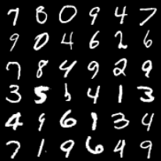
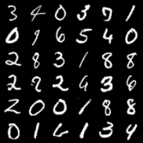
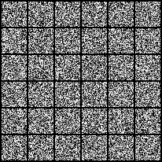

# Stochaflow

Stochaflow is a configuration-driven, extensible research framework for
generative modeling. It provides the reusable workflow around an experiment:
data preparation, component composition, training, strict resume,
checkpoint-backed inference, diagnostics, logging, and output artifacts.

The maintained implementation currently focuses on **pixel-space discrete
Gaussian diffusion**:

- unconditional generation with a UNet;
- unconditional or class-conditional generation with a canonical ADM U-Net,
  plus class-conditional pixel-space DiT;
- epsilon, x0, v, and score prediction targets;
- fixed or learned-range Gaussian variance, including the learned-range hybrid
  variational bound and epsilon-only P2 simple-loss weighting;
- full and uniformly respaced ancestral DDPM, DDIM, EMA weights, trajectories,
  and classifier-free guidance.

Stochaflow is pre-1.0 research software and currently permits breaking changes.
Latent diffusion, pretrained autoencoder integration, Stable Diffusion
components, flow matching, and distributed training are development directions,
not implemented capabilities. See the [framework overview](docs/framework.md)
for current behavior and the [architecture scope](docs/design/scope.md) for the
long-term boundary.

## Quick start

### Install the release wheel and run an example

Stochaflow requires Python 3.12 or newer. The default user path installs the
published wheel and does not require a Stochaflow source checkout or `uv`:

```bash
python -m venv .venv
source .venv/bin/activate
python -m pip install \
  https://github.com/supermassiveasshole/stochaflow/releases/download/v0.1.0/stochaflow-0.1.0-py3-none-any.whl
stochaflow init my-research-project
cd my-research-project
python -m pip install -e .
stochaflow train --config experiments/example/train.yaml
```

On Windows PowerShell, activate the environment with
`.venv\Scripts\Activate.ps1`. The generated project is a normal installable
extension with a tiny two-epoch example, tests, strict-resume support, and a
checkpoint-backed sampling recipe. Its run is written below
`my-research-project/outputs/example/<run>/`.

To smoke-test the maintained MNIST example without cloning the repository,
download the standalone config from the matching release tag and bound every
data phase:

```bash
curl --fail --location --output mnist.yaml \
  https://raw.githubusercontent.com/supermassiveasshole/stochaflow/v0.1.0/examples/built-in/image-generation/configs/train/mnist.yaml
stochaflow train \
  --config mnist.yaml \
  --epochs 1 \
  --limit-batches 10 \
  --limit-validation-batches 2 \
  --limit-test-batches 2
```

On Windows PowerShell, use `curl.exe` for the download command. The bounded
MNIST run verifies the workflow; it is not a converged quality run.

If the example works for you, visit the
[Stochaflow repository on GitHub](https://github.com/supermassiveasshole/stochaflow)
to explore the source, report issues, or star the project.

### Run the built-in MNIST example from source

Repository-owned example configs are intentionally not installed as package
data. From a source checkout, install the locked development environment:

```bash
uv sync --extra dev
```

Run a bounded MNIST training job:

```bash
uv run stochaflow train \
  --config examples/built-in/image-generation/configs/train/mnist.yaml \
  --epochs 1 \
  --limit-batches 10 \
  --limit-validation-batches 2 \
  --limit-test-batches 2
```

The run is written below `outputs/mnist/<run>/`. Sample from its best
checkpoint with either maintained profile:

```bash
uv run stochaflow sample \
  --checkpoint outputs/mnist/<run>/checkpoints/best.pt \
  --config examples/built-in/image-generation/configs/sample/mnist-ddpm.yaml

uv run stochaflow sample \
  --checkpoint outputs/mnist/<run>/checkpoints/best.pt \
  --config examples/built-in/image-generation/configs/sample/mnist-ddim-50.yaml
```

The training command may download and materialize MNIST under `./data`. The two
sample profiles reuse the same trained checkpoint; choosing DDPM or DDIM does
not require retraining.

## Current capability

| Area | Implemented today |
| --- | --- |
| Data | Verified managed and referenced data artifacts; image, class-labeled image, super-resolution data, and multi-resolution image recipes |
| Models | Unconditional UNet, canonical unconditional/class-conditional ADM U-Net, and class-conditional pixel-space DiT |
| Training | Unconditional and class-conditional Gaussian denoising; fixed or learned-range variance; constant or epsilon-only P2 simple-loss weighting; supervised training, mixed precision, gradient accumulation, EMA, and a single-optimizer automatic loop |
| Probability process | Discrete variance-preserving Gaussian process with linear-beta and cosine-alpha-bar schedules, selected-pair marginal coefficients, and learned-range variance bounds |
| Sampling | Full or uniformly respaced ancestral DDPM, DDIM, class allocation, classifier-free guidance, trajectory observation, and Tensor/PNG/GIF writers |
| Runtime | Registry-based composition, explicit extension activation, checkpoint v11 strict resume, checkpoint-backed inference, local/TensorBoard/W&B logging, and training diagnostics |
| CLI | `stochaflow init`, `stochaflow train`, and `stochaflow sample` |

The built-in `super_resolution` capability covers paired data and degradation
recipes. A complete conditional super-resolution model, training strategy, and
sampling composition remain project responsibilities.

Standard PyTorch optimizers and learning-rate schedulers are selected through
validated native `torch.optim.*` and `torch.optim.lr_scheduler.*` targets.
Stochaflow does not copy the upstream namespaces or every constructor parameter
into its own Registry.

## Maintained examples

The actively maintained example surface is deliberately small:

| Example | Role | Current status |
| --- | --- | --- |
| [MNIST](examples/built-in/image-generation/README.md) | Minimal built-in image-generation workflow | One train config, DDPM/DDIM sample profiles, and a resume observability overlay |
| [AFHQ-v2](examples/showcases/afhq-v2/README.md) | Installable class-conditional data-source showcase | Corrected ADM and pixel DiT production configs with aggregate and per-class evaluation |

Separate CIFAR-10, Flowers102, and multi-source training YAMLs are not maintained.
Their removal does not remove the underlying reusable data sources or recipes.
The Physics reconstruction and knowledge-distillation directories are legacy
reference implementations retained temporarily for cleanup; they are outside
the maintained example and compatibility surface.

### MNIST DDPM and DDIM

The reference MNIST run completed 200 epochs and 78,000 optimizer updates.
Checkpoint selection used validation denoising loss; the minimum occurred at
epoch 183.

| Evaluation | Result |
| --- | ---: |
| Selected checkpoint | `best.pt`, epoch 183 / step 71,370 |
| Best validation loss | **0.07189** |
| Test loss after restoring the best checkpoint | **0.07363** |

These are v-prediction denoising losses, not perceptual-quality metrics. The
panels use the same EMA checkpoint, seed, and terminal-noise batch. DDPM performs
1,000 model evaluations; deterministic DDIM uses 50.

| DDPM, 1,000 evaluations | DDIM, 50 evaluations |
| :---: | :---: |
|  |  |

| DDPM trajectory | DDIM-50 trajectory |
| :---: | :---: |
|  |  |

The corresponding sample profiles are
[`mnist-ddpm.yaml`](examples/built-in/image-generation/configs/sample/mnist-ddpm.yaml)
and
[`mnist-ddim-50.yaml`](examples/built-in/image-generation/configs/sample/mnist-ddim-50.yaml).
The referenced trained checkpoint is not distributed.

### AFHQ-v2 and the corrected ADM topology

The maintained `adm_unet` now follows the canonical ADM input/output block
graph: the initial projection, every encoder residual block, and every
downsample enter the skip ledger; each decoder level contains `R + 1` residual
blocks and consumes one skip per block. `attention_resolutions` names actual
spatial sizes, and attention is GroupNorm/QKV/residual attention rather than a
stage-end Spatial Transformer. The maintained AFHQ-128 configuration contains
105,197,187 parameters.

This is a breaking model cutover. Configurations using the removed transformer
depth and topology switches are rejected, and checkpoints made by the previous
ADM implementation cannot be sampled, resumed, partially loaded, or converted.
Start a fresh run. Results published before this cutover were produced by that
incompatible topology and are intentionally not presented as current AFHQ
results; the corrected production model does not yet have a published
long-training quality result.

Separately, every newly built Gaussian checkpoint freezes
`variance.mode`—including `fixed`—beside `prediction_type`. Current v11
checkpoints also persist the complete metric-monitor policy and
observation-based patience state. Pre-change v10 checkpoints are not migrated;
the framework does not patch their saved training recipe.

The repository includes:

- the corrected
  [ADM-UNet training config](examples/showcases/afhq-v2/experiments/production/train-adm-128.yaml);
- a runnable
  [pixel DiT-B/8 training config](examples/showcases/afhq-v2/experiments/production/train-dit-128.yaml),
  for which this README does not claim a completed quality result;
- checkpoint-backed DDIM/CFG sampling and class-aware evaluation profiles that
  report aggregate and per-class KID/FID for cat, dog, and wild.

The dataset source is approximately 6.96 GB and is licensed CC BY-NC 4.0.
Review the [AFHQ-v2 guide](docs/tutorials/afhq-v2.md) before downloading or
training. The maintained example evaluates the complete class-conditional
surface; it does not add a separate single-class reproduction workflow.

### Gaussian variance, P2, and respaced DDPM

Gaussian training defaults remain `variance: {mode: fixed}` and
`loss_weighting: {name: constant}`. Learned-range mode expects `2C` model
channels: the first `C` predict the denoising target and the second `C`
interpolate between selected-pair posterior and forward log-variance bounds.
Its hybrid loss adds `0.001 ×` the full, unweighted variational bound; the
uniform single-timestep estimator implements that as `T / 1000 ×` its sampled
VB term, with the mean-prediction branch detached.

P2 is a Gaussian training policy, not an Objective or sampling option. With
epsilon prediction it applies
`(k + alpha_bar_t / (1 - alpha_bar_t)) ** (-gamma)` to each sample's simple
loss without batch renormalization; it never weights the variance term.
Diagnostic `timestep_loss_weight` records this optimization coefficient and is
unrelated to any `loss_aggregation_weight` used to combine batches for metrics.

`ddpm.num_inference_steps: 250` selects a uniform-section, selected-pair
ancestral path. It is not DDIM-250 and does not combine a non-adjacent mean with
adjacent variance. DDIM keeps its own generalized transition and ignores a
learned variance head. For class-conditional learned variance, CFG guides only
the prediction half; scales other than 0 or 1 retain the conditional variance
half, while scales 0 and 1 return the complete unconditional or conditional
branch respectively.

## Composition boundaries

Stochaflow standardizes workflow lifecycles without turning YAML into an
arbitrary Python object graph.

### Data

```text
DataSource -> DataArtifact -> DataBuilder -> DataLoaders
```

- `DataSource` acquires, validates, transforms, and materializes external data.
- `DataArtifact` is the verified, identity-bearing result of that producer
  lifecycle.
- `DataBuilder` is the runtime data-recipe composition root. It owns artifact
  binding, partitioning, Dataset views, transforms, PyTorch samplers, collate
  behavior, and loaders.
- Core training code consumes structured batches without imposing image,
  condition, target, or metadata fields.

A new source can reuse an existing DataBuilder only when both its complete
artifact contract and the required runtime recipe semantics are compatible.
Different partition, streaming, sampler, resume, or batch semantics require a
new recipe-level DataBuilder—not a Builder for every Dataset class. See
[Data configuration and pipelines](docs/configuration/data-pipeline.md).

### Training and inference

```text
DataLoaders + configured components
  -> TrainingBuilder
  -> TrainingPlan
  -> Trainer
  -> checkpoint

checkpoint + sample profile
  -> checkpoint-owned SamplingBuilder recipe
  -> Sampler
  -> artifact writers
```

`TrainingBuilder` owns task composition. A thin `TrainingStrategy` interprets
batches and computes loss and metrics; the framework owns device, precision,
optimization, EMA, and checkpoint lifecycles.

`Sampler` owns a complete numerical sampling algorithm. `SamplingBuilder` owns
task concerns such as model adaptation, conditions, guidance, initialization,
and compatibility. The core runner does not maintain a global
model/process/sampler compatibility matrix.

## Configuration, sampling, and resume

The maintained built-in authoring tree is:

```text
examples/built-in/image-generation/configs/
├── train/mnist.yaml
├── sample/mnist-ddpm.yaml
├── sample/mnist-ddim-50.yaml
└── overlays/mnist-observability.yaml
```

The MNIST train config contains one training recipe. The two sample files are
checkpoint-backed profiles with the current top-level `sampling:` request
envelope; they choose request-time solver, output, and writer settings without
selecting an internal SamplingBuilder. Current checkpoint v11 remains
authoritative for the fixed inference recipe.

Strict resume restores the saved configuration and full training state:

```bash
uv run stochaflow train \
  --resume outputs/mnist/<run> \
  --epochs 200
```

`--config` and `--resume` are mutually exclusive. A resume run may replace only
its observation surface through `--observability-config`, for example:

```bash
uv run stochaflow train \
  --resume outputs/mnist/<run> \
  --observability-config \
    examples/built-in/image-generation/configs/overlays/mnist-observability.yaml
```

Only checkpoint format v11 is currently accepted; older formats are not
migrated. Strict resume guarantees only the state explicitly owned by the
framework and does not promise cross-device or cross-version bitwise equality.
See the [configuration handbook](docs/configuration/index.md) and
[checkpoint and portability guide](docs/configuration/compatibility-and-migration.md)
for field definitions, override authority, RNG boundaries, and artifact-binding
rules.

## Create an extension project

Generate a normal installable Python project:

```bash
stochaflow init my-research-project
```

The scaffold includes an extension entry point, a small custom data/training/
sampling vertical slice, a train config, and tests. Stochaflow discovers only
installed entry points selected by configuration; it does not scan arbitrary
source directories. Complex task composition stays in Python Builders and
Strategies rather than a universal YAML graph.

Extension authors should use the stable imports documented in the
[public extension API](docs/api/extensions.md). See
[Extensions and registries](docs/configuration/extensions.md) for activation,
packaging, provenance checks, and the generated project workflow.

## Installation and platforms

The current GitHub Release provides a universal Python wheel, source
distribution, SHA-256 checksums, and GitHub build-provenance attestations. To
install the v0.1.0 wheel directly:

```bash
python -m pip install \
  https://github.com/supermassiveasshole/stochaflow/releases/download/v0.1.0/stochaflow-0.1.0-py3-none-any.whl
```

The assets and generated release notes are on the
[v0.1.0 release page](https://github.com/supermassiveasshole/stochaflow/releases/tag/v0.1.0).
After downloading an asset, its provenance can be checked with GitHub CLI:

```bash
gh attestation verify \
  stochaflow-0.1.0-py3-none-any.whl \
  --repo supermassiveasshole/stochaflow
```

For source development, `uv sync --extra dev` installs Pytest, Ruff, and
Pyright. Optional extras are independent:

| Extra | Purpose |
| --- | --- |
| `quality` | KID/FID dependencies |
| `wandb` | Weights & Biases logging |
| `docs` | Sphinx and documentation tooling |
| `dev` | Tests, linting, and type checking |

TensorBoard and the TorchMetrics-backed phase metric runtime are part of the
base installation; `quality` only adds KID/FID dependencies. To build a local
wheel and source distribution:

```bash
uv build
```

Supported validation targets are Linux x86_64, Windows x86_64, and macOS arm64.
Intel macOS is **Deprecated / best effort** and retains a transitional pinned
dependency path; it must not be assumed to support every current feature. The
source checkout routes Windows GPU dependencies through PyTorch's CUDA 12.8
wheel index. See the [platform support policy](docs/platform-support.md) for the
current Python and CI matrix.

`trainer.device: auto` selects CUDA, then Apple MPS, then CPU. Apple MPS cannot
run managed modules with float64 or complex128 parameters or buffers, including
Process state.

## Documentation

- [Framework features and architecture](docs/framework.md)
- [Metrics, training diagnostics, and model selection](docs/metrics.md)
- [Configuration and workflow handbook](docs/configuration/index.md)
- [Data configuration and pipelines](docs/configuration/data-pipeline.md)
- [Extension API](docs/api/extensions.md)
- [Checkpoint compatibility and migration](docs/configuration/compatibility-and-migration.md)
- [MNIST built-in image-generation workflow](examples/built-in/image-generation/README.md)
- [AFHQ-v2 data and training guide](docs/tutorials/afhq-v2.md)
- [TensorBoard guide](docs/tutorials/tensorboard.md)
- [Troubleshooting](docs/configuration/troubleshooting.md)
- [Architecture scope and non-goals](docs/design/scope.md)

## Development

For a routine change, run focused tests together with Ruff and Pyright:

```bash
uv run pytest tests/test_ddpm_shapes.py tests/test_sampling_runtime.py
uv run ruff check .
uv run pyright
```

Before merging a complete feature branch, run the full verification required by
that feature, including the full test suite when appropriate:

```bash
uv run pytest
```

Generated datasets, checkpoints, and ordinary run outputs belong under
`data/` or `outputs/` and must not be committed.

## License

Stochaflow is released under the [MIT License](LICENSE). Dataset and pretrained
asset licenses remain independent of the framework license.
