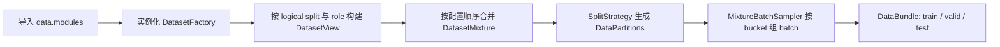

# 数据管线

`DataPipeline` 把多个 `DatasetFactory`、全局 `SplitStrategy`、逐样本 bucket 元数据
和 DataLoader 组合为 runner 使用的 `DataBundle`。扩展点保持 OOP：数据集只注册
Factory 类，划分只注册 Strategy 类。

## 生命周期



`DataBundle.train` 总是存在；`valid` 和 `test` 取决于 split 策略与 source mapping。
K-fold 可返回多个 bundle，每个 bundle 是一个独立训练 run。

## source 与 split 映射

一个 source 的基本结构：

```yaml
data:
  datasets:
    - id: flowers
      factory: flowers102
      params:
        root: ./data
        download: true
        random_horizontal_flip: true
      splits:
        train: train
        validation: val
        test: test
```

左侧 `train`/`validation`/`test` 是固定的 logical split；右侧字符串由 Factory
解释。映射不负责“合并全部 split”。例如 Flowers102 的 `official` 模式含义是：

- 原生 `train` 只参与训练；
- 原生 `val` 只参与验证；
- 原生 `test` 只参与最终测试。

不存在 `all` split 模式。若确实要把多个物理分区作为一个训练集，应在自定义
Factory 中提供一个明确的 native split 名，或注册语义清晰的自定义
`SplitStrategy`。

## train 与 eval role

`DatasetBuildRequest` 同时包含 `native_split`、`role` 和 `seed`：

- `role="train"`：内置图像 Factory 使用 resize-cover、随机 crop，并可水平翻转；
- `role="eval"`：使用 resize-cover 和 center crop，不做随机翻转；
- `native_split`：只选择物理数据，不隐含预处理策略。

random holdout 与 K-fold 会对同一个 native train split 分别构建 train-role 和
eval-role 视图，然后验证两者 `sample_keys` 完全一致。这样训练部分仍有随机增强，
验证部分保持确定性，并且索引不会错位。

## 内置 SplitStrategy

| `data.splits.mode` | 训练 | 验证 | 测试 |
| --- | --- | --- | --- |
| `none` | 完整合并所有 logical train | 无 | 合并 logical test（若声明） |
| `official` | 合并各 source 的 logical train | 合并 logical validation；所有 source 必须全部声明或全部省略 | 合并 logical test（若声明） |
| `random_holdout` | 合并 train 后按全局随机索引保留训练部分 | 从同一物理 train 的 eval view 取全局 holdout | 合并 logical test（若声明） |
| `kfold` | 合并 train 后使用其余 fold | 当前 fold 对应的 eval view | 合并 logical test（若声明） |

random holdout 的 `validation_size` 可以是样本数或比例。K-fold 使用
`experiment.seed` 生成稳定全局排列，fold 大小差最多 1；`fold_index: null` 构建
全部 fold，显式索引只构建一个 fold。

## 多数据源自然混合

全部 source 都省略 `sampling_weight` 时，每个训练样本每 epoch 使用一次；同一
bucket 可以自然混合不同 source。source 的长期比例由其实际样本数决定：

```yaml
data:
  datasets:
    - id: digits
      factory: mnist
      # sampling_weight 省略
      splits: {train: train, test: test}
    - id: flowers
      factory: flowers102
      # sampling_weight 省略
      splits: {train: train, test: test}
```

多个 source 必须共享 `data.image.channels`、归一化范围和配置 bucket。内置 Factory
会执行显式通道转换；自定义 Factory 必须自行满足该契约。

## 加权混合

若需要按训练 step 控制 source 比例，所有 source 都必须填写正权重：

```yaml
data:
  datasets:
    - id: digits
      factory: mnist
      sampling_weight: 0.4
      splits: {train: train, test: test}
    - id: flowers
      factory: flowers102
      sampling_weight: 0.6
      splits: {train: train, test: test}
```

权重不要求总和为 1，运行时会归一化。加权模式每个 batch 只来自一个 source：先按
权重选择 source，再按该 source 各 bucket 的自然 batch 数选择 bucket。小 source
耗尽后会重新 shuffle 并循环。权重只影响训练，验证和测试始终自然完整遍历、
不 shuffle、不 drop last。

`steps_per_epoch: auto` 使用未加权完整遍历所需的自然 batch 数；显式正整数则严格
生成该数量的训练 step。

## bucket 选择与动态 batch

每个样本根据原始宽高选择 bucket，比较顺序为：

1. 最小化原始与 bucket 宽高比的对数距离；
2. 宽高比同距时最小化面积的对数距离；
3. 仍同距时选择 YAML 中先声明的 bucket。

内置 Factory 在 `__getitem__` 中把图像 resize-cover 到已选 bucket，再 crop 到精确
尺寸。collate 不做隐式 resize、padding 或通道转换。

动态 batch size 的像素预算公式是：

$$
B_b = \max\left(1, \left\lfloor B_0 \frac{H_sW_s}{H_bW_b}\right\rfloor\right)
$$

其中 $B_0$ 是 `data.dataloader.batch_size`，$(H_s,W_s)$ 是 `sample_bucket`，
$(H_b,W_b)$ 是当前 bucket。`dynamic_batch_size: false` 时所有 bucket 使用 $B_0$。

每个 bucket 高宽还必须能被 `2 ** (UNet 层数 - 1)` 整除；否则 UNet skip
connection 无法对齐，配置加载会提前失败。

## DatasetFactory 契约

自定义 Factory 的唯一必需方法是：

```python
from stochaflow.data import DatasetBuildRequest, DatasetFactory, DatasetView
from stochaflow.utils.registry import REGISTRIES


@REGISTRIES.dataset_factories.register("my_images")
class MyImagesFactory(DatasetFactory):
    def build(self, request: DatasetBuildRequest) -> DatasetView:
        dataset = self._build_dataset(request.native_split, request.role)
        sample_keys = tuple(record.stable_id for record in dataset.records)
        bucket_ids = tuple(record.bucket_name for record in dataset.records)
        return DatasetView(
            source_id=self.context.source_id,
            dataset=dataset,
            sample_keys=sample_keys,
            bucket_ids=bucket_ids,
        )
```

`self.context` 提供：

- `source_id`：当前 YAML source id；
- `params`：`data.datasets[].params` 的副本；
- `image`：全局通道数和归一化策略；
- `buckets`：`ResolutionBucketPolicy`，可调用 `select(width, height)`。

Factory 必须保证：

- `DatasetView.source_id` 与 context 完全一致；
- `dataset`、`sample_keys`、`bucket_ids` 长度相同；
- 同一 view 的 `sample_keys` 唯一且跨运行稳定；
- 同一物理 split 的 train/eval view 具有相同顺序和 `sample_keys`；
- `dataset[index]` 是图像 Tensor，或 tuple/list 且首元素是图像 Tensor；
- Tensor 的 `C×H×W`、通道数和数值范围与 metadata/全局配置一致。

完整注册方式见[扩展与 Registry](extensions.md)。每个字段的默认值与限制见
[字段参考](reference.md)。
