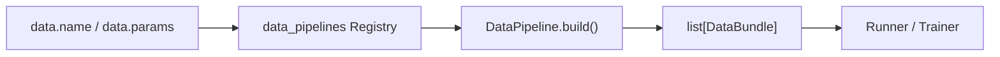

# 数据管线

`data` 是一个普通 Registry 组件声明。核心只负责构建所选 `DataPipeline`，然后消费
它返回的 `DataBundle`；Dataset 类型、split、混合、sampler、collate 和 batch 结构
都属于具体管线。



每个 bundle 必须包含 `train: SplitData`，可以包含 `valid` 和 `test`。`SplitData`
保存 loader，并可提供 `dataset`、`num_samples`、`num_batches`。流式管线不需要暴露
Dataset，但训练 split 必须通过 loader 的 `len()` 或 `num_batches` 给出有限 epoch
长度。

## `map` 管线

`map` 面向单一 map-style `DatasetFactory`，使用固定 batch 和 PyTorch 默认
collation。Tensor、mapping、tuple 和 list 等结构都会作为 structured batch 进入
Trainer；管线不解释 state、target 或 condition。

```yaml
data:
  name: map
  params:
    dataset:
      id: physics
      factory: physics_fields
      params: {}
      splits:
        train: train
        validation: validation
        test: test
    splits:
      mode: official
    dataloader:
      batch_size: 64
      num_workers: 4
      shuffle: true
      drop_last: true
      pin_memory: true
      persistent_workers: true
      steps_per_epoch: auto
```

内置 split mode 为：

| mode | 行为 |
| --- | --- |
| `none` | 使用完整 train，可选 test，不创建 validation。 |
| `official` | 使用 Factory 的原生 train/validation/test 映射。 |
| `random_holdout` | 对 train 做确定性全局 holdout；`validation_size` 可为数量或比例。 |
| `kfold` | 对 train 做确定性 K-fold；`fold_index: null` 构建全部 fold。 |

`map` 不接受 `sampling_weight`。复杂数据组织应注册完整 DataPipeline，而不是继续往
`map` 中叠加策略。

## `multi_resolution_image` 管线

图像管线承接多源混合、source sampling weight、同 bucket batch、动态像素预算、
图像预处理以及确定性 `set_epoch`：

```yaml
data:
  name: multi_resolution_image
  params:
    datasets:
      - id: flowers
        factory: flowers102
        sampling_weight: 0.6
        params: {root: ./data, download: true}
        splits: {train: train, validation: val, test: test}
      - id: digits
        factory: mnist
        sampling_weight: 0.4
        params: {root: ./data, download: true}
        splits: {train: train, test: test}
    image:
      channels: 3
      normalize: true
    batching:
      buckets:
        - {name: square_32, height: 32, width: 32}
        - {name: square_64, height: 64, width: 64}
      base_bucket: square_64
      dynamic_batch_size: true
    dataloader:
      batch_size: 64
      steps_per_epoch: auto
    splits:
      mode: random_holdout
      validation_size: 0.1
```

全部 source 要么都省略 `sampling_weight`，要么都填写正数。加权训练先选择 source，
再选择该 source 的 bucket；验证和测试始终自然遍历。`steps_per_epoch` 为正整数时，
训练 sampler 会循环较小 source 以严格提供指定 step 数。

每个样本按宽高比距离、面积距离、bucket 声明顺序选择目标 bucket。动态 batch size
使用：

$$
B_b = \max\left(1, \left\lfloor B_0
\frac{H_{base}W_{base}}{H_bW_b}\right\rfloor\right)
$$

`base_bucket` 只定义基础 batch 的像素预算，不再隐式决定采样输出 shape。

内置 torchvision Factory 返回原始样本和 `ImageSampleMetadata`。图像管线负责
resize-cover、train random crop / eval center crop、通道转换和 normalize。最终使用
默认 collation，因此 label、condition 等辅助字段不会被丢弃。

## DatasetFactory 契约

`DatasetFactory` 是 `map` 和图像管线可复用的低层扩展：

```python
from stochaflow.extensions import (
    DatasetBuildRequest,
    DatasetFactory,
    DatasetView,
    REGISTRIES,
)


@REGISTRIES.dataset_factories.register("physics_fields")
class PhysicsFieldsFactory(DatasetFactory):
    def build(self, request: DatasetBuildRequest) -> DatasetView:
        dataset = build_fields(
            split=request.native_split,
            training=request.role == "train",
            **self.context.params,
        )
        return DatasetView(
            source_id=self.context.source_id,
            dataset=dataset,
            sample_keys=tuple(record.id for record in dataset.records),
        )
```

`DatasetFactoryContext` 只提供 `source_id` 与复制后的 `params`。`DatasetView` 要求
`dataset` 和稳定、唯一、等长的 `sample_keys`；可选 `batch_metadata` 也必须等长。
Factory 不依赖图像配置或 bucket policy。

## 自定义流式管线

当内置管线的语义不合适时，直接拥有整个数据生命周期：

```python
from stochaflow.extensions import (
    DataBundle,
    DataPipeline,
    REGISTRIES,
    SplitData,
)


@REGISTRIES.data_pipelines.register("simulation_stream")
class SimulationStream(DataPipeline):
    def build(self) -> list[DataBundle]:
        loader = build_stream(self.context.params, seed=self.context.seed)
        return [
            DataBundle(
                train=SplitData(
                    name="train",
                    dataloader=loader,
                    num_batches=self.context.params["steps_per_epoch"],
                )
            )
        ]
```

完整注册方式见[扩展与 Registry](extensions.md)，字段与内置组件索引见
[配置参考](reference.md)。
