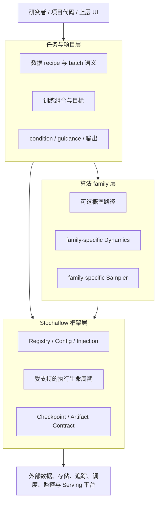

# Stochaflow 架构范围与非目标

- 文档性质：规范性架构边界（Architecture Scope / Non-goals）
- 状态：Active
- 适用范围：Stochaflow core、内置组件、公共扩展契约与正式参考项目
- 当前实现：[框架特性与架构](../framework.md)

本文档回答两个长期问题：

> Stochaflow 应当负责什么复杂度？哪些复杂度必须主动拒绝？

它不是功能清单、版本路线图或公共 API 冻结声明。当前内置能力可以只是本文范围的一个
子集；某项能力属于长期范围，也不代表它已经实现或已经排期。开发提案可以探索实现方式，
但不能仅凭提案扩大这里定义的 core 边界。

本文中的“必须”和“不得”表示架构约束；“应”和“不应”表示除非有明确反证，否则需要
遵循的默认决策；“可以”只表示方向与本范围兼容，不构成实现承诺。

## 1. 愿景

Stochaflow 是一个配置驱动、面向扩展的生成建模研究框架。它的目标是把随机生成方法从
彼此孤立的实验脚本，提升为可组合、可审计、可恢复并能被下游系统消费的工作流。

核心愿景是：

> **为生成算法、实验执行与外部生产系统之间提供缺失的组合层，同时不演化成另一个通用
> ML 平台。**

Stochaflow 优先服务由概率路径、生成动力学与数值采样构成的方法族，包括离散或连续、
随机或确定性的 probability-transport 方法。新的算法 family 可以进入这一架构范围，
但不需要共享一套虚假的通用数学接口。其他生成范式也可以复用兼容的注册、配置、训练或
输出生命周期；core 不会为了宣称“支持所有生成模型”而增加任务分支或强迫所有方法构造
`Process`、`GenerativeDynamics` 或 `Sampler`。

研究优先不等于只能用于一次性实验。框架应让同一份明确组合可以经过验证后被批处理、
服务或可视化系统调用，但这些系统的基础设施与控制平面不归 Stochaflow 所有。

## 2. 架构定位

Stochaflow 位于算法实现与外部基础设施之间：



四层拥有不同的变化轴：

| 层级 | 所有的复杂度 | 不应吸收的复杂度 |
| --- | --- | --- |
| 框架层 | 注册、配置权威、依赖注入、受支持的执行与状态生命周期 | 任务名称分支、全局数学兼容矩阵、外部平台控制平面 |
| 算法 family 层 | family-specific Process、Dynamics、transition、solver 与 Sampler 契约 | 与本 family 无关的通用方法、任务 condition schema |
| 任务与项目层 | 数据与 batch 解释、模型适配、condition、guidance、初始化、领域输出 | 修改 core dispatch、把私有语义伪装成全局配置 |
| 外部系统层 | 数据分发、对象存储、追踪 UI、集群调度、监控、服务编排 | 决定 Stochaflow 内部算法与工作流语义 |

这个分层是职责边界，不是必须按顺序调用的固定流水线。没有概率路径的方法可以不构造
`Process`；没有数值求解过程的方法可以不构造 `Sampler`；一次任务也不需要使用每一个
框架角色。

## 3. 核心原则

### 3.1 组合优于复制

Stochaflow 应复用 PyTorch、数据生态、求解器、追踪系统和执行后端已经提供的能力，只在
生成工作流需要稳定协作语义时定义自己的契约。框架负责连接组件，不以“统一体验”为由
复制整个上游生态。

### 3.2 稳定生命周期优于万能接口

框架可以统一注册、构造、调用、状态管理和错误边界，但不得因此假设不同算法共享同一套
数学。`Sampler.sample()` 可以是完整数值采样生命周期的公共入口；
`GenerativeDynamics` 则仍只是语义根，不获得通用 `predict()`、`step()`、`drift()`、
`score()` 或 `denoise()`。

### 3.3 Python 负责复杂组合，配置负责选择稳定组合根

YAML 适合选择已注册组件、提供可验证参数和重建一次运行，不适合替代 Python 成为任意
对象图语言。复杂的模型协作、batch 解释、condition、guidance、数据 packing 与领域输出
应封装在窄 Builder、Strategy 或项目组件中，再由配置选择。

### 3.4 Capability 优于具体类型和注册名称

协作者应依赖完成当前工作所需的最小能力，而不是内置具体类、任务名称或组件注册名。
兼容性应在掌握完整组合信息的 Builder、Strategy 或 family 边界验证，不由 runner 维护
全局 `name × name` 兼容矩阵。

### 3.5 集成优于重实现

外部系统若已经拥有成熟的数据分发、对象存储、实验追踪、调度、监控或 Serving 能力，
Stochaflow 最多定义与自身工作流有关的窄适配边界。只有集成无法表达生成工作流特有且
稳定的语义时，新的 framework abstraction 才有成立理由。

### 3.6 内置组件与扩展遵循同一条公共路径

Stochaflow 自有的 built-in 不得依赖第三方扩展无法使用的隐藏 dispatch 或 core-only
快捷路径。允许直接使用成熟依赖的公共构造入口，但这种 native-provider 边界必须明确，
不能伪装成 Stochaflow Registry 的内置特权。

### 3.7 明确拒绝错误抽象

当一个需求看似需要以下任一设计时，实施应暂停并重新划分职责：

- runner 按任务名、注册名或具体实现分支；
- 通用配置出现只服务一个 modality 或一个项目的字段；
- core 依赖本应由窄 capability 表达的具体类；
- 为兼容新 family 而修改一个原本可替换的旧 family 组件；
- 把外部平台能力复制成 Stochaflow 子系统；
- 把尚无多个真实使用方的私有约定提升为公共抽象。

## 4. Stochaflow 拥有的复杂度

### 4.1 生成工作流的组合语义

Stochaflow 定义受支持工作流如何从已选组件形成一个可执行、可验证的组合。其职责包括：

- 发现并选择已安装的扩展与组件；
- 解析一份权威配置并完成受控覆盖；
- 在组合边界构造并注入依赖；
- 验证必要 capability 与跨组件不变量；
- 执行已声明的训练、采样、诊断和输出生命周期；
- 统一报告失败，而不是静默采用任务特例。

框架拥有的是**稳定组合点与生命周期**，不是任意 DAG 引擎，也不是所有组件实现。

### 4.2 算法 family 的扩展边界

Stochaflow 为随机生成算法提供一等扩展位置，但每个 family 拥有自己的数学契约：

- `Process` 描述无模型的概率路径与该 family 需要的数学能力；
- family-specific `GenerativeDynamics` 描述已经组装好的生成方向；
- `Sampler` 拥有完整数值算法和临时 solver state；
- family 可以公开窄 transition、schedule 或 solver primitive，供同 family 的第二种
  求解组合复用；
- complete Sampler 应调用其公开 primitive，避免维护平行数学实现。

框架根接口不规定某个 family 必须有何种 `drift`、`score`、time domain、schedule 或
单步公式。Gaussian schedule 之类的概念保持在拥有它的 family 内，不上升为学习率、
ODE time grid 与其他算法共同使用的“通用 schedule”。

### 4.3 配置、Registry 与构造边界

Stochaflow 拥有可审计的组件选择与构造机制：

- 每个 workflow 有且只有一个权威 base config；
- Registry 选择 Stochaflow 所有的稳定扩展点；
- Builder 是复杂 Python 组合进入配置系统的边界；
- resolved config 记录实际执行选择；
- 第三方扩展通过普通 Python distribution 和公开 entry point 接入。

Stochaflow 不镜像成熟依赖的整个命名空间、构造参数和默认值。对 PyTorch optimizer、
scheduler 等成熟公共契约，应使用受限 native-provider resolver 并直接验证上游契约；
只有保留相同生命周期契约的第三方实现才适合成为相应 Registry 扩展。

### 4.4 受支持的执行与状态生命周期

对于已经声明支持的 workflow family，框架拥有其横切生命周期，例如：

- managed asset 的 device、mode 与 state 管理；
- 明确的优化、精度、梯度和 checkpoint 顺序；
- framework-owned random generator 与进度状态；
- 诊断、日志与 artifact writer 的调用时机；
- 失败、恢复和兼容性校验。

一种新的 backward、optimizer ownership、交替更新或容错语义可能构成新的训练循环
family，而不是通用 Trainer 上的一个可选 mode。当前具体支持范围以
[框架特性与架构](../framework.md)为准。

### 4.5 有边界的可复现性

Stochaflow 应让一次受支持的执行在其声明边界内可审计、可重建，并在满足兼容条件时可
恢复。框架负责保存或绑定：

- resolved configuration；
- framework-owned seeds、RNG 与执行进度；
- managed component state；
- 输入 artifact identity 与语义 role；
- extension distribution、版本与注册目标等 provenance；
- 输出、checkpoint 与运行 manifest 之间的必要关系。

“可复现”不表示 Stochaflow 会冻结 Python 源码、wheel、操作系统、驱动、硬件、远程
服务或全部 DataLoader worker state，也不承诺跨设备的 bitwise identical 结果。项目必须
使用自己的 lockfile、环境镜像和外部数据治理补齐这些边界。Strict resume 只对当前公开
契约明确保存的状态作保证。

### 4.6 最小 Artifact Contract

Artifact 是工作流完整性边界：

> **Artifact 是参与一次工作流执行、具有可验证身份和明确语义 role 的输入或输出。**

根据 artifact 类型，Stochaflow 可以负责以下必要能力：

- identity 与 canonical representation；
- 内容或 manifest 验证；
- locator 与 ownership strategy；
- 输入到一次运行的 binding；
- checkpoint、输出和运行 manifest 所需的最小关系；
- 安全发布所需的 locking、atomic publication 与损坏隔离。

这些能力只服务执行验证、恢复与结果解释。Artifact 不得演化为：

- 数据集目录或 marketplace；
- 任意 metadata warehouse；
- 全组织 provenance 或 lineage graph；
- 搜索、权限、审批和协作平台；
- 对象存储、复制、备份或保留策略系统。

只有验证、重建或恢复受支持工作流所必需，并且有明确 producer/consumer 的字段，才应
进入通用 artifact envelope。领域 metadata 保留在 producer family 的 typed payload
中；如果只有一个项目理解某字段，它通常不属于 core。

### 4.7 稳定的项目扩展面

Stochaflow 应允许项目通过实现、注册、配置和测试新增兼容组件，而无需编辑 core
dispatch。扩展面包括但不限于数据、模型、训练组合、算法 family、采样组合、Objective、
diagnostic、logger 与 artifact writer；是否进入内置发行版是另一个独立决策。

扩展性不等于任意对象天然兼容。每个公共角色都必须保留其输入、输出、不变量、状态语义
和错误保证，重要契约应由独立自定义实现验证可替换性，而不能只用 built-in 子类自证。

## 5. 关键责任边界

### 5.1 数据边界

数据层保留四个不同角色：

```text
external data
    |
DataSource       acquire / read / validate / materialize
    |
DataArtifact     verified content + identity + typed payload
    |
DataBuilder      partitions / Dataset views / sampler / collate / loaders
    |
DataLoaders      train / validation / test iterables + run bindings
```

- `DataSource` 是 artifact producer，不构造 runtime Dataset view、partition、PyTorch
  sampler、collate function 或 DataLoader。
- `DataArtifact` 表达已经验证的内容与身份，不吸收一次训练运行的 split 或 batch policy。
- `DataBuilder` 是 runtime data recipe 的 composition root，不是每个 Dataset 类对应的
  factory，也不是通用 dataflow graph。
- core 将 batch 视为 structured `Any`，不规定 image、condition、target、sample key、
  bucket 或 metadata 字段。

新来源只有在满足目标 Builder 的完整 artifact contract，并需要相同 partition、
Dataset、augmentation、sampler、loader、resume 与 batch 语义时，才只需实现新的
`DataSource`。新的 streaming、packing、windowing、multi-source coordination 或
iterator-state 语义属于项目 `DataBuilder`，不推动 core 建立 universal Dataset、
Transform、Sampler、Collate 或 DataLoader Registry。

### 5.2 训练边界

训练侧的稳定责任链是：

```text
injected assets + private builder parameters
                    |
             TrainingBuilder
                    |
              TrainingPlan
        +-----------+-----------+
        |           |           |
    Strategy   primary model   optional managed assets
                    |
             Trainer lifecycle
```

- `TrainingBuilder` 负责完整任务组合和兼容性验证，并声明需要管理的资产。
- `TrainingStrategy` 只解释 batch、调用已注入模型/Objective 并计算 loss/metrics。
- Trainer 拥有该 loop family 声明的 device、mode、optimization、backward、EMA 与
  checkpoint 生命周期。
- 概率过程、目标函数、模型资产与 artifact I/O 各自留在对应层。

Strategy 不构造、移动、冻结、选择参数或序列化 managed assets。Frozen-teacher
distillation 中，Builder 构造、加载、冻结并声明 teacher，Strategy 只组合 forward 与
Objective。独立 optimizer、交替更新或 manual backward 应进入显式的新 loop family，
而不是继续扩大 Strategy。

### 5.3 采样边界

`Sampler` 拥有完整数值算法及其临时状态；`SamplingBuilder` 拥有任务组合，包括模型
adapter、condition、guidance、initial state、family 兼容性与 writer-ready output。

任务 condition 通常由 Builder 捕获在 model callable 或 family-specific Dynamics 中，
不进入通用 `Sampler` 参数。如果任务改变的是数值 transition 本身，应提供项目 Sampler
或 family primitive 组合，而不是给内置 Sampler 增加任务字段。

没有数值求解过程的 direct transform 可以由 `SamplingBuilder` 直接产生合法输出，不得
为了满足框架外形而虚构 `Process`、Dynamics 或 Sampler。

### 5.4 Observability 与外部平台边界

Stochaflow 可以定义 logger、metric、diagnostic 和 run event 的窄调用契约，并把数据发送
给 TensorBoard、Weights & Biases、MLflow 或其他系统。它不拥有这些平台的 dashboard、
查询、比较、团队协作、告警、权限与持久化控制面。

同理，框架可以在工作流边界验证路径、写 checkpoint、发布 artifact，或通过 adapter
访问远程存储；这不使它成为文件系统或对象存储产品。

## 6. 明确非目标

### 6.1 通用 ML 平台

Stochaflow 不试图覆盖数据治理、特征平台、训练平台、模型注册中心、部署平台和监控平台
的全集。它提供生成工作流组合层，而不是这些系统之上的第二套控制平面。

### 6.2 Dataset 管理与通用 dataflow 平台

Stochaflow 不负责数据托管、发现、标注、marketplace、版本浏览或组织级访问治理，也不
构建一套与 PyTorch、Hugging Face Datasets、WebDataset 等并行的惰性 dataflow runtime。
它只拥有与受支持工作流有关的 Source、Artifact、runtime recipe 与 binding。

### 6.3 Experiment tracking、metadata 与 lineage 平台

Stochaflow 不实现 dashboard、跨团队实验搜索、任意 metric query、组织级 lineage graph
或 metadata warehouse。它只记录解释、验证和恢复当前工作流所需的证据，并通过 adapter
集成专业平台。

### 6.4 Storage engine 与内容分发系统

Stochaflow 不实现分布式文件系统、对象存储协议栈、复制、备份、缓存集群、保留策略或
跨区域分发。为保证本地 artifact 完整性而进行的 hashing、locking、atomic publication
与 quarantine 属于 workflow contract，不等同于 storage platform。

### 6.5 计算调度与资源管理平台

Stochaflow 不负责 GPU 分配、job queue、cluster scheduling、placement、多租户隔离、
成本优化或云资源创建。这些职责属于 Slurm、Kubernetes、Ray、云平台或其他 execution
backend。框架将来可以表达一次运行的要求或适配后端，但不得接管后端控制平面。

### 6.6 通用分布式系统

Stochaflow 可以拥有算法正确性所需的 rank-aware data、state、metric 与 checkpoint
语义，但不重新实现 collective communication、elastic membership、actor runtime、
cluster fault tolerance 或分布式存储。拓扑和容错能力应建立在成熟执行后端的公开契约
之上。

### 6.7 Production Serving 平台

Checkpoint 和 sampling workflow 可以被服务系统消费；Stochaflow 不负责 endpoint
provisioning、autoscaling、traffic routing、authentication、SLA、online feature
retrieval 或生产监控。Serving adapter 或 deployment workflow 必须保持为上层消费者或
外部集成。

### 6.8 所有生成范式的统一数学 API

Stochaflow 不为扩大方法名单而创建 universal `predict`、`step`、`drift`、`score`、
`denoise`、condition 或 schedule 接口。Autoregressive、GAN、VAE、energy-based 与其他
方法可以复用真正兼容的生命周期，但 core 不为它们增加具体任务分支或无意义角色。

### 6.9 任意 YAML 对象图

Stochaflow 不把 Dataset、transform、collate、任意模型子图、多优化器协作和领域 pipeline
全部暴露为可自由连线的 YAML 节点。这样做会把类型系统、兼容矩阵、state propagation
和错误处理重新集中到 core parser。Python 继续是复杂组合语言，YAML 只选择稳定且可
验证的组合根。

### 6.10 上游生态镜像

Stochaflow 不复制 PyTorch optimizer/scheduler、求解器库、数据集库或云 SDK 的全部类、
参数、默认值和别名。成熟依赖通过受限 native provider 或 adapter 使用；Stochaflow
Registry 只承载它实际拥有生命周期语义的扩展点。

### 6.11 任务与领域语义中心

图像 class label、文本 token、physics boundary condition、医学 metadata、超分辨率
degradation 和其他领域结构不进入通用 batch、Sampler 或 artifact schema。官方示例可以
展示这些组合，但示例不能反向扩大 core contract。

### 6.12 环境、源码与组织仓库管理

Stochaflow 可以生成普通 Python 扩展项目并记录已加载 distribution provenance，但不
创建或治理用户环境，不冻结 extension 源码，不扫描 monorepo，也不替代 lockfile、
container image、package index 或源代码管理系统。

## 7. 外部职责委派

| 能力 | Stochaflow 的责任 | 外部所有者的责任 |
| --- | --- | --- |
| 生成算法 | family 扩展契约、组合与受支持生命周期 | 领域项目提供具体模型和私有算法 |
| 数据 | artifact identity/binding 与 runtime recipe 边界 | 托管、分发、标注、发现与治理 |
| 实验观测 | logger/diagnostic adapter 与必要运行事件 | dashboard、比较、查询、协作与告警 |
| 持久化 | checkpoint/artifact 完整性与窄 store adapter | 对象存储、复制、备份与保留策略 |
| 分布式执行 | 工作流正确性所需的显式语义 | 通信、调度、弹性、容错与集群控制 |
| 资源 | 最多表达或传递运行要求 | 分配、排队、隔离、扩缩容与成本控制 |
| Serving | 产出可消费的模型状态和 sampling 组合 | endpoint、流量、安全、SLA 与线上监控 |
| UI | 提供可调用的稳定工作流边界 | 图编辑器、交互状态、协作与产品体验 |

“委派”不表示禁止集成。合理形式是窄 adapter、extension 或上层 consumer，而不是在 core
内重建外部系统。

## 8. 新抽象的准入门槛

一个概念只有同时满足以下条件，才适合成为 Stochaflow 公共抽象：

1. **属于框架问题。** 它表达生成工作流特有的组合、执行、状态或验证语义，而不是通用
   基础设施能力。
2. **已有真实复用证据。** 多个独立 workflow 需要同一语义，或一个不可拆分的横切
   lifecycle 已有明确消费者；仅有假设性未来需求不够。
3. **语义已经稳定。** 输入、输出、不变量、ownership、state 和失败保证可以清楚描述。
4. **契约足够窄。** 使用方不需要实现与自身无关的方法，也不依赖大量 optional field
   或 mode enum。
5. **存在明确 composition root。** 跨组件兼容性可以在 Builder、Strategy 或 family
   边界验证，而不是泄漏到 runner。
6. **无法用集成更好解决。** 现有依赖、adapter 或项目 Python 组合不能以更低成本提供
   相同价值。
7. **可被独立实现替换。** 契约可以用非 built-in 的最小实现测试，而不是依赖具体类名。
8. **演进成本可接受。** 配置、checkpoint、artifact 与扩展兼容性影响已经明确。

不满足全部门槛时，默认决策是：

| 需求性质 | 默认归属 |
| --- | --- |
| 单项目或单 modality 的组合 | 项目 Builder / Strategy / extension |
| 一个算法 family 的数学语义 | family-specific contract |
| 成熟外部平台的能力 | adapter 或外部 orchestration |
| 只有一个使用方、语义仍变化 | 保持私有并推迟抽象 |
| 多个工作流共享的稳定生命周期 | 提案评估为 framework contract |

任何新增公共抽象的设计提案都应说明：真实使用方、职责 owner、最小 contract、state 与
lifecycle、失败语义、替代方案、明确 non-goals、独立替换测试以及迁移影响。

## 9. 典型决策示例

| 需求 | 正确边界 | 不接受的方向 |
| --- | --- | --- |
| 新的 ODE / SDE 生成算法 | 新 family 的 Dynamics 与 solver/Sampler capability | 给根 Dynamics 添加所有 family 的方法 |
| 类别 condition 或 classifier-free guidance | 任务 SamplingBuilder 与模型 adapter | 给通用 Sampler 增加 `class_label` |
| 同构的新图像来源 | 发布兼容 artifact 的 DataSource | 为每个数据集名称新增 core Builder |
| sequence packing 或 trajectory window | 项目 DataBuilder runtime recipe | 给通用 Dataset schema 增加私有字段 |
| frozen teacher | Builder 管理 teacher，Strategy 组合 loss | Strategy 私自加载和序列化模型 |
| 独立 optimizer 或交替 backward | 明确的新 training-loop family | 在当前自动 loop 中堆叠 mode flag |
| 新的实验 dashboard | logger/event adapter | 在 Stochaflow 内实现查询与 UI 平台 |
| S3、MinIO 或其他远程内容 | 窄 storage adapter，复用官方 SDK | 重写对象存储客户端与复制策略 |
| Kubernetes GPU job | 外部 launcher/orchestrator | core 负责排队、资源创建与扩缩容 |
| 可视化 workflow editor | 消费稳定 Builder 与 workflow contract 的上层 UI | UI 节点模型反向成为 core 对象模型 |

## 10. 与未来扩展的关系

以下方向与本范围兼容，但不是承诺或优先级：

- 在各自窄契约下增加 flow matching、probability-flow ODE、score SDE、rectified flow、
  stochastic interpolant 或其他 probability-transport family；
- 为确有需求的多优化器、manual optimization 或分布式执行定义独立生命周期；
- 通过 adapter 增强远程 artifact store、tracking backend 与 execution backend 集成；
- 在稳定 workflow contract 之上构建可视化编辑器、批处理系统或 Serving consumer。

每项方向仍需通过第 8 节的准入门槛。路线图、开发计划或示例代码不会自动改变 core
scope。

## 11. 治理与变更规则

1. 本文决定一个职责是否可以进入 core；[框架特性与架构](../framework.md)描述当前已经
   实现的行为；`docs/development/` 中的计划与审查不构成公共承诺。
2. 新功能若违反本文，不应以“先实现再清理”为理由进入 core。应重新放置到 family、
   project extension、adapter 或外部系统，或者先提交明确的 scope 修订。
3. Scope 修订必须说明原边界阻止了哪些真实用例、为什么窄扩展无法解决，以及新增职责
   如何避免继续外溢。
4. 公共文档不得把未来允许方向写成当前能力。稳定行为进入正常文档树；中间计划留在
   `docs/development/`，合并前删除、归档或转写。
5. 大规模重构完成前，应验证 core 不依赖任务注册名或具体 built-in，关键契约通过独立
   实现测试，并且配置、checkpoint、artifact 与迁移文档保持一致。

## 12. 结论

Stochaflow 拥有：

- 生成算法 family 的组合边界；
- 稳定、显式且可验证的工作流生命周期；
- 配置、Registry、依赖注入与扩展契约；
- 有边界的可审计、重建与恢复能力；
- 服务 workflow integrity 的最小 Artifact Contract。

Stochaflow 主动拒绝：

- 通用 ML、数据、metadata、存储、调度和 Serving 平台；
- 一套覆盖所有生成方法的万能数学接口；
- 任意 YAML 对象图与任务专属 core schema；
- 对成熟外部生态的镜像和重实现；
- 没有复用证据、ownership 不清或仍不稳定的公共抽象。

最终判断标准不是“这个功能是否有用”，而是：

> **这项复杂度是否只有 Stochaflow 才能在生成工作流边界正确拥有；如果不是，就应通过
> extension、adapter 或外部系统完成。**
