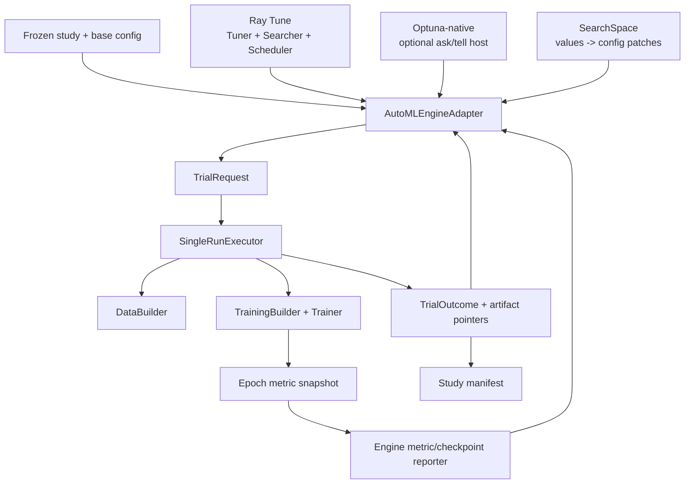

# 自动化模型调优开发计划

- 文档性质：开发草案；不属于当前公开 API 或正式文档导航
- 状态：提案，尚未进入实现
- 制定日期：2026-07-25
- 架构复核：2026-07-26；final test 改由独立 Evaluation Operation 执行
- 前置工作：[Metrics 支持开发计划](metrics-support-plan.md)的 canonical epoch
  snapshot 与 monitor contract
- 关联工作：
  [训练后 Evaluation 与 Benchmark 支持计划](post-training-evaluation-support-plan.md)
  负责选定 subject 的独立 final test、result 与 gate
- 首版范围：单目标 HPO、Grid/Random 基线、成熟 AutoML engine adapter、单机顺序 trial、
  epoch-level reporting/pruning、study resume 与 trial artifact lineage
- 后续范围：TPE 与 GP-based Bayesian Optimization（BO）、多策略/多 scheduler、
  本地并行、外部 BO provider，以及统计确认与多目标扩展

## 1. 目标与结论

本计划中的“自动化模型调优”首先指 **hyperparameter optimization（HPO）**：在固定
训练任务和数据协议下，自动提出多个配置、执行独立训练 run、根据 validation 或
经过 source validation 的 diagnostic metric 选择和提前终止 trial，并保留完整可复现
记录。

产品层可以把它放在 `AutoML` 能力域下，但首个交付必须明确标为“自动化调优/HPO”，
而不是暗示已经覆盖 AutoML 的全部能力。完整 AutoML 通常还包含数据清洗、特征工程、
模型族/架构搜索、集成和部署；这些不是本计划的首版范围，未来若进入也必须各自拥有
独立 contract，不能绕过 DataBuilder、TrainingBuilder 和训练生命周期边界。

首版不把以下方向混进同一个开关：

- neural architecture search；
- population-based training 中途改写超参数和继承其他 trial checkpoint；
- 多 optimizer/alternating update 等新训练循环 family；
- 自动合并 train/validation、自动修改 DataBuilder 或自动选择测试集；
- 分布式训练本身。

推荐结论如下：

- **成熟方案优先，Stochaflow 不以重写成熟 AutoML/HPO 平台为目标**。优先评估
  Ray Tune 这类同时支持多 search algorithm、trial scheduler、资源和恢复的 engine；
  Optuna、Ax/BoTorch、BayesOpt 等作为其 search backend 或轻量独立 provider。
  Stochaflow 自己只维护与仓库紧密相关的 config、execution、metrics、artifact 和
  extension 边界。
- **调优是高于单次训练的独立 workflow**，使用独立 tuning YAML 引用一份完整 base
  training config；不在 `StochaflowConfig` 中塞入 `tuning` 字段，也不让普通
  checkpoint 携带 study scheduler 状态。
- **先抽取可复用的单次训练执行器**。当前 `_run_single_run()` 返回 `None`、直接拥有
  UI/日志/采样和目录副作用，不是稳定的 trial API。HPO 不应递归调用 CLI、解析日志
  文件或复制 `Trainer.fit()`。
- **core 依赖窄的 engine/Trainable adapter，不实现搜索或调度平台**。Ray Tune 路径
  应直接复用其 `Tuner`、`Searcher`、`TrialScheduler`、resource 与 restore；只有
  lightweight Optuna-native 路径才使用 Optuna ask-and-tell。不得为了“统一”而在
  Stochaflow 中再造一套与 Ray/NNI 同规模的 controller。
- **Stochaflow 继续拥有训练语义**：resolved config、extension activation、
  TrainingBuilder/Trainer、canonical metric、checkpoint 内容和 artifact provenance；
  engine 可以拥有 trial scheduling 与 engine state，但不能重新解释模型或 batch。
- **Grid 和 Random 是强制基线，TPE 与 GP-based BO 是自适应策略**。Grid 用于小型
  离散空间、回归测试和可枚举消融；Random 用于高维 sanity baseline；TPE 适合混合/
  conditional 空间；经典 BO profile 明确使用 GP-based sampler。先证明 search
  space、seed、objective 和预算正确，再使用 adaptive sampler。
- **TPE 不应在文档中等同于经典 GP Bayesian Optimization**。两者都利用历史观测
  选择后续候选，但 surrogate、假设和适用范围不同；配置、manifest 和报告必须记录
  具体 sampler identity。
- **首版单机顺序执行，每 trial 独立构建所有 runtime**。并行和 cluster 是 launcher
  能力，不等于 search algorithm；Ray engine 首先限制并发为 1，第二阶段再启用其
  local process/resource scheduling，同一 adapter 后续扩展到 cluster。
- **validation/validation-role diagnostic metric 是目标，test 不是目标**。diagnostic
  key 还必须带经 Builder 验证的 source/protocol metadata；test 只用于选定配置后的
  最终一次独立 Evaluation，结果不反馈给当前 study，避免数据泄漏。
- **study resume 必须恢复同一研究问题**。base config、search space、objective、
  extension selection 和代码身份不允许静默变化；只允许增加 trial/timeout 等明确
  runtime budget。

### 1.1 Scope 决策

| 能力 | Stochaflow 定位 | 阶段 |
| --- | --- | --- |
| Grid Search | Ray basic variant 或 Optuna GridSampler；仅接受有限离散网格 | T1 |
| Random Search | Ray basic variant 或 Optuna RandomSampler 基线 | T1 |
| TPE | Ray `OptunaSearch`/Optuna provider；不标为 GP-BO | T2 |
| GP-based BO | Ray BayesOpt/Ax/Optuna GP；保留外部 BO provider seam | T2/T5 |
| Pruning/Hyperband | 与 sampler 正交的预算策略，不属于 BO 实现 | T2 |
| 并行 trial | launcher/resource 能力；不属于 Grid/BO 算法 | T3 |
| constraints、batch BO、multi-objective BO | provider capability，逐项验证后开放 | T4/T5 |
| 自动数据处理、特征工程、NAS、ensemble、部署 | 不属于本模块 | 不规划 |

因此 Stochaflow 拥有的是“**黑盒 Trial 执行与实验编排**”：把合法参数变成一次可追踪
训练，再把 canonical validation/diagnostic objective 和状态反馈给搜索 provider。
这里的 trial objective execution 不是正式 final-test Evaluation Operation。搜索
provider 拥有的是
“**下一候选如何产生**”。搜索算法不得检查具体 model、Process、TrainingStrategy
或 batch 类型；它只读取声明的 parameter domain、objective observations、pending
trial 和显式约束。

默认实现和扩展实现必须走同一 `TuningBuilder -> TuningPlan` 组合路径。扩展 seam 的
目的，是允许替换 provider、实验新算法和避免供应商锁定；不是要求用户自己实现
sampler、pruner、storage 或 scheduler。若成熟 provider 已满足需求，应直接适配其
公开 API。

## 2. 当前仓库基线与阻塞点

### 2.1 可复用基础

| 现有能力 | 对调优的价值 |
| --- | --- |
| typed `StochaflowConfig` 与严格 unknown-field 检查 | 可对每个候选配置重新验证 |
| registry/extension entry point/provenance | trial 可记录第三方实现身份 |
| `DataBuilder -> DataLoaders` | 每个 trial 可独立组装数据，不假定 Dataset 类型 |
| `TrainingBuilder -> TrainingPlan` | 模型、Process、Objective、Strategy 组合可配置 |
| optimizer/scheduler native provider resolver | 可安全调优 constructor params |
| deterministic seed 与 RNG checkpoint | 单 trial 可复现基础 |
| best/latest checkpoint 与 strict resume | trial 失败恢复和 artifact 选择基础 |
| local/TensorBoard/W&B logger | trial-level observability |
| run manifest 与 resolved config | study lineage 基础 |
| diagnostic cadence/FID/KID | 生成任务可用的质量 objective 来源 |

### 2.2 必须先修的执行边界

1. `run_experiment_from_args()` 同时解析 CLI、激活 extension、构建 DataLoaders、创建
   timestamp 目录、训练、测试、采样和终端输出。
2. `_run_single_run()` 返回 `None`，`TrainingResult` 只含 best epoch/loss/checkpoint，
   没有统一 epoch metric snapshots、最终状态或失败分类。
3. `Trainer.fit()` 没有一个能报告 epoch result 并返回 continue/prune decision 的窄
   observer；`TrainingDiagnostic` 不是控制接口。
4. 当前 monitor 只能稳定读取 `train_loss/valid_loss`，diagnostic metrics 在选择之后
   才产生。
5. output directory 由 timestamp 临时生成，没有 study/trial 稳定身份。
6. extension activation 是进程级固定状态；同一进程不能安全地在 trial 间切换完全
   不同的 plugin selection。
7. config 只表达一个 run，没有“候选参数名 -> config path -> distribution”的上层
   schema。
8. 训练结束默认执行 test 和 final sampling；大多数 HPO trial 不应付出这些成本，也
   不应反复读取 test。

因此实现顺序必须是 Metrics snapshot -> reusable run executor -> tuning orchestration，
不能先写一个循环调用 CLI 的脚本。

## 3. 成熟方案调研

### 3.1 Optuna

Optuna 把一个优化问题表示为 `Study`，一次候选执行表示为 `Trial`。其
[`Study`](https://optuna.readthedocs.io/en/stable/reference/generated/optuna.study.Study.html)
支持 `optimize()`，也支持 `ask()`/`tell()`，后者允许宿主框架控制 trial 生命周期。

[`Trial.report()` / `should_prune()`](https://optuna.readthedocs.io/en/v4.9.0/reference/generated/optuna.trial.Trial.html)
把中间 metric 和资源 step 交给 pruner；官方明确指出 pruning 当前不支持
multi-objective。其
[`pruners`](https://optuna.readthedocs.io/en/stable/reference/pruners.html) 包括
Median、Successive Halving、Hyperband、Threshold 等。

Optuna 的
[`RDBStorage`](https://optuna.readthedocs.io/en/stable/reference/generated/optuna.storages.RDBStorage.html)
和 [study resume 指南](https://optuna.readthedocs.io/en/stable/tutorial/20_recipes/001_rdb.html)
支持持久化和多节点共享；官方不建议用 SQLite 做并行 optimization。其
[并行指南](https://optuna.readthedocs.io/en/stable/tutorial/10_key_features/004_distributed.html)
区分 thread、process 和 multi-node storage。

其官方 sampler 目录同时提供 `GridSampler`、`RandomSampler`、`TPESampler` 和
明确标为 Gaussian process-based Bayesian optimization 的 `GPSampler`，另有
`CmaEsSampler`、`QMCSampler` 与独立集成中的 `BoTorchSampler`。因此一个 Optuna
adapter 足以先验证统一 orchestration seam，同时仍允许未来替换成自研 BO。

适合 Stochaflow 的部分：

- Python-first conditional suggestion；
- ask-and-tell 易于适配现有 runner；
- sampler/pruner/storage 可组合；
- 本地轻量，未来可扩展到多进程/多节点；
- trial user attributes 可记录 artifact pointer。

不能直接照搬的部分：

- Optuna objective function 不应拥有 Stochaflow 全部 runner 责任；
- Optuna DB 不能代替 resolved config、checkpoint 和 extension provenance；
- `n_jobs` 不是 GPU resource scheduler，且异步并行会改变可复现的 suggestion 顺序；
- Optuna storage 不保存 sampler/pruner 实例 state 的全部外部环境语义。

### 3.2 Ray Tune

[Ray Tune key concepts](https://docs.ray.io/en/latest/tune/key-concepts.html) 明确区分：

- search space；
- Trainable；
- search algorithm；
- trial scheduler；
- Tuner/ResultGrid。

其 [TrialScheduler](https://docs.ray.io/en/latest/tune/api/schedulers.html) 可以 stop、
pause、clone 或调整 trial，资源与搜索算法分离。[Tune lifecycle](https://docs.ray.io/en/latest/tune/tutorials/tune-lifecycle.html)
由 controller 管理 actor、trial state、search algorithm、scheduler 和 fault
tolerance；[fault tolerance](https://docs.ray.io/en/latest/tune/tutorials/tune-fault-tolerance.html)
要求 experiment state 和 trial checkpoint 有持久化位置，并把 restore 限定为同一
实验问题的恢复。

对 Stochaflow 的启示：

- search backend、trial launcher/resource scheduler、single-run executor 必须分层；
- pause/resume/PBT 需要完整 trial checkpoint，不能只保存 objective；
- cluster storage 与本地 artifact path 是独立设计；
- Ray Tune 已提供 Grid/Random、Ax、BayesOpt、BOHB、HEBO、HyperOpt、Nevergrad、
  Optuna 等 search adapter，也提供 ASHA、Median、HyperBand、BOHB、PBT 等 scheduler；
  因此它是首要 AutoML engine 候选，不应只被看作未来 cluster launcher。
- Ray 仍然只能作为可选 extra/provider，普通 `stochaflow train` 不导入 Ray。是否作为
  默认 tuning engine，必须先通过 Windows/Linux、worker extension activation、
  checkpoint bridge、diagnostic reporting 和本地启动开销 spike。

### 3.3 Hydra Sweeper、W&B Sweeps 与 KerasTuner

[Hydra Sweeper](https://hydra.cc/docs/advanced/plugins/overview/) 将“产生多个 job 的
sweeper”和“执行 job 的 launcher”分开。其
[Optuna Sweeper](https://hydra.cc/docs/1.2/plugins/optuna_sweeper/) 展示了 YAML
search space、single/multi-objective 和自定义 Python search space hook。Hydra 的
[multi-run](https://hydra.cc/docs/tutorials/basic/running_your_app/multi-run/) 也提醒，
懒组合 config 会受启动后文件变化影响；Stochaflow 应在 study 开始时冻结 base config。

[W&B Sweeps](https://docs.wandb.ai/models/sweeps) 使用 sweep controller + agents，
将 method、metric、parameters、early termination 和 run cap 放在独立 sweep config；
多个 agent 可跨机器领取 run。其
[sweep config](https://docs.wandb.ai/models/sweeps/sweep-config-keys) 表明 Hyperband
bracket 依赖报告次数，因此 objective cadence 必须稳定。

[KerasTuner Oracle](https://keras.io/keras_tuner/api/oracles/) 把生成候选和接收结果的
Oracle 与执行模型的 Tuner 分开；parallel 模式只有一个 Oracle，worker 通过 Trial
交换状态。它再次支持“proposal/control”和“execution”分离。

### 3.4 搜索与预算方法

- Grid Search 穷举显式离散网格，优势是语义直观、覆盖可核对；缺点是组合数乘法
  膨胀。启动前必须计算总组合数，禁止把无界或未离散化的连续区间偷偷转成网格。
- [Random Search](https://jmlr.org/papers/v13/bergstra12a.html) 是比 grid search 更
  有效的高维基线，尤其当只有少数参数真正重要时。
- [BoTorch 的 BO 概览](https://botorch.org/docs/overview) 把 BO 定义为昂贵黑盒函数
  上的自适应采样：surrogate（通常为 GP）提供后验不确定性，acquisition policy
  平衡 exploitation 与 exploration。这个数学闭环属于 search provider，不属于
  Trainer。
- [Hyperband](https://www.jmlr.org/beta/papers/v18/16-558.html) 把 epochs、samples
  等资源自适应分配给候选，通过 early stopping 提高预算效率。
- [ASHA](https://proceedings.mlsys.org/paper_files/paper/2020/hash/a06f20b349c6cf09a6b171c71b88bbfc-Abstract.html)
  去掉同步 barrier，更适合大规模异步 worker。
- [BOHB](https://proceedings.mlr.press/v80/falkner18a.html) 结合 model-based search
  与 Hyperband，但引入更强的 scheduler/search compatibility 要求。

首版不把这些算法写进 core；它们指导 default profile、metric cadence 和资源 contract。

### 3.5 备选集成路线

| 路线 | 优点 | 主要问题 | 结论 |
| --- | --- | --- | --- |
| PowerShell/Python 循环调用 `stochaflow train` | 最快出 demo | 无中间 prune、结构化结果、可靠 resume 和资源控制 | 只可作临时实验 |
| 自研 sampler/pruner/storage | 完全可控 | 重复成熟 HPO 工程，维护和统计风险高 | 拒绝 |
| 直接迁移到 Hydra multirun | config 组合和 plugin 生态成熟 | 改变当前 config 权威、CLI、output 和 resume 语义 | 不作为核心前提 |
| W&B Sweeps 作为唯一 controller | UI/agent 成熟 | 远程服务和 logger 绑定，离线与自托管语义不同 | 可作外部 adapter |
| Ray Tune 作为可选 AutoML engine | 多 search/scheduler、resource/fault tolerance | 依赖较重，必须适配现有 checkpoint/extension | 首要 spike |
| NNI 作为 engine | 多 tuner、NAS、compression、remote service、Web UI | 上游仓库已归档，长期维护风险不可接受 | 仅作参考，不作为默认依赖 |
| provider-neutral seam + Optuna-native | 本地轻量、ask/tell、可持久化 | 仍需自己定义 trial controller | 作为轻量备选 |

### 3.6 成熟 provider 选型

“使用成熟 AutoML 方案”和“保留扩展能力”不是二选一。建议用分层 provider 组合，
而不是挑一个框架接管所有责任：

| 成熟方案 | 最适合承担 | Stochaflow 决策 |
| --- | --- | --- |
| Ray Tune | 多策略 search、scheduler、trial、resource、restore | 首要 AutoML engine 候选 |
| Optuna | Grid/Random/TPE/GP sampler、pruner、storage | Ray search backend 或轻量 provider |
| Ax + BoTorch | 高级 BO、surrogate/acquisition、constraints、batch/multi-objective | 可选高级 BO provider |
| FLAML Tune | 面向预算的低成本 HPO 和自定义 evaluation function | 候选外部 provider |
| NNI | HPO/NAS/compression/feature engineering 与多种 tuner | 功能参考；因项目归档不采用 |
| W&B Sweeps | 托管 controller、agent 与可视化 | 可选远程 controller |

不建议让 AutoGluon/FLAML AutoML 这类端到端 task pipeline 成为 core 默认，因为
Stochaflow 的 DataBuilder、TrainingBuilder、Process、Objective 和生成式 diagnostic
已经拥有任务组合权。若某个具体分类/回归 recipe 能从端到端 AutoML 获益，它可以
实现独立 TrainingBuilder/extension；不能让外部 pipeline 绕过现有训练资产和
checkpoint 生命周期。

默认安装路径应只暴露 Stochaflow 的统一 `tune` workflow；用户选择 engine、search
strategy 和 scheduler，不直接编写 Optuna objective closure、Ray Trainable 或 Ax
experiment。这样成熟方案承担算法和基础设施，Stochaflow 仍能保证 config、metric、
artifact 与 resume 语义。

推荐配置维度应明确分离：

```yaml
builder:
  name: ray_tune
  params:
    search:
      name: ray.tune.search.optuna.OptunaSearch
    scheduler:
      name: ray.tune.schedulers.ASHAScheduler
```

`builder` 选择 engine；`search` 产生候选，`scheduler` 根据中间结果
停止、暂停或变更 trial。Grid/Random 是 basic search；TPE/GP/BOHB 是不同 search；
ASHA/HyperBand/Median/PBT 是 scheduler。不能把这三层都压成一个 `strategy` 字符串。

### 3.7 独立 BO 仓库路线

独立实现 BO 是合理且推荐的边界，而不是重复建设 Stochaflow。成熟先例是 Ax 允许
保留 experiment orchestration、storage、early stopping 和 analysis，同时通过
`ExternalGenerationNode` 接入外部 candidate generator；其 generation strategy
也会把 Sobol 初始化与后续 BO 组织成不同阶段。

建议把两个仓库的责任切成：

| 独立 BO 仓库负责 | Stochaflow 负责 |
| --- | --- |
| parameter-domain 数学表示与编码 | 从 tuning config 产生合法 config patch |
| initial design（Random/Sobol 等） | trial/run 身份、seed、资源与隔离 |
| GP/其他 surrogate、noise model、posterior | DataBuilder/TrainingBuilder/Trainer 生命周期 |
| acquisition function 与 acquisition optimization | validation/diagnostic canonical objective |
| sequential/batch candidate generation | report/prune/fail/cancel 与 checkpoint |
| BO state 序列化、算法 benchmark、regret 分析 | study resume、artifact lineage、provenance |

独立 BO 仓库应保持通用 black-box optimizer 身份，不依赖 Stochaflow 的模型或训练
配置。首选集成是实现标准 Ray `Searcher` adapter，使它既可被 Stochaflow 使用，
也可被任意 Ray Tune workload 使用。该仓库可再提供一个轻量 Stochaflow extension
来暴露 allowlisted constructor；只有不依赖 Ray 的 native 路径才额外实现
`StudyBackend` adapter。Stochaflow core 不反向依赖该仓库。

学习型 BO 仓库的建议首版范围：

1. 有界连续单目标、顺序且带噪观测；
2. Random/Sobol initial design；
3. exact GP regression 与可替换 kernel；
4. EI、PI、UCB acquisition；
5. acquisition optimization、`ask()`/`tell()` 和 state persistence；
6. Branin、Hartmann、Ackley 等函数上的 deterministic benchmark 与 simple regret；
7. 第二阶段再加入整数/类别编码、constraints、batch/pending points、multi-objective
   与 multi-fidelity。

BO 一开始没有足够观测拟合 surrogate，因此必须显式配置 startup design 和切换条件；
不能在零观测时假装直接运行 GP acquisition。首版 Stochaflow 的 GP-BO profile 保持
顺序执行；异步并行所需的 pending-point 处理、fantasization/constant-liar 或 batch
acquisition 在 provider 声明相应 capability 后再开放。

## 4. 术语与不变量

| 术语 | 定义 |
| --- | --- |
| Study | 一次固定 base config、search space、objective 和 extension identity 的调优任务 |
| Trial | 一个候选超参数 assignment 的一次评估 |
| Run | 一次普通 Stochaflow training invocation；首版一个 Trial 对应一个 Run |
| Parameter | 有稳定别名、distribution 和 config target 的候选变量 |
| Objective | 从 canonical epoch metric 读取的单个 scalar 与 direction |
| Resource step | pruner 比较中间结果的单调预算坐标；首版固定为 completed epoch |
| Pruned | backend 根据中间结果正常提前结束，不是 failed |
| Failed | 配置、运行、OOM、I/O 或 extension 错误导致 trial 无有效完成结果 |
| Study resume | 继续同一 Study 产生/完成 trial |
| Trial resume | 从该 Trial 自己的 latest checkpoint 恢复同一候选 |

必须保持：

1. trial config 是 base config 的深复制和受控 patch，随后经过完整 `load_config_dict()`
   与 cross-field validation；
2. trial 不共享 model、optimizer、scheduler、EMA、metric 或 diagnostic mutable state；
3. test split 不产生 suggestion、prune、best-trial decision；
4. search backend 不移动模型、不解释 batch、不直接写训练 checkpoint；
5. launcher 不选择超参数；
6. Study storage 不替代 trial artifact storage；
7. plugin selection 在一个 worker 进程内固定；
8. 一个候选的 runtime budget 不是普通 model hyperparameter。

## 5. 配置权威与目录模型

### 5.1 独立 tuning config

建议新增：

```text
configs/tuning/
└── ddpm_mnist_optuna.yaml
```

示例：

```yaml
study:
  name: ddpm-mnist-baseline
  output_dir: outputs/tuning/ddpm-mnist-baseline
  seed: 20260725

base_config: ../ddpm_mnist.yaml

objective:
  metric: valid/metrics/reconstruction_mse
  direction: minimize

parameters:
  learning_rate:
    target: /optimizer/params/lr
    distribution:
      type: float
      low: 0.00001
      high: 0.001
      log: true

  batch_size:
    target: /data/params/loader/batch_size
    distribution:
      type: categorical
      choices: [64, 128, 256]

  model_channels:
    target: /model/params/model_channels
    distribution:
      type: int
      low: 32
      high: 128
      step: 32

budget:
  max_trials: 30
  timeout_seconds: null
  epochs_per_trial: 50
  max_train_batches: null
  max_validation_batches: null
  run_phase_test: false
  run_final_sampling: false

builder:
  name: ray_tune
  params:
    search:
      name: ray.tune.search.optuna.OptunaSearch
      params:
        sampler:
          name: optuna.samplers.RandomSampler
          params:
            seed: 20260725
    scheduler:
      name: ray.tune.schedulers.FIFOScheduler
      params: {}
    max_concurrent_trials: 1
    resources_per_trial:
      cpu: 4
      gpu: 1
```

study config 不是 `StochaflowConfig` 的 superset。两者分别解析和验证，避免训练 runtime
承担只对 HPO 有意义的字段。

Ray Grid profile 使用 basic variant generator，并要求每个 parameter 都声明为有限
`grid` values：

```yaml
builder:
  name: ray_tune
  params:
    search:
      name: ray.tune.search.basic_variant.BasicVariantGenerator
      params:
        random_state: 20260725
```

`param_space` 由 adapter 从 declarative parameter domains 注入，不允许在
`search.params` 中重复维护。`grid.values` 可直接映射到 `tune.grid_search()`；
finite `int` 的 `low/high/step` 只有显式标为 grid 时才严格展开；float 必须显式
列举 values，不能由 provider 猜测步长。Optuna-native alternative 可把同一 finite
domain 映射到 `GridSampler`。

GP-based BO profile 保持同一 search space，只替换 sampler：

```yaml
builder:
  name: ray_tune
  params:
    search:
      name: ray.tune.search.optuna.OptunaSearch
      params:
        sampler:
          name: optuna.samplers.GPSampler
          params:
            seed: 20260725
            n_startup_trials: 10
            deterministic_objective: false
```

深度模型训练 objective 通常含初始化、batch 和 diagnostic sampling 噪声，因此
`deterministic_objective` 默认不得设为 `true`；只有评估函数确实确定且有测试证明时
才允许覆盖。TPE 与 GP-BO 仅通过 sampler 配置切换，不改变 trial execution 语义。

### 5.2 冻结权威输入

新 study 启动时：

1. 解析 tuning YAML；
2. 解析并激活 base config 所选 extensions；
3. 把 resolved base config、resolved study config、extension provenance 和 source
   paths 写入 study directory；
4. 记录 Stochaflow、Python、PyTorch、TorchMetrics、Optuna 和 extension 版本；在可
   发现时记录 VCS commit/dirty 状态，但不宣称版本号能证明源代码未变化；
5. 冻结 objective 的 `MetricSource` data role、selection eligibility、protocol id
   和 observation cadence；
6. 计算不含 secret 的 canonical fingerprint；
7. 后续 trial 只从冻结副本生成，不重新读取外部 base YAML。

resume 时，study directory/storage 是权威来源。允许覆盖：

- 增加 `max_trials`；
- 增加 timeout；
- launcher device/resource 等明确 runtime option；
- 显式的 failed-trial retry policy。

不允许静默改变：

- parameter distributions/targets；
- objective metric/direction；
- objective source/protocol/cadence；
- base model/data/training config；
- extension identity；
- study seed；
- budget 的 fidelity 定义。

这与 Ray Tune “restore 同一实验，不借 restore 改写 search space”的成熟语义一致。

### 5.3 Config patch

parameter target 使用 JSON Pointer 风格绝对路径，而不是可执行表达式：

```text
/optimizer/params/lr
/model/params/channel_mult/1
```

规则：

- 默认 target 必须在 frozen base config 中存在；
- 不允许 `..`、通配符、函数、插值或 arbitrary Python；
- patch 后重新执行完整 typed config validation；
- type 由 distribution 和最终字段共同验证；
- 一个 target 只能被一个 parameter 拥有；
- 禁止调优 `/extensions`、`/experiment/output_dir`、`/experiment/exp_id`；
- `/experiment/seed` 不作为普通 parameter；重复 seed 由 replication policy 管理；
- device、workers、GPU count、timeout 和 epochs 进入 launcher/budget，不进入 search
  space；
- 修改 component `name` 的 heterogeneous branch 首版禁止，避免不同 constructor
  schema 被塞入一个静态 YAML。

独立 float/int/categorical distribution 足够覆盖首版。conditional、derived、constraint
space 通过自定义 `TuningBuilder/SearchSpace` Python extension 表达，不建立万能
`when/then` YAML 图。

`budget.epochs_per_trial` 定义最大训练资源，不授权 Tuner 根据构造参数名改写 LR
scheduler。`T_max`、`total_steps`、warmup 等仍由 base config 明确提供；多保真
trial 只是提前截断同一最大预算训练轨迹。通用 Tuner 也不根据这些私有参数名验证
scheduler horizon；它只把 budget 与完整 scheduler config 一起冻结和记录。用户必须
按最大预算编写 base config；只有 family-specific Builder 拥有额外的显式 capability
时才能做更强验证，不能用 signature introspection 或字段名猜测运行值。

### 5.4 Study artifact layout

```text
outputs/tuning/ddpm-mnist-baseline/
├── study_manifest.yaml
├── resolved_study.yaml
├── base_config.yaml
├── study.journal
├── trials/
│   ├── trial_000000/
│   │   ├── trial_manifest.yaml
│   │   ├── resolved_config.yaml
│   │   ├── checkpoints/
│   │   ├── metrics.jsonl
│   │   └── ...
│   └── trial_000001/
└── best_trial.yaml
```

`best_trial.yaml` 默认保存 trial id、params、objective、metric snapshot、checkpoint
pointer 和 config pointer，不复制或覆盖 trial checkpoint。若未来需要发布 artifact，
使用显式 promotion command。

## 6. 建议架构

### 6.1 分层

下图表达逻辑责任，不要求 Stochaflow 自己实现每一层。Ray Tune adapter 应把
experiment/trial/search/scheduler/resource/restore 委托给 Ray；Optuna-native adapter
才需要轻量 host loop。



责任：

| 组件 | 负责 | 不负责 |
| --- | --- | --- |
| `AutoMLEngineAdapter` | engine config 映射、trial request/result/metric bridge | 搜索数学、模型训练 |
| 成熟 engine | experiment/trial、search、scheduler、resource、engine restore | 解释模型/batch |
| `StudyBackend` | 仅 native 路径的 ask/report/tell 与 storage | 复制 Ray controller |
| `SearchSpace` | provider value 到 typed config patch | 运行 trial |
| `SingleRunExecutor` | 一次普通 Stochaflow run | 跨 trial 选择 |
| `TrialObserver` | 把 epoch snapshot 报给 engine，返回 continue/prune | 计算 task metric |

`StudyBackend` 不是所有 engine 都必须实现的公共抽象。若成熟 engine 已拥有
Tuner/Searcher/Scheduler，就通过 `AutoMLEngineAdapter` 直接映射，不把它拆开后再
复制一遍。只有 lightweight-native provider 或独立 BO 的最小 host 才使用：

```python
class CandidateGenerator(Protocol):
    def ask(self, count: int = 1) -> Sequence[ParameterSet]: ...
    def tell(self, observations: Sequence[Observation]) -> None: ...
```

batch suggestion、pending points、constraints、multi-objective 和 state persistence
应作为独立 capability 协议逐项增加，不能把所有高级 BO 特性做成一组永远为
`None` 的可选方法。adapter 负责把算法 observation 映射到 Stochaflow trial 状态；
算法实现不读取 checkpoint、metric snapshot 或训练 config。

### 6.2 核心 contracts

候选 public/internal contracts 草案：

```python
@dataclass(frozen=True, slots=True)
class TrialRequest:
    study_id: str
    trial_id: str
    number: int
    parameters: Mapping[str, JsonValue]
    config: StochaflowConfig
    seed: int
    output_dir: Path


@dataclass(frozen=True, slots=True)
class EpochSnapshot:
    epoch: int
    global_step: int
    metrics: EpochMetricSnapshot
    best_checkpoint: Path | None


class TrialDecision(Enum):
    CONTINUE = "continue"
    PRUNE = "prune"


class TrialObserver(Protocol):
    def on_epoch_end(self, snapshot: EpochSnapshot) -> TrialDecision: ...


@dataclass(frozen=True, slots=True)
class TrialOutcome:
    status: Literal["complete", "pruned", "failed", "cancelled"]
    objective: float | None
    final_snapshot: EpochSnapshot | None
    best_checkpoint: Path | None
    output_dir: Path
    failure: FailureRecord | None
```

`EpochMetricSnapshot` 直接复用 Metrics 计划的 values + typed source metadata；
TrialObserver/TuningBuilder 在取 objective 时同时验证 data role、protocol 和
selection eligibility，不能把它再次压扁成只剩数值的 mapping。

lightweight-native `StudyBackend` 的最小能力：

```python
class StudyBackend(Protocol):
    def ask(self) -> BackendTrial | None: ...
    def suggest(self, trial: BackendTrial, space: SearchSpace) -> ParameterSet: ...
    def report(self, trial: BackendTrial, value: float, step: int) -> bool: ...
    def complete(self, trial: BackendTrial, value: float, attrs: Mapping[str, JsonValue]) -> None: ...
    def prune(self, trial: BackendTrial, attrs: Mapping[str, JsonValue]) -> None: ...
    def fail(self, trial: BackendTrial, failure: FailureRecord) -> None: ...
```

Optuna-native adapter 内部把这些映射到 `Study.ask()`、`Trial.suggest_*()`、
`Trial.report()/should_prune()` 和 `Study.tell()`。Ray adapter 不走此 contract，
而是把 `SingleRunExecutor` 包装为 Ray Trainable，并桥接 `tune.report()`、Ray
Checkpoint 与 Stochaflow checkpoint。core 不检查 Optuna concrete Trial 或 Ray actor。

### 6.3 TuningBuilder

与现有 DataBuilder/TrainingBuilder 边界一致，建议提供单一调优组合入口：

```python
class TuningBuilder(ABC):
    def __init__(self, context: TuningBuilderContext) -> None: ...

    @abstractmethod
    def build(self) -> TuningPlan: ...
```

候选 `ray_tune` builder 组合：

- Ray `Tuner` 与可配置 Searcher/TrialScheduler；
- Stochaflow Trainable adapter；
- declarative search space 与 canonical objective；
- Ray resource/storage/run config；
- metric/checkpoint bridge。

候选 lightweight `optuna_native` builder 组合：

- Optuna StudyBackend；
- declarative search space；
- canonical metric objective；
- local sequential launcher；
- trial observer。

复杂 conditional space、外部 scheduler 或 domain-specific constraint 可由 extension
Builder 在 Python 中组合。core runner 不按 builder name 分支。

### 6.4 可复用 SingleRunExecutor

从 `scripts/experiment_runner.py` 抽取库级入口：

```python
def run_training(
    request: TrainingRunRequest,
    *,
    reporter: TrainingReporter | None = None,
    observer: TrainingRunObserver | None = None,
) -> TrainingRunOutcome:
    ...
```

`TrainingRunRequest` 统一封装 config、options、resolved extensions 与 run source，
与 Pipeline/Evaluation 计划使用同一签名。AutoML 的 `TrialObserver` 是
`TrainingRunObserver` 的 engine adapter，不改变 library entry point。

`TrainingRunOutcome` 至少含：

- run status；
- final/best epoch；
- canonical metric snapshots；
- selected checkpoint；
- phase-test snapshot（若显式运行）；
- 独立 EvaluationResult reference（通常仅在 study 结束后产生）；
- sampling artifact（若显式运行）；
- output directory 和 manifest paths；
- stopped-early/pruned 标记；
- failure classification。

CLI `train` 变成该函数的 adapter。HPO 直接调用库级入口，不构造
`argparse.Namespace`，不解析 stdout/JSONL，不递归启动 `stochaflow train`。

DataLoaders 默认每 trial 重新由 DataBuilder 构造。若某项目需要共享昂贵 immutable
dataset/cache，应由具体 DataBuilder 或未来窄 cache capability 提供；core 不缓存或
复制任意 Dataset。

### 6.5 Epoch report 与 pruning

建议每个 epoch：

```text
train
-> validation
-> due diagnostics
-> canonical snapshot
-> local best decision/checkpoint
-> TrialObserver.report(objective, epoch)
-> backend continue/prune
-> latest/periodic/pruned checkpoint policy
-> reporter
```

规则：

- resource step 首版严格使用 completed epoch；
- objective 未到 diagnostic cadence 时不 report，不伪造或 carry-forward；
- 所有 trial 的 objective observation schedule 必须一致；
- prune 是正常 terminal status，不记录为 exception；
- pruned trial 是否保留 latest checkpoint 由 artifact policy 明确配置，默认保留最后
  一个轻量 latest checkpoint 便于审计，study best 不会选择 pruned trial；
- Trainer early stopping 是 trial 内纵向策略，pruner 是 trial 间横向策略；
- 使用 Hyperband/ASHA 时默认关闭 Trainer early stopping，除非用户明确理解两套停止
  规则；
- backend/pruner 不直接抛 Optuna-specific exception 穿透 Trainer。

### 6.6 Objective

首版：

```yaml
objective:
  metric: valid/metrics/accuracy
  direction: maximize
```

或生成质量：

```yaml
objective:
  metric: diagnostics/diffusion_quality/samplers/ddim_50/fid
  direction: minimize
```

验证：

- key 必须由 base config 的 validation metric 或 epoch diagnostic 声明；
- TuningBuilder 必须读取 Metrics 计划的 `MetricSource`，而不是只检查 key prefix；
- objective observation 必须满足 `data_role="validation"`；diagnostic 还必须
  `selection_eligible=True` 并有固定 `protocol_id`；
- `test/*`、任何 `data_role="test"` observation 和 prefix/source 冲突一律禁止；
- direction 必须显式写，不依赖 metric 名称猜测；
- 若 TorchMetrics `higher_is_better` 与 direction 明确冲突，构建失败；
- non-finite objective 使 trial failed，不自动变成极差有限值；
- diagnostic objective 的 sample count、sampler、seed 和 cadence 在 study 内固定，不能
  作为普通 search parameter，否则比较对象改变；
- 首版只支持一个 scalar。Optuna pruning 本身不支持 multi-objective；Pareto 优化单独
  分阶段实现。

## 7. 成熟 AutoML engine 方案

### 7.1 依赖

候选可选 extras：

```toml
tuning = [
    "ray[tune]>=2.56,<3",
    "optuna>=4.9,<5",
]

tuning-optuna-native = [
    "optuna>=4.9,<5",
]
```

版本范围在实现时按 Python 3.12、Windows/Linux、PyTorch 与 CI 重新确认，不把这里的
草案直接视为 lock 决策。未安装 extra 时普通训练完全不导入 Ray/Optuna；选择对应
builder 时给出安装提示。NNI 上游仓库已归档，不新增 NNI runtime extra。

### 7.2 Engine/search/scheduler 构造

与 optimizer/scheduler 一样，不把成熟框架的完整 class namespace 镜像为
Stochaflow registry。`ray_tune` builder 的私有 resolver 只接受 allowlisted public
contracts/namespaces：

- `ray.tune.search.*` 且满足 Ray Searcher/SearchAlgorithm contract；
- `ray.tune.schedulers.*` 且满足 `TrialScheduler` contract；
- 嵌套 Optuna search 时，`optuna.samplers.*` 且满足 `BaseSampler`。

constructor params 原样传给锁定的上游版本；builder 只注入 metric/mode、search
space、资源和 Stochaflow Trainable。首批 documented profiles：

1. Ray BasicVariant Grid + FIFO：有限网格与回归基线；
2. Ray BasicVariant Random + FIFO：随机 baseline；
3. Ray `OptunaSearch(TPESampler)` + ASHA：一般 mixed HPO；
4. Ray `OptunaSearch(GPSampler)` + FIFO：顺序 GP-based BO baseline；
5. Ray `AxSearch` 或 `BayesOptSearch` + FIFO：替代 BO provider；
6. Ray `TuneBOHB` + `HyperBandForBOHB`：显式兼容的 multi-fidelity profile。

`GPSampler` 的具体支持矩阵、实验性标记和构造参数以锁定 Optuna 版本为准，不由
Stochaflow 承诺跨 Optuna 版本稳定。高级 acquisition、batch BO 或自定义 surrogate
可以通过 Ax/BoTorch 或自定义 Ray `Searcher`，而不是扩大 core config schema。

Optuna-native fallback 对 `GridSampler` 注入从 finite parameter domains 推导出的
`search_space`，并把最后组合后的 ask/tell `RuntimeError` 归一化成正常 exhausted。
`GPSampler` profile 显式配置 `n_startup_trials`，并验证额外 SciPy/Torch 依赖。

Builder 在完整组合处依据上游公开 compatibility contract 验证：

- Grid 需要完整 finite space，并在启动前报告笛卡尔积大小；
- BO startup trials、domain、constraint 与 sequential/batch capability；
- BOHB 只能与其配套 scheduler 组合；
- PBT/PB2 需要 checkpoint mutation/继承，是后续训练生命周期 family；
- multi-objective search 与 scalar scheduler/pruning compatibility；
- worker 数、每 trial resource、storage 与 artifact root。

### 7.3 Storage

Ray path 使用 Ray experiment/searcher/scheduler state 做 engine restore，同时每个
trial 仍写 Stochaflow resolved config、manifest、metrics 和 checkpoint。Ray
Checkpoint 只包装/指向 Stochaflow checkpoint，不产生第二份模型状态格式。

Optuna-native path 才使用 Journal/RDBStorage。无论 engine：

- engine storage 不替代 trial artifact storage；
- resume 同时校验 frozen Stochaflow study fingerprint 与 engine state；
- DB/object-store credential 不写入 resolved config、manifest 或 checkpoint；
- 多节点必须使用所有 worker 可见的 durable artifact root。

### 7.4 Engine flows

Ray path：

```text
Ray Searcher suggests config
-> Stochaflow Trainable materializes TrialRequest
-> SingleRunExecutor
-> tune.report(canonical snapshot, checkpoint)
-> Ray TrialScheduler continues/stops/pauses
-> ResultGrid + Stochaflow manifest
```

Optuna-native path：

```text
Study.ask
-> SearchSpace patch
-> SingleRunExecutor
-> Trial.report/should_prune
-> Study.tell
```

Stochaflow 不实现第三套完整 Tuner loop。若 Ray spike 满足本地性能、checkpoint、
extension 和 resume 验收，Ray 成为默认 engine；否则 Optuna-native 作为 MVP，
Ray 仍是第一方可选 engine，而不是以后再重新设计的 cluster 特例。

## 8. Seed、噪声与统计可靠性

### 8.1 三种 seed

必须区分：

- `study.seed`：搜索算法 suggestion；
- `trial.seed`：模型初始化、DataBuilder、训练和 diagnostic；
- `diagnostic.seed`：固定采样/reference comparison。

trial seed 用稳定算法从 `(study seed, trial number, replicate index)` 派生，不使用
Python process-randomized `hash()`。所有 seed 写入 trial manifest。

Optuna 官方说明，parallel optimization 会因并发 reseed 和完成顺序而难以复现同一
suggestion 序列。因此：

- 顺序 mode 承诺给定代码/依赖/数据下的 suggestion seed 可重放；
- 并行 mode 只记录实际 suggestion 和完成顺序，不宣称 bitwise study replay；
- trial 自身仍应尽量 deterministic；
- deterministic 算子失败与性能成本按现有 CLI policy 记录。

### 8.2 Replication

生成模型的 validation loss、FID/KID 和采样质量方差可能很高。只跑一个 seed 容易把
噪声当作超参数效果。

阶段一保持一个 Trial 一个 Run，但文档要求：

- 对入选 top-K 配置做独立 seed confirmation；
- 报告均值、标准差和每个 run；
- 最终选择不能只看最幸运的一次 FID。

阶段三增加 first-class replication：

```yaml
replication:
  runs_per_candidate: 3
  aggregate: mean
  dispersion: std
```

此时一个 backend Trial 对应多个 Stochaflow Runs，objective 是明确聚合值。replicate
之间不共享 checkpoint/optimizer；pruning 需要先定义跨 replicate 的公平预算，不能
直接复用单 run semantics。

## 9. Resource、并行与隔离

### 9.1 首版

- engine `max_concurrent_trials: 1`；
- 一个进程一次只运行一个 trial；
- trial 结束关闭 logger、删除 runtime references、执行 GC，并按 device 清理 allocator
  cache；
- extension selection 在 worker 生命周期内固定；
- 每个 trial 独立 output directory；
- 不复用 model/DataLoader mutable state。

顺序执行并不妨碍先验证 search space、objective、resume 和 pruning，且避免把 GPU
allocation 问题误归给 sampler。

### 9.2 第二阶段本地并行

优先启用 Ray local process execution，而不是新增一套 subprocess controller，也不是
`Study.optimize(n_jobs=N)` thread。若 spike 最终选择 Optuna-native 为默认，则 Ray
仍作为并行 engine：

- worker 是 OS process；
- Ray 分配 GPU/CPU/custom resource slot；
- 每个 GPU 默认一个 trial；
- worker 通过 Ray trial lifecycle 领取配置；
- Ray failure/restore 与 Stochaflow checkpoint bridge 协作；
- OOM 默认 failed，不自动缩 batch 或改变候选；
- retry 必须从同一 trial latest checkpoint，次数有上限并记录原因。

同一进程内不同 plugin selection 仍不支持；需要不同 selection 的 study 使用独立 worker
process/study。

### 9.3 Cluster

cluster scheduling、placement group、共享 artifact storage 和 actor fault tolerance
继续使用同一 Ray Tune builder，不引入第二套 cluster API。core 不复制 Ray
controller；Stochaflow `SingleRunExecutor` 仍作为 Trainable，Ray checkpoint 指向
普通 Stochaflow checkpoint，并保留完整 trial directory。

## 10. Failure、停止与恢复

Trial terminal state：

| 状态 | 含义 | 是否进入 best |
| --- | --- | --- |
| `complete` | 达到预算或 inner early stop，objective 有效 | 是 |
| `pruned` | backend 根据中间结果停止 | 否 |
| `failed` | 配置/运行/I/O/OOM/non-finite objective | 否 |
| `cancelled` | 用户或 study 管理操作中断 | 否 |

策略：

- config/compatibility error 默认 fail-fast 停止 study，因为其他 trial 很可能同样错误；
- 单个模型 OOM/数值失败可标为 failed 并继续，但有 `max_consecutive_failures`；
- `KeyboardInterrupt` 停止产生新 trial，并让当前 trial 尽可能完成 terminal manifest；
- 不吞掉 traceback；manifest 保存结构化 failure type/message，完整 traceback 留本地 log；
- secret 不写 failure record；
- resume 先对 study fingerprint 和 storage 状态做一致性检查；
- RUNNING 但失去 worker 的 trial 由 backend heartbeat/recovery policy 标记 stale；
- 已 complete/pruned 的 trial 不因 resume 重跑；
- failed retry 是新 attempt，保留原 attempt audit。

Study resume 与 Trial strict resume 分开。前者恢复 proposal/control；后者使用现有
checkpoint 恢复一个候选的训练状态。不能拿另一个 trial 的 best checkpoint 继续，
除非未来显式实现 PBT。

## 11. 防止数据泄漏与错误优化

- objective 只能来自 validation phase，或 source metadata 已证明使用 validation
  reference 且 selection-eligible 的固定 diagnostic protocol；
- test loader 默认不在 trial 中执行；
- study 结束后冻结唯一 `(checkpoint digest, weights, inference profile)`，再通过
  [独立 Evaluation Operation](post-training-evaluation-support-plan.md)运行一次
  final test acceptance；
- 若需要 train+validation final refit，由具体 DataBuilder 提供新的明确 recipe/config；
  core 不合并任意 Dataset；
- diagnostic FID/KID 的真实 reference split、sample count 和 preprocessing 写入
  manifest；
- 不能同时调 sampler steps 和用该 sampler 的 FID 作为“模型质量”而不标记目标定义已
  改变；若确实要共同优化，这是 model+inference pipeline study，需在 study 名称和
  objective 中明确；
- 不把训练 wall time 混入单一质量目标；质量/成本 multi-objective 留到后续；
- final test gate 失败表示候选未通过 acceptance；不能把该结果反馈给当前 study 后
  继续在同一 test 上搜索。

## 12. 实施阶段

### 阶段 T0：Metrics 与 single-run seam

1. 完成 Metrics 计划的 canonical epoch snapshot；
2. 增加 epoch observer/control contract；
3. 抽取 `run_training()` 与 `TrainingRunOutcome`；
4. 让 CLI train 仅做参数解析和 reporter adapter；
5. 可配置 trial 中跳过 phase test/final sampling；trial 不触发 formal
   final-test Evaluation；
6. 不改变普通 `stochaflow train` 默认行为。

### 阶段 T1：Study config 与顺序 Grid/Random 搜索

1. 新增独立 tuning config parser；
2. 冻结 base config、JSON Pointer patch 和 fingerprint；
3. 新增 TuningBuilder、AutoMLEngineAdapter 与 SingleRunExecutor bridge；
4. 完成 Ray Tune 与 Optuna-native 对比 spike；
5. 以 spike 结果选择默认 engine，另一路保留第一方 optional builder；
6. 通过 Ray BasicVariant 或 Optuna-native 提供 Grid/Random profiles；
7. Grid 启动前验证所有 domain 可枚举并显示总组合数；
8. study/trial manifests、best pointer 和 resume；
9. CLI：

```text
stochaflow tune --config configs/tuning/ddpm_mnist.yaml
stochaflow tune --resume outputs/tuning/ddpm-mnist-baseline
```

### 阶段 T2：多策略 search、GP-BO 与 scheduler

1. allowlisted Ray Searcher/TrialScheduler 与嵌套 Optuna sampler resolver；
2. epoch `tune.report()`/native report 与 checkpoint bridge；
3. Optuna TPE、Optuna GP、Ax/BayesOpt 和 ASHA profiles；
4. BOHB 与配套 HyperBandForBOHB compatibility profile；
5. GP-BO startup design、sequential capability 与兼容性验证；
6. diagnostic cadence objective；
7. stale/non-finite/failure policy；
8. ResultGrid/study summary 和 parameter importance/plot 数据导出。

### 阶段 T3：Local process workers

1. Ray local process execution，或默认 engine 的等价成熟 worker；
2. GPU/CPU resource allocation；
3. durable engine state 与 artifact root；
4. heartbeat、retry、restore 和 graceful signal；
5. 并行不可完全重放的文档与测试；
6. artifact root 必须为所有 worker 可访问。

### 阶段 T4：统计确认与 multi-objective

1. top-K confirmation；
2. first-class replication；
3. mean/std/median aggregate；
4. 多目标 Pareto study；
5. 明确 multi-objective 无 pruning 或使用支持的独立策略；
6. cost/quality constraints。

### 阶段 T5：外部 launcher/provider

1. Ray cluster execution proof；
2. 独立 BO 仓库的 Ray `Searcher` adapter；仅 native 路径需要 StudyBackend adapter；
3. 至少用同一 tiny objective 对比 Grid、Random、Optuna GP 与外部 BO provider；
4. W&B/MLflow 只作为 tracking 或外部 controller adapter，不与内置 logger 重复建模；
5. cluster storage、checkpoint portability 和 provenance；
6. 完成稳定 API 文档后移出 `docs/development/` 并归档本计划。

## 13. 测试计划

### Config 与 search space

- tuning unknown fields、invalid distribution、duplicate id/target；
- JSON Pointer escape、list index、missing target、forbidden target；
- patch 后完整 `StochaflowConfig.validate()`；
- frozen base config 不受外部文件后续修改；
- secret/storage URL 不进入 manifest；
- conditional/heterogeneous space 给出明确“不支持，使用 extension”错误；
- grid 拒绝连续未离散 domain，并正确计算组合数和 exhaustion；

### Backend contract

- deterministic sequential suggestions；
- 每个 engine trial 必有 exactly one complete/prune/fail/cancel terminal state；
- duplicate tell、orphan running trial、stale trial；
- report step 严格递增；
- objective missing/non-finite；
- Ray search/scheduler allowlist、contract 与 compatibility validation；
- Ray Trainable、`tune.report()` 和 checkpoint bridge；
- Ray restore 与 frozen Stochaflow fingerprint mismatch 拒绝；
- Optuna sampler/pruner allowlist 与 base-class validation；
- TPE 与 GP-based BO 的 sampler identity 在 manifest 中可区分；
- BO startup observations、sequential-only 与不支持 capability 给出构建期错误；
- external BO adapter 只通过 parameter/observation seam 工作；
- pruning 不穿透 provider-specific exception。

### SingleRunExecutor

- 普通 CLI 与 library API 产生等价 resolved config/checkpoint；
- observer 收到 validation/diagnostic 合并后的 snapshot；
- prune 后 state、logger 和 checkpoint 正常关闭；
- trial 可跳过 phase test/final sample，且不能隐式触发 formal Evaluation；
- arbitrary DataBuilder batch 不被 HPO 层检查；
- failed trial 不污染下一 trial 的 model、RNG、metric、diagnostic 或 output。

### Resume 与 lineage

- study resume 保留完成 trial 并继续新 trial；
- search space/base config/extension/objective mismatch 拒绝 resume；
- 增加 max trials 合法；
- trial strict resume 只恢复自身；
- best pointer 指向真实存在且属于 complete trial 的 checkpoint；
- stale/failed retry 保留 attempt history。

### 统计与资源

- trial seed 稳定派生；
- diagnostic seed 在 trial 间固定；
- parallel completion order 被记录；
- resource step 与 epoch/cadence 一致；
- test metric 无法配置为 objective；
- 使用 `diagnostics/...` key 但 `data_role="test"` 的 observation 仍被拒绝；
- diagnostic objective 缺少 validation `protocol_id` 或
  `selection_eligible=True` 时构建失败；
- local launcher 不超配 GPU slot。

常规增量验证：

```text
uv run pytest <新增 tuning tests>
uv run pytest tests/test_experiment_runner.py
uv run pytest tests/test_trainer_reporting.py
uv run pytest tests/diagnostics
uv run ruff check .
uv run pyright
```

完整合并前运行全部 `uv run pytest`，再做一个 3-trial tiny random study、一个 pruned
study 和一次中断/resume acceptance。

## 14. 验收标准

- `stochaflow train` 不依赖 tuning extra，行为保持兼容；
- 一份独立 tuning config 能冻结 base config 并产生多个合法 trial configs；
- 每个 trial 经过相同 registry、Builder、Trainer、checkpoint 和 extension provenance
  路径，不存在 core-only model shortcut；
- objective 来自 canonical validation/epoch diagnostic scalar；
- phase test 默认不运行且不能参与 best trial；formal final-test Evaluation 不在 trial
  内执行；
- study 完成后只对一个冻结 subject 运行独立 final-test Evaluation，result/gate 不反馈
  给当前 study；
- Grid profile 完整枚举有限网格且不重复，Random profile 可用固定 seed 顺序重放；
- TPE 与 GP-based BO 在 config、manifest 和 summary 中语义可区分；
- Ray engine 至少能切换 basic、Optuna 和一个独立 BO Searcher，不修改 Trainable；
- search 与 scheduler 可独立组合，并拒绝 BOHB/PBT 等不兼容组合；
- Optuna-native adapter 若保留，使用 ask/report/tell 且能 complete/prune/fail；
- study resume 不重跑已完成 trial，不接受 search problem 漂移；
- trial output、checkpoint 和 resolved config 完全隔离；
- best pointer 可追溯到完整 trial manifest 和 checkpoint；
- config error、OOM、non-finite、prune、cancel 有不同状态；
- local sequential 路径先通过独立 custom DataBuilder/TrainingBuilder/Metric extension；
- core 不依赖 Optuna concrete Trial、Ray actor、W&B run 或特定模型 class；这些只存在
  于对应 optional adapter。

## 15. 明确不进入首版

- 自动修复 OOM（缩 batch、降分辨率）；
- 在 trial 中途修改学习率以外的任意超参数；
- PBT exploit/explore 和跨 trial checkpoint 继承；
- NAS graph DSL；
- 多目标 pruning；
- 自动数据 split/K-fold/merge；这些仍由 DataBuilder 拥有；
- 自动选择 metric direction；
- 把 test set 当 validation；
- thread-based multi-GPU；
- 在 core 中实现 Grid/TPE/GP/acquisition/Hyperband/ASHA/BOHB；
- 把首版 HPO 扩大为自动数据清洗、特征工程、模型族选择、ensemble 或部署；
- 用 logger backend 反向控制 Trainer；
- 把远程 DB credential、API key 或 dataset secret 写进 config/checkpoint。

## 16. 调研来源

- [Optuna 概览](https://optuna.readthedocs.io/en/stable/)
- [Optuna Study 与 ask/tell](https://optuna.readthedocs.io/en/stable/reference/generated/optuna.study.Study.html)
- [Optuna Pruners](https://optuna.readthedocs.io/en/stable/reference/pruners.html)
- [Optuna Samplers](https://optuna.readthedocs.io/en/stable/reference/samplers/index.html)
- [Optuna GridSampler](https://optuna.readthedocs.io/en/stable/reference/samplers/generated/optuna.samplers.GridSampler.html)
- [Optuna GPSampler](https://optuna.readthedocs.io/en/stable/reference/samplers/generated/optuna.samplers.GPSampler.html)
- [Optuna Efficient Optimization Algorithms](https://optuna.readthedocs.io/en/stable/tutorial/10_key_features/003_efficient_optimization_algorithms.html)
- [Optuna RDB resume](https://optuna.readthedocs.io/en/stable/tutorial/20_recipes/001_rdb.html)
- [Optuna 并行与 storage](https://optuna.readthedocs.io/en/stable/tutorial/10_key_features/004_distributed.html)
- [BoTorch Bayesian Optimization 概览](https://botorch.org/docs/overview)
- [Ax Generation Strategy 选择](https://ax.dev/docs/recipes/influence-gs-choice/)
- [Ax External Generation Node](https://ax.dev/docs/tutorials/external_generation_node/)
- [FLAML Tune 自定义 evaluation function](https://microsoft.github.io/FLAML/docs/Use-Cases/Tune-User-Defined-Function/)
- [Ray Tune key concepts](https://docs.ray.io/en/latest/tune/key-concepts.html)
- [Ray Tune search algorithms](https://docs.ray.io/en/latest/tune-searchalg.html)
- [Ray Tune schedulers](https://docs.ray.io/en/latest/tune/api/schedulers.html)
- [Ray Tune lifecycle](https://docs.ray.io/en/latest/tune/tutorials/tune-lifecycle.html)
- [Ray Tune fault tolerance](https://docs.ray.io/en/latest/tune/tutorials/tune-fault-tolerance.html)
- [NNI AutoML 能力](https://nni.readthedocs.io/en/stable/)
- [NNI built-in tuners](https://nni.readthedocs.io/en/stable/hpo/tuners.html)
- [NNI GitHub（已归档）](https://github.com/microsoft/nni)
- [Hydra plugin/Sweeper](https://hydra.cc/docs/advanced/plugins/overview/)
- [Hydra Optuna Sweeper](https://hydra.cc/docs/1.2/plugins/optuna_sweeper/)
- [W&B Sweeps](https://docs.wandb.ai/models/sweeps)
- [W&B sweep config](https://docs.wandb.ai/models/sweeps/sweep-config-keys)
- [KerasTuner Oracle](https://keras.io/keras_tuner/api/oracles/)
- [Random Search for Hyper-Parameter Optimization](https://jmlr.org/papers/v13/bergstra12a.html)
- [Hyperband](https://www.jmlr.org/beta/papers/v18/16-558.html)
- [ASHA](https://proceedings.mlsys.org/paper_files/paper/2020/hash/a06f20b349c6cf09a6b171c71b88bbfc-Abstract.html)
- [BOHB](https://proceedings.mlr.press/v80/falkner18a.html)
