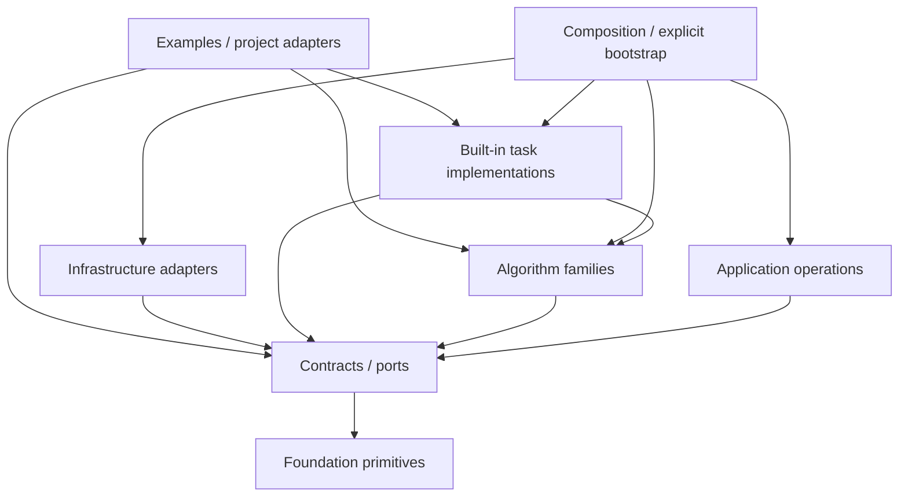

# Clean Architecture 与内置 Evaluation 重构计划

- 文档性质：最高优先级架构重构计划；不属于当前公开 API 或正式文档导航
- 状态：Approved for implementation；尚未实施
- 优先级：P0；除阻断主分支的 correctness/security 修复外，高于新增产品能力、
  长训练与硬件性能验证
- 制定日期：2026-07-31
- 适用范围：`src/stochaflow`、框架内置实现、公共扩展面、CLI、正式 examples 与
  architecture tests
- 统一排期：
  [Development Priority Roadmap](development-priority-roadmap.md)
- 规范边界：
  [Stochaflow 架构范围与非目标](../design/scope.md)
- 关联计划：
  [Extension 导入边界与激活延迟优化计划](extension-import-boundary-and-activation-latency-plan.md)、
  [训练后 Evaluation 与 Benchmark 支持计划](post-training-evaluation-support-plan.md)
- 已实施基础：
  [Metrics、训练诊断与模型选择正式契约](../metrics.md)

## 1. 决策摘要

本计划修正一个过度收缩的架构判断：**Clean Architecture 不要求框架只发布抽象类，
也不要求每个 example 重新实现完整任务。**

Stochaflow 可以并且应当内置经过验证、跨数据集或跨项目复用的任务族实现，例如：

- 普通图像、带类别图像、超分辨率与多分辨率数据 Builder；
- Gaussian、class-conditional Gaussian 等训练与采样组合；
- ADM、UNet、DiT 等框架维护的模型实现；
- image writer、paired evaluation、generation evaluation 和 grouped/class-aware
  evaluation；
- 少量稳定、可复用的 Metric、Diagnostic 与 Evaluation profile。

这些实现必须位于明确的 **built-in implementation boundary**，通过与第三方扩展相同的
Registry、Builder 与 capability 路径接入。它们不能反向污染 framework kernel，不能让
runner 按任务名或数据集名分支，也不能依赖 import side effect 获得隐藏特权。

Examples 的责任是：

- 绑定一个具体数据集、来源、许可、下载与 materialization 规则；
- 声明数据集自己的类别映射、split、sample identity 和 protocol version；
- 选择并配置框架内置任务族；
- 展示端到端工作流、结果与运行证据；
- 仅在确有新任务语义时实现新的 extension capability。

因此 AFHQ-v2 不应维护第二套 image-generation training/sampling/evaluation engine。
它只是一个 class-conditional image-generation dataset/protocol adapter，应复用框架
内置的相应 Builder、inference capability 和 grouped evaluation profile。

本计划同时确认：

1. **Clean Architecture 是当前最高工程优先级。**
2. **Evaluation 是框架内置的一等 operation。**
3. **高层 Evaluation composition 和可复用 task-family profiles 不继续留在 example。**
4. **AFHQ example 只保留 AFHQ 专属数据与 protocol，不增加 dog-specific lane。**
5. **目标 GPU 的吞吐、显存和长跑结果不是本架构重构的完成门槛。**

## 2. 术语与边界修正

### 2.1 Framework kernel 不等于完整 framework distribution

本文区分：

| 概念 | 所有职责 | 不应拥有 |
| --- | --- | --- |
| Framework kernel | 稳定 contract、operation lifecycle、state/error 语义、ports | 具体数据集、任务名分支、concrete provider bootstrap |
| Application use cases | Training、Sampling、Evaluation 的编排与事务边界 | 任务 batch 解释、具体模型签名、数据集类别 |
| Algorithm family | family-specific 数学、Process、Dynamics、transition、Sampler | 数据集身份、CLI、artifact publication |
| Built-in task family | 框架维护的可复用 Builder、Strategy、adapter、profile、writer | 单一数据集下载规则、example 路径、隐藏 dispatch |
| Infrastructure adapter | checkpoint/store/logger/plugin discovery/CLI I/O | 领域决策与任务组合 |
| Example/project | 数据集、protocol、配置、展示与专属 adapter | 复制已有 task-family runtime |

“位于 Stochaflow 仓库或 wheel 中”不等于“属于 kernel”。Clean Architecture 约束的是
依赖方向、职责 ownership 和替换边界，不是要求所有 concrete implementation 都搬出
发行版。

### 2.2 可复用 task family 与 dataset specialization

一个任务实现适合成为 framework-shipped built-in，当且仅当：

1. 语义不依赖某个数据集名称、目录布局或类别词汇；
2. 至少可被两个数据集/project 使用，或它是框架明确维护的 canonical workflow；
3. 输入依赖公开 artifact/batch/capability contract；
4. 兼容性在 Builder/Strategy 边界验证；
5. runner、CLI 与 config parser 不需要增加任务名分支；
6. built-in 与外部实现通过相同 Registry/construction path；
7. contract 可由独立 fake/custom implementation 验证；
8. state、错误和资源 ownership 可以稳定描述。

仅更换数据集不构成新任务。AFHQ、MNIST、CIFAR10 或其他图像来源可以共享同一个
image-generation task family；它们通过 DataSource、typed artifact payload、
class mapping 和 protocol config 表达差异。

### 2.3 允许 task-specific contract，但必须有界

Kernel 的 batch 根继续是 structured `Any`，但 built-in task family 可以定义自己的窄
typed contract，例如 class-labeled image batch、paired SR observation 或
class-conditional denoising capability。

这些 contract 必须：

- 位于 task-family namespace，不进入通用 `DataBuilder`、`Sampler` 或 artifact
  envelope；
- 不被无关 workflow 强制实现；
- 不作为 runner 分支条件；
- 通过 Builder 注入或 capability negotiation 使用；
- 不包含 `afhq`、`dog`、`mnist` 等 dataset identity。

## 3. 当前基线与问题归因

### 3.1 已经健康的边界

当前实现已经具备以下可保留基础：

- `Process` root 保持 model-free；
- `GenerativeDynamics` root 没有虚假的通用数学方法；
- `Sampler` 与 `SamplingBuilder` 的算法/任务组合边界基本成立；
- `TrainingPlan`、`TrainingStrategy` 和任意 structured batch contract 可扩展；
- Metrics 通过 opaque channels 聚合，不解释图像、类别或数据集；
- built-in 和第三方 extension 已经共享 Registry/construction 的基本路径；
- runner 没有维护 data/model/process/sampler 名称兼容矩阵。

### 3.2 依赖方向问题

当前 103 个 Stochaflow 模块形成 361 条内部 import 边。模块级没有 runtime circular
import，但折叠到 package 后，`metrics/models/processes/sampling/training/utils`
互相可达，形成 architecture-level strongly connected component。

典型反向依赖：

- `utils.config` 依赖 `metrics.config`；
- `utils.factory` 依赖 metrics、processes、training；
- 各领域包又依赖 `utils.registry/config`；
- `sampling.runtime` 通过 `utils.factory` 间接加载完整 training stack。

问题不是 Python 当前无法 import，而是依赖方向不再表达 ownership。`utils` 同时充当
foundation、infrastructure、application composition root 和 service locator，任何领域
变化都可能沿图反向传播。

### 3.3 Contract、built-in 与 bootstrap 共址

当前访问一个公共 contract 经常同时加载整族实现：

- `data.builder` 同时包含 `DataBuilder` contract 与 image/class/SR/multi-resolution
  built-ins；
- `training` package initializer 同时暴露 Strategy、Trainer、Gaussian task 和所有
  diagnostics；
- `sampling` package initializer 同时暴露 Sampler contract、Gaussian solvers、
  class-conditional task 和 image grid/writer；
- `stochaflow.extensions` 同时是公共 facade 与隐式 built-in bootstrap。

Fresh-process 审计中，`import stochaflow.extensions` 会加载 91/103 个 Stochaflow
模块并暴露 154 个名称。`import stochaflow.sampling.runtime` 会间接加载全部 training
模块。绝对耗时受机器影响，但 import closure 是确定的结构缺陷。

### 3.4 Runtime 协作过宽

`Trainer` 同时拥有自动优化、precision、accumulation、EMA、phase metrics、
monitor/early stop、diagnostics、logging、checkpoint 与 reporting。Diagnostics event
又把完整可变 `trainer: Any` 交给 provider，provider 通过 attribute lookup 读取和修改
model、EMA、device 与 mode。

此外，Strategy 与 diagnostic provider 通过 `Mapping[str, Any]` 和约定字符串键交换
Gaussian observation。结构上合法的自定义 Strategy 仍可能因为缺少未声明键而在运行时
失败。

### 3.5 Evaluation ownership 缺口

AFHQ example 已经实现 aggregate/per-class KID/FID，但当前高层 loop、结果组织、
completeness 与 protocol handling 仍主要由 example 自己拥有。其问题不是出现
`cat/dog/wild`——这些名称本来就属于 AFHQ protocol——而是框架没有提供可复用的
grouped generation evaluation operation，导致仅更换数据集就必须维护独立工具链。

## 4. 目标 Clean Architecture

### 4.1 依赖规则

目标依赖只允许向内：



硬规则：

1. `foundation` 不依赖任何领域 package；
2. `contracts` 只依赖 foundation 和契约本身不可避免的公共依赖；
3. application operation 只依赖 ports/contracts，不导入 concrete built-in；
4. family math 不依赖 Trainer、CLI、logger、checkpoint store 或 task Builder；
5. built-in task implementation 可以依赖 contracts 与明确 family capability；
6. infrastructure 实现 ports，但不决定 task composition；
7. composition/bootstrap 是唯一可以同时看见 Registry、built-ins、extensions 和
   infrastructure 的位置；
8. examples 只能通过 public contract/built-in surface 使用框架，不被 core 或
   composition package 静态 import；selected distribution activation 只通过 metadata
   和公开 entry point；
9. package facade 不执行注册、I/O 或 runtime bootstrap；
10. CLI handler 在 subcommand 解析后调用 application API，不成为 use case owner。

### 4.2 候选 package ownership

最终命名可以在 CA0 冻结，但职责至少应等价于：

```text
src/stochaflow/
├── foundation/                 # errors, immutable IDs, small utilities
├── contracts/                  # registry/config/operation/port contracts
├── application/
│   ├── training/               # training use-case orchestration
│   ├── sampling/               # sampling use-case orchestration
│   └── evaluation/             # evaluation use-case orchestration
├── families/
│   └── gaussian/               # Gaussian Process/Dynamics/math/solvers
├── builtins/
│   ├── data/                   # reusable data recipes, not dataset identity
│   ├── image_generation/       # image/class/SR task implementations
│   └── evaluation/             # reusable phase/paired/generation/grouped profiles
├── infrastructure/             # checkpoint, artifact store, logging, plugin adapters
├── composition/                # explicit bootstrap and factories
└── cli/                        # thin command adapters
```

这不是要求一次性重命名全部 public modules。迁移期间可以保留 lazy compatibility
exports，但 owner module 和 allowed dependency graph 必须先确定。

### 4.3 Built-in 与 extension 的对称性

Built-in 不是 privileged core branch：

```text
framework distribution metadata
    -> explicit built-in activation
    -> ordinary Registry registration

selected external distribution metadata
    -> explicit extension activation
    -> ordinary Registry registration

application composition
    -> Registry/port resolution
    -> Builder/Plan validation
```

允许两者的 activation 来源不同，但 registration validation、duplicate policy、
expected base、construction、lifecycle 与错误保证必须相同。

## 5. Framework-owned Evaluation

### 5.1 一等 operation

Evaluation 与 Training、Sampling 并列：

```python
run_training(TrainingRunRequest) -> TrainingRunOutcome
run_sampling(SamplingRunRequest) -> SamplingRunOutcome
run_evaluation(EvaluationRunRequest) -> EvaluationRunOutcome
```

框架拥有：

- subject/data/protocol authority；
- `EvaluationBuilder -> EvaluationPlan` composition boundary；
- inference/eval mode、device、seed、预算与完整性 lifecycle；
- MetricEngine dispatch；
- immutable `EvaluationResult` 与 manifest publication；
- comparison、selection、gate 和 reporting 的 result-only policy；
- live 与 offline scoring 的统一结果语义。

框架不把 Evaluation 塞进 Metric、Diagnostic 或 Sampling，也不要求 Process、Sampler、
Dynamics 或模型根增加 `evaluate()`。

### 5.2 两层内置支持

#### Kernel/application 层

提供 task-neutral：

- `EvaluationRunRequest`、`EvaluationRunOutcome`；
- `EvaluationProtocol`、subject/data identity；
- `EvaluationBuilderContext`、`EvaluationBuilder`、`EvaluationPlan`；
- `Evaluator`、`EvaluationStepOutput`；
- `EvaluationRunner`；
- artifact sink、result、comparison、gate 和 reporter ports。

Runner 只管理生命周期，不理解 image、class label、FID/KID、Sampler 名称或模型签名。

#### Built-in task-family 层

首批框架内置：

1. `PhaseEvaluationBuilder`
   - 复用合法的 Strategy phase capability；
   - 计算 loss 与普通 metrics；
   - 不冒充 formal benchmark。
2. `PairedEvaluationBuilder`
   - 对 prediction/target 或 restore/reference 的成对任务；
   - 支持 task adapter 提供的 sample IDs、pre/postprocess 与 metric channels。
3. `GenerationEvaluationBuilder`
   - 复用 SamplingBuilder 提供的窄 inference capability；
   - 组合 generated/reference channels、sample plan、artifact sink 与 distribution
     metrics。
4. `GroupedGenerationEvaluationBuilder`
   - 在 generation profile 上增加 opaque group allocation、aggregate 与 per-group
     metric state；
   - class-aware generation 是它的首个内置用途，但 kernel 不规定 group 来自
     `class_label`。

这些 Builder 进入框架内置 catalog，不由每个 example 复制。

### 5.3 Grouped/class-aware contract

Evaluation data view 必须显式提供稳定 sample IDs，而不是要求 Runner 从任意 training
batch 猜测 batch size、class 或 identity：

```python
@dataclass(frozen=True, slots=True)
class IdentifiedEvaluationBatch:
    sample_ids: tuple[str, ...]
    payload: Any


@dataclass(frozen=True, slots=True)
class EvaluationScope:
    scope_id: str
    display_name: str
    expected_populations: Mapping[str, int | None]


@dataclass(frozen=True, slots=True)
class ScopedMetricPacket:
    population_id: str
    sample_ids: tuple[str, ...]
    scope_ids: tuple[str, ...]
    channel: str
    update: MetricUpdate
```

约束：

- DataBuilder/task adapter 将选定 split 暴露为 `IdentifiedEvaluationBatch`，不修改
  universal training batch schema；
- task Evaluator 解释 payload，并在 mixed-group batch 中按 scope 切分 packet；
- `scope_id` 是 opaque stable ID；Runner 不解释 class、domain、language 或其他语义；
- 一个 packet 可以同时 fan-out 到 aggregate scope 和一个声明的 group scope；
- aggregate 和每个 group 使用独立 metric state，不能从 aggregate scalar 反推；
- Runner 只验证 population、sample IDs、scope、count 与 protocol completeness；
- missing、unknown、duplicate 或超出 allocation 的 scope 默认 fail closed；
- canonical result 以 stable `scope_id` 保存；`display_name` 只用于展示；
- Selection/Gate 通过 `(scope_id, metric_id, subkey)` 精确引用，不支持隐式 wildcard、
  per-class macro 或由 Reporter 重算；
- display name 可以是 `dog`，但只能来自 AFHQ protocol，不进入框架分支或通用 fixture。

当前 `MetricEngine.update()` 要求每次调用提供所有 required channels，这对 training phase
是有价值的严格 contract，但不能直接承担 reference/generated、paired 或 scoped packet
的多流生命周期。CA3 必须提炼共享底层 `MetricDispatchSession`：

- Metric 构造、detach、normalize、finite、collision 与 reset policy 继续共用；
- Training 继续使用“单次提供完整 channel set”的 strict wrapper；
- Evaluation 按 `scope_id + channel + population` 流式更新独立 metric state；
- compute 前验证每个 scope/metric 收到了 protocol 声明的所有 channel/population；
- 一个 packet 向 aggregate/group fan-out 时保持 failure atomicity；任一更新失败，
  整个 Evaluation metric session reset 并终止。

不能通过放宽现有 `MetricEngine.update()` 的 missing-channel 检查来实现 Evaluation。

### 5.4 生成 identity 与执行 session

当前 `SamplingBatch` 只有 samples/trajectory，class-conditional sampling 的 AFHQ evaluator
依赖“按 class 排列的 tensor block”推断类别。该顺序约定不能成为正式 Evaluation
contract。

CA4 应从 class-conditional sampling 提炼窄 generation capability，返回显式
`sample_id`、`scope/group_id` 与 payload record；SamplingBuilder 和 EvaluationBuilder
共同消费该 capability。Evaluation 不得调用完整 `run_sampling()` 后读取 tensor artifact，
也不得按输出位置猜 group。

同样，`EvaluationPlan` 不携带 `Mapping[str, nn.Module]` 让 Runner 解释 module/device/
mode。Builder 注入只读 `EvaluationExecutionSession` 或等价 port，由其拥有：

- 已解析 subject/weights；
- device 与 inference/eval mode guard；
- 任务所需的窄 inference capability；
- session enter/exit 与资源 ownership。

Runner 只打开 session、迭代 identified data、dispatch packets 并发布 result。

### 5.5 AFHQ 迁移后的责任

AFHQ example 保留：

- authenticated download/source lock；
- AFHQ artifact identity、official split 和 sample IDs；
- `cat/dog/wild` mapping；
- reference inventory 与 class histogram；
- AFHQ-specific protocol version、sample allocation 和配置；
- README、命令、结果展示与真实运行 evidence。

框架内置 Evaluation 保留：

- checkpoint/inference subject resolution；
- generated/reference lifecycle；
- aggregate/per-group scoped metric session；
- KID/FID binding 的可复用 generation profile；
- completeness、artifact/result/manifest；
- gate/reporting。

AFHQ 的 evaluator 工具最终应收缩为 dataset/protocol adapter 和 CLI convenience，不再
拥有第二套 evaluation engine。

## 6. 现有模块迁移图

| 当前 owner | 目标 owner | 决策 |
| --- | --- | --- |
| `utils.config` 中稳定 error/config primitives | foundation/contracts | 移除对 metrics 的反向依赖 |
| `utils.registry` generic primitive/catalog/global instances | contracts + composition | 拆分 contract、typed catalog 与 runtime inventory |
| `utils.factory` | composition | 不再作为所有领域依赖的 `utils` |
| `utils.checkpoint`、artifact store、logger implementations | infrastructure adapters | application 依赖 ports |
| `data.builder` base + image implementations | contracts + built-in data/image task | 保留可复用 Builders，拆 owner/import closure |
| torchvision named dataset sources | dataset adapters/examples | 不进入 kernel；可以作为明确的 first-party adapter package |
| `sampling` base + Gaussian/class/image writers | contracts + family + built-in task | 不删除可复用实现，拆分层次 |
| `training` Strategy/Plan + Gaussian/class task | contracts/application + built-in task | Trainer 不直接依赖具体 task |
| Gaussian/image diagnostics | generic diagnostic runtime + built-in task diagnostics | 不从完整 Trainer 抓状态 |
| `stochaflow.extensions` | lazy compatibility facade | 不再承担 bootstrap |
| AFHQ `evaluation_*` high-level engine | framework Evaluation + AFHQ adapter | 保留 dataset/protocol，移除重复 operation |

## 7. Runtime 职责拆分

### 7.1 Trainer

Trainer 保留 automatic-training use case orchestration，具体职责拆为窄协作者：

- `AutomaticOptimizationLoop`：forward/backward/accumulation/optimizer/scheduler；
- `PhaseMetricCoordinator`：phase-scoped MetricEngine 与 canonical snapshot；
- `DiagnosticDispatcher`：事件与 provider 调用；
- `SelectionPolicy`：monitor/best/early-stop 决策；
- `CheckpointPublisher`：何时发布哪个 snapshot；
- `TrainingReporter`：只读呈现。

资源 ownership 必须显式：注入 logger 是 borrowed 还是 owned，不能由 Trainer 默认关闭
所有外部资源。

### 7.2 Diagnostics

`TrainingDiagnostic` 的目标定义固定为：

> 绑定当前 training run、按 event/cadence 执行、只读的补充 probe。

它不是“昂贵 Metric”的继承层，也不是低配 Evaluation。一个统计算法仍是 Metric；
训练期需要额外 inference/sampling/cache/artifact 时由 Diagnostic 编排，冻结
subject/data/protocol 并发布正式结果时由 Evaluation 编排。Latency、throughput、
memory、I/O 和 cache 命中属于 Measurement，可以在 Diagnostic 或 Evaluation
上下文采集，但不得冒充质量 Metric。

Event 只携带 immutable facts；需要模型调用或临时 eval/EMA state 的 provider 通过
Builder 注入窄 capability，例如：

- `ReadOnlyInferenceSessionFactory`；
- `ManagedModuleView`；
- `SamplingCapability`；
- `DiagnosticArtifactSink`。

禁止继续传 `trainer: Any`。Family observation 使用明确的 typed diagnostic
observation contract，不使用跨模块约定的任意字符串字典，也不与 Strategy 的 Metric
channel 共用命名空间。

Diagnostic 可以：

- 使用显式绑定的 train/validation source；
- 执行额外 forward、sampling、reconstruction、cache、artifact 和 measurement；
- 返回带 source/protocol identity 的 typed result；
- 由 application 在 callback 外保护 RNG、mode 与临时 inference session。

Diagnostic 不得：

- 修改 managed model、optimizer、scheduler、EMA、precision 或 checkpoint state；
- 读取 test split 作为活动训练选择依据；
- 直接更新 best/latest、early stopping、HPO 或 gate；
- 通过 logger side effect 代替 canonical result；
- 把未到 cadence、到期但缺失和 provider failure 合并成同一 `None`/warning。

`SelectionPolicy` 单独拥有决策。只有 composition 验证过的 validation-role source、
显式 monitor key、稳定 protocol、有限 scalar 和明确 cadence/missing policy 同时满足时，
Diagnostic result 才有资格被消费；记录一个 observation 不自动产生选择资格。

### 7.3 Checkpoint 与其他 infrastructure

Snapshot construction、serialization codec、storage publication 和 restore policy 是
不同变化轴。Application 只依赖：

- state capture/restore port；
- immutable subject projection；
- checkpoint publication port。

本计划不要求立即支持远程 store，但本地目录/`manifest.json` 不应成为所有 application
contract 的必要形状。

## 8. 分阶段实施

所有阶段必须可独立合并并保持主分支可运行；不允许建立长期无法验证的大爆炸分支。

### CA0 — Ownership freeze 与 architecture gates

交付：

- 冻结目标 package ownership 和 allowed dependency DAG；
- 增加 AST-based forbidden-import test；
- 记录 module/package dependency graph；
- 增加 fresh-process facade/contract/runtime import probes；
- 将通用测试中的 `cat/dog/wild` 改为中性 group IDs；
- AFHQ-specific tests 和 resources 明确归属 example acceptance；
- 当前 API/export/Registry inventory 只作为迁移审计，不自动成为永久兼容要求。

退出条件：

- 新代码不能扩大 package-level SCC；
- architecture tests 能指出具体违规 edge；
- probes 不以 wall-clock 秒数作为跨平台 hard gate。

### CA1 — Foundation、contracts、application 与 composition 分离

交付：

- 提取 side-effect-free foundation primitives；
- 拆 `utils.config/registry/factory` 的反向依赖；
- application operation 依赖 ports；
- factories 与 built-in/external resolution 迁入 composition root；
- Data/Training/Sampling contract 与 built-in implementation 分模块；
- 保留必要 public import compatibility，但内部代码只使用 owner modules。

退出条件：

- package dependency graph 无跨层 SCC；
- sampling application import 不加载 Trainer；
- data/artifact contract import 不加载 metrics/training；
- independent custom implementations 通过原有公共 contract。

### CA2 — 显式 activation、bootstrap 与窄 facade

本阶段吸收 Extension import plan 的当前有效范围：

- built-in activation 显式、幂等并具有 failure-terminal 语义；
- metadata preflight 不执行 extension code；
- selected extension aggregate activation 继续 eager validation；
- package `__init__` 和 `stochaflow.extensions` 改为无副作用 lazy facade；
- CLI 按 subcommand 延迟 execution runtime；
- root facade 不再是内部依赖入口。

退出条件：

- bare facade 无 Registry mutation；
- built-in inventory 不依赖偶然 import 顺序；
- wrong-base/duplicate/reserved-name 错误仍在 registration boundary 失败；
- public typing/docs/runtime export parity 通过。

### CA3 — Framework Evaluation E0–E1

与 Evaluation 计划同步实施：

- `stochaflow.evaluation` contracts/application package；
- `EvaluationBuilder -> EvaluationPlan -> EvaluationRunner`；
- request/outcome/result/manifest；
- checkpoint subject 与只读 inference projection；
- phase 和一个独立 checkpoint built-in evaluator；
- CLI/library parity；
- custom EvaluationBuilder fixture。

退出条件：

- 用户可在不恢复 optimizer/training loop 的情况下评估 checkpoint；
- Runner 对 batch/model/task 无 concrete branch；
- Evaluation 与 Sampling 复用同一个窄 inference capability；
- Metrics、artifact 和 completeness lifecycle 可审计。

### CA4 — Built-in paired/generation/grouped Evaluation E2–E3

交付：

- prediction artifact 与 offline replay；
- paired、generation、grouped generation built-in profiles；
- identified reference data view 与显式 generated sample/group IDs；
- Training strict-full-update 和 Evaluation scoped-stream 共用 metric primitives；
- content-addressed reference cache；
- aggregate/per-group metric result；
- 将 AFHQ high-level evaluation engine 改为 framework profile adapter；
- AFHQ 继续按自身 mapping 做 class evaluation，不新增 dog-only command/test。

退出条件：

- 同一 built-in grouped evaluator 可由 AFHQ 和独立 synthetic/custom dataset 使用；
- mixed-group batch 不依赖顺序切块，Sampling/Evaluation 共用显式 identity capability；
- AFHQ example 不复制 checkpoint resolution、metric lifecycle、result publication；
- live/offline result 在同 protocol 下等价；
- missing/duplicate/unknown group fail closed。

### CA5 — Trainer、Diagnostic 与 infrastructure 解耦

交付：

- 删除 diagnostic event 的 `trainer: Any`；
- immutable event facts 与 typed diagnostic observation contracts；
- `ReadOnlyInferenceSessionFactory`、必要的 family inference/sampling capability 与
  artifact/measurement sink；
- 明确 TrainingDiagnostic 的 training-run-bound、cadence-driven、observation-only
  contract；
- 将 Metric、Diagnostic、Measurement、Evaluation 与 SelectionPolicy 的路由规则实现为
  composition validation；
- Trainer 生命周期协作者；
- checkpoint codec/store/restore responsibilities 拆分；
- logger ownership 明确；
- monitor、best/latest 与 Metrics 行为保持。

退出条件：

- Diagnostic 只能访问显式 capability；
- Diagnostic 无法修改 managed training state，也不能直接发布 checkpoint/selection；
- 普通 phase Metric 不会被低频 cadence 包装成新的 Metric 类型；额外训练期 probe 与
  冻结协议 Evaluation 可复用同一统计实现而不复用 lifecycle；
- runtime measurement 不进入 quality Metric channel，system/test/external source
  不能控制训练期选择；
- not-due、due-but-missing 与 provider failure 的行为由 contract tests 分别固定；
- fake Trainer attribute bag 不再是 provider contract；
- 自定义 Strategy 不因未声明字符串键产生隐藏兼容要求；
- automatic loop focused tests 与 full suite 通过。

### CA6 — Compatibility cleanup 与公开架构落盘

交付：

- 删除迁移期 internal aliases 和未公开 concrete root exports；
- 更新正式 architecture/API/configuration 文档；
- examples 只通过 canonical public surface；
- 将本开发计划的稳定决策转写进公开文档后归档；
- 重新基线 import/activation benchmark。

退出条件：

- 文档只描述已实现行为；
- wheel/source checkout/installed examples 全部通过；
- 没有依赖历史 import side effect 的调用路径。

## 9. 验证矩阵

### 9.1 Structural hard gates

- allowed dependency DAG；
- module/package SCC 检查；
- forbidden concrete imports；
- facade import closure；
- Registry mutation/activation state；
- CLI help/init/train/sample/evaluate 的独立 import closure；
- owner/export/typing/docs manifest parity。

### 9.2 Contract tests

- independent `DataBuilder`、`TrainingBuilder`、`SamplingBuilder`、
  `EvaluationBuilder`；
- arbitrary structured batch；
- independent algorithm family；
- direct transform without Process/Sampler；
- built-in 与 external implementation 使用同一 Registry path；
- wrong-base、duplicate、partial activation failure；
- task-family Builder 不依赖 dataset name。

### 9.3 Evaluation tests

- deterministic phase evaluation；
- live checkpoint evaluation；
- offline prediction replay；
- aggregate + opaque group results；
- group allocation、missing、duplicate、unknown、empty group；
- sample-order/batch-size invariance；
- raw/EMA subject identity；
- protocol comparison rejection；
- incomplete/non-finite/gate failure；
- AFHQ adapter contract；
- independent neutral three-group fixture，禁止用 `cat/dog/wild` 作为 core 语义。

### 9.4 Repository verification

 routine phase：

```bash
uv run ruff check .
uv run pyright
uv run pytest <focused-tests>
```

完整阶段合并前：

```bash
uv run pytest
uv build
```

并运行 config reference、Sphinx `-W`、installed-wheel import/extension/example acceptance。
硬件 throughput、VRAM、capacity 与 soak test 单独记录为 operational evidence。

## 10. 兼容与迁移政策

当前仍处于允许 breaking architecture cutover 的阶段，因此不为内部 import side effect、
未公开 concrete export、旧 config/checkpoint 或 example 私有工具提供无限兼容。

必须保护：

- 已声明的 artifact/checkpoint 安全加载与 fail-closed 行为；
- Registry duplicate/wrong-base/activation error guarantees；
- stable public contract 的对象 identity，除非提供明确 breaking note；
- built-in 与 external implementation 的平等路径；
- Metrics canonical result semantics；
- AFHQ official data/protocol identity 与 class-aware result 可解释性。

迁移规则：

1. 先建立 canonical owner，再提供临时 lazy re-export；
2. 内部调用在同一阶段全部迁到 owner module；
3. compatibility facade 不执行 bootstrap；
4. 不用 proxy class 破坏 `isinstance`、pickling 或 typing；
5. 删除 alias 前更新 examples、scaffold、API docs 和 installed-wheel tests；
6. checkpoint/config schema 如需 breaking，单独 bump 并写清拒绝行为。

## 11. 明确非目标

- 不把所有 concrete implementation 赶到第三方 extension；
- 不要求 AFHQ 重写 image-generation Builder；
- 不建立通用 Dataset/Transform/Collate YAML graph；
- 不给 Runner 增加 task、dataset、metric 或 model name 分支；
- 不建立 universal model `predict/evaluate` API；
- 不把 grouped evaluation 固定成 class-label schema；
- 不实现 leaderboard、human preference collection 或实验追踪平台；
- 不借 Clean Architecture 顺便引入 distributed、Hydra multirun 或通用 workflow DAG；
- 不新增 dog-only dataset、命令、配置、fixture 或性能验证；
- 不用目标硬件 benchmark 代替 dependency/contract tests。

## 12. Definition of Done

本计划只有在以下条件全部满足后才能标为 Implemented：

1. framework kernel、application、families、built-ins、infrastructure、composition 与
   examples 的 owner 明确并由 architecture tests 执行；
2. package dependency graph 不再包含跨层 SCC；
3. `utils` 不再反向依赖 metrics/processes/training；
4. sampling application import 不再加载完整 training stack；
5. facade 与 package initializer 不执行隐式 built-in bootstrap；
6. built-in activation 显式、幂等、可验证，且与 external registration 契约一致；
7. reusable image/class/SR Builders 保持框架 built-in，不由每个 example 重写；
8. concrete dataset identity 和 AFHQ mapping 不进入 kernel/application；
9. Evaluation 成为独立 framework operation，并提供 built-in phase、paired、
   generation 和 grouped generation profiles；
10. Training MetricEngine 的 strict-full-update 保持不变，Evaluation 通过共享 primitive
    实现 scoped/channel-stream metric session；
11. reference/generated sample 和 group identity 显式、完整，不由 artifact 顺序推断；
12. AFHQ example 复用 framework grouped evaluation，只保留数据集与 protocol adapter；
13. Diagnostic 不再接收完整 `Trainer`，family observation 不再依赖未声明字符串键；
14. Trainer 的 optimization、metrics、diagnostics、selection、checkpoint 与 reporting
    ownership 由窄协作者表达；
15. independent custom implementations 覆盖所有关键 public contracts；
16. focused/full tests、Ruff、Pyright、build、config reference、Sphinx 与 installed-wheel
    acceptance 全部通过；
17. 稳定架构行为已经进入正式文档，本计划原地归档或删除，不从公开导航链接开发历史。

## 13. 成功标准

重构完成后，以下场景必须同时成立：

- 新增一个与 AFHQ 数据格式不同、但语义仍为 class-conditional image generation 的
  dataset，只需要实现/配置 DataSource、artifact mapping 和 protocol；不重写
  TrainingBuilder、SamplingBuilder 或 EvaluationRunner；
- 新增一个独立生成 family，可以实现自己的 family capability 和 Builder，而无需修改
  core runner；
- 只使用 sampling 的进程不加载 Trainer 与 training diagnostics；
- 只做 extension metadata preflight 的进程不加载 concrete runtime；
- 用户可以通过 `stochaflow evaluate` 对冻结 checkpoint 执行 aggregate/per-group
  evaluation；
- AFHQ 仍按 class 报告结果，但 framework 从未出现“dog”分支。

这才是本计划采用的 Clean Architecture 判据：**可复用实现由框架维护，数据集差异由
adapter 表达，高层 use case 由内核拥有，而所有依赖都指向稳定 contract。**
