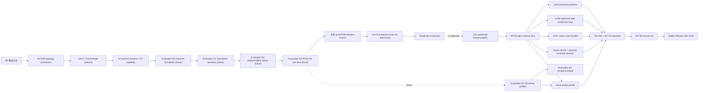

# Stochaflow Development Priority Roadmap

- 文档性质：根级 [`ROADMAP.md`](../../ROADMAP.md) 的工程执行细化；不属于公开 API
  或正式文档导航
- 状态：Active
- 制定日期：2026-07-29
- 最近排期复核：2026-08-02
- 当前工程优先项：只闭合 pixel/P2/Evaluation 分支；Evaluation E0/E1/E2 与 AFHQ-v2
  class-aware E3 vertical slice、A0/B1/A1、A2 class-aware example contract、RTX 4090
  capacity 和单 epoch controlled A/B readiness evidence 已关闭
- 合并后当前实验优先项：P2 production-quality closeout；按预先冻结的 long-run protocol
  完成单臂 `gamma: 1` 200-epoch production candidate、validation-only 选模与一次
  official-test 绝对质量验收
- 当前执行主线：corrected pixel ADM + learned-range Gaussian + concrete P2 training +
  formal AFHQ Evaluation；单 epoch 结果未显示 P2 收益，production long-run gate 仍开放
- P2 evidence 发布后的下一项尚未选择；codec/latent、consistency、SR、distillation 与
  Stable Diffusion 都不是 `Next` 或 `Planned`
- 兼容性：当前 breaking 阶段不为旧 config、checkpoint、cache 或 retired example
  保留迁移路径

## 1. 排期结论

当前不应平均推进所有 proposal。单一维护者的主执行序列是：

```text
已关闭 pixel Gaussian/P2/Evaluation foundation
  -> 合并当前 pixel/P2/Evaluation closeout 分支
  -> 运行并发布 P2 production 200-epoch candidate evidence
  -> 重新评审产品 roadmap
```

其中：

- [正式架构说明](../../ARCHITECTURE.md)保留两个明确
  attribution boundary：A0 只修 topology；A1 实现 learned variance、hybrid
  objective、P2 和 respaced ancestral DDPM。
- A0 是当前 `adm_unet` 名称与实现不一致的 correctness 修复，纳入 P0，在 B1 前
  完成；它不启动新的 production 长训练。
- `Train/Sample authority cutover` 只执行
  [Hydra 迁移计划](hydra-configuration-composition-migration-plan.md)的 C0/C1。
  它先修正 plain YAML、checkpoint 和 sample authority，不依赖 Hydra runtime。
- Metrics 已作为正式框架能力关闭：task-neutral `MetricEngine`、Strategy channel、
  phase-local runtime 和 validation-only selection 的当前契约见正式文档，不再维护
  独立开发计划。Evaluation E0 outcome foundation 与 E1 standalone checkpoint
  Evaluation、E2 prediction artifact/offline scoring 以及 E3 AFHQ-v2 full-test slice 也已
  关闭；controlled AFHQ one-epoch A/B evidence 也已产生。其他任务的 quality profile
  不是当前 Evaluation 里程碑的剩余项；任务若未来实现，必须同步实现自己的 monitoring 与
  Evaluation。production long-run promotion 是合并后的独立实验 gate。
- Hydra H0–H3、comparison/gate 增强以及全部 codec/latent/consistency/SR/distillation 工作
  都不进入当前分支；long-run evidence 发布后先重新评审 roadmap，且不预设下一条路线。
- 目标硬件上的 capacity、吞吐与显存验证是 operational evidence，不是 A0/A1 的
  合并门槛。
- prepared posterior、optimizer-step training 与 codec asset bundle 不阻塞 smoke，
  但阻塞正式多 checkpoint 长训练。
- Stable Diffusion 不是被移除的 future idea，而是仅在 codec/latent 路线重新确认后才排期的
  下游产品候选。
- distributed、HPO、Consistency Distillation、通用 workflow orchestration 和
  metadata/provenance/capacity 不进入当前关键路径。

截至 2026-08-01，B1/C1 已关闭：训练 schema 不含 sampling 或
`ema.use_for_sampling`，独立 `sample:` schema 是完整 invocation，sample CLI 同时要求
checkpoint 与 config，训练后自动 sample 与 skip flag 已删除，checkpoint v12 拒绝 v11，
训练/sampling manifest 也按各自 authority 生成。C2 的 retained-example 全量清理与
Hydra H0–H3 仍按后续 gate 推进。

同日关闭了 E0 outcome foundation：runner 现在返回 immutable
`TrainingRunOutcome`，保留完整 final/test canonical metric mappings、checkpoint selection
和 artifact paths；training manifest 只在 reporter 与 logger 成功收尾后发布
`status: completed` 与 `outcome`，失败不发布 outcome。E1 随后关闭 standalone
checkpoint Evaluation：strict config、safe v12 subject、显式 raw/EMA、
`EvaluationBuilder -> EvaluationPlan`、validation/test completeness、CLI/library runtime
与 atomic result bundle 已实现。E2 随后关闭 versioned prediction manifest、streaming
JSONL sink、exact sample-plan completeness、offline replay、producer lineage 与 deterministic
gallery IDs。E3 AFHQ-v2 slice 随后关闭 core FID/KID adapters、public full-official-test
Builder/Metric/profile、pinned raw/EMA SamplingBuilder seam 与 live/offline parity。
library-first `TrainingRunRequest`/`run_training()` 与通用 comparison/gate 是独立可选增强，
不属于当前普通图像生成闭合项；P2 production long-run quality evidence 仍未完成。
P2-specific tiny smoke、full-topology
sanity、正式目标设备 capacity 与一轮 epsilon/fixed controlled A/B 已落地；该 A/B 未显示
P2 收益，也不关闭 200-epoch promotion gate。

当前分支的责任到 pixel/P2/Evaluation contract、测试、公开文档与 readiness evidence
闭合为止。200-epoch P2 candidate 训练及正式评估必须在该分支合并后运行；codec provider、
latent training、latent evaluation 和 Hydra 扩展均不得搭车进入本分支。

根级 [`ROADMAP.md`](../../ROADMAP.md) 拥有高层产品方向、优先级和 milestone 状态；
本文件在其约束下拥有**跨计划工程执行顺序与排期细节**。各能力计划继续拥有自己的
contract、API、测试和风险。若能力计划中的旧 phase 顺序与本文冲突，应先同步能力计划，
再开始实现，不能同时执行两套顺序。

## 2. 优先级语义

| 级别 | 含义 | 资源政策 |
| --- | --- | --- |
| P0 | 当前变更必须先关闭，或会让主线立刻返工 | 顺序执行，完成后再扩展主线 |
| P1 | 当前产品主线或已明确的直接前置 | 默认占用主要开发与实验资源 |
| P2 | 主线生产化或正式质量证明 | 可与 P1 后半段并行，但必须在正式 baseline 前闭合 |
| P3 | 下一条产品能力 | P1/P2 的共享前置稳定后启动 |
| P4 | 条件启动的基础设施 | 只有 profiling 或第二个真实案例触发时才进入排期 |
| Later | 独立研究或远期产品项 | 不从当前主线借用阻塞优先级 |
| Deferred | 已明确暂缓 | 只在文档列出的 decision gate 重新开启 |
| Done | 已实施决策记录 | 不占开发排期，只接受必要维护 |

优先级不是架构层级。一个 P4 基础设施 proposal 可能很重要，但在没有真实容量或复用
证据时仍不应先于 P1 产品闭环。

## 3. 依赖图



Inference asset projection、Metrics、E0 outcome foundation、E1 standalone operation、E2
artifact replay 与 AFHQ-v2 E3 slice 已完成。实线当前路径只到 branch merge、A3 long-run
evidence 与 roadmap re-decision。其余 E3/E4 是未来完整 Evaluation gate；虚线表示它们不
阻塞当前 AFHQ slice。A1 与 L0 没有架构依赖，但本轮排期明确禁止在 re-decision 前启动
L0/LD3。三类 AFHQ 与 latent quality profile 都消费 Evaluation 基础，但使用不同
subject/data/protocol，不能共享一个模糊 FID。

## 4. Milestone 排期

以下为单一主要维护者的相对工程量估计，不包含数据下载、策展审批和 GPU 长训练的
wall-clock 时间。每个 milestone 应独立提交并保持主分支可运行。

### B0 — Baseline Closed（P0，1–2 个工程日）

范围：

- 完成当前 data artifact 单次完整 hash + load 后元数据复查变更；
- 关闭未提交的 config/documentation follow-up；
- 运行 focused tests、Ruff、Pyright，并确认当前 MNIST/AFHQ 路径仍可用；
- 不在本阶段引入 Diffusers、Hydra 或新数据集。

退出条件：新的 latent 分支建立在已提交、可复现、无已知挂起回归的基线上。

### A0 — ADM Topology Correctness Cutover（Done）

执行已关闭的 P2/ADM A0：

- 以 pinned OpenAI guided-diffusion U-Net 作为唯一 topology reference；
- 修复 per-input-block skip ledger、每级 `num_res_blocks + 1` decoder blocks、
  same-channel residual resampling 与逐 block attention placement；
- 用 GroupNorm + QKV + zero-output residual attention 替换 Spatial Transformer；
- 128 config 使用 `[1,1,2,3,4]`，到达 8×8，并准确声明 32/16/8 attention；
- 删除旧 topology config fields，不增加 legacy mode 或 checkpoint adapter；
- 旧 raw/EMA/optimizer state fail closed，必须 fresh run；
- maintained production config 依据 schema-v3 RTX 4090 capacity report 使用 microbatch 8 /
  accumulation 4，保持 effective batch 32、每 epoch 420 updates 与 84,000 total steps；
  该 measured selection 是 operational evidence，不复用旧 topology 的容量声明。

A0 只验证 fixed-variance baseline，不实现 P2 或用新 topology 启动长训练。当前
README 的 epoch-170 结果属于旧 91.3M topology，A0 完成时不得继续归因给新的
production config。

repository exit 已于 2026-07-30 闭合：topology/parameter golden、
guided-diffusion tiny forward/gradient fixture、forward/backward、
fixed-variance train/sample、old-checkpoint rejection、config reference 与公开文档
均已落地。后续 RTX 4090 operational capacity evidence 已于 2026-08-01 由 schema-v3
report 补齐；它不改变 A0 的 algorithmic scope。

### B1 — Train/Sample Authority Cutover（Done，2026-08-01）

只执行 Hydra 计划 C0/C1：

- train config 删除 sampler、writer 和 implicit final sample；
- sample config 成为完整的 `sample:` invocation，不再是 checkpoint defaults 的
  partial overlay；
- bump checkpoint schema，旧 checkpoint 不兼容；
- `TrainingPlan.inference_recipe` 继续拥有不可覆盖的任务组合语义；
- diagnostics 自己声明训练期采样需求；
- 保持配置可读性为验收门槛。

本 milestone **不安装或启动 Hydra**。它的目的，是避免 latent inference assets 和
sample/decode 先接入现有 checkpoint schema，随后又被 C1 重写。

退出条件已闭合：同一 checkpoint 可被 DDPM/DDIM 多个完整 sample profile 消费；sample
文件没有 Builder，train 文件没有最终 sampler/writer 或自动运行开关。checkpoint state/
fixed recipe 与完整 sample config 保持平行权威，不再 merge mutable defaults。

### A1 — Learned-range Gaussian and P2 Capability（Done，2026-07-30）

执行已关闭的 P2/ADM A1；稳定 contract 见[正式架构说明](../../ARCHITECTURE.md)：

- model/process/dynamics 使用窄 family capability 表达 `2C` learned-range variance；
- epsilon simple MSE 与 detached-mean variational-bound term 构成 hybrid loss；
- P2 由具体的无条件/类条件 `TrainingStrategy` 与对应 `TrainingBuilder` 实现；
  配置通过 P2 builder 的私有 `k`、`gamma` 参数表达，不建立 weighting policy
  registry；
- exact `w_t = (k + SNR(t))^-gamma`，P2 只加权 simple term；
- CFG 只作用于 prediction half，variance 取 conditional branch；
- DDPM 支持 250-step improved-diffusion-style respaced ancestral transition；
- DDPM/DDIM 只复用 selected-pair Gaussian marginal coefficient snapshot；DDPM 构造
  posterior，DDIM 保留自己的 `eta` transition；
- inference recipe 固定 prediction/variance semantics；
- gamma-zero、learned-range、VB gradient 与 upstream numeric parity tests。

本 milestone 不把 P2 注册为通用 Objective，不建立 weighting policy registry，也不
把 P2 推广到 v/x0/score；它关闭时没有修改当时的 v-prediction production AFHQ recipe。
A3 后续增加一份显式 `gamma: 1` production candidate，不改变 A1 的 algorithmic exit。

退出条件已闭合：P2 official 256 unconditional topology 精确为 93,563,910
参数；loss、variance、respacing 与 pinned reference parity 已测试；旧
fixed-variance paths 无回归。

AFHQ product surface 另有两个 maintained readiness profiles：

- `smoke/train-adm-128-p2.yaml` 使用真实 AFHQ、tiny ADM、4 micro-batches / 2 optimizer
  updates，证明 P2 Builder、EMA、diagnostics、validation/test 与 checkpoint wiring；
- `profiling/train-adm-128-p2.yaml` 使用 corrected 105,197,187-parameter topology、BF16、
  micro batch 1 和 8 optimizer updates，只作 full-topology sanity。

当前 CUDA 工作站已实跑两者：tiny lane 完成上述完整 lifecycle；full-topology lane 完成
8 updates、validation/test 与 checkpoint publication，并观测到 compute-only 4.34
optimizer steps/s。这两个 bounded profiles 不改变 A1 的 algorithmic exit，本身也不构成
effective-batch-32 production throughput、capacity、peak VRAM、长训练稳定性、质量或 A/B
证据。

独立 schema-v3 capacity sweep 已在 RTX 4090 24,564 MiB、PyTorch 2.11 / cu128 上完成
corrected topology + P2 BF16 training 的 micro batch 1/4/6/8 trials；每档均为
5 warmup + 25 measured updates，且 non-finite observation 为 0。8 / 4 档为已测最高吞吐
60.068 images/s，peak
allocated/reserved 为 8.260/8.506 GiB，因此 production ADM 采用 8 / 4，同时保持 420
updates/epoch 与 84,000 total steps。这是 operational capacity/sustained evidence，不是
长训稳定性、质量或 A/B 证据。

### A2 — Class-aware AFHQ Evaluation（scope revised，repository contract complete）

原单类别 reproduction lane 已取消，不再新增专用 DataSource、训练 recipe、采样
protocol 或 benchmark resolver。AFHQ 只维护现有 class-conditional product surface：

- official cat/dog/wild 数据与统一 class-labeled artifact；
- aggregate 和 per-class KID/FID；
- validation 选择 frozen subject 后，official test 只运行一次；
- 结果固定 checkpoint、data identity、class allocation、sampler 与 metric protocol。

class-aware evaluation contract 与回归测试已经通过。RTX 4090 的容量、吞吐与显存
operational evidence 已完成；DGX 跨设备复跑与长训练质量结果仍属于后续运行验收，不阻塞
A0/A1、A2、Metrics 或 main 合并。通用
Evaluation Operation 已完成 E0 outcome foundation 与 E1 standalone checkpoint
vertical slice、E2 artifact/offline scoring 与 E3 AFHQ-v2 class-aware quality slice。public
profile 固定 full official test 493/491/483、pinned EMA、DDIM-50/CFG 2.0、aggregate/per-class
FID/KID，并发布可 offline replay 的 predictions。

该 profile 当前固定现有 AFHQ production 的 v-prediction recipe；它关闭的是 public
evaluation 架构/配置 readiness。epsilon/fixed controlled A/B 也已用
`formal-ddim50-cfg2-official-test-epsilon.yaml` 完成：protocol
`afhq-v2-adm-epsilon-ddim50-cfg2-official-test-v1` 只把 P2 Builder 的 `gamma` 从 0 control
改为 1 treatment；两 arm 同 seed、corrected topology、真实 AFHQ、BF16、batch 8 /
accumulation 4、1 epoch / 420 updates，并评估各自 `latest.pt` EMA。exact 1,467-sample
official test 上，aggregate FID 为 369.621427 -> 371.250343，KID mean 为
0.476357937 -> 0.479742199；各类也都略差。KID delta 与 std 同量级，单 seed/epoch 只关闭
受控 pipeline readiness，不是统计显著或 200-epoch promotion evidence。production long-run
gate 仍开放。

### A3 — P2 Production-Quality Closeout（合并后 Active，实验时间）

当前分支只负责把 pixel/P2/Evaluation implementation、focused/full verification、公开文档
与 readiness evidence 合并到主线；不得在未合并代码上启动昂贵正式训练。合并后按以下顺序
执行：

- 按 checked-in
  [`p2-production-closeout-policy.yaml`](../../examples/showcases/afhq-v2/experiments/evaluation/p2-production-closeout-policy.yaml)
  执行：eligible epochs 固定为 20、40、...、200，validation aggregate FID lower 为
  primary，aggregate KID mean lower、再 earliest epoch 为 tie-break，seed 固定为
  `20260726`；
- 使用 maintained `experiments/production/train-adm-128-p2.yaml` 完成单臂 P2 `gamma: 1`
  200 epochs / 84,000 optimizer updates；该 profile 固定 corrected topology、真实 AFHQ、
  epsilon/fixed、BF16、batch 8 / accumulation 4 与 EMA decay 0.9999；
- 只用 `selection-ddim50-cfg2-validation-epsilon.yaml` 对候选 `epoch_*.pt` EMA 运行
  300/class validation Evaluation，并据预声明规则冻结唯一 subject；训练期 `valid/loss`、
  diagnostic、phase test 与 official test 都不得参与选择；900-example validation 结果只
  排序候选，不具有 acceptance 权限；
- subject 冻结后，只对它运行一次 exact 1,467-sample official-test epsilon profile，原子发布
  checkpoint、resolved config、prediction/result manifest、protocol/dataset/sample IDs 与
  provider digests；required acceptance 同时要求 aggregate FID ≤ 35、aggregate KID mean
  ≤ 0.01 与每类 FID ≤ 65，aggregate FID ≤ 30 为 aspirational target；
- 无论 absolute-quality acceptance 通过或失败都发布结果，不能事后调整阈值、seed、
  checkpoint candidates 或 test protocol。本单臂 closeout 不支持“P2 优于 standard”的
  因果声明；该声明若将来需要，必须另跑只把同一 production profile 改为 `gamma: 0` 的
  matched control。

A3 的退出条件是完整长跑证据与 gate 结论可审计发布；它不是 P2 必然获益的承诺。A3 关闭后
必须先更新根 roadmap 作产品重决策，不自动授权 codec/latent 实施。

上述 acceptance 是只适用于 epsilon/fixed P2 production subject 的内部项目门槛；
standard-v ADM 与 DiT 不继承。该评估使用 AFHQ-v2 官方 test split 和本项目自定义的
class-conditional 128×128 DDIM-50/CFG 2.0 protocol，不是
[P2 CVPR 论文](https://openaccess.thecvf.com/content/CVPR2022/html/Choi_Perception_Prioritized_Training_of_Diffusion_Models_CVPR_2022_paper.html)
及[作者仓库](https://github.com/jychoi118/P2-weighting)中的 unconditional AFHQ-Dog-256
benchmark；论文报告的 P2 FID 11.55 不能与本项目数值横比。

### L0 — Pretrained Codec Ready（Post-A3 re-decision candidate，未排期）

本节保留候选方案与估算，不表示当前分支或 A3 实验窗口已授权实现。只有 A3 证据发布并且
根 roadmap 明确重新确认 latent 路线后，L0 才能转为 `Active` 或 `Next`。

截至 2026-07-30，其中的 inference asset projection 子切片已经由
knowledge-distillation reference extension 的 embedded `LogitCalibrator` 完成
installed-wheel、strict-resume 和 offline checkpoint-only 验收。Diffusers
`AutoencoderKL` provider、真实 codec capability 与 latent workflow 仍未实现，因此 L0
整体仍未完成。

剩余工作是 Latent Phase 2：实现 optional Diffusers `AutoencoderKL` codec
provider。Phase 1 已闭合
`TrainingPlan -> CheckpointManager -> SamplingCheckpointView ->
InferenceAssetProvider -> SamplingBuilderContext`，不在本 milestone 重复实现。

首个 provider 固定支持：

- `stabilityai/sd-vae-ft-mse`；
- immutable Hub commit 或 immutable local Diffusers directory；
- f8d4 geometry；
- posterior `sample`/`mode`；
- codec-owned scaling/shift/mean/std transform 与精确 inverse；
- explicit precision/`force_upcast`；
- freeze/eval、optimizer/EMA exclusion；
- self-contained reconstruction config、weight digest 和 offline recovery。

只增加针对 optional dependency 的窄 import gate：import core 不得导入 Diffusers，
forward 不得访问网络。完整 extension import refactor 不进入本 milestone。

退出条件：删除原始 provider path、断网后，fake codec 和真实 codec 都能从 checkpoint
声明/state 恢复并 decode；pixel checkpoint 行为不变。

### L1 — AFHQ Latent Diffusion Vertical Slice（Post-A3 re-decision candidate）

实现新的 image-backed latent recipe，而不是给现有 pixel recipe 增加
`latent: true`：

- AFHQ 128×128 -> f8d4 -> 4×16×16 latent；
- DiT-S/2、3-class conditioning、class dropout 与 CFG；
- training Strategy 在 `no_grad` 下 encode；
- sampling 复用 DDPM/DDIM，在 latent space 禁止 pixel clipping；
- 最终 latent 由 checkpoint-owned codec decode 后交给 image writer；
- tiny overfit、resume、raw/EMA 独立进程采样、reconstruction panel；
- `--no-progress` 下 local log 可观察。

退出条件：可以准确声明“Stochaflow experimental latent diffusion + pretrained AE
pipeline 可训练、可恢复、可独立采样”。该声明不包含规模或正式生成质量。

### L2 — Production Latent Training Substrate（Post-A3 re-decision candidate）

三项可以并行，但必须在第一次正式多 checkpoint 长训练前全部完成：

- **LD4A prepared posterior moments artifact**：稳定 sample key、codec/preprocess
  identity、sharded mmap、online/prepared parity 和 strict artifact binding；
- **LD4B optimizer-step production loop**：`max_train_steps`、optimizer-step
  checkpoint/log/diagnostic cadence、mid-epoch resume policy、controlled stop 和
  completion marker；
- **LD4C run-level codec asset bundle**：checkpoint 不重复数百 MB codec weights，
  支持 relocation、offline、digest verification、retention 和 GC。

Phase A embedded codec 只允许用于 L0/L1 correctness，不用于正式长训练。

### Q0 — Configuration and Latent Evaluation Closeout（Post-A3 re-decision candidate）

在 L1 后启动，在 L3 前完成：

- Hydra H0–H3：只组合 fresh training；完成 MNIST/AFHQ parity、`--check`、readability
  linter 和文档；
- C2 retained-example cleanup：只维护 MNIST 与 AFHQ-v2，并以小型 fixture 替代
  Physics/KD 的 framework contract coverage；
- E0 outcome foundation 与 E1 standalone operation 已在 pixel P2 lane 提前建立；
  E2 artifact/offline scoring 也已建立，本 milestone 后续补充 E3 latent reconstruction
  与 decoded-generation profile 的 codec-dependent 子集；
- Evaluation 复用 L0 的 inference projection，不再实现第二套 checkpoint subject
  asset resolver。

Hydra H4 multirun、distributed prediction artifact lifecycle、额外 shard formats 和完整
comparison/gate 均不属于 Q0。

### L3 — Open-data DiT Baseline（Post-A3 re-decision candidate）

- 策展并冻结 The Met Open Access snapshot；
- 通过 codec reconstruction promotion gate；
- 先运行 DiT-S/2 的 1k optimizer-step 4090/DGX Spark profile；
- 冻结 batch、accumulation、checkpoint、evaluation 和 condition allocation；
- 形成固定 KID/FID、class fidelity、nearest-neighbor 和 performance protocol；
- 完成 DiT-S/2 baseline 后才启动 DiT-B/2 长训练。

production asset bundle 必须早于本 milestone 的多 checkpoint 训练，而不是在
profiling 完成后再补。

### S0 — Stable Diffusion 1.x Native Sampling（P3，2–3 个工程周）

执行 Stable Diffusion SD0–SD4：

- pinned Diffusers Pipeline 只作 black-box parity oracle；
- tokenizer 与 frozen text encoder asset；
- component-native conditional UNet、CFG 和 sampling parity；
- image-text/caption DataSource/DataBuilder；
- 复用 latent codec、asset bundle、Process/Sampler 与 Evaluation。

black-box backend 不能证明 native training support，也不成为 latent DiT 的前置。

### S1 — Stable Diffusion 1.x Full Fine-tuning（P3，2–4 个工程周 + 实验时间）

执行 SD5–SD6：

- 256 full-parameter UNet fine-tuning bring-up；
- 512 formal fine-tuning；
- frozen codec/text encoder；
- optimizer-step resume、offline bundle、fixed prompt suite 和正式 evaluation；
- 先 profiling 再决定 activation checkpointing、compile 或 distributed。

完成后才能声明 Stable Diffusion 1.x component-native training support。

### X0 — Scale and New Families（P4/Later，decision-gated）

只在前述 milestone 的证据触发时启动：

- distributed D0–D5：单设备 throughput/capacity 不足时；
- Hydra H4：确有有限 sweep 需求且可 process-isolate 时；
- automated tuning：stable metric/protocol 和 reusable single-run seam 已冻结时；
- Consistency Distillation：作为独立研究轨道重新基线化后；
- ImageNet-100、DomainNet、independent non-DiT denoiser；
- Stable Diffusion random-init、prepared text embeddings、LoRA、SDXL、SD3；
- workflow orchestrator 或 generic pretrained asset abstraction。

## 5. 全部开发计划排期

| 开发计划 | 状态 | 优先级 | 启动/完成门槛 | 本轮决定 |
| --- | --- | --- | --- | --- |
| [Data Artifact Producer Lifecycle](data-artifact-producer-lifecycle-refactor.md) | Done | B0 maintenance | 当前 follow-up 通过验证 | 作为 prepared posterior 基座，不重开 lifecycle |
| [Data Layer Composition Boundary](data-layer-composition-boundary-review.md) | Done | Base | 已实施 | image-backed 与 prepared-backed 使用两个 recipe-level Builder |
| [Sampling Request Config Refactor](sampling-request-config-refactor.md) | Superseded by C1 | Done | Hydra C1 | 仅保留为历史记录，不维持 v10/v11 dual authority |
| [Legacy Intel macOS Lifecycle](legacy-intel-macos-pytorch-test-lifecycle.md) | Done | Maintenance | 无 | Deprecated / best effort，不约束新 codec/DiT |
| [Gaussian loss/P2 与 ADM topology](../../ARCHITECTURE.md) | Core implemented；A3 experiment after merge | P2 Active | pixel/P2/Evaluation branch merge -> A3 | 稳定 contract 已移入正式文档；下一项是单臂 200-epoch P2 candidate 的 validation-only selection 与 one-shot official-test acceptance，不是 latent implementation |
| [Latent Diffusion](latent-diffusion-support-plan.md) | Post-A3 re-decision candidate | Unscheduled | A3 evidence published -> root roadmap decision | 不属于当前分支；不得把 branch merge 解释为自动启动 L0–L3 |
| [Hydra Configuration Migration](hydra-configuration-composition-migration-plan.md) | Split；C0/C1 Done；remainder unscheduled | Later | A3 后与 codec/latent 一并重排 | plain-authority cutover 已关闭；H0-H3/H4 均不进入当前分支 |
| [Post-training Evaluation](post-training-evaluation-support-plan.md) | E0/E1/E2 + E3 AFHQ slice Done；full E3/E4 future | P2 current-scope closeout + Later | 当前 merge 只验收 AFHQ slice；完整 E3/E4 使用独立未来门禁 | public AFHQ full-test KID/FID 与 replay 已关闭；SR、其他 generation/latent profile、reference cache、performance/curve、comparison/gate 不阻塞当前分支 |
| [Stable Diffusion Component-Native](stable-diffusion-component-native-support-plan.md) | Post-A3 downstream candidate | Unscheduled | codec/latent 路线重新确认且 L2/L3 稳定 | 不属于当前分支；SD1–SD8 在 roadmap re-decision 后重新排期 |
| [Default Workflow and Pipeline](default-workflow-pipeline-support-plan.md) | Umbrella / promotion | P3/P4 | 真实 recipe 稳定 | 不阻塞 capability；R0 复用 Hydra H1 invocation seam |
| [Extension Import Boundary](extension-import-boundary-and-activation-latency-plan.md) | Rebase required | P4 | C2 后重新测量 | pre-v12、Physics/KD DoD 失效；只做 codec 窄 import gate |
| [Distributed Training and Inference](distributed-training-and-inference-support-plan.md) | Conditional | P4 | L3/S1 profiling 证明需要 | 先 D0 profiling；再决定 DDP/FSDP2 |
| [Automated Model Tuning](automated-model-tuning-plan.md) | Later | Later | 正式 Metrics API + Evaluation + stable baseline | 不优化尚未冻结的 codec/data/protocol |
| [Consistency Distillation](consistency-distillation-support-plan.md) | Rebase required | Later | 主线稳定并重新选择案例 | 不再以已退出维护的 extension project 为实施入口 |
| [Artifact Metadata, Provenance and Capacity](artifact-metadata-provenance-capacity-model-proposal.md) | Deferred | Deferred | 文档所列重复模式 gate | codec identity 只保存验证必需事实，不重开通用 descriptor |

## 6. 跨计划关键决策

### 6.1 配置与 checkpoint

- 配置可读性是一等公民；新 latent/SD 配置直接使用当前 v12 authority，不先写旧格式。
- C0/C1 plain config authority refactor 已关闭，但不等同于完整 Hydra adoption。
- Hydra 只负责 fresh train authoring/composition；sample、resume、evaluation 和
  capacity 继续由各自 authority 处理。
- Latent/SD sample 文件使用完整 `sample:` envelope，不出现 Builder、codec source、
  model、data 或 training。
- 新 checkpoint schema 一次性同时为 immutable inference recipe 和 selected
  inference assets 留出稳定投影，避免连续 bump。

### 6.2 Pretrained asset

- 首版只实现 image codec 的 concrete provider，不建立 arbitrary pretrained-model
  registry。
- acquisition identity、self-contained reconstruction declaration 和 embedded/bundled
  state 是三个不同事实。
- codec 是成对 encoder/decoder 的单一 asset；不能从不同 revision 拼接。
- training config 声明 codec 一次；resume、sample 和 Evaluation 从 checkpoint/run
  bundle 恢复。
- teacher、codec、text encoder 至少出现两个可证明相同的重复 provider lifecycle
  后，才重新评估 generic pretrained asset abstraction。

### 6.3 Latent data 与训练

- AFHQ image-backed path 先证明 correctness；prepared posterior 是 production
  optimization，不是支持声明的前置。
- prepared posterior 是 schema-v2 `DataArtifact`，codec weights 是 model asset；
  两者不共用生命周期。
- image-backed 与 prepared-backed 是不同完整 runtime recipe，不用一个
  `latent: true` 或 nullable source graph 合并。
- Process 和 Sampler 只看 normalized latent，不知道 VAE、图像或文本。
- 正式长训练以 optimizer step 为预算；epoch 仍可用于有限数据遍历和报告，但不作为
  唯一 checkpoint cadence。

### 6.4 Quality 与发布声明

- A0 后不再把旧 91.3M ADM checkpoint、FID/KID 或 sample panel描述为新
  `adm_unet` production config 的可复现结果。
- P2 capability 的数值正确性由 epsilon、learned range、linear T=1000、uniform
  timestep 与 standard/P2 parity tests 固定；仓库不维护单类别 paper reproduction。
- Metrics 的 `loss_aggregation_weight` 只控制 epoch loss 报告；P2 timestep weighting
  是具体 Strategy 的内部目标语义，不进入通用 Metrics 或 `TrainStepOutput` 字段。
- public AFHQ evaluation 对 full official test 同时报告 aggregate 和 cat/dog/wild
  per-class 结果，并冻结 493/491/483 reference/generated completeness。
- P2 production candidate 只能用预声明的 300/class validation Evaluation 在 eligible
  epoch EMA 中冻结唯一 subject；`valid/loss`、diagnostic、phase test 与 official test
  均不参与选择，full official test 只对冻结 subject 运行一次。
- 单臂 P2 closeout 只支持 absolute-quality acceptance；若要声明相对 standard 的
  superiority，必须另跑除 `gamma: 0` 外完全匹配的 production control。
- 正式 Metrics API 已冻结 Strategy channel、phase-local state 与 validation-only monitor；
  它不提供 codec-dependent image-space quality，后者属于 Evaluation。
- L1 可声明 experimental functional support，不声明规模或质量。
- L3 前必须有结构化 reconstruction gate 和 decoded-generation evaluation。
- latent prediction MSE 不能命名为 image reconstruction PSNR。
- Evaluation 消费同一 inference projection，不从 checkpoint 重建完整
  `TrainingPlan`，也不新建第二套 asset resolver。
- Stable Diffusion 支持按 black-box inference、native sampling、fine-tuning、
  random-init 等层级分别声明。

### 6.5 不进入当前关键路径

- 不实现或训练 Stochaflow-native VAE；
- 不联合训练 VAE 与 denoiser；
- 不把完整 Diffusers Pipeline 当 Stochaflow training owner；
- 不为 Dataset/Sampler/DataLoader 建立通用 YAML graph；
- 不用通用 `_target_`、`class_name` 或任意 dotted import path 表达 Torch 能力；
- 不因 DGX Spark 容量较大而提前引入 distributed；
- 不让 Deprecated Intel macOS lane 决定 Diffusers、DiT 或 quality dependency。

## 7. 建议提交切片

为降低长分支风险，主线至少拆为：

1. `Close artifact/config baseline`
2. `Correct ADM topology`
3. `Separate train and sample authority`
4. `Add learned-range Gaussian training`
5. `Add concrete P2 training and respaced DDPM`
6. `Add post-training evaluation foundation`
7. `Add P2 readiness, RTX 4090 capacity evidence, and formal evaluation profiles`
8. `Publish controlled one-epoch AFHQ P2 readiness evidence`（Done）
9. `Add the maintained P2 production candidate and validation-selection profile`
10. `Merge the pixel/P2/Evaluation closeout branch`
11. `Publish single-arm P2 production absolute-quality evidence`（合并后实验）
12. `Re-decide the codec and latent roadmap`
13. `Add pretrained AutoencoderKL codec`（仅在重新确认后）
14. `Add AFHQ latent diffusion vertical slice`（仅在重新确认后）
15. `Add prepared posterior artifacts`（仅在重新确认后）
16. `Add optimizer-step production lifecycle`（仅在重新确认后）
17. `Deduplicate codec assets in run bundles`（仅在重新确认后）
18. `Adopt Hydra for retained fresh-train configs`（重新排期）
19. `Add The Met DiT baseline`（仅在重新确认后）
20. `Add Stable Diffusion native sampling`（仅在重新确认后）
21. `Add Stable Diffusion full fine-tuning`（仅在重新确认后）

每个切片都必须更新相应 development plan；只有稳定、已实现的用户行为进入公开文档。

## 8. 重新排期 gates

只有以下证据允许改变主线顺序：

- A3 的 single-arm P2 absolute-quality evidence 已完整发布；该证据触发 codec/latent
  roadmap 重决策，但无论 gate 通过或失败都不自动授权 L0–L3；
- A0 corrected topology在目标设备上即使 microbatch 1 仍无法执行；
- A1 reference parity证明现有 Gaussian family boundary 无法在不污染 universal root
  的前提下表达 learned variance；
- L0 表明现有 inference asset projection 无法扩展到 self-contained codec recovery；
- L1 表明 image-backed encode 成为 correctness 测试本身的主要瓶颈；
- L2 表明 asset bundle 或 step-based loop 需要新的训练 loop family；
- The Met license、下载或 taxonomy gate 无法冻结；
- DiT-S/2 profiling 证明单设备无法满足目标；
- Stable Diffusion parity 证明现有 Gaussian family primitive 不足；
- 第二个真实 pretrained provider 证明 codec-private source contract 已重复。

“未来可能需要”不是调高优先级的证据。
