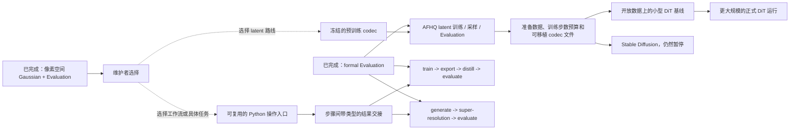

# Stochaflow 开发方向与执行顺序

- 文档性质：根级 [`ROADMAP.md`](../../ROADMAP.md) 的从属工程说明
- 进行中：无
- 下一步：无
- 当前决定：等待维护者选择新的产品方向
- 最近复核：2026-08-09
- 阅读入口：[开发文档导览](README.md)

本文只回答：仓库已经完成什么、现在正在做什么、哪些方向可作为下一项、哪些方向仍需等待。
公开行为以 `SPEC.md`、`ARCHITECTURE.md`、公开文档和测试为准。只有根级
`ROADMAP.md` 可以改变排期状态。

## 1. 五种状态

| 状态 | 含义 |
| --- | --- |
| 已完成（Done） | 已实现、已测试、已写入稳定文档，并继续维护。 |
| 进行中（In progress） | 唯一一个已经选中、正在实施的工作项。 |
| 下一步（Next） | 已批准、直接排在进行中工作之后的工作项。 |
| 候选（Candidate） | 可以成为下一项的现实选择，但尚未排期。 |
| 暂停（Parked） | 保留的更长期构想，开始条件尚未满足。 |

每个工作项只能有一个状态。旧计划短 ID 只保留在
[历史映射](notes/history/milestone-id-map.md)，不再表达排期。

## 2. 一眼看懂当前状态

| 问题 | 答案 |
| --- | --- |
| 现在稳定支持什么 | 像素空间离散 Gaussian 的训练、采样和正式 Evaluation |
| 当前执行队列 | 没有正在执行的关键路径，也没有已批准的后续项 |
| 现在需要什么决定 | 从候选中选择一个小而完整的用户功能 |
| 当前配置方式 | 普通 YAML；train、sample、evaluate 各有独立输入；checkpoint 为 v12 |
| 整理文档是否改变排期 | 不改变；维护、修错和文档整理不等于选择新产品方向 |

已经完成的主路径是：

```text
像素空间 Gaussian 基础
  -> 独立正式 Evaluation
  -> 每个 epoch 的 Evaluation 与按 metric 选择 checkpoint
  -> AFHQ learned-range-v 质量验证
  -> 等待下一项产品决定
```

## 3. 已有基础不等于完整工作流

| 方向 | 已经完成 | 还没有完成 |
| --- | --- | --- |
| Training | Builder/Plan/Strategy、自动 optimizer、EMA、checkpoint、诊断和 `TrainingRunOutcome` | 稳定公开的库调用入口，以及跨多个命令的步骤说明 |
| Sampling | checkpoint-v12 加载、完整 sample 配置、DDPM/DDIM 和输出发布 | Hydra 完成后的调用复审，以及任务专用的重复推理对象 |
| Evaluation | checkpoint/prediction 输入、live/offline 执行、完整性检查、FID/KID 和不可变结果 | reference cache、专门提速和通用结果比较政策 |
| Super-resolution | 内置 data recipe、同步 LR/HR 变换和条件 Gaussian 教程 | 维护的确定性 baseline、任务 writer、正式 Evaluation 和内置 recipe |
| Distillation | Builder 能管理 frozen teacher，Strategy 能组合 teacher/student loss | `train teacher -> export -> distill -> evaluate` 的内置产物交接 |
| Workflow | 独立 train/sample/evaluate 命令，以及带身份的结果和文件 | 操作配方目录、步骤间输入输出绑定和顺序执行说明 |
| Latent/SD | checkpoint 能保存并恢复明确声明的辅助推理资产 | codec provider、latent 完整任务和 Stable Diffusion 组件工作流 |
| Extensions | 显式 activation、身份检查和稳定公开导入 | 经测量证明必要的 import/activation 提速 |

所以文档必须分别写清“有可复用部件”“示例能表达”“用户可以直接运行完整默认路径”。

## 4. 保留的两条主要候选路线

虚线表示维护者尚未作出的选择；实线只说明一条路线内部的先后关系，不表示已经排期。



Stable Diffusion 需要共享 codec 和 latent 生产能力，但不要求先完成某个特定 DiT backbone。
Hydra 只负责更易读的全新训练配置，不与 latent Evaluation 合并。显式顺序工作流可以
随具体任务交付；通用 orchestrator 仍然暂停。

## 5. 候选：可以成为下一项

| 方向 | 用户最终得到什么 | 第一步做什么 | 何时可以开始 | 设计入口 |
| --- | --- | --- | --- | --- |
| 显式顺序工作流 | 可发现的内置操作配方；train→distill 与 generate→SR 都保留，首个只选一条交付 | 提供可复用库调用和带类型的步骤输入输出 | 维护者选择一个具体任务 | [工作流计划](default-workflow-pipeline-support-plan.md) |
| Super-resolution | 从 LR 输入得到可审计的 HR 文件和正式结果 | 先做确定性 baseline 和任务 Evaluation | data、metric、writer 和 Evaluation 规则已确定 | [SR 计划](super-resolution-workflow-support-plan.md) |
| Consistency/distillation | 正确管理 teacher、student 和 target 更新的一条完整任务路径 | 重新核对一个具体研究案例 | 任务和正式 Evaluation 规则已选择 | [Consistency 计划](consistency-distillation-support-plan.md) |
| Codec/latent diffusion | 使用 frozen codec 训练、恢复、采样并评估 latent model | codec provider 加 AFHQ 小型完整路径 | 维护者选择 latent 路线并重新核对 provider | [Latent 计划](latent-diffusion-support-plan.md) |
| Hydra training configuration | 更易读、可复用且仍经过 Stochaflow 校验的训练配置 | 复用工作流计划交付的单次训练入口，再加入组合、预览和检查 | 已选产品功能需要超出普通 YAML 的组合，并且共用入口已经存在 | [Hydra 计划](hydra-configuration-composition-migration-plan.md) |

候选只是下一次决策的选项，目前都没有排期。

## 6. 暂停：开始条件尚未满足

| 方向 | 已有基础 | 开始条件 | 设计入口 |
| --- | --- | --- | --- |
| Stable Diffusion | latent 计划保存了共享 codec 与组件边界 | codec/latent 生产能力已完成，随后单独选择本项 | [SD 计划](stable-diffusion-component-native-support-plan.md) |
| Sampling 调用复审 | v12 sample 配置已经稳定 | Hydra training configuration 完成后出现真实问题 | [复审记录](sampling-request-config-refactor.md) |
| Evaluation 后续 | 正式、offline 和 live Evaluation 已完成 | cache、速度或比较政策有测量证据和负责人 | [决策记录](post-training-evaluation-support-plan.md) |
| Extension import 性能 | activation correctness 与 API parity 已完成 | 独立 benchmark 证明用户可见瓶颈 | [Extension 计划](extension-import-boundary-and-activation-latency-plan.md) |
| Distributed execution | 单设备执行是当前基线 | 目标 workload 无法满足容量或时间要求 | [Distributed 计划](distributed-training-and-inference-support-plan.md) |
| Automated tuning | structured outcome 与正式 Evaluation 可复用 | objective、budget、Evaluation 规则和库调用稳定 | [Tuning 计划](automated-model-tuning-plan.md) |
| Artifact metadata/provenance/capacity | 当前保存每次运行所需的身份和证据 | 任一子方向满足提案内各自的多产出方或多使用方证据条件 | [暂停提案](artifact-metadata-provenance-capacity-model-proposal.md) |
| Data abstraction 扩展 | artifact lifecycle 与 task-level DataBuilder 已完成 | 多个 source 或 task 证明同一扩展需求 | [已完成边界记录中的重开条件](data-layer-composition-boundary-review.md) |
| Data producer 扩展 | schema-v2 producer lifecycle 已完成 | 新 producer 暴露现有流程无法表达的问题 | [已完成 lifecycle 记录中的重开条件](data-artifact-producer-lifecycle-refactor.md) |
| 新算法 family | family contract 可以按方法独立扩展 | 完整用例证明当前 contract 不够 | [SPEC](../../SPEC.md#16-future-compatible-directions) |
| 通用工作流编排器 | 显式命令和产物交接是默认方式 | 至少两个稳定流程重复同一控制逻辑，手工组合已成为维护问题 | [独立暂停计划](general-workflow-orchestrator-plan.md) |

## 7. 当前执行项

当前没有正在执行的关键路径，也没有已批准的后续项。状态值只在本文首屏和根
[`ROADMAP.md`](../../ROADMAP.md) 中声明，避免在同一文档内复制排期。

未来选择一项后，本节只写它的第一个可合并改动：

| 必须说明 | 写法 |
| --- | --- |
| 用户结果 | 完成后用户能运行或验证什么 |
| 可直接复用 | 哪些已完成 contract 不需要重做 |
| 开始条件 | 哪个决定或证据允许开始 |
| 执行步骤 | 每步写成“动作 → 交付物” |
| 完成证据 | 测试、公开文档、产物或测量结果 |
| 明确不做 | 本次不会顺手扩张什么 |

详细 API、测试矩阵和风险由对应专项计划拥有，不复制回本文件。

## 8. 状态变化规则

1. 只有根 `ROADMAP.md` 可以把候选或暂停改为进行中或下一步。
2. 开始前必须重新核对 SPEC、ARCHITECTURE、当前代码、依赖版本和专项计划。
3. 性能或失败证据只能推动已经选中方向里的下一步，不能自动选择另一条产品路线。
4. 第二个真实使用者证明相同需求后，才考虑更通用的公共抽象。
5. 工作完成后，把稳定行为写入规范和公开文档；把过程留给 CHANGELOG、Git 或历史说明。
6. 含 future-support 构想的文档必须由维护者逐文件审阅，不能因为暂停就自动删除。

## 9. 历史与导航

已经完成的 topology、train/sample 配置切分、learned-range Gaussian、Evaluation 和 AFHQ
质量验证不再作为待办重复展开。旧计划名称和现在的去向见
[历史计划 ID 映射](notes/history/milestone-id-map.md)；全部开发文档入口见
[开发文档导览](README.md)。实验数字和退休事实由公开文档、`CHANGELOG.md` 与 Git 追溯。
