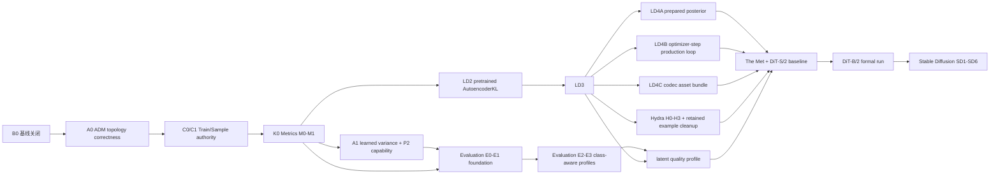

# Stochaflow Development Priority Roadmap

- 文档性质：跨开发计划的执行排期；不属于公开 API 或正式文档导航
- 状态：Active
- 制定日期：2026-07-29
- 最近排期复核：2026-07-30
- 当前工程优先项：A0/A1、修订后的 A2 class-aware example contract 与 Metrics
  M0–M4 repository implementation 已关闭；下一步推进通用 Evaluation E0–E1
- 当前产品主线：pretrained image autoencoder + class-conditional latent diffusion
- 当前 pixel-quality lane：corrected ADM + learned-range Gaussian + concrete P2 training
  已具备 algorithm/config substrate；quality evidence 尚未运行
- 首个 correctness target：AFHQ-v2 + frozen Diffusers `AutoencoderKL` + DiT-S/2
- 首个开放数据 target：The Met Open Access curated snapshot
- 下一条产品主线：Stable Diffusion 1.x component-native sampling 与 fine-tuning
- 兼容性：当前 breaking 阶段不为旧 config、checkpoint、cache 或 retired example
  保留迁移路径

## 1. 排期结论

当前不应平均推进所有 proposal。单一维护者的主执行序列是：

```text
关闭当前基线
  -> ADM topology correctness cutover
  -> Train/Sample authority cutover
  -> Metrics M0-M1
  -> learned-range Gaussian + exact P2 capability
  -> class-aware Evaluation
  -> pretrained AutoencoderKL provider
  -> AFHQ latent train/resume/sample vertical slice
  -> production latent substrate
  -> open-data DiT baseline
  -> Stable Diffusion 1.x component-native
```

其中：

- [正式 Gaussian loss 架构](../framework.md)保留两个明确
  attribution boundary：A0 只修 topology；A1 实现 learned variance、hybrid
  objective、P2 和 respaced ancestral DDPM。
- A0 是当前 `adm_unet` 名称与实现不一致的 correctness 修复，纳入 P0，在 B1 前
  完成；它不启动新的 production 长训练。
- `Train/Sample authority cutover` 只执行
  [Hydra 迁移计划](hydra-configuration-composition-migration-plan.md)的 C0/C1。
  它先修正 plain YAML、checkpoint 和 sample authority，不依赖 Hydra runtime。
- 当前下一项能力计划是 Metrics。B1 关闭后立即执行
  [Metrics 计划](metrics-support-plan.md)的 M0–M1，先冻结 canonical epoch result、
  monitor key 和 validation/test MetricEngine，再进入 latent asset 与 codec 实现。
- Metrics M2–M4、Hydra H0–H3 和 Evaluation 的扩展 profile 不构成首个 AFHQ
  latent correctness 的架构前置；它们按各自 gate 继续。
- A1 core implementation 在 K0 后执行。目标硬件上的 capacity、吞吐与显存验证是
  operational evidence，不是 A0/A1 或 Metrics 合并门槛。
- prepared posterior、optimizer-step training 与 codec asset bundle 不阻塞 smoke，
  但阻塞正式多 checkpoint 长训练。
- Stable Diffusion 不是被移除的 future idea，而是复用 latent substrate 的下一条
  产品主线。
- distributed、HPO、Consistency Distillation、通用 workflow orchestration 和
  metadata/provenance/capacity 不进入当前关键路径。

截至 2026-07-30，built-in authoring surface 已先完成一项可独立关闭的整理：MNIST
只有一份 train YAML，DDPM/DDIM 变体位于 sample profiles，observability 位于 overlay，
且 training diagnostics 自己声明采样 shape。该状态只完成了 C2 的 built-in 子集和
C1 的 diagnostic 解耦子项；checkpoint-v10 的 partial sample request 与自动 final
sample 尚未切换，因此 B1 仍是 P0 未完成 milestone。

本文件拥有**跨计划执行顺序**。各能力计划继续拥有自己的 contract、API、测试和风险。
若能力计划中的旧 phase 顺序与本文冲突，应先同步能力计划，再开始实现，不能同时执行
两套顺序。

## 2. 优先级语义

| 级别 | 含义 | 资源政策 |
| --- | --- | --- |
| P0 | 当前变更必须先关闭，或会让主线立刻返工 | 顺序执行，完成后再扩展主线 |
| P1 | 当前产品主线或已明确的直接前置 | 默认占用主要开发与实验资源 |
| P2 | 主线生产化或正式质量证明 | 可与 P1 后半段并行，但必须在正式 baseline 前闭合 |
| P3 | 下一条产品能力 | P1/P2 的共享前置稳定后启动 |
| P4 | 条件启动的基础设施 | 只有 profiling 或第二个真实案例触发时才进入排期 |
| Later | 独立研究或远期产品项 | 不从当前主线借用阻塞优先级 |
| Deferred | 已明确暂缓 | 只在文档列出的 decision gate 重新开启 |
| Done | 已实施决策记录 | 不占开发排期，只接受必要维护 |

优先级不是架构层级。一个 P4 基础设施 proposal 可能很重要，但在没有真实容量或复用
证据时仍不应先于 P1 产品闭环。

## 3. 依赖图



Inference asset projection 已完成，不再作为未来节点。图中的 `K0 -> LD2` 表示本轮
明确的实施顺序，不表示 codec 在架构上依赖 MetricEngine。A1 与 L0 也没有架构依赖。
三类 AFHQ 与 latent quality profile 都消费 Evaluation 基础，但使用不同
subject/data/protocol，不能共享一个模糊 FID。

## 4. Milestone 排期

以下为单一主要维护者的相对工程量估计，不包含数据下载、策展审批和 GPU 长训练的
wall-clock 时间。每个 milestone 应独立提交并保持主分支可运行。

### B0 — Baseline Closed（P0，1–2 个工程日）

范围：

- 完成当前 data artifact 单次完整 hash + load 后元数据复查变更；
- 关闭未提交的 config/documentation follow-up；
- 运行 focused tests、Ruff、Pyright，并确认当前 MNIST/AFHQ 路径仍可用；
- 不在本阶段引入 Diffusers、Hydra 或新数据集。

退出条件：新的 latent 分支建立在已提交、可复现、无已知挂起回归的基线上。

### A0 — ADM Topology Correctness Cutover（Done）

执行已关闭的 P2/ADM A0：

- 以 pinned OpenAI guided-diffusion U-Net 作为唯一 topology reference；
- 修复 per-input-block skip ledger、每级 `num_res_blocks + 1` decoder blocks、
  same-channel residual resampling 与逐 block attention placement；
- 用 GroupNorm + QKV + zero-output residual attention 替换 Spatial Transformer；
- 128 config 使用 `[1,1,2,3,4]`，到达 8×8，并准确声明 32/16/8 attention；
- 删除旧 topology config fields，不增加 legacy mode 或 checkpoint adapter；
- 旧 raw/EMA/optimizer state fail closed，必须 fresh run；
- maintained production config 在目标设备 profile 前使用保守的 microbatch 1 /
  accumulation 32，不宣称旧 microbatch 8 容量仍成立；4090/DGX profile 是后续
  operational evidence。

A0 只验证 fixed-variance baseline，不实现 P2 或用新 topology 启动长训练。当前
README 的 epoch-170 结果属于旧 91.3M topology，A0 完成时不得继续归因给新的
production config。

repository exit 已于 2026-07-30 闭合：topology/parameter golden、
guided-diffusion tiny forward/gradient fixture、forward/backward、
fixed-variance train/sample、old-checkpoint rejection、config reference 与公开文档
均已落地。目标 GPU capacity 不作为已测结果。

### B1 — Train/Sample Authority Cutover（P0，3–5 个工程日）

只执行 Hydra 计划 C0/C1：

- train config 删除 sampler、writer 和 implicit final sample；
- sample config 成为完整的 `sample:` invocation，不再是 checkpoint defaults 的
  partial overlay；
- bump checkpoint schema，旧 checkpoint 不兼容；
- `TrainingPlan.inference_recipe` 继续拥有不可覆盖的任务组合语义；
- diagnostics 自己声明训练期采样需求；
- 保持配置可读性为验收门槛。

本 milestone **不安装或启动 Hydra**。它的目的，是避免 latent inference assets 和
sample/decode 先接入现有 checkpoint schema，随后又被 C1 重写。

退出条件：一份 train config 可被 DDPM/DDIM 多个 sample profile 消费；sample 文件
没有 Builder，train 文件没有最终 sampler 或 writer。

### K0 — Metrics Foundation（P1，1–2 个工程周）

本 milestone 先执行 Metrics 计划的 M0–M1：

- 为现有 loss、history、logger 和 monitor 行为增加 characterization tests；
- 冻结 canonical metric key、`MetricSource`、`EpochMetricSnapshot`、
  `MetricUpdate` 和显式 `loss_aggregation_weight` contract；
- 决定 TorchMetrics 的 base dependency/extra 策略；
- 实现 task-neutral `MetricEngine`、最小 registry/factory 与 train/validation/test
  隔离 state；
- 让内置 supervised/Gaussian Strategy 提供显式 channel；
- 让 logger、history、checkpoint 和 monitor 消费同一 canonical epoch snapshot；
- 将 retained MNIST/AFHQ config、配置参考和契约测试中的 `valid_loss` monitor
  一次性迁移为 `valid/loss`，不保留 alias；
- 完成最小 `mean`、`mse`、`mae` built-in 及独立 custom implementation contract
  test。

K0 不提前实现训练后 Evaluation，也不把 FID/KID、额外 sampling 或 image-space
quality 塞进普通 validation loop。Metrics M2 的 diagnostic monitoring、M3 的完整
extension/distributed readiness 与 M4 的正式文档/计划收束继续按后续 gate 执行。

退出条件：validation/test metric 能由 Strategy channel 驱动并稳定进入同一
snapshot、日志和 checkpoint 路径；只有 selection-eligible validation observation
可以进入 best/early-stopping monitor；旧 metric key 或 checkpoint 不提供兼容迁移；
retained MNIST/AFHQ 的训练数值行为保持不变。

### A1 — Learned-range Gaussian and P2 Capability（Done，2026-07-30）

执行已关闭的 P2/ADM A1；稳定 contract 见[正式 Gaussian loss 架构](../framework.md)：

- model/process/dynamics 使用窄 family capability 表达 `2C` learned-range variance；
- epsilon simple MSE 与 detached-mean variational-bound term 构成 hybrid loss；
- P2 由具体的无条件/类条件 `TrainingStrategy` 与对应 `TrainingBuilder` 实现；
  配置通过 P2 builder 的私有 `k`、`gamma` 参数表达，不建立 weighting policy
  registry；
- exact `w_t = (k + SNR(t))^-gamma`，P2 只加权 simple term；
- CFG 只作用于 prediction half，variance 取 conditional branch；
- DDPM 支持 250-step improved-diffusion-style respaced ancestral transition；
- DDPM/DDIM 只复用 selected-pair Gaussian marginal coefficient snapshot；DDPM 构造
  posterior，DDIM 保留自己的 `eta` transition；
- inference recipe 固定 prediction/variance semantics；
- gamma-zero、learned-range、VB gradient 与 upstream numeric parity tests。

本 milestone 不把 P2 注册为通用 Objective，不建立 weighting policy registry，也不
把 P2 推广到 v/x0/score 或修改唯一 production AFHQ train recipe。

退出条件已闭合：P2 official 256 unconditional topology 精确为 93,563,910
参数；loss、variance、respacing 与 pinned reference parity 已测试；旧
fixed-variance paths 无回归。

### A2 — Class-aware AFHQ Evaluation（scope revised，repository contract complete）

原单类别 reproduction lane 已取消，不再新增专用 DataSource、训练 recipe、采样
protocol 或 benchmark resolver。AFHQ 只维护现有 class-conditional product surface：

- official cat/dog/wild 数据与统一 class-labeled artifact；
- aggregate 和 per-class KID/FID；
- validation 选择 frozen subject 后，official test 只运行一次；
- 结果固定 checkpoint、data identity、class allocation、sampler 与 metric protocol。

class-aware evaluation contract 与回归测试已经通过。4090/DGX 上的容量、吞吐、显存
和长训练质量结果属于后续运行验收，不阻塞 A0/A1、A2、Metrics 或 main 合并。通用
Evaluation Operation 的 E0–E3 仍是后续独立能力，不影响 AFHQ example 这一已闭合边界。

### L0 — Pretrained Codec Ready（P1，1–2 个工程周）

截至 2026-07-30，其中的 inference asset projection 子切片已经由
knowledge-distillation reference extension 的 embedded `LogitCalibrator` 完成
installed-wheel、strict-resume 和 offline checkpoint-only 验收。Diffusers
`AutoencoderKL` provider、真实 codec capability 与 latent workflow 仍未实现，因此 L0
整体仍未完成。

剩余工作是 Latent Phase 2：实现 optional Diffusers `AutoencoderKL` codec
provider。Phase 1 已闭合
`TrainingPlan -> CheckpointManager -> SamplingCheckpointView ->
InferenceAssetProvider -> SamplingBuilderContext`，不在本 milestone 重复实现。

首个 provider 固定支持：

- `stabilityai/sd-vae-ft-mse`；
- immutable Hub commit 或 immutable local Diffusers directory；
- f8d4 geometry；
- posterior `sample`/`mode`；
- codec-owned scaling/shift/mean/std transform 与精确 inverse；
- explicit precision/`force_upcast`；
- freeze/eval、optimizer/EMA exclusion；
- self-contained reconstruction config、weight digest 和 offline recovery。

只增加针对 optional dependency 的窄 import gate：import core 不得导入 Diffusers，
forward 不得访问网络。完整 extension import refactor 不进入本 milestone。

退出条件：删除原始 provider path、断网后，fake codec 和真实 codec 都能从 checkpoint
声明/state 恢复并 decode；pixel checkpoint 行为不变。

### L1 — AFHQ Latent Diffusion Vertical Slice（P1，4–7 个工程日）

实现新的 image-backed latent recipe，而不是给现有 pixel recipe 增加
`latent: true`：

- AFHQ 128×128 -> f8d4 -> 4×16×16 latent；
- DiT-S/2、3-class conditioning、class dropout 与 CFG；
- training Strategy 在 `no_grad` 下 encode；
- sampling 复用 DDPM/DDIM，在 latent space 禁止 pixel clipping；
- 最终 latent 由 checkpoint-owned codec decode 后交给 image writer；
- tiny overfit、resume、raw/EMA 独立进程采样、reconstruction panel；
- `--no-progress` 下 local log 可观察。

退出条件：可以准确声明“Stochaflow experimental latent diffusion + pretrained AE
pipeline 可训练、可恢复、可独立采样”。该声明不包含规模或正式生成质量。

### L2 — Production Latent Training Substrate（P1/P2，1–2 个工程周）

三项可以并行，但必须在第一次正式多 checkpoint 长训练前全部完成：

- **LD4A prepared posterior moments artifact**：稳定 sample key、codec/preprocess
  identity、sharded mmap、online/prepared parity 和 strict artifact binding；
- **LD4B optimizer-step production loop**：`max_train_steps`、optimizer-step
  checkpoint/log/diagnostic cadence、mid-epoch resume policy、controlled stop 和
  completion marker；
- **LD4C run-level codec asset bundle**：checkpoint 不重复数百 MB codec weights，
  支持 relocation、offline、digest verification、retention 和 GC。

Phase A embedded codec 只允许用于 L0/L1 correctness，不用于正式长训练。

### Q0 — Configuration and Latent Evaluation Closeout（P2，1–2 个工程周，可并行）

在 L1 后启动，在 L3 前完成：

- Hydra H0–H3：只组合 fresh training；完成 MNIST/AFHQ parity、`--check`、readability
  linter 和文档；
- C2 retained-example cleanup：只维护 MNIST 与 AFHQ-v2，并以小型 fixture 替代
  Physics/KD 的 framework contract coverage；
- E0–E3 foundation 已在 pixel P2 lane 提前建立；本 milestone 只补充 latent
  reconstruction 与 decoded-generation profile 的 codec-dependent 子集；
- Evaluation 复用 L0 的 inference projection，不再实现第二套 checkpoint subject
  asset resolver。

Hydra H4 multirun、完整 prediction artifact suite 和完整 comparison/gate 均不属于
Q0。

### L3 — Open-data DiT Baseline（P2，1–2 个工程周 + 实验时间）

- 策展并冻结 The Met Open Access snapshot；
- 通过 codec reconstruction promotion gate；
- 先运行 DiT-S/2 的 1k optimizer-step 4090/DGX Spark profile；
- 冻结 batch、accumulation、checkpoint、evaluation 和 condition allocation；
- 形成固定 KID/FID、class fidelity、nearest-neighbor 和 performance protocol；
- 完成 DiT-S/2 baseline 后才启动 DiT-B/2 长训练。

production asset bundle 必须早于本 milestone 的多 checkpoint 训练，而不是在
profiling 完成后再补。

### S0 — Stable Diffusion 1.x Native Sampling（P3，2–3 个工程周）

执行 Stable Diffusion SD0–SD4：

- pinned Diffusers Pipeline 只作 black-box parity oracle；
- tokenizer 与 frozen text encoder asset；
- component-native conditional UNet、CFG 和 sampling parity；
- image-text/caption DataSource/DataBuilder；
- 复用 latent codec、asset bundle、Process/Sampler 与 Evaluation。

black-box backend 不能证明 native training support，也不成为 latent DiT 的前置。

### S1 — Stable Diffusion 1.x Full Fine-tuning（P3，2–4 个工程周 + 实验时间）

执行 SD5–SD6：

- 256 full-parameter UNet fine-tuning bring-up；
- 512 formal fine-tuning；
- frozen codec/text encoder；
- optimizer-step resume、offline bundle、fixed prompt suite 和正式 evaluation；
- 先 profiling 再决定 activation checkpointing、compile 或 distributed。

完成后才能声明 Stable Diffusion 1.x component-native training support。

### X0 — Scale and New Families（P4/Later，decision-gated）

只在前述 milestone 的证据触发时启动：

- distributed D0–D5：单设备 throughput/capacity 不足时；
- Hydra H4：确有有限 sweep 需求且可 process-isolate 时；
- automated tuning：stable metric/protocol 和 reusable single-run seam 已冻结时；
- Consistency Distillation：作为独立研究轨道重新基线化后；
- ImageNet-100、DomainNet、independent non-DiT denoiser；
- Stable Diffusion random-init、prepared text embeddings、LoRA、SDXL、SD3；
- workflow orchestrator 或 generic pretrained asset abstraction。

## 5. 全部开发计划排期

| 开发计划 | 状态 | 优先级 | 启动/完成门槛 | 本轮决定 |
| --- | --- | --- | --- | --- |
| [Data Artifact Producer Lifecycle](data-artifact-producer-lifecycle-refactor.md) | Done | B0 maintenance | 当前 follow-up 通过验证 | 作为 prepared posterior 基座，不重开 lifecycle |
| [Data Layer Composition Boundary](data-layer-composition-boundary-review.md) | Done | Base | 已实施 | image-backed 与 prepared-backed 使用两个 recipe-level Builder |
| [Sampling Request Config Refactor](sampling-request-config-refactor.md) | Done / 将被替代 | B1 | Hydra C1 | C1 后成为历史记录，不维持 v10 dual authority |
| [Legacy Intel macOS Lifecycle](legacy-intel-macos-pytorch-test-lifecycle.md) | Done | Maintenance | 无 | Deprecated / best effort，不约束新 codec/DiT |
| [Gaussian loss/P2 与 ADM topology](../framework.md) | Implemented | Done core | repository validation | 稳定 contract 已移入正式文档；单类别 reproduction lane 已取消 |
| [Metrics](metrics-support-plan.md) | Queued foundation | P1 | A0/B1 后、L0 前 | 立即完成 Metrics M0–M1；M2–M4 按 diagnostic/extension 需求 |
| [Latent Diffusion](latent-diffusion-support-plan.md) | Current product mainline | P1/P2 | A0 -> B1 -> K0/A1 -> L0–L3 | A1 是当前单人排期前置而非 codec 架构依赖 |
| [Hydra Configuration Migration](hydra-configuration-composition-migration-plan.md) | Split | P0 + P2 + Later | C0/C1 -> K0 -> L1 -> H0-H3 | C0/C1 先行；H0-H3 在 L1 后；H4 延期 |
| [Post-training Evaluation](post-training-evaluation-support-plan.md) | Formal-release gate | P2 | Metrics M0–M1 + shared inference projection | E0–E1 建立基础；E2–E3 扩展 class-aware 与 offline evaluation |
| [Stable Diffusion Component-Native](stable-diffusion-component-native-support-plan.md) | Next product line | P3 | L2/L3 共享前置稳定 | SD1–SD6；SD7–SD8 后置 |
| [Default Workflow and Pipeline](default-workflow-pipeline-support-plan.md) | Umbrella / promotion | P3/P4 | 真实 recipe 稳定 | 不阻塞 capability；R0 复用 Hydra H1 invocation seam |
| [Extension Import Boundary](extension-import-boundary-and-activation-latency-plan.md) | Rebase required | P4 | C1/C2 后重新测量 | 当前 v10、Physics/KD DoD 失效；只做 codec 窄 import gate |
| [Distributed Training and Inference](distributed-training-and-inference-support-plan.md) | Conditional | P4 | L3/S1 profiling 证明需要 | 先 D0 profiling；再决定 DDP/FSDP2 |
| [Automated Model Tuning](automated-model-tuning-plan.md) | Later | Later | Metrics + Evaluation + stable baseline | 不优化尚未冻结的 codec/data/protocol |
| [Consistency Distillation](consistency-distillation-support-plan.md) | Rebase required | Later | 主线稳定并重新选择案例 | 不再以已退出维护的 extension project 为实施入口 |
| [Artifact Metadata, Provenance and Capacity](artifact-metadata-provenance-capacity-model-proposal.md) | Deferred | Deferred | 文档所列重复模式 gate | codec identity 只保存验证必需事实，不重开通用 descriptor |

## 6. 跨计划关键决策

### 6.1 配置与 checkpoint

- 配置可读性是一等公民；新 latent/SD 配置不得先按 v10 写一遍再迁移。
- C0/C1 是 plain config authority refactor，不等同于完整 Hydra adoption。
- Hydra 只负责 fresh train authoring/composition；sample、resume、evaluation 和
  capacity 继续由各自 authority 处理。
- Latent/SD sample 文件使用完整 `sample:` envelope，不出现 Builder、codec source、
  model、data 或 training。
- 新 checkpoint schema 一次性同时为 immutable inference recipe 和 selected
  inference assets 留出稳定投影，避免连续 bump。

### 6.2 Pretrained asset

- 首版只实现 image codec 的 concrete provider，不建立 arbitrary pretrained-model
  registry。
- acquisition identity、self-contained reconstruction declaration 和 embedded/bundled
  state 是三个不同事实。
- codec 是成对 encoder/decoder 的单一 asset；不能从不同 revision 拼接。
- training config 声明 codec 一次；resume、sample 和 Evaluation 从 checkpoint/run
  bundle 恢复。
- teacher、codec、text encoder 至少出现两个可证明相同的重复 provider lifecycle
  后，才重新评估 generic pretrained asset abstraction。

### 6.3 Latent data 与训练

- AFHQ image-backed path 先证明 correctness；prepared posterior 是 production
  optimization，不是支持声明的前置。
- prepared posterior 是 schema-v2 `DataArtifact`，codec weights 是 model asset；
  两者不共用生命周期。
- image-backed 与 prepared-backed 是不同完整 runtime recipe，不用一个
  `latent: true` 或 nullable source graph 合并。
- Process 和 Sampler 只看 normalized latent，不知道 VAE、图像或文本。
- 正式长训练以 optimizer step 为预算；epoch 仍可用于有限数据遍历和报告，但不作为
  唯一 checkpoint cadence。

### 6.4 Quality 与发布声明

- A0 后不再把旧 91.3M ADM checkpoint、FID/KID 或 sample panel描述为新
  `adm_unet` production config 的可复现结果。
- P2 capability 的数值正确性由 epsilon、learned range、linear T=1000、uniform
  timestep 与 standard/P2 parity tests 固定；仓库不维护单类别 paper reproduction。
- Metrics 的 `loss_aggregation_weight` 是 epoch统计权重；P2
  `timestep_loss_weight` 是 timestep objective coefficient，两者不能共用字段。
- AFHQ evaluation 同时报告 aggregate 和 cat/dog/wild per-class 结果。
- Metrics M0–M1 在 latent 开发前冻结 canonical result、source 和 monitor contract；
  它们不提前提供 codec-dependent image-space quality。
- L1 可声明 experimental functional support，不声明规模或质量。
- L3 前必须有结构化 reconstruction gate 和 decoded-generation evaluation。
- latent prediction MSE 不能命名为 image reconstruction PSNR。
- Evaluation 消费同一 inference projection，不从 checkpoint 重建完整
  `TrainingPlan`，也不新建第二套 asset resolver。
- Stable Diffusion 支持按 black-box inference、native sampling、fine-tuning、
  random-init 等层级分别声明。

### 6.5 不进入当前关键路径

- 不实现或训练 Stochaflow-native VAE；
- 不联合训练 VAE 与 denoiser；
- 不把完整 Diffusers Pipeline 当 Stochaflow training owner；
- 不为 Dataset/Sampler/DataLoader 建立通用 YAML graph；
- 不用通用 `_target_`、`class_name` 或任意 dotted import path 表达 Torch 能力；
- 不因 DGX Spark 容量较大而提前引入 distributed；
- 不让 Deprecated Intel macOS lane 决定 Diffusers、DiT 或 quality dependency。

## 7. 建议提交切片

为降低长分支风险，主线至少拆为：

1. `Close artifact/config baseline`
2. `Correct ADM topology`
3. `Separate train and sample authority`
4. `Add metric contracts and canonical epoch results`
5. `Add validation MetricEngine`
6. `Add learned-range Gaussian training`
7. `Add concrete P2 training and respaced DDPM`
8. `Add post-training evaluation foundation`
9. `Add P2 prediction and quality profiles`
10. `Add pretrained AutoencoderKL codec`
11. `Add AFHQ latent diffusion vertical slice`
12. `Publish controlled AFHQ P2 evidence`
13. `Add prepared posterior artifacts`
14. `Add optimizer-step production lifecycle`
15. `Deduplicate codec assets in run bundles`
16. `Adopt Hydra for retained fresh-train configs`
17. `Add The Met DiT baseline`
18. `Add Stable Diffusion native sampling`
19. `Add Stable Diffusion full fine-tuning`

每个切片都必须更新相应 development plan；只有稳定、已实现的用户行为进入公开文档。

## 8. 重新排期 gates

只有以下证据允许改变主线顺序：

- A0 corrected topology在目标设备上即使 microbatch 1 仍无法执行；
- A1 reference parity证明现有 Gaussian family boundary 无法在不污染 universal root
  的前提下表达 learned variance；
- Metrics M1 的 TorchMetrics 平台兼容或依赖策略无法满足 Supported matrix，且窄
  wrapper/extra 方案仍不能关闭；
- L0 表明现有 inference asset projection 无法扩展到 self-contained codec recovery；
- L1 表明 image-backed encode 成为 correctness 测试本身的主要瓶颈；
- L2 表明 asset bundle 或 step-based loop 需要新的训练 loop family；
- The Met license、下载或 taxonomy gate 无法冻结；
- DiT-S/2 profiling 证明单设备无法满足目标；
- Stable Diffusion parity 证明现有 Gaussian family primitive 不足；
- 第二个真实 pretrained provider 证明 codec-private source contract 已重复。

“未来可能需要”不是调高优先级的证据。
