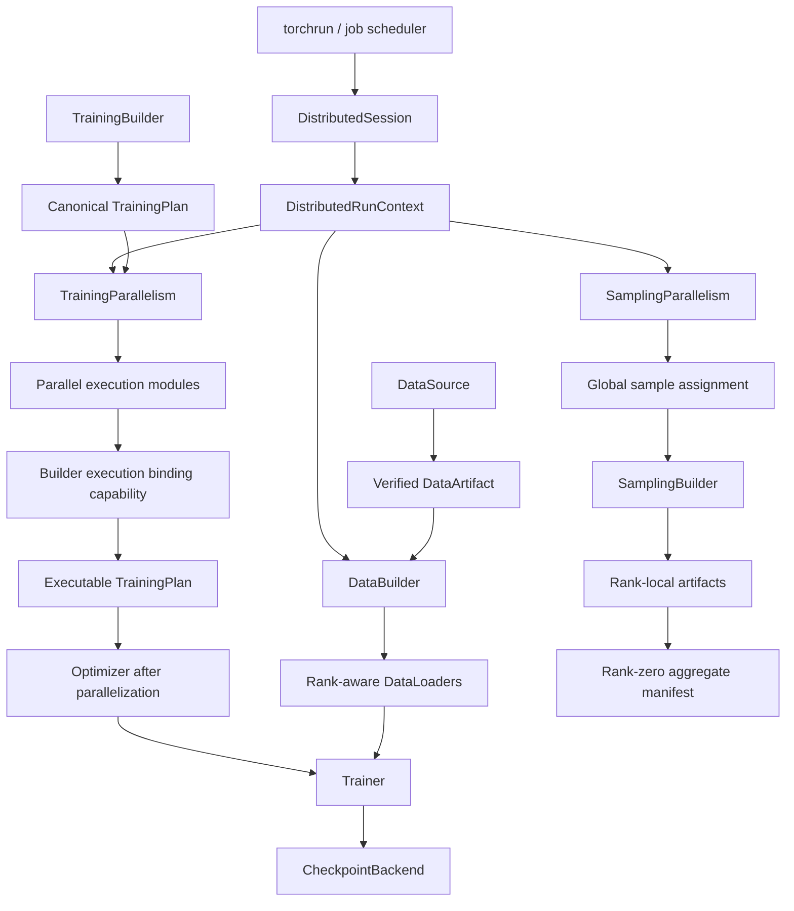

# Distributed Training 与 Inference 支持计划

- 文档性质：开发计划；不属于当前公开 API 或正式用户文档
- 状态：提案，尚未进入实现
- 制定日期：2026-07-27
- PyTorch 兼容基线：Supported 平台以 `torch>=2.11,<3` 为设计下限；Intel macOS 已是
  Deprecated / best effort，其 `torch==2.2.2` compatibility lane 保持
  single-process，不承诺本提案中的 distributed 能力，也不作为设计下限
- 关联计划：
  [Metrics 支持](metrics-support-plan.md)、
  [训练后 Evaluation 与 Benchmark](post-training-evaluation-support-plan.md)、
  [默认工作流与推理 Pipeline](default-workflow-pipeline-support-plan.md)、
  [Latent Diffusion](latent-diffusion-support-plan.md)、
  [Stable Diffusion Component-Native](stable-diffusion-component-native-support-plan.md)
- 首版目标：`torchrun` 启动、单机/多机 DDP、rank-aware data、全局指标、
  rank-zero side effects、distributed checkpoint、replicated sampling；
  FSDP2 以 Linux CUDA 上的 ADM/DiT 为首批受控能力

## 1. 目标与核心结论

本计划为 Stochaflow 增加训练和离线 inference/sampling 的多进程执行能力。目标不是
在现有 runner 周围加一层 `if distributed:`，也不是把 DDP、FSDP、数据切分、
checkpoint、日志和 artifact 全部塞进一个万能 `DistributedManager`。分布式执行会
改变设备选择、模型构造顺序、数据语义、loss/metric 聚合、EMA、checkpoint、
随机性、side effect ownership 和失败模型，必须作为完整的 runtime topology 设计。

核心结论如下：

1. **首选 PyTorch 原生 SPMD 与 `torchrun`。**
   Stochaflow 不自行 `multiprocessing.spawn()`，不在 YAML 复制节点、rendezvous、
   restart 或 scheduler 配置。`torchrun`/作业调度器拥有进程创建与故障重启，
   Stochaflow 从环境读取 `LOCAL_RANK`、`RANK`、`WORLD_SIZE` 等信息并初始化
   process group。
2. **Training parallelism 与 sampling parallelism 是两个不同扩展点。**
   训练提供 `single`、`ddp`、`fsdp2`；sampling 提供 `single`、`replicated`、
   `fsdp2`。DDP 的价值是 backward gradient synchronization，因此 replicated
   inference 不使用 DDP wrapper。
3. **DDP 用于“模型可放入一张卡、需要扩展吞吐”；FSDP2 用于“模型或 optimizer
   state 无法经济地复制到每张卡”。**
   这是 PyTorch 官方的推荐分界。FSDP1 不作为新设计的主路径；只在 FSDP2
   验收被上游阻塞时保留兼容性评估，不同时维护两套首版实现。
4. **新增两个 registry，而不是在 runner 按名称分支。**
   `TrainingParallelism` 和 `SamplingParallelism` 分别注册 built-in `single`、
   `ddp`、`fsdp2`、`replicated` adapter。runner、Trainer 和 sampling runtime
   只依赖窄 contract；未来增加 HSDP、TP 或第三方 adapter 不修改核心 dispatch。
5. **process-group lifecycle 是稳定基础设施，不是算法 registry。**
   `DistributedSession` 只负责从 launcher 环境构造 `DistributedRunContext`、
   初始化/销毁 process group、提供 collectives 和 rank predicates；它不包装模型、
   不构建 DataLoader、不保存 checkpoint，也不解释 batch。
6. **DataSource 负责拓扑无关的 artifact，DataBuilder 负责 rank-aware runtime。**
   DataSource 仍只读取、处理并 materialize 可验证 artifact，不接收 rank/world，也不构建
   Dataset、split、sampler 或 DataLoader。Core 不接管已有 DataLoader 再偷偷替换
   sampler。`DistributedRunContext` 只注入 `DataBuilderContext`，具体 Builder 在确认各
   rank 看到相同 artifact identity 后，直接构建 rank-aware Dataset/Sampler/
   BatchSampler/DataLoader，并随 `DataLoaders` 返回可验证的 sharding evidence。
7. **TrainingBuilder 仍拥有任务计算绑定，core 仍拥有模型并行化。**
   当前 Strategy 直接持有原始模型；简单地在 Trainer 中创建 DDP wrapper 会让
   Strategy 绕过 wrapper。新增窄 `ParallelExecutionBindingBuilder` capability：
   core 产生并行 execution modules，Builder 只把 Strategy 重绑到这些 execution
   modules，不负责 move、wrap、freeze、parameter selection 或 serialization。
8. **FSDP2 分组必须由模型/Builder 显式声明。**
   不按类名、参数数量或注册名称在 core 猜 auto-wrap。模型可以实现窄
   `FSDP2Partitionable` capability；复杂 TrainingPlan 可由 Builder 实现
   `FSDP2ShardingPlanBuilder`。计划按 bottom-up 顺序声明通信组，并在完整组合
   已知的边界验证。
9. **Trainer 只消费通用 parallelism capabilities。**
   gradient accumulation 通过 `gradient_sync(enabled)` 控制：DDP 映射到
   `no_sync()`，FSDP2 映射到 `set_requires_gradient_sync()`；gradient clipping、
   metric reduction、step consensus 和 exception recovery 也由窄能力提供，
   Trainer 不检查 DDP/FSDP 具体类型。
10. **distributed checkpoint 与 portable inference checkpoint 分离。**
    训练恢复使用 PyTorch Distributed Checkpoint（DCP）目录 bundle，允许并行 I/O
    和 load-time reshard；`best.pt`/显式 export 继续提供单文件、完整权重、可被
    single/replicated sampling 消费的 portable artifact。两者不能用同一个文件名
    暗示相同语义。
11. **rank zero 决策，所有必要 rank 参与 collective。**
    output directory、best/early-stop 决策、日志、reporter 和最终 manifest 由 rank
    zero 拥有；FSDP save/load、FSDP forward、global reduction 等 collective 必须由
    全部成员以一致顺序进入。rank-zero-only 不等于其他 rank 可以提前返回。
12. **distributed sampling 以稳定 global sample ID 切分。**
    每个 `SamplingBatch` 携带 sample IDs；各 rank 写独立 shard，rank zero 只合并
    manifest，默认不通过 `gather_object` 把大 tensor 拉回内存。writer 若实现窄
    merge capability，可按 sample ID 生成便携聚合 artifact。
13. **首版固定 world size，elastic membership change 后置。**
    `torchrun --max-restarts` 可以用最近完成的 checkpoint 重启固定拓扑任务；
    world size 动态变化会影响 RNG、batch、global batch size、scheduler 和严格
    resume，必须有单独 reproducibility contract 后才能宣称 elastic training。
14. **正式 distributed evaluation 仍受 exact-sharding gate 约束。**
    本计划可以提供 distributed validation 和 sampling，但在无重复 sample ID、
    无 padding 污染、全局 reduction 和完整 artifact proof 全部验收前，不解除
    post-training evaluation 计划中“正式 benchmark 单设备”的限制。

## 2. 当前实现基线与缺口

### 2.1 已有可复用基础

| 当前能力 | 位置 | 可复用价值 |
| --- | --- | --- |
| Trainer 自动优化生命周期 | `training/trainer.py` | 已集中 device、backward、step、EMA、scheduler、checkpoint |
| accumulation window | `Trainer._run_accumulation_window()` | 可以在 micro-batch forward+backward 外包 gradient-sync context |
| sampler epoch propagation | `_set_dataloader_epoch()` | 已会向 `sampler`/`batch_sampler` duck-type 调用 `set_epoch()` |
| TrainingPlan managed assets | `training/builder.py` | 可枚举 primary/process/objective/auxiliary state roots |
| DataSource artifact boundary | `data/image_contracts.py`、`data/source_factory.py` | source materialization 与 rank-aware runtime composition 已分离 |
| DataBuilder composition root | `data/builder.py` | 可以直接构建 rank-aware loader，不需要 core 重写 batch |
| deterministic loader helpers | `data/dataloaders.py` | 已有 generator、worker seed、epoch sampler |
| precision runtime | `training/precision.py` | autocast、GradScaler、step success 已集中 |
| checkpoint v10 | `utils/checkpoint.py` | portable full-state、固定 inference recipe、严格验证与事务式 restore |
| sampling builder/runtime | `sampling/builder.py`、`sampling/runtime.py` | task composition 与 artifact writing 已分离 |
| data artifact locks | `data/artifact_store.py`、`data/artifact_io.py` | 多进程 materialization 可复用已有锁与 publish 语义 |

### 2.2 不能直接在现有代码上“包一层 DDP”的原因

| 当前假设 | distributed 后的问题 | 必须改变的边界 |
| --- | --- | --- |
| factory 在模型 move 前构建 optimizer | FSDP2 要先 `fully_shard()`，再用 DTensor parameters 构建 optimizer | 重排 composition lifecycle |
| Strategy 保存 raw model/process/objective 引用 | Trainer 后包 DDP 时 Strategy 绕过 wrapper | Builder-owned execution binding |
| 每个进程自己创建 timestamp output dir | 多 rank 产生不同 run 或争抢同一路径 | rank zero 选择并 broadcast |
| DataBuilder 不知道 rank/world | 所有 rank 读取相同样本 | 注入 distributed context |
| epoch loss 是本地 batch mean 的普通平均 | 多 rank、变长 batch、padding 会产生偏差 | sum/weight global reduction |
| validation/test 不调用 sampler `set_epoch()` | rank-aware eval loader 可能需要 epoch/schedule | phase-aware loader lifecycle |
| logger/reporter/diagnostic 每进程执行 | 重复日志、重复图片、路径冲突 | 明确 side-effect scope |
| CheckpointManager 读取普通 `state_dict()` | FSDP2 得到 DTensor shard；optimizer key/shape 不再是普通本地状态 | CheckpointBackend + DCP state-dict APIs |
| checkpoint 保存一个进程的 RNG | distributed 每 rank 有独立 RNG stream | rank-local RNG state 与 topology policy |
| EMA clone 普通 Tensor | FSDP2 parameters 是 DTensor/local shard | sharded EMA controller |
| sampling 在一个进程产生全部 batches | 多 rank 会重复 sample 与 writer path | sample assignment + rank shards |
| post-training sampling 先销毁训练对象后直接单进程运行 | FSDP collective 不能只留 rank zero | operation-wide coordinated transition |

## 3. PyTorch 调研结论

### 3.1 DDP、FSDP2 与 replicated inference 的选择

| 模式 | 参数/optimizer memory | 主要通信 | 合适场景 | Stochaflow 决策 |
| --- | --- | --- | --- | --- |
| DDP training | 每 rank 完整复制 | backward all-reduce | 模型可放一张卡，扩展吞吐 | 首版稳定路径 |
| FSDP2 training | 参数、gradient、optimizer state 分片 | forward all-gather、backward reduce-scatter | 单卡内存不足或复制成本过高 | 受控第二阶段 |
| replicated inference | 每 rank 完整复制 | 只在协调/manifest 时通信 | 模型可放一张卡，扩大样本吞吐 | 不使用 DDP wrapper |
| FSDP2 inference | 模型 state 分片 | 每次 forward all-gather | 单卡无法容纳模型 | 受控第二阶段 |
| FSDP1 | 可配置 sharding | 与策略相关 | legacy compatibility | 不作为新架构主路径 |
| HSDP/TP/PP | 多维 mesh | 多类 collectives | 更大规模 | 首版明确后置 |

PyTorch 官方 overview 建议：模型可放入单卡而需要 data-parallel scaling 时使用 DDP；
模型无法放入单卡时使用 FSDP2。FSDP2 的 `fully_shard()` 原地把 parameters 转为
DTensor，按每参数 dim-0 分片；每次调用形成一个通信组，因此必须 bottom-up
应用。optimizer 必须在 `fully_shard()` 之后基于 DTensor parameters 构造。

### 3.2 launcher 与 process group

- `torchrun` 为每个 worker 设置 `LOCAL_RANK`、`RANK`、`WORLD_SIZE`、
  `LOCAL_WORLD_SIZE`、`MASTER_ADDR`、`MASTER_PORT` 和 restart metadata。
- GPU 模式是一进程一 GPU；同一 NCCL process group 内不能让多个进程共享同一
  CUDA device。
- `init_process_group(init_method="env://", device_id=local_device)` 是首版入口；
  backend `auto` 按运行设备选择，但 production support matrix 仍显式限制。
- rank 在 elastic restart 后不稳定；不能把 rank 当持久 sample identity、artifact
  identity 或 checkpoint lineage identity。
- 任意 worker 失败时 `torchrun` 会终止并重启整个 worker group。Stochaflow 的
  checkpoint publish 必须保证旧的 complete checkpoint 不被 partial save 覆盖。

### 3.3 DDP 约束

- DDP 不切分输入；DataBuilder 必须提供 rank-aware sampler/iterable。
- `DistributedSampler.set_epoch(epoch)` 必须在每个 epoch 的 iterator 建立前调用，
  否则 shuffle 顺序会跨 epoch 重复。
- gradient accumulation 使用 `DDP.no_sync()` 时必须把 **forward 和 backward**
  都放在 context 内；只包 backward 仍会同步。
- DDP 的 `join()` 可以处理 uneven inputs，但它改变 effective world size 和 gradient
  weighting，且不能自动修复 evaluation padding/duplicate。首版训练采用 equal-step
  contract，不把 `join()` 当默认补丁。
- `find_unused_parameters`、`static_graph` 等是明确配置，不根据一次 trace 或模型
  名称自动推断。

### 3.4 FSDP2 约束

- `fully_shard()` 原地改变 module parameter representation，但保留 canonical FQN；
  这比 FSDP1 flat parameter 更适合与现有 state identity 对齐。
- 每个 `fully_shard(module)` 调用决定一个 all-gather/reduce-scatter group；root-only
  会形成一个大 blocking group，因此生产计划必须声明有意义的 layer groups。
- 默认 non-root 在 forward 后 reshard，root 通常不 reshard；具体选择属于
  architecture-aware sharding plan，不是 core 按模型名字决定。
- gradient accumulation 通过 FSDP2 `set_requires_gradient_sync()` 控制；可进一步
  用 `set_reshard_after_backward()` 做 memory/communication trade-off，但首版不自动
  调参。
- FSDP2 不直接提供 ordinary full state dict；portable export 应使用 DCP distributed
  state-dict API 或 DTensor reshard。
- FSDP2 异常可能留下未完成 iteration state；adapter 必须在决定继续当前进程前调用
  root `reset_iter_state()`。首版默认 fail-fast，让 torchrun 重启，不尝试在未知
  collective 状态下静默继续。
- `MixedPrecisionPolicy` 是 module-level policy，与当前 autocast 的 op-level policy
  不同。首版 FSDP2 继续使用现有 `trainer.precision` autocast，`fully_shard()` 保持
  default parameter/reduction dtype；在独立数值与内存基准完成前不叠加两套 policy。
- `CPUOffloadPolicy` 会把 parameter、gradient 和 optimizer state 放到 CPU，并让
  optimizer step 在 CPU 执行。它不是普通 boolean speed switch；首版标为
  experimental，默认关闭。

### 3.5 Distributed Checkpoint

- DCP 每个 checkpoint 产生多个文件，至少每 rank 一个，并支持 load-time reshard，
  即保存和加载可使用不同 cluster topology。
- `get_state_dict()`/`set_state_dict()` 统一处理 ordinary、DDP、FSDP2 及其组合，
  使用未并行化模型的 canonical FQN，并把 optimizer parameter IDs 转换为 FQN。
- `StateDictOptions(full_state_dict=True, cpu_offload=True)` 可产生 rank-zero portable
  full state；其他 rank 返回空 mapping，避免每 rank CPU OOM。
- DCP load 是 in-place：必须先构建目标模型/optimizer state shape，再按目标 sharding
  读取需要的 shard。
- DCP 要求各 rank 提交相同 top-level keys；key mismatch 可能报错或 hang。bundle
  assembly 必须由同一 validated schema 驱动。
- `async_save()` 先把 training-safe snapshot stage 到 CPU，再后台写入。它会增加
  CPU memory 峰值和生命周期复杂度；同步 save 正确性通过后再作为优化阶段。
- PyTorch 2.11 把 distributed state-dict API 标为 experimental。Stochaflow 必须把
  它封装在 `DistributedCheckpointBackend` 内，并用 2.11/2.12/2.13 compatibility
  tests 吸收签名变化，不能让其类型和 kwargs 扩散到 Trainer、Builder 或 extension。

## 4. 范围、术语与支持矩阵

### 4.1 本计划中的 inference

“Distributed inference”在首版只指：

- checkpoint-backed `SamplingBuilder` 离线 sampling/generation；
- 未来 `EvaluationBuilder` 内部的 batch prediction/generation；
- CLI/库调用中的有限批 SPMD inference。

首版不包含：

- 在线 HTTP/gRPC serving；
- dynamic batching、continuous batching、request scheduler；
- tensor/pipeline parallel serving engine；
- vLLM/TensorRT-LLM/TorchServe 集成；
- 多租户、autoscaling、模型热更新；
- remote actor 或参数服务器。

若以后加入 serving，应定义独立 Serving operation/runtime，不能把长驻服务生命周期
塞入 `SamplingBuilder.run()`。

### 4.2 首版平台支持

| 能力 | Linux CUDA/NCCL | CPU/Gloo | Windows | MPS | Intel macOS Torch 2.2（Deprecated / best effort） |
| --- | --- | --- | --- | --- | --- |
| single | 支持 | 支持 | 支持 | 支持 | best effort（非设计或验收目标） |
| DDP 单机 | production target | correctness/CI | 探测后决定，不预先承诺 NCCL | 不支持 | 不支持 |
| DDP 多机 | acceptance target | 测试/调试 | 后置 | 不支持 | 不支持 |
| replicated sampling | production target | correctness/CI | backend gate 后 | 不支持 | 不支持 |
| FSDP2 training | production gate 后 | 非生产测试 | 后置 | 不支持 | 不支持 |
| FSDP2 inference | production gate 后 | 非生产测试 | 后置 | 不支持 | 不支持 |
| elastic world-size change | 后置 | 后置 | 后置 | 不支持 | 不支持 |

Runtime 不根据表格猜 capability；启动时检查：

- `torch.distributed.is_available()`；
- requested backend 是否可用；
- local rank 对应设备是否存在且未被其他 local worker 复用；
- FSDP2 API 是否满足受支持版本；
- config strategy、launcher world size 与 device 类型是否相容。

### 4.3 首版 TrainingPlan 兼容范围

DDP/FSDP2 首个 production slice 支持：

- primary model 是唯一 trainable state root；
- Process、Objective 和 auxiliary modules 可以存在，但必须 frozen；
- Strategy 通过并行 execution model 的 `__call__` 执行 trainable forward；
- 所有 rank 每个 optimizer window 进入相同次数、相同顺序的 trainable forwards；
- 一个 optimizer、自动 backward、自动 step 的现有 Trainer family。

以下组合必须 fail closed，而不是只同步部分参数：

- trainable Process 通过 `sample_marginal()` 等非-forward 方法参与计算；
- 多个 trainable roots 没有明确 parallel execution binding；
- rank-dependent control flow 导致部分 rank 不调用某个 trainable module；
- manual backward、alternating optimizer 或 closure-required optimizer；
- Builder 没有声明 distributed compatibility evidence。

后续 D2 阶段通过多个 execution bindings 扩展 trainable Objective/auxiliary module，
仍不把任意 multi-model graph 放进 YAML。

## 5. 总体架构



### 5.1 `DistributedRunContext`

新增 immutable value object：

```python
@dataclass(frozen=True, slots=True)
class DistributedRunContext:
    rank: int
    local_rank: int
    world_size: int
    local_world_size: int
    device: torch.device
    backend: str | None
    initialized: bool

    @property
    def is_primary(self) -> bool: ...

    @property
    def is_local_primary(self) -> bool: ...
```

约束：

- single mode 也得到 `rank=0, world_size=1` 的 context，consumer 不需要散布
  `if dist.is_initialized()`；
- context 不暴露 mutable process group lifecycle；
- rank 只用于当前 invocation 的 routing，不作为持久 identity；
- hostname、node rank、restart count 进入 manifest metadata，不进入算法 config。

### 5.2 `DistributedSession`

`DistributedSession` 是 context manager，职责仅包括：

1. 读取并严格解析 launcher environment；
2. 解析 local device；
3. 初始化 process group；
4. 构造 collectives adapter；
5. 在正常或异常退出时销毁 group；
6. 提供 config/hash/topology 一致性 preflight。

明确不做：

- 启动 child process；
- 选择 DDP/FSDP；
- 创建输出目录；
- 保存 checkpoint；
- 替 DataBuilder 构建 sampler；
- 捕获一个 rank 的异常后让其余 rank 继续训练。

CLI main entry 使用 PyTorch elastic error `record` decorator，使 torchrun 可以报告
首个 root-cause traceback。

### 5.3 Collectives capability

Trainer、metric engine、checkpoint coordinator 依赖 Stochaflow 窄 protocol，而不是
在各模块直接调用 `torch.distributed`：

```python
class CollectiveOperations(Protocol):
    def sum_tensor(self, value: torch.Tensor) -> torch.Tensor: ...
    def max_tensor(self, value: torch.Tensor) -> torch.Tensor: ...
    def broadcast_object(self, value: object | None, *, source: int) -> object: ...
    def barrier(self) -> None: ...
```

生产实现使用 PyTorch collectives；测试提供独立 fake/in-memory implementation。
不把 `all_gather_object` 用于模型 state、大 tensor samples 或大 manifest。

## 6. 配置设计

### 6.1 推荐 schema

```yaml
distributed:
  backend: auto
  timeout_seconds: 1800

trainer:
  device: auto
  precision: bf16-mixed
  accumulate_grad_batches: 2
  parallelism:
    name: ddp
    params:
      broadcast_buffers: true
      find_unused_parameters: false
      static_graph: false
      gradient_as_bucket_view: true

sampling:
  parallelism:
    name: replicated
    params:
      artifact_mode: sharded
```

FSDP2 示例：

```yaml
trainer:
  device: auto
  precision: bf16-mixed
  parallelism:
    name: fsdp2
    params:
      offload: none

sampling:
  parallelism:
    name: fsdp2
    params:
      artifact_mode: sharded
```

### 6.2 配置所有权

| 字段 | 所有者 | strict resume |
| --- | --- | --- |
| `trainer.parallelism.name/params` | 训练算法 topology | 默认冻结 |
| `sampling.parallelism` | future sampling-only runtime field | 若本计划加入该字段，可由 strict partial sample request 覆盖 |
| `distributed.backend` | invocation runtime | 可覆盖，但必须兼容设备 |
| `distributed.timeout_seconds` | invocation runtime | 可覆盖 |
| `WORLD_SIZE/RANK/LOCAL_RANK` | launcher environment | 不进入 config |
| rendezvous/nodes/restarts | torchrun/job scheduler | 不进入 config |

规则：

- `sampling.parallelism` 是本提案的未来 schema 扩展，当前 v10
  `SamplingConfig`/sample request 尚不接受该字段；实施前必须同步严格 parser、
  checkpoint defaults 和 request merge contract；
- 在 `world_size>1` 下选择 `trainer.parallelism.name: single` 时 fail，避免每 rank
  各自开始一个独立实验；
- distributed strategy 在没有 torchrun 环境时允许 `world_size=1` smoke，但 manifest
  标明没有验证跨 rank 语义；
- `trainer.device: cuda:0` 不得被多个 local rank 原样复用；distributed CUDA
  接受 `auto`/`cuda` 并解析为 `cuda:LOCAL_RANK`；
- 不在 config 复制 DDP/FSDP 全部 upstream constructor 参数。adapter 只开放首版
  已验证参数，并拒绝 runtime-owned `module`、`process_group`、`device_ids`、
  `output_device`、`mesh`；
- FSDP2 module groups 不进入 YAML 字符串列表，避免用户按私有 module path 绑定
  架构。分组由 Python capability 声明，config 只选择稳定政策。

## 7. Training composition 与 parallelism contract

### 7.1 新 composition 顺序

当前 factory 顺序必须改为：

1. 建立 `DistributedSession` 并解析 local device；
2. 所有 rank 解析 config、extension selection 和 checkpoint header；
3. 用 canonical digest 验证各 rank config/extension identity 一致；
4. 构建 raw model、Process、Objective；
5. TrainingBuilder 产生 canonical `TrainingPlan`；
6. parallelism adapter move managed assets 并产生 execution modules；
7. Builder 的窄 binding capability 产生使用 execution modules 的 final Strategy；
8. 对 final Plan 再做 state root、trainable parameter 和 compatibility 验证；
9. **此时**构建 optimizer 与 scheduler；
10. 构建 precision、EMA controller、CheckpointBackend、logger、diagnostics；
11. 构建 Trainer；
12. 构建或恢复 rank-aware data/runtime state；
13. 进入 fit。

FSDP2 optimizer 必须在第 6 步之后；DDP 也统一走相同 boundary，避免两个 factory
拓扑长期分叉。

### 7.2 canonical module 与 execution module

每个 managed asset 有两个视图：

| 视图 | 用途 |
| --- | --- |
| canonical module | registry identity、Builder validation、portable state FQN、extension capability |
| execution module | Strategy forward、DDP wrapper 或 FSDP2 in-place module |

single/FSDP2 中两者可能是同一对象；DDP 中 primary execution module 是 wrapper。
CheckpointBackend 和 EMAController 不通过 `wrapper.module` 私有推断 canonical state，
而由 parallelism adapter 显式提供 `ParallelizedTrainingAssets`。

### 7.3 Builder 窄能力

新增可选 Protocol：

```python
class ParallelExecutionBindingBuilder(Protocol):
    def bind_parallel_execution(
        self,
        plan: TrainingPlan,
        execution_modules: Mapping[str, nn.Module],
    ) -> TrainingStrategy:
        ...
```

contract：

- Builder 可以构造新的 Strategy，因为 batch interpretation/model call composition
  本来就是 Builder/Strategy 职责；
- Builder 不得 move、wrap、freeze module；
- Builder 不得选择 optimizer parameters；
- 返回 Strategy 必须使用 execution module 执行每个 trainable forward；
- core 验证 canonical plan 的 model/process/objective/auxiliary identities 未改变；
- single mode 不强制 extension 实现该 capability；
- wrapper-based distributed mode 缺少 capability 时在 Builder boundary 给出明确错误，
  不回退到 raw module。

首版 built-in supervised、Gaussian、class-conditional Gaussian Builder 都实现该
capability。extension contract 测试必须使用独立 custom Builder，而不是只测试
built-in。

### 7.4 FSDP2 sharding capability

简单单模型可以实现：

```python
class FSDP2Partitionable(Protocol):
    def fsdp2_shard_plan(self) -> FSDP2ShardPlan:
        ...
```

复杂 TrainingPlan 的 Builder 可以实现：

```python
class FSDP2ShardingPlanBuilder(Protocol):
    def build_fsdp2_sharding_plan(
        self,
        plan: TrainingPlan,
    ) -> FSDP2ShardPlan:
        ...
```

`FSDP2ShardPlan` 包含：

- bottom-up ordered module groups；
- root module；
- 每组 `reshard_after_forward`；
- 需要注册为 FSDP forward 的 public method names；
- ignored frozen parameters（若有）；
- plan identity/version，用于 config/checkpoint provenance。

验证：

- 每个 trainable parameter 恰好属于一个 group；
- group module 属于 canonical managed roots；
- root 最后应用；
- 不能按同一 parameter 建立重叠 group；
- public forward method 必须存在且 callable；
- ignored parameter 必须 frozen，不能让 trainable state 无同步；
- Plan 在全部 rank 产生相同 canonical identity；
- 不允许 runtime 以 `isinstance(model, ADMUNet)` 分支选择 groups。

## 8. DDP training 详细语义

### 8.1 wrapper 与参数

- 每个 distributed-compatible trainable execution root 分别包装 DDP；
- 首版只有 primary model trainable，因此只有一个 DDP wrapper；
- frozen Process/Objective/auxiliary modules 只 move，不包装；
- optimizer 从 parallelized Plan 的 trainable parameter view 构建；
- `broadcast_buffers` 默认 `true`，含状态 buffer 的模型由 DDP 保持一致；
- `find_unused_parameters` 默认 `false`；需要动态 unused graph 的 Builder 必须显式
  配置并测试；
- `static_graph` 默认 `false`，不能按模型名称自动开启。

### 8.2 gradient accumulation

新增：

```python
class GradientSynchronization(Protocol):
    def gradient_sync(self, enabled: bool) -> ContextManager[None]:
        ...
```

Trainer 对一个 accumulation window：

```text
micro-batch 0 .. N-2:
    with gradient_sync(enabled=False):
        forward
        backward

micro-batch N-1:
    with gradient_sync(enabled=True):
        forward
        backward

unscale / clip / optimizer step / scaler update
step consensus
EMA / scheduler / global_step
```

必须把 forward 包含在 no-sync context 中。若 window 中途异常，整个 window
gradient 丢弃；所有 rank fail-fast，不尝试让成功 rank继续。

### 8.3 equal-step contract

训练 DataLoader 必须保证：

- 每 rank 每 epoch 相同 micro-batch count；
- 每个 accumulation window 边界一致；
- local logical batch weight 相同，或 Strategy 提供能证明等价 global gradient 的
  显式 weighting；
- `limit_batches`/`max_optimizer_steps` 在所有 rank 解析为相同值；
- iterable source 由 Builder 自己 exact shard，并声明 epoch length。

首版不默认使用 DDP join。若未来支持 uneven training，必须明确：

- gradient divide 使用 initial 还是 effective world size；
- early exhaustion rank 的 scheduler/global step；
- metrics denominator；
- checkpoint 时所有 rank 的 iterator state。

### 8.4 optimizer step consensus

每 rank 产生本地 `step_succeeded`。在 EMA、scheduler 和 `global_step` 推进前做
collective consensus：

- 全部成功：统一推进；
- 全部 overflow/skip：统一跳过；
- 结果不一致：立即抛错并由 torchrun 重启，不允许 rank state 分叉。

`GradScaler`、optimizer 和 scheduler state 在同一 parallelism group 内必须保持
逻辑一致。consensus 是验证保护，不代替 upstream gradient synchronization。

## 9. Data sharding

### 9.1 注入而不是事后改写

`DataBuilderContext` 增加 `distributed: DistributedRunContext`；
`DataSourceContext` 保持 topology-neutral。DataSource 对相同 source/recipe 必须发布
相同 artifact identity，不能按 rank 改变内容。共享 cache 依靠现有
materialization lock 收敛；node-local cache 由 runtime/Builder 选择 local leader
完成 materialization。所有参与 rank 必须在构建 Dataset 之前交换并确认 artifact
identity 一致。

现有 custom Builder 可忽略 single context；声明 distributed support 的 Builder 必须
消费 rank/world，在 verified artifact 上构建 rank-local runtime view，并返回：

```python
@dataclass(frozen=True, slots=True)
class DistributedDataEvidence:
    train_equal_steps: bool
    validation_policy: str
    test_policy: str
    sample_identity: str | None
    topology_dependent: bool
```

`DataLoaders` 增加可选 evidence；distributed training 要求非空并在 Strategy/Builder
边界验证。它描述 lifecycle proof，不规定 batch 的 image/target/condition schema。

### 9.2 ordinary map-style datasets

内置 image/super-resolution Builder：

- train 使用 `DistributedSampler` 或等价 Stochaflow helper；
- sampler 显式接收 `num_replicas`、`rank`、`seed`、`shuffle`、`drop_last`；
- DataLoader `shuffle=False`，避免与 sampler 冲突；
- 每 epoch 在 iterator 创建前 `set_epoch(epoch)`；
- global batch size 定义为
  `local_batch_size * world_size * accumulate_grad_batches`；
- config 里的 `loader.batch_size` 继续表示 **per-rank batch size**，文档和 manifest
  同时记录 effective global batch size。

不自动按 world size 缩放 learning rate。线性缩放是 recipe/用户政策，不是 runtime
事实。

### 9.3 multi-resolution/mixture batch sampler

不能简单在 `MixtureBatchSampler` 外再套 `DistributedSampler`。应扩展现有 sampler：

1. 以 seed/epoch 生成 deterministic global step schedule；
2. 为每个 rank 生成该 step 的 local indices；
3. 保证全部 rank step count 相等；
4. 保存 source weight、bucket、dynamic batch size 的全局语义；
5. `set_epoch()` 同时改变 shuffle 和 mixture schedule；
6. manifest 记录 per-rank 与 effective global sample counts。

是否要求同一个 step 的所有 rank 使用同一 resolution 由模型/FSDP sharding plan
验证；core 不从 image metadata 推断。

### 9.4 validation/test exactness

PyTorch `DistributedSampler(drop_last=False)` 可能 padding indices，使各 rank 长度相等。
这对普通训练可接受，但会污染正式 metric。推荐分两级：

- 训练内 validation：使用 aligned schedule；padding sample 必须由 DataBuilder/
  Strategy 私有协议 mask，并由 `TrainStepOutput.loss_weight` 排除；
- 正式 Evaluation：必须 exact shard，无 duplicate sample ID；允许 rank step 数不同的
  replicated inference，但 FSDP collective inference 需要 Builder 产生 aligned empty/
  padded calls 和显式 zero weight。

Metrics 计划中的 `loss_weight`/`MetricUpdate` 是正确 global reduction 的前置依赖。
在该依赖实现前，distributed validation 只能报告受限的 equal-size built-in
correctness result，不能成为正式 benchmark。

## 10. Global metrics、selection 与 side effects

### 10.1 reduction rules

| 值 | global reduction |
| --- | --- |
| loss/metric mean | `sum(value * weight) / sum(weight)` |
| sample/batch/update count | sum |
| non-finite count | sum |
| epoch wall time | max |
| throughput | global successful work / max wall time |
| grad norm | parallelism adapter 提供 global norm |
| learning rate/loss scale | rank-zero value，并验证 rank consensus |

不能对每 rank 已求 mean 的数值再普通平均，除非 weight 完全相同且有测试证明。

### 10.2 best checkpoint 与 early stopping

1. 所有 rank 完成 validation 和 global reductions；
2. rank zero 计算 monitor improvement、patience 和 early-stop decision；
3. decision/fit state broadcast；
4. 若需要 save，全部 rank 进入 checkpoint collective；
5. 所有 rank 同步更新 Trainer fit state；
6. 下一 epoch 或退出。

任何 rank 不得在看到本地 early-stop 后单独 break。

### 10.3 logger、reporter、diagnostic

新增 side-effect scope：

| scope | 语义 |
| --- | --- |
| `primary` | 只在 global rank zero 执行；其他 rank 在必要 collective boundary 等待 |
| `collective` | 所有 rank 执行，输出由 primary 汇总 |
| `local` | 每 rank 独立输出到 rank-specific 路径，仅用于调试 |

默认：

- ExperimentLogger、Rich reporter、run summary：`primary`；
- scalar metric reduction：`collective`；
- DDP raw/EMA sample diagnostic：可 `primary`，其他 rank 不调用 DDP wrapper；
- FSDP2 model diagnostic：必须 `collective`，因为参数 all-gather 需要所有 rank；
- rank-local profiler trace：`local`。

`TrainingDiagnostic` 若未声明 distributed capability：

- single：照常运行；
- DDP：默认只允许显式 `primary` 且证明不调用 collective execution model；
- FSDP2：fail closed，不自动猜测安全性。

## 11. EMA 与 precision

### 11.1 DDP EMA

DDP 每 rank 参数在成功 step 后相同，因此首版每 rank 维护相同 EMA shadow：

- 避免 rank-zero-only EMA 导致其他 rank 无法执行 collective diagnostic；
- checkpoint portable export 只从 rank zero 取 full EMA；
- resume 后验证 EMA `num_updates` 和配置一致；
- 可用 digest/debug test 验证各 rank EMA state 没有分叉。

### 11.2 FSDP2 EMA

现有 `ExponentialMovingAverage` 假设普通 Tensor clone/copy，不能未经验证直接宣称支持
DTensor。新增 `EMAController` contract：

```python
class EMAController(Protocol):
    def update(self) -> None: ...
    def use_averaged_state(self) -> ContextManager[None]: ...
    def distributed_state(self) -> Mapping[str, object]: ...
```

实现：

- `ReplicatedEMAController`：适配现有 EMA；
- `ShardedEMAController`：按 canonical FQN 跟踪 local DTensor shards；
- `NoEMAController`。

FSDP2 production gate 必须验证：

- local shard update 与 single-process full EMA 数值等价；
- DCP save/load 后 state 等价；
- portable full EMA export 可由 rank zero 加载；
- temporary EMA evaluation 后 raw state 完整恢复；
- bf16 autocast 下 shadow 默认保持 fp32 或明确记录 dtype policy；
- optimizer step skip 时不更新。

如果该 gate 未通过，FSDP2 只能以 `ema.enabled: false` 标记 experimental，不能用
diffusion production recipe 宣称完整支持。

### 11.3 mixed precision

- DDP 复用现有 autocast/GradScaler；
- FSDP2 MVP 复用 autocast，不设置低精度 parameter `MixedPrecisionPolicy`；
- GradScaler step success 做跨 rank consensus；
- checkpoint 保存 scaler state；
- 后续 module-level FSDP mixed precision 需要单独配置迁移、数值 parity 和 checkpoint
  dtype 测试。

## 12. Distributed checkpoint 架构

### 12.1 两类 artifact

| artifact | 目的 | 格式 | writer |
| --- | --- | --- | --- |
| resume bundle | 恢复训练，包括 optimizer/EMA/RNG/loop | DCP directory + Stochaflow manifest | 全 rank |
| portable checkpoint | single/replicated inference、分享、export | data-only `.pt` full state | rank zero，collective gather |

推荐目录：

```text
outputs/<run>/
└── checkpoints/
    ├── resume/
    │   ├── epoch_0001/
    │   │   ├── manifest.yaml
    │   │   ├── dcp/
    │   │   └── _SUCCESS
    │   └── latest.yaml
    ├── portable/
    │   ├── best.pt
    │   └── epoch_0001.pt
    └── index.yaml
```

`latest.yaml`/`index.yaml` 是小型原子 pointer；不覆盖已经完成的 bundle。旧 v9
single-process `latest.pt`/`best.pt` 继续读取，迁移工具明确区分 resume 与 portable。

### 12.2 `CheckpointBackend`

Trainer 依赖：

```python
class CheckpointBackend(Protocol):
    def save_resume(self, request: CheckpointSaveRequest) -> CheckpointArtifact: ...
    def load_resume(self, request: CheckpointLoadRequest) -> LoadedCheckpoint: ...
    def export_portable(
        self,
        request: PortableExportRequest,
    ) -> CheckpointArtifact: ...
```

实现：

- `SingleProcessCheckpointBackend`：适配现有 `CheckpointManager`；
- `DistributedCheckpointBackend`：DCP + distributed state-dict APIs。

CheckpointBackend 只处理 persistence/state projection；best selection、cadence 和
early stopping 仍由 Trainer。

### 12.3 resume bundle 内容

DCP state：

- canonical model state；
- Process/Objective/auxiliary managed state；
- optimizer state（canonical FQN）；
- scheduler；
- EMA controller state；
- GradScaler；
- tensor形式的必要 loop state。

Stochaflow manifest：

- format/version/kind；
- complete config 和 extension provenance；
- selected components；
- epoch/global step/fit state；
- parallelism name、plan identity、save world size/backend；
- per-rank RNG shard descriptors；
- data artifact identities；
- checkpoint contents digest/metadata；
- completion marker。

非 tensor metadata 不重复塞入每个 rank 的 DCP large state。

### 12.4 publish protocol

1. rank zero 生成唯一 staging directory name 并 broadcast；
2. 全 rank 对相同 staging bundle 调用 DCP save；
3. collective 确认每 rank save 成功；
4. rank zero 写 manifest 与 digests；
5. rank zero 写 `_SUCCESS`；
6. rank zero 原子 publish directory/pointer；
7. broadcast published path；
8. 失败时保留旧 `latest`，staging 标为 incomplete，后续 cleanup 工具可回收。

读取只接受：

- manifest schema 有效；
- `_SUCCESS` 存在；
- referenced shards 完整；
- config/extension/parallelism compatibility 通过。

### 12.5 portable export

DDP：

- rank zero 从 canonical raw/EMA state 生成现有 portable projection；
- 其他 rank 等待 export result broadcast。

FSDP2：

- 全 rank 调用 DCP state-dict API；
- `full_state_dict=True, cpu_offload=True`；
- rank zero 获得 full raw/EMA state；
- 复用 v9 projection validator，或在必要时引入 v10；
- 不保存 optimizer/RNG，明确标为 inference-only。

为了控制 all-gather/CPU 峰值，FSDP portable export 默认只在：

- 新 best；
- training final；
- 用户显式 `export`；
- 配置的低频 cadence。

### 12.6 async checkpoint 后置

同步 DCP 通过故障注入测试后才启用 `async_save()`。必须解决：

- 同一时刻最多一个 pending save；
- 下一次覆盖 pointer 前等待前一次 upload completion；
- CPU staging memory budget；
- process exit/failure 时 future finalize；
- checkpoint 只观察 staging 完成前的 immutable snapshot；
- EMA temporary state 与 async stage 不发生别名。

## 13. RNG、determinism 与 resume

### 13.1 seed domains

从 experiment seed 派生互不重叠的 domain：

```text
model initialization
data partition
data order by epoch/rank
training stochasticity by rank
diagnostic
sampling global sample ID
```

不使用简单 `seed + rank` 作为唯一长期方案；使用稳定 hash/SeedSequence 并记录
domain/version。

### 13.2 exact resume

首版 `strict distributed resume` 要求：

- parallelism strategy 相同；
- world size 相同；
- local world size/topology policy 相容；
- checkpoint 位于完整 optimizer-step/epoch boundary；
- 每 rank RNG state 可按 rank slot 恢复；
- data sampler 能由 seed+epoch 重建；
- global batch size 与 accumulation 相同。

DCP 虽能 reshard model/optimizer 到不同 world size，但这不自动保证 stochastic
trajectory、data order 或 scheduler 等价。因此首版不能因为“load 成功”就宣称
topology-changing strict resume。

### 13.3 topology-changing resume

后续可增加显式 `resume_mode: elastic`：

- DCP reshard model/optimizer；
- 以 checkpoint base seed、epoch、global step 和新 topology 重新派生 RNG；
- DataBuilder 重建 rank schedule；
- manifest 标为 `reseeded`；
- 只承诺统计继续训练，不承诺 bitwise trajectory；
- effective global batch size 变化时要求用户显式接受 optimizer/scheduler policy。

rank 在 restart 后不稳定，因此 artifact sample ID、data record ID 和 run identity 都
不能由 rank 单独决定。

## 14. Distributed sampling/inference

### 14.1 两种执行模式

#### Replicated

- 每 rank 从 portable checkpoint 构建完整 model replica；
- 不创建 DDP wrapper；
- global sample IDs 在 rank 间切分；
- 每 rank 独立运行 SamplingBuilder；
- 适合模型可放单卡、需要吞吐扩展。

#### FSDP2

- 全 rank 构建同一个逻辑 sharded model；
- 从 DCP inference/resume bundle 直接读取 local shards，避免先在每张 GPU 放 full
  weights；
- 每个 forward 需要全部 rank 以一致顺序进入；
- local inputs 可以不同，但 forward call count/control flow 必须 aligned；
- 适合模型不能放单卡。

### 14.2 `SamplingAssignment`

`SamplingBuilderContext` 增加：

```python
@dataclass(frozen=True, slots=True)
class SamplingAssignment:
    global_num_samples: int
    local_sample_ids: tuple[int, ...]
    rank: int
    world_size: int
    seed_domain: str
```

`sampling.num_samples` 始终表示 global count。Builder 只产生
`local_sample_ids` 对应输出；runtime 验证无缺失、无越界、无本 rank 重复。

`SamplingBatch` 演进为：

```python
@dataclass(frozen=True, slots=True)
class SamplingBatch:
    sample_ids: tuple[int, ...]
    samples: Any
    trajectory: tuple[SamplingObservation, ...] | None = None
```

single mode 同样填 sample IDs，使 writer/evaluation 不需要两套 contract。

### 14.3 random semantics

首版分两档声明：

| contract | 保证 |
| --- | --- |
| `topology_bound` | 同 checkpoint、world size、partition、batch size 可重放 |
| `sample_stable` | 每个 sample ID 的结果不随 world size/rank/batch packing 改变 |

普通 `torch.Generator(seed + rank)` 只能提供 topology-bound。要让 Gaussian DDPM
达到 sample-stable，需要 family-specific randomness primitive：

- initial noise 按 global sample ID 派生；
- 每个 stochastic transition 的 noise 按 `(sample_id, solver_step)` 派生；
- DDPM/DDIM built-in 通过窄 Gaussian `NoiseSource` 消费；
- 不向通用 `Sampler` 根添加全局 random API。

replicated sampling MVP 可以先发布 topology-bound，并在 manifest 明示；
正式 distributed evaluation、跨 topology reproducibility 和 golden artifact 必须等待
`sample_stable` gate。

### 14.4 artifact shards

每 rank 写：

```text
samples/<run>/
├── parts/
│   ├── rank_00000/
│   │   ├── part_manifest.yaml
│   │   └── samples.pt
│   └── rank_00001/
│       ├── part_manifest.yaml
│       └── samples.pt
├── resolved_sampling.yaml
└── _SUCCESS
```

规则：

- rank-local writer 只写自己的目录；
- part manifest 包含 sample IDs、count、shape/media metadata、content digest；
- rank zero 在 barrier 后验证 union 恰好是 `[0, num_samples)`；
- 大 samples 不通过 collectives 聚合；
- `SamplingArtifactWriter` 可实现窄 `DistributedArtifactMerger` capability；
- tensor/image built-in merger 按 sample ID 排序并流式读取；
- 未实现 merger 的 extension 仍可返回完整 sharded artifact，不伪造单文件；
- final manifest 和 `_SUCCESS` 只由 rank zero publish。

### 14.5 training 后 sampling

当前 runner 训练结束后销毁 TrainingComponents，再在同进程调用 sampling。distributed
后改为 operation transition：

1. 全 rank 完成 test/portable export；
2. 全 rank barrier；
3. 关闭 training logger/diagnostics；
4. 释放 DDP/FSDP training execution；
5. 必要时销毁并重建 sampling parallelism group，或复用明确兼容 group；
6. 全 rank 一起进入 `run_resolved_sampling()`；
7. rank zero 报告最终 artifacts。

不能只有 rank zero 进入 FSDP sampling；replicated sampling 也不能让其他 rank
继续持有训练模型并提前退出，造成资源与 group lifecycle 不一致。

## 15. 失败模型与资源治理

### 15.1 fail-fast 原则

以下错误终止整个 worker group：

- config/extension/sharding plan digest 不一致；
- collective step success 不一致；
- DataLoader step count evidence 不成立；
- monitor/early-stop decision broadcast 失败；
- DCP save/load 任一 rank 失败；
- FSDP iteration state 未知；
- sampling sample ID 缺失/重复；
- rank 写入了非自身 artifact path。

不在一个 rank 捕获后降级 single，也不让其余 rank继续。

### 15.2 timeout 与 debug

- process group timeout 来自 runtime config；
- production 默认不在每 step 插入 barrier；
- debug profile 可启用 `TORCH_DISTRIBUTED_DEBUG=DETAIL` 和 PyTorch collective
  consistency checks；
- hang diagnostics 记录 rank、host、PID、local device、当前 phase/epoch/global step；
- secrets、完整 environment 和 launcher tokens 不写 manifest。

### 15.3 cleanup

- `DistributedSession.__exit__` 尽力 destroy process group；
- completed artifact 不在 cleanup 中删除；
- incomplete staging bundle 使用明确后缀/manifest；
- 后续 `stochaflow artifacts clean-incomplete` 可做 recoverable cleanup；
- 不在异常 handler 中递归删除 output root。

## 16. 模块与 API 变更建议

### 16.1 新模块

```text
src/stochaflow/
├── distributed/
│   ├── __init__.py
│   ├── context.py
│   ├── session.py
│   ├── collectives.py
│   └── seed.py
├── training/
│   ├── parallelism.py
│   ├── ddp.py
│   ├── fsdp2.py
│   └── distributed_checkpoint.py
└── sampling/
    ├── parallelism.py
    └── distributed_artifacts.py
```

所有新增 class 使用正式描述性名称，不使用 leading underscore。

### 16.2 修改模块

| 模块 | 变更 |
| --- | --- |
| `utils/config.py` | `DistributedConfig`、trainer/sampling parallelism declaration |
| `utils/registry.py` | 两个独立 parallelism registries |
| `utils/factory.py` | 重排 distributed-aware composition lifecycle |
| `utils/device.py` | local-rank-aware device resolution |
| `data/builder.py` | context 注入、evidence validation |
| `data/dataloaders.py` | rank-aware helpers，不新增通用 loader registry |
| `data/samplers.py` | distributed epoch/mixture schedule |
| `training/builder.py` | execution binding 与 FSDP planning protocols |
| `training/trainer.py` | sync context、global reductions、rank-zero decisions |
| `training/ema.py` | `EMAController` 与 sharded implementation |
| `utils/checkpoint.py` | 保留 portable backend；不吸收 DCP orchestration |
| `scripts/experiment_runner.py` | operation-level session、rank-zero I/O |
| `sampling/builder.py` | assignment 与 sharded model provider |
| `sampling/runtime.py` | distributed lifecycle、rank shard finalize |
| `sampling/writers.py` | sample IDs 与 optional merger |
| `utils/logging.py` | primary/local scope |
| `training/diagnostics/*` | explicit distributed support declaration |

### 16.3 不建议的实现

- 在 `Trainer` 中 `isinstance(model, DDP/FSDP)`；
- 用 `model.module` 到处 unwrap；
- runner 按 `"ddp"`/`"fsdp2"` 字符串分支；
- core 事后替换 DataLoader sampler；
- 根据 model class name 自动 wrap blocks；
- 一个 `DistributedManager` 同时拥有 session、data、checkpoint、logger、sampling；
- 所有 rank 写相同 `latest.pt`、manifest、图片或 TensorBoard event；
- 用 `all_gather_object` 汇集 samples；
- FSDP2 save 时直接调用 ordinary `model.state_dict()` 并假设是 full Tensor；
- distributed failure 后在剩余 rank降级继续；
- 把 `nn.DataParallel` 作为简化 fallback。

## 17. 分阶段实施

### 阶段 D0：characterization 与 architecture contracts

1. 锁定 single-process 参数更新、EMA、checkpoint、sampling artifact 回归；
2. 为 current factory construction order 增加测试；
3. 定义 `DistributedRunContext`、collectives protocol、single implementations；
4. 定义两个 parallelism roots/registries；
5. 定义 Builder execution binding 和 FSDP2 planning protocols；
6. 所有默认 config 显式/隐式选择 `single`，数值行为不变。

完成门槛：single 全量现有测试无行为变化，独立 custom capability implementation
通过 contract tests。

### 阶段 D1：SPMD session 与 rank-zero I/O

1. `torchrun` environment parsing、device binding、init/destroy；
2. config/extension digest preflight；
3. rank-zero output directory selection 与 broadcast；
4. primary-only logger/reporter/manifest；
5. CPU/Gloo 两进程 smoke；
6. fault traceback 与 timeout diagnostics。

完成门槛：两 rank 只生成一个 run、一个 manifest、无重复 logger events。

### 阶段 D2：DDP training

1. built-in TrainingBuilders 实现 execution binding；
2. primary-only trainable Plan validation；
3. DDP adapter；
4. rank-aware map DataLoaders 和 multi-resolution sampler；
5. accumulation `no_sync`；
6. global loss/count/time reductions；
7. step consensus、best/early-stop broadcast；
8. DDP EMA parity；
9. single-node CUDA acceptance。

完成门槛：与 single effective-global-batch reference 的 one-step/short-run 参数、
loss、scheduler、EMA parity 在声明 tolerance 内。

### 阶段 D3：distributed checkpoint

1. `CheckpointBackend`；
2. DCP canonical state projection；
3. sync bundle publish 与 latest pointer；
4. same-topology exact resume；
5. portable raw/EMA export；
6. partial-save fault injection；
7. DDP multi-node resume smoke。

完成门槛：任意 rank save 失败不会破坏旧 latest；resume 后下一次成功 step 与
uninterrupted reference 等价。

### 阶段 D4：replicated distributed sampling

1. `SamplingParallelism`/assignment；
2. `SamplingBatch.sample_ids`；
3. rank-local artifact paths 与 part manifests；
4. tensor/image merger；
5. topology-bound seed contract；
6. training-to-sampling coordinated transition；
7. standalone `torchrun ... sample`。

完成门槛：global sample ID exact cover、无 duplicate、任意非整除
`num_samples/world_size/batch_size` 都能完成。

### 阶段 D5：FSDP2 training

1. ADM/DiT sharding plan；
2. bottom-up `fully_shard()` adapter；
3. optimizer-after-shard construction；
4. FSDP gradient-sync accumulation；
5. global gradient clipping；
6. sharded EMA；
7. DCP raw/EMA/optimizer resume；
8. portable export；
9. memory/throughput benchmark 与 CUDA fault tests。

完成门槛：EMA、resume、portable export、diagnostic collective 全部通过；否则只保留
experimental flag，不进入默认 recipe。

### 阶段 D6：FSDP2 inference 与 multi-node hardening

1. DCP local-shard inference load；
2. FSDP-aligned SamplingAssignment；
3. collective diagnostic/sampling；
4. multi-node NCCL acceptance；
5. network/storage failure matrix；
6. performance telemetry；
7. user-facing troubleshooting。

### 阶段 D7：exact distributed evaluation 与 elastic

1. sample-stable Gaussian randomness；
2. exact validation/evaluation sharding；
3. no-padding metric proof；
4. topology-changing DCP resume semantics；
5. explicit reseeded elastic mode；
6. metrics/evaluation plans 的 distributed gate 复核。

`async_save`、HSDP、TP/PP 分别在有基准和第二个稳定用例后单独提案，不自动并入 D7。

## 18. 测试计划

### 18.1 单元与 contract tests

- launcher env 缺失、bool/int 混淆、非法 rank/world/local rank；
- device count 与 local rank 不匹配；
- single context behavior；
- fake `CollectiveOperations` 独立实现；
- parallelism registry base validation；
- Builder execution binding 保留 canonical assets；
- 缺 binding、raw forward 绕过、trainable unsupported root fail；
- FSDP plan overlap、遗漏、非 bottom-up、不同 rank identity；
- config unknown/reserved params；
- global weighted reduction、zero weight、non-finite；
- rank-zero decision broadcast；
- `SamplingAssignment` exact cover；
- artifact part duplicate/missing/digest mismatch。

### 18.2 CPU/Gloo 多进程 tests

- 两 rank init/destroy；
- 只有一个 output dir/run manifest；
- ordinary map dataset shards；
- multi-resolution equal steps；
- two-rank DDP linear model 与 single reference parity；
- accumulation 只在最后 micro-batch同步；
- validation weighted loss；
- early stopping 同 epoch退出；
- rank-zero logger；
- DCP save/load same topology；
- worker failure 不 publish `_SUCCESS`；
- replicated sampling exact sample IDs。

测试可以用 subprocess 启动
`python -m torch.distributed.run --standalone --nproc-per-node=2 ...`；
production CLI 文档仍使用 `torchrun`。

### 18.3 CUDA DDP tests

- 2 GPU NCCL init 与 exclusive device binding；
- fp32/bf16/fp16 mixed；
- GradScaler overflow all-rank skip；
- accumulation parity；
- CUDA global grad clipping；
- EMA parity；
- checkpoint RNG/local device restore；
- NCCL timeout/debug report。

### 18.4 CUDA FSDP2 tests

- 2 GPU ADM/DiT shard plan exact coverage；
- parameters 是 expected DTensor placement；
- optimizer 在 sharding 后构造；
- accumulation sync toggle；
- single vs FSDP short-run loss/update tolerance；
- memory peak 低于 DDP reference；
- sharded EMA parity；
- DCP save/load 不同 world size的 state load 可行性；
- strict mode 对 topology change 仍明确拒绝；
- portable raw/EMA checkpoint 能被 single model load；
- FSDP sampling forward call alignment；
- forward/backward exception fail-fast/reset behavior。

### 18.5 multi-node acceptance

- 至少 2 nodes × 2 GPUs；
- rendezvous、rank mapping、shared output；
- DDP training/save/resume；
- FSDP2 save/load；
- rank/agent failure与 fixed-topology restart；
- shared filesystem throughput；
- host-local data cache materialization；
- no duplicate logs/artifacts；
- graceful completion 后无残留 process group。

### 18.6 回归验证

常规阶段：

```text
uv run pytest <新增 focused tests>
uv run ruff check .
uv run pyright
```

完整分支合并前：

```text
uv run pytest
uv run stochaflow train --config <tiny-ddp-config> --limit-batches 2
torchrun --standalone --nproc-per-node=2 -m stochaflow.scripts.cli \
  train --config <tiny-ddp-config> --limit-batches 2
torchrun --standalone --nproc-per-node=2 -m stochaflow.scripts.cli \
  sample --checkpoint <portable-checkpoint>
```

FSDP2 release gate 必须在真实多 GPU CI 或记录完整环境的 acceptance host 上运行，不能
用 world-size-one smoke 代替。

## 19. 验收标准

### DDP stable

- 相同 effective global batch 的 single/DDP 参数更新与 loss 在 tolerance 内；
- accumulation 非最后 micro-batch 不发生 gradient all-reduce；
- 所有 rank global step、scheduler、GradScaler、EMA 一致；
- train/eval data contract 不重复或遗漏未声明样本；
- best/early-stop 全 rank一致；
- 只有 rank zero 写共享日志、manifest 和 portable artifact；
- distributed resume 不破坏现有 v9 portable checkpoint；
- extension 可通过 public capability 获得 DDP 支持，无需修改 runner。

### Replicated inference stable

- `num_samples` 是 global semantics；
- sample ID union exact，无重复；
- 每 rank 只写自己的 shard；
- aggregate manifest 原子发布；
- writer 无 merger 时明确返回 sharded artifact；
- 同 topology replay 满足声明的 randomness contract。

### FSDP2 stable

- sharding plan 不依赖 core concrete model check；
- optimizer 构造顺序正确；
- peak accelerator memory 相对 DDP 有可测下降；
- EMA、precision、clip、diagnostics、checkpoint 全部通过；
- DCP resume 和 portable raw/EMA export 都可用；
- FSDP inference 不先在每张 accelerator materialize full model；
- multi-node acceptance 通过后才从 experimental 升级。

### 正式 evaluation gate

- exact sample ID；
- no padding duplication；
- metric sum/weight global reduction；
- artifact completeness/digest；
- sample-stable randomness（随机生成协议需要时）；
- incomplete rank/shard 使结果 fail closed。

## 20. 风险与待决问题

| 风险 | 影响 | 控制 |
| --- | --- | --- |
| Strategy 绕过 DDP wrapper | 无声训练错误 | Builder execution binding + contract test |
| trainable managed root 未同步 | rank 参数分叉 | primary-only MVP；完整 coverage validator |
| FSDP2/DCP API 在 `<3` 内演进 | 兼容性成本 | adapter/backend 隔离；最低版本 CI |
| FSDP EMA 不兼容 DTensor | diffusion 结果不可用 | 独立 production gate |
| padding 污染 validation | 错误 best checkpoint | weight/mask contract；formal eval fail closed |
| multi-resolution sampler rank 不一致 | hang 或数据偏差 | global schedule + equal-step evidence |
| rank-zero 提前退出 | collective hang | operation-wide state machine |
| async checkpoint CPU OOM | 训练失败 | 同步 MVP；memory budget 后置 |
| DCP partial publish | resume 读到损坏 state | staging + `_SUCCESS` + atomic pointer |
| topology change 被误称 strict | 不可重现 | same-world strict；explicit reseeded elastic |
| replicated sampling 收集大 tensor | rank zero OOM | filesystem shards，不 gather samples |
| FSDP group过粗 | 吞吐差/峰值高 | model-declared bottom-up plan + benchmark |
| backend/platform 误承诺 | 用户运行失败 | runtime capability gate + support matrix |

实现前还需用 spike 回答：

1. PyTorch 2.11、2.12、2.13 上 `fully_shard`、gradient sync 和 DCP state-dict API
   的最小共同签名；
2. FSDP2 global grad clipping 的受支持 public path；
3. DTensor EMA local update 与 portable export 的最佳实现；
4. DCP bundle directory publish 在目标 shared filesystem 上的原子性；
5. FSDP2 inference 从 meta/CPU 构造到 local shards 的内存峰值；
6. ADM/DiT 最合适的 shard groups 与 activation checkpointing 是否需要独立 capability；
7. Windows wheel 的实际 backend 支持与 CI 可用性。

这些 spike 影响 adapter 实现，不改变本计划的责任边界。

## 21. 明确不进入首版

- `nn.DataParallel`；
- dynamic elastic membership；
- HSDP、tensor parallel、pipeline parallel、3D parallel；
- ZeRO/DeepSpeed/Megatron/FairScale adapter；
- multi-optimizer/alternating/manual-backward loop；
- 在线 inference serving；
- 自动 learning-rate scaling；
- 自动按模型类名或参数量猜 FSDP groups；
- 任意 DataLoader/sampler registry；
- distributed mid-epoch iterator resume；
- 每 rank 都生成 full portable checkpoint；
- 通过 object collective 聚合大 samples；
- 未经 exact gate 的 distributed official benchmark。

## 22. 用户工作流草案

DDP 单机：

```bash
uv run torchrun \
  --standalone \
  --nproc-per-node=4 \
  -m stochaflow.scripts.cli \
  train --config configs/train.yaml
```

DDP 多机由作业调度器在每个 node 运行相同命令：

```bash
uv run torchrun \
  --nnodes=2 \
  --nproc-per-node=8 \
  --rdzv-id="$JOB_ID" \
  --rdzv-backend=c10d \
  --rdzv-endpoint="$MASTER_ADDR:29400" \
  -m stochaflow.scripts.cli \
  train --config configs/train.yaml
```

replicated sampling：

```bash
uv run torchrun \
  --standalone \
  --nproc-per-node=4 \
  -m stochaflow.scripts.cli \
  sample --checkpoint outputs/run/checkpoints/portable/best.pt
```

FSDP2 使用相同 launcher，只通过 config 选择 `trainer.parallelism.name: fsdp2`；
用户不需要换一套 runner。launcher topology 与 framework parallelism 保持正交。

首版 multi-node workflow 要求所有 rank 可见同一个 checkpoint/output filesystem，
并且该 storage 满足本计划 publish protocol 的 rename/consistency 验证。仅有
node-local filesystem 或 object storage 时必须先实现对应 `CheckpointBackend`/
artifact sink，不能假设 rank-zero 本地路径在其他 node 可见。

## 23. 调研来源

以下来源均为 PyTorch 官方文档/教程；设计以仓库最低主线 PyTorch 2.11 contract 为
基线，并对 2026 年当前文档做交叉检查：

- [PyTorch Distributed Overview](https://docs.pytorch.org/tutorials/beginner/dist_overview.html)
- [torchrun / Elastic Launch（PyTorch 2.11）](https://docs.pytorch.org/docs/2.11/elastic/run.html)
- [Distributed communication package（PyTorch 2.11）](https://docs.pytorch.org/docs/2.11/distributed.html)
- [DistributedDataParallel（PyTorch 2.11）](https://docs.pytorch.org/docs/2.11/generated/torch.nn.parallel.DistributedDataParallel.html)
- [torch.utils.data 与 DistributedSampler（PyTorch 2.11）](https://docs.pytorch.org/docs/2.11/data.html)
- [FSDP2 `fully_shard`（PyTorch 2.11）](https://docs.pytorch.org/docs/2.11/distributed.fsdp.fully_shard.html)
- [PyTorch Distributed Checkpoint（PyTorch 2.11）](https://docs.pytorch.org/docs/2.11/distributed.checkpoint.html)
- [Getting Started with Distributed Checkpoint](https://docs.pytorch.org/tutorials/recipes/distributed_checkpoint_recipe.html)
- [Asynchronous Saving with Distributed Checkpoint](https://docs.pytorch.org/tutorials/recipes/distributed_async_checkpoint_recipe.html)
