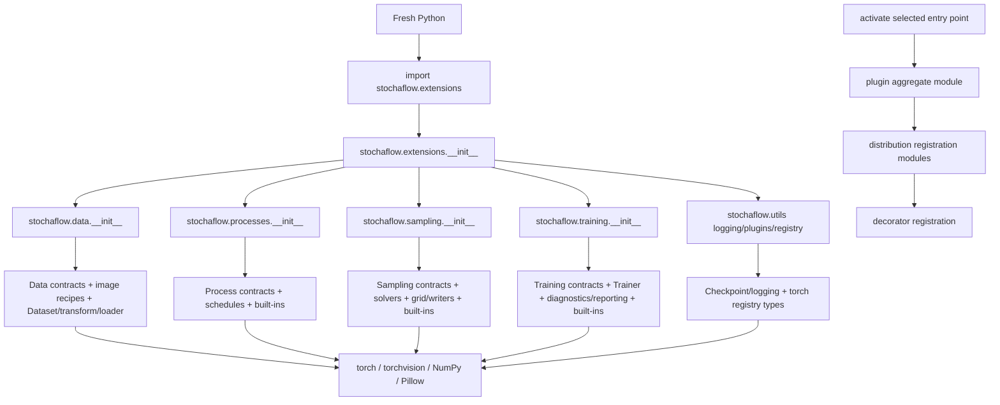
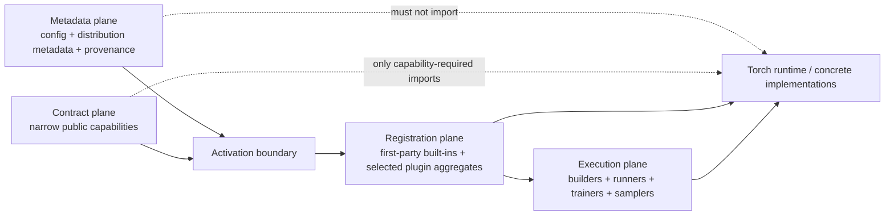

# Extension 导入边界与激活延迟优化计划

- 文档性质：开发计划；不属于当前公开 API 或正式用户文档
- 状态：需要在 Train/Sample C1 与 retained-example cleanup 后重新基线化；当前不按
  原 DoD 实施
- 统一排期：
  [Development Priority Roadmap](development-priority-roadmap.md)
- 制定日期：2026-07-27
- 最近复核：2026-07-29；确认旧基线需要在 C1/C2 后重建
- 旧审查基线：checkpoint v10 partial sampling recipe、Physics Reconstruction、
  Knowledge Distillation 与 AFHQ-v2；该基线将被 Train/Sample C1 和
  retained-example cleanup 明确打破，实施前必须重新测量
- 关联文档：
  [扩展公共 API](../api/extensions.md)、
  [扩展与 Registry](../configuration/extensions.md)、
  [参考扩展项目](../configuration/reference-projects.md)、
  [正式架构说明](../../ARCHITECTURE.md)

> **Rebase notice:** 下文关于 checkpoint v10、partial sample request、98-name export
> surface、Physics/KD installed-wheel acceptance 的“必须保持”表述只保留为旧测量证据，
> 不是未来实施要求。C1/C2 完成后必须重写对应 invariant、test matrix 和 DoD，不能从
> 本文当前正文直接开工。

## 1. 目标与核心结论

本计划解决的不是“所有 eager import 都是错误”，而是当前实现把三种语义完全不同的
导入成本叠加在了一起：

1. fresh Python、PyTorch 与 native library 的冷启动；
2. `stochaflow.extensions`、`stochaflow.utils` 等 package facade 为了 re-export
   公共符号而隐式加载无关实现；
3. 用户明确选择插件后，extension aggregate module 为完成 decorator registration
   而导入本 distribution 的注册模块。

第 2 项是当前需要修复的职责和 import-boundary 问题。第 3 项在现有 Registry 模型下是
显式 activation 的正确语义：如果类定义没有执行，decorator 就无法完成注册；如果把它
无条件改成 deferred import，重复名称、错误基类、模块导入失败和 partial activation
都会从启动期推迟到训练或采样中，改变现有错误保证。

本计划的核心决策如下。

1. **Public facade 应按实际使用的 capability 付费。**
   单纯执行 `import stochaflow.extensions` 不应加载 data、process、sampling、training、
   diagnostics、Trainer、Torchvision、Rich 或 concrete built-ins。
2. **Metadata preflight 必须保持轻量且无插件代码副作用。**
   config load、entry-point discovery、provenance/version 检查不得导入 selected
   extension target，也不应因为 parent package initializer 间接加载 PyTorch runtime。
3. **Package `__init__.py` 只负责命名空间兼容，不再承担 runtime bootstrap。**
   Python 在导入任意 submodule 前都会先执行 parent package initializer；只优化 leaf
   module 而保留 eager parent package 会形成“伪 lazy”。
4. **先拆 contract 与 concrete built-in，再实现 lazy facade。**
   当前若干文件同时定义公共基类和内置实现。只添加 PEP 562 `__getattr__` 会把全量导入
   从 package import 推迟到第一次访问常用符号，并没有真正缩小 import closure。
5. **保留 `stochaflow.extensions` 根 facade 的公共兼容性。**
   Phase 0 冻结的完整导出 manifest（当前为 98 个名称）、对象 identity、
   `from ... import Name`、`dir()` 和 `import *` 行为必须保持；不返回 proxy class
   或替代对象。这里的兼容基线是已完成 artifact/sampling breaking refactor 后的当前
   surface，不恢复已删除的 legacy artifact handle、identity 或 `sampling.builder`。
6. **新增 capability-oriented extension facades。**
   新代码优先从 config/plugin、data、process、sampling、training、observability
   等窄命名空间导入，根 facade 通过静态 export map 惰性转发。
7. **Registry contract binding 与 built-in registration 显式化。**
   错误基类必须在 registration 边界立即失败；built-in 由明确、幂等的 bootstrap
   激活，并继续使用与第三方 extension 相同的 Registry 和 decorator 路径。
8. **Selected plugin aggregate activation 首版继续 eager、确定且 failure-terminal。**
   aggregate module 只导入本 distribution 的 registration modules，不读取数据、
   构建模型、加载 checkpoint 或启动任务。component-level deferred registration
   仅在 facade 和 bootstrap 改造后仍有明确收益时另立提案。失败可能留下 partial
   Registry mutation，不承诺回滚；该进程必须禁止继续 composition。
9. **Core 不通过公共 facade 获取内部依赖。**
   runner、factory、Trainer 和 Builder 直接依赖 owner module 或窄 contract；
   `stochaflow.extensions` 只服务第三方稳定 API，不能成为内部万能依赖入口。
10. **结构预算是阻断契约，绝对耗时是观测指标。**
    普通 pytest 以 forbidden module prefixes、owner-only import 和无副作用状态为
    hard gate；cold-start latency、peak RSS 和 module count 在同平台 benchmark job
    中跟踪，不使用跨平台固定秒数制造 flaky test。

首版明确不做：

- 不通过测试预热、调整参数顺序或隐藏 durations 来“优化”结果；
- 不扫描顶层 config 猜测插件内部应导入哪些 component modules；
- 不把 Registry entry 替换成未经验证的字符串或透明 lazy proxy；
- 不为 import 优化新增通用组件 descriptor graph；
- 不改变 entry-point identity、plugin provenance、schema-v2 artifact manifest/cache、
  checkpoint v10 `inference_recipe`、partial sample request，或现有 external plugin
  selection/failure-terminal lifecycle；
- 不承诺实际 training/sampling 在无需 PyTorch 的情况下运行。

## 2. 触发证据与测量边界

### 2.1 慢测试

以下是 2026-07-27、artifact/sampling breaking refactor 完成前的一次历史触发数据：

```text
uv run pytest --durations=25 --durations-min=0.25

test_installed_entry_point_is_the_only_activation_path[physics-reconstruction]
    call: 14.61s

test_installed_entry_point_is_the_only_activation_path[knowledge-distillation]
    call: 1.30s

repository total:
    1035 passed, 13 skipped in 71.25s
```

单独在新 installed-wheel environment 中运行 Physics case，call 为 18.16 秒；在同一
environment 已经完成第一次导入后，再次执行等价的 framework import、config load、
prepare 和 activate 约 1.26 秒。这个差异说明大量时间来自首次 Python bytecode、
filesystem page cache、PyTorch/native loader 和 framework import closure，不是 Physics
训练算法在该测试中运行了 14 至 18 秒。该测试只检查安装来源、entry-point provenance
和 Registry inventory，不构建训练数据，也不执行 model forward。

Physics 恰好是参数化测试中的第一个 project，因此它承担了 cold-start 成本。改变 project
顺序很可能只会把这段时间转移到另一个 case，不能解决 runtime 问题。

该 repository total 和单 case duration 不再是当前验收基线。Phase 0 必须在当前
schema-v2 artifact、checkpoint v10 和 98-name extension surface 上重新采样；保留这些
数字只为说明问题来源，不用于判断实现是否回归。

### 2.2 Import closure 观察

2026-07-28 在当前共享工作区中，以独立 Python 进程、依赖文件缓存已预热为前提，得到
以下一次性观察：

| 操作 | 增量耗时 | 新增 modules | 新增 Stochaflow modules | 明显被加载的依赖 |
| --- | ---: | ---: | ---: | --- |
| `import stochaflow` | `<1ms` | 1 | 1 | 无 |
| `import stochaflow.utils.plugins` | 约 `0.40s` | 1293 | 8 | torch、NumPy、Pillow、YAML |
| `import stochaflow.extensions` | 约 `0.86s` | 2430 | 81 | torch、Torchvision、NumPy、Pillow、Rich、YAML |

2026-07-27 的另一组分阶段 probe 观察到 `import stochaflow.extensions` 为
`0.74s–1.28s`、约 2497 个 loaded modules 和约 311 MiB process RSS；在 facade 已加载
之后，再导入 Physics、Knowledge Distillation、AFHQ-v2 aggregate entry point 的增量分别
只有约 `3.7ms`、`5.7ms`、`6.3ms`。这进一步说明当前慢点主要发生在 framework facade
和 built-in bootstrap，而不是三个参考插件的 aggregate module 本身。增量结果同样只用于
归因，不是稳定性能 SLA。

`-X importtime` 给出的主要累计链路是
`extensions -> data -> artifact modules -> utils.__init__ -> checkpoint -> torch`，
以及 `data.builder -> datasets -> torchvision`。sampling package 还会经
`models.__init__` 注册 ADM/DiT/UNet，training package 会继续带入 diagnostics providers、
Rich reporting 和 TensorBoard logging。

`stochaflow.utils.plugins` 文件本身只负责 metadata discovery 与 activation state，但
Python 会先执行 `stochaflow.utils.__init__`。后者 eager re-export checkpoint、logging、
registry 等对象，所以所谓“只导入 plugins leaf”当前仍会加载重 runtime。

这些数字用于证明 import closure 的量级，不是跨机器性能承诺。macOS/Windows dynamic
loader、杀毒软件、Python/PyTorch 版本、wheel link mode、CPU contention 和 filesystem
cache 都会显著改变绝对时间。后续验收必须把以下成本分开记录：

```text
framework facade overhead
    = facade process - empty Python process

contract access overhead
    = representative symbol process - bare facade process

plugin activation overhead
    = activated plugin process - required framework contracts process

first-party bootstrap overhead
    = built-in bootstrap process - required Registry contracts process

complete runtime activation overhead
    = built-ins + selected plugin process - metadata/preflight process
```

### 2.3 可复现实验要求

正式 baseline probe 必须：

- 从 installed wheel 运行，而不是依赖 repository `PYTHONPATH`；
- 每个场景启动 fresh Python，避免 `sys.modules` 污染；
- 同时记录 elapsed、peak RSS、selected module prefixes 和完整环境元数据；
- 单列一次不计入统计的 fresh-environment first observation，不把它宣称为受控的 OS/
  filesystem cold start；
- 随后对每个稳定场景至少运行 20 个 fresh-process samples，报告 median、p95 和 MAD；
- 将 `python -X importtime` 保存为诊断 artifact，但不解析成公共 API 契约。

## 3. 当前 import graph 与职责混合

### 3.1 当前路径



图中 `B -> I` 是隐式 facade cost；`J -> M` 是用户已经明确选择插件后的显式
activation boundary。两者不能用同一个“eager import”标签处理。

### 3.2 Facade 同时承担 bootstrap

当前 `stochaflow.extensions.__init__` 不仅 re-export 类型，还借由导入 owner packages
产生以下副作用：

- built-in classes 的 decorators 执行；
- `DataBuilder`、`Process`、`Sampler`、`SamplingBuilder`、`TrainingBuilder`、
  `TrainingDiagnostic` 等 Registry base contract 被 `require_base()` 绑定；
- logging、diagnostics、image writer 等 concrete implementations 被加载；
- native dependency import 被提前触发。

这让一个 public naming surface 成为隐式 runtime initializer。任何看似无关的 import
顺序都可能影响 Registry 是否已经完成强类型绑定，也使 import latency 难以归属。

### 3.3 Contract 与 implementation 共址

以下文件代表了当前“访问一个契约就加载整族实现”的问题：

| 当前文件 | 公共契约 | 同文件或同 parent initializer 带入的实现 |
| --- | --- | --- |
| `data/builder.py` | `DataBuilder`、`DataBuilderContext` | image recipes、Dataset、transform、sampler、loader |
| `sampling/builder.py` | `SamplingBuilder`、context/output | standard denoising builder、Gaussian composition |
| `sampling/sampler.py` | `Sampler`、observer/result | trajectory implementation 与 Torch state copying |
| `training/builder.py` | `TrainingBuilder`、`TrainingPlan` | plan construction/validation helpers |
| `utils/logging.py` | `ExperimentLogger` | local、TensorBoard、W&B implementations |
| `training/diagnostics/__init__.py` | diagnostics public surface | providers 与 concrete diagnostics |

因此，PEP 562 只能作为 facade 机制，不能代替模块职责重构。

当前 data surface 还包含统一的 `DataArtifact`/`DataArtifactIdentity` 契约和公开的
`DataArtifactStore` producer lifecycle。后者是 framework-owned artifact I/O 服务，
不是纯 interface，也不是要重新拆成 managed/referenced runtime handle 的信号。import
改造应允许只访问 `DataSource`/`DataArtifact` contract 而不加载 store lifecycle；显式
访问 `DataArtifactStore` 可以加载其文件系统、hash、manifest 和 publication 实现，但
仍不应连带加载 Torch、training 或 sampling。

### 3.4 Registry 的特殊约束

`utils/registry.py` 当前在 module import 时加载 `torch.nn.Module`、`Optimizer` 和
`LRScheduler`，而若干 Stochaflow-specific Registry 的 expected type 又在 owner module
导入时通过 `require_base()` 安装。这个设计保证了第三方注册错误会尽早失败，但也意味着：

- 访问全局 `REGISTRIES` 本身必然是 Torch-capability access，而不是 metadata-only；
- 不能简单删除 owner module 的 import，否则 Registry 可能在 expected type 绑定前接受
  错误 component；
- built-in registration 与 contract binding 必须有显式、确定的顺序。

首版不要求访问 `REGISTRIES` 时完全不导入 Torch。目标是：没有访问 Registry 或 Tensor
contract 的 metadata/facade 路径不应因为无关 parent initializer 加载它。

### 3.5 Plugin aggregate 不是当前首要缺陷

现有 entry point 指向一个纯 module target。activation 确定性地导入 selected aggregate；
aggregate 再导入本 distribution 的 registration modules。这个设计提供：

- distribution-level provenance；
- activation 时完整的名称冲突和基类验证；
- 成功后固定的 Registry inventory；
- import failure/re-entry 后明确的 poisoned-process 语义；
- Builder 私有嵌套 component 不需要暴露成 core 可理解的通用 config graph。

若 core 试图根据 `model.name`、`data.name` 等顶层字段只导入“看起来会使用”的模块，会漏掉：

- TrainingBuilder 私有 teacher/objective/model；
- SamplingBuilder 私有 sampler、writer 或 condition adapter；
- DataBuilder 私有 source、partition 或 collate 协作；
- extension module import 时安装的窄 capability。

因此 component-level lazy activation 必须先设计 declarative registration descriptor
和失败时机，不能作为 facade 优化的顺手改动。

## 4. 必须保持的不变量

### 4.1 公共 API

- `stochaflow.extensions.__all__` 与正式 extension API 文档一一对应；
- 当前 98-name surface 包括统一 `DataArtifactStore` producer API 与
  `SamplingRecipe`；已删除的 managed/referenced concrete handle 和
  `sampling.builder` 配置不属于兼容集合；
- 根 facade 的既有名称保持可导入，对象 identity 与 owner module 中的原对象相同；
- 不改变 class `__module__`、pickling identity、`issubclass()` 或 `isinstance()`；
- 未知属性抛 `AttributeError`；
- `dir(stochaflow.extensions)` 包含完整公共名称；
- `from stochaflow.extensions import X` 按需加载 X；
- `from stochaflow.extensions import *` 可以显式加载完整 surface，允许它仍然较重；
- Pyright、runtime annotation resolution 和 Sphinx autodoc 能看到相同类型。

### 4.2 Registry

- 错误 component base 在 `register()`/`add()` 时失败，不推迟到 `create()`；
- built-in inventory 不依赖用户偶然先访问了哪个 facade symbol；
- built-in 与第三方 extension 继续使用相同 Registry/decorator/construction path；
- duplicate name、reserved namespace 和错误基类行为不变；
- import 顺序不改变最终 built-in inventory；
- bootstrap 与相同 plugin selection 的重复 activation 都是幂等的。

### 4.3 Plugin lifecycle

- `prepare_extension_plugins()` 只读 distribution metadata，不导入 target；
- selected targets 按稳定顺序激活，unselected targets 始终不导入；
- plugin identity、distribution、version、target 和 acceptance audit 不变；
- successful activation 后 process-wide selection 固定；
- different selection、re-entry 和 partial failure 仍要求 fresh process；
- aggregate import failure 不能被 lazy facade 吞掉或转换成“unknown registry name”；
- activation 不提供 Registry rollback；失败后可能保留 partial registrations，但
  failure-terminal state 必须阻止任何后续 composition；
- schema-v2 artifact identity/binding、checkpoint v10 `inference_recipe`、sampling
  additive plugin selection 和 checkpoint/manifest provenance schema 不变。

### 4.4 架构

- runner/factory 依赖 owner contract，不依赖 facade import side effects；
- config parser 不感知 concrete plugin 或注册模块；
- 不新增 task-specific core dispatch；
- 不把 third-party dependency namespace 镜像成 Stochaflow Registry；
- optional provider 只有被明确选择时才导入；
- source-only extension 不应因为公共 API facade 隐式加载训练、采样或 diagnostics。

## 5. 推荐目标架构

### 5.1 四个导入平面



#### Metadata plane

拥有：

- config dataclasses 与 parsing；
- entry-point discovery；
- plugin provenance/version comparison；
- activation plan。

硬约束：

- 不导入 selected extension code；
- 不导入 checkpoint runtime、Trainer、sampling runtime 或 Registry catalog；
- 普通 config/preflight 路径不加载 Torch、Torchvision、Pillow 或 Rich。

#### Contract plane

拥有：

- Extension 作者需要继承、实现或作为输入输出使用的窄类型；
- capability-specific Registry access；
- stable config/error types；
- `DataArtifact`/identity/build-load records 和 `SamplingRecipe` 等数据契约。

它可以加载该契约本身不可避免的依赖，例如 `Process` 和 `TrainingStrategy` 的 Torch
Tensor/module contract，但不能顺带加载 unrelated family 或 concrete built-ins。

#### Registration plane

拥有：

- Registry expected-type binding；
- first-party built-in registration bootstrap；
- selected third-party aggregate activation；
- activation order、idempotence 和 failure state。

这是允许 import side effects 的显式边界。

#### Execution plane

拥有：

- factory、runner、Trainer、sampling runtime；
- concrete model/process/builder/sampler/logger/diagnostic；
- device、checkpoint、`DataArtifactStore` producer lifecycle、artifact I/O 和任务执行。

### 5.2 Capability-oriented public facades

`stochaflow.extensions` 的 leaf 只有在所有 parent initializer 都足够轻时才有意义。首版审查
范围至少包括 `extensions`、`data`、`processes`、`sampling`、`training`、`models` 和
`utils`；这些 package roots 应成为无 bootstrap 副作用的兼容 facade。

建议提供以下稳定 facade；最终命名在实现前由 API review 冻结：

```text
stochaflow.extensions
    __init__.py          # backward-compatible lazy root
    _exports.py          # static public name -> owner facade/name map
    config.py            # ComponentConfig, ConfigError
    plugins.py           # discovery/provenance/activation contracts
    registry.py          # REGISTRIES, Registry, RegistryError
    data.py              # DataSource/DataArtifact/DataBuilder contracts + lazy store access
    processes.py         # Process and family contracts
    sampling.py          # Dynamics/Sampler/SamplingBuilder/writer contracts
    training.py          # TrainingPlan/Builder/Strategy/objective contracts
    observability.py     # logger/diagnostic contracts
```

这些 facade 本身仍应按符号 lazy resolve，避免 `extensions.data` 因同时公开 Source 与
Builder 就自动加载 image recipe runtime。内部 owner modules 可以继续按领域组织，但
contract 与 built-in implementation 必须分离。

新 extension 文档应优先展示窄导入：

```python
from stochaflow.extensions.data import (
    DataArtifact,
    DataArtifactStore,
    DataSource,
    DataSourceContext,
)
from stochaflow.extensions.registry import REGISTRIES
```

根 facade 继续支持：

```python
from stochaflow.extensions import DataSource, REGISTRIES
```

但它是兼容入口，不再是建议新代码把所有领域聚合到一个 import statement 的理由。

### 5.3 Lazy export 机制

根 facade 使用静态、可审计的 export map，而不是动态扫描 owner packages：

```python
EXPORTS = {
    "DataSource": ("stochaflow.extensions.data", "DataSource"),
    "Process": ("stochaflow.extensions.processes", "Process"),
    "TrainingStrategy": (
        "stochaflow.extensions.training",
        "TrainingStrategy",
    ),
}
```

`__getattr__()` 只在请求公共名称时导入 owner，并将真实对象缓存到 module globals。
同时实现：

- 静态 `__all__`；
- 与 `__all__` 一致的 `__dir__()`；
- unknown-name `AttributeError`；
- `TYPE_CHECKING` imports 或 `.pyi`，保证 Pyright 不依赖运行时执行全部 imports；
- export map/API docs parity test；
- 多线程首次访问同一名称的回归测试。

不使用包装 class、callable proxy 或替代 descriptor。用户拿到的必须是 owner module
中的真实对象。

### 5.4 Contract/implementation 拆分

建议按职责拆分，而不是按“为了少几毫秒”随意搬文件。候选方向如下：

| 领域 | Contract-only module | Concrete/built-in module |
| --- | --- | --- |
| data | artifact/source、builder context/base、loader result/build-load contracts | `DataArtifactStore` lifecycle、image recipes、datasets、transforms、samplers、source providers |
| process | semantic root 与 family capabilities | Gaussian schedules/process implementations |
| sampling | dynamics、sampler、observer、builder/writer contracts | DDPM/DDIM、standard/class-conditional builders、grid writers |
| training | strategy output、plan/builder、diagnostic/logger contracts | built-in strategies、Trainer、EMA、precision、reporters/providers |
| registry | generic Registry primitive、catalog contract | first-party inventory bootstrap |

首版必须把已经发布的 extension contract class/function 保留在原定义 module，只把同文件
中的 concrete implementations 和重依赖移出；这样才能同时保持对象、`__module__` 与
pickling identity。不能在新模块复制同名 class，也不能先移动公开 contract 定义、再用旧
module re-export 来伪装兼容。若确实需要移动任何已发布定义，应单独做 compatibility review，
不属于本计划的无 breaking-change 路径。

### 5.5 Capability-scoped Registry contract validation

不能在每次 external activation 前执行“绑定全部 Registry contracts”的全局操作；那会再次
让 Source-only extension 加载 Torch 和整个 training/sampling contract graph。推荐让每个
Registry 自己持有明确的 expected-type policy：

```text
Registry(
    kind,
    expected_type=ConcreteContract,
)

Registry(
    kind,
    expected_type_resolver=load_one_capability_contract,
)
```

`expected_type_resolver` 只在该 Registry 首次 `add()`、`register()` 或显式验证时执行，并
缓存真实 expected type。它不是 lazy component registration：Registry value 仍是已经导入
的真实 class，duplicate 和 wrong-base 仍在 registration 时立即失败。不同 capability
分别解析：

- models/objectives/optimizer/scheduler 可以加载对应 Torch contract；
- data builders 只解析 `DataBuilder` contract；
- samplers 只解析 `Sampler` contract；
- training builders 只解析 `TrainingBuilder` contract；
- diagnostics/loggers 只解析各自 contract；
- `IMAGE_DATA_SOURCES` 直接绑定纯 `ImageDataSource` base。

这样既不依赖 facade import 顺序，也不需要一个 bind-all 操作。实现时必须解决 resolver
与 contract module 的循环依赖；resolver 可以在调用时 import owner，但 contract 定义不能
反向触发 application-wide catalog bootstrap。

Phase 1 同时把 generic `Registry`/`RegistryError` primitive 与 Torch-aware
`RegistryCatalog` 拆开。`IMAGE_DATA_SOURCES` 等窄 Registry 只依赖 generic primitive，
不应为了创建一个 `Registry[ImageDataSource]` 同时导入 `nn.Module`、`Optimizer` 和
`LRScheduler`。application catalog 仍可在真正访问相应 capability 时加载 Torch。这个
拆分是让 managed-Source-only AFHQ activation 不加载 Torch 的必要条件，同时不能削弱
`expected_type` 的即时校验。

### 5.6 显式 first-party bootstrap

当前 `utils.factory.load_builtin_components()` 在 module import 时执行。建议迁移为独立、
幂等、可测试的 registration operation，并增加一个明确的 runtime orchestration：

```text
activate_builtin_components()
activate_runtime_components(extension_plan)
```

要求：

- 直接导入明确的 first-party registration modules，而不是依赖 eager package roots；
- 所有 built-ins 仍通过普通 Registry decorators 注册；
- 重复调用不改变 inventory；
- 并发调用只执行一次完整 bootstrap；
- failure 可能留下 partial Registry mutation，但必须把 built-in activation 标为
  failure-terminal，禁止继续 composition，不宣称 rollback；
- high-level runtime API 在进入 factory/build 前显式完成 bootstrap；
- low-level programmatic factory 不得偷偷调用隐藏的 core-only `ensure_builtins()`；
  若调用者绕过 high-level runtime，必须显式执行公开、文档化的 activation operation；
- `activate_extension_plugins()` 继续只负责 selected external aggregates，不隐式加载
  全部 first-party built-ins；
- train/sample 等完整 runtime 使用 `activate_runtime_components()`，固定
  built-ins-before-external 顺序，使 duplicate-name precedence 确定。

推荐完整 runtime 执行：

```text
load/validate config
    -> prepare external plugin plan
    -> activate first-party built-ins
    -> activate selected extension aggregates
    -> construct configured components
```

前两步属于 metadata plane；后三步是明确进入 registration/execution plane。一个只需要
extension-owned Source 的工具可以在 fresh process 中直接执行 external activation，并只
触发该 Source Registry 的 expected-type policy；它不因此获得“完整 Stochaflow runtime
已经初始化”的保证。已经按 plugin-only 顺序激活的进程不得随后静默升级成另一种
built-in-first runtime topology；orchestration 必须检测并拒绝顺序不一致的复用。

### 5.7 External aggregate activation

首版保留一个 distribution 一个 aggregate module 的契约：

```python
# my_project/stochaflow_ext/__init__.py
from . import data, model, sampling, training
```

但增加 import hygiene：

- aggregate 只导入 registration modules；
- registration module 顶层只定义类型、常量和 decorators；
- data acquisition、checkpoint load、model construction、device query、worker creation
  和任务执行都不得发生在 import time；
- tools、CLI、preparation、evaluation 和 report generation 不进入 aggregate；
- data-only distribution 只导入 data registration module；
- optional heavy capability 若不是 distribution 的必需契约，优先拆成独立 distribution
  和 entry point，而不是 import-time `try/except ImportError`。

Physics 同时提供 data/model/training/sampling/writer，完整 activation 仍会导入这些模块。
其中 Physics data 包含 extension-local referenced `DataSource` 和 recipe-level
`DataBuilder`；AFHQ-v2 只注册使用统一 store 的 managed `DataSource`；Knowledge
Distillation 保持无 artifact 的 synthetic runtime recipe。改造后 AFHQ aggregate 应只
加载 data/source/store 所需 closure，而 KD/Physics 只为自己实际注册的 capability
付费。这种差异是 capability-oriented import 的预期结果，不能借 import 优化改变三者的
数据边界。

### 5.8 CLI dispatcher

`stochaflow.scripts.cli` 当前在构造 argument parser 前就导入 training runner 和 sampling
runtime，因此 `stochaflow init`、`--help` 等轻命令也支付 execution-plane 成本。这个问题
与 extension facade 同源，但属于独立 workstream：

- parser schema 留在轻模块；
- `train` 分支进入后才导入 experiment runner；
- `sample` 分支进入后才导入 sampling runtime；
- `init` 只导入 scaffold 所需模块；
- 保持命令参数、错误文本和 entry-point 行为不变。

CLI lazy dispatch 可以与 facade 改造同一 feature branch 验收，但不能用它掩盖 Registry
bootstrap 问题。

## 6. 方案比较

| 方案 | 优点 | 主要问题 | 决策 |
| --- | --- | --- | --- |
| 只给 acceptance tests 标 `slow` | 日常测试更快 | runtime 不变，问题仍存在 | 可作为测试分层，不是修复 |
| fixture 中预热 imports | durations 更稳定 | 隐藏真实 cold start，只移动成本 | 拒绝 |
| 仅给 `extensions.__init__` 加 PEP 562 | 改动小、兼容根 API | parent packages、contract/implementation、bootstrap 仍 eager | 只作为完整方案的一部分 |
| 窄 facade + contract 拆分 + 显式 bootstrap | 缩小真实 import closure，职责清晰，兼容现有 API | 涉及 import-order 与 cycle 重构 | 推荐 |
| Registry 保存 lazy class descriptors | component 首次使用才加载 | 延迟验证/失败，改变 activation failure timing 与类型契约 | 后置、另立提案 |
| 每个 Registry/component 使用独立 entry point | metadata 可精细发现 | entry-point 数量、provenance、Builder 私有依赖复杂 | 当前拒绝 |
| core 扫描 config 推断 registration modules | 表面上只加载“使用项” | 违反 Builder 私有组合与 OCP，无法完整推断 | 拒绝 |
| 删除根 facade，强制用户改 leaf imports | 实现最简单 | 无必要 breaking change，生态迁移成本高 | 拒绝 |

## 7. 公共 API 与迁移策略

### 7.1 兼容承诺

本节只承诺保持 2026-07-28 breaking refactor 之后的当前 API 和持久化契约；不增加旧
artifact/cache/checkpoint reader、旧类型 alias 或 `sampling.builder` adapter。首版不要求
当前用户修改：

- extension entry point；
- YAML `extensions.plugins`；
- Registry component names；
- `from stochaflow.extensions import ...`；
- schema-v2 artifact manifest/cache、checkpoint v10、sample request 或 run manifest；
- aggregate module target。

新增 leaf facades 后，正式文档和 scaffold 使用新路径；根 facade 不立即 deprecate。只有
在至少一个发布周期、类型检查和第三方 extension compatibility 数据充分后，才讨论是否
对超宽 root import 给出非阻断迁移提示。

### 7.2 仓库内迁移顺序

1. Core 内部 import 改为 owner/contract modules，不经过 extension facade。
2. Project scaffold 模板改用 capability-oriented facade。
3. AFHQ-v2 改用 data/config facade。
4. Physics 与 Knowledge Distillation 按 registration module 分别使用 data、process、
   training、sampling、observability facade。
5. 更新 `api/extensions.md`、`configuration/extensions.md`、
   `configuration/reference-projects.md`、`framework.md`。
6. 更新 super-resolution、custom-generation-family、reuse-gaussian-components 等
   extension 教程。

迁移不能与 component 行为重构混在同一 commit；每个 commit 保持 import/API parity
测试可运行。

### 7.3 类型检查与文档生成

PEP 562 runtime lazy export 不足以自动满足静态工具。实现必须选择并验证一种明确策略：

- `if TYPE_CHECKING:` 下显式导入全部 public symbols；或
- 为 facades 提供 checked-in `.pyi`；或
- 使用可生成但必须 check-in diff 的 export manifest。

无论选择哪种方式，以下三份集合必须由测试保持一致：

```text
runtime __all__
static typing exports
docs/api/extensions.md public symbol inventory
```

Sphinx/autodoc 不应通过枚举全部 lazy attributes 意外激活 complete runtime；文档构建可以
显式选择 owner modules，或在受控 docs process 中接受完整 import。

## 8. 性能与 import 预算

### 8.1 Hard structural gates

普通 pytest 不使用绝对秒数，最终至少执行以下独立进程 probes。Phase 0 只记录当前
snapshot 和目标 manifest；每条 absence assertion 在实现对应行为的 Phase 1 至 Phase 4
才转为阻断 gate，不保留永久 `xfail`，也不把当前错误 import graph 固化成期望值。

| Probe | 必须满足 |
| --- | --- |
| bare `import stochaflow.extensions` | 不加载 Torch、concrete data/sampling/training family、Trainer、diagnostic providers、Torchvision、Rich、factory |
| `import stochaflow.utils.plugins` | 不加载 selected extension、checkpoint runtime、Registry catalog、Torch/Torchvision/Pillow/Rich |
| access `ConfigError`/plugin preflight symbols | 只加载 metadata owner 与必要 YAML/packaging |
| access `DataSource`/`DataArtifact` | 不加载 artifact store lifecycle、data recipes、training、sampling、diagnostics |
| access `DataArtifactStore` | 可以加载 artifact I/O/lifecycle；不加载 Torch、Torchvision、training 或 sampling |
| access/register `ImageDataSource` | 可以加载 image contract；不加载 Torch、Torchvision、training 或 sampling |
| access `Process` | 不加载 data recipes、sampling builders、Trainer、diagnostics |
| access `Sampler` | 不加载 data recipes、training runtime、image grids |
| access `TrainingStrategy` | 不加载 Trainer、reporter、sampling grids、data recipes |
| access `REGISTRIES` | catalog 可用但不 bind-all；每个 Registry 在首次 registration 时只解析自己的 expected type |
| explicit built-in bootstrap | built-in inventory 完整、稳定且幂等 |
| plugin prepare | target module 在 `sys.modules` 中 absent |
| plugin-only activate | selected target present、unselected target absent、selected external inventory 精确，不隐式 bootstrap 全部 built-ins |
| complete runtime activate | built-in inventory 先完成，再激活 selected external inventory |
| CLI root/init help | 不加载 train/sample runtime、factory、Trainer 或 Torch |
| CLI train/sample help | 只加载对应参数 schema，不加载 execution runtime 或构建组件 |

不要对 module 总数设置永久精确值；依赖升级会合法改变内部 module graph。使用明确的
forbidden/required prefixes 和 Registry state assertions。

### 8.2 Benchmark job

在固定 CI image 和 locked dependencies 上，先记录一次不计入统计的
fresh-environment observation，再对以下场景各运行至少 20 个 fresh-process samples：

1. empty Python；
2. bare Stochaflow；
3. bare extension facade；
4. metadata config + plugin prepare；
5. 代表 contract symbol access 与单个 Registry expected-type resolution；
6. first-party built-in bootstrap only；
7. data-only AFHQ plugin-only activation；
8. Physics plugin-only aggregate activation；
9. Knowledge Distillation plugin-only aggregate activation；
10. built-ins + selected extension 的 complete runtime activation；
11. `stochaflow --help`、`init --help`、`train --help`、`sample --help`。

记录：

- 不计入统计的 fresh-environment first observation；
- warm median/p95/MAD；
- incremental overhead；
- peak RSS；
- imported top-level prefixes；
- Python、OS、architecture、Stochaflow/PyTorch versions。

首轮 benchmark 只形成 baseline。获得稳定历史后，可对同平台 main baseline 使用双阈值，
例如“相对退化超过 20% 且绝对增加超过 50ms”才阻断。阈值在实际 CI variance 数据
产生后决定，本提案不把示例数字直接写成最终 gate。

## 9. 测试设计

### 9.1 Public facade tests

扩展 `tests/test_extensions_api.py`：

- 保留 Phase 0 export manifest 中全部对象的 identity 测试（初始基线当前为 98 个）；
- `__all__`、typing manifest 与 docs inventory parity；
- `dir()` 包含完整 export；
- unknown attribute 抛 `AttributeError`；
- 重复 access 返回同一对象；
- `from ... import X` 按需加载；
- `import *` 行为兼容；
- wrong-base Registry tests 不依赖偶然 import order；
- 每个代表 capability 在独立 subprocess 中检查 import closure。

不能在同一 pytest process 顺序访问全部 symbols 后判断 lazy 行为；`sys.modules` 会让这类
测试产生假通过。

### 9.2 Registry/bootstrap tests

新增或扩展 Registry tests：

- bare facade 不注册 built-ins；
- 每个 Registry 的 expected-type resolver 只加载对应 capability，并在 registration
  前后状态明确；
- bootstrap 后 built-in inventory 精确；
- bootstrap 重复和并发调用幂等；
- 每个 built-in 仍通过 public Registry construction；
- selected external plugins 之间的 duplicate 在 plugin-only activation 时失败；
- external 与 first-party built-in 的 duplicate 在 complete runtime activation 时失败；
- 任意 plugin registration 的 wrong-base 在当次 registration 时失败；
- bootstrap failure 不产生可继续 composition 的 partial state；
- 不同合法 import order 得到相同 inventory。

### 9.3 Plugin lifecycle tests

保留 `tests/test_extension_plugins.py` 中已有的：

- discovery 不导入；
- deterministic order；
- same-selection idempotence；
- different-selection rejection；
- concurrent activation only once；
- failed/re-entrant activation poisons process；
- version mismatch policy/audit。

新增 import-order matrix：

```text
extensions root -> leaf
leaf -> extensions root
utils.plugins -> extensions root
registry facade -> plugin activation
built-in bootstrap -> plugin activation
plugin-only activation -> low-level factory/build precondition rejection
complete runtime activation -> factory/build success
```

每个 case 必须运行在 fresh subprocess，验证没有 partially initialized module 或
circular-import error。

### 9.4 Installed-wheel acceptance

Physics/KD 必须把 installed-wheel 验收拆成两个 fresh-process 路径，不能在 plugin-only
activation 后直接调用 low-level factory。

Entry-point isolation 路径记录：

```text
facade import
    -> config load
    -> prepare
    -> plugin-only activate
    -> external Registry snapshot
```

断言：

- prepare 前后 selected target 均 absent；
- plugin-only activate 后 selected target present；
- other extension target absent；
- imports 来自 installed environment，不来自 repository source；
- selected external Registry inventory 与 project declaration 精确；
- first-party built-ins 没有被这个路径隐式 bootstrap。

Production composition 使用另一个 fresh process：

```text
config load
    -> prepare
    -> complete runtime activate
    -> configured component construction
```

断言：

- first-party built-ins 在 selected external aggregate 前完成；
- complete Registry inventory 精确；
- configured model/process/builder 构造成功；
- train/resume/sample 行为不变。

当前该 installed-reference fixture 只包含 Physics 与 Knowledge Distillation；AFHQ 的现有
测试主要使用 source-tree path 注入，不能证明 wheel-installed import closure。实现时必须
二选一：

- 把 AFHQ distribution 作为 activation-only project 加入 installed-wheel harness；或
- 新增独立 AFHQ wheel + Stochaflow wheel 的 fresh-environment subprocess test。

AFHQ probe 不下载或 materialize 数据，只安装 wheel、激活 Source aggregate，并断言
Pillow 等明确依赖可以出现，而 Torch、Torchvision、training/sampling modules 不出现。

普通 acceptance test 不断言 wall-clock。它可以标记为 `slow`/`acceptance` 供日常 focused
suite 排除，但完整 CI 必须保留。性能采样放在独立 benchmark job。

### 9.5 CLI import-closure tests

新增 fresh-process CLI probes，覆盖：

```text
stochaflow --help
stochaflow init --help
stochaflow train --help
stochaflow sample --help
```

probe wrapper 捕获 argparse 的 `SystemExit`，并在 `finally` 中输出带唯一前缀的
`sys.modules` JSON snapshot，避免 help text 干扰解析。结构断言包括：

- root/init help 不加载 train/sample runtime、factory、Trainer 或 Torch；
- train help 只加载参数 schema，不构建训练 runtime；
- sample help 只加载参数 schema，不加载 checkpoint/model/sampling execution；
- 真正进入对应 command dispatch 后才允许加载该 operation runtime；
- 未选择 operation 的 runtime 始终 absent。

这些是普通 pytest hard gates，不由 benchmark latency 替代。

### 9.6 Framework verification

实现 feature branch 完成后至少运行：

```text
uv run pytest tests/test_extensions_api.py
uv run pytest tests/test_extension_plugins.py
uv run pytest tests/test_extension_reference_projects.py
uv run pytest tests/test_project_scaffold.py
uv run ruff check .
uv run pyright
uv run pytest
uv run python tools/generate_config_reference.py --check
uv run sphinx-build -W --keep-going -b html docs docs/_build/html
```

## 10. 分阶段实施

### Phase 0：冻结证据与契约

- 只能在 Train/Sample C1 与 retained-example cleanup 后启动；
- 增加 fresh-process JSON import probe；
- 记录 empty/facade/contract/prepare/activate baseline；
- 重新测量 public exports，不沿用旧的 98-name baseline，再固化为 machine-checked
  manifest；
- 增加 representative import-closure snapshot tests，但暂不启用目标 absence assertions；
- 不改变 runtime behavior。

退出条件：

- 能区分 interpreter、facade、contract 与 aggregate activation 成本；
- 当前 eager graph 以测试证据呈现；
- 无 wall-clock hard gate。

### Phase 1：拆分 contract 与 concrete implementation

- 拆分 DataBuilder、SamplingBuilder、Sampler、TrainingBuilder、logger/diagnostic contract；
- 将纯 `DataArtifact`/source records 与公开但 concrete 的 `DataArtifactStore` lifecycle
  放入不同 import closure，不改变 schema-v2 producer 行为；
- 拆分 generic Registry primitive 与 Torch-aware application catalog；
- 保持旧 owner imports 的真实对象 identity；
- 建立 owner/export mapping，但在显式 bootstrap 就绪前不提前删除现有隐式初始化；
- 明确 Registry expected-type binding 所需的最小 contract closure。

退出条件：

- contract owner modules 不再直接依赖 unrelated built-ins；
- 旧 import path 与对象 identity 保持；
- 所有 Registry wrong-base tests 保持；
- factory/runner 行为未变。

### Phase 2：显式 Registry validation 与 built-in bootstrap

- 为各 Registry 引入 capability-scoped expected-type policy；
- 将 module-scope implicit built-in loading 迁移为
  `activate_builtin_components()`；
- 新增 complete runtime orchestration，固定其中的 built-in-before-external order；
- 保持 plugin-only activation 不隐式加载 built-ins；
- high-level runtime 在调用 factory/build 前显式完成 bootstrap，low-level API
  校验 activation precondition；
- 增加并发、幂等、failure tests。

退出条件：

- 在不依赖 facade side effect 的隔离测试中，显式 activation 后 inventory 与当前版本完全
  一致；
- complete runtime 中的 external duplicate、wrong-base 和 import failure 时机不变；
- plugin-only activation 不暗示 first-party runtime 已初始化。

### Phase 3：Lazy package facades

- 先将会阻断 leaf import 的 parent packages 改成 side-effect-free lazy exports；
- 为 `stochaflow.extensions` 增加静态 export map、`__getattr__`、`__dir__`；
- 为新 capability facades 提供 typing support；
- 将 `stochaflow.utils` 改为轻 facade，使 `utils.plugins` 真正保持 metadata-only；
- 保持 root API compatibility。

退出条件：

- bare public facade 无 Registry mutation；
- 单独访问代表 contract 不加载 unrelated built-ins；
- Phase 1 至 Phase 3 对应的 facade、Registry、plugin structural gates 通过；
- API/typing/docs export sets 一致；
- fresh-process import-order matrix 通过。

### Phase 4：迁移 examples、scaffold 与 CLI dispatch

- core import 改 owner contracts；
- extension scaffold、AFHQ showcase 与独立最小 contract fixtures 改用窄 facade；
- CLI 按 subcommand 延迟 execution runtime；
- 同步公开 extension 文档与教程；
- 运行 installed-wheel acceptance。

退出条件：

- AFHQ managed-Source-only activation 可以加载其明确使用的 Pillow/materialization 和
  `DataArtifactStore` 依赖，但不加载 Torch、Torchvision、training/sampling
  implementations；
- referenced artifact binding 与 `artifact_bindings is None` 分别由独立最小
  fixture 验证，不恢复已退出维护的 Physics/KD project；
- `init`/help 不支付 train/sample runtime import；
- CLI 与 installed-wheel probes 加入后，完整 hard structural gate matrix 通过；
- source checkout isolation 与 wheel entry points 通过。

### Phase 5：重新评估 component-level lazy activation

只有同时满足以下条件才开启新提案：

1. facade、contract、bootstrap 和 CLI 改造已经完成；
2. benchmark 证明 selected aggregate activation 仍是用户可感知瓶颈；
3. 至少两个真实 extension distribution 需要只激活自身的一部分；
4. 能定义 declarative registration、eager validation、provenance，以及明确的
   partial-mutation/failure-terminal 语义；
5. 不需要 core 理解 Builder 私有 config graph。

否则继续保留 aggregate eager activation。

## 11. 风险与缓解

| 风险 | 影响 | 缓解 |
| --- | --- | --- |
| 只做 PEP 562，parent package 仍 eager | 表面优化，常用 symbol 首次访问仍全量加载 | contract 先拆、逐 symbol closure tests |
| Registry base 尚未绑定就注册插件 | 错误类被接受，LSP contract 失效 | 显式 binding，registration-before-build tests |
| built-in 注册顺序变成偶然 | duplicate 行为和 inventory 漂移 | 单一 bootstrap、固定 module order |
| lazy export map 与 `__all__` 漂移 | runtime、typing、docs 不一致 | machine-checked manifest/parity |
| `hasattr`、autodoc 或错误实现的 `__dir__` 意外激活 | 工具触发全量 import | `__dir__` 只读静态 export map、docs owner modules、测试 |
| circular import | partially initialized module | owner dependency graph + fresh-process order matrix |
| 并发首次 access/bootstrap | double registration | import lock、幂等 state machine、thread tests |
| 异常从 activation 推迟到 runtime | 训练中才失败，污染输出 | 不引入 lazy Registry proxy，保留 aggregate eager validation |
| optional dependency import 被吞掉 | 错误变成缺失 Registry name | activation 时保留原始 provenance-rich exception |
| fixed timing gate 在不同平台抖动 | flaky CI | structural hard gates + same-platform relative benchmark |
| `import *` 仍慢 | 用户误以为 lazy 对所有形式免费 | 明确其显式 full-surface 语义 |
| core 继续从 facade import | 内部依赖再次扩宽 | code convention/search test 与 owner imports |

## 12. 与框架设计原则的关系

### Single Responsibility

Public facade 负责稳定命名，contract module 负责语义，bootstrap 负责注册，activation
负责 selected distribution，runner 负责执行。一个 `__init__.py` 不再同时拥有这五种
变化原因。

### Open-Closed

第三方 extension 仍通过 entry point、contract 和 Registry 添加能力；core 不按 plugin
或 component 名称增加分支，也不通过 config 猜 registration module。

### Liskov Substitution

Registry expected base 在注册时完成验证；lazy facade 返回真实 contract class，不用 proxy
削弱 `issubclass`、identity 或错误保证。

### Interface Segregation

DataSource-only extension 可以只依赖 data/source capability，不被迫导入 sampling、
training、diagnostics 和 CLI runtime。公共 API 仍可从兼容根 facade 访问，但新代码使用
窄 surface。

### Dependency Inversion

runner/factory 依赖 contract 与显式 activation/bootstrap，不依赖某个 public facade 的
偶然 import side effect；built-ins 与外部实现仍在 Registry composition boundary 构造。

## 13. Definition of Done

本计划只有在以下条件全部满足后才能标为 Implemented：

1. bare `stochaflow.extensions` 与 `stochaflow.utils.plugins` 通过结构 import budgets；
2. representative contract access 不加载 unrelated implementation families；
3. managed-Source-only AFHQ registration 不加载 Torch、Torchvision、training 或
   sampling；
4. Phase 0 冻结的根 facade export manifest、identity、typing 和正式 API 文档完全一致；
5. Registry wrong-base/duplicate/reserved-prefix 行为与当前契约一致；
6. built-in bootstrap 显式、幂等、并发安全，inventory 稳定，失败后
   failure-terminal 且不宣称 Registry rollback；
7. plugin prepare 仍无 target import，activation 仍 eager、确定且 failure-terminal；
8. AFHQ installed-wheel acceptance 以及 referenced/no-artifact 独立 contract
   fixtures 全部通过；
9. CLI `init`/help 不再隐式加载 train/sample execution runtime；
10. schema-v2 artifact manifest/cache/identity、C1 后 checkpoint
    `inference_recipe`/完整 sample invocation、provenance 与 entry-point schema
    无意外变化；
11. focused tests、repository pytest、Ruff、Pyright、config reference check 与 Sphinx `-W`
    全部通过；
12. benchmark 报告区分 empty、facade、contract、first-party bootstrap、plugin-only
    activation 与 complete-runtime activation，不把一次 first observation 误写成稳定
    SLA；
13. 公开文档只描述已经实现的行为；本开发计划在实现完成前不从 public docs index 链接。

## 14. 尚待决策

以下问题必须用 Phase 0 至 Phase 4 的数据回答，不在本提案中提前假定：

1. generic `Registry` 与 Torch-aware `RegistryCatalog` 拆分后的最终 module ownership
   和 typing 方式；
2. capability facades 的最终粒度是 domain-level，还是 data source/builder、
   sampling contract/writer 等更窄层次；
3. typing 使用 `.pyi` 还是 `TYPE_CHECKING` explicit imports；
4. built-in bootstrap 是否需要与 external activation 共用一个内部 state-machine
   primitive；
5. CLI lazy dispatch 是否与 facade refactor 同一 feature branch 落地；
6. 哪些 CI 平台足以形成稳定 relative performance gate；
7. facade 改造后 Physics aggregate 的剩余 cold cost 中，多少属于不可避免的 Torch/native
   startup，多少仍是 Stochaflow-owned import closure；
8. 是否存在足够真实需求为 component-level declarative/lazy registration 另立方案。
