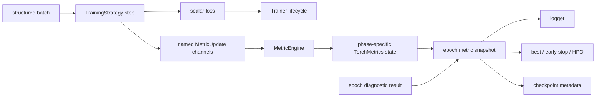

# Metrics 支持开发计划

- 文档性质：开发草案；不属于当前公开 API 或正式文档导航
- 状态：提案，尚未进入实现
- 制定日期：2026-07-25
- 架构复核：2026-07-26；明确为 Training/Diagnostic/Evaluation/AutoML 共用的
  task-neutral 统计子系统
- 前置范围：现有单 optimizer 自动训练循环、validation/test iterable、训练期
  diagnostic、checkpoint v10 与 extension registry
- 目标范围：内置与第三方 epoch metrics、train/validation/test 聚合、diagnostic
  指标参与统一监控、best checkpoint、early stopping 与未来 HPO
- 关联计划：
  [训练后 Evaluation 与 Benchmark 支持计划](post-training-evaluation-support-plan.md)、
  [自动化模型调优开发计划](automated-model-tuning-plan.md)

## 1. 目标与结论

本计划解决四个相互关联但不能混为一体的问题：

1. `TrainingStrategy` 怎样把任务专属的 prediction/target 等值交给指标，而不让
   `Trainer` 猜测任意 batch 结构或模型签名；
2. stateful metric 怎样按 phase 执行 `reset -> update* -> compute`，并正确管理
   device、结果命名和失败；
3. validation metric 与现有 diffusion diagnostic metric 怎样进入同一套 epoch
   结果、best checkpoint 和 early-stopping 监控；
4. 内置 metric、TorchMetrics metric 与 extension 自定义 metric 怎样共享稳定的
   构造路径，而不复制整个 TorchMetrics 命名空间和参数表。

推荐结论如下：

- **以 TorchMetrics 的 `Metric` 作为统计状态契约**，不在 Stochaflow 内重新实现
  distributed reduction、device state、`update/compute/reset` 和自定义 state
  机制。推荐在完成跨平台兼容性矩阵后，把 `torchmetrics` 从当前 `quality` extra
  提升为基础依赖；若某个受支持平台阻止提升，则必须建立明确的 `metrics` extra 并在
  composition preflight 给出安装错误，不能运行到首个 validation batch 才失败。
- **向 `TrainStepOutput` 增加不透明的 `metric_updates` 通道**。Strategy 解释 batch
  和模型输出，并为每个有文档的 channel 产生调用参数；Trainer 只把
  `args/kwargs` 分发给绑定到该 channel 的 metric，不理解 `preds`、`target`、
  `image`、`condition` 或 task 名称。
- **Metric 不是 Objective，也不是 Diagnostic**。Objective 产生可反向传播的 scalar
  loss；Metric 跨 batch 累积只读统计；Diagnostic 负责额外 forward、采样、参考分布
  缓存和 artifact。重型 FID/KID 继续属于 diffusion diagnostic provider，不搬进
  普通 validation loop。
- **建立一个统一的 epoch metric snapshot**。train、validation、test 和 epoch-end
  diagnostic 的 scalar 结果使用同一命名、冲突检查、日志和 monitor 解析路径。
- **让 epoch diagnostic 显式返回结果，并提前到 best-selection 之前执行**。当前
  diagnostic 直接写 logger 且发生在 checkpoint 之后，因此不能被 best checkpoint、
  early stopping 或未来 HPO 消费；返回结果还必须携带实际 data role/protocol，
  只有 validation-role 且 selection-eligible 的 observation 才能参与选择。
- **先支持单目标 scalar monitoring**。非 scalar、曲线、图像和 per-class tensor
  仍作为 artifact 或显式展开后的多个 scalar；复合目标和约束留给后续 HPO 计划。
- **训练后的正式评估是独立 Evaluation Operation，不属于 MetricEngine 的职责**。
  Evaluation 复用同一 metric 构造、channel update 和 result normalization，但另外
  拥有 checkpoint/权重、数据协议、任务推理、prediction artifact、result manifest
  与 gate；完整设计见
  [训练后 Evaluation 与 Benchmark 支持计划](post-training-evaluation-support-plan.md)。

### 1.1 Metrics 与 Evaluation 的包含关系

这里采用“运行时包含、架构上依赖”的表述：

- 一次 `EvaluationRun` 会包含若干 metric 实例和 metric results；
- `EvaluationRunner` 依赖 task-neutral `MetricEngine`；
- Metric subsystem 不依赖 Evaluation，因为 validation、diagnostic 和 AutoML 也消费它；
- Evaluation 也不只等于 metrics，因为它还管理 subject、data、inference、artifact、
  completeness 和 provenance；
- 同一个 metric algorithm 可以在 training validation、periodic diagnostic 和独立
  evaluation 中复用；执行上下文决定命名、数据治理和决策资格。

因此 MetricEngine 必须放在 task-neutral package，而不是成为 Trainer 私有 helper。
Diagnostic 和 Evaluation 可各自承担额外模型调用；当 payload/lifecycle 兼容时复用
共同的 Metric factory/runtime，不兼容时至少复用同一 metric implementation 与
versioned preprocessing profile。重型 FID/KID 在训练上下文继续由 diagnostic
provider 拥有 sampling/cache；在独立 benchmark 上则由 task EvaluationBuilder
组合，不能因算法名字相同就强行进入每 batch validation。

## 2. 当前仓库基线

### 2.1 已有能力

当前代码已经提供了大部分生命周期骨架：

| 位置 | 已有行为 |
| --- | --- |
| `training/strategy.py` | `TrainStepOutput` 含 scalar `loss`、batch-level scalar `metrics` 和任意 `diagnostics` |
| `training/trainer.py` | train/evaluation loop、validation loss、best checkpoint、early stopping、phase logging |
| `training/diagnostics/` | fit start、train batch end、train epoch end 生命周期与 provider catalog |
| `diagnostics/providers/denoiser.py` | timestep bucket loss、noise alignment、重建 MSE/PSNR |
| `diagnostics/providers/reference.py` | 基于 TorchMetrics 的 FID/KID 与真实特征缓存 |
| `utils/registry.py` | framework component registry 与 extension 激活 |
| `utils/checkpoint.py` | resolved config、epoch metrics、best-tracking state 与 managed asset state |
| `pyproject.toml` | `quality` extra 已包含 `torchmetrics>=1.9,<2` |

现有边界中，`TrainingStrategy` 已经是 batch interpretation 和模型调用的唯一拥有者；
`GaussianDiagnosticSemantics` 也证明了“额外模型调用必须依赖窄 capability，而不是
从 Process 或 prediction type 猜模型签名”的做法可行。

### 2.2 当前缺口

1. `TrainStepOutput.metrics` 只在 training 的 `log_every` 批次上写入
   `train/strategy/*`，没有跨 batch 状态，也不参与 validation/test。
2. `evaluate_epoch()` 只累计 loss，忽略 `evaluation_step()` 返回的 `metrics` 和
   `diagnostics`。
3. train/validation loss 是“batch mean 的等权平均”。对于最后一个小 batch、动态
   batch 或 token/bucket batch，它不等于 sample-weighted mean；core 又不能从任意
   batch 推断正确权重。
4. logger tag 与内部 monitor key 不一致：日志使用 `valid/epoch_loss`，history 和
   early stopping 使用 `valid_loss`。
5. `DiffusionQualityDiagnostic` 的 epoch metrics 直接写 logger；`TrainingDiagnostic`
   callback 返回 `None`，所以 Trainer 看不到这些结果。
6. epoch diagnostic 在 periodic/latest/best checkpoint 处理之后调用。即便把结果写入
   event mapping，也已经错过本 epoch 的选择时机。
7. diagnostic metric provider contract 和 `DIAGNOSTIC_PROVIDERS` 仍是内部模块；
   当前 `modules` 配置暗示支持第三方 provider，但稳定的 extension export 没有覆盖
   这些符号。
8. FID/KID 的 TorchMetrics 依赖是可选的；通用 metrics 尚无明确依赖策略。
9. best/early-stopping 对 monitor 缺失一律报错，无法表达“每 N 个 epoch 才产生一次”
   的 diagnostic metric。

这些缺口说明，不能只在 config 增加一个 `metrics` 列表；必须先建立输入通道、状态
生命周期和统一结果面。

## 3. 成熟方案调研

### 3.1 TorchMetrics

[TorchMetrics](https://lightning.ai/docs/torchmetrics/stable/) 提供 100 多个指标、自动
batch accumulation、device placement 和 distributed synchronization。其
[`Metric`](https://lightning.ai/docs/torchmetrics/stable/references/metric.html)
约定是：

- 自定义实现覆写 `update()` 与 `compute()`；
- state 通过 `add_state()` 声明，并指定 `sum`、`mean`、`cat` 等跨进程 reduction；
- framework 提供 `reset()`、device movement、compute cache 和 compute-time sync；
- state 默认不进入 `state_dict`，除非显式声明 persistent。

[自定义 Metric 指南](https://lightning.ai/docs/torchmetrics/stable/pages/implement.html)
进一步说明 stateful metric 应把输入检查/状态更新与最终计算分开；需要保留全量样本的
list state 会带来明显内存成本。

对 Stochaflow 的启示是：复用 `Metric` 作为统计引擎，但不能直接假定所有 metric 都
接收 `(preds, target)`。TorchMetrics 解决的是统计状态，不解决 Stochaflow 任意
structured batch 到 metric 参数的任务适配。

### 3.2 PyTorch Lightning、Ignite 与 Keras

[Lightning 的 TorchMetrics 集成](https://lightning.ai/docs/torchmetrics/stable/pages/lightning.html)
采用每个 phase 独立 metric 实例，在 epoch 内 `update()`，epoch end `compute()` 后
`reset()`；`MetricCollection.clone(prefix=...)` 用于避免 train/validation state
串扰。官方也建议仅需要 epoch metric 时直接 `update()`，避免每批都执行昂贵
`forward()`/`compute()`。

[PyTorch-Ignite Metric](https://docs.pytorch.org/ignite/generated/ignite.metrics.Loss.html)
同样在 epoch start reset、batch complete update、epoch complete compute。
[Keras Metric](https://keras.io/api/metrics/base_metric/) 使用
`update_state()`、`result()`、`reset_state()`；其训练指南明确指出，把 state update
与 result computation 分开能避免每批执行昂贵计算。

三者的共同点不是某个类名，而是稳定的三阶段生命周期：

```text
phase start       each successful step        phase end
reset()      ->   update(payload) * N    ->   compute() -> publish -> reset()
```

### 3.3 Diagnostic 与普通 metric 的差异

现有 Stochaflow FID/KID 需要：

- validation reference loader；
- 真实样本特征缓存；
- 生成样本和 sampler profile；
- 独立 cadence、sample count、device 和失败策略；
- artifact manifest 与耗时统计。

这些不是一个普通 `Metric.update(preds, target)` 能表达的职责。把 FID/KID 和
validation accuracy 放进一个万能接口，会迫使所有 metric 接受大量可选字段，违反
Interface Segregation，也会让 Trainer 了解生成任务。

因此采用两层设计：

| 层 | 负责内容 | 不负责内容 |
| --- | --- | --- |
| Metric state | `reset/update/compute`、device、reduction | batch 解释、额外采样、artifact |
| Consumer/binding | Strategy update channel 或 diagnostic provider context | 统计 state 的内部算法 |

普通 phase metrics 由 MetricEngine 消费 Strategy channel；diagnostic metrics 继续由
family-specific provider 消费专用 context。两者只在最终 scalar result 面汇合。

### 3.4 备选方案比较

| 方案 | 优点 | 主要问题 | 结论 |
| --- | --- | --- | --- |
| Trainer 直接从 batch 找 prediction/target | 实现短 | 破坏任意 batch 与 task-neutral core | 拒绝 |
| YAML selector 读取 `batch.0`、`diagnostics.foo` | 看似灵活 | 形成脆弱的通用 batch/path DSL，错误延迟到运行期 | 拒绝 |
| 把所有 metric 都做成 `TrainingDiagnostic` | 复用 callback | validation 仍无标准 state lifecycle，普通 metric 与额外采样混杂 | 拒绝 |
| 把 Metric 当 `TrainingPlan` managed module | 可复用 device/checkpoint | 会误入 optimizer/mode/checkpoint 资产语义 | 拒绝 |
| Builder 为每个 metric 生成 callable adapter | 最强 task-specific 能力 | public 类型和配置层级更多，普通场景样板较重 | 作为未来复杂 binding 选项 |
| Strategy channel + TorchMetrics state | 保留任务边界，复用成熟 state engine | 需声明 channel contract | 首版采用 |

## 4. 术语与责任边界

### 4.1 四种数值不可混用

| 名称 | 生命周期 | 是否参与梯度 | 示例 |
| --- | --- | --- | --- |
| Objective/loss | 单 step | 是 | MSE、cross entropy、distillation loss |
| Step report | 单 step、无状态 | 否 | 当前 LR、一个 batch 的 auxiliary loss |
| Epoch Metric | 一个 train/validation/test phase | 否 | accuracy、MAE、sample-weighted mean |
| Diagnostic-context Metric/Result | 独立 cadence，可能额外 forward/sampling | 否 | FID、KID、重建曲线、sampler 性能 |

`TrainStepOutput.metrics` 保留为低成本 step report；新增的 `metric_updates` 才进入
stateful MetricEngine。不能把 Objective module 注册为 Metric，也不能让 MetricEngine
重新调用模型。

“Diagnostic-context”描述运行位置，不定义新的 Metric 算法继承层次。同一 FID/PSNR
实现可在独立 Evaluation 中使用；其是否参与 selection 由 monitor/SelectionPolicy
显式声明。

### 4.2 核心不拥有的语义

core 不定义以下通用字段：

- `preds`、`target`、`labels`、`clean_samples`、`condition`；
- batch size、sample count、token count 或 bucket weight；
- classification、image、physics、text 等 modality；
- arbitrary model invocation；
- diagnostic sampler 或 reference dataset。

具体 Strategy 通过文档化的 channel 决定 payload；Metric 只声明自己绑定的 channel。
兼容性在完整 `TrainingPlan + metric declarations` 构成后验证。

## 5. 建议架构

### 5.1 Strategy 产出不透明更新通道

建议新增以下 public data-only contract：

```python
@dataclass(frozen=True, slots=True)
class MetricUpdate:
    args: tuple[Any, ...] = ()
    kwargs: Mapping[str, Any] = field(default_factory=dict)


@dataclass(frozen=True, slots=True)
class TrainStepOutput:
    loss: torch.Tensor
    metrics: Mapping[str, ScalarMetric] = field(default_factory=dict)
    diagnostics: Mapping[str, Any] = field(default_factory=dict)
    metric_updates: Mapping[str, MetricUpdate] = field(default_factory=dict)
    loss_weight: float | int | torch.Tensor = 1.0
```

约束：

- channel name 是非空字符串，在一个 step 内唯一；
- `args/kwargs` 是 metric-specific，不进入通用 YAML schema；
- core 在分发前递归 detach Tensor，metric 不得保留 autograd graph；
- v1 metric 不可微，更新在 `torch.no_grad()` 下执行；
- sample weight 若存在，必须是具体 channel 的显式 `args/kwargs` 语义；core 不能按
  metric 构造参数名或 batch shape 猜测；
- `loss_weight` 由 Strategy 明确给出，默认 `1.0` 保持当前等权 batch 行为；
- MetricEngine 不消费 `diagnostics` 作为隐式 fallback，避免拼写约定变成隐藏 API。

内置 Strategy 首批声明：

| Strategy | Channel | Payload |
| --- | --- | --- |
| `SupervisedTrainingStrategy` | `supervised.prediction_target` | `(prediction, target)` |
| `GaussianDenoisingTrainingStrategy` | `gaussian.prediction_target` | `(model_output, target)` |
| `GaussianDenoisingTrainingStrategy` | `gaussian.clean_reconstruction` | `(predicted_clean, clean)` |

第三方 Strategy 可以声明自己的 channel；这不是全框架 batch schema。Builder 构造
Strategy 后，在完整 `TrainingPlan + metric declarations` 边界验证 channel。

建议使用一个可选窄 capability，而不是给所有 `TrainingStrategy` 增加无关方法：

```python
@runtime_checkable
class MetricChannelProvider(Protocol):
    @property
    def metric_channels(self) -> frozenset[str]:
        """Return update channels emitted by training/evaluation steps."""
        ...
```

配置了 metrics 时，Strategy 必须实现该 capability，且所有 declaration channel 都在
集合内；未配置 metrics 的现有自定义 Strategy 无需实现。实际 payload signature 仍由
该 Strategy/channel 的公开约定和 metric tests 保证，core 不做 signature introspection。

### 5.2 Metric declaration

建议在 `StochaflowConfig` 增加：

```python
@dataclass(slots=True)
class MetricConfig:
    id: str
    name: str
    channel: str
    phases: list[str] = field(default_factory=lambda: ["validation"])
    params: dict[str, Any] = field(default_factory=dict)
```

`id/name/channel/params` 是可被多个 runtime 共用的 `MetricSpec`；`phases` 只是
training binding。实现时 factory 应接受 task-neutral `MetricSpec`，training config
parser 再附加 phase 信息。独立 Evaluation config 复用相同 spec 和 factory，但不携带
training phase。YAML 可以继续保持下面的扁平表示，不能复制一套
`EvaluationMetricFactory`。

顶层字段：

```python
metrics: list[MetricConfig] = field(default_factory=list)
```

配置示例：

```yaml
metrics:
  - id: accuracy
    name: torchmetrics.classification.MulticlassAccuracy
    channel: supervised.prediction_target
    phases: [validation, test]
    params:
      num_classes: 10

  - id: reconstruction_mse
    name: mse
    channel: gaussian.clean_reconstruction
    phases: [train, validation]
    params: {}
```

验证规则：

- `id` 在整份 config 内唯一，并匹配稳定的 tag-safe pattern；
- `phases` 只允许 `train`、`validation`、`test`，不允许重复；
- `name/channel` 非空；
- `params` 只传给 metric constructor，不与运行时 `MetricUpdate.args/kwargs` 合并；
- 同一 metric declaration 为每个 phase 构造独立实例；
- config load 不导入 extension 或 TorchMetrics；构造在 extension 激活后进行。

### 5.3 构造与 registry

新增 `REGISTRIES.metrics`，注册项必须继承 `torchmetrics.Metric`。构造策略与
optimizer/scheduler 的成熟依赖边界保持一致：

1. Stochaflow 自有的少量高层 built-in 使用 registry name；
2. `torchmetrics.*` 通过受限 native-provider resolver 构造，并验证最终对象是
   `torchmetrics.Metric`；
3. 不为 TorchMetrics 的每个类注册别名，不复制其全部 constructor 参数和默认值；
4. 第三方 metric 通过 extension entry point 注册到 `REGISTRIES.metrics`；
5. 不允许 config 导入任意 Python target；native resolver 只接受明确 allowlist 的
   TorchMetrics public namespaces。

首批 Stochaflow built-in 建议保持小而稳定：

| 名称 | 实现 | 目的 |
| --- | --- | --- |
| `mean` | `torchmetrics.aggregation.MeanMetric` wrapper | scalar/weight channel 基线 |
| `mse` | `torchmetrics.regression.MeanSquaredError` | prediction-target 回归 |
| `mae` | `torchmetrics.regression.MeanAbsoluteError` | prediction-target 回归 |
| `cosine_similarity` | 受测 wrapper | denoising/representation 对齐 |

classification accuracy/F1 等可直接使用 allowlisted `torchmetrics.*` target。只有当
Stochaflow 需要固定额外语义或跨版本兼容时，才增加自己的 wrapper。

### 5.4 MetricEngine

新增 task-neutral `metrics/`，training 和未来 Evaluation 都依赖它：

```text
metrics/
├── config.py        # MetricConfig 的局部严格验证
├── contracts.py     # MetricUpdate、phase/result contracts
├── factory.py       # registry + TorchMetrics native resolver
├── runtime.py       # MetricEngine
└── builtin.py       # 少量 Stochaflow wrappers

training/
└── metric_binding.py  # phase -> engine mapping 与 Strategy channel compatibility
```

task-neutral `MetricEngine` 只拥有**一个隔离统计 scope**：

- 该 scope 的 metric instances；
- channel -> metric bindings；
- `reset()`；
- `update(output.metric_updates)`；
- `compute() -> dict[str, float]`；
- device movement；
- scalar flatten、collision 和 non-finite 标记。

training 侧的 `TrainingMetricRuntime` 再拥有
`train/validation/test -> MetricEngine` mapping，并暴露
`reset_phase/update_phase/compute_phase`。独立 Evaluation 直接构造自己的
MetricEngine。这样 phase state 隔离由组合保证，而 task-neutral engine 不需要知道
Training phase 名称。

调用顺序：



同一 phase 的多个 metric 只有在 channel、update signature 和 kwargs 完全相同时才可由
内部 `MetricCollection` 合并；这是性能优化，不是公开语义。不能因为
`MetricCollection` 方便就要求所有 metrics 共享一个 universal `(preds, target)`。

### 5.5 统一结果与命名

建议 canonical keys：

```text
train/loss
valid/loss
test/loss
train/metrics/<metric-id>[/<subkey>]
valid/metrics/<metric-id>[/<subkey>]
test/metrics/<metric-id>[/<subkey>]
diagnostics/<diagnostic-id>/...
system/...
```

规则：

- `validation` phase 的 tag prefix 固定为 `valid`；
- metric 返回 scalar Tensor/number 时使用 `<metric-id>`；
- metric 返回 flat mapping 时追加经过校验的 `<subkey>`；
- list、tuple、非 scalar Tensor 或嵌套 mapping 默认拒绝；需由 wrapper 显式展开；
- bool 不是 numeric metric；
- 日志、history、checkpoint `metrics` 和 monitor 使用同一 canonical key；
- `train_loss`、`valid_loss` 作为一版兼容 alias 只在 config/旧 checkpoint 读取边界
  归一化，新的 payload 不再写双份 key。

canonical snapshot 不能只有裸 `Mapping[str, float]`。它还要为每个 key 保存最小
source metadata：

```python
@dataclass(frozen=True, slots=True)
class MetricSource:
    origin: Literal["phase", "diagnostic", "system"]
    data_role: Literal["train", "validation", "test", "external"] | None
    protocol_id: str | None
    selection_eligible: bool


@dataclass(frozen=True, slots=True)
class EpochMetricSnapshot:
    values: Mapping[str, float]
    sources: Mapping[str, MetricSource]
```

日志仍发布 scalar values；checkpoint、monitor 和 HPO 同时读取 source metadata。
canonical key 只用于稳定定位，不能把 `diagnostics/...` 前缀当作 data split 或
selection eligibility。phase source 由 Trainer 生成；diagnostic source 由完整
Diagnostic composition 根据实际 reference iterable/protocol 注入和验证，provider
不能仅靠返回字符串自称来自 validation。

Trainer 对 phase source 使用固定政策：train/validation 可以供训练内 monitor 显式
选择，test 永远 `selection_eligible=False`。HPO 还会施加更严格的
`data_role="validation"` 条件，因此 train metric 即使可用于兼容的 checkpoint
tracking，也不能成为 tuning objective。`origin="system"` 必须使用
`data_role=None` 且 `selection_eligible=False`；phase/diagnostic source 则必须有
非空 data role。

`NaN/Inf` 可以被记录为诊断事实，但不能被 best selection、early stopping 或 HPO
当作可比较目标。monitor 遇到 non-finite 默认失败，并给出 metric、epoch 与来源。

### 5.6 Diagnostic result 接入

新增一个最小返回类型：

```python
@dataclass(frozen=True, slots=True)
class VerifiedMetricSource:
    id: str
    metadata: MetricSource
    protocol_digest: str


@dataclass(frozen=True, slots=True)
class DiagnosticResult:
    source_id: str
    metrics: Mapping[str, float] = field(default_factory=dict)


class TrainingDiagnostic:
    def on_train_epoch_end(
        self,
        event: TrainEpochEndEvent,
    ) -> tuple[DiagnosticResult, ...] | None:
        ...


@dataclass(frozen=True, slots=True)
class BoundTrainingDiagnostic:
    diagnostic: TrainingDiagnostic
    sources: Mapping[str, VerifiedMetricSource]
```

`VerifiedMetricSource` 只能由 TrainingBuilder/diagnostic composition 根据实际注入的
reference iterable、split 和 versioned protocol 构造；callback 只返回
`source_id`，不能自行声明 `selection_eligible=True`。Trainer 必须把每个 result 的
source id 与 `BoundTrainingDiagnostic.sources` 做严格 lookup，并把 verified metadata
写入 `EpochMetricSnapshot`；未知、重复或不匹配的 source id 立即失败。

现有返回 `None` 的第三方 diagnostic 保持合法。`DiffusionQualityDiagnostic` 改为：

- artifact 和 manifest 仍由自己拥有；
- provider 结果不再只直接写 logger；
- 返回一个或多个已带完整 `diagnostics/...` tag 和 verified source id 的
  `DiagnosticResult`；
- Trainer 统一做 collision check、日志和 snapshot 合并。

source 规则：

- 使用 test reference 的 diagnostic 必须标记 `data_role="test"` 且
  `selection_eligible=False`；
- 首版只有经过 Builder 验证的 validation protocol 可以把 diagnostic 标记为
  selection eligible；
- train/external source 默认不允许 HPO，未来如需外部固定 benchmark objective，
  先定义等价的数据治理 contract；
- 一个 diagnostic 若混合多个 data roles，必须拆成多个带独立 source 的结果，不能
  用一个模糊 `external` 覆盖；tuple return 正式表达这一点；
- built-in 和 extension diagnostic contract tests 必须证明 binding 对应实际使用的
  iterable/protocol，不能只断言 metadata 字符串。

epoch 顺序调整为：

```text
train phase
-> validation phase
-> due epoch diagnostics
-> merge and publish snapshot
-> best/early-stopping decision
-> periodic/best/latest checkpoint
-> reporter
```

step diagnostic 仍然只做 step logging，不能作为 epoch monitor。若要监控，diagnostic
必须在 epoch end 返回一个有明确定义的聚合 scalar。

### 5.7 Monitor policy

把当前散落在 `Trainer.fit()` 参数中的 monitor 行为收敛为配置对象：

```yaml
trainer:
  monitor:
    metric: valid/metrics/accuracy
    mode: max
    missing: error
    min_delta: 0.001
  early_stopping:
    enabled: true
    patience: 5
```

对于低频 diagnostic：

```yaml
trainer:
  monitor:
    metric: diagnostics/diffusion_quality/samplers/ddim_50/fid
    mode: min
    missing: skip
```

语义：

- `missing: error` 适用于每 epoch validation metric；
- `missing: skip` 只在 metric 未到 cadence 时跳过 best/early-stop 更新；
- patience 计数单位是**有效 observation 次数**，不是 wall-clock epoch；
- 不提供 carry-forward，避免把陈旧 FID 当成本 epoch 结果；
- 被选为 monitor 的 diagnostic 必须在所有 trial/run 使用相同 cadence；
- monitor source 的 failure policy 为 `warn` 时，缺失按 monitor policy 处理，不静默
  伪造数值；
- monitor 构建时必须同时解析 key 和 `MetricSource`；
- `test/*` 或任何 `data_role="test"` observation 一律不能成为 best checkpoint 或
  early-stopping monitor；
- diagnostic observation 只有 `data_role="validation"` 且
  `selection_eligible=True` 时才能成为 monitor；
- prefix 与 source metadata 冲突时 fail closed，不能信任更宽松的一侧。

## 6. Extension API

为支持真正的自定义 metrics，需要公开：

- `MetricUpdate`
- `MetricConfig` 或其稳定只读 view
- `Metric` 所要求的上游基类说明
- `REGISTRIES.metrics`
- metric channel 命名与 Strategy 兼容性检查约定
- `MetricSource`、`VerifiedMetricSource`、`EpochMetricSnapshot` 与
  `BoundTrainingDiagnostic` 的只读 contract
- `DiagnosticResult`

若继续宣称支持 provider-level diagnostic extension，还应在同一稳定性审查中决定是否
公开：

- `DIAGNOSTIC_PROVIDERS`
- `StepMetricProvider`
- `SamplerMetricProvider`
- `ReferenceMetricProvider`
- 对应 context types

另一条受支持的简单路线是注册完整 `TrainingDiagnostic`；不能一边让 config 接受
`modules`，一边要求 extension 依赖未承诺稳定的内部路径。

自定义 metric 示例：

```python
import torch
from torchmetrics import Metric

from stochaflow.extensions import REGISTRIES


@REGISTRIES.metrics.register("my-project.relative_l2")
class RelativeL2(Metric):
    higher_is_better = False

    def __init__(self, eps: float = 1e-8) -> None:
        super().__init__()
        self.eps = eps
        self.add_state("error", default=torch.tensor(0.0), dist_reduce_fx="sum")
        self.add_state("count", default=torch.tensor(0), dist_reduce_fx="sum")

    def update(self, prediction: torch.Tensor, target: torch.Tensor) -> None:
        relative = (prediction - target).flatten(1).norm(dim=1)
        relative = relative / target.flatten(1).norm(dim=1).clamp_min(self.eps)
        self.error += relative.sum()
        self.count += relative.numel()

    def compute(self) -> torch.Tensor:
        return self.error / self.count
```

具体 extension 仍需让自己的 Strategy 产生与 `update()` 相容的 channel。注册 metric
本身不会赋予 core 解释 batch 的能力。

## 7. Checkpoint、resume 与 reproducibility

Metric state 默认不写 checkpoint，理由是当前 Trainer 只在完整 epoch 结束时保存：

- checkpoint 不恢复半个 validation phase；
- 下个 phase 总会先 reset；
- 保存 list-state metric 可能把全量 prediction/target 塞入 checkpoint；
- metric 是派生统计，不是训练资产。

checkpoint 需要保存：

- 本 epoch 完整 canonical metric values 与 `MetricSource` metadata；
- canonical monitor key、mode、best value、best epoch；
- missing policy 与 observation wait counter；
- resolved metric declarations 和 extension provenance（已在完整 config/provenance 中）。

strict resume 必须：

- 归一化旧 `train_loss`/`valid_loss` monitor alias；
- 验证 metric declarations 与 checkpoint config 完全一致；
- 恢复 best/early-stopping 的 observation counter；
- 从下一个完整 epoch 重新初始化 metric state。

如果未来支持 mid-epoch checkpoint，再单独定义 persistent metric state 和 loader cursor；
不能在本功能中暗示已经支持。

## 8. 性能与失败策略

- epoch-only metric 使用 `update()`，不调用 TorchMetrics `forward()`，避免每批 compute。
- list-state metric 必须有文档化内存上界；validation sample 上限由 loader/runtime
  budget 决定，不由 MetricEngine 截断。
- CPU-only metric 需要显式 wrapper 和 transfer policy，不能根据类名猜设备。
- 同一 output channel 的 payload 只 detach 一次，再分发给多个 metrics。
- metric update 失败默认终止 phase；这是配置或契约错误，不应当作普通 warning。
- diagnostic 保留现有 `raise|warn` failure policy，因为其额外 artifact/quality 检查可
  被明确设为非关键。
- 被 monitor 的 metric 失败时总是终止或按显式 missing policy 跳过，不能记录 0、
  `NaN` 替代值或使用上一次结果。

## 9. 实施阶段

### 阶段 M0：契约测试与命名统一

1. 为 current loss/history/logger/monitor 行为增加 characterization tests；
2. 定义 canonical tag 和旧 alias 归一化；
3. 定义 `MetricSource`/`EpochMetricSnapshot` 和 test-selection guard；
4. 增加 `MetricUpdate`、`loss_weight` 验证与递归 detach helper；
5. 不改变现有默认 config 的训练数值。

### 阶段 M1：Validation MetricEngine

1. 确定 TorchMetrics 的依赖层级和跨 Python/Torch 平台兼容性；
2. 增加 `MetricConfig`、registry/native resolver 与 MetricEngine；
3. 在 built-in supervised/Gaussian Strategy 中产生 channel；
4. 支持 validation/test，随后支持 train epoch metrics；
5. 增加 `mse`、`mae`、`mean` 最小 built-in；
6. logger/history/checkpoint 使用 canonical snapshot。

### 阶段 M2：Diagnostic monitoring

1. 增加 verified diagnostic source binding 与 tuple `DiagnosticResult`；
2. 让 `DiffusionQualityDiagnostic` 返回 epoch metrics；
3. 调整 epoch 顺序；
4. 引入 monitor missing policy 和 observation-based patience；
5. 验证 FID/KID cadence、warn failure 与 best checkpoint 行为。

### 阶段 M3：Extension 与 distributed readiness

1. 公开并测试自定义 metric extension contract；
2. 决定 provider-level diagnostic contract 的 public export；
3. 用独立 extension 实现 custom metric，而非只测内置子类；
4. 加入 TorchMetrics DDP reduction contract tests；在 Stochaflow 真正支持 DDP 前，
   文档只承诺单进程结果。

### 阶段 M4：正式文档与迁移

1. 更新 config reference generator 与示例；
2. 更新 `docs/api/extensions.md`；
3. 增加 validation/custom metric 教程；
4. 把稳定内容移出 `docs/development/`；
5. 删除或归档本计划，且不从 Sphinx index 链接开发历史。

## 10. 测试计划

### 单元测试

- `MetricUpdate` 拒绝空 channel、无效 mapping 和冲突；`loss_weight` 必须是有限
  scalar numeric value；
- metric config 的 id、phase、duplicate 和 native target allowlist；
- `reset/update/compute` 每 phase 精确调用次数；
- train/validation/test state 完全隔离；
- variable batch 的显式 weight 产生正确均值；
- metric scalar/dict flatten、collision、bool、non-scalar、NaN/Inf；
- metric update 不保留 autograd graph；
- custom registered TorchMetrics subclass；
- unknown/missing channel 在 Builder/Strategy compatibility boundary 失败。

### Trainer 集成测试

- validation metric 写入 history、logger 和 checkpoint 同一 key；
- best checkpoint 可按 `mode: max` accuracy 选择；
- `test/*` phase metric 无法配置为 best/early-stopping monitor；
- diagnostic metric 在 checkpoint 选择前可见；
- 低频 diagnostic 的 `missing: skip` 不增加 patience；
- strict resume 恢复 monitor 和 observation counter；
- test metrics 只在最终 test evaluation 计算，不参与训练选择；
- diagnostic source metadata 与实际 reference split/protocol 一致；
- diagnostic callback 的 unknown source id、混合-role 单结果和 binding mismatch 失败；
- 一个 diagnostic 可返回多个各自绑定 source 的 result；
- test-role diagnostic 即使使用 `diagnostics/...` key 也不能成为 monitor；
- diagnostic callback 的 RNG preservation 保持不变。

### Extension contract 测试

- 独立 custom Strategy + custom Metric；
- custom channel payload 不要求 tuple image batch；
- extension metric 版本/provenance 进入 resolved config/checkpoint；
- 未安装或未选择 extension 时给出 registry name 和可用项错误。

### 回归验证

常规增量验证：

```text
uv run pytest tests/test_training_strategy.py
uv run pytest tests/test_trainer_reporting.py
uv run pytest tests/diagnostics
uv run pytest <新增 metrics tests>
uv run ruff check .
uv run pyright
```

完整分支合并前再运行全部 `uv run pytest` 和一个短 supervised/Gaussian smoke run。

## 11. 验收标准

- 任意 DataBuilder batch 不被 core 解包或推断；
- built-in supervised 和 Gaussian training 可声明至少一个 validation metric；
- extension 可注册 custom Metric，并由 custom Strategy channel 驱动；
- train/validation/test metric state 不串扰；
- validation 和 epoch diagnostic scalar 使用同一结果命名、日志、history 和 checkpoint
  路径；
- best checkpoint/early stopping 可监控 validation metric 或低频 diagnostic metric；
- monitor/HPO 基于 typed source metadata 拒绝所有 test-role observation；
- diagnostic monitor 的缺失 cadence 语义明确且可测试；
- 现有 FID/KID 缓存、sampler、artifact 和 failure policy 不被普通 MetricEngine 吸收；
- Metric 不成为 managed trainable asset，不进入 optimizer，也不伪装 Objective；
- 旧 `train_loss`/`valid_loss` checkpoint/config 有明确迁移行为；
- 公开 API 由独立 extension implementation 验证，而不只由 built-in subclass 验证。

## 12. 明确不进入首版

- DDP/FSDP/多进程 Trainer 本身；
- mid-epoch resume 与 metric state checkpoint；
- 自动推断 batch size、label、prediction 或 sample weight；
- 任意 callable import；
- 把全部 TorchMetrics 名称镜像到 Stochaflow registry；
- differentiable metrics；
- test metric 驱动 early stopping；
- 多目标加权、Pareto selection 或 constraint optimization；
- 把 FID/KID 等生成评估强行塞入每 batch validation loop。

## 13. 调研来源

- [TorchMetrics 概览](https://lightning.ai/docs/torchmetrics/stable/)
- [TorchMetrics Metric contract](https://lightning.ai/docs/torchmetrics/stable/references/metric.html)
- [TorchMetrics 自定义 Metric](https://lightning.ai/docs/torchmetrics/stable/pages/implement.html)
- [TorchMetrics 与 PyTorch Lightning](https://lightning.ai/docs/torchmetrics/stable/pages/lightning.html)
- [PyTorch-Ignite Metric lifecycle](https://docs.pytorch.org/ignite/generated/ignite.metrics.Loss.html)
- [Keras Metric base contract](https://keras.io/api/metrics/base_metric/)
- [Keras training/evaluation metrics](https://keras.io/guides/training_with_built_in_methods/)
