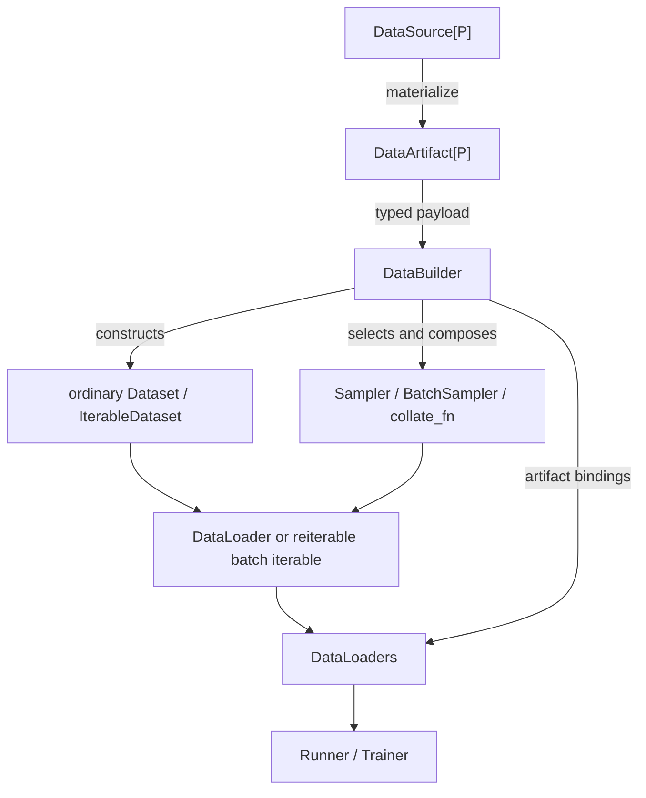

# Data Layer Composition Boundary 原始审查资料

> 本文保存 2026-08-09 文档重构前的完整仓库审查、框架调研、方案比较、
> API 草案和历史迁移记录。它不是当前行为来源。当前行为以
> [`SPEC.md`](../../../../SPEC.md)、[`ARCHITECTURE.md`](../../../../ARCHITECTURE.md) 和公开
> Data 文档为准；future-support 分别由
> [Data recipe extension](../../data-recipe-extension-ergonomics-plan.md)、
> [Streaming data lifecycle](../../streaming-data-lifecycle-support-plan.md) 和
> [Data storage/payload adapter](../../data-storage-and-payload-adapter-support-plan.md)计划负责。

- 文档性质：开发草案；不属于当前公开 API 或正式用户文档
- 状态：Implemented；数据组合边界与统一 schema-v2 artifact producer lifecycle 已闭环
- 高层排期：[根级 Roadmap](../../../../ROADMAP.md)；候选依赖与入口见
  [Development Priority Roadmap](../../development-priority-roadmap.md)。latent image-backed 与
  prepared-backed 以两个 recipe-level Builder 遵循本文边界
- Example scope：本文 Physics/KD 段落保留真实 extension 证据；两项目的支持级别、保留或
  退出不由本审查决定，本轮不修改其项目、测试或公开页面
- 制定日期：2026-07-27
- 审查基线：当前共享工作区中的 data core、AFHQ-v2 showcase、Physics 与
  Knowledge Distillation extension
- 关联资料：
  [DataArtifact lifecycle 实施归档](../data-artifact-producer-lifecycle-refactor/implementation-archive.md)；
  [Artifact Metadata, Provenance and Capacity Model](../../artifact-metadata-provenance-capacity-model-proposal.md)
  保持 Deferred

## 0. Executive Summary

本次审查的核心结论不是“再拆出更多类”，而是先固定四个不同层次的边界：

```text
external data
    |
    v
DataSource -------- acquire / validate / materialize
    |
    v
DataArtifact ------- verified content + stable identity + semantic payload
    |
    v
DataBuilder -------- one configured run's composition root
    |
    +---------------> PyTorch Dataset: one runtime sample view
    |
    +---------------> Sampler / BatchSampler / collate_fn
    |
    +---------------> DataLoader: executable batch iterable
    |
    v
DataLoaders -------- train / validation / test iterables + run evidence
```

最重要的判断如下。

### 0.1 `Dataset` 不应成为 Stochaflow 的唯一 composition root

在 PyTorch 中，`Dataset` 只定义 map-style sample access 或 iterable-style
iteration。它不拥有以下完整策略：

- train / validation / test 的联合构造；
- `Sampler` 或 `BatchSampler`；
- `collate_fn`；
- worker、prefetch、pin-memory 等执行策略；
- `steps_per_epoch`；
- source materialization 与 artifact identity；
- strict resume 的 artifact binding 校验。

因此，在当前 PyTorch runtime 上，把 `Dataset` 称为完整 composition root 会混淆
“sample view”与“run-level data assembly”。

`tf.data.Dataset` 可以成为管线根，是因为 TensorFlow 把 source、map、shuffle、batch、
repeat 和 prefetch 都建模为返回新 `Dataset` 的惰性算子。PyTorch `Dataset` 不是这个
抽象。若 Stochaflow 采用同样模型，实际上是在重新实现一套 dataflow runtime，而不是
简单删除 `DataBuilder`。

### 0.2 `DataBuilder` 有意义，但不能按“每个 Dataset 一个 Builder”理解

`DataBuilder` 的合理粒度是一个可复用的 **runtime data recipe**：

- 它定义接受什么 artifact contract；
- 如何生成 runtime views；
- 如何划分 partitions；
- 如何解释 sample/batch contract；
- 如何组合 sampler、batch sampler、collation 和 loader；
- 如何满足确定性、distributed 与 resume 约束。

它不应与以下对象一一对应：

- 某个 dataset 名称，例如 AFHQ-v2 或 ImageNet；
- 某个 source URL；
- 某个 archive layout；
- 某个具体 `torch.utils.data.Dataset` 类。

AFHQ-v2 和某个 ImageNet-like source 若都能发布为同一个 class-labeled image artifact
contract，并使用相同的 partition、Dataset、augmentation、sampler、loader、resume 和
class-conditioned batch recipe，就应复用同一个 Builder。真实 ImageNet 是否满足这些
条件仍需单独评估，尤其是其 native validation 与常见 shard storage 语义。

### 0.3 自定义 `Dataset` 不总是需要自定义 Builder

必须区分三条路径：

| 场景 | 扩展方式 | 是否新增 Builder |
| --- | --- | --- |
| 新来源，且 artifact contract 与所需 runtime recipe 都匹配现有 Builder | 自定义 `DataSource` | 否 |
| 一次性 Python 实验，用户已直接组合 Dataset/DataLoader | 直接调用 programmatic Trainer API | 否 |
| 新的 sample/batch/partition/streaming/resume 语义 | 自定义 runtime recipe，即 `DataBuilder` | 是，一个 recipe 一个，而非一个 Dataset 类一个 |

如果每次只是新增一个目录、下载地址或同构数据集就要写 Builder，说明 artifact
contract 过窄或 Builder 粒度错误。

如果一个 Dataset 引入了新的 iterator state、batch packing、window sampling、
multi-source coordination 或 collate contract，那么仅重写 Source 确实不够；这不是
Source 拆分失败，而是它已经跨入 runtime recipe 层。

### 0.4 不推荐把所有可组合节点公开成 YAML graph

不建议新增通用的：

- Dataset registry；
- Transform registry；
- Sampler registry；
- Collate registry；
- DataLoader registry；
- 任意节点连接的 YAML data graph。

这种设计看似消除了 Builder，实际上把组合根转移到了 core parser，并迫使 core 维护：

- 节点类型系统；
- 构造参数 schema；
- 兼容性矩阵；
- 生命周期和 state propagation；
- map-style / iterable-style 分支；
- distributed、worker 和 resume 的跨节点规则。

PyTorch 已经提供 Python 级组合机制。Stochaflow 应保留 Python 作为复杂组合语言，只把
稳定的 run-level recipe 注册到配置边界。

### 0.5 当前建议

1. 保留 `DataSource`、`DataArtifact`、`DataBuilder`、`DataLoaders` 四个公共角色。
2. 明确 `DataBuilder` 是“registered data recipe composition root”，不是 Dataset
   factory 的同义词。
3. 保留 family-specific artifact contracts，例如 class-labeled image；新 Source
   只有在满足 contract 时才可复用相应 Builder。
4. 不承诺“任意自定义 Dataset 自动接入任意 Builder”。可组合性必须建立在明确的
   semantic contract 上。
5. 暂不新增新的公共 Dataset adapter registry。AFHQ 是当前已完成的 core-recipe
   验证案例；Physics/KD 只需在各自 extension 内遵守相同 role boundary，不迁入 core。
   ImageNet、第二个 Physics source 与 LLM 属于 future decision gates。
6. AFHQ-v2 只保留 source/materialization 特有代码，并复用通用
   `class_labeled_image` recipe；当前工作区已完成这一验证。
7. Physics 的 trajectory window 和未来 LLM streaming/packing 保持 extension
   Builder。Physics 的外部 `.npy` 输入仍应由 extension-local DataSource 物化为
   DataArtifact；只有第二、第三个真实使用方出现后，才另行提案是否提炼公共 recipe。

## 1. Problem Statement

最初目标是解耦并复用“数据准备”。AFHQ-v2 进一步暴露出：数据层至少包含两类完全不同的
变化轴。

### 1.1 Artifact-time variation

这类变化决定磁盘或远程内容如何被获取、验证和物化：

- 下载协议与 source URL；
- archive 解包；
- checksum 与 source lock；
- 原始文件过滤；
- resize、decode、canonical encoding；
- cache layout；
- artifact manifest；
- source/materialization/content identity。

这些变化应由 `DataSource` 与 artifact lifecycle 拥有。

### 1.2 Runtime-view variation

这类变化决定训练运行时如何读取和组织样本：

- map-style 或 iterable-style；
- train/validation/test view；
- holdout、stratified split、K-fold；
- random crop、flip、tokenization；
- epoch-aware sample randomness；
- sampler、weighted mixture、resolution bucket；
- sequence packing、dynamic batch；
- collate 和 batch contract；
- worker、prefetch、pin-memory；
- distributed sharding；
- iterator state 与 strict resume。

这些变化不能由 Source 拥有。否则 source 将同时承担 artifact I/O 和训练运行时策略，
无法在 evaluation、sampling、不同 batch policy 或不同 model family 之间复用。

### 1.3 真正的问题

因此，本次设计问题不是：

> Source 与 Builder 要不要拆开？

这个边界应继续保留。真正的问题是：

> Source 之后、DataLoader 之前的 Dataset/view/sampler/collation 组合，应该由谁拥有，
> 如何复用，何时需要新的 composition root？

同时还需要回答：

> Stochaflow 是要成为一个 dataflow graph framework，还是继续以 PyTorch object
> composition 为基础，只提供配置可重建的稳定根？

本提案选择后者。

## 2. Current Architecture Review

## 2.1 当前公共边界

### `DataSource`

`src/stochaflow/data/artifacts.py` 中的 `DataSource` 只暴露：

```python
class DataSource[ArtifactPayloadT](ABC):
    @abstractmethod
    def materialize(
        self,
        context: DataSourceContext,
    ) -> DataArtifact[ArtifactPayloadT]:
        ...
```

它的职责描述是“artifact-producing source that never constructs runtime data
loaders”。这是正确方向。

`DataSourceContext` 提供：

- cache root；
- `require` / `ensure` materialization policy；
- `manifest` / `full` verification；
- strict resume 的 expected identity。

### `DataArtifact`

统一的 `DataArtifact` 将以下事实组合为 runtime handle：

- location-independent identity；
- verified manifest；
- `identity.kind` 表达的 managed 或 referenced ownership strategy；
- typed payload。

concrete schema-v2 `DataArtifactIdentity` 覆盖 source、materializer、artifact content
和 manifest digest。managed/referenced producer 共用 `DataArtifactStore` 的 manifest、
inventory、locator、locking、publication、quarantine 与 verification lifecycle。
`DataArtifactBindings` 把 artifact identity 绑定到本次运行的语义 role，并用于 strict
resume。旧 identity、manifest、cache 或 binding 没有 adapter/migration。

### `DataBuilder`

当前 `DataBuilder`：

```python
class DataBuilder(ABC):
    def __init__(self, context: DataBuilderContext) -> None:
        self.context = context

    @abstractmethod
    def build(self) -> DataLoaders:
        ...
```

`data.name` 通过 registry 选择一个 Builder。Builder 收到：

- copied private params；
- experiment seed；
- strict resume flag；
- expected artifact bindings。

### `DataLoaders`

`DataLoaders` 是 runner 与 data layer 之间相对稳定、较窄的返回 contract：

```python
@dataclass(frozen=True, slots=True)
class DataLoaders:
    train: Iterable[Any]
    validation: Iterable[Any] | None = None
    test: Iterable[Any] | None = None
    steps_per_epoch: int | None = None
    artifact_bindings: DataArtifactBindings | None = None
```

它没有强制具体 batch schema，也允许标准 PyTorch DataLoader 以外的可重复 iterable。
这是合理的 interface segregation。

## 2.2 当前内置组合

`src/stochaflow/data/builder.py` 目前包含四个 built-in recipes：

| Builder | Artifact/runtime semantic |
| --- | --- |
| `image` | 单源、普通图像、map-style、standard image batch |
| `class_labeled_image` | class-labeled inventory、分层 validation、class condition batch |
| `super_resolution` | paired 或在线 LR/HR construction |
| `multi_resolution_image` | multi-source、resolution bucket、dynamic batch |

这四个名字中混合了三种维度：

- modality：image；
- sample contract：class-labeled、paired super-resolution；
- batch policy：multi-resolution dynamic batching。

这说明 Builder 实际上已经是 recipe，而不是 source loader。本次变更已在 API、
configuration 和 framework 文档中明确这一点。

## 2.3 当前 image source 与 payload family

当前 image family 定义了：

- `ImageDataSource`；
- `IMAGE_DATA_SOURCES` family registry；
- `ImageFolderArtifactPayload`；
- `ClassLabeledImageFolderArtifactPayload`；
- `PairedImageFolderArtifactPayload`；
- `TorchvisionImageArtifactPayload`；
- `ImageArtifactPayload` closed union。

`ImageSourceFactory` 负责：

- 从 family registry 构造 Source；
- 注入 materialization context；
- 检查 strict resume identity；
- 验证返回的 payload 属于 known union；
- 验证 source identity。

普通 image、super-resolution 和 multi-resolution recipes 再通过
`ImageDatasetFactory` 根据各自支持的 payload 构造 runtime Dataset partitions；
`class_labeled_image` Builder 则直接消费其公开 payload contract。

这个结构已经实现了“Builder 不按 source name 分支”，优于 AFHQ 私有 Builder
直接理解 `afhq-v2.official`。但它仍然是 closed-world：

- 新 payload type 必须修改 `ImageArtifactPayload`；
- `ImageSourceFactory` 必须接受新 type；
- 至少一个 Builder 必须接受该 payload；若复用依赖 `ImageDatasetFactory` 的 recipe，
  该 factory 也必须增加对应 dispatch。

因此，当前能够实现的是：

> 任意新 Source，只要输出某个 Builder 接受的现有标准 payload，并满足该 Builder 的
> 完整 artifact contract，且所需 runtime recipe 语义一致，就能复用该 Builder。

当前不能实现的是：

> 任意新 storage-backed custom Dataset，只通过注册 Source 就自动接入现有 Builder。

后者也不应被无条件承诺，因为 Dataset 可能改变 sample、iteration、batching 和 state
语义。

## 2.4 AFHQ-v2 的迁移说明了什么

AFHQ-v2 原实现自行维护了：

- `AFHQV2DataBuilder`；
- `AFHQV2ClassDataset`；
- `AFHQV2EpochSampler`；
- class batch collate；
- image/loader config；
- source-specific artifact payload。

这些代码中，真正属于 AFHQ 的只有：

- 官方 archive/source lock；
- `cat` / `dog` / `wild` mapping；
- AFHQ prepared artifact contract；
- source acquisition 与 verification；
- AFHQ-specific preparation。

以下逻辑并不属于 AFHQ：

- class-labeled inventory validation；
- stable class-stratified validation split；
- epoch-tagged deterministic shuffle；
- stateless horizontal flip；
- `(images, {"class_label": labels})` collation；
- common DataLoader worker config。

当前工作区把后者移入 framework 的 `class_labeled_image` recipe，并让 AFHQ Source 发布
`ClassLabeledImageFolderArtifactPayload`。这是正确的复用方向，因为：

- AFHQ 不再拥有 Dataset/Sampler/Collate；
- Builder 不再按 AFHQ 名称分支；
- 未来满足相同 artifact contract、且同样需要 derived per-class holdout 的
  ImageNet-like source 可复用同一 recipe；
- validation split 从 source materialization 移到 runtime recipe，不再改变 prepared
  source artifact identity。

但这个成功只证明了：

> AFHQ 与一个通用 class-labeled image recipe 之间存在真实重复。

它不能推出：

> 所有 image Dataset 都应被强制适配为同一个 folder payload。

## 2.5 Physics 与 Knowledge Distillation 揭示的重复

Physics extension 当前自行定义：

- extension-local trajectory DataSource、payload 与 source registry；
- referenced DataArtifact manifest 和 identity projection；
- memory-mapped `TrajectoryTripletDataset`；
- trajectory range validation；
- epoch shuffle sampler；
- worker seeding；
- DataLoader construction；
- loader config parsing；
- train/validation/test range composition。

Knowledge Distillation extension 也自行定义：

- epoch shuffle sampler；
- deterministic in-memory synthetic split generation；
- loader construction；
- config validation。

KD 当前 recipe 没有外部 input artifact，因此不虚构 DataSource 或 artifact binding；
此前 Builder 内部的 optional torchvision acquisition 已删除。未来真实 classification
data 必须使用 extension-owned DataSource/DataArtifact，或复用一个完整兼容的 framework
recipe。

两者证明了一些 framework concern 确实在重复：

- deterministic epoch sampler；
- common worker seeding；
- common loader kwargs；
- steps-per-epoch validation；
- basic map-style loader construction。

但它们尚未证明 Physics trajectory windows、synthetic classification 和 LLM corpus
能共享同一个 public sampler/loader contract，更没有证明它们需要公共 Dataset
abstraction。当前只要求各 extension 遵守 Source/Artifact/Builder boundary；局部重复
保持私有，直到第二、第三个语义相同的真实使用方出现。

## 2.6 当前实现的优点

以下设计应保留：

1. Source 不返回 DataLoader。
2. Artifact identity 与 runtime Dataset object 分离。
3. strict resume 在 Builder 已知完整 binding set 时验证。
4. Runner 只消费 structured `Any` batches，不理解 modality。
5. DataLoaders 接受普通 Iterable，而不是强制某个 dataset base class。
6. Builder 使用 registry 作为配置与 Python composition 的边界。
7. Built-in 与 extension Builder 走同一 registry/factory 路径。

## 2.7 本次审查暴露的问题及当前状态

### 问题 A：`DataBuilder` 名称与文档容易暗示“一种 Dataset 一个 Builder”（已修正）

此前文档常以 `image`、`super_resolution`、`class_labeled_image` 介绍 Builder，容易
让用户把它理解为 Dataset factory。

当前正式文档已统一改为：

> `DataBuilder` 是 registered runtime data recipe 的 composition root。

而不是：

> 创建某个 Dataset 的 builder。

### 问题 B：Source-only extension 的兼容范围没有被显式定义（实现已收紧，文档待统一）

此前“新的兼容数据集只需实现 ImageDataSource”这句话缺少关键限定：

> 它必须发布 Builder 已声明接受的 artifact payload contract。

如果新数据在 LMDB、WebDataset shards、Arrow、Zarr 或远程 stream 中，并且不适合
materialize 为现有 payload，那么 Source-only 路径不成立。

当前 `configuration/data-pipeline.md` 已记录 `class_labeled_image` 接受的 payload 和
native-validation 限制；实现也以公开 payload type 和显式 runtime constraints 做
fail-closed 校验。但其他 framework/extension 文档仍可能把条件简写为“兼容 payload”或
“只有不同 batch lifecycle 才需要 Builder”，这会遗漏 partition、transform、sampler 和
resume 语义。正式文档需要统一为两层兼容条件：

1. artifact 满足 Builder 声明的完整 accepted contract；
2. 用户需要的 runtime recipe 语义与该 Builder 一致。

### 问题 C：artifact payload 有时混入 runtime view 决策

payload 中的官方 train/test partitions 属于 source fact；但 experiment-specific
validation holdout、crop、augmentation、sampling weight 和 batch policy 不应进入
artifact。

AFHQ 原本把 `validation_per_class` 放入 materialization recipe，导致相同 prepared
content 因训练划分策略变化而产生不同 artifact。当前迁移已修复这一问题。

需要形成统一规则：

- upstream/native split 可进入 artifact payload；
- run-specific derived split 属于 Builder recipe；
- derived split identity 应由 resolved config + artifact identity 重建；
- 除非派生结果被独立发布，否则它不是新的 managed artifact。

### 问题 D：closed payload union 阻碍新的 storage representation

`ImageArtifactPayload` 与 `ImageDatasetFactory` 目前依赖具体类型集合。这个 closed set
适合小规模 built-in，但不应被宣传为所有 image extension 的开放接口。

短期可接受的边界是：

- built-in recipe 只承诺支持文档列出的 payload contracts；
- extension 可复用其中之一；
- 不兼容 representation 使用自己的 recipe。

长期若多个外部 representation 具有完全相同的 sample contract，才考虑 family-local
adapter capability。

### 问题 E：Dataset 与 epoch-aware sampler 存在私有索引协议

`ClassLabeledImageDataset` 接受 `int | tuple[int, int]`，由
`EpochTaggedIndexSampler` 把 epoch 传入 Dataset，以支持 persistent worker 下的无状态
增强。

这是有效实现，但它说明 Dataset 与 Sampler 并非任意可组合：

- 普通 Sampler 只产生 `int`；
- tagged Sampler 产生 tuple；
- Dataset 必须理解 tuple；
- batch sampler 也必须保持该 index contract。

因此“把所有 Dataset 和 Sampler 分别注册，用户任意拼装”会产生大量非法组合。
兼容性应由 recipe root 在 Python 中保证。

### 问题 F：direct Python 与 config-driven workflow 的差异未被讲清

`Trainer.fit()` 已经接受任意 `Iterable[Batch]`。纯 Python 用户可以直接传入自己的
DataLoader，不需要注册 Builder。

Builder 是 CLI/YAML workflow 的重建边界，不是使用 Stochaflow Trainer 的绝对前提。
这个事实能消除大量“每个 Dataset 都要写 Builder”的焦虑，应在文档中明确。

## 3. What Mature Frameworks Actually Do

成熟框架并没有收敛到一个万能 abstraction。它们的差异来自 runtime model 和产品目标。

## 3.1 PyTorch：mechanism separation，没有强制 composition root

PyTorch 的核心角色是：

```text
Dataset / IterableDataset
       + Sampler / BatchSampler
       + collate_fn
       + worker/loading options
       = DataLoader
```

官方文档将 `DataLoader` 描述为组合 Dataset 与 Sampler 的 iterable，并由
`batch_size`、`drop_last`、`batch_sampler`、`collate_fn` 等决定 batching。

用户自定义 Dataset 时，通常只实现：

```python
class MyDataset(Dataset[Sample]):
    def __len__(self) -> int: ...
    def __getitem__(self, index: int) -> Sample: ...

dataset = MyDataset(...)
loader = DataLoader(
    dataset,
    sampler=MySampler(dataset),
    collate_fn=my_collate,
)
```

PyTorch 不要求一个对应 Builder，因为：

- 它不提供 Stochaflow 式 YAML registry；
- Python 调用点本身就是 composition root；
- 它不负责 artifact identity、strict resume 或跨 split bundle。

对 Stochaflow 的启示：

1. 不应重新注册 PyTorch 已提供的所有节点；
2. 自定义 Dataset 的 programmatic path 应保持直接；
3. 配置驱动 workflow 仍需要一个 Python composition root。

官方参考：

- [PyTorch `torch.utils.data`](https://docs.pytorch.org/docs/stable/data.html)
- [PyTorch custom Dataset tutorial](https://docs.pytorch.org/tutorials/beginner/basics/data_tutorial.html)

## 3.2 Hugging Face Datasets：Builder 属于 materialization，不属于训练 Loader

Hugging Face 的 `DatasetBuilder` / `GeneratorBasedBuilder` 主要负责：

- dataset metadata 与 Features；
- download manager；
- source split generation；
- example generation；
- Arrow materialization 与 cache。

生成后的 `Dataset` 或 `IterableDataset` 再进行 `map`、`filter`、`shuffle`、format 等
操作，并可直接交给 PyTorch `DataLoader`。

另外，对 CSV、JSON、Parquet、ImageFolder 等常见格式，用户通常无需编写 dataset
loading script；通用 format builder 已覆盖这些场景。

因此 Hugging Face 的 `DatasetBuilder` 更接近：

```text
Stochaflow DataSource + materializer + DatasetMetadata
```

而不是 Stochaflow 当前的 runtime `DataBuilder`。

这也解释了命名歧义：两个框架都使用 Builder，但生命周期不同。

对 Stochaflow 的启示：

1. source acquisition/materialization 应保持独立；
2. 标准 artifact contract 可以像 Arrow 一样吸收大量 source 差异；
3. 不能因为 HF 有 DatasetBuilder 就让 Stochaflow runtime Builder 重新接管下载；
4. 对通用格式优先提供共享 Source/materializer，而非每个 dataset 一个类。

官方参考：

- [Hugging Face dataset loading scripts](https://huggingface.co/docs/datasets/main/dataset_script)
- [Hugging Face create a dataset](https://huggingface.co/docs/datasets/main/create_dataset)
- [Hugging Face use with PyTorch](https://huggingface.co/docs/datasets/main/use_with_pytorch)

## 3.3 TensorFlow `tf.data`：Dataset 本身就是惰性 pipeline

TensorFlow 明确定义两种 Dataset creation：

- data source 创建 Dataset；
- transformation 从一个或多个 Dataset 创建新 Dataset。

`map`、`shuffle`、`batch`、`repeat`、`prefetch` 都返回新的 Dataset，因此下面的对象已经
包含完整 iteration pipeline：

```python
dataset = (
    source
    .map(transform)
    .shuffle(buffer_size)
    .batch(batch_size)
    .prefetch(tf.data.AUTOTUNE)
)
```

在这个模型中，Dataset 可以被称为 composition root，因为 batching 和 execution
operators 已经进入 Dataset graph。

对 Stochaflow 的启示不是“也把 PyTorch Dataset 叫作 root”，而是：

- 若要采用该模型，需要定义自己的 operator graph、state 与 optimization runtime；
- 这会显著扩大 framework scope；
- 当前没有足够证据证明需要复制 `tf.data`。

官方参考：

- [TensorFlow `tf.data` guide](https://www.tensorflow.org/guide/data)
- [TensorFlow input pipeline performance](https://www.tensorflow.org/guide/data_performance)

## 3.4 Lightning DataModule：run-level composition root

Lightning 的 `DataModule` 封装：

- download/process；
- Dataset setup；
- transforms；
- train/validation/test/predict DataLoader；
- optional state and teardown。

它最接近 Stochaflow `DataBuilder` 的用户体验：一个可共享对象拥有完整 data recipe，
Trainer 消费它产生的 loaders。

但 Lightning 把 preparation 与 runtime setup 放在同一生命周期对象中。Stochaflow 已经
有 content-addressed artifact、materialization policy 和 strict resume，因此不应简单
照搬 `prepare_data()`。

对 Stochaflow 的启示：

1. run-level composition root 是成熟且合理的模式；
2. root 应按可共享 recipe 组织，而不应与每个 Dataset 类一一对应；
3. Stochaflow 应保留更严格的 Source/Artifact 分离。

官方参考：

- [LightningDataModule](https://lightning.ai/docs/pytorch/stable/data/datamodule.html)

## 3.5 TorchData 的经验：谨慎建设 universal graph

TorchData 曾提供 DataPipes 与 DataLoader2，后来将开发方向转回对
`torch.utils.data.DataLoader` 的迭代增强，并移除了旧 DataPipes/DataLoader2 路线。

这不能证明所有 data graph 都是错误的，但它是一个重要工程信号：

- universal data graph 的 API surface 很大；
- source、shuffle、sharding、multiprocessing、state 和 checkpoint 会彼此耦合；
- 抽象稳定成本远高于“将几个节点注册到 YAML”。

Stochaflow 当前不应在只有少量 examples 的阶段建设通用 data graph。

官方参考：

- [TorchData nodes status and migration note](https://docs.pytorch.org/data/0.11/getting_started_with_torchdata_nodes.html)

## 3.6 Comparative Summary

| Framework | Preparation root | Runtime composition | Custom Dataset 是否要求额外 root |
| --- | --- | --- | --- |
| PyTorch | 无统一 root | Python 调用点 + DataLoader | 否 |
| Hugging Face Datasets | DatasetBuilder | Dataset transforms + downstream loader | 通常否；复杂 materialization 才写 script |
| TensorFlow `tf.data` | Dataset source operator | Dataset transformation graph | Dataset 本身就是 graph |
| Lightning | DataModule 可同时负责 prepare/setup | DataModule 返回 loaders | 常见做法是一个共享 DataModule |
| Stochaflow 推荐 | DataSource + DataArtifact | registered DataBuilder recipe | 只在 config-driven 新 recipe 时需要 |

## 4. Proposed Boundary Model

## 4.1 Artifact 不是 Dataset

`DataArtifact` 表示经过验证、具有稳定 identity 的内容。它应该回答：

- 内容是什么；
- 来自哪里；
- 如何物化；
- manifest/content digest 是什么；
- ownership 是 managed 还是 referenced；
- 提供哪些稳定、可验证的语义 payload。

它不应该拥有：

- epoch；
- shuffle order；
- random augmentation；
- batch size；
- worker count；
- distributed rank；
- iterator cursor。

## 4.2 Dataset 是 runtime view

PyTorch `Dataset` 或 `IterableDataset` 表示对 artifact 或外部流的某个运行时视图。

它可以拥有：

- sample decoding；
- sample-level transform；
- window construction；
- tokenization view；
- lazy random access；
- iterable source traversal。

它不自动成为：

- artifact identity；
- train/validation/test bundle；
- sampler；
- batch policy；
- CLI configuration root。

Dataset object 通常不可稳定序列化，也不应写进 checkpoint 或 run manifest。

## 4.3 Sampler 和 BatchSampler 是 order/batch-index policy

Sampler 的 contract 不只是“可插拔组件”。它与 Dataset index space 存在语义耦合：

- index 是 `int`、tuple 还是 structured key；
- length 是否有限；
- epoch 是否可设置；
- distributed rank 如何参与；
- sample weight/bucket/source id 是否可查询；
- resume 时需要重建还是恢复 cursor。

因此，Sampler 可以复用，但必须由知道 Dataset contract 的 recipe 组合。

## 4.4 `collate_fn` 定义 batch contract

`collate_fn` 是 Dataset sample contract 与 TrainingStrategy batch contract 的边界。

例如：

```text
Dataset sample:
    (image_tensor, class_label)

collate:
    (images, {"class_label": labels})

TrainingStrategy:
    interprets images and class_label
```

更换 collate 可能改变模型可见的 batch schema，即使 Dataset 完全相同。因此 collate
不是纯 DataLoader tuning 参数，也不能在不了解 recipe 的情况下任意全局注册组合。

## 4.5 DataLoader 是 execution adapter

DataLoader 组合：

- Dataset/IterableDataset；
- index/batching policy；
- collation；
- multiprocessing；
- prefetch；
- pin-memory；
- worker seeds。

它是可迭代执行对象，但不表示一个完整 experiment data definition，因为一个运行可能有
多个 loaders 和 artifact bindings。

## 4.6 DataBuilder 是 run-level data recipe composition root

建议给 `DataBuilder` 的架构定义固定为：

> A registered Python composition root that validates one runtime data recipe,
> materializes and binds compatible artifacts, constructs ordinary Dataset
> views, and returns ready train/validation/test iterables.

Builder 的 primary reason to change 应是：

> runtime data recipe 的 sample、partition、ordering、batching 或 state contract
> 改变。

而不是：

> 增加一个同构 dataset/source。

## 4.7 DataLoaders 是 assembled runtime product

建议保持 `DataLoaders` narrow contract，不向其中增加：

- universal dataset schema；
- arbitrary transform graph；
- sampler config；
- source implementation objects。

未来 artifact descriptor 和 execution provenance 可作为相邻的 immutable evidence
扩展，但不能让 `DataLoaders` 变成新的万能 metadata container。

## 5. Extension Decision Matrix

## 5.1 只需要新的 DataSource

满足以下全部条件时，只实现新的 Source：

1. 新数据可以发布为某个现有 Builder 接受的 artifact payload；
2. payload 中的 source/native split 与 sample inventory 能被认证；
3. runtime sample contract 不变；
4. partition、augmentation、sampler、collate 和 loader recipe 不变；
5. strict resume 可以仅凭 artifact identity 与 resolved recipe config 重建。

例子：

- AFHQ-v2 与另一个没有 native validation、需要 derived per-class holdout 的
  class-labeled image corpus；
- 另一个镜像 URL 或对象存储下载器发布同样的 artifact；
- 自定义 archive layout 在 materialization 后归一化为相同 contract。

```python
@IMAGE_DATA_SOURCES.register("my-project.animals")
class AnimalsSource(ImageDataSource):
    def materialize(
        self,
        context: DataSourceContext,
    ) -> DataArtifact[ClassLabeledImageFolderArtifactPayload]:
        ...
```

配置继续选择共享 recipe：

```yaml
data:
  name: class_labeled_image
  params:
    source:
      name: my-project.animals
      params: {...}
      materialization: {...}
    partition: {...}
    image: {...}
    loader: {...}
```

这里没有 dataset-name-specific Builder。真实 ImageNet 通常带 native validation，当前
`class_labeled_image` recipe 会拒绝它；除非明确选择一个满足现有 contract 的数据
profile，否则应使用或新增支持 official validation 的 recipe，不能仅因 payload class
相同就声称兼容。

## 5.2 直接声明 Python 组合，不需要 Builder

对于 notebook、library integration 或 programmatic training，用户可以直接使用
PyTorch：

```python
dataset = MyDataset(...)
loader = DataLoader(
    dataset,
    sampler=MySampler(dataset),
    collate_fn=my_collate,
)

trainer.fit(
    loader,
    num_epochs=10,
    validation_dataloader=validation_loader,
)
```

这条路径的优点：

- 零 registry boilerplate；
- 完整 Python 可组合性；
- 适合探索和 one-off integration。

代价：

- 不自动获得 YAML/CLI 重建；
- 不自动产生完整 artifact bindings；
- 用户自己负责 resolved config 与 provenance；
- strict resume 只能覆盖 Trainer 已知状态，不能声称重建了数据 composition。

未来如果需要“programmatic run context”，应单独设计，而不是用 universal Dataset
registry 解决。

## 5.3 需要新的 DataBuilder recipe

出现以下任一变化时，应创建新 recipe：

- sample schema 改变；
- collated batch schema 改变；
- map-style 与 streaming/iterable-style 生命周期不同；
- partition policy 需要新的 domain facts；
- sampler 需要新 index contract；
- batch packing、bucketing 或 dynamic batch policy 改变；
- 多 source coordination 改变；
- distributed sharding ownership 改变；
- iterator state 或 mid-epoch resume contract 改变；
- Dataset 必须与特殊 storage/session lifecycle 协作；
- existing Builder 无法在不增加 modality-specific optional fields 的情况下支持它。

例如 Physics：

```python
@REGISTRIES.data_builders.register("physics.trajectory_windows")
class TrajectoryWindowDataBuilder(DataBuilder):
    def build(self) -> DataLoaders:
        artifact = ...
        train = TrajectoryWindowDataset(
            artifact,
            window=3,
            range=self.config.train_range,
        )
        loader = DataLoader(
            train,
            sampler=EpochShuffleSampler(train, seed=self.context.seed),
            collate_fn=physics_collate,
        )
        return DataLoaders(
            train=loader,
            artifact_bindings=...,
        )
```

这个 Builder 可以服务：

- Kolmogorov trajectories；
- 另一个相同 field/window contract 的 physics dataset；
- synthetic 或 recorded trajectory sources。

它不是 `TrajectoryWindowDataset` 类的一对一 wrapper。

## 5.4 何时把 extension Builder 提升为 core recipe

建议使用以下 gate：

1. 至少两个独立 source 或 example 需要相同 sample/batch contract；
2. 至少一个实现来自不同项目或 modality variant，证明不是名称重合；
3. 共享后不要求 core 增加 source-name/concrete-class 分支；
4. config fields 对所有实现都有相同语义；
5. resume 与 distributed contract 可以一致描述；
6. 提升后能够删除真实重复代码，而非只增加 wrapper。

满足 gate 后才进入 core。

## 6. Options Considered

## 6.1 Option A：每个 Dataset 注册一个 Builder

### 形式

```text
MyDataset -> MyDatasetBuilder -> DataLoaders
OtherDataset -> OtherDatasetBuilder -> DataLoaders
```

### 优点

- 实现直接；
- 配置边界明确；
- 每个 extension 完全控制组合。

### 问题

- source、dataset、recipe 三个变化轴被压成一个类；
- 重复 loader parsing、sampler、collate、split；
- 同构数据集无法复用；
- 用户会正确地质疑 Builder 的存在价值。

### 结论

拒绝作为设计原则。只允许在 extension 初期作为局部实现；一旦重复出现，应提炼 recipe。

## 6.2 Option B：Dataset 作为 root，core 自动创建 DataLoader

### 形式

```python
DatasetBundle(
    train=dataset,
    validation=dataset,
    test=dataset,
)
```

core 根据通用 loader config 创建 DataLoader。

### 优点

- 简单 map-style workload 很方便；
- 自定义 Dataset 看似无需 Builder；
- common loader 参数可统一。

### 问题

- custom Sampler、BatchSampler、collate 仍需要插槽；
- iterable dataset 与 map-style 行为不同；
- dynamic batch、packing、bucket、multi-source mixture 无法由通用 loader config 表达；
- epoch propagation 和 distributed sharding 需要 core 分支；
- 最终会演化成 universal data graph。

### 结论

不作为唯一 public path。可以保留私有 helper 为简单 built-in recipe 减少重复，但不改变
composition root。

## 6.3 Option C：注册 Source、Dataset、Transform、Sampler、Collate、Loader

### 形式

```yaml
data:
  source: ...
  dataset: ...
  transforms: [...]
  sampler: ...
  collate: ...
  loader: ...
```

### 优点

- 表面上最“可组合”；
- 每个节点可单独选择；
- YAML 看起来声明式。

### 问题

- 需要全局兼容性 schema；
- 构造顺序和依赖注入复杂；
- stateful components 的 lifecycle 不清晰；
- arbitrary batch types 难以静态验证；
- private constructor params 被迫成为 framework schema；
- third-party PyTorch namespace 会被镜像进 registry；
- error 由清晰的 Builder validation 退化为运行时深层错误；
- core parser 成为真正的巨型 Builder。

### 结论

拒绝。复杂组合留在 Python。

## 6.4 Option D：采用 Lightning-style DataModule

### 形式

一个对象拥有 prepare/setup/train_dataloader/val_dataloader 等 lifecycle hooks。

### 优点

- 概念成熟；
- 多 stage 生命周期清晰；
- 用户熟悉；
- 容易共享。

### 问题

- `prepare_data` 与现有 DataSource/Artifact lifecycle 重叠；
- distributed rank semantics 与 content-addressed publication 可能冲突；
- hook surface 比当前需求大；
- rename 不会自动解决 recipe 粒度问题。

### 结论

不照搬 lifecycle。可以借鉴“一个共享 data recipe root”的语义。短期保留
`DataBuilder` 名称以避免无收益破坏性迁移。

## 6.5 Option E：Artifact contract + registered runtime recipe

### 形式

```text
many Sources
    -> one semantic Artifact contract
    -> one reusable DataBuilder recipe
    -> many runtime Dataset instances/loaders
```

### 优点

- Source 与 runtime 变化轴分离；
- config workflow 可重建；
- Python 保留完整表达力；
- strict resume 有明确验证边界；
- 不要求每个 Dataset 类一个 Builder；
- 可以渐进提炼真实重复。

### 问题

- artifact contract 设计需要谨慎；
- 不兼容 storage/runtime semantics 仍需新 recipe；
- 用户需要理解三条扩展路径。

### 结论

推荐。

## 6.6 Option F：新增 Artifact-to-Dataset Adapter registry

### 形式

```text
DataArtifact payload
    -> registered DatasetAdapter
    -> Dataset partitions
```

### 潜在价值

- 新 storage representation 可接入现有 recipe；
- `ImageDatasetFactory` 不再是 closed-world concrete dispatch；
- Source 无需构造 Dataset。

### 主要风险

- adapter 本质上接近 Dataset factory registry；
- 如何按 payload type、artifact type 或 config name 选择会引入新的 name dispatch；
- adapter 与 recipe transform/partition 的职责可能重叠；
- streaming adapter 不一定能满足 map-style recipe；
- compatibility 仍需 Builder validation。

### 结论

暂缓公开。

只有在出现至少两个真实外部 payload representation，且它们共享完全相同的 runtime
sample contract，但都无法合理归一化为现有 artifact contract 时，再设计
family-local、narrow adapter capability。

首版不得创建 universal adapter registry。

## 7. Recommended Architecture

## 7.1 Stable public roles

建议稳定以下角色：



### `DataSource[P]`

- artifact-producing extension entrypoint；
- family-specific source registries 可保留；
- 不构建 Dataset、Sampler、Collate 或 DataLoader。

### `DataArtifact[P]`

- verified content handle；
- identity 与 payload 分离；
- payload contract 是 Source 与 Builder 的 compatibility boundary。

### `DataBuilder`

- registered run-level recipe root；
- 完整组合由 Python 表达；
- 可以构造任意数量和类型的 Dataset；
- 可以直接返回非 PyTorch DataLoader 的 reiterable batch iterable；
- 负责完整 artifact binding validation。

### `DataLoaders`

- runner-facing assembled product；
- train 必填，validation/test 可选；
- unknown-length stream 使用 explicit steps；
- batch 保持 structured `Any`。

## 7.2 不新增公共 universal node contracts

Phase 1 不新增：

- `DatasetSpec`；
- `SamplerSpec`；
- `TransformSpec`；
- `CollateSpec`；
- `DataGraph`；
- global adapter registry。

内置 recipes 可继续使用私有 dataclasses、protocols 和 helpers。

## 7.3 用 semantic artifact contract 定义兼容性

Builder 应公开记录“接受什么”，而不是只依赖实现内的偶然 `isinstance`。

例如 class-labeled image recipe 的 contract 包括：

- finite authenticated train inventory；
- 当前 recipe 要求不提供 native validation，test 可选；
- contiguous class mapping；
- stable sample identity；
- readable verified image content；
- width/height facts；
- map-style random access。

它不包括：

- AFHQ、ImageNet 等 dataset name；
- source URL；
- archive format；
- experiment validation split；
- augmentation；
- batch size。

当前 Python type 可以继续是
`ClassLabeledImageFolderArtifactPayload`，但文档应明确其语义和 storage 限制。

## 7.4 Builder naming guideline

Builder registry name 应描述 recipe，不描述 source：

推荐：

```text
class_labeled_image
paired_super_resolution
multi_resolution_image
physics.trajectory_windows
llm.packed_causal_tokens
```

不推荐：

```text
afhq-v2
imagenet
my-folder
my-dataset-class
```

若 recipe 确实只适用于一个项目，也应描述其语义，例如：

```text
my-project.paired-sensor-window
```

而不是复用 dataset display name。

## 7.5 Reuse hierarchy

建议按以下顺序寻找复用：

1. 复用 PyTorch 原生 primitives；
2. 复用 core 的小型 private/public mechanism helpers；
3. 复用已有 semantic artifact contract；
4. 复用已有 registered recipe；
5. extension 内写一个新 recipe；
6. 在多个真实使用方出现后把 recipe 提升到 core；
7. 最后才考虑新增公共 adapter 或 graph abstraction。

## 7.6 Common helpers 与 public abstractions 的区别

以下重复可以直接提取 helper，而不创建 registry：

- deterministic worker seed；
- epoch-derived permutation；
- common map-style DataLoader kwargs；
- explicit steps validation；
- artifact binding construction；
- safe config mapping parsing。

helper 不需要成为用户可选择的 component。它只减少实现重复。

只有当用户需要独立替换一个策略，且多个 recipe 都依赖同一稳定 contract 时，才考虑
public capability protocol。

## 8. Minimal API Position

## 8.1 保持当前根接口

最小接口继续为：

```python
class DataBuilder(ABC):
    def __init__(self, context: DataBuilderContext) -> None:
        self.context = context

    @abstractmethod
    def build(self) -> DataLoaders:
        ...
```

这已经足以表达：

- simple map-style；
- streaming；
- multi-source；
- custom sampler；
- arbitrary collate；
- unknown epoch length；
- artifact-aware strict resume。

首版不需要增加 `setup()`、`prepare()`、`teardown()` 等 hook。

## 8.2 文档层引入“Data recipe”术语，不立即新增同名类型

建议：

- `DataBuilder`：现有 public type；
- data recipe：它所拥有的 architecture role；
- `data.name`：选择 registered recipe；
- Builder class：recipe 的 Python composition implementation。

如果未来名称仍持续误导，可在 major-version 设计中评估 `DataRecipeBuilder` 或
`DataModule`，但当前 rename 不解决任何实质边界。

## 8.3 可选的未来 function registration

如果大量简单 extension 只有以下 boilerplate：

```python
class MyBuilder(DataBuilder):
    def build(self) -> DataLoaders:
        return build_my_data(self.context)
```

未来可评估 registry 对 function factory 的支持：

```python
@register_data_recipe("my-project.simple")
def build_my_data(context: DataBuilderContext) -> DataLoaders:
    ...
```

这只减少 class boilerplate，不改变 composition model。必须等真实重复出现后再决定，
Phase 1 不实现。

## 8.4 不让 core 自动解释 Dataset

不建议新增：

```python
artifact.dataset
artifact.sampler
artifact.dataloader
```

原因：

- artifact 是可持久化内容事实；
- Dataset 是 ephemeral runtime view；
- sampler/collate 是 run recipe；
- 把它们挂到 artifact 会重新耦合 preparation 与 training。

## 9. Custom Dataset Scenarios

## 9.1 自定义图像来源，sample contract 不变

例如用户有一个私有 tar archive，但准备后可以发布为不含 native validation 的标准
class-labeled inventory，并且实验也需要当前 recipe 的 derived per-class holdout。

边界：

```text
custom archive logic -> custom DataSource
class-labeled payload -> existing core contract
Dataset/Sampler/Collate -> existing class_labeled_image recipe
```

不写 Builder。

## 9.2 自定义 LMDB image Dataset

需要先判断 LMDB 是 source representation 还是 runtime requirement。

### 情况 A：可以在 materialization 时归一化

如果可以合理地将 LMDB 索引/内容转换为 framework 已支持的 managed artifact contract，
并且所需 runtime recipe 语义也与现有 Builder 一致，则：

- Source 读取/验证 LMDB；
- materialize 标准 artifact；
- 复用现有 Builder。

### 情况 B：必须保持 LMDB lazy access

如果数据规模或性能要求决定 runtime 必须直接使用 LMDB：

- 现有 folder payload contract 不兼容；
- Source 仍只发布 verified LMDB artifact payload；
- 一个 LMDB-aware image recipe 构造 Dataset 和 worker-local sessions；
- 若多个 image recipes 复用该 access pattern，再评估 family-local adapter。

此时写 recipe 是合理的，因为 worker/session lifecycle 不只是 source download 差异。

## 9.3 自定义 Physics Dataset

如果 Dataset 把 `[trajectory, time, height, width]` 变成三帧窗口，它改变了 sample
semantics。Source 只负责验证/物化 trajectory array；window size、range、stride、
sampling 与 batch contract 属于 recipe。

一个 `trajectory_windows` Builder 可以构造多个 Dataset views，不需要每个物理数据集
各写一个 Builder。

## 9.4 自定义 LLM streaming Dataset

LLM streaming 通常涉及：

- shard discovery；
- remote retries；
- rank/worker sharding；
- shuffle buffer；
- tokenizer version；
- document concatenation；
- sequence packing；
- dynamic padding；
- iterator cursor；
- mid-epoch resume。

这些语义不可能仅通过一个通用 Source 与 map-style image Builder 复用。

建议最初使用 extension recipe，例如 `llm.packed_causal_tokens`。Source 负责稳定 shard
manifest 与 provenance；Builder 负责 stream、tokenize、pack、batch 和 resume contract。

只有多个 LLM examples 证明 packing/streaming contract 相同后，才将其提升为 core。

## 9.5 自定义 Dataset 只为调试

例如：

```python
class TinyDataset(Dataset[Any]): ...
```

用户应直接创建 DataLoader 并调用 Trainer。为了让一个十行调试 Dataset 进入 YAML 而
新增 framework abstraction 是过度设计。

## 10. Artifact Metadata, Provenance and Capacity Boundary

数据 composition 讨论不应把 metadata/capacity 再塞进 Dataset。

## 10.1 Artifact metadata/provenance

以下信息可能属于未来的 DataArtifact 相邻描述证据：

- dataset identity；
- source provenance；
- checksum/version；
- native schema；
- native split statistics；
- materialization transformations；
- storage footprint。

当前不引入 descriptor。已实施的 schema-v2 manifest `domain` 只保存 producer 加载和
验证 typed payload 所需的事实，不是通用 metadata/provenance bag。关联的
[Artifact Metadata, Provenance and Capacity Model](../../artifact-metadata-provenance-capacity-model-proposal.md)
保持 Deferred，等待多个真实 consumer 证明最小公共契约；这些信息也不应由 Dataset
class 自行定义属性。

## 10.2 Runtime recipe/config

以下信息属于 resolved run configuration / execution record：

- derived validation split；
- augmentation policy；
- sampler；
- batch size；
- worker/prefetch；
- sequence packing；
- experiment seed；
- distributed world size；
- effective steps。

这些配置可以与 input artifact identities 一起记录，从而重建 Dataset/DataLoader
composition，但不改变 source artifact identity。

## 10.3 Capacity

Capacity 需要继续分成：

- artifact footprint：sample count、storage bytes、native dimensions；
- workload estimate：预计 host/GPU memory、I/O、compute；
- runtime observation：特定机器和配置下的实测 peak/throughput。

它不应成为 `Dataset.capacity` 的单一字典。相同 artifact 使用不同 resolution、packing、
batch size、workers 或 model 时，资源需求完全不同。

## 11. Integration with Existing Architecture

## 11.1 Core module

当前工作已经完成边界澄清与一致性闭环，且没有引入新 graph。

已实施：

- 保持 `artifacts.py` 的 Source/Artifact contracts，并将 identity/runtime handle 统一为
  schema-v2 `DataArtifactIdentity` / `DataArtifact`；
- 以 `DataArtifactStore` 统一 managed/referenced producer lifecycle；
- 保持 `builder.py` 的 composition root；
- 保持 `dataloaders.py` 的 narrow output；
- 保持现有 recipe-private loader/sampler mechanism；除非未来出现语义相同的独立
  使用方，否则不提升为公共 helper；
- 为每个 built-in Builder 文档化 accepted artifact contract 和 batch contract；
- 检查 artifact payload 是否混入 run-specific policy；
- 不读取或迁移旧 artifact cache、manifest、identity 与 checkpoint binding。

## 11.2 Public API

短期不需要新增 public base class。

应明确公开：

- `DataSource` / `DataSourceContext`；
- relevant family-specific Source contract；
- `DataArtifact` 与 identities；
- `DataBuilder` / `DataBuilderContext`；
- `DataLoaders`；
- extension registry。

内部 Dataset、sampler 与 collate 是否公开，应由实际 reuse 需求决定；公开 helper 不等于
注册为配置 component。

## 11.3 Registry

保留：

- `REGISTRIES.data_builders`；
- justified family-specific DataSource registries。

不新增：

- global Dataset registry；
- global Sampler registry；
- global Transform registry；
- global Collate registry；
- global DataLoader registry。

Builder registry name 表示完整 recipe compatibility boundary。

## 11.4 Serialization

序列化：

- resolved Builder config；
- source/materialization config；
- schema-v2 artifact bindings；
- explicit state for recipes that support iterator-state resume。

future artifact descriptor 与 execution record 当前不序列化；相关提案保持 Deferred。

不序列化：

- Dataset Python object；
- DataLoader worker object；
- arbitrary callable；
- registry constructor graph。

## 11.5 CLI

CLI 继续使用：

```yaml
data:
  name: <registered recipe>
  params: <recipe-owned config>
```

Core 不解析 params 内的通用 Dataset/Sampler graph。具体 recipe 自己验证 private params。

可以在文档和 error message 中将 `data.name` 描述为 recipe selection，而非 Dataset
selection。

## 11.6 AFHQ-v2

当前结构：

```text
AFHQ-v2 extension
    |
    +-- source lock / acquisition / preparation
    +-- AFHQ DataSource
    +-- standard class-labeled artifact payload

Stochaflow core
    |
    +-- class_labeled_image recipe
        +-- derived validation split
        +-- Dataset view
        +-- deterministic augmentation
        +-- epoch sampler
        +-- collate
        +-- DataLoader
```

AFHQ extension 不再维护 private Builder、Dataset、Sampler、Collate 和 duplicate loader
config。

## 11.7 Physics

Physics 继续作为 extension capability 展示，并在 extension 内遵守同一数据边界：

- extension-local DataSource 验证外部 `.npy` 并返回带 identity 的 referenced
  DataArtifact；
- `KolmogorovDataBuilder` 绑定 artifact identity，再拥有 trajectory ranges、Dataset、
  sampler 与 loader 组合；
- 不因为它与 image recipe 都出现 epoch shuffle 或 worker seeding，就假定两者拥有同一
  公共契约；
- 第二个 physics source 或第二个相同 trajectory-window recipe 出现后，再判断是否值得
  提升公共 payload、recipe 或窄 helper。

## 11.8 LLM

不要提前在 core 添加 tokenizer、packing、shuffle buffer 等通用 fields。

首个 LLM example 应在 extension 中实现完整 recipe，并明确：

- artifact/shard contract；
- tokenizer provenance；
- stream sharding；
- batch packing；
- iterator-state resume。

第二个 LLM example 再用于发现真实重复。

## 12. Migration Plan

## Phase 0：记录边界，冻结扩张

- 接受本提案的 role definitions；
- 在设计评审期间不新增 universal data registries；
- 不再用 dataset 名称随意创建 core Builder；
- 明确当前工作区 AFHQ migration 是验证案例，不是 universal model 的证明。

## Phase 1：文档与 contract tests

- 文档定义 DataSource-only、custom recipe、direct Python 三条路径；
- 给每个 built-in recipe 写 accepted artifact contract；
- 给每个 built-in recipe 写 output batch contract；
- 测试独立 extension Source 能在不修改 core dispatch 的情况下接入兼容 recipe；
- 测试独立 custom Builder 能返回 arbitrary reiterable batches；
- 测试 strict resume 在 Dataset construction 前校验 artifact bindings；
- 保持四层职责边界；artifact schema、cache 与公共 API 不保留 backward compatibility。

## Phase 2：AFHQ-v2 迁移验证（当前工作区已完成）

- AFHQ 仅注册 `AFHQV2ImageDataSource`；
- 已使用 `class_labeled_image` recipe；
- 已删除 private Builder/Dataset/Sampler/Collate/config；
- evaluation 继续通过标准 DataLoaders/test batch contract；
- validation split 已成为 runtime recipe config；
- artifact identity 不再因 experiment-only split 改变。

## Phase 3：参考 extension 边界一致性

- Physics 使用 extension-local DataSource/registry，把外部 trajectory array 物化为
  verified referenced DataArtifact；
- Physics DataBuilder 在构建任何 partition/Dataset 前校验 artifact binding，但继续拥有
  自己的 Dataset、sampler、loader 和 batch contract；
- Knowledge Distillation 的数据收窄为无外部 artifact 的 deterministic synthetic
  recipe，不再在 Builder 中隐藏 torchvision download/acquisition；
- 两个项目都不向 core 提升 Dataset、sampler、loader、payload 或 registry。

## Future gate A：跨 example 重复证据（不属于本轮计划）

Physics、Knowledge Distillation、future ImageNet、future LLM 和 built-in image recipes
可以作为重复模式的观察样本，但观察到相似字段或局部算法不等于授权迁移。只有确认
accepted inputs、state、error、ordering 和 resume guarantees 相同，才另行提案提取：

- loader helpers；
- deterministic sampler mechanism；
- artifact binding helpers；
- config validation helpers。

在此之前，不把 Physics/KD 的数据能力迁入 core，也不抽象通用 sample/schema。

## Future gate B：第二 source / 第二 recipe 验证（不属于本轮计划）

后续真实需求可以提供以下任一证据：

1. 一个非 AFHQ 的 class-labeled image Source，证明 Source-only extension；
2. 一个使用相同 Physics window recipe 的不同 trajectory Source；
3. 一个明确不兼容的 LLM streaming recipe，证明何时必须新增 Builder。

这些案例出现后，再判断 class-labeled payload 是否足够通用、folder storage 是否过度
具体，以及是否真的需要 family-local Dataset adapter。

## Future gate C：可选公共能力提炼（不属于本轮计划）

只有前述真实案例满足 decision gate 时才考虑：

- generic artifact descriptor integration；
- family-local adapter protocol；
- function-based recipe registration；
- stateful iterable/resume capability；
- distributed data capability。

每项单独提案，不打包成 data graph。

## 13. Testing Strategy

## 13.1 Contract tests

### Source isolation

- Source 只返回 verified DataArtifact；
- Source 不创建 Dataset/DataLoader；
- Source identity 与 registered name 一致；
- expected identity 强制 full verification。

### Builder substitution

- independent custom Builder 只依赖 public context；
- 返回普通 reiterable；
- 返回 streaming DataLoader + explicit steps；
- batch 可以是 arbitrary structured `Any`；
- runner 不按 concrete Builder 分支。

### Compatible Source extension

- independent source 发布标准 payload；
- existing Builder 无需修改；
- source name 不出现在 Builder dispatch；
- strict resume 能拒绝 identity mismatch。

### Incompatible Source failure

- incompatible payload 在 Builder composition boundary 失败；
- error 明确指出 expected semantic contract；
- 不在 Trainer iteration 深处失败。

### Recipe determinism

- epoch shuffle 由 seed/epoch 决定；
- worker count 不改变被承诺的 deterministic semantics；
- derived split 由 artifact sample identity + partition seed 决定；
- resume guarantee 与不保证的范围都有测试。

## 13.2 Cross-example tests

当前 contract tests：

- AFHQ 与 independent fixture Source 使用同一 class-labeled recipe；
- Physics external array 通过 extension-local DataSource/DataArtifact 绑定后才构造
  window Dataset；
- KD synthetic recipe 明确没有 external artifact binding；
- direct Trainer path 接受自定义 DataLoader，不依赖 registry。

fixture ImageNet-like source、第二个 Physics source 与 custom LLM iterable 属于 future
decision-gate tests，不在没有真实需求时伪造为当前公共能力。

## 14. Risks

## 14.1 Artifact contract 过于 storage-specific

`ClassLabeledImageFolderArtifactPayload` 把语义与 folder storage 放在同一个 type 中。
它对 AFHQ 很合适，但可能不适合 LMDB、tar shards 或 remote object store。

缓解：

- 不把它宣称为 universal image contract；
- 用第二个、第三个 source 验证；
- 若重复出现，再分离 semantic inventory 与 storage accessor capability。

## 14.2 Builder 继续膨胀

composition root 合理，不代表一个 Builder 可以无限吸收配置。

缓解：

- 一个 Builder 只拥有一个 cohesive recipe；
- modality-specific optional fields 出现时拆分 recipe；
- 共用 mechanism 用 helper；
- compatibility 在 Builder boundary 显式验证。

## 14.3 为了复用而强制 canonical materialization

将所有 source 转换成 folder/Arrow 等标准 artifact 能提高复用，但可能造成：

- 存储翻倍；
- 长时间预处理；
- 丢失流式能力；
- 不适合远程或超大数据。

缓解：

- managed 与 referenced artifact 都允许；
- materialization 是否归一化由 source/recipe economics 决定；
- 不兼容时允许新 recipe。

## 14.4 Direct Python path 的 reproducibility 较弱

用户绕过 Builder 后，framework 不知道完整 data composition。

缓解：

- 文档明确保证范围；
- 未来可设计 programmatic ExperimentContext；
- 不伪装成 strict data resume。

## 14.5 Streaming 与 distributed ownership 未解决

当前 `set_epoch` 与 artifact binding 适合有限 map-style workload，但不能自动覆盖：

- shard cursor；
- shuffle buffer state；
- rank/worker repartition；
- elastic world size；
- mid-epoch resume。

缓解：

- streaming 使用独立 recipe；
- 以 narrow state capability 单独提案；
- 不在现有 DataBuilder root 上增加一组所有实现都不需要的 optional hooks。

## 14.6 名称迁移成本

`DataBuilder` 已经是 public API。改名为 DataModule/DataRecipe 可能减少歧义，但会造成
extension 与文档迁移。

缓解：

- 先改变定义和文档；
- 观察实际误用；
- major version 前不为术语偏好做破坏性 rename。

## 15. Open Questions

1. `ClassLabeledImageFolderArtifactPayload` 应保持 storage-specific，还是未来拆成
   semantic inventory + storage locator 两个 capability？
2. ImageNet 能否在可接受的成本下发布为当前 payload，并采用当前 derived holdout
   语义；还是其 native validation、shard storage 需要另一个 recipe？
3. 当前 `ImageDatasetFactory` 的 concrete payload dispatch 是否已构成足够证据，需要
   family-local adapter；还是应先用 canonical payload 减少分支？
4. Derived split 的 identity 是否只保存在 resolved config，还是需要一个轻量
   `DataViewDescriptor`？建议先不新增，等 cross-run comparison 需求出现。
5. `DataLoaders` 名称是否会因支持 arbitrary iterable 而误导？当前 rename 收益不足，
   但可在 major version 重新评估。
6. Programmatic Trainer path 是否需要 artifact bindings 参数，以便不用 registry 也能
   记录 input evidence？这应在出现真实 consumer 后单独设计；当前 provenance 提案延期。
7. Distributed sampler/sharding 应由 Builder 完成，还是由 runner 注入 narrow
   distributed context？需要等 distributed support proposal 定义 world/rank lifecycle。
8. Iterable resume 是 `DataLoaders` state、Builder state，还是 loader capability？
   不能在没有真实 LLM/streaming case 前决定。
9. 是否需要公开 built-in deterministic sampler helper？只有第三方扩展出现重复后再
   决定；内部复用不要求 public API。

## 16. Decision Gates

进入数据层下一轮实现前，应确认以下决策：

1. 接受 Dataset 是 runtime view，不是 Stochaflow run-level composition root；
2. 接受 `DataBuilder` 是 recipe root，不与 Dataset 或 source 一一对应；
3. 接受 custom Dataset 有 Source-only、direct Python、custom recipe 三条路径；
4. 接受首版不新增 universal Dataset/Sampler/Loader registry；
5. 接受 payload contract 是 Source 与 Builder 的兼容边界；
6. 接受 AFHQ 只验证 class-labeled image 这一条真实重复模式；
7. 接受 Physics/LLM 先在 extension 中验证，再提炼 core recipe；
8. 接受 metadata/provenance/capacity 不进入 Dataset object，相关提案保持 Deferred；
9. 接受 managed/referenced 共用 schema-v2 producer lifecycle，旧格式不兼容。

以上决策已经实施，当前在文档与 contract-test 一致性闭环后停止。后续能力按独立
decision gate 推进：

```text
schema-v2 artifact lifecycle
    -> migrate AFHQ managed producer
    -> align Physics referenced producer and KD no-artifact recipe
    -> close public docs, config reference, and contract tests
    -> implemented

future real case
    -> validate a second compatible source or incompatible recipe
    -> propose only the repeated narrow capability
    -> add state/distributed support only with concrete lifecycle evidence
```

## 17. Final Position

这次迷失的根源不是组件太少，而是把不同层级的“可组合性”当成同一种可组合性：

- Source 与 Artifact 的可组合性依赖 materialization contract；
- Artifact 与 Dataset 的可组合性依赖 semantic payload contract；
- Dataset 与 Sampler 的可组合性依赖 index/state contract；
- Dataset 与 collate 的可组合性依赖 sample/batch contract；
- DataLoader 与 Trainer 的可组合性依赖 reiterability、length 和 batch contract；
- YAML 与 Python 的可组合性依赖一个可注册、可重建的 composition root。

这些边界不能通过“所有东西都注册”自动消失。

Stochaflow 应选择一个克制的框架定位：

> Core 管理稳定的 artifact lifecycle、run-level recipe selection、reproducibility
> boundaries 和训练生命周期；PyTorch/Python 继续表达 Dataset、Sampler、Collate 与
> DataLoader 的复杂组合。

因此，Builder 仍有意义，但它的意义是：

> 为一个可复用 runtime data recipe 提供配置、验证、artifact binding 与 Python
> composition boundary。

它不是：

> 每定义一个 Dataset 都必须编写的伴生类。
