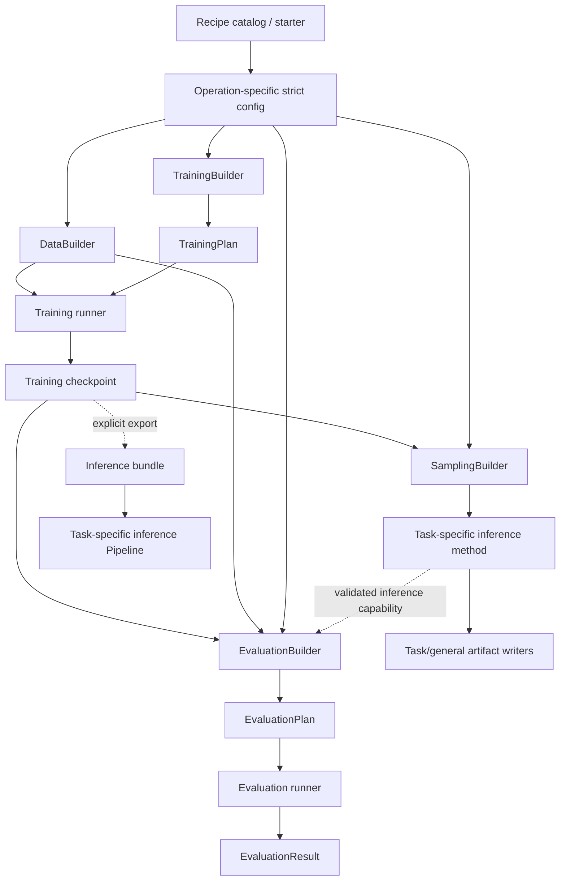

# 默认工作流与推理 Pipeline 原始设计资料

> 本文保存 2026-08-09 文档重构前的完整设计、调研、候选接口和测试矩阵。
> 它不是当前行为或排期来源。可执行结论以
> [`default-workflow-pipeline-support-plan.md`](../../default-workflow-pipeline-support-plan.md)
> 为准。

## 怎样阅读这份归档

- 普通读者先看[顺序工作流主计划](../../default-workflow-pipeline-support-plan.md)。主计划只讲
  用户怎样运行“训练后蒸馏”或“生图后超分”。
- 本文件保留旧方案中的配置模板、Python 调用、结果交接、任务专用 Pipeline、测试矩阵和
  研究比较。它不是当前 API，也不决定排期。
- 独立 checkpoint Evaluation、预测文件离线重算和结构化训练结果已经实现；稳定用法应查
  公开文档。稳定的 Python 训练调用、配置模板目录和多步结果交接仍未实现。
- 旧文件曾把许多方向放在同一个总计划里。现在 Latent Diffusion、Stable Diffusion、
  Consistency Distillation、超分辨率和 HPO 各由自己的计划说明，不应从这里推断它们已获批。
- 初始制定：2026-07-25；主要架构复核：2026-07-26 至 2026-07-29。

## 1. 目标与核心结论

目标不是新增一个同时拥有 `train()`、`distill()`、`sample()` 和
`super_resolve()` 的万能类，而是为用户提供几条**可发现、可复制、可运行、可验证**
的默认路径，同时保持当前 Builder、Strategy、Process 和 Sampler 的职责边界。

核心结论如下：

1. **默认工作路径叫 Recipe，不叫通用 Pipeline。**
   Recipe 是一组有意见的组件选择、完整配置、输入要求、预期 artifact、验证方法和
   已知限制。它展开为普通 Stochaflow config，仍走现有 Registry/Builder/runtime；
   runner 不按 recipe 名称分支。
2. **Pipeline 一词保留给任务特定的可复用推理对象。**
   例如 `ConsistencyImagePipeline.generate(...)` 和
   `SuperResolutionPipeline.restore(low_resolution, ...)` 可以有不同的窄签名；
   不建立全是 optional 字段的统一 `run(**kwargs)`。
3. **训练、蒸馏与超分辨率不在同一语义轴上。**
   `train` 是执行生命周期，consistency distillation 是训练方法，
   super resolution 是任务，one-step consistency 是推理方法。
4. **单次运行继续由现有 composition root 负责。**
   `DataBuilder` 组装数据，`TrainingBuilder` 产生 `TrainingPlan`，
   `TrainingStrategy` 解释 batch 和 loss，`SamplingBuilder` 组合一次任务推理，
   `EvaluationBuilder` 组合一次任务评估，三类 runtime 各自拥有生命周期。
5. **跨 run 的 Pipeline/Workflow 暂不在 core 自研 DAG。**
   `train teacher -> export teacher bundle -> distill -> evaluate` 是 artifact 编排层；
   首版先用显式命令和 typed artifact 完成。只有出现至少两个稳定的多阶段用例后，
   才评估窄的顺序 orchestrator 或接入 ZenML/Kedro 一类外部系统。
6. **Super resolution 的任务抽象不绑定 diffusion。**
   先用确定性 feed-forward baseline 验证输入、输出、指标和 artifact；
   再把现有 conditional Gaussian 教程晋升为独立 recipe。
7. **当前 consistency 计划有一个发布阻塞项。**
   原始 consistency distillation 使用独立 target student，并在成功 optimizer step
   后由 online student 更新 target EMA。现有计划的 `online_stopgrad` 可保留为研究
   变体，但在实现 core-managed target lifecycle 前不能标为标准、成熟的
   consistency distillation 默认 recipe。
8. **训练完成后的正式评估是独立 Evaluation operation。**
   它复用 Metrics 与 task inference primitive，但显式冻结 checkpoint/weight、
   data split、sample plan、protocol 与 result identity；训练期 validation、
   periodic diagnostic、final sampling 都不能替代它。未来若 Evaluation D3 批准 Gate，
   promotion policy 由 workflow/application 读取 immutable result 后另行拥有，不回塞 runtime。
9. **Latent Diffusion 是表示组合，不是新 Process 或万能 Pipeline。**
   frozen codec 属于 TrainingBuilder/SamplingBuilder 的任务资产；Gaussian Process
   与 Sampler 只处理 normalized latent。Stable Diffusion 另按完整 Diffusers backend、
   SD 1.x component interop、SDXL、SD3 与 LoRA 分层声明，不用一个 recipe 名称暗示
   全生态兼容。

首版明确不做：

- 任意 DAG、缓存、远程调度和通用 retry engine；
- 通用多模型 YAML 图；
- 自动根据 checkpoint、输入字段或文件扩展名猜任务；
- 通用 condition/batch schema；
- GAN、多 optimizer、交替更新或 manual backward；
- 任意 scale、blind/unpaired real-world SR、视频 SR；
- 把无条件 one-step consistency 宣称为 conditional one-step SR。

## 2. 先把四个语义轴拆开

### 2.1 正交分类

| 语义轴 | 例子 | 谁拥有 |
| --- | --- | --- |
| 执行操作 | training、evaluation、sampling、未来 export | library runner 与 CLI adapter |
| 任务 | 无条件图像生成、图像超分辨率、物理重建 | 任务 Builder、Strategy 与窄 capability |
| 训练方法 | Gaussian denoising、supervised pixel、consistency distillation | TrainingBuilder/Strategy 和所需 managed assets |
| 推理方法 | DDPM、DDIM、direct forward、consistency one/few-step | task-specific method、Dynamics/Sampler 或直接变换 |

实际组合是：

| Task | Training method | Inference method | 首版判断 |
| --- | --- | --- | --- |
| unconditional image generation | Gaussian denoising | DDPM/DDIM | 当前已有，先封装为 Recipe |
| unconditional image generation | consistency distillation | direct one-step / CM few-step | extension 验证后晋升 |
| conditional image generation | latent Gaussian denoising | condition adapter + DDPM/DDIM + codec decode | AFHQ 前置与 codec gate 后晋升 |
| text-to-image generation | Stable Diffusion 1.x component-native training/import | family-specific CFG + validated Gaussian schedule | 共享 latent 与 parity gate 后晋升 |
| super resolution | supervised pixel regression | direct forward | 新增确定性基线 |
| super resolution | conditional Gaussian denoising | DDPM/DDIM | 从现有教程晋升 |
| super resolution | conditional consistency distillation | one/few-step conditional CM | 后续独立提案 |

这意味着 `ConsistencyPipeline` 与 `SuperResolutionPipeline` 不是永远互斥的算法大类。
未来可以有 conditional consistency SR，但它必须让 teacher、student、condition、
time domain、prediction semantics 和预处理严格对齐，不能由两个 recipe 名称自动拼接。

### 2.2 统一术语

| 术语 | 本计划中的精确定义 |
| --- | --- |
| Recipe | 一套经过验证的默认配置、输入、artifact、文档和 benchmark 约定 |
| Recipe family | 同一能力下若干明确 variant，例如 pixel-x4 与 Gaussian-x4 |
| Plan | Builder 已经构造并校验的单次运行对象，例如 `TrainingPlan` |
| Runner | 执行稳定生命周期的库级入口 |
| Capability | 一个协作所需的窄协议，例如 super-resolution restore |
| Pipeline | 可重复调用的任务特定推理 facade；不负责训练 |
| Bundle | 可移植推理资产和数据化 manifest；不包含 optimizer 等训练状态 |
| Evaluation | 对冻结 subject/data/protocol 的独立质量与性能评估 |
| BenchmarkSuite | 多个版本化 Evaluation case；不是一个 Metric |
| Workflow | 多个独立 run/stage 通过 artifact 连接的编排 |

用户文档可以把“开箱即用的默认路径”口语化称为 pipeline，但代码、配置和 manifest
必须使用上述精确术语。

### 2.3 默认不等于自动猜测

一个 Recipe 被称为“默认”只表示：

- 有维护者选择的完整配置；
- 已通过声明的 smoke、contract 和质量 gate；
- 用户知道它需要什么输入、会产生什么输出；
- 每个关键默认值和限制都进入 resolved config/manifest；
- 用户仍可复制配置并显式修改。

默认不表示根据输入自动选择 task/model/sampler，也不表示在所有数据集上达到 SOTA。

## 3. 当前仓库基础与缺口

### 3.1 已经正确的边界

当前仓库已有以下可复用能力：

- `DataBuilder` 返回已组装的 train/validation/test iterable，batch 保持 `Any`；
- `TrainingBuilder` 组合 primary model、可选 Process/Objective 和具名 auxiliary module；
- `TrainingStrategy` 只实现 `training_step()` / `evaluation_step()`；
- Trainer 管 device、mode、optimizer、scheduler、EMA、checkpoint 和 diagnostics；
- `SamplingBuilder` 已是一次完整任务采样的 composition root；
- `Sampler` 只拥有 family-specific 数值求解循环；
- sampling runtime 已返回结构化 `SamplingRunResult`；
- checkpoint 保存 resolved config、primary model、Process、auxiliary state 和 provenance。

这些边界已经支持 frozen teacher distillation 与 conditional sampling，不需要再加一层
“PipelineBuilder”复制它们。

### 3.2 Super resolution 已有数据和纵向样例

内置 `super_resolution` DataBuilder 已支持：

- 只有 HR 图像时在线 bicubic 生成 synthetic-paired LR；
- 已对齐 LR/HR folder pair；
- 同步 crop/flip；
- 输出 `(high_res, {"low_res": low_res})`；
- collate 后保持相同结构。

[现有教程](../../../tutorials/super-resolution.md) 还展示了：

- task-specific conditional model；
- conditional Gaussian TrainingBuilder/Strategy；
- 用 LR closure 复用 `GaussianModelDynamics` 和 DDPM/DDIM；
- task-private `low_res_path` sampling 输入。

教程已经证明 composition path 可行，但其开头明确声明不是质量或收敛验证过的 baseline，
因此不能只复制代码就宣称 built-in default 已完成。

### 3.3 Consistency 目前只有计划

[Consistency 计划](../../consistency-distillation-support-plan.md) 已正确划分：

- frozen diffusion teacher 由 Builder 构造并作为 auxiliary 管理；
- Process 保持 model-free；
- teacher transition 复用 deterministic DDIM primitive；
- Strategy 计算 scalar loss；
- sampling 只加载 student。

但当前没有对应实现、测试或质量 baseline，并且 target student lifecycle 需要按本计划
第 13 节重新冻结。

### 3.4 真实缺口

| 缺口 | 影响 |
| --- | --- |
| 没有 Recipe identity/catalog | 默认配置散落，不能列出、复制或声明成熟度 |
| 没有 library-first training request API | runner 已返回 outcome，但多阶段编排仍须经过 CLI-shaped orchestration |
| 无 inference bundle | checkpoint 包含训练状态，部署语义和预处理不够明确 |
| sampling input 是 task-private 临时约定 | SR 文件身份、范围、颜色与输出映射未标准化 |
| 内置 writer 只理解 tensor/image grid | SR 的 input/bicubic/output/reference 对比需要 task writer |
| 没有 stage lineage | teacher bundle 到 student checkpoint 的交接靠手工约定 |

因此必须区分“实现 capability”和“晋升为默认 workflow”：

- concrete capability 的 correctness vertical slice 不依赖 Recipe/catalog，也不等待另一个
  通用 Evaluation milestone；task-owned formal profile 随该 vertical slice 一起交付；
- reusable run seam 由 Hydra 迁移计划的 `TrainingInvocation`/H1 统一拥有，本计划
  不再并行实现第二套 `run_training()`；
- 正式 baseline promotion 依赖 Metrics/Evaluation 和稳定 recipe；
- inference bundle/Pipeline 在 checkpoint-backed sampling 已闭环后再实现。

共同原则仍是不先写万能 Pipeline 类。

## 4. 成熟方案调研结论

### 4.1 Hugging Face Diffusers

[Diffusers Pipeline 文档](https://huggingface.co/docs/diffusers/api/pipelines/overview)
明确把 pipeline 定义为**推理**组件组合，并明确说明不应使用
`DiffusionPipeline` 训练。模型、scheduler、processor 可以共同 load/save/device，
但具体任务保留具体输入签名。

[Diffusers 训练文档](https://huggingface.co/docs/diffusers/training/overview)
反而强调 training scripts 是 self-contained、single-purpose 和易修改的任务样例。
这支持本计划把训练默认值放进 Recipe，把 Pipeline 留给推理。

[AutoPipeline](https://huggingface.co/docs/diffusers/main/tutorials/autopipeline)
通过“任务 + 模型类型”选择具体 pipeline subclass；它不是一个实例根据 optional input
动态承担所有任务。Stochaflow 若以后提供自动选择，也只能在明确 task capability 和
bundle manifest 上做显式映射。

Diffusers 的
[Modular Pipeline](https://huggingface.co/docs/diffusers/main/modular_diffusers/overview)
已经探索 reusable blocks、顺序、循环和共享 state，但官方仍标明 API 处于 active
development。它适合作为未来编排研究参考，不适合成为 Stochaflow 首版通用 block
state/DAG 的依据。

### 4.2 Lightning 与 Composer

[Lightning Trainer](https://lightning.ai/docs/pytorch/stable/common/trainer.html)
管理 loop、device、gradient、validation 和 checkpoint，而任务 module 定义
training/validation step。这与当前 Trainer/TrainingStrategy 分工一致。

[Composer Algorithms](https://docs.mosaicml.com/projects/composer/en/latest/trainer/algorithms.html)
把可组合的训练算法限制在明确 event/state contract 中，并由 Trainer 处理冲突和顺序。
Consistency distillation 会改变资产拓扑、forward 和 loss；SR 会改变 batch 与 model
调用。两者都不应伪装成只观察状态的 callback。

### 4.3 ZenML/Kedro 一类 workflow 系统

成熟 workflow 系统把 step 视为独立计算单元，并用 artifact edge 组成 DAG，进一步处理
lineage、cache、retry、远程运行和版本。这对应：

```text
teacher training
-> teacher bundle export
-> student distillation
-> evaluation
-> inference bundle export
```

它不对应一次 `TrainingPlan`。Stochaflow 首版没有足够用例证明需要复制一个 DAG
orchestrator；项目脚本或外部系统可以调用计划中的
`run_training_invocation()`（Hydra H1）与当前 `run_sampling()`。

### 4.4 Super-resolution 成熟实现

[SR3](https://research.google/pubs/image-super-resolution-via-iterative-refinement/)
把 SR 定义为以 LR 图像为 condition、从 Gaussian prior 迭代得到 HR 的条件生成任务。
[Diffusers x4 Upscaler](https://huggingface.co/docs/diffusers/main/api/pipelines/stable_diffusion/upscale)
进一步显示一个成熟 SR pipeline 可能同时拥有 VAE、text encoder、UNet、
low-resolution noise scheduler 和 inference scheduler；这些是具体 pipeline 的组件，
不是通用 SR 根接口的必填字段。

[Real-ESRGAN 训练指南](https://github.com/xinntao/Real-ESRGAN/blob/master/docs/Training.md)
把实用 SR 分成 pixel-loss pretraining 和 perceptual/GAN finetuning 两阶段，并区分在线
synthetic degradation 与 paired data。它说明 adversarial SR 是新的多 optimizer loop
family，不是 `objective.mode: gan`。

[Perception-Distortion Tradeoff](https://arxiv.org/abs/1711.06077)
证明低 distortion 与高 perceptual quality 存在基本张力。因此默认 SR 不能只公布一个
PSNR，或只用 FID 取代输入保真度。

## 5. 建议的总体架构



层次规则：

1. Recipe 只产生、解释和展示配置/要求，不持有模型；
2. Builder 只组合单次 operation 所需资产；SamplingBuilder/sampling composition
   仍拥有 model adapter、condition、guidance、initialization 和 Sampler compatibility；
3. Runner 只执行稳定 lifecycle；
4. task method 拥有一次具体推理的数学组合；
5. task Pipeline 拥有重复推理所需的预处理、method 和后处理；
6. EvaluationResult 冻结 subject、data、protocol、metrics、measurements 与 provenance；
7. Workflow 只连接不同 run 的 typed artifact。

## 6. Recipe 层

### 6.1 职责

Recipe descriptor 至少声明：

- stable `id` 与独立 `version`；
- human-readable summary；
- task 和 method 标签，仅用于发现，不用于 core dispatch；
- maturity：`reference`、`baseline` 或 `stable`；
- 一个或多个明确 entry；
- 每个 entry 的完整 config template；
- required user inputs；
- expected artifacts；
- required extension identity；
- benchmark/validation profile；
- 已知限制和升级说明。

成熟度语义：

| maturity | 要求 |
| --- | --- |
| reference | contract、smoke 和 tiny overfit 通过；不承诺实际质量 |
| baseline | 固定数据/seed/hardware profile 有可复现质量与性能报告 |
| stable | 稳定配置/API、迁移说明和完整 acceptance suite |

公开文档中的“默认可用”至少要求 `baseline`。现有 SR 教程只能标为 `reference`。

### 6.2 Recipe 不是另一套 config

Recipe entry 必须按 tagged entry type 物化为对应 operation 的严格配置：

| entry type | 配置 authority |
| --- | --- |
| Training | 完整 `StochaflowConfig` |
| Sampling | C1 后完整 `SampleConfig`，与 checkpoint immutable recipe 共同解析 |
| Evaluation | 独立 `EvaluationConfig` |

未来若新增 Export 等 core operation，再增加其窄 entry/config type；不能把所有字段塞回
`StochaflowConfig`。

```text
Recipe entry
-> materialize explicit YAML
-> matching operation-specific strict parser
-> extension preflight/activation
-> existing Registry/Builder construction
```

禁止：

- 在 runner 中检查 `recipe.id` 后补 component；
- recipe 默认值与最终 resolved config 不一致；
- 用 `${object.attr}` 一类任意 Python interpolation；
- 隐式 merge 用户已有文件；
- 通过 recipe 绕过未知字段检查；
- 让 Recipe 保存 live model、Dataset、optimizer 或 callable。

`StochaflowConfig` 首版不新增顶层 `pipeline:` 或 `evaluation:`。Recipe identity 可以
进入 invocation metadata/run manifest，但每份 materialized operation config 始终可以
脱离 Recipe 单独运行。

### 6.3 候选 descriptor

以下只是 contract 方向，精确名字在实现阶段冻结：

```python
@dataclass(frozen=True, slots=True)
class ArtifactRequirement:
    name: str
    media_type: str
    description: str


@dataclass(frozen=True, slots=True)
class TrainingRecipeEntry:
    name: str
    config_template: str
    inputs: tuple[ArtifactRequirement, ...]
    outputs: tuple[ArtifactRequirement, ...]


@dataclass(frozen=True, slots=True)
class SamplingRecipeEntry:
    name: str
    config_template: str
    inputs: tuple[ArtifactRequirement, ...]
    outputs: tuple[ArtifactRequirement, ...]


@dataclass(frozen=True, slots=True)
class EvaluationRecipeEntry:
    name: str
    config_template: str
    inputs: tuple[ArtifactRequirement, ...]
    outputs: tuple[ArtifactRequirement, ...]


type RecipeEntry = (
    TrainingRecipeEntry
    | EvaluationRecipeEntry
    | SamplingRecipeEntry
)


@dataclass(frozen=True, slots=True)
class RecipeDescriptor:
    recipe_id: str
    version: int
    maturity: str
    summary: str
    entries: tuple[RecipeEntry, ...]
```

Training、Evaluation 与 Sampling entry 使用 tagged union，而不是一个带几十个
optional 字段的 `RecipeStage`。未来出现新的 core operation 时，再增加对应窄
entry type。

### 6.4 发现与 extension

建议分两步：

1. 先在 `configs/recipes/` 建立 first-party source of truth 和严格 manifest validator；
2. 当 consistency extension 与至少一个外部项目都需要发现时，再公开窄的
   `RecipeProvider`/catalog registration contract。

若新增 provider，它只返回 descriptor 和 UTF-8 template resources；执行仍走当前
runner。Stochaflow-owned recipe 与第三方 provider 必须走同一 catalog path。

不应为了 Recipe 直接注册所有 upstream model/degradation/metric 名称，也不应建立新的
全局 task × method compatibility matrix。兼容性仍在具体 Builder 边界验证。

### 6.5 CLI 候选

```text
stochaflow recipes list
stochaflow recipes show gaussian-image-generation
stochaflow recipes init gaussian-super-resolution --target my-sr
```

`init` 只写入新的目标目录，遇到现有目标文件立即失败；不提供隐式覆盖。生成结果是普通
配置和 README，之后仍使用：

```text
stochaflow train --config my-sr/train.yaml
stochaflow evaluate --config my-sr/evaluate.yaml
stochaflow sample --checkpoint ... --config my-sr/restore.yaml
```

首版不增加通用 `--set arbitrary.path=value`，也不让 Recipe CLI 递归调用 CLI。

## 7. Library-first operation API

### 7.1 训练入口必须先结构化

sampling 已有可编程 `run_sampling(...) -> SamplingRunResult`。当前训练 runner
返回 immutable `TrainingRunOutcome`，并持久化 completed outcome manifest；但入口仍与
`argparse.Namespace`、console reporter 和目录创建耦合。Recipe、AutoML 和未来 Workflow
都不应解析 stdout 或递归启动 `stochaflow train`。

这条 seam 不在本计划另起竞争类型；它复用
[Hydra 配置迁移计划](../../hydra-configuration-composition-migration-plan.md) H1 的
`TrainingInvocation -> run_training_invocation() -> TrainingRunOutcome`，并与
[自动调优计划](../../automated-model-tuning-plan.md)共享 observer/reporting 边界。Hydra 只是一种
front end，library API 不依赖 Hydra。

`final_metrics` 和 `phase_test_metrics` 复用 Training 当前产生的 plain canonical scalar
mapping，并在 outcome 中成为 immutable snapshots；没有 test split 时后者为空 mapping。
best checkpoint 与 early stopping 仍只读取 `valid/loss` 或
`valid/metrics/...`；diagnostic 日志不进入这些 mapping。正式 Evaluation 不复用逐 key
Training metadata，而是在自己的 `EvaluationResult` 中冻结 subject、dataset、split、
protocol 和 result identity。

以上 outcome foundation 已完成。H1 的 library-first invocation 尚未实现；
`evaluation_results`/`sampling_results` references 也不属于当前 outcome。跨 operation
关联由 workflow manifest 的 typed artifact binding 持有，不能回写并改变已发布 outcome。

```python
def run_training_invocation(
    invocation: TrainingInvocation,
    *,
    reporter: TrainingReporter | None = None,
    observer: TrainingRunObserver | None = None,
) -> TrainingRunOutcome:
    ...
```

要求：

- CLI 只负责解析、激活 extension、构造 request 和展示 outcome；
- library API 不接受 `argparse.Namespace`；
- run directory、best/latest checkpoint、metrics 和 manifest 都来自结构化 outcome；
- DataBuilder 每个 run 正常重建，不缓存任意 Dataset；
- failure 仍抛出有类型的异常；outcome 不伪装失败为成功；
- reporter 只展示，不能拥有训练状态；
- AutoML observer/pruning 与未来 Workflow 共用同一 plain epoch report，不复制 loop。

### 7.2 operation 不合并成一个 `run(kind=...)`

保持独立入口。当前可执行的 Evaluation 保持公开的 path-first API；没有消费者的
通用 request schema 不属于其 runtime contract：

```text
run_training_invocation(TrainingInvocation) -> TrainingRunOutcome  # planned H1
run_evaluation(config_path, *, output_dir, device_name, ...)   # implemented
run_sampling(...) -> SamplingRunResult                         # implemented
```

三者的生命周期、resume、输入和输出并不相同。一个通用 `OperationRequest` 加可选
checkpoint/data/optimizer/metrics 字段会破坏 Interface Segregation，也会把错误推迟
到运行期。Evaluation 的完整 contract 见
[训练后 Evaluation 与 Benchmark 支持计划](../../post-training-evaluation-support-plan.md)。

### 7.3 训练后的显式 sampling stage

当前 training runner 不自动触发 final sampling，也不恢复 `run_final_sampling` 一类训练
开关。Recipe 或 Workflow 通过 typed binding 把非空的
`TrainingRunOutcome.selected_checkpoint` 交给当前独立 path-first sampling operation，再记录
`SamplingRunResult`：

```text
TrainingRunOutcome.selected_checkpoint
-> run_sampling(checkpoint=..., config_path=...)
-> SamplingRunResult.artifacts + task-owned manifest
```

`SamplingInvocation` 仍只是 post-Hydra sampling review 的候选 seam；只有该 review 以真实
consumer 证据批准后，才可替换上面的 path-first adapter，本计划不预先把它当作现有 API。

对于需要外部输入的 SR recipe，后续 restore/sample stage 必须显式提供 LR input；training
runner 不从 validation batch 猜 condition，也不把 sampling policy 塞回训练配置。

### 7.4 训练后的正式 Evaluation

训练成功应先返回 checkpoint 与结构化 outcome。完整 SR restore quality、生成
FID/KID、consistency NFE 曲线和 performance benchmark 由显式 Evaluation entry 运行：

```text
TrainingRunOutcome.selected_checkpoint（非空）
-> strict EvaluationConfig path (frozen weights/data/protocol)
-> EvaluationRunOutcome / EvaluationResult
```

默认不随每次训练自动执行重型 benchmark。若 Recipe/Workflow 提供 post-training
evaluation stage，它必须调用公共 `run_evaluation()`，并在独立 workflow manifest 中绑定
result reference；不能修改 TrainingRunOutcome，也不能在 training runner 复制 evaluator。
当前训练末尾的 test loss/metrics 只称 `phase_test_metrics`，不等同于 formal benchmark。

## 8. Task-specific inference Pipeline

### 8.1 为什么需要，但不是首个 prerequisite

当前 `SamplingBuilder.run()` 很适合一次 CLI invocation：它读取配置、加载输入、分 batch、
执行方法并返回 writer-ready 输出。若用户后续需要服务式或 notebook 内重复推理，再把
“构建一次”和“调用多次”分开：

```text
checkpoint/bundle
-> construct task Pipeline once
-> invoke many inputs
```

这个优化不应阻塞 Recipe、SR baseline 或 consistency extension 的首个纵向实现。

### 8.2 不建立万能基类

候选具体 API：

```python
class GaussianImageGenerationPipeline:
    def generate(
        self,
        *,
        batch_size: int,
        generator: torch.Generator,
    ) -> ImageGenerationResult:
        ...


class ConsistencyImagePipeline:
    def generate(
        self,
        *,
        batch_size: int,
        generator: torch.Generator,
        num_steps: int = 1,
    ) -> ImageGenerationResult:
        ...


class SuperResolutionPipeline:
    @property
    def native_scale(self) -> int:
        ...

    def restore(
        self,
        low_resolution: torch.Tensor,
        *,
        generator: torch.Generator | None = None,
    ) -> SuperResolutionResult:
        ...
```

这些类可以共享 checkpoint loader、device helper 和结果验证，但不共享一个 universal
`__call__` contract。若只需要 nominal typing，可使用无数学方法的 semantic root；
core 不根据它 dispatch。

### 8.3 Super-resolution task capability

SR 的 raw model 签名随方法变化：

- feed-forward：`model(lr) -> sr`；
- Gaussian diffusion：`model(x_t, t, lr) -> prediction`；
- text-guided upscaler：还可能需要 prompt/noise level；
- conditional consistency：`f(x_t, t; lr) -> endpoint`。

因此统一的是任务输出，不是 raw model：

```python
@dataclass(frozen=True, slots=True)
class SuperResolutionResult:
    restored: torch.Tensor
    native_scale: int
    metadata: Mapping[str, JSONValue]


class SuperResolutionMethod(Protocol):
    @property
    def native_scale(self) -> int:
        ...

    def restore(
        self,
        low_resolution: torch.Tensor,
        *,
        generator: torch.Generator | None = None,
    ) -> SuperResolutionResult:
        ...
```

具体 SamplingBuilder 私有组合一个 method：

- direct model adapter 不创建 Process 或 Sampler；
- Gaussian adapter 组合 Process、conditional model closure 和 DDPM/DDIM；
- future consistency adapter 组合 endpoint operator 和可选 few-step sampler。

首版不建立全局 `SuperResolutionMethod` registry。任务 Builder 已经是 composition root；
只有出现独立跨项目选择需求后才评估 registry。

### 8.4 SamplingBuilder 必须复用 task method

当 concrete Pipeline/Method 存在后，内置 SamplingBuilder 应委托给它，而不是复制数学：

```text
task-private input source
-> preprocess
-> SuperResolutionMethod.restore()
-> SamplingOutput
-> task-specific writer
```

SamplingBuilder 仍拥有本次 invocation 的 input source、batching、seed、metadata 和
writer handoff；Pipeline/Method 不读取任意路径，也不写 run directory。

独立 Evaluation 不得重新组合 conditional closure、guidance、initialization 或
Process/Dynamics/Sampler compatibility。SamplingBuilder/sampling subsystem 应把同一
task method 暴露为窄、已验证的 inference capability；Sampling operation 负责普通
sampling input/output lifecycle，EvaluationBuilder 只在其外组合 selected data、
metrics、reference cache、completeness 和 EvaluationResult。direct transform 仍可由
task-local method factory 构造，不必伪造 Sampler。

## 9. Artifact 与 bundle

### 9.1 三种 artifact 不混用

| Artifact | 内容 | 主要消费者 |
| --- | --- | --- |
| Training checkpoint | optimizer/scheduler、RNG、managed modules、raw/EMA、完整 config | resume、研究复现 |
| Teacher bundle | 固定 teacher model/process/prediction semantics 与来源 | consistency distillation fresh train |
| Inference bundle | 必要模型/Process、选定权重、预处理和 task manifest | task Pipeline、部署、checkpoint-only inference |

Training checkpoint 不是部署 bundle；teacher bundle 也不是普通 inference bundle。

### 9.2 Inference bundle manifest

候选内容：

```yaml
format_version: 1
task: image.super_resolution
capability: restore
recipe:
  id: gaussian-super-resolution
  version: 1
source:
  checkpoint_digest: ...
  run_manifest: ...
weights:
  selection: ema
components:
  model: {name: ..., params: ...}
  process: {name: ..., params: ...}
  sampling_builder: {name: ..., params: ...}
preprocessing:
  channels: rgb
  input_range: [0.0, 1.0]
  model_range: [-1.0, 1.0]
  native_scale: 4
extensions: ...
```

规则：

- 保存数据化 declaration/state，不 pickle extension class 或 callable；
- manifest 有独立 format version；
- extension provenance 和来源 checkpoint digest 必须保留；
- raw/EMA 选择在 export 时冻结；
- model/process/prediction type/preprocessing 不匹配立即失败；
- bundle 不含 optimizer、scheduler、teacher 或训练 RNG；
- task Pipeline load 后不得静默下载或替换组件；
- 首版只支持单 primary-model bundle；多 checkpoint cascade 用多个 stage。

### 9.3 Workflow artifact binding

Consistency 的手工路径是：

```text
teacher TrainingRunOutcome.selected_checkpoint（经显式 policy 选择且非空）
-> explicit teacher bundle exporter
-> teacher bundle
-> distillation TrainingInvocation（planned Hydra H1）
-> student TrainingRunOutcome.selected_checkpoint（非空）
-> student-only sampling/export
```

生成后超分辨率的手工路径同样只连接 typed artifacts：

```text
base-generation SamplingRunResult.artifacts
-> selected image artifact manifest + sample IDs
-> current run_sampling() with task-owned LR input config
-> high-resolution artifact manifest from SamplingRunResult.artifacts
-> task-owned Evaluation result
```

第二个 stage 必须验证 media type、sample identity、range/color/preprocessing 与 producer
digest；不能只传一个目录字符串，也不能靠文件名顺序拼接。

在增加自动 orchestrator 前，每个 exporter 都应有 typed input/output、digest 和 manifest。
不能只靠文件名约定 `best.pt` 属于哪一个 model/process。

未来若实现 Workflow，最小边界是显式有序 stage 与 artifact binding：

```python
type WorkflowStage = (
    TrainingStage | SamplingStage | EvaluationStage | ExportStage
)


@dataclass(frozen=True, slots=True)
class ArtifactBinding:
    producer_stage: str
    producer_output: str
    consumer_stage: str
    consumer_input: str
    media_type: str
```

它不支持任意 Python callable、动态 branch、loop 或 task-specific kwargs。若需求进入
cache/retry/remote execution，优先接成熟 orchestrator，而不是继续扩 core。

## 10. 首批 Recipe family

### 10.1 `gaussian-image-generation`

定位：把当前已经存在的无条件 Gaussian train + DDPM/DDIM sample 路径正式封装。

Entries：

| entry | 输入 | 输出 |
| --- | --- | --- |
| `train` | image dataset/config | training checkpoint、metrics |
| `sample-ddpm` | checkpoint、seed | samples、manifest |
| `sample-ddim` | checkpoint、seed | samples、manifest |
| `evaluate-quality` | checkpoint、fixed reference/sample plan | EvaluationResult、predictions、quality/performance report |

实现原则：

- 不新增算法代码；
- 将 retained MNIST config 中的稳定公共部分收敛为 recipe variant；
- DDPM/DDIM 是两个完整 sample entry，共同消费 checkpoint 的
  `standard_denoising` immutable recipe；
- recipe manifest 记录数据范围、shape、prediction type 与基线；
- 作为 Recipe/catalog/run API 的首个 contract 测试。

Promotion gate：

- 当前 smoke 与 focused tests 全部通过；
- fixed seed 的 train/resume/sample 可复现约定保持；
- recipe materialized config 与手写 config 得到同一 selected component identities；
- CLI 与 library API outcome 等价。

### 10.2 `pixel-super-resolution`

定位：确定性 SR 工程基线，先验证 task I/O、metrics、writer、checkpoint-only restore
和未来 task Pipeline；它不是替代 Gaussian SR。

首版范围：

- fixed native x4，后续可增加独立 x2 variant；
- RGB 8-bit external I/O；
- aligned paired 或 simple bicubic synthetic-paired；
- 一个 feed-forward residual/UNet-like model；
- L1 或 Charbonnier 单 scalar objective；
- 单 optimizer、单 backward；
- direct inference，不构造 Process/Sampler；
- PSNR/SSIM validation，LPIPS diagnostic；
- whole-image inference；tiling 只在方法明确声明 safe 后开放。

Entries：

| entry | 输入 | 输出 |
| --- | --- | --- |
| `train-x4` | paired/synthetic-paired data | checkpoint、validation metrics |
| `restore-x4` | checkpoint、LR images | per-image SR outputs、comparison manifest |
| `benchmark-x4` | checkpoint、fixed paired split | EvaluationResult、metric profile、comparison artifacts |

引入该基线的原因：

- 能独立检查 SR 的颜色、range、scale 和配对协议；
- 为 Gaussian SR 提供 bicubic 与 deterministic learned baseline；
- 证明 direct transform 不需要伪造 Process/Sampler；
- 先解决用户可见 I/O，再调试随机迭代方法。

### 10.3 `gaussian-super-resolution`

定位：把现有教程的 conditional Gaussian composition 晋升为维护的随机 SR baseline。

首版范围：

- pixel-space discrete VP Gaussian；
- fixed x4、RGB、whole fixed-size patch/image；
- 内置 `super_resolution` DataBuilder；
- task-specific conditional denoiser 或 adapter；
- epsilon/x0/v/score 中至少冻结一个默认 prediction type；
- DDPM 与 DDIM inference；
- 一个 LR 输入产生一个 fixed-seed output；多样本 sampling 显式配置；
- 不含 text guidance、blind degradation、GAN、arbitrary outscale 或通用 tiling。

训练组合：

```text
(high_res, {"low_res": low_res})
-> GaussianSuperResolutionStrategy
-> Process.sample_marginal(high_res, t)
-> conditional model(noisy_hr, t, low_res)
-> Gaussian target
-> one scalar objective
```

推理组合：

```text
low_res
-> task preprocessing
-> terminal HR prior
-> conditional prediction closure
-> GaussianModelDynamics
-> DDPM/DDIM
-> restored HR
```

Process 仍只描述 HR probability path；LR degradation、condition 和文件 I/O 不进入
Process。Sampler 只消费 Gaussian dynamics，不知道 `low_res`。

### 10.4 `consistency-image-generation`

定位：从 frozen diffusion teacher 蒸馏 endpoint consistency student，并提供 student-only
one/few-step generation。

Recipe entries 与前置 utility：

| 名称 | 类型 | 输入 | 输出 |
| --- | --- | --- | --- |
| `export-teacher` | extension-owned prerequisite utility | teacher checkpoint | versioned teacher bundle |
| `distill` | training recipe entry | image data、teacher bundle | student checkpoint |
| `generate-one-step` | sampling recipe entry | student checkpoint、seed | images、NFE=1 metadata |
| `generate-few-step` | sampling recipe entry | student checkpoint、seed、time schedule | images、actual NFE |
| `evaluate-quality-speed` | evaluation recipe entry | student checkpoint、fixed sample plan | NFE 1/2/4 EvaluationResults、curve |

首版 catalog 不把任意 utility command 塞进 `RecipeEntry`。`export-teacher` 由 extension
README 和 typed exporter contract 暴露；只有未来 core 明确定义 export operation 后，
才增加窄的 `ExportRecipeEntry`。

边界：

- v1 仍是无条件图像；
- one-step 是 endpoint operator 的直接调用，不必伪装成 numerical Sampler；
- few-step 才使用 CM-specific denoise-renoise Sampler；
- sampling 不构造 teacher/target student；
- inference EMA 与 loss target EMA 是两套不同状态；
- target lifecycle gate 未完成前，recipe maturity 只能是 `reference/experimental`。

### 10.5 `latent-image-generation`

定位：在 frozen image codec 的 diffusion-normalized latent 上训练 concrete
conditional denoiser，并通过 condition adapter、原生 DDPM/DDIM 和同一 codec
decode 生成图像。class-conditioned DiT 是首个 reference variant，不是 recipe
family 的 abstraction boundary。完整设计服从
[Latent Diffusion 支持计划](../../latent-diffusion-support-plan.md)。

首个开放正式候选是冻结的 The Met Open Access curated snapshot；AFHQ-v2
只承担 correctness/smoke，原始分辨率 ImageNet-100 是 class benchmark，
DomainNet 在 class + domain condition gate 后作为规模扩展。recipe family
不绑定具体 dataset、VAE 品牌或 denoiser topology：

| entry | 类型 | 输入 | 输出 |
| --- | --- | --- | --- |
| `evaluate-codec` | evaluation | frozen codec、profile-declared images | reconstruction EvaluationResult |
| `train-conditional` | training | recipe-declared conditioned image/latent data、codec | denoiser checkpoint、metrics |
| `sample-conditional` | sampling | checkpoint、condition plan、seed | decoded images、latent/sampling manifest |
| `evaluate-quality` | evaluation | frozen checkpoint、reference/sample plan | distribution/class-fidelity/memorization report |

`prepare-latents` 与 `export-teacher` 一样，是首版 catalog 之外的显式 prerequisite
utility：它产生带 manifest 的 versioned posterior-moments artifact，但在 core 尚未定义
窄的 `DataPreparationRequest`、`DataPreparationOutcome` 与
`DataPreparationRecipeEntry` 前，不能伪装成现有 Training/Sampling/Evaluation
`RecipeEntry`。在线 encode 与直接读取该 artifact 仍由同一个具体 DataBuilder/
TrainingBuilder 组合验证。

若未来 Evaluation D3 批准 promotion Gate，workflow 可另外保存引用该 immutable
EvaluationResult 的 gate decision；它不是当前 `evaluate-codec` runtime 的输出字段。

边界：

- codec 是 frozen managed auxiliary，primary model 仍是 denoiser；
- VAE architecture、public weights 和 Diffusers-format export 由 Diffusers/外部
  training workflow 负责；Stochaflow 不提供 VAE Trainer；
- pixel/latent 不产生两个 Process 根；
- UNet 与 DiT 是可替换 model，不是 recipe dispatch key；
- prepared posterior moments 是内容寻址数据 artifact，不是 loader 的隐式 cache；
- SamplingBuilder 拥有 condition、CFG、latent shape 和 decode；
- sampling 从 checkpoint 解析 codec，不要求用户重复 VAE declaration；
- AFHQ smoke、Met formal protocol、ImageNet-100 benchmark 与 DomainNet extension 使用不同
  protocol/result identity；
- independent non-DiT denoiser 必须复用同一 lifecycle；
- text encoder、prompt 与 Stable Diffusion component graph 不进入该 family。

Promotion gate：

- AFHQ 计划的 class-aware data、conditional denoiser 与 CFG 已验证；
- codec reconstruction gate 先通过；
- sampling runtime 能恢复被明确请求的 frozen codec；
- latent training checkpoint 可 strict resume；
- fixed sample plan 的 KID/FID、class fidelity 与 nearest-neighbor audit 完整；
- DiT-S/2 在开放数据 profile 完成 bring-up，DiT-B/2 在 production asset
  persistence 与 step-based resume gate 通过后进入正式长训练。

Stable Diffusion text-to-image 使用下面的独立 recipe；完整 Diffusers pipeline
inference 也不是本 recipe 的数值 Sampler。

### 10.6 `stable-diffusion-text-to-image`

定位：复用 Latent Diffusion 的 codec、posterior artifact 和 Gaussian lifecycle，
组合 pinned tokenizer、frozen text encoder 与 conditional UNet，提供 Stable
Diffusion 1.x-compatible component-native training/sampling。完整设计服从
[Stable Diffusion Component-Native 支持计划](../../stable-diffusion-component-native-support-plan.md)。

| entry | 类型 | 输入 | 输出 |
| --- | --- | --- | --- |
| `evaluate-components` | evaluation | pinned SD component bundle、fixed prompts | component/schedule/parity report |
| `train-text-to-image` | training | image-text/latent-text data、component bundle | UNet checkpoint、metrics |
| `sample-text-cfg` | sampling | checkpoint、prompt suite、seed | decoded images、sampling manifest |
| `evaluate-text-quality` | evaluation | frozen checkpoint、reference/prompt protocol | alignment/distribution/memorization report |

边界：

- black-box Diffusers Pipeline 和 component-native Stochaflow path 分开声明；
- first training slice 是 frozen VAE + frozen text encoder + full-parameter UNet；
- pretrained fine-tuning 与 random-init training 使用不同 profile identity；
- caption/tokenizer/text encoder 是具体 recipe contract，不进入 universal batch；
- 256 只做 bring-up，SD 1.x formal profile 是 512；
- SDXL、SD3、LoRA、ControlNet 不通过 nullable fields 进入 SD 1.x Builder；
- The Met curated deterministic captions 是首个开放候选，COCO 是 reference profile。

Promotion gate：

- Latent Diffusion Phase 1–4C 完成；
- pinned black-box pipeline 可作为 parity reference；
- component、schedule 和 trajectory compatibility 分层报告；
- 512 full UNet fine-tuning 可 strict resume；
- checkpoint/run bundle 可离线 sampling；
- fixed prompt suite 与非挑选式 evaluation 完整。

### 10.7 明确不自动组合

以下不是首版 Recipe：

```text
unconditional consistency checkpoint + arbitrary LR image -> one-step SR
```

Consistency Models 中的 zero-shot inverse-problem editing 是带观测约束的迭代方法，不等于
一个无条件 one-step operator 接受 LR 后直接完成 conditional SR。真正的 one-step
consistency SR 需要新的 conditional teacher/student distillation 计划。

## 11. Super-resolution 详细工程方案

### 11.1 数据语义

必须区分：

| 类型 | 定义 | v1 |
| --- | --- | --- |
| aligned paired | 每个 LR 有已对齐 HR reference | 支持 |
| synthetic-paired | 从 HR 用已知 degradation 生成 LR | 支持 simple bicubic |
| unpaired | LR 与 HR 域无逐样本对应 | 不支持 |

`paired: false` 不能等同于真正 unpaired。当前 bicubic 路径是 synthetic-paired，仍有精确
HR target。

规则：

- `H_hr = scale_y * H_lr`、`W_hr = scale_x * W_lr`；
- 默认 recipe 要求 isotropic integer native scale；
- crop/flip/rotation 必须在 LR/HR 上同步；
- train degradation 可随机，但 validation/test degradation 必须固定或预生成；
- degradation seed、kernel、range 和 color space 进入 resolved config/manifest；
- degradation 是 DataBuilder 的任务私有观测生成，不进入 diffusion Process；
- v1 复用当前 bicubic/paired implementation，不新增 universal degradation registry。

未来若加入 blur/downsample/noise/JPEG 或 Real-ESRGAN 风格二阶 degradation，应先定义
`SuperResolutionDataBuilder` 私有的窄 helper，并为参数采样与 deterministic validation
增加测试；不能把全部图像退化算子镜像到全局 Registry。

### 11.2 训练方法与 loop family

| 方法 | 资产/更新 | 当前自动 loop |
| --- | --- | --- |
| L1/L2/Charbonnier pixel | 单 primary model、单 objective | 支持 |
| pixel + frozen perceptual | primary + frozen feature extractor、一个总 loss | 可由 Builder auxiliary 支持 |
| adversarial SR | generator/discriminator、两个 optimizer、交替 update | 不支持；新 loop family |
| Gaussian SR | primary conditional denoiser + Process + Objective | 支持专用 Strategy |
| consistency SR | teacher/online/target + conditional trajectory | 后续独立提案 |

不要把这些方法压成 `training.params.mode`。每一种改变 batch、assets 或 forward 的方法都由
具体 TrainingBuilder/Strategy 负责；多 optimizer 是新的 runtime lifecycle。

### 11.3 模型与 condition

Gaussian SR 首版有两种实现候选：

1. 明确的 conditional denoiser：`model(state, model_time, low_res)`；
2. Builder 构造的 task adapter：上采样 LR，与 noisy HR concat，再调用普通
   `model(concat, model_time)`。

推荐先把教程中的明确 conditional signature 提炼为窄任务 capability，因为：

- condition preprocessing 只有一个所有训练/采样/diagnostic 共用的实现；
- model config 可自描述 channels；
- Builder 可在完整组合边界 fail fast；
- diagnostics 不需从 Process family 猜主模型签名。

候选 capability 应使用有语义的命名方法，而不是依赖 `nn.Module.__call__` 的宽签名：

```python
class LowResolutionConditionedDenoiser(Protocol):
    def predict_super_resolution(
        self,
        state: torch.Tensor,
        model_time: torch.Tensor,
        low_resolution: torch.Tensor,
    ) -> torch.Tensor:
        ...
```

primary model 仍必须是 `nn.Module`；该 protocol 只描述 Strategy/SamplingBuilder 所需的
额外能力。第三方实现用独立 custom model contract test 验证，不只测试内置 class。

如果最终采用 concat adapter，也应让 adapter 实现同一窄 capability，并由
TrainingBuilder/SamplingBuilder 共同复用；不能在两处各写一份 resize/concat。

### 11.4 推理输入与输出

SR SamplingBuilder 的输入 source 是任务私有参数，不增加顶层通用 `input_image`：

```yaml
sample:
  sampler:
    name: ddim
    params: {num_inference_steps: 50, eta: 0.0}
  options:
    source:
      name: image_folder
      params:
        root: data/low-resolution
        layout: flat
      materialization:
        cache_root: ./.stochaflow-cache
        policy: ensure
        verification: full
    native_scale: 4
    weights: ema
  num_samples: 8
  batch_size: 4
  seed: 42
  writers:
    - name: super_resolution_comparison
      params:
        format: png
```

`gaussian_super_resolution` 是 TrainingBuilder 写入 checkpoint 的内部
`inference_recipe.name`，`prediction_type: epsilon` 属于其 fixed contract；request
只表达 input、solver 和其他允许变化的 options。

v1 source：

- `tensor_file`：测试、研究和精确 replay；
- `image_folder`：稳定排序、保留 relative identity；
- 不建立 universal inference-input Registry。

外部 I/O 首版：

- RGB 8-bit images；
- 对外 decode 为 NCHW float `[0, 1]`；
- method adapter 根据 bundle/config 转为模型 range；
- 输出先转回 `[0, 1]`，clamp、round、encode 顺序固定；
- grayscale、alpha、16-bit 与 arbitrary outscale 后续显式增加。

`native_scale` 是模型能力；额外 Lanczos resize 的 `outscale` 是后处理，两者不能混名。

### 11.5 Task-specific writer

SR 需要保留 source identity，并可能输出：

- restored image；
- LR nearest/bicubic preview；
- 可选 HR reference；
- input/bicubic/restored/reference comparison；
- 每样本和集合 metric；
- source-to-output mapping。

不要给通用 `SamplingBatch` 新增 `low_res`、`high_res` optional 字段。候选做法是让
`SamplingBatch.samples` 持有 task-local `SuperResolutionBatch`，并注册
`super_resolution_images` writer；通用 tensor/image writer 对未知 task batch 继续
fail fast。

### 11.6 Tiling

tiling 不是通用 `unfold/fold`：

- 局部 deterministic CNN 可以使用 overlap/halo 与加权 merge；
- window attention 需要 alignment multiple；
- global attention 和 diffusion stochastic trajectory 可能出现状态/纹理接缝；
- 输入 padding、output crop 和 native scale 必须联动。

因此 v1 默认 whole-image/fixed patch。只有 method 明确声明 `TilingSafeCapability` 且有
whole-vs-tiled golden test 时才开放 tiling。不能给 Gaussian/consistency method 默认套
一个通用 tiler。

### 11.7 SR promotion benchmark

每个 baseline 报告：

- dataset/split 与数据许可；
- scale、degradation 和 preprocessing；
- model/parameter count；
- training steps、seed 与硬件；
- PSNR/SSIM/LPIPS profile；
- 与 bicubic、deterministic learned baseline 的对比；
- latency、peak memory 和 output shape；
- stochastic method 的 seed 和 samples-per-input；
- fixed comparison images。

不在计划阶段写死无法验证的绝对数值。Stage SR0 建立首条可复现 baseline 后，再冻结
promotion threshold。确定性 baseline 至少应在固定 benchmark 上优于 bicubic 的主要
distortion 指标；Gaussian baseline 应报告完整 perception-distortion 结果，不能为了
PSNR 单点牺牲其生成目标后仍称为胜出。

## 12. Metrics、diagnostic 与 validation

本节服从[正式 Metrics 扩展 API](../../../api/extensions.md#metrics)的语义：

- Objective：可微、参与优化的 scalar；
- Metric：跨 batch 累积的只读统计；
- Diagnostic：额外 forward/sampling/reference cache/artifact 的 probe；
- Validation：训练生命周期中的开发 phase，可产生 loss 与普通 metrics；
- Evaluation：冻结 subject/data/protocol 的独立 operation；
- Monitor：只从 canonical validation mapping 中选择 checkpoint/early stopping 依据；
- Gate：仅作为 Evaluation D3 尚待批准的 workflow/application 政策构想，对不可变
  EvaluationResult 作 promotion/acceptance 决策；当前 runtime 不提供该 contract。

Metric 是 Validation、Diagnostic 和 Evaluation 的横向依赖。一次 EvaluationRun
在产品层包含 metrics，但 Metric subsystem 在架构上保持独立，因为 training 与
AutoML 也消费它。

### 12.1 SR 默认 profile

| 指标 | 类型 | 默认位置 | 说明 |
| --- | --- | --- | --- |
| PSNR RGB | paired distortion | validation / formal evaluation | 固定 data range、crop、quantization |
| SSIM RGB | paired structural | validation / formal evaluation | 同一 preprocessing profile |
| LPIPS | paired perceptual | validation、periodic diagnostic / formal evaluation | 记录 backbone/version，越低越好 |
| FID/KID | set distribution | periodic diagnostic / benchmark evaluation | 不能判断 LR 输入保真度 |
| latency / peak memory | performance measurement | benchmark evaluation | 区分 preprocess/model/write |

由于 perception-distortion tradeoff，不允许只用 FID 或只用 PSNR 宣称 SR 整体更好。

metric manifest 至少记录：

```text
metric implementation/version
data_range
color_space
crop_border
quantization
backbone
aggregation
samples_per_input
seed policy
```

stochastic SR 默认 `samples_per_input=1` 和 fixed seed；若报告 best-of-K，必须单独命名，
不能与普通 mean metric 混淆。

### 12.2 快速 validation 与完整 restore diagnostic

Gaussian SR 的普通 evaluation step 计算 denoising objective，不等于最终 restore
quality。建议：

```text
每 epoch:
  validation denoising loss / cheap reconstruction channels

按 cadence:
  fixed held-out LR conditions
  -> complete DDIM/DDPM restore
  -> PSNR/SSIM/LPIPS/FID as configured
  -> comparison artifact
```

同一完整 restore protocol 的上下文决定名称：

- 在训练中按 cadence 运行时属于 Diagnostic，因为它创建额外 sampler、forward、
  reference cache 和 artifact；
- 对训练后冻结 checkpoint 独立运行时属于 Evaluation；
- Metric 算法和 preprocessing profile 应复用，不能复制两套 PSNR/FID 定义。

训练期 diagnostic 只记录日志和 artifact，不能成为 best-checkpoint monitor。若完整
restore quality 未来需要参与候选选择，应由显式 validation
Evaluation 冻结 subject、data 与 protocol，再由调用方对 protocol-compatible results 的
预声明 metric 做普通比较；它不借用 diagnostic cadence、不新增 selector runtime，也不改变
Training 当前 validation-only monitor 契约。正式 test Evaluation 永不反向参与 selection。

### 12.3 Consistency profile

Consistency 默认报告：

- consistency target distance；
- teacher transition/pair error；
- optional clean anchor；
- endpoint boundary test；
- FID/KID/precision/recall；
- NFE、latency、peak memory；
- one/two/four-step quality curve；
- online student、target student 和 inference EMA 的明确权重标签。

训练 Objective 不能在文档中称为 Metric。二者可使用相似数学距离，但 lifecycle 和用途
不同。

## 13. Consistency target lifecycle 纠偏

### 13.1 四种不同状态

标准 consistency distillation 至少区分：

1. **online student**：primary trainable model；
2. **frozen diffusion teacher**：提供 PF-ODE trajectory pair；
3. **target consistency student**：loss lower branch 使用的无梯度 EMA replica；
4. **inference EMA**：最终 sampling 可选的 primary weight shadow。

3 与 4 不能复用。target student 是训练计算输入，inference EMA 只是模型选择政策。

OpenAI
[官方 consistency_models 训练循环](https://raw.githubusercontent.com/openai/consistency_models/main/cm/train_util.py)
在 optimizer 成功 step 后更新 target EMA，并单独保存 target state。原始
[Consistency Models](https://arxiv.org/abs/2303.01469) 也定义 online/target network。

[Improved Techniques for Training Consistency Models](https://proceedings.iclr.cc/paper_files/paper/2024/hash/41bd71e7bf7f9fe68f1c936940fd06bd-Abstract-Conference.html)
中“移除 EMA”的结论针对 teacher-free consistency training，不能直接替换
consistency distillation 的 target lifecycle。

### 13.2 推荐窄 core 能力

不要让 Strategy 在 `training_step()` 内更新 target。候选是在 `TrainingPlan` 声明一个
core-managed relation：

```python
@dataclass(frozen=True, slots=True)
class ManagedEMAReplica:
    source: str
    target: str
    decay: float
    update_after_step: int = 0
    update_every: int = 1
```

首版限制：

- `source == "primary_model"`；
- `target` 引用一个具名 frozen auxiliary module；
- target 与 source 架构/state keys 必须严格一致；
- fresh run 时 target exact-copy online student；
- 只在 optimizer 成功 step 后更新；
- target state、update counter 和 policy 进入 checkpoint；
- strict resume 恢复后不能再被 bootstrap 覆盖；
- target 不进入 optimizer；
- Strategy 只读取 target；
- inference EMA 继续使用现有独立 state；
- 首版 constant decay；schedule 在有独立 checkpoint contract 后再增加。

Trainer 可以复用 EMA 数学 helper，但不能复用同一个 state object。该能力通过一个独立
custom TrainingBuilder/Strategy contract test 验证，不能仅对 built-in consistency
特判。

### 13.3 mode、dropout 与 buffer

需要冻结：

- target 的 mode policy；
- online/target dropout RNG 对齐；
- BatchNorm 一类 mutable buffer 的行为；
- target EMA 是否包含 buffer；
- mixed precision 下 target update dtype；
- gradient accumulation 时只按 optimizer step 更新。

最小首版可要求 `dropout=0`、无 train-mode mutable buffer，并用 GroupNorm 路径降低
复杂度；该限制必须在 Builder fail fast。若要支持 dropout，则实现并测试 online/target
forward 的 RNG 对齐，不能仅靠 `no_grad()`。

### 13.4 与现有计划对齐

[Consistency 计划](../../consistency-distillation-support-plan.md)已经把 `ema_target`、
core-managed target lifecycle 与 Stage 3/5 gate 写入候选设计。实施时必须保持：

- `online_stopgrad` 只能命名为 experimental target policy；
- 不得以其结果代表标准 consistency distillation；
- Stage 3/5 的 promotion gate 继续以前置完成 target lifecycle 为条件；
- `ema_target` 只有在该 lifecycle 实现并通过恢复/更新顺序验证后才成为默认；
- one-step direct path 与 few-step Sampler 应分别验收。

## 14. 配置与目录草案

候选 source tree：

```text
configs/
└── recipes/
    ├── gaussian-image-generation/
    │   ├── recipe.yaml
    │   ├── train-mnist.yaml
    │   ├── sample-ddim.yaml
    │   └── evaluate-quality.yaml
    ├── pixel-super-resolution/
    │   ├── recipe.yaml
    │   ├── train-x4.yaml
    │   ├── restore-x4.yaml
    │   └── evaluate-x4.yaml
    └── gaussian-super-resolution/
        ├── recipe.yaml
        ├── train-x4.yaml
        ├── restore-ddim-x4.yaml
        └── evaluate-x4.yaml
```

Consistency 首先继续位于独立 extension reference project：

```text
examples/extension-projects/consistency-distillation/
├── pyproject.toml
├── src/...
├── recipes/consistency-image-generation/...
├── tests/
└── README.md
```

稳定后再决定代码是否进入 core；Recipe provider 可以仍由该 first-party extension 提供。

候选 recipe manifest：

```yaml
schema_version: 1
id: gaussian-super-resolution
version: 1
maturity: reference
summary: Conditional pixel-space Gaussian x4 image super-resolution.
entries:
  - name: train-x4
    kind: training
    config: train-x4.yaml
    inputs:
      - {name: dataset, media_type: image-pairs}
    outputs:
      - {name: checkpoint, media_type: stochaflow-checkpoint}
  - name: restore-ddim-x4
    kind: sampling
    config: restore-ddim-x4.yaml
    inputs:
      - {name: checkpoint, media_type: stochaflow-checkpoint}
      - {name: low-resolution-images, media_type: image-directory}
    outputs:
      - {name: restored-images, media_type: image-directory}
  - name: evaluate-x4
    kind: evaluation
    config: evaluate-x4.yaml
    inputs:
      - {name: checkpoint, media_type: stochaflow-checkpoint}
      - {name: fixed-paired-test-data, media_type: image-pairs}
    outputs:
      - {name: evaluation-result, media_type: stochaflow-evaluation-v1}
validation_profile: benchmark-x4-v1
limitations:
  - fixed native x4
  - RGB 8-bit external I/O
  - no generic tiling
```

该 manifest 用于发现与文档；`task`/`kind` 不参与算法 dispatch。精确 schema 在实现时用
strict dataclass parser 和 round-trip tests 冻结。

## 15. 分阶段实施

### Stage R0：术语与 library run API

E0 outcome foundation 已完成，但本 stage 的 library-first invocation seam 仍 pending；
因此 R0 尚未关闭。

交付：

- 本计划评审通过；
- 复用 Hydra H1 已抽取的 `TrainingInvocation` 与
  `run_training_invocation()`，不实现第二套 runner；
- 复用已落地的 immutable `TrainingRunOutcome`，在同一 seam 上补齐 observer/reporting hooks；
- CLI train 保持唯一 adapter；
- 与 AutoML 计划共用 epoch observer/outcome；
- C1 后 train/resume 行为不变；训练不再拥有 implicit final sample。

测试：

- CLI 与 library 调用的 resolved config、selected components、checkpoint 和 manifest
  等价；
- reporter 可为 null；
- success/failure outcome/exception 清晰；
- Windows/Linux path 与 existing dirty output checks。

退出条件：

- 后续代码无需构造 `argparse.Namespace` 或解析 console 才能取得 best checkpoint。

### Stage R1：Recipe manifest 与 first-party catalog

交付：

- strict Recipe descriptor parser；
- `configs/recipes/` source of truth；
- `recipes list/show/init`；
- path traversal、重复文件和 overwrite protection；
- recipe identity/version/template digest 进入 materialization manifest；
- 先封装 `gaussian-image-generation`。

测试：

- unknown fields、duplicate entry/id、invalid media type 失败；
- 每个 materialized training config 通过 `load_config_dict()`；
- 每个 evaluation entry 通过独立 EvaluationConfig strict parser；
- 完整 sample config 通过严格 parser 和 checkpoint recipe resolver；
- materialization 不修改现有文件；
- recipe 名称不影响 runtime dispatch。

### Stage SR0：确定性 SR extension baseline

先在临时、可安装的 extension prototype/contract fixture 完成，不立即恢复 maintained
reference project：

- 复用 `super_resolution` DataBuilder；
- feed-forward model；
- pixel TrainingBuilder/Strategy；
- direct `SuperResolutionMethod`；
- SR SamplingBuilder 与 writer；
- fixed x4 config；
- tiny overfit 和固定 benchmark。

退出条件：

- checkpoint-only restore 不需要训练 dataset；
- source identity 和 scale 保持；
- fixed benchmark 优于 bicubic 的预先冻结阈值；
- metric profile 完整可重放。

### Stage SR1：Metrics 与 evaluation integration

复用当前 validation MetricEngine，并依赖
[Evaluation 计划](../../post-training-evaluation-support-plan.md)的独立 operation vertical
slice：

- PSNR/SSIM channel；
- periodic LPIPS/full-restore diagnostic；
- `evaluate-validation-x4` 与 `evaluate-final-test-x4` recipe entry；
- checkpoint raw/EMA 与 inference profile identity；
- paired prediction artifact 与 sample manifest；
- comparison artifacts；
- validation-only monitor key；
- formal EvaluationResult/metric manifest。

退出条件：

- validation、diagnostic 和 benchmark 的同名算法显式记录各自 preprocessing profile；
- best checkpoint 可显式监控一个可用 metric；
- diagnostic cadence 不影响 checkpoint selection；
- final test 只消费唯一冻结 checkpoint，不参与 selection；
- phase test metric mapping 不冒充完整 SR benchmark。

### Stage SR2：Conditional Gaussian SR

交付：

- task-specific conditional denoiser capability；
- Gaussian SR TrainingBuilder/Strategy；
- reusable condition adapter；
- DDPM/DDIM SamplingBuilder；
- fixed tensor/image-folder input source；
- deterministic seed replay；
- quality/speed comparison against bicubic 和 pixel baseline。

退出条件：

- tutorial 的组合路径由测试覆盖；
- Process/Sampler 根无新增 SR 方法；
- third-party conditional model contract test 通过；
- 不支持的 scale/range/tiling fail fast；
- 达到 `baseline` promotion gate 后再进入公开 docs。

### Stage LG0：Latent Diffusion

该阶段不在本计划复制完整实现清单，按
[Latent Diffusion 计划](../../latent-diffusion-support-plan.md)
和根 [`ROADMAP.md`](../../../../ROADMAP.md)
推进。Phase 7–8 是后续 benchmark/generalization gate，不阻塞首个 recipe：

- 先闭合 inference auxiliary asset projection；
- 再实现 Diffusers `AutoencoderKL` provider 与 reconstruction gate；
- 用 AFHQ 完成 image-backed end-to-end correctness；
- 物化 versioned posterior-moments artifact，并补齐 optimizer-step production
  lifecycle；
- 在任何正式多 checkpoint 训练前完成 production asset bundle；
- 用开放 curated data 完成 DiT-S/2 bring-up，再训练 DiT-B/2；
- 用 independent non-DiT denoiser 验证 substitution；
- 将 `latent-image-generation` 晋升为 first-party recipe。

退出条件：

- frozen codec 不进入 optimizer/EMA，且可被独立 sampling 恢复；
- Process/Sampler root 无 latent、codec、class 特例；
- sampling config 不重复 codec source/normalization；
- AFHQ smoke 不冒充开放正式 profile 的规模或质量结果；
- recipe 的正式 Evaluation 不依赖挑选过的 sample grid；
- Stable Diffusion 支持只按明确 family/interop level 宣称。

### Stage SD0：Stable Diffusion 1.x component-native

按
[Stable Diffusion Component-Native 计划](../../stable-diffusion-component-native-support-plan.md)
的 SD0–SD8 顺序推进：

- 先建立 pinned black-box reference backend；
- 再闭合 tokenizer/text encoder assets；
- 完成 component-native sampling parity；
- 物化 The Met curated image-text/caption artifacts；
- 完成 256 full fine-tuning bring-up；
- 完成 512 formal full fine-tuning；
- 将 random-init UNet 与 pretrained fine-tuning 分开验收；
- profiling 后再启用 prepared text embeddings/compile 等优化。

退出条件：

- 不用“可加载 Diffusers”冒充 component parity；
- black-box pipeline 不伪装成 Stochaflow Sampler；
- sampling config 不重复 checkpoint-owned components；
- 512 training 可 pause/resume/offline sample；
- SDXL、SD3 和 LoRA 没有被 SD 1.x 声明隐式覆盖。

### Stage CM0：修订 consistency 计划

交付：

- 修改 target policy、one-step/few-step 和 metrics 语义；
- 冻结 `ManagedEMAReplica` 或决定专用 loop family；
- 记录 teacher/target/inference EMA 的独立 state；
- extension config 改用标准 target lifecycle。

退出条件：

- 架构评审确认 Strategy 不更新 target；
- checkpoint/resume 与 optimizer-step 时序可精确测试。

### Stage CM1：Consistency extension vertical slice

按修订计划实现：

- teacher bundle；
- online/target/teacher assets；
- endpoint operator；
- deterministic teacher transition；
- distillation Strategy；
- student-only one-step direct inference；
- few-step sampler；
- fixed MNIST baseline 与 AFHQ-v2 quality/performance showcase。

退出条件：

- one-step 精确一次 student forward；
- target 只在成功 optimizer step 后更新；
- strict resume target/counter 连续；
- sampling 删除 teacher bundle 后仍工作；
- 1/2/4 NFE 与质量曲线完整。

### Stage R2：Inference bundle 与重复调用 Pipeline

仅在 notebook/service 或 deployment 用例需要时：

- versioned inference bundle；
- task-specific `from_bundle()`；
- `SuperResolutionPipeline`、`ConsistencyImagePipeline`；
- SamplingBuilder 委托给 concrete method；
- export/source lineage。

退出条件：

- training checkpoint 与 inference bundle state 等价测试；
- bundle 不含训练-only state；
- extension 缺失/版本不匹配给出明确错误；
- 同一 loaded Pipeline 多次调用不泄漏 RNG 或 mutable solver state。

### Stage W0A：内置任务与显式顺序组合

这是本计划保留的 future product direction，不以通用 orchestrator 为前置：

- 先提供 generation、deterministic/Gaussian super-resolution、distillation 与 Evaluation
  的 first-party Recipe/operation entries；
- 每个 entry 仍走自己的 Builder/runtime，不增加按 workflow 名称分支的 core dispatch；
- 用 versioned manifest、typed artifact ports、digest 与 sample identity 连接 stage；
- library 与 CLI 都能显式执行 `train -> export -> distill -> evaluate`；
- library 与 CLI 都能显式执行 `generate -> super-resolution -> evaluate`；
- 失败的 consumer 不修改 producer outcome/artifact，resume 重新验证全部 bindings。

W0A 的交付是“任务可发现、operation 可调用、artifact 可组合”，不承诺 arbitrary DAG、
dynamic branch、cache、remote scheduling 或统一 `run(**kwargs)`。

### Stage W0B：是否需要 Workflow orchestrator 的决策 gate

只有同时满足以下条件才提案：

- 至少两个 first-party 多阶段 workflow；
- 手工 artifact binding 已成为真实维护痛点；
- library operation API 稳定；
- external orchestrator 不能满足目标或依赖成本不可接受。

若进入实现，首版只支持有序 typed stages、manifest、resume validation 和显式 artifact
binding；不支持 arbitrary DAG/cache/remote scheduler。

## 16. 测试矩阵

### 16.1 Recipe/catalog

- built-in 与独立 extension provider 走相同 catalog path；
- descriptor unknown fields/invalid paths/duplicate names；
- template digest 与 version；
- materialize 到新目录；
- 现有文件拒绝覆盖；
- every config strict parse；
- missing selected extension 明确报错；
- recipe identity 只进 provenance，不改变 component construction。

### 16.2 Operation API

- train fresh/resume；
- best/latest checkpoint paths；
- validation/phase-test metric mappings；
- training outcome 从不隐式触发 sampling；显式 follow-up sampling 只调用公共 operation；
- post-training Evaluation stage 只调用公共 operation，并由 workflow manifest 绑定结果；
- null/custom reporter；
- observer continue/prune；
- exception 不产生成功 outcome；
- CLI/library manifest parity。

### 16.3 Evaluation operation

- checkpoint raw/EMA resolved identity；
- test 只消费一个冻结 subject；
- validation selection 与 final test 隔离；
- phase metric mapping 与 formal EvaluationResult 不混名；
- prediction/sample IDs、count 与 completeness；
- live/offline replay；
- protocol digest 与 comparison compatibility；
- incomplete/non-finite result fail closed；若 D3 将来获批，再单独测试 policy gate；
- custom EvaluationBuilder 不要求 image batch；
- Runner 不按 task/recipe/metric name 分支。

### 16.4 SR data/training

- paired scale/crop 对齐；
- synchronized augmentation；
- bicubic seed/config reproducibility；
- validation degradation 固定；
- 1/3 channel 与 range；
- loss scalar、finite、gradient 只到 primary model；
- custom model capability 可替换 built-in；
- tiny dataset overfit；
- perceptual auxiliary（后续）冻结且不进入 optimizer。

### 16.5 SR inference/writer

- 输出尺寸严格为 native scale；
- input order/relative identity 保持；
- decode/range/clamp/round/encode golden tests；
- same generator/seed replay；
- different LR condition 实际影响 output；
- direct method 不创建 Sampler；
- Gaussian method 复用 registered DDPM/DDIM；
- whole-image memory error 有清晰信息；
- unsupported tiling fail fast；
- task batch 不能被错误传给 generic tensor writer；
- comparison artifact 与 manifest 一致。

### 16.6 Metrics

- PSNR/SSIM data range、crop、RGB profile golden cases；
- LPIPS normalization/backbone metadata；
- FID/KID state/reset/reference cache；
- stochastic samples-per-input 与 aggregation；
- diagnostic observation 只进入日志/artifact，不进入 checkpoint selection；
- diagnostic cadence 不改变 early-stopping patience。

### 16.7 Consistency

- teacher 始终 frozen/eval 且不进入 optimizer；
- online student 获得 gradient；
- target student 无 gradient；
- target 只在成功 optimizer step 后更新；
- target exact bootstrap 与 strict resume；
- update counter/decay checkpoint；
- dropout/mutable buffer policy fail fast；
- Process/schedule/prediction/time mismatch fail fast；
- one-step 只有一次 student forward；
- few-step NFE/schedule/observer 正确；
- student-only inference 不需要 teacher/target；
- inference EMA 与 target EMA 不混用。

## 17. 验收标准

### 17.1 架构

- 不存在 universal `Pipeline.train/distill/restore/sample`；
- Recipe 不执行数学或持有 live assets；
- TrainingBuilder/Strategy、EvaluationBuilder 与 SamplingBuilder 仍是各自 operation
  的 composition boundary；
- SamplingBuilder/sampling subsystem 独占 inference/Sampler composition；
  EvaluationBuilder 只消费已验证的窄 capability 并组合 evaluation concerns；
- Process 保持 model-free；
- direct transform 不伪造 Sampler；
- runner 不按 recipe/task name 分支；
- MetricEngine 是 Training validation 与已实现 E1 Evaluation 的共享统计依赖，不拥有 task
  lifecycle；diagnostic provider 只产生观测日志/artifact；
- core batch/config 不新增通用 condition/image/teacher 字段；
- 多 optimizer 方法明确进入新 loop family；
- 独立 extension implementation 验证公开 contract。

### 17.2 用户体验

- 用户能列出、查看并复制默认 recipe；
- 复制出的 config 可以不依赖 Recipe CLI 直接运行；
- 每个 recipe 清楚列出输入、输出、成熟度与限制；
- 训练完成后能用独立 evaluation entry 对冻结 checkpoint 产生结构化 result；
- SR 输出保留 input identity；
- consistency one-step/few-step 显示实际 NFE；
- run manifest 可追溯 recipe、config、component、extension 和 artifact lineage；
- 错误在 Builder/config/materialization 边界提前发生。

### 17.3 质量

- `gaussian-image-generation` 保持当前可复现 baseline；
- pixel SR 有优于 bicubic 的固定 benchmark；
- Gaussian SR 与 bicubic/pixel baseline 同协议比较；
- consistency 有 teacher 与 1/2/4-step student 曲线；
- 所有生成/恢复 benchmark 同时报告质量和成本；
- 没有未经实验支持的绝对质量承诺。

### 17.4 工程验证

每个阶段运行：

```text
uv run pytest <focused tests>
uv run ruff check .
uv run pyright
```

完整 feature branch 合并前再运行全套 CI、build、wheel-installed recipe discovery、
extension isolation、train/resume/sample/restore acceptance。

## 18. 主要风险与缓解

| 风险 | 表现 | 缓解 |
| --- | --- | --- |
| Pipeline 语义膨胀 | 一个类拥有全部 lifecycle/task/method | Recipe、operation、task Pipeline、Workflow 分层 |
| Recipe 成为隐藏 dispatch | runner 按 recipe id 特判 | recipe 只物化完整 config |
| config 与 template 漂移 | 示例能看不能跑 | 每个 template strict parse + smoke |
| 训练 API 重构回归 | CLI/resume/final sample 改变 | CLI/library parity tests |
| SR degradation mismatch | synthetic benchmark 好、真实图失败 | 明确 v1 scope，记录 degradation，不宣称 blind SR |
| perception/distortion 单指标误导 | PSNR 或 FID 单边优化 | paired + perceptual + cost profile |
| 通用 tiling 接缝 | diffusion/global model 输出断裂 | capability opt-in + golden tests |
| native scale/outscale 混淆 | 输出尺寸与模型语义不一致 | manifest 分离两者 |
| consistency target 错误 | online-stopgrad 被当标准 CD | target EMA promotion gate |
| inference EMA/target EMA 混用 | loss target、sampling 权重污染 | 独立 state、名称、checkpoint tests |
| CM 与 SR 错误拼接 | 无条件 CM 被宣称 one-step SR | conditional distillation 独立提案 |
| core 自研 DAG 失控 | cache/retry/remote state 膨胀 | 先 typed artifacts，优先外部 orchestrator |
| extension recipe 不可复现 | 只有名字、无代码身份 | existing extension provenance + template digest |

## 19. 后续但不属于首版

- blind real-world SR 与 learned degradation；
- Real-ESRGAN 风格二阶 degradation；
- frozen perceptual objective；
- adversarial/multi-optimizer SR loop；
- arbitrary scale、alpha、16-bit、video；
- validated tiling for specific methods；
- conditional consistency SR；
- cascaded base generation -> SR workflow；
- general restoration tasks（denoise/deblur/JPEG removal）；
- distributed/remote workflow orchestration；
- arbitrary DAG、cache 和 retry；
- AutoPipeline-style task/model mapping；
- model hub/download 与 remote-code loading。
- SD 1.x component-native text training；
- SDXL/SD3 native composition 与 LoRA family；
- 任意 Diffusers pipeline/scheduler namespace 镜像。

## 20. 参考资料

- [Diffusers Pipelines](https://huggingface.co/docs/diffusers/api/pipelines/overview)
- [Diffusers Training Overview](https://huggingface.co/docs/diffusers/training/overview)
- [Diffusers AutoPipeline](https://huggingface.co/docs/diffusers/main/tutorials/autopipeline)
- [Diffusers Modular Pipelines](https://huggingface.co/docs/diffusers/main/modular_diffusers/overview)
- [Lightning Trainer](https://lightning.ai/docs/pytorch/stable/common/trainer.html)
- [Composer Algorithms](https://docs.mosaicml.com/projects/composer/en/latest/trainer/algorithms.html)
- [SR3](https://research.google/pubs/image-super-resolution-via-iterative-refinement/)
- [Diffusers Stable Diffusion x4 Upscaler](https://huggingface.co/docs/diffusers/main/api/pipelines/stable_diffusion/upscale)
- [Latent Diffusion Models](https://openaccess.thecvf.com/content/CVPR2022/html/Rombach_High-Resolution_Image_Synthesis_With_Latent_Diffusion_Models_CVPR_2022_paper.html)
- [Diffusers AutoencoderKL](https://huggingface.co/docs/diffusers/api/models/autoencoderkl)
- [DiT](https://github.com/facebookresearch/DiT)
- [Real-ESRGAN](https://github.com/xinntao/Real-ESRGAN/)
- [Real-ESRGAN Training](https://github.com/xinntao/Real-ESRGAN/blob/master/docs/Training.md)
- [The Perception-Distortion Tradeoff](https://arxiv.org/abs/1711.06077)
- [TorchMetrics](https://lightning.ai/docs/torchmetrics/stable/)
- [Consistency Models](https://arxiv.org/abs/2303.01469)
- [OpenAI consistency_models](https://github.com/openai/consistency_models)
- [Improved Techniques for Training Consistency Models](https://proceedings.iclr.cc/paper_files/paper/2024/hash/41bd71e7bf7f9fe68f1c936940fd06bd-Abstract-Conference.html)
