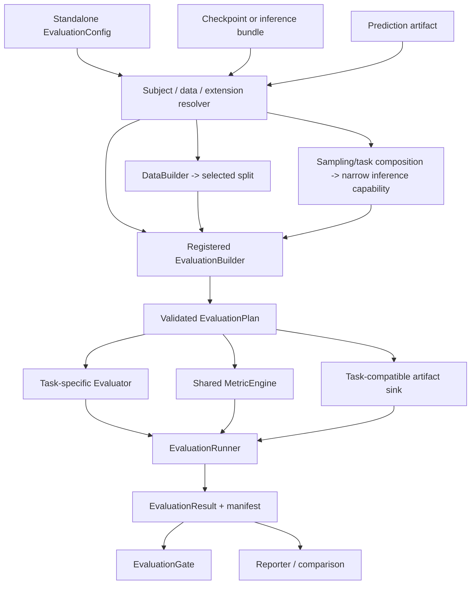

# 训练后 Evaluation 与 Benchmark 支持计划

- 文档性质：开发计划；不属于当前公开 API 或正式用户文档
- 状态：当前普通像素图像生成范围已关闭。E0 outcome foundation、E1 standalone
  checkpoint Evaluation、E2 prediction artifact/offline scoring 与 AFHQ-v2 class-aware
  Gaussian vertical slice 已完成；本文其余 task profile 讨论均为 parked design record，
  不是当前未闭合项或已排期工作
- 统一排期：
  [Development Priority Roadmap](development-priority-roadmap.md)
- 制定日期：2026-07-26
- 本次排期修订日期：2026-08-01
- 前置工作：
  [正式 Metrics 扩展 API](../api/extensions.md#metrics)的 `MetricUpdate`、`MetricEngine`
  与 canonical result contract
- 关联权威：[正式架构说明](../../ARCHITECTURE.md)与根级
  [Roadmap](../../ROADMAP.md)
- 首版范围：独立 checkpoint evaluation、validation/test 治理、live inference、
  可重放 prediction artifact、结构化 result/manifest，以及普通像素图像生成 FID/KID
  vertical slice

范围关闭规则：SR、consistency、latent、codec、distillation 等任务必须在对应任务真正实现时
同步提交 monitoring 与 Evaluation protocol；它们不是本计划的剩余阶段。reference cache、
performance curve、comparison/gate 也只是可选增强，不阻塞当前 pixel-space
learned-range-v closeout 或分支合并。

## 1. 目标与核心结论

本计划补齐“训练已经完成，如何严格评估选定模型”的独立能力。它不只是给
`Trainer.evaluate_epoch()` 多加几个 metric，也不是在 final sampling 后读几张图片。
正式评估必须同时冻结并记录：

- 被评估的 checkpoint、内容摘要和具体权重变体；
- 数据声明、split、样本身份和有效样本数；
- 任务专属推理方法、预处理、后处理、随机性和计算预算；
- metric 实现、版本、backbone、参数和聚合规则；
- prediction、reference cache、图像、曲线和性能测量 artifact；
- 完成状态、失败项、运行环境和可比较的 protocol identity。

推荐结论如下：

1. **Evaluation 是与 Training、Sampling 并列的一等 operation。**
   E1 已增加 checkpoint-backed `run_evaluation()`、`run_resolved_evaluation()` 和
   `stochaflow evaluate`；不实现 `run(kind=...)`，也不把它塞进
   `SamplingBuilder`、`TrainingDiagnostic` 或 `Metric`。
2. **MetricEngine 是 Evaluation 可复用的统计依赖，不是 Evaluation 本身。**
   当前 Training validation 已通过 phase-local MetricEngine 产生 plain canonical
   mapping；E1 `EvaluationRun` 复用 `MetricSpec`、Registry/factory 和 MetricEngine，
   并另外拥有 subject、dataset、protocol、completeness 与 result identity。E2 已补齐
   complete prediction artifact lifecycle 与 offline MetricEngine replay。
3. **Validation、Diagnostic 与独立 Evaluation 的职责不同。**
   同一个 PSNR/FID 算法可以被不同上下文调用，但 Training diagnostic 只记录日志和
   artifact，不产生 selection-eligible result。Training 模型选择只消费 validation
   phase mapping；Evaluation 的治理语义由其显式 purpose/result contract 管理。
4. **正式 test 只接受一个已经冻结的 subject。**
   test 结果永不反馈到 checkpoint selection、early stopping、HPO suggestion 或
   pruning。若需要在训练后比较多个 checkpoint，应在 validation split 上对每个
   subject 运行同一 Evaluation，按预先冻结的 metric 与 direction 普通比较，再对唯一
   选中 subject 执行 final test。
5. **区分 phase evaluation 与 task-level evaluation。**
   `TrainingStrategy.evaluation_step()` 适合 validation/test loss 和低成本 epoch
   metric；SR 完整 restore、Gaussian 生成、consistency 1/2/4 NFE 曲线、FID/KID
   与 latency 属于任务级 evaluation，不能伪装成普通 evaluation step。
6. **EvaluationBuilder 是任务评估的唯一新增 core composition entrypoint。**
   Runner 不理解 image、target、condition、Process family、模型签名或 sampler 名称；
   E1 向 Builder 注入已选 raw/EMA 的 opaque primary model，再组装 task
   evaluator、metric binding 和 protocol。E3 任务若需要完整生成方法，必须消费
   sampling/task 层已组合的窄 capability；AFHQ-v2 slice 已通过绑定 pinned raw/EMA model 的
   `EvaluationSamplingCapability` 和 shared SamplingBuilder execution seam 验证这条边界。
   E2 已增加 artifact sink 与 offline record view。Process/Dynamics/Sampler compatibility
   仍由 SamplingBuilder/sampling composition 拥有。
7. **E1/E2 同时支持 live checkpoint evaluation 与 offline scoring。**
   E2 允许昂贵的生成/restore 先通过 task sink 流式保存带 manifest 的 predictions，再用
   相同或新增 metrics 重评；join 按 exact sample plan 与稳定 sample identity，不依赖目录
   枚举顺序。`prediction_artifact` 已是 strict tagged subject，live sink 成功时随 result
   发布 `predictions/`。
8. **Evaluation 产生事实，Gate 应用政策，Reporter 只展示。**
   绝对阈值、相对 baseline 退化、promotion decision 和 selection policy 不进入
   Metric 或 Evaluator。`incomplete`、missing 和 non-finite 结果默认不能通过 gate。
9. **首版单机单设备、单 subject、fail closed。**
   E2 已完成本地 exact sharding、身份 join 与去重 contract，但在 distributed exact-sharding
   lifecycle 完成前仍不开放正式分布式 benchmark；超预算、跳过样本或部分失败必须显式
   标为 incomplete，不能静默产生“完整”分数。
10. **不同 AFHQ 协议不能只因都叫 FID/KID 就比较。**
    当前三类 official-test DDIM-50 与未来 latent decoded protocol 必须具有不同
    protocol identity。Reporter 可以并列展示，但 Gate 不允许直接计算跨协议 delta。

## 2. 语义划分：Metrics、Validation、Diagnostic 与 Evaluation

### 2.1 不是二选一，而是三个正交问题

用户提出的“metrics 应该是 diagnostic 的独立能力、validation 的重要依据，还是
both”应按三条轴回答：

| 轴 | 回答的问题 | 例子 |
| --- | --- | --- |
| 统计定义 | 数值怎样跨 batch 聚合 | MSE、accuracy、PSNR、FID、KID |
| 执行上下文 | 何时、对什么 subject/data 运行 | train validation、periodic diagnostic、final test |
| 决策政策 | 哪个结果影响什么决定 | best checkpoint、early stop、promotion gate、HPO |

因此推荐 **both**：

- Metric 必须是独立统计能力；
- validation 可以把配置的 Metric 作为模型选择依据；
- diagnostic 可以调用同一个底层算法执行额外 sampling/restore/reference 计算，但只把
  scalar 写入观测日志；
- 独立 Evaluation 也消费同一 MetricEngine，但拥有自己的 subject、数据、协议、
  artifact 与 manifest；
- 一个数值只有被 monitor/selection/gate **显式引用**时才成为决策依据，不能因为
  “已经被记录”就自动影响选择。

### 2.2 精确定义

| 概念 | 生命周期 | 拥有内容 | 明确不拥有 |
| --- | --- | --- | --- |
| Objective | 一个 training step | 可微 scalar loss | 跨 batch 统计、报告政策 |
| Metric | `reset/update*/compute` | 统计 state、归约、数值结果 | 模型调用、checkpoint、split、artifact |
| Validation phase | 训练开发循环中的一个 phase | validation loss/metrics | 正式 test 治理、完整 benchmark |
| Diagnostic | 训练上下文中的按 cadence probe | 额外 forward/sampling/cache/artifact | 通用 test lifecycle |
| Prediction/Sampling | 一次推理或生成 | predictions/samples | reference comparison、质量结论 |
| Evaluation | 一个冻结 subject/data/protocol 的运行 | 推理、metric、measurement、artifact、provenance | 训练更新、搜索建议 |
| Validation comparison | 对同一 protocol 的 validation results 作普通确定性 metric 比较 | subject IDs、primary metric、tie-break 说明 | test split、新 selector runtime |
| Gate | 对既有 EvaluationResult 应用准入政策 | 阈值、baseline delta、pass/fail | 重算 metric、修改 result |
| BenchmarkSuite | 多个版本化 EvaluationCase | 固定数据/推理/metric 协议 | 单一万能 metric |
| Reporter | result 的呈现 | JSON/YAML/Markdown/图表 | 重跑模型、重新解释协议 |

### 2.3 同一个指标在不同上下文中的语义

以 SR 的 LPIPS 和生成任务的 FID 为例：

```text
每 N 个训练 epoch 在固定 validation reference 上运行
    -> Diagnostic context
    -> 只记录观测日志与 artifact，不能成为 validation monitor

训练结束后，对冻结 checkpoint 在 held-out test protocol 上运行
    -> Evaluation context
    -> 形成正式 EvaluationResult

只对已保存的 predictions 重算新 backbone 版本
    -> Offline Evaluation context
    -> 新 protocol/result，不覆盖旧结果
```

Metric 算法本身不需要 `DiagnosticMetric`、`ValidationMetric`、
`EvaluationMetric` 三个继承层次。差异由运行上下文、数据治理和结果用途表达。

### 2.4 两种 “validation” 必须改名避免歧义

- `validation split/phase`：模型开发与选择使用的数据语义；
- “验证 evaluation result 是否达标”：质量准入政策。

后者统一称为 `gate`，不使用 `validate_evaluation_result` 作为用户概念，避免与
validation split 混淆。

## 3. 当前仓库基线与真实缺口

### 3.1 已有可复用能力

| 已有能力 | 对 Evaluation 的价值 |
| --- | --- |
| `DataSource -> DataArtifact`、`DataBuilder -> DataLoaders` | source 负责可验证 artifact，Builder 负责 runtime data composition，batch 保持 `Any` |
| `TrainingStrategy.evaluation_step()` | 现成的训练 phase batch/model 解释边界 |
| C1 后 checkpoint 与 safe loading | config、资产 state、inference recipe、epoch/global step、extension provenance |
| best/latest checkpoint 选择 | 可解析默认候选，但 formal run 仍需冻结具体文件/hash |
| `InferenceModelProvider` | sampling 已有 raw/EMA 只读权重投影经验 |
| `SamplingBuilder` 与 `run_sampling()` | 独立 operation、overlay、manifest、structured result 的先例 |
| diagnostics runtime | RNG、eval mode、EMA 临时切换和 reference cache 的实现经验 |
| 正式 Metrics API | `MetricUpdate`、MetricEngine、canonical key 与 collision/finite policy |
| registry/extension activation | 自定义 EvaluationBuilder 与 metric 的构造边界 |
| E1 standalone Evaluation | strict `EvaluationConfig`、safe checkpoint subject、`EvaluationBuilder -> EvaluationPlan`、single-device runtime、immutable result/manifest |
| E2 prediction replay | streamed canonical JSONL、versioned manifest、exact sample-plan join、offline subject、producer lineage 与 deterministic gallery IDs |
| E3 AFHQ-v2 vertical slice | core `fid`/`kid` adapters、public full-official-test profile、pinned raw/EMA sampling capability、aggregate/per-class completeness 与 live/offline parity |

这些能力应被复用，但不能直接把 training 或 diagnostic callback lifecycle 伪造成
独立 evaluation。

### 3.2 当前训练期 phase evaluation

`Trainer.evaluate_epoch()` 当前：

- 进入 module eval mode 和 `torch.no_grad()`；
- 调用 `TrainingStrategy.evaluation_step()`；
- 按 `loss_aggregation_weight` 聚合 `output.loss`；
- 把 `metric_updates` 交给对应 validation/test phase 的隔离 MetricEngine；
- 返回 loss、batch/duration facts 和配置得到的 canonical phase metric mapping；
- 不把 diagnostic 日志合并进 phase mapping。

训练 epoch 当前近似顺序是：

```text
train
-> validation loss/metric mapping
-> epoch diagnostic logging/artifacts
-> best / early-stop decision from validation mapping
-> checkpoint
```

当前边界有意不把 diagnostic 日志合入 canonical phase mapping。Training 的 validation
mapping 只解决**训练上下文**的模型选择，仍不等于独立 benchmark。

### 3.3 当前训练后路径与独立 Evaluation

E0 完成后的 `_run_single_run()`：

```text
restore selected best checkpoint
-> test evaluate_epoch
-> complete canonical phase-test mapping
-> immutable TrainingRunOutcome
-> console FinalSummary / logger close
-> completed outcome manifest
```

E0 已关闭 training result boundary：`_evaluate_test_split()` 保留 loss、普通 custom
metrics 和 system phase facts；outcome 保留完整 final metrics、best/latest/selected
checkpoint、early-stop 与 manifest/log paths；manifest 先写 `status: running`，只有
reporter 与 logger 成功收尾后才发布 `status: completed` 和 `outcome`，失败不发布
outcome。

E1 另行提供独立 checkpoint evaluation：

```text
strict EvaluationConfig
-> safe v12 checkpoint subject preflight
-> extension activation
-> explicit raw/EMA model resolution
-> checkpoint DataBuilder + validation/test split
-> registered EvaluationBuilder -> EvaluationPlan
-> inference-mode MetricEngine loop + strict sample completeness
-> atomic result.json + evaluation_manifest.yaml publication
-> immutable EvaluationRunOutcome
```

该路径不恢复 optimizer、scheduler、GradScaler 或 training RNG，不构造 TrainingPlan，
也不修改 checkpoint。E2 在其上增加可选 streaming sink、versioned prediction manifest 与
`prediction_artifact` offline branch；producer artifact 保持只读。当前剩余缺口是：

1. phase test 仍没有独立 protocol、数据 fingerprint、样本 identity 或 artifact，training
   outcome 不能替代 formal EvaluationResult；
2. 训练入口仍以 CLI/`argparse.Namespace` 为外层 authority，没有 library-first
   `TrainingRunRequest -> TrainingRunOutcome` API；
3. E3 已关闭 core FID/KID adapters 与 AFHQ-v2 class-aware Gaussian vertical slice，但仍
   没有 SR、通用/latent generation profile、reference cache、performance/curve、comparison、
   selection 或 gate；这些是剩余 E3–E4；
4. 独立 sampling 只生成 artifact，不比较 reference，也不等于 evaluation。

### 3.4 为什么不能只扩展 `Trainer.evaluate_epoch()`

这只能补上 phase metrics，无法表达：

- 从 checkpoint 或 prediction artifact 独立启动；
- 选择 raw、EMA、consistency target 或其他具名推理权重；
- 完整 SR restore 或生成 sampler；
- 多 replicate seed bank；
- reference feature cache；
- predictions 的可重放保存与按 ID join；
- 1/2/4 NFE 多 case benchmark；
- latency/peak memory 协议；
- protocol-compatible comparison、普通 metric 排序说明、result gate；
- 独立结果目录和可比较 protocol digest。

因此 `Trainer.evaluate_epoch()` 应继续成为 phase evaluation primitive；正式
post-training evaluation 由新的 operation 管理。

## 4. 成熟方案调研结论

### 4.1 Lightning：validate、test、predict 是不同语义

[Lightning validation/test 文档](https://lightning.ai/docs/pytorch/stable/common/evaluation_intermediate.html)
把 validation 作为开发过程的一部分，把 test 与 fit 分开，并支持显式
`ckpt_path="best"`；[prediction loop](https://lightning.ai/docs/pytorch/stable/common/lightning_module.html)
只负责推理，不要求 label，也不天然产生评价。

可借鉴：

- validate 可反复运行并参与开发选择；
- test 在选定模型后运行；
- predict/sampling 与 evaluation 分离；
- 大预测结果按 batch 写出，避免全部驻留内存；
- 正式 benchmark 不能接受 distributed sampler 静默重复样本。

### 4.2 TorchMetrics：只提供统计 state

[TorchMetrics](https://lightning.ai/docs/torchmetrics/latest/pages/overview.html)
的稳定价值是 `update/compute/reset`、device state 和 distributed reduction。
train/validation/test 必须使用隔离状态。它不选择 checkpoint、数据 split 或模型调用，
这与当前 task-neutral Metrics subsystem 的边界一致。

### 4.3 Transformers 与 Hugging Face Evaluate：任务适配与 suite

[Transformers Trainer](https://huggingface.co/docs/transformers/main/main_classes/trainer)
区分返回 metrics 的 `evaluate()` 与返回 predictions 的 `predict()`，并由任务注入
`compute_metrics`。

[HF Evaluate Evaluator](https://huggingface.co/docs/evaluate/main/en/base_evaluator)
进一步把 evaluator 定义为 model/pipeline、dataset 与 metric 之间的 task adapter；
不同任务有不同输入列和输出转换。[EvaluationSuite](https://huggingface.co/docs/evaluate/main/en/evaluation_suite)
把多个 evaluator/data/metric case 组合成 suite。

可借鉴：

- Evaluator 负责任务解释，不让 core 猜 `(preds, target)`；
- 一次 case 与多个 case 的 suite 分开；
- Metric、候选 Comparison 与 data/prediction Measurement 分开。

### 4.4 MLflow：Result、Gate 与预计算 predictions

[MLflow Model Evaluation](https://mlflow.org/docs/latest/ml/evaluation)
可评价 live model/function，也可消费预先计算的 predictions，并把 scalar metrics、
plots、tables 组成独立 result。准入阈值由 result validation/gate 逻辑处理。

Stochaflow 直接采用以下语义：

```text
Evaluation produces facts
Gate applies policy
Reporter presents facts
```

### 4.5 生成模型：Benchmark 不是一个 FID

[Diffusers evaluation 指南](https://huggingface.co/docs/diffusers/main/conceptual/evaluation)
明确提醒单一 CLIP/FID 示例不足以代表现代生成评估，并指向 HEIM、GenEval、
T2I-CompBench 等完整协议。

成熟 benchmark 固定的是：

- dataset/prompts 和版本；
- inference 参数、seed、每输入样本数；
- 输出预处理；
- evaluator/backbone/version；
- metrics 与性能测量；
- generations、失败项和报告。

因此外部
[HEIM](https://crfm.stanford.edu/heim/v1.0.0/)、
[GenEval](https://github.com/djghosh13/geneval)、
[T2I-CompBench](https://github.com/Karine-Huang/T2I-CompBench)
应通过 extension EvaluationBuilder 或 exporter 接入，不硬编码进 core。

AFHQ 与未来 latent generation 提供一个直接的仓库内反例：

```text
pixel AFHQ showcase:
    class-conditional generated samples
    official-test reference
    class-conditional CFG
    DDIM-50

latent AFHQ profile:
    decoded latent samples
    separately frozen reference transform
    class-conditional CFG
    independently versioned sampler/codec
```

两者的 FID/KID estimator、reference transform、sample count、condition allocation
和 solver/codec 均可能不同。不能通过给结果字段都命名为 `fid` 绕过 protocol
comparison guard。

### 4.6 Super resolution：必须同时看 distortion 与 perception

[Perception-Distortion Tradeoff](https://arxiv.org/abs/1711.06077)
说明低 distortion 与感知质量存在基本张力。SR 不能只用 FID 宣称遵从 LR condition，
也不能只以 PSNR 宣称感知质量最好。

成熟实现还表明 metric preprocessing 是协议的一部分：

- [BasicSR PSNR/SSIM](https://github.com/XPixelGroup/BasicSR/blob/master/basicsr/metrics/psnr_ssim.py)
  明确 crop border、颜色空间和输入范围；
- [LPIPS](https://github.com/richzhang/PerceptualSimilarity) 需要固定 backbone、
  权重版本和输入归一化；
- [CleanFID](https://github.com/GaParmar/clean-fid) 强调 resize、antialias、
  量化等实现差异；
- [TorchMetrics KID](https://lightning.ai/docs/torchmetrics/stable/image/kernel_inception_distance.html)
  需要记录 subset 数、subset size 和 metric RNG；其 subset-resampling mean/std
  与跨 generation-replicate 的 mean/std 是两层不同统计量，result key 不得复用。

## 5. 不变量与数据治理

### 5.1 Subject 必须冻结

一次正式 evaluation 的 subject identity 至少是：

```text
checkpoint/bundle/prediction artifact content digest
+ resolved model weight variant
+ inference profile digest
+ extension/component provenance
```

规则：

- checkpoint path 只是定位信息，内容 digest 才参与 identity；
- `weights:auto` 若允许，只能在 resolve 阶段按已声明政策变成具体
  `primary`、`ema` 或 `auxiliary:<id>`，结果中不能保留未解析的 `auto`；
- final test/benchmark 推荐要求显式 variant；
- precision、compile、tile、guidance、sampler、steps/NFE、condition adapter 和
  output postprocess 都属于 inference profile；
- 改变其中任一字段必须产生新的 evaluation/protocol identity，不能覆盖旧结果；
- operation 只读 subject，不修改 checkpoint、best pointer、EMA 或 training state。

### 5.2 Checkpoint choice 与 final test 分离

```text
periodic/best checkpoints
-> one validation EvaluationResult per checkpoint
-> ordinary comparison of one declared validation metric
-> frozen selected subject
-> exactly one final test evaluation
```

规则：

- selection 只消费 validation split/result；
- final test 接受一个 subject，不接受候选列表或 selection policy；
- test 上比较 raw/EMA、多个 NFE、tile 或 checkpoint 后再挑最好，属于数据泄漏；
- 若 final test 暴露实现错误，应把旧 result 标记 invalid 并升级 protocol version，
  不能静默调参后覆盖；
- test result 不进入 Training canonical mapping、HPO engine 或下一轮 suggestion；
- benchmark 可包含多个预先声明的 inference cases，但不能事后选择其中 test 最优者
  冒充唯一 final model。

### 5.3 Sample identity 与完整性

Evaluator 不允许 core 从任意 batch 推断 batch size 或 sample ID。具体 Builder/
Evaluator 必须显式产生：

- `num_examples`；
- 稳定且唯一的 `input_id` / `sample_id`；
- stochastic task 的 `replicate_index`；
- expected 与 observed count；
- failed/skipped IDs 和原因。

formal protocol 默认 `strict_complete: true`。以下情况失败或标为 incomplete：

- 重复 ID；
- prediction/reference 缺失或多余；
- 实际 count 与冻结 sample plan 不一致；
- metric state 没有成功 compute；
- non-finite result；
- artifact 写入或 digest 失败。

首版单机单设备。未来分布式运行必须证明 exact sharding、不 padding 重复样本，并对
Metric state 与 artifact ID 做全局去重后才能标为 complete。

### 5.4 随机任务的 SamplePlan

建议冻结：

```text
seed(input_id, replicate_index)
    = stable_derive(evaluation_seed, input_id, replicate_index)
```

每个样本/replicate 构造独立 generator，不能依赖一个随 batch 顺序不断消耗的全局
generator state。这样 batch size、worker 顺序或后续 exact sharding 不改变样本。

规则：

- validation selection 与 final test 使用不同 seed bank；
- consistency 不同 NFE case 使用相同 input/replicate seed，便于配对比较；
- 确定性 SR 默认 `replicates_per_input=1`；
- stochastic SR/生成记录 input count、K 和总 generated count；
- paired metric 先按 input 聚合 K 个 replicate，再对 input 等权聚合；
- `best-of-K` 必须命名为 oracle/diagnostic metric，禁止进入 selection；
- FID/KID 对比要求相同 sample plan 和总生成数量。

## 6. 总体架构



依赖规则：

1. Resolver 只处理 authority、safe loading、extension activation 和只读 state
   projection；
2. DataSource 仍是 artifact-producing extension entrypoint，DataBuilder 仍是 runtime
   data composition entrypoint；Evaluation 不新增 Dataset/loader registry；
3. SamplingBuilder 或由 sampling/task 层拥有的 factory 继续组合 model adapter、
   condition、guidance、initialization、Process/Dynamics/Sampler，并注入一个已验证的
   窄 inference capability；
4. EvaluationBuilder 只把 subject、selected data、该 inference capability、Evaluator、
   metric binding 和 writer 组合为评估，不重新解释 sampling compatibility；
5. Evaluator 解释 batch、调用注入的 Strategy/direct/inference capability 并产生
   metric payload；
6. MetricEngine 只管理统计 state；
7. Runner 只管理 device、eval/inference mode、loop、预算、dispatch、完成状态和发布；
8. Gate/Reporter 读取不可变 result，不重新运行模型或修改事实。

### 6.1 候选 source tree

```text
src/stochaflow/
├── metrics/                    # 与 Training 共用；不放入 evaluation/
│   ├── contracts.py
│   ├── factory.py
│   └── runtime.py
├── evaluation/
│   ├── config.py               # standalone EvaluationConfig
│   ├── contracts.py            # request/outcome/result/protocol
│   ├── builder.py              # EvaluationBuilder context/base
│   ├── subject.py              # checkpoint/prediction read-only resolvers
│   ├── runtime.py              # run_evaluation/EvaluationRunner
│   ├── artifacts.py            # sink + portable references
│   ├── comparison.py           # result-only comparison/selection
│   ├── gates.py                # result-only acceptance policy
│   └── reporting.py            # read-only reporters
└── scripts/
    └── evaluation_cli.py       # thin CLI adapter
```

任务专属 evaluator/profile 优先放在拥有该 task method 的 first-party extension/project；
只有形成稳定跨项目能力后才进入 `stochaflow.evaluation` 的 built-in catalog。core
package 不按图像、SR、Gaussian 或 consistency 建子目录来暗示通用 modality schema。

## 7. Operation 与配置权威

### 7.1 独立 library API

E1/E2 当前公开的可执行入口是同一个 path-first API：

```python
outcome = run_evaluation(
    "configs/evaluation.yaml",
    output_dir="outputs/evaluations/candidate-a",
    device_name="cuda",
    force_extension_version_mismatch=False,
)
```

需要自行控制 extension activation 的调用方使用两阶段 seam：

```python
inputs = resolve_evaluation_inputs("configs/evaluation.yaml")
extensions = activate_extension_plugins(inputs.extension_plan, policy=...)
outcome = run_resolved_evaluation(inputs, extensions, device_name="cuda")
```

checkpoint subject 本身也分两阶段：`load_checkpoint_subject()` 只安全读取一次 v12
payload、解析 config/provenance/data identity；插件激活后
`resolve_checkpoint_subject()` 才构造配置明确选择的 raw 或 EMA primary model。
`EvaluationBuilder` 只接收已经选定的 model capability，无权重新选择权重。
prediction-artifact subject 则由 `load_prediction_artifact_inputs()` 在插件激活前认证
manifest/shards/config/provenance，随后 `resolve_prediction_artifact()` 只暴露 immutable
records/identity；它不构造 model 或原 DataBuilder。

当前 `EvaluationRunOutcome` 是 immutable local view：

```python
@dataclass(frozen=True, slots=True)
class EvaluationRunOutcome:
    evaluation_id: str
    protocol_id: str
    status: str
    output_dir: Path
    subject: Mapping[str, Any]
    split: str
    metrics: Mapping[str, float]
    measurements: Mapping[str, float]
    artifacts: Mapping[str, Path]
    manifest_path: Path
    result_path: Path
    gate_result_path: Path | None
```

`EvaluationRunRequest` contract 已存在，但当前 path-first runtime 不以它作为执行入口；
同样，library-first `TrainingRunRequest -> TrainingRunOutcome` 仍未实现。不要把 E1/E2 写成
统一三-operation request facade 已经完成。

failure 直接抛出有类型异常，不返回伪成功 outcome。runtime 只在整份 bundle 成功时才
原子发布可选 `predictions/`、`result.json`、`resolved_evaluation.yaml` 和最后的 completion
manifest；失败时清理未发布目录且不修改 producer artifact。`strict_complete: false` 可
产生显式 `incomplete` result，但 E4 gate 尚未实现。

### 7.2 EvaluationConfig 是独立 authority

像 tuning config 一样，evaluation config 不应成为 `StochaflowConfig` 的新顶层字段。
它引用 checkpoint/bundle/predictions，并定义本次 protocol：

```yaml
version: 1
name: sr-x4-final-test
purpose: final_test

extensions:
  plugins: [my-project]

subject:
  kind: checkpoint
  path: outputs/sr/checkpoints/best.pt
  weights: ema

data:
  source: checkpoint
  split: test

evaluation:
  name: my-project.paired-super-resolution
  params:
    inference:
      scale: 4
      tile: null
      precision: fp32
    sample_plan:
      seed: 20260726
      replicates_per_input: 1

metrics:
  - id: psnr_rgb
    name: my-project.psnr
    channel: sr.prediction_target
    params:
      data_range: 1.0
      crop_border: 4
      color_space: rgb
  - id: ssim_rgb
    name: my-project.ssim
    channel: sr.prediction_target
    params:
      data_range: 1.0
      crop_border: 4
      color_space: rgb

protocol:
  id: sr-x4-rgb-v1
  expected_examples: 100
  strict_complete: true
```

严格规则：

- unknown field 失败；
- `purpose: selection_candidate` 只允许 `validation`，`final_test` 只允许 `test`，
  `benchmark` 可以显式选择二者之一；
- `subject.kind` 与 `data.source` 必须同为 `checkpoint` 或 `prediction_artifact`；checkpoint
  `weights` 必须显式为 `raw` 或 `ema`，不接受 `auto`，prediction subject 不接受
  `weights`；相对 subject path 以 evaluation YAML 所在目录解析；
- `data.source: checkpoint` 复用 checkpoint resolved config 中的 DataBuilder declaration；
  `prediction_artifact` 认证 producer data identity/split 并直接提供 ordered records，不重建
  原 DataBuilder；
- split 只允许 `validation` 或 `test`；offline split 必须与 producer manifest 一致；显式
  外部 benchmark data authority 属于后续扩展；
- evaluation config 不能覆盖 checkpoint 的 model/process 训练声明；
- 可以覆盖的是任务 Builder 明确支持的 inference/evaluation 参数；
- `evaluation.name` 必须解析为注册的 `EvaluationBuilder`，`metrics[].name` 必须解析为
  注册的 Metric；core 不提供通用 image/SR/FID evaluator；
- `protocol.expected_examples` 是正整数，`strict_complete` 默认 `true`；duplicate sample
  ID、超额样本或 strict count mismatch 都 fail closed；
- config schema 没有 `artifacts`、`gate` 或 `comparison` 字段；prediction subject 已由 E2
  tagged union 实现，gate/comparison 仍属于 E4；
- resolved config、config SHA-256、checkpoint identity、provenance、completeness 和
  runtime options 写入 result/manifest。

`purpose` 首版只允许：

| purpose | 合法 split | 决策资格 |
| --- | --- | --- |
| `selection_candidate` | validation | 产生候选事实；调用方可按冻结 metric 普通比较 |
| `final_test` | test | 当前只报告；不能 selection/HPO，E4 才提供 gate |
| `benchmark` | 显式 validation 或 test | 当前只报告；若未来要选模须另跑 `selection_candidate` |

一个 `EvaluationRun` 始终只评估一个 subject。训练后选模由调用方重复运行完全相同的
validation Evaluation，并对 protocol-compatible results 的冻结 metric 做普通比较；不新增
selector runtime、registry 或 public contract。`BenchmarkSuite` 消费/调度多个预声明
cases。这样 purpose 不会演变成一个让 Runner 按模式执行任务数学的枚举。

### 7.3 Config 中的 Metric declaration

当前 `stochaflow.metrics.MetricSpec` 已经是 task-neutral 的数据化声明；Training 配置层
通过组合添加 `phases`，独立 Evaluation 不需要 phase binding。Evaluation 应直接复用
`MetricSpec`、Registry/factory 和 MetricEngine，不建立第二个 `EvaluationMetric`
层次：

```python
@dataclass(slots=True)
class MetricSpec:
    id: str
    name: str
    channel: str
    params: dict[str, Any]
```

精确 YAML 可保持简洁写法。factory、registry resolver、scalar flatten、payload 和
non-finite contract 由 Training 和 Evaluation 共用；Evaluation 自己的 dataset、split、
metric preprocessing/version 与 protocol identity 则写入 Evaluation manifest/result，
不能附着为 Training scalar mapping 的逐 key metadata。

## 8. Subject resolution 与 checkpoint 投影

### 8.1 Subject 使用 tagged union

E1/E2 已实现：

```text
CheckpointSubject
PredictionArtifactSubject
```

E5 后续再评估：

```text
InferenceBundleSubject
```

三者的 resolver 和所需字段不同，不用一个包含
`checkpoint/bundle/predictions/model=None` 的万能 data class。

### 8.2 CheckpointSubject

checkpoint resolver 负责：

- safe loading 与 schema/version 检查；
- extension identity/version preflight；
- content digest；
- resolved training config 与 selected component provenance；
- E1 primary model 的只读 state projection；后续任务所需 process/auxiliary
  必须通过明确的 inference asset contract 增加；
- requested weights 到 concrete variant 的解析；
- checkpoint epoch/global step 与 lineage。

E1 的实际 seam 是 `load_checkpoint_subject()` 与
`resolve_checkpoint_subject()`。前者使用 `torch.load(..., weights_only=True)` 读取一次
checkpoint，并冻结 SHA-256、v12 format、epoch/global step、normalized training config、
extension provenance、selected components、lineage 与 data artifact bindings；后者在
extension activation 后构造已显式选择的 primary model。result subject 使用平面
`requested_weights`/`resolved_weights`，不会把可再次选择 raw/EMA 的 provider 交给
EvaluationBuilder。

它明确忽略：

- optimizer/scheduler state；
- gradient scaler；
- training RNG resume state；
- early-stopping/best-tracking mutable state；
- training logger/diagnostic callback；
- 不属于 evaluator 的 frozen teacher 或 auxiliary。

它不调用要求 optimizer/scheduler topology 完全匹配的 training restore；
Training restore 继续使用严格完整 restore。E1 只从已安全加载的 checkpoint
payload 构造并 strict load 所选 primary model。后续若需 process、codec 或其他
auxiliary，应复用 checkpoint/sampling 的公开 inference asset projection，不建立第二套
task-specific checkpoint restore。

### 8.3 PredictionArtifactSubject

prediction artifact 至少包含：

```text
schema/version and artifact digest
producer evaluation/sampling identity, normalized training config and extension provenance
source subject identity/digest
resolved weight variant
inference profile and digest
sample plan and digest
sample IDs / input IDs / replicate indexes
canonical JSONL shard paths, sizes, counts, media types and content digests
producer data identity and governed split
preprocess/postprocess identity
deterministic gallery method/protocol/sample IDs
missing/unexpected/duplicate/failed/skipped records
completion status
```

规则：

- 当前 built-in sink/loader 只使用 strict canonical JSON manifest 与 canonical JSONL record
  shards；path 必须是 normalized portable relative path，不加载任意 pickle；其他安全格式
  需先新增显式 format contract，不能由扩展自行塞入现有 schema；
- prediction 按 manifest 的 ordered sample plan 与 exact
  `sample_id/input_id/replicate_index` join，不按文件名排序、shard 内顺序或目录遍历顺序
  join；
- manifest、artifact、sample-plan 与 shard digest/size/count 全部重算；missing、duplicate、
  unexpected、corrupt、identity/split/gallery mismatch 均 fail closed；
- offline scoring 生成新的 EvaluationResult，不修改 producer manifest；
- loader 只接受对其 exact sample plan 为 complete 的 prediction artifact；evaluation 相对
  protocol 的 complete/incomplete 状态仍单独记录；
- 增加 metric 不要求重新生成，但改变 inference profile 必须重新产生 predictions。

### 8.4 不自动重建完整 TrainingPlan

独立 evaluation 不能假定任意 `TrainingBuilder` 都能在没有训练环境时重建：

- frozen teacher bundle 可能只在 distillation 时需要；
- optimizer/scheduler constructor 可能需要 trainable parameter topology；
- training diagnostic/cache 不是 inference dependency；
- 复杂 Builder 的私有训练输入可能已不再可用。

因此 task EvaluationBuilder 应通过 checkpoint 的只读资产声明和任务 inference helper
构建 evaluator。只有某个具体 Builder 明确支持时，才可复用
`TrainingStrategy.evaluation_step()`；core 不提供“任意 TrainingBuilder 自动变成
Evaluator”的承诺。

## 9. EvaluationBuilder、Plan 与 Evaluator

### 9.1 唯一新增注册入口

```python
class EvaluationBuilder(ABC):
    def __init__(self, context: EvaluationBuilderContext) -> None:
        self.context = context

    @abstractmethod
    def build(self) -> EvaluationPlan:
        """Build and validate one evaluation composition."""
```

`EvaluationBuilderContext` 提供：

- 深复制后的私有 params；
- resolved read-only subject；
- checkpoint 路径提供 DataBuilder 已组装并按治理规则选出的单个 iterable 与 data
  identity；prediction 路径提供按 authenticated sample plan 排序的 typed records 与
  producer data identity；两者都不暴露未选择的 train/validation/test iterable；
- checkpoint subject 提供已选定 raw/EMA 后的窄 inference capability；offline subject 的
  inference 为 `None`；
- runtime 管理的 unpublished absolute `artifact_root`，供可选 task sink 使用；
- 不可变的 metric declarations；
- `EvaluationProtocol`。

Builder 不拥有 CLI parsing、全局目录选择、reporter 或 sampling composition；它拥有
完整 **evaluation composition validation**。当前 core 没有内置 task EvaluationBuilder；自定义
Builder 通过 `REGISTRIES.evaluation_builders` 的统一 registry/factory 路径构造。

### 9.2 EvaluationPlan

当前 contract：

```python
@dataclass(frozen=True, slots=True)
class EvaluationPlan:
    evaluator: Evaluator
    data: Iterable[Any]
    metric_specs: tuple[MetricSpec, ...]
    protocol: EvaluationProtocol
    subject: object
    data_identity: Mapping[str, Any]
    artifact_sink: EvaluationArtifactSink | None = None
    modules: Mapping[str, torch.nn.Module] = field(default_factory=dict)
```

E1/E2 Plan validation 验证：

- data 是可重入 iterable，不是 one-shot iterator；
- evaluator 实现 `Evaluator`，其 `metric_channels` 覆盖所有声明的 metric
  channel；
- subject 已解析，protocol 是 `EvaluationProtocol`；
- `data_identity`、`metric_specs` 和 module mapping 可被安全快照；
- Builder 返回的 subject、data、protocol、data identity 和 metric declarations
  原样保留 context 注入值；
- artifact sink 若存在必须满足 `consume/finalize/abort` structural contract，且 finalize
  返回 complete `PredictionArtifactDraft`；
- module mapping 只包含 `torch.nn.Module`，runtime 额外要求其声明已注入的
  checkpoint primary model；offline plan 可以为空。

Artifact sink 与 offline subject 已在 E2 进入同一个 `EvaluationPlan`/runtime 边界；core
仍不解释 record payload 或 task inference 数学。

不要给 `Process`、`Sampler`、`GenerativeDynamics` 或模型根添加 universal
`evaluate()`/`predict()`。

### 9.3 Evaluator 负责 batch 与模型语义

当前窄 contract：

```python
class Evaluator(Protocol):
    @property
    def metric_channels(self) -> Collection[str]:
        ...

    def evaluate_batch(self, batch: Any) -> EvaluationStepOutput:
        ...


@dataclass(frozen=True, slots=True)
class EvaluationStepOutput:
    num_examples: int
    sample_ids: tuple[str, ...]
    metric_update_groups: tuple[
        Mapping[str, MetricUpdate], ...
    ]
    records: Any | None = None
    measurements: Mapping[str, float] = field(default_factory=dict)
```

说明：

- `metric_update_groups` 允许同一 batch 对 set metric 先后提交 reference/generated
  payload；每组仍复用正式 Metrics API 的普通 channel mapping；
- channel 的 args/kwargs 由 task contract 决定，Runner 不理解 `real=True`、
  prediction、target 或 condition；
- `num_examples` 显式给出，Runner 不从任意 batch 猜 shape；
- `sample_ids` 用于完整性、join 和 per-sample artifact；
- `records` 对 core 的 task payload 仍不透明；E2 optional sink 只校验 typed
  `PredictionRecord` identity 并流式持久化；
- live task Evaluator 调用已注入的 inference capability，offline Evaluator 解释已认证的
  record payload；两者都不构造 model adapter、condition、guidance、initial state 或数值
  Sampler；
- Evaluator 不移动 module、选择 checkpoint、打开输出路径或直接发布最终 result。

### 9.4 Runner 生命周期

E1/E2 当前生命周期：

```text
strict parse config + tagged subject preflight
-> extension provenance check and activation
-> checkpoint branch:
     resolve explicit raw/EMA primary model on one device
     checkpoint DataBuilder and validation/test split selection
   prediction-artifact branch:
     authenticate complete manifest and canonical JSONL shards
     exact-ID join records into the ordered sample plan; inference=None
-> create unpublished artifact staging root
-> construct EvaluationBuilderContext(subject, data, data identity, optional model,
                                      artifact root, metric specs, protocol)
-> EvaluationBuilder.build()
-> plan.validate()
-> checkpoint branch requires plan.modules to declare the injected model
-> seed/device/eval mode/torch.inference_mode()
-> MetricEngine.reset()
-> for each work batch:
     evaluator.evaluate_batch()
     validate positive count and globally unique sample IDs
     MetricEngine.update() for every update group
     optional artifact_sink.consume(step output)
     example-weighted measurement update
-> MetricEngine.compute()
-> protocol completeness/finite/collision checks
-> optional sink.finalize(); require its ordered sample plan == observed IDs
-> offline branch additionally requires observed ordered IDs == producer sample plan
-> optional complete prediction manifest/shards staged as predictions/
-> atomically publish predictions + resolved_evaluation.yaml + result.json
   + final evaluation_manifest.yaml
-> return immutable EvaluationRunOutcome
```

Runner core 不按 evaluator name、task、Process family、metric id 或 recipe name 分支。
`artifact_sink.consume/finalize/abort`、prediction shards 与 offline subject 已属于 E2；
reference-cache/quality-profile 属于 E3，gate、comparison 与 suite 属于 E4。

### 9.5 Phase evaluator 与 task evaluator

首批明确分两类：

1. **Phase evaluator**
   - 对一个已经合法构造的 Strategy/plan 调 `evaluation_step()`；
   - 产生 loss 和普通 MetricUpdate；
   - 适合 train-run 内 validation/test convenience；
   - 不额外运行完整 sampler。
2. **Task evaluator**
   - 运行用户最终行为：generate、restore、reconstruct；
   - 使用 sampling/task composition 注入的 task-specific method/capability，并组合
     evaluation-specific reference cache 和 artifact sink；
   - 适合独立 post-training evaluation；
   - 不伪造 `TrainEpochEndEvent`，不复用 TrainingDiagnostic callback 外壳。

对于数值采样，SamplingBuilder 仍是 adapter、condition、guidance、initialization
以及 Process/Dynamics/Sampler compatibility 的唯一 composition owner。checkpoint branch
只注入已选择的 opaque primary model，offline branch 注入已认证 records；具体
EvaluationBuilder 若需要完整 generation method，
必须复用 task-local sampling/inference helper，而不能在 core runner 增加算法分支。
对于 direct transform，同一个 task-local method factory 可以同时服务 SamplingBuilder 与
EvaluationBuilder，但不要求它伪造 numerical Sampler。任何路径都不能各自复制
solver/condition 数学。

## 10. Metrics、Measurements 与 Reference Cache

### 10.1 共用 MetricEngine

EvaluationRunner 使用正式 Metrics API 的同一构造和 runtime contract：

- Stochaflow 少量 built-in metric 走 `REGISTRIES.metrics`；
- extension metric 走同一 registry；
- 每个 EvaluationRun 构造独立 state，不能与 Training 或其他 run 共享；
- `reset -> update* -> compute -> publish` 严格成对；
- canonical scalar flatten、collision 与 NaN/Inf 逻辑共用；direction 属于 Evaluation
  config/result policy；
- metric 不进入 optimizer、checkpoint managed asset 或 model mode lifecycle。

Evaluation canonical keys：

```text
eval/metrics/<metric-id>[/<subkey>]
eval/measurements/<measurement-id>[/<subkey>]
eval/system/...
```

`valid/*`、`test/*` 保留给 training phase mapping。EvaluationResult 单独记录
`data.split` 和 `purpose`，不通过 key prefix 暗示治理语义。

### 10.2 Paired 与 distribution metric 不要求万能签名

典型 channel：

```text
sr.prediction_target
generation.reference
generation.generated
generation.prompt_prediction
performance.forward_event
```

这些只是具体 Evaluator 的公开 payload contract，不是 core batch schema。

- PSNR/SSIM/LPIPS 可绑定 paired prediction-target channel；
- FID/KID 可由 evaluator 在同一 step 产生 reference 与 generated 两组更新；
- CLIP-like metric 可绑定 prompt-prediction channel；
- 一个 metric 需要多个 channel 或 reference cache 时，由具体 Builder 构造 binding/
  adapter，不给 `Metric` 根增加大量 optional 方法；
- signature compatibility 用独立 custom Evaluator/Metric contract test 保证，不用
  constructor introspection 或 YAML path DSL。

### 10.3 Measurement 与 Metric 分开

以下值通常不是模型质量 Metric：

- latency、throughput；
- peak allocated/reserved memory；
- model/parameter count；
- cold-start/load time；
- failed/skipped sample count；
- cache hit/miss 和 I/O time。

它们进入 `measurements`，使用自己的 measurement collector/protocol。这样 quality
metric direction、统计聚合和 HPO monitor 不会被 system telemetry 混淆。

### 10.4 Reference cache

FID/KID 等 reference state 可以内容寻址缓存。cache key 至少包含：

```text
cache schema version
metric provider and version
extractor architecture / weights digest / feature layer
resize / antialias / quantization / normalization / color / range
dataset fingerprint / split / exact sample IDs and count
feature dtype
```

规则：

- key 任一字段变化必须 cache miss；
- 写入使用临时文件后原子替换；
- FID 可缓存 count/mean/covariance；
- KID 通常需缓存 reference feature vectors；
- cache hit 与 fresh compute 必须有数值等价测试；
- reference cache 只节省计算，不改变 split governance；
- test reference cache 的存在不授权 HPO 或 selection 反复消费 test；
- cache state 由 task evaluator/provider 管理，不进入通用 Metric 根。

## 11. Prediction artifact、Artifact Sink 与 Reporter

### 11.1 为什么必须保存 predictions

生成模型和 SR 的推理通常比评分更昂贵。可重放 predictions 支持：

- 增加或升级 metric，而不重新生成；
- 多 evaluator 对同一固定输出评分；
- 自动指标、人类评估和 gallery 共用输出；
- 复核 sample failure、预处理和 subject identity；
- 将 inference 性能与 metric 计算耗时分开。

live evaluation 可以同时流式评分和保存；offline evaluation 只消费已冻结 artifact。

### 11.2 ArtifactSink 边界

`EvaluationArtifactSink` 是 Builder 注入的 task-compatible consumer：

```python
class EvaluationArtifactSink(Protocol):
    def consume(self, output: EvaluationStepOutput) -> None:
        ...

    def finalize(self) -> Mapping[str, Path]:
        ...
```

Runner 只调用生命周期并验证返回路径位于 evaluation output directory 内。具体 sink
拥有：

- image/tensor/table 的编码；
- sample ID 到 shard/path 的映射；
- task-specific range、color 和 metadata；
- streaming/flush；
- per-sample metric table；
- deterministic gallery。

它不重新调用模型、计算正式 aggregate metric 或选择“最好看的”样本。

### 11.3 Gallery 不得人工挑好图

正式报告中的 gallery 使用：

- 配置中预先声明的 sample IDs；或
- 对 protocol ID + sample ID 的稳定 hash 规则。

可以另列预先定义的 hard cases/outliers，但不能运行后浏览全部结果再只保留成功样本。
gallery selection 规则、缺失 ID 和所有原始 prediction references 进入 manifest。

### 11.4 Reporter 不重算事实

Reporter 读取 `EvaluationResult` 生成：

- console summary；
- JSON/YAML；
- Markdown/HTML；
- metric table、quality-speed curve；
- fixed gallery references。

Reporter 不能：

- 重新加载 checkpoint；
- 更改 metric preprocessing；
- 丢弃 incomplete/non-finite 标志；
- 把不同 protocol digest 的数值画成可直接比较序列而不显式标注；
- 根据结果修改 gate threshold。

## 12. EvaluationResult、Comparison、checkpoint choice 与 Gate

### 12.1 结果模型

E1/E2 已实现的数据模型：

```python
@dataclass(frozen=True, slots=True)
class EvaluationResult:
    schema_version: int
    evaluation_id: str
    protocol_id: str
    protocol_digest: str
    status: str
    subject: Mapping[str, Any]
    data: Mapping[str, Any]
    metrics: Mapping[str, float]
    measurements: Mapping[str, float]
    artifacts: Mapping[str, Any]
    completeness: Mapping[str, Any]
    provenance: Mapping[str, Any]
```

`EvaluationRunOutcome` 是本地运行后的便利 view，可包含 `Path`；可移植
`EvaluationResult` 使用 JSON-shaped immutable mappings。checkpoint subject 记录
path/SHA-256、format、epoch/global step、requested/resolved weights、lineage、extension、
selected components 与 data artifact identity；prediction-artifact subject 记录
artifact/manifest/sample-plan digest、producer、原 source subject、resolved weights、
inference/pre/postprocess/gallery 与 extension lineage。data 分别记录 checkpoint DataBuilder
identity，或 producer data 加 artifact/sample-plan identity。只有 Plan 声明 sink 时
`artifacts` 才包含 portable `predictions/prediction_manifest.json` reference；reference-cache
artifact 仍属于 E3。

### 12.2 最低 manifest

E1/E2 每次成功运行记录：

```text
schema/version, evaluation id, protocol id/digest, purpose, status
evaluation config source/digest and resolved config
subject kind and checkpoint or prediction-artifact identity/lineage
checkpoint epoch/global step or producer/source-subject/sample-plan digests
requested/resolved weight variant or artifact-retained resolved weights
DataBuilder declaration or producer data identity, governed split and artifact bindings
expected/observed/unique/missing counts and sample-ID digest
EvaluationBuilder/metric declarations and extension provenance
finite eval/metrics/* and eval/measurements/* scalars
device, seed, runtime options and completeness
optional prediction manifest/shard references and digests
```

E2 已补 prediction references、exact sample manifest、pre/postprocess、sample-plan、gallery
与 producer lineage。E3 再补 reference-cache、metric backbone/version 与 task quality
protocol；performance profile 后续冻结 latency/warmup/sync/repeat 环境事实。core 不通过
检查任意 Dataset 内部字段来猜 fingerprint。

runtime 只向不存在的新 output directory 发布；predictions、resolved config、result 与最后的
`evaluation_manifest.yaml` 全部先写入 sibling staging，再以 no-replace directory rename
原子发布。任何失败都会清理 staging 且不修改既有目标。E4 可选 GateResult 将是独立
sidecar；当前
`EvaluationRunOutcome.gate_result_path` 始终为 `None`。

### 12.3 Comparison

Comparison 是既有 results 上的只读操作：

- 默认只比较相同 `protocol_digest`；
- baseline 与 candidate 的 metric direction 必须已知；
- 对 paired sample-level results 可做显式统计比较；
- protocol 不同只能生成“不可直接比较”的并列报告；
- comparison result 记录输入 result digests，不覆盖原结果；
- 不重新运行模型。

### 12.4 Checkpoint selection by comparison

训练后若要用完整 restore/generation 质量选择 checkpoint：

```text
one EvaluationResult per candidate on validation
-> compare one declared primary metric and direction
-> freeze the winning checkpoint subject
```

这不是另一套 selector runtime。调用方只对 protocol-compatible validation results 做普通、
确定性的比较。比较输入必须预先冻结：

- primary metric + direction；
- 绝对约束；
- minimum improvement；
- tie-break；
- candidate eligibility；
- missing/non-finite/incomplete rejection。

SR 推荐优先用约束，而不是无解释的加权和，例如：

```text
minimize validation LPIPS
subject to PSNR >= declared floor
tie-break by latency, then training step
```

FID/KID 不应作为 conditional SR 唯一 selection metric，因为它们不能证明输出遵从
对应 LR input。若调用方发布 comparison artifact，它应记录候选 result digest、排除原因、
比较规则、胜者和冻结 subject identity，但该 artifact 不是新的 framework contract。比较
只能接受 validation results；输入包含 test result 时立即失败。

### 12.5 Gate

Gate 对一个或一组 result 应用 release/promotion policy：

```yaml
gate:
  rules:
    - metric: eval/metrics/psnr_rgb
      min: 28.0
    - metric: eval/metrics/lpips
      max: 0.21
    - metric: eval/measurements/model_latency_ms_p50
      max: 12.0
    - metric: eval/metrics/fid
      max_regression_from: baselines/sr-x4-v1/result.json
      delta: 1.5
```

规则：

- absolute threshold 与 baseline-relative rule 分开验证；
- baseline 必须 protocol-compatible；
- missing、non-finite、invalid 和 incomplete 默认 fail；
- gate 产出独立 `GateResult` sidecar，单向引用 immutable EvaluationResult digest，
  不改 metric/result/manifest；
- evaluation 可以 `status="complete"` 而 gate 为 failed；二者分别表示事实是否完整和
  acceptance 是否通过；
- gate fail 不自动触发 HPO、重新训练或 test 上重新选择；
- threshold 来源和变更必须版本化。

## 13. 首批任务 Evaluation Profiles

### 13.1 Training phase profile

用途：保持现有 train/validation/test convenience，并与 formal EvaluationResult 分离。

内容：

- objective/loss 的显式 weighting；
- Strategy 的普通 MetricUpdate；
- validation/test canonical metric mapping；
- selected raw/EMA 语义若在 run 结束评估；
- 无完整 sampler、gallery 或 distribution reference cache。

当前 train 命令保留 phase test convenience，并已将完整 canonical mapping 命名为
`phase_test_metrics`；它仍不是完整 benchmark。

### 13.2 Paired super-resolution profile

必须并列覆盖：

| 方面 | 候选指标/测量 | 必须固定的协议 |
| --- | --- | --- |
| distortion | PSNR、SSIM | RGB/Y、data range、crop border、quantization |
| paired perception | LPIPS | backbone、weights、输入归一化 |
| distribution | FID、KID | extractor、resize、reference IDs、sample count |
| condition faithfulness | task-specific consistency | LR degradation/downsample identity |
| performance | latency、throughput、peak memory | hardware、dtype、batch、resolution、tile |

默认：

- fixed scale；
- paired test split；
- deterministic SR `K=1`；
- stochastic SR 显式 K/seed bank；
- predictions 与 per-sample paired metrics；
- fixed gallery；
- FID/KID 不是 LR faithfulness 的替代。

PSNR/SSIM/LPIPS 需对 shape、range、crop、color 做 fail-fast 检查。paired aggregation
按 input 等权，不能对 batch mean 再等权平均。

### 13.3 Gaussian image generation profile

至少冻结：

- reference dataset/split/sample IDs；
- generated sample count；
- seed/sample plan；
- resolution、output range/quantization；
- sampler、steps、schedule、guidance、precision；
- FID/KID provider/backbone；
- 任何 CLIP/semantic evaluator 的 model/version；
- prediction shards、fixed gallery；
- generation 与 scoring 耗时分开。

FID/KID 是必要但不充分的 distribution evidence。更完整的 compositional、prompt
alignment 或 human evaluation 通过 extension BenchmarkSuite 接入。

三类 AFHQ-v2 product profile 在通用字段之上固定：

- corrected ADM topology digest；
- checkpoint 中的 prediction/variance/training-policy identity；
- cat/dog/wild class mapping 与生成 allocation；
- EMA/raw 权重选择；
- DDIM/DDPM 名称、步数、schedule、CFG 与 seed；
- authenticated official-test reference；
- aggregate 和 per-class KID/FID；
- 显式冻结 checkpoint-selection policy，official test 只评估唯一 frozen subject 一次。

其中 pixel AFHQ-v2 的首个 public E3 vertical slice 已于 2026-08-01 完成。checked-in
`formal-ddim50-cfg2-official-test.yaml` 固定完整 official test 的
cat/dog/wild 493/491/483 reference 与相同 generated allocation、EMA、DDIM-50、CFG 2.0、
seed `20260726`、KID/FID provider 参数和 strict 1,467-example completeness。live run 通过
shared SamplingBuilder seam 发布 replayable predictions；同一个 Builder/Metric 可从 E2
artifact offline replay，而不重建 checkpoint model/DataBuilder 或再次生成。该完成状态只
证明 evaluation contract/readiness，不代表当时任一 corrected ADM 实验臂已产生长训练质量数值。

以下 control/P2 A/B 是已关闭的历史实验记录，不是当前受支持 recipe。它当时使用
`formal-ddim50-cfg2-official-test-epsilon.yaml`，共同固定 epsilon/fixed recipe、完整
official-test allocation、EMA、DDIM-50 eta 0 / CFG 2.0、seed 与 KID/FID parameters。已完成的
受控 run 令 control 也使用 P2 Builder，但以 `gamma: 0` 得到 strict-standard epsilon
objective；treatment 的唯一算法变化是 `gamma: 1`。两 arm 同 seed `20260726`、corrected
105,197,187-parameter topology、真实 AFHQ、BF16、batch 8 / accumulation 4、deterministic
runtime、1 full epoch（1,679 micro-batches / 420 optimizer updates），EMA 从 step 0 起使用
decay 0.999。训练耗时分别为 4m28s 与 4m23s。

checkpoint selection 固定为各 arm 预算终点的 `latest.pt` EMA，而不是分别按不可比的
`valid/loss` 选择 `best.pt`。control checkpoint SHA 为 `6dd0...2196`，P2 checkpoint SHA
为 `b02b...fa4a`。formal protocol ID 是
`afhq-v2-adm-epsilon-ddim50-cfg2-official-test-v1`；两臂都 complete，均有 1,467 个 unique
IDs 和同一个 exact sample plan（cat/dog/wild 493/491/483，`sample_ids_sha256` 为
`b66fc...d6c1`），evaluation batch 为 30。

| Scope | Control FID | P2 FID | FID delta | Control KID mean | P2 KID mean | KID delta |
| --- | ---: | ---: | ---: | ---: | ---: | ---: |
| Aggregate | 369.621427 | 371.250343 | +1.628916 | 0.476357937 | 0.479742199 | +0.003384262 |
| Cat | 381.980901 | 383.273453 | +1.292552 | 0.551076353 | 0.553966224 | +0.002889871 |
| Dog | 382.850132 | 385.106413 | +2.256281 | 0.484312266 | 0.488923877 | +0.004611611 |
| Wild | 370.417725 | 371.661225 | +1.243500 | 0.502315342 | 0.504731715 | +0.002416373 |

全部指标 lower-is-better，P2 在 aggregate 和各类均略差。这关闭了 controlled pipeline、
lineage、exact-completeness 与 protocol readiness；它没有显示单 epoch P2 收益。KID delta
与 reported standard deviation 同量级，单 seed/epoch 不能称为统计显著，也不是 200-epoch
promotion evidence。对应 Builder、recipe 和 production long-run gate 已随 P2 实验退休，
不再是当前未闭合项。完整 result/prediction bundles 保留在本机 `G:` volume；该
machine-local 位置只用于开发审计，不进入公共用户命令或 portable workflow authority。

### 13.4 Class-conditional latent image generation profile

完整 contract 见
[Latent Diffusion 计划](latent-diffusion-support-plan.md)。
正式生成评估前必须先产生独立 codec reconstruction EvaluationResult，冻结：

- codec model ID、immutable revision、config/weights digest 与 license；
- deterministic posterior mode 的 optimistic reconstruction profile；
- 实际训练/预计算 latent 所用 posterior policy 的 operational profile，包括固定
  seed 与 replicate 规则；
- latent transform identity，包括 scaling/shift/mean/std；
- image preprocessing 与输出 range；
- profile-declared exact evaluation sample IDs；heldout profile 使用未参与训练/选择的
  official test，full-showcase 只形成 reconstruction sanity result；
- PSNR/SSIM/LPIPS 与 reconstruction FID/rFID；
- 固定 reconstruction panel。

generation case 再冻结：

- denoiser checkpoint/raw-or-EMA；
- prediction type；
- class vocabulary/mapping；
- reference-histogram 或 uniform class allocation policy；
- condition dropout 的训练 identity；
- CFG scale；
- Process、Sampler、NFE 与 seed bank；每个 generation seed 是完整
  protocol-declared sample-count replicate，而不是把一个样本集切成多个 seed；
- codec decoder identity；
- generated/reference sample count；
- decoded image preprocessing；
- KID estimator、feature provider、subset count/size 与 RNG；
- Clean-FID version、`clean` protocol 与 reference statistics identity；
- precision/recall provider 与参数；
- distribution、class fidelity、coverage、memorization 与 performance measurements。

不同 dataset role 必须使用不同 protocol identity：

- `afhq-v2-latent-correctness-v1`：只验证 codec reconstruction、class/CFG、
  resume、decode 和 writer；不发布规模、SOTA 或 architecture ranking；
- `met-open-curated-latent-generation-v1`：首个开放正式 protocol；冻结
  curated snapshot、coarse condition mapping、split、final subject、sample
  allocation、codec 和完整 metric provider；
- `imagenet-100-latent-generation-v1`：原始分辨率 source 冻结后的标准
  class benchmark；160-pixel mirror 不得进入 256 profile；
- `domainnet-class-domain-generation-v1`：只有 class + domain condition gate
  通过后启用；冻结 class/domain joint vocabulary、domain-balanced/empirical
  allocation 与 domain-sliced reconstruction/generation report；

默认建议：

- empirical-prior case 按 reference label histogram 生成固定数量样本；
- uniform-class case 使用独立 quantitative plan 测 class coverage，不只生成 gallery；
- KID/FID provider、sample count、reference statistics 和 preprocessing 全部固定；
- 每个 seed 生成完整 replicate，并报告逐 seed、arithmetic mean 与
  `between_seed_std`；v1 不产生尚未冻结 estimator 的置信区间；
- 单个 replicate 的 KID subset resampling 使用
  `kid_within_subset_mean/std`，跨 generation seed 使用
  `kid_between_seed_mean/std`；固定同一 real reference 时，后者只表征给定数据集下
  generator seed 与 metric RNG 的条件变异，不代表完整 dataset uncertainty；
- frozen classifier 的 intended-class macro accuracy/confusion；classifier artifact
  manifest 必须冻结 model/weights digest、training dataset/split IDs、preprocessing
  与 HPO/selection history，held-out/generated images 不得参与 classifier
  fit、HPO 或 selection；
- 同时报告 classifier 在真实 test 上的 reliability/reference baseline；低于预注册
  reliability gate 时，该 classifier 结果不得作为 class-fidelity 主证据；无法审计
  training lineage 的外部 classifier 只能标为 non-independent supporting evidence；
- precision/recall；
- 对实际训练 corpus 做 nearest-neighbor 与 duplicate audit；held-out neighbor
  只能作为 leakage/reference evidence，不能替代 training-corpus memorization audit；
- 不把每类样本很少的 per-class FID 作为主指标。

Metric 与 artifact 都作用于 decoded observation image；EvaluationBuilder 不重新实现
latent shape、condition、CFG、Dynamics/Sampler 或 codec decode，而是消费 sampling/task
层已经验证的 inference capability。UNet/DiT comparison 只有在 codec、data、budget、
prediction、EMA、CFG、Sampler 与 sample plan 全部 compatible 时才可进入 comparison。

### 13.5 Stable Diffusion text-to-image profile

完整 contract 见
[Stable Diffusion Component-Native 计划](stable-diffusion-component-native-support-plan.md)。
除共享 codec reconstruction result 外，必须冻结：

- black-box 或 component-native backend ownership；
- component bundle、immutable revisions 和 digests；
- tokenizer/text encoder identity、maximum length 和 truncation policy；
- caption artifact、normalization/template 和 train/evaluation prompt split；
- denoiser initialization profile：pretrained fine-tuning 或 random-init；
- prediction type、schedule/timesteps 与 parity level；
- positive/negative prompt、CFG、seed bank 和 resolution；
- 256 bring-up 或 512 formal profile identity；
- prompt-image alignment provider；
- prompt/category coverage；
- distribution、memorization、safety/manual review 和 performance measurements。

协议至少区分：

- `met-open-sd1-finetune-512-v1`：开放 curated image-text formal profile；
- `met-open-sd1-random-init-512-v1`：同数据上的 from-scratch UNet profile，
  不与 fine-tuning 混合声明；
- `coco2017-sd1-reference-v1`：多对象人工 caption reference，不自动继承
  Met 的许可或 taxonomy 结论。

component parity、schedule parity、trajectory parity 和 distribution-level
compatibility 分开报告。black-box Diffusers Pipeline 的结果不能证明
Stochaflow-native training/sampling compatibility。

fixed prompt suite 必须包含 in-distribution、held-out composition、empty、
negative、truncated 和 rare-combination prompts。正式报告不得只使用人工挑选
gallery。

### 13.6 Consistency quality-speed profile

一致性模型不能只报告“一步可生成”。建议把以下内容建成三个预先声明的 case：

```text
NFE 1
NFE 2 with exact timestep list
NFE 4 with exact timestep list
```

三者共用：

- checkpoint/weight variant；
- input/sample IDs 与 seed bank；
- output preprocessing；
- metric provider/reference cache；
- hardware/precision；
- gallery IDs。

每个 case 报告：

- FID/KID/其他固定质量指标；
- `forward_calls`；
- `effective_model_evaluations`；
- model-only latency；
- end-to-end latency；
- images/sec 与 peak memory。

使用 instrumented wrapper 计数，确保 one-step 确实是一次 student forward。CFG 等把
cond/uncond 合并为一个 batch forward 时，同时记录 forward call 与 effective model
evaluation，避免 NFE 语义模糊。

### 13.7 Performance profile

性能是独立 profile/case，不把随手测到的 wall time 混入质量指标：

- warmup 与正式重复分开；
- CUDA/MPS 等异步 device 在测量点同步；
- 报 p50/median、p95、重复次数；
- 固定 hardware、dtype、compile mode、batch、shape、tile、NFE；
- model-only、pre/postprocess、write 和 end-to-end 分开；
- cold start/model load 单列。

[PyTorch benchmark 指南](https://docs.pytorch.org/tutorials/recipes/recipes/benchmark.html)
可作为 warmup 和同步实现参考。

## 14. Recipe、Training 与 AutoML 集成

### 14.1 Recipe entry

默认 Recipe 可以提供独立 evaluation entry：

```python
@dataclass(frozen=True, slots=True)
class EvaluationRecipeEntry:
    name: str
    config_template: str
    inputs: tuple[ArtifactRequirement, ...]
    outputs: tuple[ArtifactRequirement, ...]
```

例如：

```text
pixel-super-resolution:
  train-x4
  restore-x4
  evaluate-validation-x4
  evaluate-final-test-x4
```

Recipe 只物化普通 evaluation YAML；runner 不检查 recipe ID。benchmark profile/
version 属于 recipe acceptance contract。

### 14.2 训练结束后的默认行为

不要在每次训练后自动执行完整 benchmark：

- 成本可能很高；
- SR 需要外部 LR/test input；
- consistency 需要多个 NFE case；
- 正式 test 不应因每个 HPO trial 自动运行而泄漏；
- training 成功不应因可选报告/gallery 失败而丢失 checkpoint。

E0 已完成前两项的 training-side foundation；其余仍是后续工作：

1. training 返回结构化 `TrainingRunOutcome`；
2. outcome 包含 selected checkpoint；
3. phase test convenience 可由显式 option 保留；
4. Recipe/用户显式调用独立 Evaluation Operation；
5. 如果 train CLI 提供 `post_training_evaluation` convenience，它必须调用公共
   `run_evaluation()`，并在 outcome 中保存嵌套 result reference，不能复制逻辑。

### 14.3 TrainingRunOutcome

E0 已把 training-side result 从单一 `test_loss` 迁移为：

```text
final_metrics: Mapping[str, float]
phase_test_metrics: Mapping[str, float]
selected_checkpoint: Path | None
manifest_path: Path
```

两个 metric mappings 都是 immutable snapshot；无 test split 时
`phase_test_metrics` 为空 mapping。phase metric mapping 与 formal result 名称不同，避免
使用者误以为一个 test loss/metric mapping 已完成全部 task benchmark。只有独立
`EvaluationResult` 才冻结 subject、dataset、protocol、completeness 和 result identity。
`evaluation_results`/`sampling_results` references 也尚未进入当前 outcome，不应提前记录为
已实现。

### 14.4 AutoML

AutoML/HPO trial：

- 默认不运行 test Evaluation；
- suggestion/pruning 只消费 Training 的 canonical validation loss/metric mapping；
- diagnostic 日志不进入 suggestion、pruning 或 best-trial selection；
- 若未来完整 restore quality 需要参与候选选择，应由独立 validation Evaluation result
  明确 dataset/protocol/result identity，并与 Training 型 study 分开设计；
- study 选出配置后，冻结唯一 subject；
- final test 通过独立 Evaluation Operation 执行一次；
- final test/gate 结果不反馈给现有 study；
- gate 失败只表示 acceptance 失败，不自动在 test 上继续搜索。

## 15. CLI 与 artifact layout

### 15.1 CLI

E1/E2：

```text
stochaflow evaluate \
  --config evaluation.yaml \
  --device cuda \
  --output-dir outputs/evaluations/sr-x4-final
```

`--config` 必填且已包含显式 checkpoint 或 prediction-artifact subject。`--device`、
`--output-dir` 与 `--force-extension-version-mismatch` 是 runtime options；CLI 不提供独立
`--checkpoint`，也不允许 arbitrary dotted patch。

规则：

- CLI 只解析 runtime options、调用 `run_evaluation()` 并展示 outcome；
- 不递归调用 `stochaflow sample` 或 `stochaflow train`；
- output directory 必须不存在；当前没有 resume/overwrite；
- E2 offline replay 复用同一个 `stochaflow evaluate`，不增加平行 prediction CLI；compare
  与 gate 属于 E4。

后续只读命令候选：

```text
stochaflow evaluation compare result-a.json result-b.json
stochaflow evaluation gate result.json --policy gate.yaml
```

### 15.2 目录

无 sink 的成功 bundle 精确为：

```text
outputs/evaluations/<evaluation-id>/
├── resolved_evaluation.yaml
├── evaluation_manifest.yaml
└── result.json
```

`result.json` 内含 metrics、measurements、subject、data、completeness 与 provenance；
manifest 引用 result 的 SHA-256。E2 live sink 额外发布：

```text
outputs/evaluations/<evaluation-id>/
├── predictions/
│   ├── prediction_manifest.json
│   └── <one or more canonical JSONL shards>
├── resolved_evaluation.yaml
├── evaluation_manifest.yaml
└── result.json
```

prediction manifest 内含 exact sample plan、completeness、shard digests、producer/source
lineage、pre/postprocess 与 deterministic gallery IDs。AFHQ-v2 E3 slice 已在这个布局上发布
首个正式 task quality prediction artifact；content-addressed reference cache 与其他 E3
profile artifacts 仍待实现，E4 再增加 comparison/gate sidecar。

## 16. 分阶段实施

### Stage E0：语义、结果与 phase metric 基础（outcome foundation complete）

复用已经实现的 `MetricSpec`、`MetricUpdate`、MetricEngine 和 validation-only selection
contract。

E0 outcome foundation 已于 2026-08-01 关闭。现有 inference asset projection 已经可供
后续 checkpoint subject resolver 复用；pretrained codec 接入后再增加 codec-dependent
profile，不要求 pixel 与 latent 两条主线互相等待。

交付：

- 本计划评审通过；
- 冻结 Metric/Diagnostic/Evaluation/validation comparison/Gate 术语；
- immutable public `TrainingRunOutcome` 同时保存完整 final 与 phase-test canonical
  mappings、checkpoint selection 和 artifact paths；
- training manifest 成功时持久化 completed outcome，training/reporter/logger 失败时不
  发布 outcome。

Standalone Evaluation 后续由 E1 单独关闭；它复用现有 `MetricSpec`/MetricEngine，
不是 E0 交付的一部分。

退出条件：

- validation/test 能报告普通自定义 Metric；
- phase metrics 不与 formal benchmark 混名；
- test phase mapping 不参与 monitor/HPO；
- focused Metrics/Trainer tests 通过。

`TrainingRunRequest`/`run_training()` library-first seam 仍未实现。E1 已实现拥有
dataset、protocol 与 result identity 的 path-first Evaluation runtime；已有
`EvaluationRunRequest` 数据 contract 尚不是该 runtime 的执行入口。

### Stage E1：独立 checkpoint Evaluation vertical slice（complete，2026-08-01）

交付：

- standalone `EvaluationConfig`；
- `load_checkpoint_subject()` 安全读取 v12 payload，
  `resolve_checkpoint_subject()` 只构造并 strict load 显式 raw/EMA primary model；
- 向 Builder 注入已选权重的 opaque primary-model inference capability；
- `EvaluationBuilder -> EvaluationPlan` registry path；
- `EvaluationRunner`；
- `run_evaluation()` 与 `stochaflow evaluate`；
- structured outcome/result/manifest；
- single-machine strict completeness；
- 一个独立 custom EvaluationBuilder contract fixture。

首个 contract vertical slice 使用独立 custom supervised Evaluator/Metric/DataBuilder
fixture，证明 core 不依赖 image batch、内置模型签名或 task name。E1 关闭时不包含
SR/FID/KID EvaluationBuilder；AFHQ/FID/KID 的首个 profile 后续由 E3 子阶段关闭。

退出条件：

- 删除/不可用 optimizer state 不影响 evaluation；
- raw/EMA variant 被准确解析和记录；
- CLI/library result 等价；
- checkpoint、split、sample count、Builder/metric 声明与 extension provenance 完整；
- EvaluationBuilder 不重组 Process/Dynamics/Sampler，core 也不按算法 family 分支；
- Runner 对 custom batch/model 无 task-specific 分支。

退出条件已经由 config/builder/subject/artifact/runtime/CLI focused tests 与完整 E1
black-box contract 覆盖。E1 的边界是 live checkpoint evaluation、单机单设备、显式
raw/EMA、validation/test、strict expected count 和 immutable result bundle；E2 已在该
边界上补齐 artifact/offline scoring，E3 又关闭 AFHQ-v2 vertical slice；其余 quality
profiles 仍为 pending。

### Stage E2：Prediction artifact 与 offline scoring（complete，2026-08-01）

交付：

- versioned prediction manifest；
- streaming task sink；
- strict canonical JSONL safe shard format 与 content/path authentication；
- ordered sample plan、sample/input/replicate ID join 与双层 completeness；
- `PredictionArtifactSubject`；
- live 与 offline scoring 数值一致测试；
- deterministic gallery ID selection。

退出条件：

- 增加 metric 不重跑模型；
- file enumeration 顺序不影响 join；
- missing/duplicate/corrupt shard fail closed；
- offline result 保留 producer lineage。

退出条件已经由 prediction primitive、subject loader、live/offline runtime 与 failure focused
tests 覆盖：offline replay 不构造 model、不 forward、不重建 DataBuilder，也不修改 producer
bytes/mtime；shard/record/file enumeration 顺序不影响按 sample plan 的 join；same-count wrong
IDs、missing/duplicate/unexpected/corrupt/digest mismatch 均拒绝；新 result 保留 producer、
source subject、resolved weights、data/split、profile、training config 与 extension provenance。
gallery 默认以 protocol/sample hash 稳定选择，也支持显式 IDs；当前只冻结 gallery IDs，
不渲染图片。

### Stage E3：生成与 SR quality profiles（partial）

#### AFHQ-v2 class-aware Gaussian vertical slice（complete，2026-08-01）

已交付：

- core `REGISTRIES.metrics` 的 strict `fid`/`kid` adapters；
- public `afhq-v2.class-conditional-generation` EvaluationBuilder 与
  `afhq-v2.class-aware-distribution` Metric；
- `formal-ddim50-cfg2-official-test.yaml`，固定 full official test
  493/491/483 class counts、EMA、DDIM-50、CFG 2.0、seed 与 metric parameters；
- `formal-ddim50-cfg2-official-test-epsilon.yaml`，固定 epsilon/fixed official protocol，
  以 production run/selected-epoch placeholder fail closed；已完成的 equal-budget A/B
  曾显式替换为两臂各自的 `latest.pt` EMA；
- checkpoint runtime 注入 pinned raw/EMA model 与 writer-free
  `EvaluationSamplingCapability`，并通过 shared SamplingBuilder execution seam 执行；
- aggregate/per-class reference/generated exact completeness；
- live prediction artifact、offline replay、producer lineage 与 legacy oracle parity coverage。

AFHQ slice 已使 public formal run 在架构与配置上 ready，epsilon A/B authority 也已冻结。
随后完成的一轮 corrected、equal-budget、full-official-test controlled A/B 已验证两臂
`latest.pt` EMA、exact sample identity 和完整 result publication；该单 seed/epoch 结果未显示
P2 收益。该 weighting recipe 随后退休，因此 200-epoch long run、重复 seed 与
promotion-quality evidence 不再是本计划的运行验收或剩余交付；上述数值仅作为历史记录。

#### E3 剩余交付

- paired SR PSNR/SSIM/LPIPS profile；
- content-addressed reference cache；
- 其他通用 Gaussian generation profile；
- codec reconstruction profile；
- decoded latent generation、class fidelity 和 memorization profile；
- consistency NFE 1/2/4 cases；
- performance measurement profile；
- quality-speed curve reporter。

退出条件：

- metric preprocessing/version 全部进入 protocol digest；
- FID/KID reference/generated 方向不可交换；
- SR distortion/perception/condition evidence 并列；
- CM forward count 与 NFE 准确；
- performance measurement 有 warmup/sync/repeat metadata。

### Stage E4：Comparison、Gate 与 Suite

交付：

- result comparison；
- application-owned validation comparison report；
- absolute/baseline-relative Gate；
- versioned BenchmarkSuite descriptor；
- recipe evaluation entries；
- protocol compatibility guard。

退出条件：

- test result 无法进入 checkpoint comparison；
- final test request 无法包含多个候选；
- incomplete/non-finite result 无法通过默认 gate；
- 不同 protocol 不能静默比较；
- suite 只编排 cases，不改变具体 Builder dispatch。

### Stage E5：可选 extension/integration

只有核心 contract 稳定后评估：

- HEIM/GenEval/T2I-CompBench extension；
- MLflow/W&B result exporter；
- human evaluation artifact/export；
- exact distributed sharding/reduction；
- inference bundle subject；
- richer confidence interval/comparison providers。

这些能力不得成为 core 基础依赖。

## 17. 测试矩阵

### 17.1 Config 与 authority

- unknown/duplicate fields；
- invalid purpose/split 组合；
- final test 候选列表/selection policy 被拒绝；
- selection 读取 test result 被拒绝；
- checkpoint data 与显式 benchmark data authority；
- unresolved `weights:auto` 不进入 result；
- inference profile 任一字段变化会改变 protocol digest；
- extension 缺失/版本不匹配 fail-fast；
- path traversal、output overwrite 和 unsafe prediction format 拒绝。

### 17.2 Subject/checkpoint

- raw、EMA、具名 auxiliary variant；
- content digest 与 lineage；
- evaluation 不要求 optimizer/scheduler restore；
- checkpoint 不被修改；
- primary/process/所需 auxiliary state exact load；
- sampling 与 evaluation 复用同一 inference method 时输出一致；
- test metric 与 final artifact 使用同一 resolved weights。

### 17.3 Metric lifecycle

- reset/update/compute 次序；
- run/phase state 隔离；
- one channel 多 metric；
- distribution metric 的多 update group；
- scalar mapping flatten/collision；
- sample weighting，不是 batch-mean 等权；
- empty/missing/non-finite failure；
- custom Metric + custom Evaluator；
- task payload 不被 core 解包。

### 17.4 Sample plan 与 artifact

- duplicate/missing/unexpected IDs；
- batch size、loader order、worker 数不改变 seed/output；
- validation/test seed bank 不相交；
- K replicate 的 input-level aggregation；
- best-of-K 不能被 selection 引用；
- writer streaming/flush/atomic finalize；
- corrupt shard/digest mismatch；
- live/offline metrics 一致；
- gallery ID/hash 选择稳定。

### 17.5 SR/生成/consistency

- PSNR/SSIM/LPIPS shape/range/crop/color checks；
- paired metric 按 input 聚合；
- FID/KID real/fake 不可交换；
- KID 固定 metric RNG 可重放，within-subset 与 between-seed mean/std 使用不同 key；
- cache hit 与 fresh compute 等价；
- provider/preprocess/split/sample IDs 任一变化导致 cache miss；
- generation sample count 严格；
- CM NFE 1/2/4 的 instrumented forward count；
- quality-speed cases 共用 sample plan。

### 17.6 Performance、Result 与 Gate

- async device measurement 同步；
- warmup 不进入正式统计；
- p50/p95/repeat/hardware/dtype/profile 完整；
- result atomic publish；
- failed/incomplete manifest；
- absolute 与 baseline-relative gate；
- protocol-incompatible baseline 被拒绝；
- non-finite/incomplete gate fail；
- reporter 不更改结果或隐藏 completeness；
- comparison 读取 result digest，不重跑模型。

### 17.7 回归验证

日常增量：

```text
uv run ruff check .
uv run pyright
uv run pytest <新增 evaluation focused tests>
uv run pytest tests/test_trainer_reporting.py
uv run pytest tests/test_sampling_runtime.py
uv run pytest tests/test_experiment_runner.py
```

完整 E3/E4 未来分支合并前（不阻塞当前 AFHQ slice）：

以下清单是其余 E3 profiles、reference cache、performance/curve 与 E4
comparison/selection/gate 全部实现后的完整能力门禁。已完成的 pixel-space AFHQ slice 只关闭
class-aware E3 vertical slice 及其 live/offline evidence；deterministic SR、
reference-cache 和 gate-fail 项尚属未来范围，不能反向作为当前 AFHQ slice 的合并门槛。

- 全量 `uv run pytest`；
- 一个 tiny training -> checkpoint -> phase test；
- 一个 deterministic SR live evaluation；
- 同一 predictions 的 offline replay；
- 一个 tiny generation/reference-cache run；
- 一个 failure/incomplete/gate-fail run。

## 18. 验收标准

### 18.1 架构

- Training、Evaluation、Sampling 是三个独立 request/outcome；
- DataSource 与 DataBuilder 分别保持 artifact-producing 和 runtime composition
  data entrypoint；
- EvaluationBuilder 是唯一任务评估 composition entrypoint；
- Runner 不含 task/model/process/metric-name 分支；
- MetricEngine 被 training 与 evaluation 共用；
- Evaluator 不拥有 checkpoint selection/device/artifact root；
- Metric 不调用模型或写报告；
- SamplingBuilder/sampling subsystem 组合 task inference primitive，
  EvaluationBuilder 只消费其窄 capability；
- extension custom Builder/Metric 通过同一路径。

### 18.2 语义与治理

- validation、diagnostic、evaluation 均可使用同一 metric 实现；
- 一个 metric 只有被显式 policy 引用时才影响选择；
- test 不影响 checkpoint、HPO 或后续 suggestion；
- final test 只接受一个冻结 subject；
- raw/EMA/profile identity 无歧义；
- prediction/reference 按 ID 对齐；
- incomplete/non-finite 不伪装成功；
- benchmark 与 metric 概念分开；
- Gate/Reporter 不修改事实。

### 18.3 用户体验

- 用户能对已有 checkpoint 独立运行 `stochaflow evaluate`；
- 不需要继续训练一个 epoch；
- 不需要 optimizer/scheduler 或 teacher-only 输入；
- result 可被 Python API、CLI、reporter 和 gate 消费；
- 新增 metric 可以对已保存 predictions 重评；
- SR/生成/consistency recipe 提供可复制的 evaluation template；
- 错误能指出 subject、split、metric/channel、sample ID 或 protocol 冲突。

### 18.4 可复现性

- resolved config、checkpoint digest、weights、sample plan、metric/provider、
  preprocessing 和环境完整记录；
- batch 顺序/大小不改变 per-sample stochastic output；
- reference cache 有内容寻址 identity；
- 同 protocol result 可比较，不同 protocol 默认拒绝直接比较；
- artifact 和 result 原子发布；
- 旧 result 不被新 metric/profile 静默覆盖。

## 19. 主要风险与缓解

| 风险 | 后果 | 缓解 |
| --- | --- | --- |
| 把 Evaluation 塞进 Metric | Metric 获得模型/data/artifact 职责 | 独立 Builder/Plan/Runner |
| 把 Evaluation 塞进 Diagnostic | 无法独立重跑 checkpoint | 复用底层 provider，不复用 callback 外壳 |
| 把 Sampling 当 Evaluation | 有图片但无 reference/协议结论 | 独立 operation/result |
| raw/EMA 混用 | metric 与最终 artifact 不同 subject | resolved weight identity |
| test 上挑 checkpoint/NFE | 数据泄漏 | 只比较 protocol-compatible validation results |
| batch mean 等权 | 不同 batch partition 改变结果 | 显式 num_examples/Metric state |
| 样本重复或缺失 | FID/PSNR 等正式分数错误 | exact IDs/completeness/fail closed |
| metric preprocessing 漂移 | 数值不可比较 | protocol digest/versioned profile |
| reference cache 误复用 | 隐性污染 benchmark | content-addressed full key |
| 保存全量 prediction OOM | 大评估失败 | streaming shards/sink |
| 分布式 padding 重复 | 正式结果偏差 | v1 single device，exact sharding gate |
| Reporter 重算或过滤 | 展示与事实不一致 | immutable result/read-only reporter |
| 万能 Evaluator 接口 | optional 字段与 task 分支膨胀 | Builder + task-specific narrow contract |
| full benchmark 自动随每 trial 运行 | 成本和 test 泄漏 | explicit post-training operation |

## 20. 明确不进入首版

- 任意 benchmark leaderboard 服务；
- human preference collection platform；
- no-reference IQA 的默认选型；
- 自动把 train/validation 合并成 final refit；
- 在 test 上自动重调 checkpoint、raw/EMA、NFE 或 tile；
- best-of-K 作为 selection metric；
- 任意多模型 cascade 的统一 YAML；
- distributed benchmark；
- 通用 Dataset/Sampler/DataLoader registry；
- 自动推断 metric direction、crop、range、color 或 backbone；
- 自动把所有 TorchMetrics/MLflow/HF Evaluate API 镜像到 registry；
- 把 Lightning、HF Evaluate、MLflow 变成 core runtime 依赖；
- 训练失败自动由 evaluation 重试；
- Gate 失败自动启动 AutoML；
- 一个同时处理 train/evaluate/sample/export 的万能 Runner。

## 21. 调研来源

- [Lightning validation/test](https://lightning.ai/docs/pytorch/stable/common/evaluation_intermediate.html)
- [Lightning prediction loop](https://lightning.ai/docs/pytorch/stable/common/lightning_module.html)
- [TorchMetrics overview](https://lightning.ai/docs/torchmetrics/latest/pages/overview.html)
- [Transformers Trainer](https://huggingface.co/docs/transformers/main/main_classes/trainer)
- [Hugging Face Evaluate Evaluator](https://huggingface.co/docs/evaluate/main/en/base_evaluator)
- [Hugging Face EvaluationSuite](https://huggingface.co/docs/evaluate/main/en/evaluation_suite)
- [Hugging Face evaluation types](https://huggingface.co/docs/evaluate/types_of_evaluations)
- [MLflow Model Evaluation](https://mlflow.org/docs/latest/ml/evaluation)
- [Diffusers evaluation](https://huggingface.co/docs/diffusers/main/conceptual/evaluation)
- [Diffusers reproducibility](https://huggingface.co/docs/diffusers/main/using-diffusers/reusing_seeds)
- [HEIM](https://crfm.stanford.edu/heim/v1.0.0/)
- [GenEval](https://github.com/djghosh13/geneval)
- [T2I-CompBench](https://github.com/Karine-Huang/T2I-CompBench)
- [Perception-Distortion Tradeoff](https://arxiv.org/abs/1711.06077)
- [BasicSR PSNR/SSIM](https://github.com/XPixelGroup/BasicSR/blob/master/basicsr/metrics/psnr_ssim.py)
- [LPIPS](https://github.com/richzhang/PerceptualSimilarity)
- [CleanFID](https://github.com/GaParmar/clean-fid)
- [CleanFID paper](https://arxiv.org/abs/2104.11222)
- [KID paper](https://arxiv.org/abs/1801.01401)
- [TorchMetrics KID](https://lightning.ai/docs/torchmetrics/stable/image/kernel_inception_distance.html)
- [Effectively Unbiased FID](https://arxiv.org/abs/1911.07023)
- [Latent Diffusion Models](https://openaccess.thecvf.com/content/CVPR2022/html/Rombach_High-Resolution_Image_Synthesis_With_Latent_Diffusion_Models_CVPR_2022_paper.html)
- [Diffusers AutoencoderKL](https://huggingface.co/docs/diffusers/api/models/autoencoderkl)
- [Oxford Flowers102](https://www.robots.ox.ac.uk/~vgg/data/flowers/102/index.html)
- [TFDS Flowers102 split](https://www.tensorflow.org/datasets/catalog/oxford_flowers102)
- [Consistency Models](https://arxiv.org/abs/2303.01469)
- [Diffusers Consistency Model pipeline](https://huggingface.co/docs/diffusers/api/pipelines/consistency_models)
- [PyTorch benchmark tutorial](https://docs.pytorch.org/tutorials/recipes/recipes/benchmark.html)
