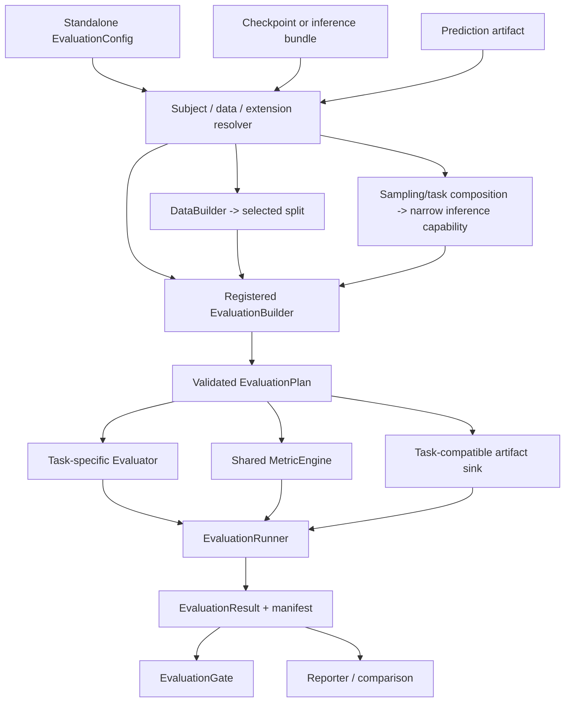

# 训练后 Evaluation 与 Benchmark 支持计划

- 文档性质：开发计划；不属于当前公开 API 或正式用户文档
- 状态：提案，尚未进入实现
- 制定日期：2026-07-26
- 前置工作：
  [Metrics 支持开发计划](metrics-support-plan.md)的 `MetricUpdate`、`MetricEngine`
  与 canonical result contract
- 关联计划：
  [默认工作流与推理 Pipeline 支持计划](default-workflow-pipeline-support-plan.md)、
  [Latent Diffusion、DiT 与 Stable Diffusion 支持计划](latent-diffusion-and-stable-diffusion-support-plan.md)、
  [自动化模型调优开发计划](automated-model-tuning-plan.md)、
  [Consistency Distillation 支持计划](consistency-distillation-support-plan.md)
- 首版范围：独立 checkpoint evaluation、validation/test 治理、live inference、
  可重放 prediction artifact、结构化 result/manifest、SR 与生成模型 profile、
  result gate 和 comparison 基础

## 1. 目标与核心结论

本计划补齐“训练已经完成，如何严格评估选定模型”的独立能力。它不只是给
`Trainer.evaluate_epoch()` 多加几个 metric，也不是在 final sampling 后读几张图片。
正式评估必须同时冻结并记录：

- 被评估的 checkpoint、内容摘要和具体权重变体；
- 数据声明、split、样本身份和有效样本数；
- 任务专属推理方法、预处理、后处理、随机性和计算预算；
- metric 实现、版本、backbone、参数和聚合规则；
- prediction、reference cache、图像、曲线和性能测量 artifact；
- 完成状态、失败项、运行环境和可比较的 protocol identity。

推荐结论如下：

1. **Evaluation 是与 Training、Sampling 并列的一等 operation。**
   增加 `run_evaluation(EvaluationRunRequest) -> EvaluationRunOutcome` 和
   `stochaflow evaluate`；不实现 `run(kind=...)`，也不把它塞进
   `SamplingBuilder`、`TrainingDiagnostic` 或 `Metric`。
2. **Metric 是 Evaluation 的可复用统计依赖，不是 Evaluation 本身。**
   架构层面 Metric 横向服务 training validation、diagnostic、post-training
   evaluation 和 AutoML；产品结果层面，一次 `EvaluationRun` 包含若干 metric
   实例和结果。二者是“消费关系”，不是互相替代的继承或严格包含关系。
3. **Validation、Diagnostic 与独立 Evaluation 都应支持 Metrics。**
   同一个 PSNR/FID 算法可以出现在三个上下文中；上下文决定它能否参与 checkpoint
   selection、何时运行、使用哪个 split 和产生什么 provenance，不应复制三套指标。
4. **正式 test 只接受一个已经冻结的 subject。**
   test 结果永不反馈到 checkpoint selection、early stopping、HPO suggestion 或
   pruning。若需要在训练后比较多个 checkpoint，应在 validation split 上生成
   `SelectionRecord`，再对唯一选中 subject 执行 final test。
5. **区分 phase evaluation 与 task-level evaluation。**
   `TrainingStrategy.evaluation_step()` 适合 validation/test loss 和低成本 epoch
   metric；SR 完整 restore、Gaussian 生成、consistency 1/2/4 NFE 曲线、FID/KID
   与 latency 属于任务级 evaluation，不能伪装成普通 evaluation step。
6. **EvaluationBuilder 是任务评估的唯一新增 core composition entrypoint。**
   Runner 不理解 image、target、condition、Process family、模型签名或 sampler 名称；
   具体 Builder 消费 sampling/task 层已经组合好的窄 inference capability，再组装
   task evaluator、metric binding、artifact sink 和 protocol。Process/Dynamics/Sampler
   compatibility 仍由 SamplingBuilder/sampling composition 拥有。
7. **同时支持 live 与 offline scoring。**
   昂贵的生成/restore 可以先流式保存带 manifest 的 predictions，再用相同或新增
   metrics 重评；join 必须按稳定 sample ID，不能依赖目录枚举顺序。
8. **Evaluation 产生事实，Gate 应用政策，Reporter 只展示。**
   绝对阈值、相对 baseline 退化、promotion decision 和 selection policy 不进入
   Metric 或 Evaluator。`incomplete`、missing 和 non-finite 结果默认不能通过 gate。
9. **首版单机单设备、单 subject、fail closed。**
   在 exact sharding 与去重 contract 完成前，不开放正式分布式 benchmark；超预算、
   跳过样本或部分失败必须显式标为 incomplete，不能静默产生“完整”分数。

## 2. 语义划分：Metrics、Validation、Diagnostic 与 Evaluation

### 2.1 不是二选一，而是三个正交问题

用户提出的“metrics 应该是 diagnostic 的独立能力、validation 的重要依据，还是
both”应按三条轴回答：

| 轴 | 回答的问题 | 例子 |
| --- | --- | --- |
| 统计定义 | 数值怎样跨 batch 聚合 | MSE、accuracy、PSNR、FID、KID |
| 执行上下文 | 何时、对什么 subject/data 运行 | train validation、periodic diagnostic、final test |
| 决策政策 | 哪个结果影响什么决定 | best checkpoint、early stop、promotion gate、HPO |

因此推荐 **both**：

- Metric 必须是独立统计能力；
- validation 可以把配置的 Metric 作为模型选择依据；
- diagnostic 可以消费同一个 Metric 算法，执行额外 sampling/restore/reference
  计算，并按 cadence 把 scalar 返回统一 snapshot；
- 独立 Evaluation 也消费同一 MetricEngine，但拥有自己的 subject、数据、协议、
  artifact 与 manifest；
- 一个数值只有被 monitor/selection/gate **显式引用**时才成为决策依据，不能因为
  “已经被记录”就自动影响选择。

### 2.2 精确定义

| 概念 | 生命周期 | 拥有内容 | 明确不拥有 |
| --- | --- | --- | --- |
| Objective | 一个 training step | 可微 scalar loss | 跨 batch 统计、报告政策 |
| Metric | `reset/update*/compute` | 统计 state、归约、数值结果 | 模型调用、checkpoint、split、artifact |
| Validation phase | 训练开发循环中的一个 phase | validation loss/metrics | 正式 test 治理、完整 benchmark |
| Diagnostic | 训练上下文中的按 cadence probe | 额外 forward/sampling/cache/artifact | 通用 test lifecycle |
| Prediction/Sampling | 一次推理或生成 | predictions/samples | reference comparison、质量结论 |
| Evaluation | 一个冻结 subject/data/protocol 的运行 | 推理、metric、measurement、artifact、provenance | 训练更新、搜索建议 |
| Selection | validation results 上的决策 | 候选、约束、tie-break、选择记录 | test split |
| Gate | 对既有 EvaluationResult 应用准入政策 | 阈值、baseline delta、pass/fail | 重算 metric、修改 result |
| BenchmarkSuite | 多个版本化 EvaluationCase | 固定数据/推理/metric 协议 | 单一万能 metric |
| Reporter | result 的呈现 | JSON/YAML/Markdown/图表 | 重跑模型、重新解释协议 |

### 2.3 同一个指标在不同上下文中的语义

以 SR 的 LPIPS 和生成任务的 FID 为例：

```text
每 N 个训练 epoch 在固定 validation reference 上运行
    -> Diagnostic context
    -> 可以显式成为 validation monitor

训练结束后，对冻结 checkpoint 在 held-out test protocol 上运行
    -> Evaluation context
    -> 形成正式 EvaluationResult

只对已保存的 predictions 重算新 backbone 版本
    -> Offline Evaluation context
    -> 新 protocol/result，不覆盖旧结果
```

Metric 算法本身不需要 `DiagnosticMetric`、`ValidationMetric`、
`EvaluationMetric` 三个继承层次。差异由运行上下文、数据治理和结果用途表达。

### 2.4 两种 “validation” 必须改名避免歧义

- `validation split/phase`：模型开发与选择使用的数据语义；
- “验证 evaluation result 是否达标”：质量准入政策。

后者统一称为 `gate`，不使用 `validate_evaluation_result` 作为用户概念，避免与
validation split 混淆。

## 3. 当前仓库基线与真实缺口

### 3.1 已有可复用能力

| 已有能力 | 对 Evaluation 的价值 |
| --- | --- |
| `DataSource -> DataArtifact`、`DataBuilder -> DataLoaders` | source 负责可验证 artifact，Builder 负责 runtime data composition，batch 保持 `Any` |
| `TrainingStrategy.evaluation_step()` | 现成的训练 phase batch/model 解释边界 |
| checkpoint v8 与 safe loading | config、资产 state、epoch/global step、extension provenance |
| best/latest checkpoint 选择 | 可解析默认候选，但 formal run 仍需冻结具体文件/hash |
| `InferenceModelProvider` | sampling 已有 raw/EMA 只读权重投影经验 |
| `SamplingBuilder` 与 `run_sampling()` | 独立 operation、overlay、manifest、structured result 的先例 |
| diagnostics runtime | RNG、eval mode、EMA 临时切换和 reference cache 的实现经验 |
| Metrics 计划 | `MetricUpdate`、MetricEngine、canonical key 与 collision/finite policy |
| registry/extension activation | 自定义 EvaluationBuilder 与 metric 的构造边界 |

这些能力应被复用，但不能直接把 training 或 diagnostic callback lifecycle 伪造成
独立 evaluation。

### 3.2 当前训练期 phase evaluation

`Trainer.evaluate_epoch()` 当前：

- 进入 module eval mode 和 `torch.no_grad()`；
- 调用 `TrainingStrategy.evaluation_step()`；
- 只累加 `output.loss`；
- 忽略 `TrainStepOutput.metrics`、`diagnostics` 和未来 `metric_updates`；
- 对每个 batch mean 等权平均，无法保证 sample-weighted 正确；
- 只返回 `loss`、`num_batches` 和 duration。

训练 epoch 当前近似顺序是：

```text
train
-> validation loss
-> best / early-stop decision
-> checkpoint
-> epoch diagnostic
```

Metrics 计划需要把 diagnostic 提前并合入 canonical snapshot，但即使完成该改造，
它仍只解决**训练上下文**的 phase/diagnostic reporting，不等于独立 benchmark。

### 3.3 当前训练后路径

当前 `_run_single_run()`：

```text
restore selected best checkpoint
-> test evaluate_epoch
-> optional run_sampling
-> console FinalSummary
```

存在以下缺口：

1. `_evaluate_test_split()` 只返回一个 `float test_loss`，没有普通 metrics；
2. test 没有独立 manifest、protocol、数据 fingerprint、样本 identity 或 artifact；
3. training `run_manifest.yaml` 在运行开始时写入，不包含最终 test result；
4. `_run_single_run()` 返回 `None`，下游无法通过稳定 API 消费结果；
5. 没有 `evaluate checkpoint now` 的 CLI/library entry；
6. checkpoint 完整 restore 绑定 optimizer/scheduler/training RNG，独立 evaluation
   不应为了读 primary/EMA/process state 构造全部训练生命周期；
7. post-training test 使用已恢复的 raw primary model，而 final sampling 的
   `weights:auto` 可能选择 EMA，二者可能报告不同 subject；
8. final sampling 只生成 artifact，不比较 reference，也不等于 evaluation。

### 3.4 为什么不能只扩展 `Trainer.evaluate_epoch()`

这只能补上 phase metrics，无法表达：

- 从 checkpoint 或 prediction artifact 独立启动；
- 选择 raw、EMA、consistency target 或其他具名推理权重；
- 完整 SR restore 或生成 sampler；
- 多 replicate seed bank；
- reference feature cache；
- predictions 的可重放保存与按 ID join；
- 1/2/4 NFE 多 case benchmark；
- latency/peak memory 协议；
- comparison、selection record、result gate；
- 独立结果目录和可比较 protocol digest。

因此 `Trainer.evaluate_epoch()` 应继续成为 phase evaluation primitive；正式
post-training evaluation 由新的 operation 管理。

## 4. 成熟方案调研结论

### 4.1 Lightning：validate、test、predict 是不同语义

[Lightning validation/test 文档](https://lightning.ai/docs/pytorch/stable/common/evaluation_intermediate.html)
把 validation 作为开发过程的一部分，把 test 与 fit 分开，并支持显式
`ckpt_path="best"`；[prediction loop](https://lightning.ai/docs/pytorch/stable/common/lightning_module.html)
只负责推理，不要求 label，也不天然产生评价。

可借鉴：

- validate 可反复运行并参与开发选择；
- test 在选定模型后运行；
- predict/sampling 与 evaluation 分离；
- 大预测结果按 batch 写出，避免全部驻留内存；
- 正式 benchmark 不能接受 distributed sampler 静默重复样本。

### 4.2 TorchMetrics：只提供统计 state

[TorchMetrics](https://lightning.ai/docs/torchmetrics/latest/pages/overview.html)
的稳定价值是 `update/compute/reset`、device state 和 distributed reduction。
train/validation/test 必须使用隔离状态。它不选择 checkpoint、数据 split 或模型调用，
这与 Metrics 计划的横向 subsystem 结论一致。

### 4.3 Transformers 与 Hugging Face Evaluate：任务适配与 suite

[Transformers Trainer](https://huggingface.co/docs/transformers/main/main_classes/trainer)
区分返回 metrics 的 `evaluate()` 与返回 predictions 的 `predict()`，并由任务注入
`compute_metrics`。

[HF Evaluate Evaluator](https://huggingface.co/docs/evaluate/main/en/base_evaluator)
进一步把 evaluator 定义为 model/pipeline、dataset 与 metric 之间的 task adapter；
不同任务有不同输入列和输出转换。[EvaluationSuite](https://huggingface.co/docs/evaluate/main/en/evaluation_suite)
把多个 evaluator/data/metric case 组合成 suite。

可借鉴：

- Evaluator 负责任务解释，不让 core 猜 `(preds, target)`；
- 一次 case 与多个 case 的 suite 分开；
- Metric、候选 Comparison 与 data/prediction Measurement 分开。

### 4.4 MLflow：Result、Gate 与预计算 predictions

[MLflow Model Evaluation](https://mlflow.org/docs/latest/ml/evaluation)
可评价 live model/function，也可消费预先计算的 predictions，并把 scalar metrics、
plots、tables 组成独立 result。准入阈值由 result validation/gate 逻辑处理。

Stochaflow 直接采用以下语义：

```text
Evaluation produces facts
Gate applies policy
Reporter presents facts
```

### 4.5 生成模型：Benchmark 不是一个 FID

[Diffusers evaluation 指南](https://huggingface.co/docs/diffusers/main/conceptual/evaluation)
明确提醒单一 CLIP/FID 示例不足以代表现代生成评估，并指向 HEIM、GenEval、
T2I-CompBench 等完整协议。

成熟 benchmark 固定的是：

- dataset/prompts 和版本；
- inference 参数、seed、每输入样本数；
- 输出预处理；
- evaluator/backbone/version；
- metrics 与性能测量；
- generations、失败项和报告。

因此外部
[HEIM](https://crfm.stanford.edu/heim/v1.0.0/)、
[GenEval](https://github.com/djghosh13/geneval)、
[T2I-CompBench](https://github.com/Karine-Huang/T2I-CompBench)
应通过 extension EvaluationBuilder 或 exporter 接入，不硬编码进 core。

### 4.6 Super resolution：必须同时看 distortion 与 perception

[Perception-Distortion Tradeoff](https://arxiv.org/abs/1711.06077)
说明低 distortion 与感知质量存在基本张力。SR 不能只用 FID 宣称遵从 LR condition，
也不能只以 PSNR 宣称感知质量最好。

成熟实现还表明 metric preprocessing 是协议的一部分：

- [BasicSR PSNR/SSIM](https://github.com/XPixelGroup/BasicSR/blob/master/basicsr/metrics/psnr_ssim.py)
  明确 crop border、颜色空间和输入范围；
- [LPIPS](https://github.com/richzhang/PerceptualSimilarity) 需要固定 backbone、
  权重版本和输入归一化；
- [CleanFID](https://github.com/GaParmar/clean-fid) 强调 resize、antialias、
  量化等实现差异；
- [TorchMetrics KID](https://lightning.ai/docs/torchmetrics/stable/image/kernel_inception_distance.html)
  需要记录 subset 数、subset size 和 metric RNG；其 subset-resampling mean/std
  与跨 generation-replicate 的 mean/std 是两层不同统计量，result key 不得复用。

## 5. 不变量与数据治理

### 5.1 Subject 必须冻结

一次正式 evaluation 的 subject identity 至少是：

```text
checkpoint/bundle/prediction artifact content digest
+ resolved model weight variant
+ inference profile digest
+ extension/component provenance
```

规则：

- checkpoint path 只是定位信息，内容 digest 才参与 identity；
- `weights:auto` 若允许，只能在 resolve 阶段按已声明政策变成具体
  `primary`、`ema` 或 `auxiliary:<id>`，结果中不能保留未解析的 `auto`；
- final test/benchmark 推荐要求显式 variant；
- precision、compile、tile、guidance、sampler、steps/NFE、condition adapter 和
  output postprocess 都属于 inference profile；
- 改变其中任一字段必须产生新的 evaluation/protocol identity，不能覆盖旧结果；
- operation 只读 subject，不修改 checkpoint、best pointer、EMA 或 training state。

### 5.2 Selection 与 final test 分离

```text
periodic/best checkpoints
-> validation evaluation results
-> SelectionPolicy
-> SelectionRecord(frozen subject)
-> exactly one final test evaluation
```

规则：

- selection 只消费 validation split/result；
- final test 接受一个 subject，不接受候选列表或 selection policy；
- test 上比较 raw/EMA、多个 NFE、tile 或 checkpoint 后再挑最好，属于数据泄漏；
- 若 final test 暴露实现错误，应把旧 result 标记 invalid 并升级 protocol version，
  不能静默调参后覆盖；
- test result 不进入 Training snapshot、HPO engine 或下一轮 suggestion；
- benchmark 可包含多个预先声明的 inference cases，但不能事后选择其中 test 最优者
  冒充唯一 final model。

### 5.3 Sample identity 与完整性

Evaluator 不允许 core 从任意 batch 推断 batch size 或 sample ID。具体 Builder/
Evaluator 必须显式产生：

- `num_examples`；
- 稳定且唯一的 `input_id` / `sample_id`；
- stochastic task 的 `replicate_index`；
- expected 与 observed count；
- failed/skipped IDs 和原因。

formal protocol 默认 `strict_complete: true`。以下情况失败或标为 incomplete：

- 重复 ID；
- prediction/reference 缺失或多余；
- 实际 count 与冻结 sample plan 不一致；
- metric state 没有成功 compute；
- non-finite result；
- artifact 写入或 digest 失败。

首版单机单设备。未来分布式运行必须证明 exact sharding、不 padding 重复样本，并对
Metric state 与 artifact ID 做全局去重后才能标为 complete。

### 5.4 随机任务的 SamplePlan

建议冻结：

```text
seed(input_id, replicate_index)
    = stable_derive(evaluation_seed, input_id, replicate_index)
```

每个样本/replicate 构造独立 generator，不能依赖一个随 batch 顺序不断消耗的全局
generator state。这样 batch size、worker 顺序或后续 exact sharding 不改变样本。

规则：

- validation selection 与 final test 使用不同 seed bank；
- consistency 不同 NFE case 使用相同 input/replicate seed，便于配对比较；
- 确定性 SR 默认 `replicates_per_input=1`；
- stochastic SR/生成记录 input count、K 和总 generated count；
- paired metric 先按 input 聚合 K 个 replicate，再对 input 等权聚合；
- `best-of-K` 必须命名为 oracle/diagnostic metric，禁止进入 selection；
- FID/KID 对比要求相同 sample plan 和总生成数量。

## 6. 总体架构



依赖规则：

1. Resolver 只处理 authority、safe loading、extension activation 和只读 state
   projection；
2. DataSource 仍是 artifact-producing extension entrypoint，DataBuilder 仍是 runtime
   data composition entrypoint；Evaluation 不新增 Dataset/loader registry；
3. SamplingBuilder 或由 sampling/task 层拥有的 factory 继续组合 model adapter、
   condition、guidance、initialization、Process/Dynamics/Sampler，并注入一个已验证的
   窄 inference capability；
4. EvaluationBuilder 只把 subject、selected data、该 inference capability、Evaluator、
   metric binding 和 writer 组合为评估，不重新解释 sampling compatibility；
5. Evaluator 解释 batch、调用注入的 Strategy/direct/inference capability 并产生
   metric payload；
6. MetricEngine 只管理统计 state；
7. Runner 只管理 device、eval/inference mode、loop、预算、dispatch、完成状态和发布；
8. Gate/Reporter 读取不可变 result，不重新运行模型或修改事实。

### 6.1 候选 source tree

```text
src/stochaflow/
├── metrics/                    # 与 Training 共用；不放入 evaluation/
│   ├── contracts.py
│   ├── factory.py
│   └── runtime.py
├── evaluation/
│   ├── config.py               # standalone EvaluationConfig
│   ├── contracts.py            # request/outcome/result/protocol
│   ├── builder.py              # EvaluationBuilder context/base
│   ├── subject.py              # checkpoint/prediction read-only resolvers
│   ├── runtime.py              # run_evaluation/EvaluationRunner
│   ├── artifacts.py            # sink + portable references
│   ├── comparison.py           # result-only comparison/selection
│   ├── gates.py                # result-only acceptance policy
│   └── reporting.py            # read-only reporters
└── scripts/
    └── evaluation_cli.py       # thin CLI adapter
```

任务专属 evaluator/profile 优先放在拥有该 task method 的 first-party extension/project；
只有形成稳定跨项目能力后才进入 `stochaflow.evaluation` 的 built-in catalog。core
package 不按图像、SR、Gaussian 或 consistency 建子目录来暗示通用 modality schema。

## 7. Operation 与配置权威

### 7.1 独立 library API

与 Training/Sampling 保持平行：

```python
def run_training(request: TrainingRunRequest) -> TrainingRunOutcome:
    ...


def run_evaluation(request: EvaluationRunRequest) -> EvaluationRunOutcome:
    ...


def run_sampling(request: SamplingRunRequest) -> SamplingRunOutcome:
    ...
```

候选最小 contract：

```python
@dataclass(frozen=True, slots=True)
class EvaluationRunRequest:
    config: EvaluationConfig
    extensions: ResolvedExtensions
    source: RunSource


@dataclass(frozen=True, slots=True)
class EvaluationRunOutcome:
    evaluation_id: str
    protocol_id: str
    status: str
    output_dir: Path
    subject: ResolvedEvaluationSubject
    split: str
    metrics: Mapping[str, float]
    measurements: Mapping[str, float]
    artifacts: Mapping[str, Path]
    manifest_path: Path
    result_path: Path
    gate_result_path: Path | None
```

failure 仍抛出有类型异常，同时尽力写 failure manifest；不能返回
`status="complete"` 并把异常藏进 warnings。`incomplete` outcome 只在配置显式允许
partial 时产生，且永远不能通过默认 gate。

### 7.2 EvaluationConfig 是独立 authority

像 tuning config 一样，evaluation config 不应成为 `StochaflowConfig` 的新顶层字段。
它引用 checkpoint/bundle/predictions，并定义本次 protocol：

```yaml
version: 1
name: sr-x4-final-test
purpose: final_test

subject:
  kind: checkpoint
  path: outputs/sr/checkpoints/best.pt
  weights: ema

data:
  source: checkpoint
  split: test

evaluation:
  builder:
    name: super_resolution_paired
    params:
      inference:
        scale: 4
        tile: null
        precision: fp32
      sample_plan:
        seed: 20260726
        replicates_per_input: 1
      protocol:
        id: sr-x4-rgb-v1
        expected_examples: 100
        strict_complete: true

metrics:
  - id: psnr_rgb
    name: psnr
    channel: sr.prediction_target
    params:
      data_range: 1.0
      crop_border: 4
      color_space: rgb
  - id: ssim_rgb
    name: ssim
    channel: sr.prediction_target
    params:
      data_range: 1.0
      crop_border: 4
      color_space: rgb

artifacts:
  save_predictions: true
  save_per_sample_metrics: true
  gallery:
    ids: [image-001, image-017, image-042]

gate:
  rules:
    - metric: eval/metrics/psnr_rgb
      min: 28.0
```

严格规则：

- unknown field 失败；
- `purpose`、split 和 downstream policy 的组合在 resolve 阶段验证；
- `subject.kind` 使用 tagged union，不用几十个 optional 字段；
- `data.source: checkpoint` 复用 checkpoint resolved config 中的 DataBuilder declaration；
- 如需新 benchmark data，显式提供另一个 `ComponentConfig`/evaluation data config，
  仍通过 DataBuilder 构造，不新增 Dataset registry；
- evaluation config 不能覆盖 checkpoint 的 model/process 训练声明；
- 可以覆盖的是任务 Builder 明确支持的 inference/evaluation 参数；
- resolved config、source digest 和所有默认值写入 manifest。

`purpose` 首版只允许：

| purpose | 合法 split | 决策资格 |
| --- | --- | --- |
| `selection_candidate` | validation | 可作为 SelectionPolicy 的一个候选事实 |
| `final_test` | test | 只报告/gate；不能 selection/HPO |
| `benchmark` | profile 明确声明的 validation 或 test | 只报告/gate；若要选模必须另跑 `selection_candidate` |

一个 `EvaluationRun` 始终只评估一个 subject。`SelectionPolicy` 消费多个
`selection_candidate` results；`BenchmarkSuite` 消费/调度多个预声明 cases。这样
purpose 不会演变成一个让 Runner 按模式执行任务数学的枚举。

### 7.3 Config 中的 Metric declaration

Metrics 计划的 training 配置还需要 `phases`，独立 evaluation 没有 phase binding。
实现前应提取共享的数据化部分：

```python
@dataclass(frozen=True, slots=True)
class MetricSpec:
    id: str
    name: str
    channel: str
    params: Mapping[str, Any]


@dataclass(frozen=True, slots=True)
class TrainingMetricBinding:
    metric: MetricSpec
    phases: tuple[str, ...]
```

精确 YAML 可保持当前简洁写法，但 factory、registry resolver、scalar flatten、
non-finite 与 provenance contract 必须由 training 和 evaluation 共用，不能复制
`EvaluationMetric` 子系统。

## 8. Subject resolution 与 checkpoint 投影

### 8.1 Subject 使用 tagged union

首版：

```text
CheckpointSubject
PredictionArtifactSubject
```

后续有稳定 export 能力后增加：

```text
InferenceBundleSubject
```

三者的 resolver 和所需字段不同，不用一个包含
`checkpoint/bundle/predictions/model=None` 的万能 data class。

### 8.2 CheckpointSubject

checkpoint resolver 负责：

- safe loading 与 schema/version 检查；
- extension identity/version preflight；
- content digest；
- resolved training config 与 selected component provenance；
- primary/process/所需 auxiliary 的只读 state projection；
- requested weights 到 concrete variant 的解析；
- checkpoint epoch/global step 与 lineage。

它明确忽略：

- optimizer/scheduler state；
- gradient scaler；
- training RNG resume state；
- early-stopping/best-tracking mutable state；
- training logger/diagnostic callback；
- 不属于 evaluator 的 frozen teacher 或 auxiliary。

不能直接调用要求 optimizer/scheduler topology 完全匹配的
`CheckpointManager.restore_payload()`。应提炼与 sampling 共用的只读
`InferenceStateProjection`/resolver；Training restore 继续使用严格完整 restore。

### 8.3 PredictionArtifactSubject

prediction artifact 至少包含：

```text
schema/version
producer evaluation/sampling id
source subject digest
resolved weight variant
inference profile and digest
sample plan and digest
sample IDs / input IDs / replicate indexes
shard paths, media types and content digests
preprocess/postprocess identity
failed/skipped records
completion status
```

规则：

- 使用 JSONL/JSON/YAML、image files、Numpy/safetensors 等明确安全格式；
- 不为方便而加载任意 pickle；
- prediction 与 reference 按 ID join，不按文件名排序或目录遍历顺序 join；
- offline scoring 生成新的 EvaluationResult，不修改 producer manifest；
- incomplete prediction artifact 默认拒绝 formal final test；
- 增加 metric 不要求重新生成，但改变 inference profile 必须重新产生 predictions。

### 8.4 不自动重建完整 TrainingPlan

独立 evaluation 不能假定任意 `TrainingBuilder` 都能在没有训练环境时重建：

- frozen teacher bundle 可能只在 distillation 时需要；
- optimizer/scheduler constructor 可能需要 trainable parameter topology；
- training diagnostic/cache 不是 inference dependency；
- 复杂 Builder 的私有训练输入可能已不再可用。

因此 task EvaluationBuilder 应通过 checkpoint 的只读资产声明和任务 inference helper
构建 evaluator。只有某个具体 Builder 明确支持时，才可复用
`TrainingStrategy.evaluation_step()`；core 不提供“任意 TrainingBuilder 自动变成
Evaluator”的承诺。

## 9. EvaluationBuilder、Plan 与 Evaluator

### 9.1 唯一新增注册入口

```python
class EvaluationBuilder(ABC):
    def __init__(self, context: EvaluationBuilderContext) -> None:
        self.context = context

    @abstractmethod
    def build(self) -> EvaluationPlan:
        """Build and validate one evaluation composition."""
```

`EvaluationBuilderContext` 提供：

- 深复制后的私有 params；
- resolved read-only subject；
- DataBuilder 已组装后按治理规则选出的单个 iterable 与 data identity；不暴露未选择
  的 train/validation/test iterable；
- sampling/task composition 已构造并验证的窄 inference capability；offline scoring
  时为空；
- Metric factory/只读 declarations；
- device、seed、output/artifact policy；
- extension/protocol provenance。

Builder 不拥有 CLI parsing、全局目录选择、reporter 或 sampling composition；它拥有
完整 **evaluation composition validation**。Stochaflow built-in 与 extension Builder
走同一 registry/factory 路径。

### 9.2 EvaluationPlan

候选 contract：

```python
@dataclass(frozen=True, slots=True)
class EvaluationPlan:
    evaluator: Evaluator
    data: Iterable[Any]
    modules: Mapping[str, torch.nn.Module]
    metrics: MetricEngine
    artifact_sink: EvaluationArtifactSink | None
    protocol: EvaluationProtocol
    subject: ResolvedEvaluationSubject
```

Plan validation 至少验证：

- iterable 可重入且对应显式 split；
- evaluator 声明的 metric channels 覆盖所有配置 binding；
- modules/weights variant 与 evaluator 引用一致；
- artifact sink 与 evaluator output capability 兼容；
- protocol sample count、seed plan 和 metric preprocessing 完整；
- no-grad/inference-only 资产没有 trainable lifecycle 要求；
- live Evaluator 只依赖注入的窄 inference capability，不自行重组
  Process/Dynamics/Sampler；
- offline subject 不意外要求 live model。

不要给 `Process`、`Sampler`、`GenerativeDynamics` 或模型根添加 universal
`evaluate()`/`predict()`。

### 9.3 Evaluator 负责 batch 与模型语义

候选窄 contract：

```python
class Evaluator(Protocol):
    def evaluate_batch(self, batch: Any) -> EvaluationStepOutput:
        ...


@dataclass(frozen=True, slots=True)
class EvaluationStepOutput:
    num_examples: int
    sample_ids: tuple[str, ...]
    metric_update_groups: tuple[
        Mapping[str, MetricUpdate], ...
    ]
    records: Any | None = None
    measurements: Mapping[str, float] = field(default_factory=dict)
```

说明：

- `metric_update_groups` 允许同一 batch 对 set metric 先后提交 reference/generated
  payload；每组仍复用 Metrics 计划的普通 channel mapping；
- channel 的 args/kwargs 由 task contract 决定，Runner 不理解 `real=True`、
  prediction、target 或 condition；
- `num_examples` 显式给出，Runner 不从任意 batch 猜 shape；
- `sample_ids` 用于完整性、join 和 per-sample artifact；
- `records` 对 core 不透明，只交给 Builder 配对的 task-compatible sink；
- task Evaluator 调用已注入的 inference capability，不构造 model adapter、condition、
  guidance、initial state 或数值 Sampler；
- Evaluator 不移动 module、选择 checkpoint、打开输出路径或直接发布最终 result。

### 9.4 Runner 生命周期

```text
resolve config/subject/extensions
-> DataBuilder and split selection
-> sampling/task composition builds validated inference capability (live only)
-> construct EvaluationBuilderContext with capability or offline subject
-> EvaluationBuilder.build()
-> plan.validate()
-> seed/device/eval mode/inference mode
-> MetricEngine.reset()
-> for each work batch:
     evaluator.evaluate_batch()
     validate count/IDs
     MetricEngine.update() for every update group
     artifact_sink.consume(records)
     measurement collector update
-> MetricEngine.compute()
-> artifact_sink.finalize()
-> completeness/finite/collision checks
-> write result + manifest atomically
-> optional gate + reporter
```

Runner core 不按 evaluator name、task、Process family、metric id 或 recipe name 分支。

### 9.5 Phase evaluator 与 task evaluator

首批明确分两类：

1. **Phase evaluator**
   - 对一个已经合法构造的 Strategy/plan 调 `evaluation_step()`；
   - 产生 loss 和普通 MetricUpdate；
   - 适合 train-run 内 validation/test convenience；
   - 不额外运行完整 sampler。
2. **Task evaluator**
   - 运行用户最终行为：generate、restore、reconstruct；
   - 使用 sampling/task composition 注入的 task-specific method/capability，并组合
     evaluation-specific reference cache 和 artifact sink；
   - 适合独立 post-training evaluation；
   - 不伪造 `TrainEpochEndEvent`，不复用 TrainingDiagnostic callback 外壳。

对于数值采样，SamplingBuilder 仍是 adapter、condition、guidance、initialization
以及 Process/Dynamics/Sampler compatibility 的唯一 composition owner。实现
Evaluation E1 时应从 sampling subsystem 提炼可注入的窄 `SamplingPlan`/
`InferenceCapability`；Sampling operation 执行它并写普通 sampling artifacts，
EvaluationBuilder 消费它并添加 metric/reference/completeness。对于 direct transform，
同一个 task-local method factory 同时服务 SamplingBuilder 与 EvaluationBuilder，
但不要求它伪造 numerical Sampler。任何路径都不能各自复制 solver/condition 数学。

## 10. Metrics、Measurements 与 Reference Cache

### 10.1 共用 MetricEngine

EvaluationRunner 使用 Metrics 计划中的同一构造和 runtime contract：

- Stochaflow 少量 built-in metric 走 `REGISTRIES.metrics`；
- allowlisted `torchmetrics.*` 走 native-provider resolver；
- extension metric 走同一 registry；
- 每个 EvaluationRun 构造独立 state，不能与 training/diagnostic/其他 run 共享；
- `reset -> update* -> compute -> publish` 严格成对；
- canonical scalar flatten、collision、NaN/Inf 和 direction metadata 逻辑共用；
- metric 不进入 optimizer、checkpoint managed asset 或 model mode lifecycle。

Evaluation canonical keys：

```text
eval/metrics/<metric-id>[/<subkey>]
eval/measurements/<measurement-id>[/<subkey>]
eval/system/...
```

`valid/*`、`test/*` 保留给 training phase snapshot。EvaluationResult 单独记录
`data.split` 和 `purpose`，不通过 key prefix 暗示治理语义。

### 10.2 Paired 与 distribution metric 不要求万能签名

典型 channel：

```text
sr.prediction_target
generation.reference
generation.generated
generation.prompt_prediction
performance.forward_event
```

这些只是具体 Evaluator 的公开 payload contract，不是 core batch schema。

- PSNR/SSIM/LPIPS 可绑定 paired prediction-target channel；
- FID/KID 可由 evaluator 在同一 step 产生 reference 与 generated 两组更新；
- CLIP-like metric 可绑定 prompt-prediction channel；
- 一个 metric 需要多个 channel 或 reference cache 时，由具体 Builder 构造 binding/
  adapter，不给 `Metric` 根增加大量 optional 方法；
- signature compatibility 用独立 custom Evaluator/Metric contract test 保证，不用
  constructor introspection 或 YAML path DSL。

### 10.3 Measurement 与 Metric 分开

以下值通常不是模型质量 Metric：

- latency、throughput；
- peak allocated/reserved memory；
- model/parameter count；
- cold-start/load time；
- failed/skipped sample count；
- cache hit/miss 和 I/O time。

它们进入 `measurements`，使用自己的 measurement collector/protocol。这样 quality
metric direction、统计聚合和 HPO monitor 不会被 system telemetry 混淆。

### 10.4 Reference cache

FID/KID 等 reference state 可以内容寻址缓存。cache key 至少包含：

```text
cache schema version
metric provider and version
extractor architecture / weights digest / feature layer
resize / antialias / quantization / normalization / color / range
dataset fingerprint / split / exact sample IDs and count
feature dtype
```

规则：

- key 任一字段变化必须 cache miss；
- 写入使用临时文件后原子替换；
- FID 可缓存 count/mean/covariance；
- KID 通常需缓存 reference feature vectors；
- cache hit 与 fresh compute 必须有数值等价测试；
- reference cache 只节省计算，不改变 split governance；
- test reference cache 的存在不授权 HPO 或 selection 反复消费 test；
- cache state 由 task evaluator/provider 管理，不进入通用 Metric 根。

## 11. Prediction artifact、Artifact Sink 与 Reporter

### 11.1 为什么必须保存 predictions

生成模型和 SR 的推理通常比评分更昂贵。可重放 predictions 支持：

- 增加或升级 metric，而不重新生成；
- 多 evaluator 对同一固定输出评分；
- 自动指标、人类评估和 gallery 共用输出；
- 复核 sample failure、预处理和 subject identity；
- 将 inference 性能与 metric 计算耗时分开。

live evaluation 可以同时流式评分和保存；offline evaluation 只消费已冻结 artifact。

### 11.2 ArtifactSink 边界

`EvaluationArtifactSink` 是 Builder 注入的 task-compatible consumer：

```python
class EvaluationArtifactSink(Protocol):
    def consume(self, output: EvaluationStepOutput) -> None:
        ...

    def finalize(self) -> Mapping[str, Path]:
        ...
```

Runner 只调用生命周期并验证返回路径位于 evaluation output directory 内。具体 sink
拥有：

- image/tensor/table 的编码；
- sample ID 到 shard/path 的映射；
- task-specific range、color 和 metadata；
- streaming/flush；
- per-sample metric table；
- deterministic gallery。

它不重新调用模型、计算正式 aggregate metric 或选择“最好看的”样本。

### 11.3 Gallery 不得人工挑好图

正式报告中的 gallery 使用：

- 配置中预先声明的 sample IDs；或
- 对 protocol ID + sample ID 的稳定 hash 规则。

可以另列预先定义的 hard cases/outliers，但不能运行后浏览全部结果再只保留成功样本。
gallery selection 规则、缺失 ID 和所有原始 prediction references 进入 manifest。

### 11.4 Reporter 不重算事实

Reporter 读取 `EvaluationResult` 生成：

- console summary；
- JSON/YAML；
- Markdown/HTML；
- metric table、quality-speed curve；
- fixed gallery references。

Reporter 不能：

- 重新加载 checkpoint；
- 更改 metric preprocessing；
- 丢弃 incomplete/non-finite 标志；
- 把不同 protocol digest 的数值画成可直接比较序列而不显式标注；
- 根据结果修改 gate threshold。

## 12. EvaluationResult、Comparison、Selection 与 Gate

### 12.1 结果模型

候选数据模型：

```python
@dataclass(frozen=True, slots=True)
class EvaluationResult:
    schema_version: int
    evaluation_id: str
    protocol_id: str
    protocol_digest: str
    status: str
    subject: ResolvedEvaluationSubject
    data: EvaluationDataIdentity
    metrics: Mapping[str, float]
    measurements: Mapping[str, float]
    artifacts: Mapping[str, ArtifactReference]
    completeness: CompletenessRecord
    provenance: EvaluationProvenance
```

`EvaluationRunOutcome` 是本地运行后的便利 view，可包含 `Path`；可移植
`EvaluationResult` 使用相对 artifact reference + digest，不依赖原机器绝对路径。

### 12.2 最低 manifest

每次运行至少记录：

```text
schema/version, evaluation id, case id, purpose, status
subject kind/path/content digest/lineage
checkpoint epoch/global step
requested and resolved weight variant
resolved inference profile and digest
DataBuilder declaration, split, dataset fingerprint
expected/observed sample IDs and counts
sample-plan/seed-bank digest, replicates per input
evaluator/builder identity and extension provenance
metric implementation/version/backbone/direction/params
preprocess, postprocess, color, range, crop, resize, quantization
scalar metrics and optional uncertainty metadata
prediction/reference-cache/artifact references and digests
latency protocol, warmup, synchronization, batch/resolution
hardware/software environment
errors, skipped/failed IDs, completeness
```

如果 DataBuilder 无法提供可靠 dataset fingerprint，formal profile 必须由具体
EvaluationBuilder 提供版本化 data identity 与 exact sample manifest；core 不通过
检查任意 Dataset 内部字段来猜 fingerprint。

EvaluationResult/manifest 原子发布后保持不可变，不反向写入 gate reference。
可选 GateResult 是独立 sidecar，单向引用 EvaluationResult digest；本地
`EvaluationRunOutcome.gate_result_path` 或上层 workflow manifest 可以引用该 sidecar。

### 12.3 Comparison

Comparison 是既有 results 上的只读操作：

- 默认只比较相同 `protocol_digest`；
- baseline 与 candidate 的 metric direction 必须已知；
- 对 paired sample-level results 可做显式统计比较；
- protocol 不同只能生成“不可直接比较”的并列报告；
- comparison result 记录输入 result digests，不覆盖原结果；
- 不重新运行模型。

### 12.4 Selection

训练后若要用完整 restore/generation 质量选择 checkpoint：

```text
one EvaluationResult per candidate on validation
-> SelectionPolicy
-> SelectionRecord
```

`SelectionPolicy` 可表达：

- primary metric + direction；
- 绝对约束；
- minimum improvement；
- tie-break；
- candidate eligibility；
- missing/non-finite/incomplete rejection。

SR 推荐优先用约束，而不是无解释的加权和，例如：

```text
minimize validation LPIPS
subject to PSNR >= declared floor
tie-break by latency, then training step
```

FID/KID 不应作为 conditional SR 唯一 selection metric，因为它们不能证明输出遵从
对应 LR input。

`SelectionRecord` 至少记录所有候选 result digest、排除原因、政策、胜者和冻结 subject
identity。它只接受 validation results；输入包含 test result 时立即失败。

### 12.5 Gate

Gate 对一个或一组 result 应用 release/promotion policy：

```yaml
gate:
  rules:
    - metric: eval/metrics/psnr_rgb
      min: 28.0
    - metric: eval/metrics/lpips
      max: 0.21
    - metric: eval/measurements/model_latency_ms_p50
      max: 12.0
    - metric: eval/metrics/fid
      max_regression_from: baselines/sr-x4-v1/result.json
      delta: 1.5
```

规则：

- absolute threshold 与 baseline-relative rule 分开验证；
- baseline 必须 protocol-compatible；
- missing、non-finite、invalid 和 incomplete 默认 fail；
- gate 产出独立 `GateResult` sidecar，单向引用 immutable EvaluationResult digest，
  不改 metric/result/manifest；
- evaluation 可以 `status="complete"` 而 gate 为 failed；二者分别表示事实是否完整和
  acceptance 是否通过；
- gate fail 不自动触发 HPO、重新训练或 test 上重新选择；
- threshold 来源和变更必须版本化。

## 13. 首批任务 Evaluation Profiles

### 13.1 Training phase profile

用途：保持现有 train/validation/test convenience，同时补齐 Metrics 计划。

内容：

- objective/loss 的显式 weighting；
- Strategy 的普通 MetricUpdate；
- validation/test canonical snapshot；
- selected raw/EMA 语义若在 run 结束评估；
- 无完整 sampler、gallery 或 distribution reference cache。

当前 train 命令默认 test 行为可暂时保留兼容，但应改名为
`phase_test_snapshot`，不能把一个 `float test_loss` 宣称为完整 benchmark。

### 13.2 Paired super-resolution profile

必须并列覆盖：

| 方面 | 候选指标/测量 | 必须固定的协议 |
| --- | --- | --- |
| distortion | PSNR、SSIM | RGB/Y、data range、crop border、quantization |
| paired perception | LPIPS | backbone、weights、输入归一化 |
| distribution | FID、KID | extractor、resize、reference IDs、sample count |
| condition faithfulness | task-specific consistency | LR degradation/downsample identity |
| performance | latency、throughput、peak memory | hardware、dtype、batch、resolution、tile |

默认：

- fixed scale；
- paired test split；
- deterministic SR `K=1`；
- stochastic SR 显式 K/seed bank；
- predictions 与 per-sample paired metrics；
- fixed gallery；
- FID/KID 不是 LR faithfulness 的替代。

PSNR/SSIM/LPIPS 需对 shape、range、crop、color 做 fail-fast 检查。paired aggregation
按 input 等权，不能对 batch mean 再等权平均。

### 13.3 Gaussian image generation profile

至少冻结：

- reference dataset/split/sample IDs；
- generated sample count；
- seed/sample plan；
- resolution、output range/quantization；
- sampler、steps、schedule、guidance、precision；
- FID/KID provider/backbone；
- 任何 CLIP/semantic evaluator 的 model/version；
- prediction shards、fixed gallery；
- generation 与 scoring 耗时分开。

FID/KID 是必要但不充分的 distribution evidence。更完整的 compositional、prompt
alignment 或 human evaluation 通过 extension BenchmarkSuite 接入。

### 13.4 Class-conditional latent image generation profile

完整 contract 见
[Latent Diffusion、DiT 与 Stable Diffusion 计划](latent-diffusion-and-stable-diffusion-support-plan.md)。
正式生成评估前必须先产生独立 codec reconstruction EvaluationResult，冻结：

- codec model ID、immutable revision、config/weights digest 与 license；
- deterministic posterior mode 的 optimistic reconstruction profile；
- 实际训练/预计算 latent 所用 posterior policy 的 operational profile，包括固定
  seed 与 replicate 规则；
- latent transform identity，包括 scaling/shift/mean/std；
- image preprocessing 与输出 range；
- profile-declared exact evaluation sample IDs；heldout profile 使用未参与训练/选择的
  official test，full-showcase 只形成 reconstruction sanity result；
- PSNR/SSIM/LPIPS 与 reconstruction FID/rFID；
- 固定 reconstruction panel。

generation case 再冻结：

- denoiser checkpoint/raw-or-EMA；
- prediction type；
- class vocabulary/mapping；
- reference-histogram 或 uniform class allocation policy；
- condition dropout 的训练 identity；
- CFG scale；
- Process、Sampler、NFE 与 seed bank；每个 generation seed 是完整
  protocol-declared sample-count replicate，而不是把一个样本集切成多个 seed；
- codec decoder identity；
- generated/reference sample count；
- decoded image preprocessing；
- KID estimator、feature provider、subset count/size 与 RNG；
- Clean-FID version、`clean` protocol 与 reference statistics identity；
- precision/recall provider 与参数；
- distribution、class fidelity、coverage、memorization 与 performance measurements。

Flowers102 必须使用不同 protocol identity 区分：

- `flowers102-full-showcase-v1`：允许全部 8,189 张参与训练，必须记录
  `uses_official_test_for_training=true`，不产生 held-out claim；发布的 seed、class
  ordering、sample count 与失败样本保留规则必须预先固定；
- `flowers102-heldout-transfer-v1`：official validation 用于选择，official test
  只消费唯一冻结 subject；pretrained codec 使其属于 transfer benchmark。它必须再
  显式选择一个 `finalization` variant：
  - `selected-checkpoint`：直接冻结 validation 选出的 checkpoint；
  - `retrain-trainval`：按预注册的 step budget、seed 与 checkpoint rule 在
    train+validation 上重训，不再使用 validation early stopping。
  两个 variant 使用不同 subject、protocol 与 result identity，不能互相覆盖。

小数据默认建议：

- 按 reference label histogram 生成相同数量样本；KID 是固定 estimator 的 primary，
  FID 是 pinned Clean-FID `clean` protocol 的 secondary；
- 每个 seed 生成完整 replicate；heldout profile 默认每个 replicate 对齐 6,149 张
  official test reference，并报告逐 seed、arithmetic mean 与
  `between_seed_std`；v1 不产生尚未冻结 estimator 的置信区间；
- 单个 replicate 的 KID subset resampling 使用
  `kid_within_subset_mean/std`，跨 generation seed 使用
  `kid_between_seed_mean/std`；固定同一 real reference 时，后者只表征给定数据集下
  generator seed 与 metric RNG 的条件变异，不代表完整 dataset uncertainty；
- 另有 uniform-class fixed quantitative plan 测 class coverage，不只生成 gallery；
- frozen classifier 的 intended-class macro accuracy/confusion；classifier artifact
  manifest 必须冻结 model/weights digest、training dataset/split IDs、preprocessing
  与 HPO/selection history，official test/generated images 不得参与 classifier
  fit、HPO 或 selection；
- 同时报告 classifier 在真实 test 上的 reliability/reference baseline；低于预注册
  reliability gate 时，该 classifier 结果不得作为 class-fidelity 主证据；无法审计
  training lineage 的外部 classifier 只能标为 non-independent supporting evidence；
- precision/recall；
- 对实际训练 corpus 做 nearest-neighbor 与 duplicate audit；official test neighbor
  只能作为 leakage/reference evidence，不能替代 training-corpus memorization audit；
- 不把每类样本很少的 per-class FID 作为主指标。

Metric 与 artifact 都作用于 decoded observation image；EvaluationBuilder 不重新实现
latent shape、condition、CFG、Dynamics/Sampler 或 codec decode，而是消费 sampling/task
层已经验证的 inference capability。UNet/DiT comparison 只有在 codec、data、budget、
prediction、EMA、CFG、Sampler 与 sample plan 全部 compatible 时才可进入 comparison。

### 13.5 Consistency quality-speed profile

一致性模型不能只报告“一步可生成”。建议把以下内容建成三个预先声明的 case：

```text
NFE 1
NFE 2 with exact timestep list
NFE 4 with exact timestep list
```

三者共用：

- checkpoint/weight variant；
- input/sample IDs 与 seed bank；
- output preprocessing；
- metric provider/reference cache；
- hardware/precision；
- gallery IDs。

每个 case 报告：

- FID/KID/其他固定质量指标；
- `forward_calls`；
- `effective_model_evaluations`；
- model-only latency；
- end-to-end latency；
- images/sec 与 peak memory。

使用 instrumented wrapper 计数，确保 one-step 确实是一次 student forward。CFG 等把
cond/uncond 合并为一个 batch forward 时，同时记录 forward call 与 effective model
evaluation，避免 NFE 语义模糊。

### 13.6 Performance profile

性能是独立 profile/case，不把随手测到的 wall time 混入质量指标：

- warmup 与正式重复分开；
- CUDA/MPS 等异步 device 在测量点同步；
- 报 p50/median、p95、重复次数；
- 固定 hardware、dtype、compile mode、batch、shape、tile、NFE；
- model-only、pre/postprocess、write 和 end-to-end 分开；
- cold start/model load 单列。

[PyTorch benchmark 指南](https://docs.pytorch.org/tutorials/recipes/recipes/benchmark.html)
可作为 warmup 和同步实现参考。

## 14. Recipe、Training 与 AutoML 集成

### 14.1 Recipe entry

默认 Recipe 可以提供独立 evaluation entry：

```python
@dataclass(frozen=True, slots=True)
class EvaluationRecipeEntry:
    name: str
    config_template: str
    inputs: tuple[ArtifactRequirement, ...]
    outputs: tuple[ArtifactRequirement, ...]
```

例如：

```text
pixel-super-resolution:
  train-x4
  restore-x4
  evaluate-validation-x4
  evaluate-final-test-x4
```

Recipe 只物化普通 evaluation YAML；runner 不检查 recipe ID。benchmark profile/
version 属于 recipe acceptance contract。

### 14.2 训练结束后的默认行为

不要在每次训练后自动执行完整 benchmark：

- 成本可能很高；
- SR 需要外部 LR/test input；
- consistency 需要多个 NFE case；
- 正式 test 不应因每个 HPO trial 自动运行而泄漏；
- training 成功不应因可选报告/gallery 失败而丢失 checkpoint。

推荐：

1. training 返回结构化 `TrainingRunOutcome`；
2. outcome 包含 selected checkpoint；
3. phase test convenience 可由显式 option 保留；
4. Recipe/用户显式调用独立 Evaluation Operation；
5. 如果 train CLI 提供 `post_training_evaluation` convenience，它必须调用公共
   `run_evaluation()`，并在 outcome 中保存嵌套 result reference，不能复制逻辑。

### 14.3 TrainingRunOutcome

建议逐步从：

```text
test_loss: float | None
sampling_artifacts: Mapping[str, Path]
```

迁移为：

```text
phase_test_snapshot: EpochMetricSnapshot | None
evaluation_results: tuple[EvaluationResultReference, ...]
sampling_results: tuple[SamplingResultReference, ...]
```

phase snapshot 与 formal result 名称不同，避免使用者误以为一个 test loss 已完成全部
task benchmark。

### 14.4 AutoML

AutoML/HPO trial：

- 默认不运行 test Evaluation；
- suggestion/pruning 只消费 validation/diagnostic canonical metric；
- 若完整 restore quality 是 objective，它必须使用固定 validation evaluation/
  diagnostic protocol；
- trial 间 protocol、sample plan、metric version 和 budget 一致；
- study 选出配置后，冻结唯一 subject；
- final test 通过独立 Evaluation Operation 执行一次；
- final test/gate 结果不反馈给现有 study；
- gate 失败只表示 acceptance 失败，不自动在 test 上继续搜索。

## 15. CLI 与 artifact layout

### 15.1 CLI

首版：

```text
stochaflow evaluate --config evaluation.yaml
```

config 已包含显式 subject。可提供不改变 authority 的便利参数：

```text
stochaflow evaluate \
  --checkpoint outputs/run/checkpoints/best.pt \
  --config configs/evaluation/sr-x4-test.yaml
```

规则：

- CLI override 只允许 schema 明确声明的 subject path/output/device 等运行字段；
- 不提供 arbitrary dotted patch；
- CLI 只解析、构造 request、调用 library API、展示 outcome；
- 不递归调用 `stochaflow sample` 或 `stochaflow train`；
- 读取 prediction artifact 时显式选择对应 subject kind；
- output directory 已存在且非空时默认失败，resume 另行设计。

后续只读命令候选：

```text
stochaflow evaluation compare result-a.json result-b.json
stochaflow evaluation gate result.json --policy gate.yaml
```

### 15.2 目录

```text
outputs/evaluations/<evaluation-id>/
├── resolved_evaluation.yaml
├── evaluation_manifest.yaml
├── result.json
├── metrics.json
├── measurements.json
├── sample_manifest.jsonl
├── per_sample_metrics.jsonl
├── gate_result.json            # optional sidecar; points to result digest
├── logs/
├── predictions/
│   ├── manifest.json
│   └── shards/
├── artifacts/
│   ├── gallery/
│   └── curves/
└── caches/
    └── references/  # 可改为外部 content-addressed cache reference
```

大 prediction/cache 可存储在外部 artifact root；evaluation 目录保存带 digest 的引用。
临时文件和未完成 shard 使用不同后缀，成功 finalize 后原子发布 manifest/result。

## 16. 分阶段实施

### Stage E0：语义、结果与 phase metric 基础

依赖 Metrics 计划的前置 contract。

交付：

- 本计划评审通过；
- 冻结 Metric/Diagnostic/Evaluation/Selection/Gate 术语；
- `MetricSpec` 可被 training/evaluation 构造共用；
- `Trainer.evaluate_epoch()` 消费普通 MetricUpdate；
- phase loss 支持显式 weighting；
- train/validation/test 独立 metric state；
- `phase_test_snapshot` 替代单一 `test_loss` 的新内部结果。

退出条件：

- validation/test 能报告普通自定义 Metric；
- phase metrics 不与 formal benchmark 混名；
- test snapshot 不参与 monitor/HPO；
- focused Metrics/Trainer tests 通过。

### Stage E1：独立 checkpoint Evaluation vertical slice

交付：

- standalone `EvaluationConfig`；
- checkpoint subject resolver 与只读 inference state projection；
- sampling/task composition 提供的窄 inference capability seam；
- `EvaluationBuilder -> EvaluationPlan` registry path；
- `EvaluationRunner`；
- `run_evaluation()` 与 `stochaflow evaluate`；
- structured outcome/result/manifest；
- single-machine strict completeness；
- 一个独立 custom EvaluationBuilder contract fixture。

首个 built-in/reference vertical slice 使用确定性 paired SR 或简单 supervised evaluator，
避免一开始被 FID/reference cache 掩盖基础 contract。

退出条件：

- 删除/不可用 optimizer state 不影响 evaluation；
- raw/EMA variant 被准确解析和记录；
- CLI/library result 等价；
- checkpoint、split、sample count、metric/profile provenance 完整；
- EvaluationBuilder 不重组 Process/Dynamics/Sampler，且与 Sampling operation 使用同一
  inference capability；
- Runner 对 custom batch/model 无 task-specific 分支。

### Stage E2：Prediction artifact 与 offline scoring

交付：

- versioned prediction manifest；
- streaming task sink；
- safe shard formats；
- sample ID join/completeness；
- `PredictionArtifactSubject`；
- live 与 offline scoring 数值一致测试；
- deterministic gallery。

退出条件：

- 增加 metric 不重跑模型；
- file enumeration 顺序不影响 join；
- missing/duplicate/corrupt shard fail closed；
- offline result 保留 producer lineage。

### Stage E3：生成与 SR quality profiles

交付：

- paired SR PSNR/SSIM/LPIPS profile；
- FID/KID distribution binding；
- content-addressed reference cache；
- Gaussian generation profile；
- consistency NFE 1/2/4 cases；
- performance measurement profile；
- quality-speed curve reporter。

退出条件：

- metric preprocessing/version 全部进入 protocol digest；
- FID/KID reference/generated 方向不可交换；
- SR distortion/perception/condition evidence 并列；
- CM forward count 与 NFE 准确；
- performance measurement 有 warmup/sync/repeat metadata。

### Stage E4：Comparison、Selection、Gate 与 Suite

交付：

- result comparison；
- validation-only SelectionPolicy/Record；
- absolute/baseline-relative Gate；
- versioned BenchmarkSuite descriptor；
- recipe evaluation entries；
- protocol compatibility guard。

退出条件：

- test result 无法进入 SelectionPolicy；
- final test request 无法包含多个候选；
- incomplete/non-finite result 无法通过默认 gate；
- 不同 protocol 不能静默比较；
- suite 只编排 cases，不改变具体 Builder dispatch。

### Stage E5：可选 extension/integration

只有核心 contract 稳定后评估：

- HEIM/GenEval/T2I-CompBench extension；
- MLflow/W&B result exporter；
- human evaluation artifact/export；
- exact distributed sharding/reduction；
- inference bundle subject；
- richer confidence interval/comparison providers。

这些能力不得成为 core 基础依赖。

## 17. 测试矩阵

### 17.1 Config 与 authority

- unknown/duplicate fields；
- invalid purpose/split 组合；
- final test 候选列表/selection policy 被拒绝；
- selection 读取 test result 被拒绝；
- checkpoint data 与显式 benchmark data authority；
- unresolved `weights:auto` 不进入 result；
- inference profile 任一字段变化会改变 protocol digest；
- extension 缺失/版本不匹配 fail-fast；
- path traversal、output overwrite 和 unsafe prediction format 拒绝。

### 17.2 Subject/checkpoint

- raw、EMA、具名 auxiliary variant；
- content digest 与 lineage；
- evaluation 不要求 optimizer/scheduler restore；
- checkpoint 不被修改；
- primary/process/所需 auxiliary state exact load；
- sampling 与 evaluation 复用同一 inference method 时输出一致；
- test metric 与 final artifact 使用同一 resolved weights。

### 17.3 Metric lifecycle

- reset/update/compute 次序；
- run/phase state 隔离；
- one channel 多 metric；
- distribution metric 的多 update group；
- scalar mapping flatten/collision；
- sample weighting，不是 batch-mean 等权；
- empty/missing/non-finite failure；
- custom Metric + custom Evaluator；
- task payload 不被 core 解包。

### 17.4 Sample plan 与 artifact

- duplicate/missing/unexpected IDs；
- batch size、loader order、worker 数不改变 seed/output；
- validation/test seed bank 不相交；
- K replicate 的 input-level aggregation；
- best-of-K 不能被 selection 引用；
- writer streaming/flush/atomic finalize；
- corrupt shard/digest mismatch；
- live/offline metrics 一致；
- gallery ID/hash 选择稳定。

### 17.5 SR/生成/consistency

- PSNR/SSIM/LPIPS shape/range/crop/color checks；
- paired metric 按 input 聚合；
- FID/KID real/fake 不可交换；
- KID 固定 metric RNG 可重放，within-subset 与 between-seed mean/std 使用不同 key；
- cache hit 与 fresh compute 等价；
- provider/preprocess/split/sample IDs 任一变化导致 cache miss；
- generation sample count 严格；
- CM NFE 1/2/4 的 instrumented forward count；
- quality-speed cases 共用 sample plan。

### 17.6 Performance、Result 与 Gate

- async device measurement 同步；
- warmup 不进入正式统计；
- p50/p95/repeat/hardware/dtype/profile 完整；
- result atomic publish；
- failed/incomplete manifest；
- absolute 与 baseline-relative gate；
- protocol-incompatible baseline 被拒绝；
- non-finite/incomplete gate fail；
- reporter 不更改结果或隐藏 completeness；
- comparison 读取 result digest，不重跑模型。

### 17.7 回归验证

日常增量：

```text
uv run ruff check .
uv run pyright
uv run pytest <新增 evaluation focused tests>
uv run pytest tests/test_trainer_reporting.py
uv run pytest tests/test_sampling_runtime.py
uv run pytest tests/test_experiment_runner.py
```

完整分支合并前：

- 全量 `uv run pytest`；
- 一个 tiny training -> checkpoint -> phase test；
- 一个 deterministic SR live evaluation；
- 同一 predictions 的 offline replay；
- 一个 tiny generation/reference-cache run；
- 一个 failure/incomplete/gate-fail run。

## 18. 验收标准

### 18.1 架构

- Training、Evaluation、Sampling 是三个独立 request/outcome；
- DataSource 与 DataBuilder 分别保持 artifact-producing 和 runtime composition
  data entrypoint；
- EvaluationBuilder 是唯一任务评估 composition entrypoint；
- Runner 不含 task/model/process/metric-name 分支；
- MetricEngine 被 training 与 evaluation 共用；
- Evaluator 不拥有 checkpoint selection/device/artifact root；
- Metric 不调用模型或写报告；
- SamplingBuilder/sampling subsystem 组合 task inference primitive，
  EvaluationBuilder 只消费其窄 capability；
- extension custom Builder/Metric 通过同一路径。

### 18.2 语义与治理

- validation、diagnostic、evaluation 均可使用同一 metric 实现；
- 一个 metric 只有被显式 policy 引用时才影响选择；
- test 不影响 checkpoint、HPO 或后续 suggestion；
- final test 只接受一个冻结 subject；
- raw/EMA/profile identity 无歧义；
- prediction/reference 按 ID 对齐；
- incomplete/non-finite 不伪装成功；
- benchmark 与 metric 概念分开；
- Gate/Reporter 不修改事实。

### 18.3 用户体验

- 用户能对已有 checkpoint 独立运行 `stochaflow evaluate`；
- 不需要继续训练一个 epoch；
- 不需要 optimizer/scheduler 或 teacher-only 输入；
- result 可被 Python API、CLI、reporter 和 gate 消费；
- 新增 metric 可以对已保存 predictions 重评；
- SR/生成/consistency recipe 提供可复制的 evaluation template；
- 错误能指出 subject、split、metric/channel、sample ID 或 protocol 冲突。

### 18.4 可复现性

- resolved config、checkpoint digest、weights、sample plan、metric/provider、
  preprocessing 和环境完整记录；
- batch 顺序/大小不改变 per-sample stochastic output；
- reference cache 有内容寻址 identity；
- 同 protocol result 可比较，不同 protocol 默认拒绝直接比较；
- artifact 和 result 原子发布；
- 旧 result 不被新 metric/profile 静默覆盖。

## 19. 主要风险与缓解

| 风险 | 后果 | 缓解 |
| --- | --- | --- |
| 把 Evaluation 塞进 Metric | Metric 获得模型/data/artifact 职责 | 独立 Builder/Plan/Runner |
| 把 Evaluation 塞进 Diagnostic | 无法独立重跑 checkpoint | 复用底层 provider，不复用 callback 外壳 |
| 把 Sampling 当 Evaluation | 有图片但无 reference/协议结论 | 独立 operation/result |
| raw/EMA 混用 | metric 与最终 artifact 不同 subject | resolved weight identity |
| test 上挑 checkpoint/NFE | 数据泄漏 | SelectionRecord validation-only |
| batch mean 等权 | 不同 batch partition 改变结果 | 显式 num_examples/Metric state |
| 样本重复或缺失 | FID/PSNR 等正式分数错误 | exact IDs/completeness/fail closed |
| metric preprocessing 漂移 | 数值不可比较 | protocol digest/versioned profile |
| reference cache 误复用 | 隐性污染 benchmark | content-addressed full key |
| 保存全量 prediction OOM | 大评估失败 | streaming shards/sink |
| 分布式 padding 重复 | 正式结果偏差 | v1 single device，exact sharding gate |
| Reporter 重算或过滤 | 展示与事实不一致 | immutable result/read-only reporter |
| 万能 Evaluator 接口 | optional 字段与 task 分支膨胀 | Builder + task-specific narrow contract |
| full benchmark 自动随每 trial 运行 | 成本和 test 泄漏 | explicit post-training operation |

## 20. 明确不进入首版

- 任意 benchmark leaderboard 服务；
- human preference collection platform；
- no-reference IQA 的默认选型；
- 自动把 train/validation 合并成 final refit；
- 在 test 上自动重调 checkpoint、raw/EMA、NFE 或 tile；
- best-of-K 作为 selection metric；
- 任意多模型 cascade 的统一 YAML；
- distributed benchmark；
- 通用 Dataset/Sampler/DataLoader registry；
- 自动推断 metric direction、crop、range、color 或 backbone；
- 自动把所有 TorchMetrics/MLflow/HF Evaluate API 镜像到 registry；
- 把 Lightning、HF Evaluate、MLflow 变成 core runtime 依赖；
- 训练失败自动由 evaluation 重试；
- Gate 失败自动启动 AutoML；
- 一个同时处理 train/evaluate/sample/export 的万能 Runner。

## 21. 调研来源

- [Lightning validation/test](https://lightning.ai/docs/pytorch/stable/common/evaluation_intermediate.html)
- [Lightning prediction loop](https://lightning.ai/docs/pytorch/stable/common/lightning_module.html)
- [TorchMetrics overview](https://lightning.ai/docs/torchmetrics/latest/pages/overview.html)
- [Transformers Trainer](https://huggingface.co/docs/transformers/main/main_classes/trainer)
- [Hugging Face Evaluate Evaluator](https://huggingface.co/docs/evaluate/main/en/base_evaluator)
- [Hugging Face EvaluationSuite](https://huggingface.co/docs/evaluate/main/en/evaluation_suite)
- [Hugging Face evaluation types](https://huggingface.co/docs/evaluate/types_of_evaluations)
- [MLflow Model Evaluation](https://mlflow.org/docs/latest/ml/evaluation)
- [Diffusers evaluation](https://huggingface.co/docs/diffusers/main/conceptual/evaluation)
- [Diffusers reproducibility](https://huggingface.co/docs/diffusers/main/using-diffusers/reusing_seeds)
- [HEIM](https://crfm.stanford.edu/heim/v1.0.0/)
- [GenEval](https://github.com/djghosh13/geneval)
- [T2I-CompBench](https://github.com/Karine-Huang/T2I-CompBench)
- [Perception-Distortion Tradeoff](https://arxiv.org/abs/1711.06077)
- [BasicSR PSNR/SSIM](https://github.com/XPixelGroup/BasicSR/blob/master/basicsr/metrics/psnr_ssim.py)
- [LPIPS](https://github.com/richzhang/PerceptualSimilarity)
- [CleanFID](https://github.com/GaParmar/clean-fid)
- [CleanFID paper](https://arxiv.org/abs/2104.11222)
- [KID paper](https://arxiv.org/abs/1801.01401)
- [TorchMetrics KID](https://lightning.ai/docs/torchmetrics/stable/image/kernel_inception_distance.html)
- [Effectively Unbiased FID](https://arxiv.org/abs/1911.07023)
- [Latent Diffusion Models](https://openaccess.thecvf.com/content/CVPR2022/html/Rombach_High-Resolution_Image_Synthesis_With_Latent_Diffusion_Models_CVPR_2022_paper.html)
- [Diffusers AutoencoderKL](https://huggingface.co/docs/diffusers/api/models/autoencoderkl)
- [Oxford Flowers102](https://www.robots.ox.ac.uk/~vgg/data/flowers/102/index.html)
- [TFDS Flowers102 split](https://www.tensorflow.org/datasets/catalog/oxford_flowers102)
- [Consistency Models](https://arxiv.org/abs/2303.01469)
- [Diffusers Consistency Model pipeline](https://huggingface.co/docs/diffusers/api/pipelines/consistency_models)
- [PyTorch benchmark tutorial](https://docs.pytorch.org/tutorials/recipes/recipes/benchmark.html)
