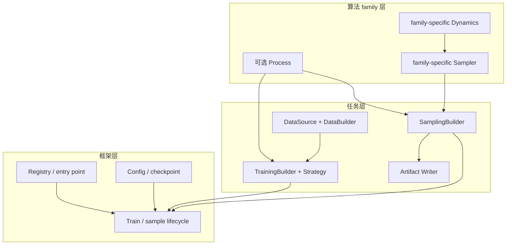

# 框架特性与架构

Stochaflow 是一个配置驱动、面向扩展的生成建模研究框架。它负责组织实验生命周期：
组件选择、训练、采样、checkpoint、日志、diagnostic 和 artifact；任务专属的数据处理、
模型签名、condition、guidance 与领域输出仍由具体项目拥有。

当前内置算法重点是离散 Gaussian diffusion。框架同时提供稳定的扩展边界，使项目可以
复用其中一部分组件，也可以接入具有独立数学契约的新算法 family，而不需要修改 runner。

## 当前能力

| 领域 | 内置能力 | 扩展边界 |
| --- | --- | --- |
| 数据 | 普通图像、有标签图像、超分辨率配对、多源多分辨率图像 recipe | `ImageDataSource` 适配兼容 artifact；独立数据生命周期使用自定义 `DataBuilder` |
| 模型 | 无条件 UNet、class-conditional ADM-UNet 与 pixel DiT | 注册满足任务 capability 的普通 `nn.Module`，模型不拥有训练或采样策略 |
| 训练 | 无条件/类条件 Gaussian denoising、supervised、混合精度与固定梯度累积 | `TrainingBuilder` 组合资产，`TrainingStrategy` 只解释 batch 并计算 loss/metrics |
| 概率过程 | 离散 VP Gaussian Process 与 linear/cosine schedule | 注册 family-specific `Process`；不需要概率路径的方法可使用 `process: null` |
| 采样 | DDPM、DDIM、class-conditional CFG、trajectory observer | family-specific `Sampler` 与任务级 `SamplingBuilder` |
| 输出 | Tensor、PNG、trajectory grid/GIF | `SamplingArtifactWriter` 可输出 NetCDF、Zarr 等领域格式 |
| 生命周期 | EMA、checkpoint v10、strict resume、checkpoint-bound inference、diagnostic、Rich/TensorBoard/W&B 日志 | 注册 Objective、diagnostic 和 logger |
| 项目扩展 | `stochaflow init`、Python packaging entry point、插件 provenance | 普通可安装 Python distribution；不绑定 `uv` 或固定仓库布局 |

内置 `super_resolution` 只负责数据配对和退化，不自动提供条件模型或训练/采样策略。
完整超分辨率任务仍需项目实现 conditional model、TrainingBuilder/Strategy 与
SamplingBuilder；这些组件可以继续复用离散 Gaussian Process 和 DDPM/DDIM。

## 类条件 Gaussian 纵向切片

内置类条件能力保持为一组窄协作，而不是全局 condition schema：

- `ClassConditionalDenoiser` 只约定带 class labels 的 denoising prediction；
- `class_conditional_gaussian_denoising` 解释
  `(images, {"class_label": labels})`，在训练时执行 condition dropout，并支持
  epsilon、x0、v 和 score targets；
- `adm_unet` 与 `dit` 实现同一个模型 capability。ADM 使用卷积多尺度路径和低分辨率
  Transformer blocks；DiT 使用 adaLN-Zero、固定二维位置编码与 PyTorch SDPA；
- `class_conditional_denoising` SamplingBuilder 拥有 label allocation 和
  classifier-free guidance，并把组装好的 model callable 交给现有 DDPM/DDIM；
- `class_conditional_diffusion_quality` 使用真实 batch labels 做 reconstruction，并用固定
  class allocation 和 guidance 生成训练期 diagnostic artifacts。

Process、Sampler 和 `GenerativeDynamics` 根接口都没有增加 class 或 CFG 方法。新的
单标签图像来源只有同时满足 `class_labeled_image` 的完整 artifact contract，并需要
相同的 partition、Dataset、augmentation、sampler、loader、resume 与 batch 语义时，
才只需实现 DataSource。任何一层 runtime recipe 语义不同都应使用独立 DataBuilder。
新增兼容 denoiser 只需注册模型，不需要修改 runner。完整可运行例子见
[AFHQ-v2 类条件生成](tutorials/afhq-v2.md)。

## 三层组织方式

`Process + Dynamics + Sampler` 是组织生成算法的方式，不是一套要求所有算法数学兼容的
万能接口。



### 框架层

框架统一：

- Registry 和已安装 extension 的发现、选择与激活；
- typed config、resolved config 和 workflow-specific CLI 覆盖；
- managed training assets 的 device、mode、优化与 checkpoint 生命周期；EMA 只跟踪
  primary model；
- 完整的 `Sampler.sample()` 调用生命周期；
- sampling output 验证、artifact writer 调用与 manifest。

框架不维护 `process name × sampler name` 兼容矩阵，也不按任务名称在 runner 中分支。
兼容性在拥有完整组合信息的 Builder、Strategy 或 family-specific Sampler 边界检查。

### 算法 family 层

每个 family 只定义自己需要的窄契约：

- 离散 Gaussian family 使用 `DiscreteGaussianDenoisingProcess`、
  `GaussianDenoisingDynamics` 和 DDPM/DDIM；
- vector-field family 可以定义自己的 VectorField Dynamics 与 ODE solver；
- reverse-SDE 或 sigma-space family 可以采用完全不同的 Dynamics 行为。

`GenerativeDynamics` 只是“已经组装的生成方向”的语义根，没有 universal
`predict()`、`step()`、`drift()`、`score()` 或 `denoise()`。新 family 不必假装兼容
Gaussian 数学。

离散 Gaussian family 另外公开 DDPM adjacent transition、DDIM selected-pair transition
和 schedule resolver。这些是 family 内可复用 primitive，不是通用 `Sampler` 根接口。
项目 Sampler 可以组合它们实现 post-transition correction 或其他求解策略，而内置
DDPM/DDIM 也调用同一组 primitive，避免维护两份数学实现。

### 任务层

任务层拥有 Python 中最难被通用 YAML 正确表达的组合：

- DataSource 决定怎样读取、处理并 materialize 来源为标准 artifact；
- DataBuilder 消费 artifact，决定划分、Dataset、sampler、collate 和 loader；
- TrainingBuilder 验证并组合 core 注入的 primary model、可选 Process/Objective，同时
  构造和声明项目辅助模块；
- TrainingStrategy 决定怎样解释 structured batch、调用模型并计算 loss/metrics；
- SamplingBuilder 决定 initial state、condition、guidance、模型 adapter、Sampler 和
  writer-ready batch；
- Writer 决定最终文件格式。

condition 不属于通用 Sampler 参数。通常由 SamplingBuilder 把 condition 捕获在模型
callable 中，再构造 family-specific Dynamics。这样同一个 DDIM 可以复用在无条件生成、
条件生成和 classifier-free guidance 中。若任务改变的是数值 transition 本身，则应提供
项目 Sampler，而不是给内置 DDIM 添加任务参数。

## 薄数据边界

核心数据契约只有：

```python
DataBuilder.build() -> DataLoaders
```

`DataLoaders` 提供 train、可选 validation/test iterable 和可选
`steps_per_epoch`。核心不认识 Dataset 类型、split 策略、sample key、bucket metadata、
condition 字段或图像尺寸。

内置 `image`、`class_labeled_image`、`super_resolution` 和
`multi_resolution_image` recipe 提供各自的划分与加载策略。新来源只有在 artifact
满足目标 Builder 的完整 accepted contract，且所需 runtime recipe 语义也一致时，才只需
实现 DataSource。新的 partition、Dataset、sampler、streaming、resume 或 batch 语义
属于自定义 DataBuilder，且不需要、也不应被迫支持其他 recipe 的私有能力。具体配置与
batch 约定见[数据构建](configuration/data-pipeline.md)。

### Data artifact producer lifecycle

`DataSource` 通过统一的 `DataArtifactStore` 把来源变成 schema-v2
`DataArtifact`。store 拥有 canonical manifest、文件 inventory、identity、locator、
locking、atomic publication、quarantine 和 strict-resume expected-identity 校验；
built-in 与 extension 使用同一公共路径。

`managed` 与 `referenced` 只是 ownership strategy：

- managed artifact 的实际内容位于 framework cache，可以从固定来源和 materialization
  recipe 重建；
- referenced artifact 只把索引/sidecar 放入 cache，represented content 保留在外部目录。

两者使用同一个 runtime handle；差异由 `artifact.identity.kind` 表达。payload 与
`domain` 仍由 producer family 定义，Builder 再检查更窄的 accepted artifact contract。
这个 lifecycle 不引入通用 dataset metadata、provenance、capacity 或 Dataset registry。

当前 identity、manifest、locator、cache layout 和 checkpoint binding 都是 schema v2
breaking contract。框架不读取或迁移旧格式；升级后数据需要重新 materialize，旧
artifact-aware checkpoint 不能 strict resume。

## 训练组合边界

训练侧的稳定数据流是：

```text
config + injected assets
        ↓
TrainingBuilder.build()
        ↓
TrainingPlan
  ├── TrainingStrategy
  ├── primary model
  ├── optional Process / Objective
  ├── named managed auxiliary modules
  └── optional fixed inference recipe
        ↓
Trainer lifecycle
```

core 先构造 primary model、可选 Process/Objective，再注入 Builder；Plan 必须原样保留
这些对象。Builder 可以构造、加载、冻结并声明 auxiliary assets，也可以声明一个
`SamplingRecipe(name, contract)`。recipe 固定与训练语义绑定的内部 SamplingBuilder
identity 和 JSON-safe contract；可调 request defaults 仍来自顶层 `sampling`。Strategy
只负责一次 batch 的训练计算。Trainer 负责自动优化生命周期，包括全部 managed assets
的 device/mode、backward、一个 optimizer、可选 scheduler 和 checkpoint。EMA 仅跟踪
primary model；Process、Objective 与 auxiliary modules 只保存 raw state。

自动循环还拥有 `fp32`、`bf16-mixed`、`fp16-mixed` precision 与固定
`accumulate_grad_batches`。autocast、GradScaler、unscale/clip/step 顺序和 partial-window
flush 都属于 Trainer/PrecisionRuntime，不散落在 Strategy 中。scheduler、EMA、global
step 和 update-level diagnostics 只在 optimizer step 成功后推进。precision 与
accumulation 会进入 checkpoint v10 的 strict resume 边界，不能用 observability config
改写。

冻结 teacher 蒸馏仍属于这套边界：Builder 加载并冻结 teacher，Strategy 组合
student/teacher forward 与 Objective。独立 teacher optimizer、交替更新或 manual
backward 属于新的训练循环 family，不应被塞入通用 Strategy mode。

标准 PyTorch optimizer 与 LR scheduler 通过受限原生 target 构造，`params` 直接传给
当前 PyTorch 版本；Stochaflow 不复制上游构造参数和默认值。第三方子类仍可注册到对应
Registry。

## Checkpoint inference 与采样组合边界

`stochaflow sample` 表示 checkpoint-backed inference，而不只表示随机图像生成。生成、
重建和 prediction 都通过同一 operation 解析 v10 checkpoint 中的 `inference_recipe`；
recipe 为 null 的 checkpoint 不支持该 operation。外部 sample request 只能调整
checkpoint 已公开的 sampler、options、shape、数量、batch、seed 和 writers，不能重新
选择内部 SamplingBuilder 或覆盖 fixed contract。

所有数值 Sampler 共享一个完整执行入口：

```python
result = sampler.sample(
    dynamics,
    initial_state,
    generator=generator,
    observer=observer,
)
```

统一的是生命周期，不是单步公式。多步历史、自适应 ODE、predictor-corrector、
rejection 或一步多次模型求值都可保留在具体 Sampler 内部。任务专属 shape、condition、
guidance 和 artifact 不进入这个接口。

没有数值求解过程的 direct transform 可以完全不构造 Process、Dynamics 或 Sampler；
它只需由 SamplingBuilder 返回合法 `SamplingOutput`。完整例子见
[自定义生成算法 family](tutorials/custom-generation-family.md)。

当前 artifact 生命周期是整体物化式：Builder 先返回所有 batch 和保留的 trajectory，
writer 才开始工作。它适合有界离线采样，但不是 streaming contract。容量估算和安全使用
方式见 [Sampling artifact 容量](configuration/sampling-capacity.md)。

## 配置、checkpoint 与 extension

每个 workflow 只有一个权威 base config：

| Workflow | Base config | 允许的覆盖 |
| --- | --- | --- |
| 新训练 | `train --config` 指向的完整 YAML | 文档化的训练 CLI runtime options |
| Strict resume | checkpoint 内保存的完整 config | device/output/epoch/limit 等明确 runtime options |
| Checkpoint inference | 显式 v10 checkpoint 的 config、state 与 `inference_recipe` | 可选 partial sample request；device/output 等 sampling CLI runtime options |

checkpoint 保存 resolved config、managed state 和 fixed inference recipe，但不冻结
extension 的 Python class、源码、wheel、数据或环境，因此是自描述 artifact，不是
自包含可执行环境。extension provenance 记录 entry-point name、distribution、version
和 module target；sample request 只能追加插件，不能删除 checkpoint-required plugin。
版本差异可以显式接受，身份或 state 不兼容仍会失败。项目应使用自己的
lockfile/environment specification 固定可复现实验环境。

extension 是普通 Python distribution，通过标准 entry point 声明一个聚合注册模块：

```toml
[project.entry-points."stochaflow.extensions"]
my-project = "my_project.stochaflow_ext"
```

YAML 再显式选择需要激活的插件：

```yaml
extensions:
  plugins: [my-project]
```

这两个名称是不同层级的身份：entry-point name 选择 distribution 的聚合模块，
组件的 Registry name 选择聚合模块注册的具体实现。组件名称应使用项目命名空间，例如
`my-project.physics-data`，以降低进程级 Registry 冲突风险。

## 有意保留的边界

- 当前生产内置 family 是离散 Gaussian diffusion；flow matching、score SDE 和更快
  solver 仍需 extension 或后续实现。
- 自动训练循环只有单 optimizer、单 backward 生命周期。
- DataLoader/worker/transform 的运行时随机状态不进入 checkpoint。
- sampling output 在 writer 前整体物化；全量大样本 dense trajectory 不受支持。
- Registry 和 provenance 不证明 extension 源码在相同版本号下没有变化。
- `stochaflow init` 生成普通 Python 项目，但不创建环境、安装依赖、扫描 monorepo 或
  驱动 Stochaflow 之外的实验。

## 下一步

- [快速开始与配置](configuration/index.md)
- [扩展与 Registry](configuration/extensions.md)
- [常用训练、恢复和采样工作流](configuration/workflows.md)
- [Extension 公共 API](api/extensions.md)
- [条件 Gaussian 超分辨率](tutorials/super-resolution.md)
- [复用离散 Gaussian 组件](tutorials/reuse-gaussian-components.md)
- [纵向参考项目](configuration/reference-projects.md)
