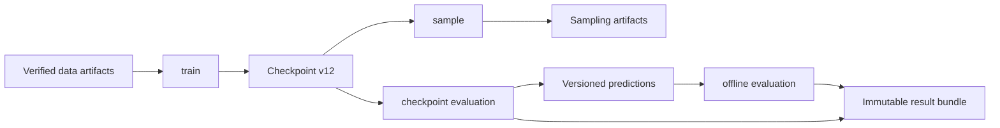

# 框架概览与当前能力

> 本文是面向用户和扩展作者的描述性概览，说明当前源码已经提供的能力与工作流。
> 它不是第二份架构规范。

Stochaflow 是一个配置驱动、面向扩展的生成建模研究框架。它把数据准备、组件组合、
训练、checkpoint-backed inference、独立 evaluation、metrics、diagnostics 和 artifact
发布组织成可验证的工作流，同时把任务专属 batch、模型签名、condition、guidance 与
领域输出留给具体项目。

产品范围与非目标以
[SPEC.md](https://github.com/supermassiveasshole/stochaflow/blob/main/SPEC.md)
为准；职责归属、依赖方向和组合边界以
[ARCHITECTURE.md](https://github.com/supermassiveasshole/stochaflow/blob/main/ARCHITECTURE.md)
为准；未来优先级与完成门槛以
[ROADMAP.md](https://github.com/supermassiveasshole/stochaflow/blob/main/ROADMAP.md)
为准。本文只描述当前可用 surface，不把计划中的方向写成已实现能力。

## 产品操作

| 命令 | 当前用途 |
| --- | --- |
| `stochaflow init` | 生成一个普通、可安装的 extension project |
| `stochaflow train` | 从完整训练配置启动新 run，或从 checkpoint strict resume |
| `stochaflow sample` | 使用独立 sample config 消费 v12 checkpoint 的固定 inference recipe |
| `stochaflow evaluate` | 对 checkpoint 或 prediction artifact 执行独立 formal evaluation |

四个操作拥有各自的配置入口。训练完成不会隐式替代后续 sample 或 evaluate invocation；
常用命令和配置关系见[工作流手册](configuration/workflows.md)。



## 当前能力

| 领域 | 当前内置能力 |
| --- | --- |
| 数据 | verified managed/referenced artifacts；普通图像、有标签图像、超分辨率配对和多源多分辨率 image recipes |
| 模型 | 无条件 UNet、canonical unconditional/class-conditional ADM U-Net、class-conditional pixel DiT |
| 训练 | supervised 与无条件/类条件 Gaussian denoising；epsilon/x0/v/score targets；fixed/learned-range variance；混合精度、梯度累积、EMA、cadence-controlled validation Evaluation 和单 optimizer 自动循环 |
| 采样 | full/respaced ancestral DDPM、DDIM、class-conditional CFG、trajectory observations、Tensor/PNG/grid/GIF writers |
| Metrics | task-neutral `MetricSpec`/`MetricUpdate`/`MetricEngine`，内置 mean/MSE/MAE 与 FID/KID providers |
| Diagnostics | 训练期 denoiser/sampler observation、reference metrics、artifacts 与显式 failure policy |
| Evaluation | checkpoint/prediction-artifact subjects、raw/EMA、validation/test、exact completeness、offline replay、optional streamed predictions 与 immutable results |
| 生命周期 | DataArtifact schema v2、checkpoint v12、strict resume、read-only inference projection、structured outcomes 和 run manifests |
| 扩展 | standard Python entry point、typed registries、extension provenance、`stochaflow init` 项目脚手架 |

内置算法主线仍是 pixel-space 离散 Gaussian diffusion。Latent diffusion、预训练
autoencoder、Stable Diffusion component-native workflow、flow matching 与 distributed
training 尚未成为当前内置产品能力。

## 数据与训练工作流

当前数据路径由 `DataSource` 调用 `DataArtifactStore`，Store 完成验证、payload load 和
加载后复查后，签发不可直接构造或继承的 `DataArtifact`。`DataBuilder` 随后组合
partition、Dataset、PyTorch sampler、collate 和 train/validation/test iterables。
framework runtime 不解释 batch 字段；图像、class label、condition、target 或其他结构由
所选 Builder 和 Strategy 约定。

`DataArtifactStore` 为 built-in 与 extension source 提供同一套 schema-v2 cache lifecycle，
包括 identity、inventory、locator、locking、staging、verification、quarantine、atomic
publication 和 strict-resume identity comparison。`managed` 与 `referenced` 表示数据内容
由 cache 管理还是保留在外部目录，不改变统一 artifact handle。每次 source 请求和正式
Builder 执行还会核对不持久化的 Store receipt，避免把伪造、旧请求、直接 Store 调用或
未绑定的 identity 写入 checkpoint。payload 可以是任意项目类型；只有 source registry
和消费它的 Builder 解释领域语义。receipt 证明 binding 来源，不检查受信任 Builder 如何
使用 payload。详细配置、验证线程和 ownership 行为见
[数据构建与 artifact 生命周期](configuration/data-pipeline.md)。

训练侧的当前组合为：

```text
DataBuilder -> DataLoaders
injected model / optional Process / optional Objective
              -> TrainingBuilder -> TrainingPlan
              -> TrainingStrategy + Trainer
              -> checkpoints + TrainingRunOutcome + manifest
```

`TrainingBuilder` 可以声明 managed auxiliary modules、其中一部分的 inference projection
以及固定 `SamplingRecipe`。`TrainingStrategy` 解释 batch 并产生 loss、step scalars 与
metric updates；Trainer 负责 device/mode、precision、gradient accumulation、backward、
单 optimizer、可选 scheduler、primary-model EMA 和 checkpoint。若未来实现 frozen-teacher
task，仍应由 Builder 准备 teacher、Strategy 组合 forward；这是一条架构边界，不是当前
maintained distillation 能力。

当前自动循环支持 `fp32`、`bf16-mixed`、`fp16-mixed` 和固定
`accumulate_grad_batches`。独立 optimizers、alternating updates 或 manual backward
尚未由这个循环支持。训练、strict resume、precision、accumulation 和 checkpoint 细节见
[兼容性与迁移](configuration/compatibility-and-migration.md)。

## Checkpoint inference 与采样

`stochaflow sample` 同时读取两份明确输入：

- v12 checkpoint 保存训练配置、portable inference state 与固定 recipe contract；
- 完整 sample config 提供本次 invocation 的 sampler options、shape、数量、batch size、
  seed 和 writers。

sample config 不从训练配置继承可变 sampling defaults，也不能替换 checkpoint 固定的
内部 SamplingBuilder contract。Read-only inference projection 只重建 raw/EMA primary
model、可选 Process 和显式声明的 inference assets；optimizer、scheduler、scaler、训练
RNG、Objective 和未投影 auxiliary modules 不进入该 view。

数值 `Sampler` 管理完整 solver lifecycle，任务级 `SamplingBuilder` 负责 initial state、
condition、guidance、model adapter、inference assets 与 writer-ready output。当前 built-in
DDPM/DDIM 复用离散 Gaussian family 的 selected-pair coefficient/transition primitives；
DDPM respacing 保持 ancestral transition，DDIM 保持自己的 generalized `eta` 数学。

当前 sampling output 会在 writers 启动前整体物化，因此适合有界离线请求，不是
streaming contract。每个 `SamplingBatch` 显式声明 modality-neutral count，core 要求总数
精确等于完整 sample config 的 `num_samples`。runtime 从同一份稳定 checkpoint bytes
固定 SHA-256、epoch/global step，在私有 sibling staging 内运行 writers，并把完整 bundle
原子发布到尚不存在的最终目录。配置示例见[采样工作流](configuration/workflows.md)，容量
限制见[Sampling artifact 容量](configuration/sampling-capacity.md)。

## Metrics、Diagnostics 与 formal Evaluation

训练 metrics、Diagnostics 和 Evaluation 是职责不同的路径：

- epoch metrics 由 Strategy 产生 task-owned channel payload，再由 phase-local
  `MetricEngine` 聚合；
- `TrainingDiagnostic` 用于低频或昂贵的训练期观察，并直接写 logger/artifact；
- epoch-end validation Evaluation 在配置的 cadence 上对当前 raw/EMA snapshot 执行完整
  sampling/data/metric protocol，并返回 `valid/metrics/*`；
- `stochaflow evaluate` 在冻结 subject 上执行独立 protocol，并发布可审计 result。

best checkpoint 与 early stopping 只接受 validation loss 或 validation metric。到期的
validation Evaluation 可以直接提供 FID/KID 等 metric；非到期 epoch 不复用旧值，也不推进
patience。Train/test/system scalars 与 Diagnostic observations 不参与模型选择；Diagnostic
读取 validation batch 也不会自动成为 formal evaluation evidence。

Metric 只计算收到的 task-interpreted updates。例如 FID/KID 不拥有采样或 dataset lifecycle；
Evaluation 负责生成 fake、配对 real、sample IDs 和 completeness，再把 image-pair updates
交给 Metric。训练内的 live Evaluation 不写 immutable formal bundle，因此只能作为选模
validation evidence；最终 benchmark 仍使用独立 `stochaflow evaluate`。

formal Evaluation 当前支持两种 subject：

1. **Checkpoint subject**：显式选择 raw 或 EMA，重建 checkpoint DataBuilder 的
   validation/test split，并可通过共享 SamplingBuilder execution seam 调用完整生成算法。
2. **Prediction-artifact subject**：认证 versioned manifest、shards、producer lineage 和
   exact sample plan，再把 typed records 交给 Evaluator；不会构造 checkpoint model、原
   DataBuilder 或 sampling capability。

`EvaluationBuilder` 组合 task-specific Evaluator、metric channels 和可选
prediction-artifact sink。Runtime 在 `torch.inference_mode()` 下验证 count、全局唯一
sample IDs、protocol completeness、metric updates 和 measurements。成功运行最后发布
`resolved_evaluation.yaml`、`result.json` 与 `evaluation_manifest.yaml`；只有 Builder
显式声明 sink 时才额外发布可离线重放的 `predictions/`。

当前 core 提供 FID/KID adapters，AFHQ-v2 extension 提供首个 class-aware
full-official-test public profile，已经覆盖当前普通像素图像生成闭合范围。SR、consistency、
latent 与 distillation 不被视为这个 milestone 的“待补 profile”；未来任务实现必须同步提供
自己的 monitoring/Evaluation contract。reference cache、performance/curve、comparison 和
gate 属于可选增强。完整协议与 offline artifact 行为见
[评估工作流](configuration/workflows.md)和[扩展手册](configuration/extensions.md)。

## 内置 Gaussian 工作流

离散 Gaussian built-ins 覆盖：

- epsilon、x0、v 与 score prediction targets；
- fixed variance 和 learned-range variance；
- unconditional 与 class-conditional training；
- full/respaced ancestral DDPM、DDIM 与 classifier-free guidance。

Learned-range 模型输出 prediction/variance 两个 channel halves；hybrid objective 对
prediction 使用 simple MSE，并加入 detached-mean variational-bound term。DDPM 消费
learned variance，DDIM 只消费 prediction half。完整公式、字段与示例见
{ref}`Gaussian variance 与 respaced DDPM <gaussian-variance-respaced-ddpm>`。

类条件能力使用窄的 `ClassConditionalDenoiser` capability，而不是全局 condition schema。
当前 ADM 使用 canonical encoder/decoder block graph、逐 block skip ledger 和 QKV residual
attention；旧 stage-level topology checkpoint 不兼容。`class_conditional_denoising`
SamplingBuilder 负责 label allocation 与 CFG，再复用 DDPM/DDIM。完整可运行 surface 见
[AFHQ-v2 教程](tutorials/afhq-v2.md)。

内置 `super_resolution` 目前只提供数据配对与退化，不是 maintained end-to-end task。
真实任务仍需要项目同时提供 compatible conditional model、TrainingBuilder/Strategy、
SamplingBuilder、monitoring 与 formal Evaluation；边界草图见
[条件 Gaussian 超分辨率](tutorials/super-resolution.md)。

## State、artifact 与 extension 身份

| Artifact | 当前兼容边界 |
| --- | --- |
| DataArtifact | schema v2 identity、manifest、locator、cache layout 与 checkpoint binding |
| Checkpoint | format v12，包含完整训练 state、resolved config、inference projections 与 recipe |
| Sampling result | complete sample authority、checkpoint identity、resolved weights、writers 与 manifest |
| Prediction artifact | schema v1 records、shard digests、exact sample plan、producer/source lineage |
| Evaluation result | schema v1 subject、data、protocol、providers、metrics、completeness 与 artifacts |

不受支持的旧 schema 会 fail closed，除非对应文档明确提供迁移。Checkpoint 与 manifest
保存 extension entry-point name、distribution、version 和 module target，但不会冻结
Python source、wheel、数据、驱动或操作系统；项目仍需使用自己的 lockfile 或环境规范。

Extension 是普通 Python distribution，通过
`[project.entry-points."stochaflow.extensions"]` 暴露一个聚合注册模块。Entry-point name
选择 distribution/module，Registry component name 选择其中的具体实现；两者是不同身份。
配置、provenance、版本差异处理和公共 import surface 见
[扩展与 Registry](configuration/extensions.md)及
[Extension 公共 API](api/extensions.md)。

## 当前明确保留的限制

- 自动训练只有单 optimizer、单 backward lifecycle。
- DataLoader worker、transform 与 sampler 的全部运行时随机状态不进入 checkpoint。
- Sampling outputs 在 writer 前整体物化，不支持无界 streaming 或大规模 dense
  trajectory。
- Formal evaluation 已覆盖 checkpoint、replayable predictions 和 AFHQ-v2 FID/KID
  vertical slice，但尚未覆盖所有任务 profile、reference cache、comparison 与 gate。
- Registry/provenance 能验证声明身份与版本，不能证明同版本 extension source 未变化。
- `stochaflow init` 生成普通 Python project，但不创建环境、安装依赖、管理源码仓库或
  驱动框架外实验。

这些限制的未来顺序以 root `ROADMAP.md` 为准，而不是由本页暗示。

## 继续阅读

- [快速开始与配置](configuration/index.md#五分钟快速开始)
- [常用训练、恢复、采样和评估工作流](configuration/workflows.md)
- [数据构建与 artifact 生命周期](configuration/data-pipeline.md)
- [扩展与 Registry](configuration/extensions.md)
- [复用离散 Gaussian 组件](tutorials/reuse-gaussian-components.md)
- [自定义生成算法 family](tutorials/custom-generation-family.md)
