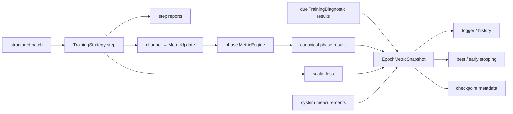

# Metrics、训练诊断与模型选择

Stochaflow 的 Metrics 子系统为 train、validation 和 test phase 提供 task-neutral 的
有状态统计。一个训练 epoch 的 train/validation loss、metric result、训练诊断结果和
运行测量会组织成同一份带来源信息的 epoch snapshot；logger、history、checkpoint、
best checkpoint 和 early stopping 消费这份 canonical result，不各自维护命名或聚合
规则。最终 test 使用相同 phase engine 和 canonical key，但当前顶层 train runner 只将
完整 test metrics 写入 logger，对外 summary 仍只保留 test loss；它尚未发布结构化
test snapshot。

本页描述当前正式支持的行为。自定义 Metric 的完整 Python surface 见
[Extension 公共 API](api/extensions.md#metrics)，按类别聚合的端到端实现见
[按类别验证与自定义 Metric](tutorials/class-metrics.md)，全部配置字段见
[配置参考](configuration/reference.md)。

## 职责边界

统计定义、执行上下文和决策政策是三个独立维度：

| 概念 | 生命周期 | 拥有内容 | 明确不拥有 |
| --- | --- | --- | --- |
| Objective | 一个 training step | 可微 scalar loss | 跨 batch 统计、报告与选择 |
| Step report | 一个成功 step | 低成本、无状态 scalar | Metric state、额外模型调用 |
| Phase Metric | 一个 train/validation/test phase | `reset/update/compute`、归约、数值结果 | batch 解释、模型调用、split、artifact、cadence |
| Training Diagnostic | 当前训练运行内的 event/cadence | 额外 forward、sampling、reconstruction、cache、artifact 或训练期观测 | 修改训练资产、正式 test lifecycle、checkpoint 选择政策 |
| Runtime measurement | 一次操作或时间窗口 | latency、throughput、显存、I/O 等运行事实 | 模型质量语义 |
| Evaluation | 冻结 subject/data/protocol 的独立运行 | 推理、metric、measurement、完整性、artifact 与结果发布 | 训练更新 |
| Selection policy | 每个可用 observation | best、early stopping、missing 与 improvement 规则 | 重算 metric、执行 diagnostic |

判定顺序是：

1. 参与 backward 的数值属于 Objective。
2. 只消费正常 Strategy step 已产生的 payload、随 phase batch 更新的统计属于
   Phase Metric。
3. 绑定当前训练运行，并需要额外模型调用、采样、缓存、artifact 或独立 cadence 的
   工作属于 Training Diagnostic。
4. 对冻结 checkpoint、数据和版本化 protocol 独立重跑并发布完整结果的工作属于
   Evaluation。
5. latency、throughput、显存和 I/O 等值属于 measurement；训练期可由 Diagnostic
   采集，正式性能协议可由 Evaluation 采集。

“计算昂贵”不是 Diagnostic 的类型定义。FID、KID、PSNR 等仍是统计算法：每隔若干
epoch 对当前训练状态额外采样时，由 Training Diagnostic 编排；对冻结 checkpoint
执行正式协议时，由 Evaluation 编排。反过来，一个很便宜但需要额外模型调用的训练期
probe 仍然是 Diagnostic。

当前发布版提供 phase metrics、Training Diagnostic 和训练期选择；尚未提供独立
`stochaflow evaluate` operation。最终 test phase 仍由训练 workflow 调用，当前
runner 也没有把完整 test metrics 发布为独立 result。项目级正式 benchmark 不能冒充为
普通 phase metric。

## 数据流与 channel

Metrics 不定义 universal `(prediction, target)` batch schema。Strategy 解释自己的
structured batch，并通过 task-owned channel 产生不透明 `MetricUpdate`：



`channel` 是 Strategy 与一个或多个 Metric 之间的语义路由键：

- 它由具体 Strategy 定义并通过 `MetricChannelProvider.metric_channels` 声明；
- 它描述 `MetricUpdate.args`/`kwargs` 的 payload contract；
- 多个 Metric 可以绑定同一 channel；
- 它不是日志 key、class label、data split、异步队列或全框架 batch schema；
- core 不从 batch、`TrainStepOutput.diagnostics` 或字段名称猜测 payload。

内置 Strategy 当前公开：

| Strategy | Channel | Payload |
| --- | --- | --- |
| supervised | `supervised.prediction_target` | prediction、target |
| Gaussian denoising | `gaussian.prediction_target` | prediction、target |
| Gaussian denoising | `gaussian.clean_reconstruction` | predicted clean、clean |

配置了 phase metrics 时，Strategy 必须声明所有被引用的 channel。组合阶段在训练开始前
检查兼容性；未配置 metrics 的自定义 Strategy 不需要实现该 capability。

## 配置 phase metrics

顶层 `metrics` 中每项声明一个稳定 id、Registry name、channel、phase 和构造参数：

```yaml
metrics:
  - id: prediction_mae
    name: mae
    channel: gaussian.prediction_target
    phases: [validation, test]
    params: {}

  - id: clean_reconstruction_mse
    name: mse
    channel: gaussian.clean_reconstruction
    phases: [validation, test]
    params: {}
```

规则如下：

- `id` 在整份配置中唯一，并且可安全用作 canonical tag segment；
- `phases` 只允许 `train`、`validation`、`test`，至少一项且不得重复；
- `params` 只传给 Metric constructor，不与运行时 update payload 合并；
- 同一 declaration 在每个 phase 构造独立实例，state 不跨 phase 或 run 共享；
- 配置解析不导入 Metric implementation；extension 激活后才通过 Registry 构造。

当前内置集合有意保持很小：

| Registry name | 语义 |
| --- | --- |
| `mean` | scalar mean，固定 `nan_strategy="error"` |
| `mse` | scalar mean squared error，固定 `squared=True`、`num_outputs=1` |
| `mae` | scalar mean absolute error，固定 `num_outputs=1` |

Stochaflow 不把整个 `torchmetrics.*` namespace 镜像为配置 API，也不接受任意 class
path。分类、按类别或领域 Metric 应由 extension 注册一个具有稳定名称和明确 update
contract 的 `torchmetrics.Metric` 子类。

## Phase lifecycle

`TrainingMetricRuntime` 为每个已配置 phase 组合一个隔离 `MetricEngine`：

```text
phase start
    -> reset
each successful phase step
    -> update(all required channels)
phase end
    -> compute
    -> normalize and publish
    -> reset
```

训练 phase 只提交成功 optimizer window 的 updates；发生 FP16 overflow 或其他
optimizer-step skip 时，不会把未提交窗口计入 train Metric。Validation/test 在成功的
`evaluation_step()` 后更新。

一个 engine 的每次 `update()` 必须提供该 scope 配置所需的全部 channel。这样缺失
payload 会在当前 step fail closed，而不是到 phase 结束时才产生基于不同样本集合的
结果。Strategy 可以同时产生当前 engine 没有绑定的额外 channel；这些 channel 会被该
engine 忽略，使同一个 Strategy 能为不同 phase/config 暴露稳定的 channel superset。
Metric update 失败会 reset 整个 engine 并终止 phase。

进入 Metric state 前，Tensor payload 会递归 detach，并在 `torch.no_grad()` 下更新。
Exact `dict`、`OrderedDict`、`MappingProxyType`、list、tuple、namedtuple 和安全
scalar leaf 受支持；其他持有 Tensor 的自定义有状态容器必须实现
`MetricPayloadDetachable`。Core 不反射 dataclass、任意 `Mapping` 实现或对象属性。

Metric 可以返回一个 scalar，或一个 key 合法的 flat scalar mapping。后者用于
per-class 与 macro 等结果：

```text
class_recall/class_0
class_recall/class_1
class_recall/macro
```

空 mapping、嵌套 mapping、list、bool、非 scalar Tensor 和 key collision 会被拒绝。
会保存全部 prediction/target 的 list-state Metric 必须由实现者声明内存上界；
MetricEngine 不会隐式截断 validation 数据或替它选择样本。
MetricEngine 与 `EpochMetricSnapshot` 不全局拒绝 `NaN`/`Inf`；未被选择政策消费的
非有限观测可以被记录。被 monitor 引用的结果必须 finite，否则训练失败。具体 Metric
仍可以像内置 `mean` 一样在自己的 update/compute contract 中采用更严格政策。
当前 Trainer 只承诺单进程结果；Metric 自己声明 reduction/synchronization state
不等于 Stochaflow 已支持 DDP 或 FSDP。

## Step report、loss 与 Metric

`TrainStepOutput` 中三类字段不可互换：

- `loss` 是用于 backward 的 scalar Tensor；
- `metrics` 是无状态、低成本的 step report，主要用于 batch logging；
- `metric_updates` 才进入有状态的 phase MetricEngine。

`loss_aggregation_weight` 只控制 epoch loss 的报告权重。它不会缩放 backward loss，
也不会自动成为 Metric sample weight；需要加权的 Metric 必须由 Strategy 在自己的
`MetricUpdate` 中显式提供权重。

## Canonical result 与来源

完成一个 epoch 后，框架使用以下 key：

```text
train/loss
valid/loss
test/loss
train/metrics/<metric-id>[/<subkey>]
valid/metrics/<metric-id>[/<subkey>]
test/metrics/<metric-id>[/<subkey>]
diagnostics/<diagnostic-id>/<metric...>
system/<scope>/<measurement...>
```

`validation` 的 canonical prefix 固定为 `valid`。旧 `train_loss`、`valid_loss`
及其他 underscore alias 没有 reader 或双写路径。

训练 epoch 的 `EpochMetricSnapshot` 为每个 value 保存一个严格对应的
`MetricSource`：

| 字段 | 含义 |
| --- | --- |
| `origin` | `phase`、`diagnostic` 或 `system` |
| `data_role` | `train`、`validation`、`test`、`external` 或 `null` |
| `protocol_id` | 可选的稳定协议身份 |
| `selection_eligible` | 该来源是否有资格被训练期选择政策引用 |

Canonical key 用于定位，来源 metadata 才决定数据治理和选择资格。一个
`diagnostics/...` 前缀不能自行证明结果来自 validation；`system/...` 当前承载
epoch、batch 数、耗时、optimizer step、skip 和其他运行测量，固定
`selection_eligible=false`。

Logger 只发布 scalar values；训练 history、checkpoint 和 model-selection policy
同时消费训练 epoch snapshot 的 values 与 source metadata。Final test 当前会记录
`test/...` scalar，但尚未形成可由下游读取的独立 typed snapshot；该缺口不能用手工
拼接日志伪装成 EvaluationResult。

## Training Diagnostic

`TrainingDiagnostic` 是绑定当前训练 invocation 的 observation-only lifecycle。它可以：

- 在 fit start、成功 optimizer step 后或 epoch end 接收事件；
- 按独立 cadence 做额外 forward、sampling 或 reconstruction；
- 管理本次 invocation 的 reference cache、临时 counter 和 artifact；
- 返回可合并到 epoch snapshot 的 `DiagnosticResult`。

它不得修改 framework-managed model、optimizer、scheduler、EMA 或 checkpoint state，
也不拥有 best/early-stopping 决策。当前 public event 仍暴露完整 Trainer，因此
observation-only 是 extension 必须遵守的行为契约，而不是 runtime 已通过权限隔离强制
保证的事实；实现不得保存或修改 event 中的 trainer-managed 对象。每次 training
invocation 都重新构造 Diagnostic；其 cache、打开的 logger/writer 和 counter 不进入
checkpoint。Framework 会在 public callback 外保存并恢复 Python、NumPy、Torch CPU
及相关 accelerator 的 global RNG state；需要连续随机流的 Diagnostic 应持有自己的
generator。

会返回 epoch scalar 的 Diagnostic 通过 `DiagnosticSourceProvider` 声明
`DiagnosticSourceRequest`。Composition 将 train/validation source role 绑定到本次
fit 的实际 iterable；另以 request protocol 和 `protocol_provenance` 中的 resolved
data config、data artifact identity 与 extension provenance 生成
`VerifiedMetricSource` 和稳定 SHA-256 protocol identity。Python iterable/object
identity 只用于当前进程核验，不进入 digest。Callback 只能引用已绑定的 `source_id`，
不能自行声称结果来自 validation 或可用于选择。

当前 training binder 只把 train/validation request 绑定到实际 fit iterable，并拒绝
test-role request。正式 test 不应在活动训练状态上作为 Diagnostic 执行。一个 Diagnostic
最多有一个 selection-eligible source，并且只有经过 composition 验证的 validation
source 可以获得该资格。

Epoch callback 的 cadence 语义是：

- 返回 `None`：本 epoch 没有 source 到期；
- 返回非空 `tuple[DiagnosticResult, ...]`：对应 source 已到期；
- 返回 `DiagnosticResult(metrics={})`：source 已到期但没有 scalar。

未知或重复 source、错误 canonical prefix、key collision、protocol mismatch，以及
已到期却缺少被监控结果都会失败。Diagnostic 的 scalar 在 checkpoint 选择前进入同一
snapshot；step-only observation 不能成为 epoch monitor。

Built-in Diagnostic 可以为非关键 artifact/probe 配置自己的 warn/raise 失败政策；一旦
其中的 scalar 被选作 monitor，provider failure、non-finite 或 due-but-missing 都必须
终止，不能被 warning 或 `missing: skip` 隐藏。

## Best checkpoint 与 early stopping

同一套 monitor policy 同时定义 best checkpoint 和可选 early stopping：

```yaml
trainer:
  early_stopping:
    enabled: true
    monitor: valid/metrics/prediction_mae
    mode: min
    missing: error
    patience: 8
    min_delta: 0.001
```

低频 validation Diagnostic 可以显式使用：

```yaml
trainer:
  early_stopping:
    enabled: true
    monitor: diagnostics/diffusion_quality/samplers/ddim_50/fid
    mode: min
    missing: skip
    patience: 5
    min_delta: 0.0
```

规则如下：

- phase loss/metric 应使用 `missing: error`；
- `missing: skip` 只允许 `diagnostics/...`，且只表示 source 尚未到 cadence；
- source 已到期却未返回 key、provider 失败或结果 non-finite 时仍然失败；
- 不 carry forward 上一次 Diagnostic 结果，也不使用零或 `NaN` 占位；
- patience 统计“已经观察但没有改善”的次数，不统计未到 cadence 的 epoch；
- 整个 fit 没有任何有效 monitor observation 时失败；
- train/validation phase source 可以被训练期 best policy 显式选择；
- Diagnostic 只有 verified validation source 可以被选择；
- test、external 和 system source 永远不能控制 best checkpoint 或 early stopping。

记录一个数值不会自动让它参与决策；只有配置显式引用、source metadata 允许并通过
运行时检查时，selection policy 才消费它。

## Checkpoint 与 strict resume

Metric runtime state 不写入 checkpoint。当前 checkpoint 只在完整 epoch 边界保存，
下个 phase 会重新构造或 reset state；保存 list-state Metric 还可能把全部 prediction
或 target 意外塞入 checkpoint。

Checkpoint v11 保存：

- 完整 `EpochMetricSnapshot` values 与逐 key source metadata；
- resolved metric declarations 与 extension provenance；
- monitor key、mode、missing、min_delta；
- best value/epoch、patience、有效 observation 与未改善计数。

Strict resume 在修改 runtime 前验证并恢复这些字段。不能在 resume 时更换 metric
declaration、monitor policy、patience 或 observation 语义。恢复从下一个完整 epoch
开始，不恢复半个 phase 的 Metric state。详细 wire contract 见
[Checkpoint、配置权威与可移植性](configuration/compatibility-and-migration.md)。

## 扩展、按类别结果与测试

第三方 Metric 注册到 `REGISTRIES.metrics`，并由项目 Strategy 提供匹配的 channel。
Core 不根据 Metric class、constructor 参数或名称推断 batch signature。一个可靠的
extension 至少应测试：

- Registry 构造与错误参数；
- Strategy 声明的 channel 和实际 `MetricUpdate` payload；
- scalar 或 flat mapping normalization；
- train/validation/test state 隔离；
- logger、history、checkpoint 与 monitor 使用同一 canonical key；
- test/system result 不能参与选择；
- variable-size batch 所需的 Metric state 或显式 weight 语义。

按类别 Metric 应返回中性的 stable subkey，例如 `class_0`、`class_1` 和 `macro`。
具体数据集显示名称属于数据集或 Evaluation protocol，不进入 MetricEngine 分支。
完整示例见[按类别验证与自定义 Metric](tutorials/class-metrics.md)。

## 当前边界

- Trainer 当前只支持单进程；distributed reduction、uneven validation 去重和
  rank-zero Diagnostic publication 尚无框架承诺。
- MetricEngine 不管理额外 sampling、reference cache、artifact 或模型 mode。
- Training Diagnostic 是训练期 probe，不是低配 Evaluation；当前 event 仍暴露完整
  Trainer，observation-only 尚未由窄 capability 隔离强制保证。
- 独立 checkpoint Evaluation、不可变 EvaluationResult、grouped generation protocol
  和 result gate 尚未进入当前公开 runtime。
- Final test 已计算并记录配置的 `test/metrics/...`，但顶层 runner 尚未返回完整 typed
  test snapshot。
- 硬件吞吐、显存和长训练质量是有环境 provenance 的运行证据，不是 Metrics
  correctness 或架构合并门槛。
