# Part I：从生成建模到分布动力学——问题、对象与工具

> **核心问题**　How can we construct a generative mechanism that transports a
> simple distribution into the data distribution?

生成模型的许多概念属于不同抽象层级：Neural ODE 是动力学参数化，CNF 是密度变换框架，Flow Matching 是训练目标，Optimal Transport 可以指导 coupling 与路径选择，ODE solver 则是数值工具。把这些名字简单并列会掩盖它们之间的组合关系。

本文沿着下面的线索组织：

$$
\begin{gathered}
\text{Generative modeling} \\
\downarrow \\
\text{distribution representation} \\
\downarrow \\
\text{distribution transformation} \\
\downarrow \\
\text{transport dynamics}
\end{gathered}
$$

记简单源分布为 $p_0$，数据分布为 $p_{\mathrm{data}}=p_1$。目标是构造一种机制，使

$$
X_0\sim p_0 \quad\Longrightarrow\quad X_1\sim p_1.
$$

这个机制可以是一张映射、一条 ODE，也可以是一条 SDE。不同方法选择了不同的数学对象、训练信号与路径约束；网络结构只是其中一层。

---

## 1. 生成建模究竟在求什么？

数据只以样本的形式出现：$x_1,\ldots,x_n\sim p_{\mathrm{data}}$。我们看不到
$p_{\mathrm{data}}$ 的解析密度，真正可用的是经验分布

$$
\widehat p_n=\frac{1}{n}\sum_{i=1}^n\delta_{x_i}.
$$

生成建模可以写成密度近似

$$
p_\theta(x)\approx p_{\mathrm{data}}(x),
$$

也可以写成一个生成机制

$$
Z\sim p_0,
\qquad
X=G_\theta(Z).
$$

第二种写法更接近本文关心的问题：随机性先从一个易采样的基分布 $p_0$ 产生，模型再把它变成数据样本。

若 $T:\mathcal Z\to\mathcal X$ 是可测映射，它对 $p_0$ 的推前（pushforward）定义为

$$
(T_\#p_0)(A)=p_0\!\left(T^{-1}(A)\right).
$$

于是生成任务可以表述为寻找 $T_\theta$，使

$$
T_{\theta\#}p_0\approx p_{\mathrm{data}}.
$$

这里有两个容易忽略的事实。第一，$T_\theta$ 即使完全确定，$T_\theta(Z)$ 仍然是随机变量，因为输入 $Z$ 是随机的。第二，满足
$T_\#p_0=p_{\mathrm{data}}$ 的映射通常不唯一；端点分布也不会告诉我们中间应该怎样移动概率质量。

因此，生成模型至少包含两个不同的问题：怎样表示一个复杂分布，以及怎样把一个已知分布变成它。

---

## 2. 表示分布与变换分布

显式密度、潜变量模型和隐式生成器，首先是三种分布表示方式：

| 表示对象 | 数学形式 | 容易获得 | 主要代价 |
|---|---|---|---|
| 显式密度 | $p_\theta(x)$ | likelihood | 归一化或因子分解约束 |
| 潜变量联合分布 | $p_\theta(x,z)$ | 层次表示 | 后验 $p_\theta(z\mid x)$ 常不可解 |
| 隐式生成器 | $x=G_\theta(z)$ | sampling | 通常不能查询归一化密度 |

输运方法则进一步指定状态怎样演化。例如，连续时间动力学可以是

$$
\begin{aligned}
\text{ODE:}\quad
\mathrm dX_t &= v_t(X_t)\,\mathrm dt,\\
\text{SDE:}\quad
\mathrm dX_t &= f_t(X_t)\,\mathrm dt+g_t\,\mathrm dW_t.
\end{aligned}
$$

“显式或隐式”描述分布的表示，“确定性或随机性”描述状态的演化，这两个维度彼此独立。Continuous Normalizing Flow（CNF）使用确定性 ODE，同时仍能计算显式密度，就是一个直接的例子。

与其画一棵混合不同抽象层级的模型树，不如分开看以下几项：

| 设计问题 | 常见选择 |
|---|---|
| 学习对象 | density、latent posterior、map、transition、score、velocity |
| 状态演化 | single map、discrete chain、ODE、SDE |
| 训练信号 | likelihood、ELBO、adversarial loss、score matching、velocity regression |
| 路径设计 | corruption、schedule、coupling、probability path、stochasticity |
| 生成算法 | ancestral sampling、ODE/SDE solver、deterministic update、skipped grid |

例如，Neural ODE、Flow Matching、OT coupling 和 Euler solver 可以共同组成一个生成方案：它们分别回答参数化、训练、配对和数值积分的问题。

---

## 3. Generative model 谱系与分类学

生成模型发展出许多名称，其中有些名称描述概率表示，有些描述训练准则，有些描述动力学，还有一些只描述采样算法。把它们放回各自的抽象层级，能够快速判断一个新方法改动了生成机制的哪一部分。

这里追求范式级的完整性，覆盖现代生成建模的主要思想路线和 transport 分支。具体网络架构、条件机制与应用变体属于正交维度，例如 U-Net、Transformer、class conditioning 和 text conditioning 都可以服务于多种生成范式。

从生成目标出发，可以沿两条互补主线整理方法。第一条主线研究怎样表示或比较目标分布，包括 normalized density、latent-variable likelihood、unnormalized energy 和 implicit distribution matching。第二条主线研究怎样把基分布运输到数据分布，包括直接 map、确定性 flow 和 stochastic flow。同一方法可能同时出现在两条主线上。

谱系给出思想来源，多轴分类表给出方法的技术坐标。Stochastic flow 是动力学层的上位概念，泛指由随机 transition kernel、Markov chain 或 SDE 推动的 distribution evolution。Diffusion 在其中选择逐步 corruption 与反向恢复；DDPM 给出离散 Gaussian Markov construction；DDIM 位于训练完成后的 compatible process / sampler 层，复用 denoiser 并改变跨时间依赖、随机性和时间网格。

### 3.1 范式级谱系

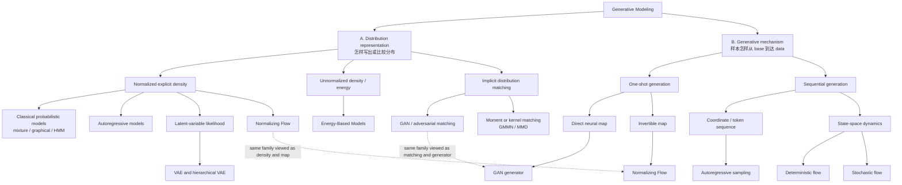

这棵树有两个根问题。representation 分支关心模型如何赋予概率、能量或分布差异；generative mechanism 分支关心一次映射、序列分解或动力学怎样产生样本。VAE 主要解决 latent-variable inference，GAN 主要解决 implicit distribution matching，Normalizing Flow 同时提供可逆 transport 与 exact likelihood。

### 3.2 Transport dynamics 的细化谱系

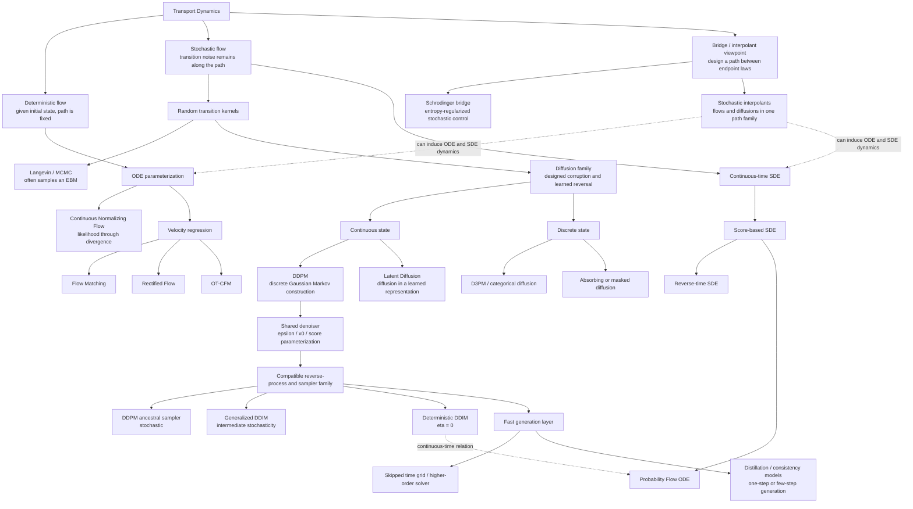

这张细化图给出 stochastic flow、DDPM 与 DDIM 的准确位置：

1. **Stochastic flow** 描述随机动力学这一整层。MCMC、随机 Markov chain、SDE、diffusion 和 bridge process 都能落在这层，但目标函数与端点约束可能不同。
2. **Diffusion family** 选择一条可控的 forward corruption path，再学习能够反演该路径的信息。连续状态 Gaussian diffusion、离散状态 D3PM 和 latent-space diffusion 都是这一原则的实例。
3. **DDPM** 是 diffusion family 中的离散时间 Gaussian Markov construction。它同时规定 forward chain、训练用的 perturbation marginals、变分分解与 ancestral sampler 的基本形式。
4. **DDIM** 建立在 DDPM-compatible denoiser 之上。它研究 same per-time marginals 下可以怎样重新连接时间切片，因此属于 compatible joint process 与 sampler family。$\eta=0$ 给出 deterministic pathwise update，$0<\eta\leq 1$ 保留不同程度的 transition noise。
5. **Probability Flow ODE** 从 score-based SDE 构造 deterministic dynamics。Deterministic DDIM 在连续时间极限及相应参数化下与它紧密相连；有限步 DDIM 仍是一串离散 map。
6. **Consistency model 与 distillation** 主要解决多步生成的计算成本。它们处在 fast generation 层；consistency model 也可以独立训练，因此不必依赖一个预训练 diffusion teacher。

### 3.3 多轴分类表

谱系说明思想来源；下面的表回答“一个具体方法究竟选择了哪些工具”。

| 方法族 | 分布表示或生成对象 | 状态演化 | 主要学习对象 | 典型训练信号 | 典型生成方式 |
|---|---|---|---|---|---|
| Classical latent models | normalized density with latent variables | latent sampling / structured process | distribution parameters | maximum likelihood / EM | ancestral latent sampling |
| Autoregressive | normalized conditional density | coordinate or token sequence | next-step conditional | maximum likelihood | sequential ancestral sampling |
| VAE | latent-variable likelihood | latent sample followed by decoder | encoder + decoder | ELBO | one decoder pass after latent sampling |
| GAN | implicit distribution | direct neural map | generator + discriminator | adversarial objective | one generator pass |
| EBM | unnormalized energy | sampler chosen separately | energy $E_\theta(x)$ | likelihood gradient / contrastive objectives | MCMC or Langevin dynamics |
| Normalizing Flow | normalized density + invertible map | discrete invertible maps | bijection and Jacobian | exact likelihood | inverse/forward map composition |
| CNF | normalized density + flow map | ODE | vector field + density change | likelihood | ODE integration |
| Flow Matching | endpoint transport | ODE | marginal velocity | conditional velocity regression | ODE integration |
| Rectified Flow / OT-CFM | endpoint transport with coupling geometry | ODE | velocity | rectification or conditional FM | ODE integration, often coarse grid |
| Score model / NCSN | noisy marginal geometry | noise levels or annealed dynamics | score | denoising score matching | annealed Langevin / related sampler |
| Score SDE | stochastic transport marginals | forward/reverse SDE or PF-ODE | time-dependent score | continuous-time score matching | reverse SDE or PF-ODE solver |
| DDPM | latent trajectory + stochastic transport | discrete Gaussian Markov chain | noise, $x_0$, score, or reverse kernel | ELBO and denoising regression | ancestral reverse chain |
| DDIM | reuses diffusion marginals and denoiser | generalized discrete joint process | no new network required | reuses DDPM training | stochastic or deterministic update |
| D3PM / masked diffusion | discrete-state corruption path | categorical Markov chain | clean token / transition statistics | variational and reconstruction losses | discrete reverse chain |
| Schrödinger bridge | endpoint-constrained stochastic transport | controlled diffusion | forward/backward drift or potentials | stochastic control / bridge objectives | controlled SDE |
| Stochastic interpolant | designed bridge between endpoint laws | ODE and/or SDE | velocity, score, or drift | quadratic field regression | ODE or SDE solver |
| Consistency model | trajectory-wise self-consistent map | one-step or few-step maps | consistency function | distillation or standalone consistency training | one/few evaluations |

这张表也说明几组容易混淆的关系：

- **Neural ODE** 是 continuous dynamics 的参数化框架；**CNF** 用它计算 density evolution；**Flow Matching** 提供训练 vector field 的回归原则。
- **Optimal Transport** 主要指导 endpoint coupling、path geometry 或 action cost；**OT-CFM** 把这种原则带入 conditional Flow Matching。
- **Score、$\epsilon$、$x_0$ 与 $v$ prediction** 是相互关联的网络参数化，具体换算依赖 perturbation path。
- **DDPM、DDIM 与 solver** 分属 construction、compatible sampler family 和 numerical integration 三个层次。
- **Latent Diffusion** 指 diffusion 运行在 learned latent representation；latent space 与 stochastic dynamics 是两个可组合维度。

### 3.4 四个正交维度

以下标签会横跨整棵谱系，适合单独记录：

| 正交维度 | 典型选择 |
|---|---|
| 状态空间 | continuous、categorical、sequence、graph、learned latent |
| 条件信息 | unconditional、class、text、image、multimodal、structured condition |
| 网络架构 | MLP、CNN/U-Net、RNN、Transformer、graph network |
| 生成预算 | one-shot、autoregressive、few-step、many-step、adaptive solver |

例如，Transformer 可以参数化 autoregressive conditional、diffusion denoiser、flow velocity 或 consistency function；“Transformer model”本身无法确定它属于哪一种生成范式。Class conditioning 与 classifier-free guidance 也只改变条件接口和采样 guidance，不会单独形成一条基础谱系。

接下来的三种背景策略对应 representation 分支。随后笔记沿 transport dynamics 深入 ODE flow、Flow Matching、stochastic flow、score-based diffusion 与 probability flow ODE。Part II 会放大 DDPM 这一节点，Part III 会沿 compatible sampler family 展开 DDIM 的 trajectory freedom。

---

## 4. 三种背景策略

这一节只给后面的输运视角提供坐标，不展开模型结构。

### 4.1 显式密度：把联合分布拆成条件分布

自回归模型利用概率链式法则

$$
p_\theta(x)=\prod_{i=1}^d p_\theta(x_i\mid x_{<i}),
$$

将最大似然训练分解为

$$
-\log p_\theta(x)
=-\sum_{i=1}^d\log p_\theta(x_i\mid x_{<i}).
$$

链式法则本身是恒等式；真正的建模选择是变量顺序、条件分布的参数化以及可用上下文。这样做可以精确计算 likelihood，但生成必须按顺序进行。它解决的是“如何直接写出概率”，并没有显式设计一条从噪声到数据的连续路径。

### 4.2 潜变量：在隐藏空间中解释观测

潜变量模型假设观测由隐藏变量生成：

$$
z\sim p(z),
\qquad
x\sim p_\theta(x\mid z).
$$

VAE 用近似后验 $q_\phi(z\mid x)$ 处理真实后验不可解的问题。恒等式

$$
\begin{aligned}
\log p_\theta(x)
&=\mathcal L_{\mathrm{ELBO}}(x)\\
&\quad+D_{\mathrm{KL}}\!\left(
q_\phi(z\mid x)\,\Vert\,p_\theta(z\mid x)
\right),\\
\mathcal L_{\mathrm{ELBO}}(x)
&=\mathbb E_{q_\phi(z\mid x)}
\!\left[\log p_\theta(x\mid z)\right]\\
&\quad-D_{\mathrm{KL}}\!\left(
q_\phi(z\mid x)\,\Vert\,p(z)
\right).
\end{aligned}
$$

说明 ELBO 的缺口正是 approximate posterior 与 true posterior 的 KL divergence。重参数化
$z=\mu_\phi(x)+\sigma_\phi(x)\odot\epsilon$ 使这个下界可以用随机梯度优化。

DDPM 后面也会被写成带有 latent trajectory $x_{1:T}$ 的变分模型，不过它把 forward inference process 固定成了一个可解析的高斯链。

### 4.3 隐式匹配：只要求生成器会采样

GAN 省去显式密度 $p_\theta(x)$，直接定义

$$
z\sim p_0,
\qquad
x=G_\theta(z),
$$

再让判别器比较真实样本与生成样本。原始 minimax 目标为

$$
\begin{aligned}
\min_G\max_D\quad
&\mathbb E_{x\sim p_{\mathrm{data}}}
\!\left[\log D(x)\right]\\
&+\mathbb E_{z\sim p_0}
\!\left[\log\!\left(1-D(G(z))\right)\right].
\end{aligned}
$$

它绕过了显式密度，同时引入了一个可能不稳定的两方博弈。Flow Matching 同样不需要数据密度，其训练信号来自条件速度回归。这个差别将把讨论带到分布输运。

---

## 5. 动力学工具箱：规则、轨迹、映射和分布

在讨论 transport 前，需要把几个经常被混用的对象分开。

### Vector field

$$
\frac{\mathrm dx}{\mathrm dt}=v(x,t)
$$

中的 $v$ 是每个时空位置的局部运动规则。给定初值并积分这条规则，才会得到具体 trajectory。

### Trajectory

固定初值 $x_0$ 后，积分 vector field 得到

$$
x_t=\phi_{0\to t}(x_0).
$$

它描述一个粒子随时间的路径。

### Flow map

$$
\phi_{0\to t}:x_0\mapsto x_t
$$

同时描述所有初值如何被送到时间 $t$。在满足 ODE 唯一性条件时，它是 deterministic map。

### Pushforward 与 distribution path

若 $X_0\sim p_0$，则

$$
X_t=\phi_{0\to t}(X_0),
\qquad p_t=(\phi_{0\to t})_\#p_0.
$$

$\{p_t\}_{t\in[0,1]}$ 描述分布层面的 probability path；particle trajectory 描述单个状态的运动。

### 随机性的三层来源

| 问题 | ODE | SDE |
|---|---|---|
| vector field / coefficients 给定后 | 运动规则确定 | 漂移与扩散规则确定 |
| 固定同一个初值 | trajectory 唯一 | Brownian path 仍使 trajectory 随机 |
| 从随机 base 抽初值 | 输出 sample 随机 | 输出 sample 随机，且另有 pathwise randomness |
| induced evolution | continuity equation | Fokker--Planck equation |

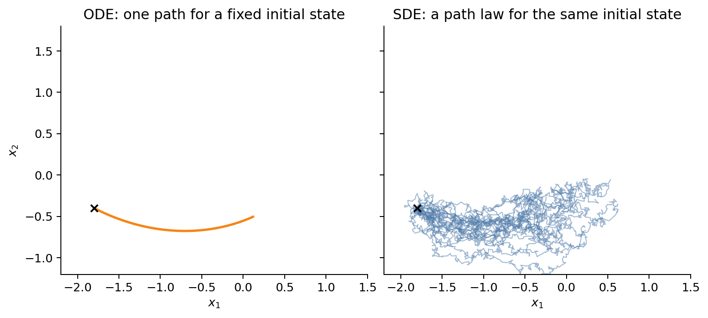

这张图隔离了 pathwise randomness：两侧初值相同，ODE 只有一条路径，SDE 定义一族路径。反过来，即使完全确定的 ODE，只要从 $p_0$ 抽不同初值，生成样本仍然随机。

### One-time marginals 仍不足以定义过程

知道每个 $p_t$ 不代表知道同一个粒子如何跨时间配对，因此不唯一决定 joint path law。下面两组过程在每个时间切片可以具有相同条件 marginal，却有不同 temporal dependence：

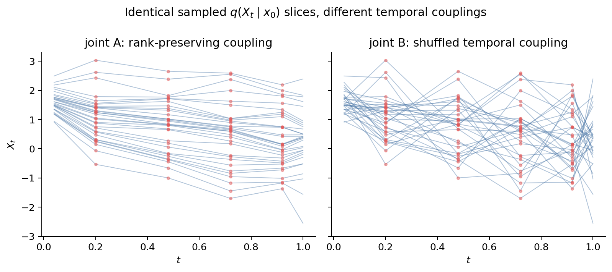

这个区别是后续 DDIM 的逻辑起点：训练可能识别每个噪声等级的 denoising relation，却未识别唯一 trajectory。

---

## 6. Distribution Transport：中心视角

### 从端点匹配到运输代价

前三类方法回答“如何表示复杂分布”。现在改问：给定

$$
X_0\sim p_0,
$$

怎样构造 $T$ 或动态过程使 $X_1\sim p_1$？

### Map 还是 coupling

Monge 形式假设质量可以由单值映射搬运且不需要分裂；更一般的 Kantorovich 形式允许 coupling $\pi(x_0,x_1)$ 描述质量如何配对。

### Monge、Kantorovich 与动态 OT

静态 Monge 问题：

$$
\min_{T:T_\#p_0=p_1}
\mathbb E_{X_0\sim p_0}[c(X_0,T(X_0))].
$$

Kantorovich 松弛为

$$
\min_{\pi\in\Pi(p_0,p_1)}
\mathbb E_{(X_0,X_1)\sim\pi}[c(X_0,X_1)].
$$

当 $c(x,y)=\lVert x-y\rVert_2^2$ 时，Benamou--Brenier 动态形式把它写成最小动能问题：

$$
\min_{p_t,v_t}
\int_0^1\!\int
\frac{1}{2}\lVert v_t(x)\rVert_2^2p_t(x)\,
\mathrm dx\,\mathrm dt,
$$

满足连续性方程

$$
\partial_t p_t+\nabla\!\cdot(p_tv_t)=0,
\qquad p_{t=0}=p_0,\ p_{t=1}=p_1.
$$

### 端点不决定路径

端点分布并不指定 coupling，也不指定概率路径。Optimal Transport 额外给定 cost，并从合法运输中选择代价最小的解。

### 计算与几何上的限制

高维 OT 本身计算昂贵；经验 minibatch coupling 只是全局 OT plan 的局部近似。最短几何路径也未必是神经网络和数值求解器最容易学习的路径。

### 两种动力学

这一动态形式直接引出两条路线：确定性 ODE 用 continuity equation 搬运概率质量；随机 SDE 用 Fokker--Planck equation 同时结合漂移与扩散。

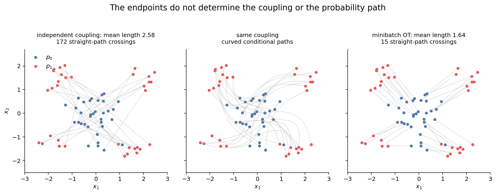

图中三列端点相同，但 coupling 与路径不同。直线路径不自动等于 OT；只有配对本身来自 OT plan 时，直线 displacement interpolation 才具有 OT 含义。

---

## 7. 决定性输运：从可逆 map 到连续动力学

### 7.1 Normalizing Flow：可逆性换取 exact likelihood

#### 可逆性为什么出现

若 $x=f_\theta(z)$ 可逆且维数相同，就能把已知 $p_0(z)$ 转成可计算的数据密度。

#### 变量替换所需条件

$f_\theta$ 必须是双射、足够光滑，Jacobian determinant 可计算。可逆性主要服务于变量替换和密度计算；单纯采样并不要求生成器可逆。

#### Change of variables

$$
\log p_X(x)=\log p_Z(f_\theta^{-1}(x))
+\log\left|\det\frac{\partial f_\theta^{-1}}{\partial x}\right|.
$$

复合多个简单可逆层可以累加 log-determinant。

#### 同一个映射的两个方向

Normalizing Flow 同时给出两个方向：$z\to x$ 用于采样，$x\to z$ 用于 likelihood。这是“变换即表示”。

#### 可逆结构的代价

同维双射不能自然处理离散数据或维数改变；通用 dense Jacobian 的 determinant 代价高，迫使架构采用 coupling、autoregressive 或特殊线性结构。

#### 从离散层到连续流

Continuous Normalizing Flow 把离散可逆层的复合极限写成 ODE，以 divergence 代替每层 Jacobian determinant。

### 7.2 Neural ODE / Continuous Normalizing Flow

#### 连续深度

将残差更新

$$
x_{k+1}=x_k+\Delta t\,v_\theta(x_k,t_k).
$$

取连续极限，得到

$$
\frac{\mathrm dX_t}{\mathrm dt}=v_\theta(X_t,t).
$$

#### ODE 解的唯一性

向量场需满足使初值问题存在且唯一的正则条件（常见充分条件是对 $x$ 局部 Lipschitz）。这保证不同轨迹不会在有限时间交叉并合，从而形成可逆 flow map。

#### 密度沿轨迹如何变化

给定初值 $X_0=x$，ODE 解定义 flow map $\Phi_t(x)$。密度满足 continuity equation，并沿轨迹满足 instantaneous change of variables：

$$
\frac{\mathrm d}{\mathrm dt}\log p_t(X_t)
=-\nabla\cdot v_\theta(X_t,t).
$$

#### 四个容易混淆的对象

- **Vector field** $v(x,t)$：在每个时空点指定速度，确定性。
- **Trajectory** $X_t$：初值给定后由 ODE 唯一确定。
- **Flow map** $\Phi_t:x_0\mapsto x_t$：确定性映射。
- **Generated sample** $X_1=\Phi_1(X_0)$：因 $X_0\sim p_0$ 而随机。

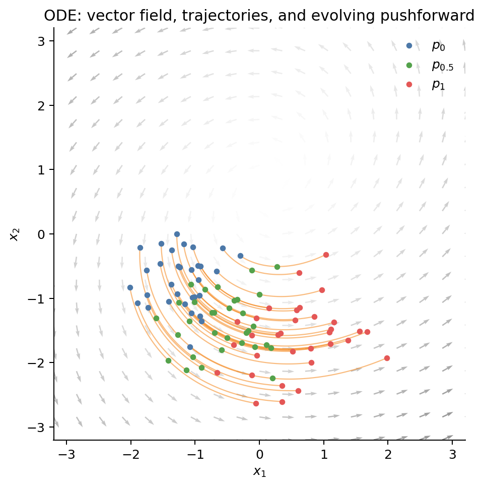

#### 数值积分与拓扑限制

训练 likelihood 需要沿 ODE 积分并估计 divergence；函数评估次数依赖 solver 和向量场刚性。ODE 的拓扑约束也限制同维光滑可逆流能实现的映射。

#### 训练 vector field 的缺口

一旦得到合适的 $v_t$，CNF 的生成过程就是积分这条 ODE。剩下的问题是：边缘速度场未知时，如何避免在每次训练更新中都求解 ODE？

---

## 8. ODE 已选定，velocity 从哪里来？Flow Matching

**Motivation**

传统 CNF 最大似然训练在每次参数更新中都要调用 ODE solver。Flow Matching 反过来：先人为选择一条可采样的概率路径 $p_t$，再用监督回归学习产生这条路径的速度场。

**Assumption**

条件构造需要满足三点：

1. 从条件路径 $p_t(x\mid z)$ 采样；
2. 计算其条件速度 $u_t(x\mid z)$；
3. 使混合后的边缘路径从 $p_0$ 到达 $p_1$。

这条概率路径是建模选择，并不由端点数据唯一确定。

**Derivation**

若目标路径满足

$$
\partial_t p_t+\nabla\cdot(p_tu_t)=0.
$$

理想的不可直接计算目标为

$$
\mathcal L_{\mathrm{FM}}(\theta)
=\mathbb E_{t,X_t\sim p_t}
\left\lVert v_\theta(X_t,t)-u_t(X_t)\right\rVert_2^2.
$$

构造易处理的条件路径 $p_t(x\mid Z)$ 和条件向量场 $u_t(x\mid Z)$，训练

$$
\mathcal L_{\mathrm{CFM}}(\theta)
=\mathbb E_{t,Z,X_t\sim p_t(\cdot\mid Z)}
\left\lVert
v_\theta(X_t,t)-u_t(X_t\mid Z)
\right\rVert_2^2.
$$

在适当正则条件下，其最优边缘场是条件场的 posterior average：

$$
u_t(x)=\mathbb E[u_t(x\mid Z)\mid X_t=x],
$$

且 CFM 与不可访问的 FM 目标对 $\theta$ 有相同梯度。

最简单的端点条件路径为

$$
\begin{aligned}
X_t&=(1-t)X_0+tX_1,\\
u_t(X_t\mid X_0,X_1)&=X_1-X_0.
\end{aligned}
$$

**Insight**

这里的“直接”指训练标签就是瞬时速度。训练期间无需先估计密度或模拟模型 ODE；采样时才积分

$$
\mathrm dX_t=v_\theta(X_t,t)\,\mathrm dt.
$$

不过它“直接”学习的是所选概率路径的向量场，并不意味着真实世界存在唯一真速度。

条件目标可能方差很大：同一位置 $x_t$ 可由许多端点配对到达，它们给出冲突速度，网络只能学习条件平均。路径交叉与弯曲会增加回归和积分难度。

**Visualization**

训练时真正可见的是每条 conditional path 的 velocity label；同一局部位置可能收到互相冲突的 labels。平方回归把它们投影成条件平均后的 marginal field：

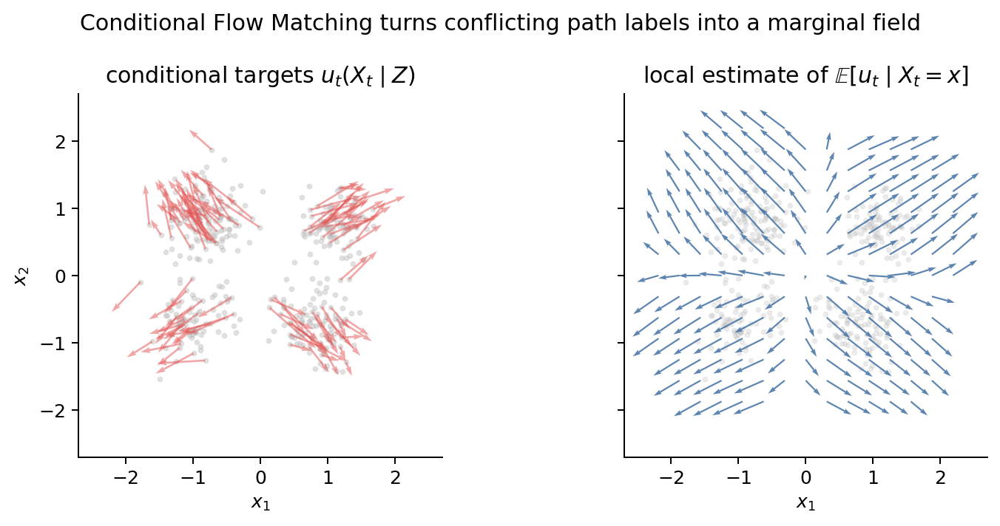

左图给出条件构造产生的 noisy supervision；右图用局部核平均近似
$\mathbb E[u_t\mid X_t=x]$。这解释了 Flow Matching 为什么既能用可计算 conditional target，又能得到推动 marginal path 的场。

**Connection**

OT coupling 尝试减少无意义的交叉和路程；diffusion path 也可放进 Flow Matching 框架。因此，Flow Matching 可以使用 diffusion path，也可以使用完全不同的概率路径；它本身是一种训练确定性速度场的方法。

---

## 9. 为什么不能弯曲，甚至绕三圈？

### 端点相同，路径仍可不同

只指定 $p_0,p_1$ 时，不存在唯一 $p_t$。训练难度和采样速度很大程度上由所选中间概率路径决定。

### 直线只是一种 conditional path

线性插值

$$
X_t=(1-t)X_0+tX_1.
$$

只在给定端点 pair 后是直线。若 $(X_0,X_1)$ 独立采样，整体边缘流可能出现大量交叉；若 pair 来自 OT coupling，则得到完全不同的向量场。

### 曲线路径与 OT displacement interpolation

一个保持相同端点的弯曲族可写为

$$
X_t=(1-t)X_0+tX_1+a\sin(\pi t)n(X_0,X_1),
$$

其中 $n$ 是与端点位移垂直的单位方向。$\sin(\pi t)$ 在两端为零，因此不改变 $p_0,p_1$，却改变所有中间速度。

OT displacement interpolation 则从 $\pi^\star$ 采样端点对并使用直线：

$$
(X_0,X_1)\sim\pi^\star,
\qquad X_t=(1-t)X_0+tX_1.
$$

### 路径选择怎样影响学习与采样

路径选择会同时改变：

- target velocity 的方差；
- 轨迹曲率与长度；
- ODE solver 所需函数评估次数；
- 近似网络的容量要求。

“直”通常有利于少步采样，但局部直条件路径的混合不保证边缘轨迹处处笔直。

### Minibatch OT 的边界

minibatch OT 依赖 batch composition，可视为总体 OT 的局部近似，并带有 batch-dependent bias。实际路径设计还可能考虑感知几何、条件约束和网络计算成本。

### 与 DDIM 的呼应

DDIM 会揭示相似的自由：相同 noisy marginals 与同一个 $\epsilon_\theta$ 可以支持多条反向轨迹。Flow Matching 先选择路径再学速度；DDIM 在已有 denoiser 后重新选择采样路径族。

---

## 10. 随机输运：为什么允许动力学本身携带噪声？

**Motivation**

SDE 提供了另一种分布输运方式。持续噪声可以先平滑复杂甚至低维的数据分布，再从易处理的噪声分布反演。

**Assumption**

Itô SDE

$$
\mathrm dX_t=f(X_t,t)\,\mathrm dt+g(t)\,\mathrm dW_t.
$$

假设 drift、diffusion 满足解存在性条件；$W_t$ 是 Brownian motion。固定初值后，ODE 给出唯一轨迹，SDE 则给出一族随机路径。

**Derivation**

Brownian motion 的增量满足

$$
W_{t+\Delta t}-W_t\sim\mathcal N(0,\Delta t),
$$

且不相交时间区间的增量独立。

当 $g$ 是仅随时间变化的标量时，SDE 的边缘密度满足 Fokker--Planck equation：

$$
\partial_t p_t
=-\nabla\cdot(f p_t)+\frac{1}{2}g(t)^2\Delta p_t.
$$

第一项运输质量，第二项扩散和平滑密度。

**Insight**

要分开三个层次：SDE 系数 $(f,g)$、随机路径 law、时间边缘 $p_t$。不同路径 law 可能共享相同或相近边缘演化；只训练边缘信息不会唯一确定路径耦合。

采样必须离散随机微分方程，带来步长误差与采样方差。反向时间动力学还依赖未知的边缘 score。

**Visualization**

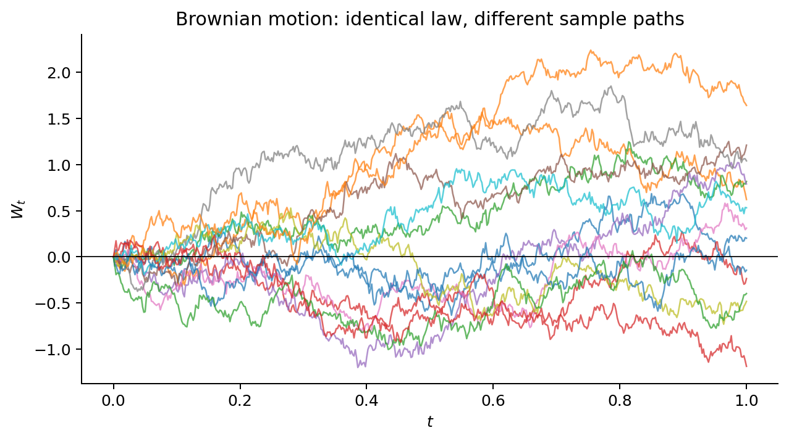

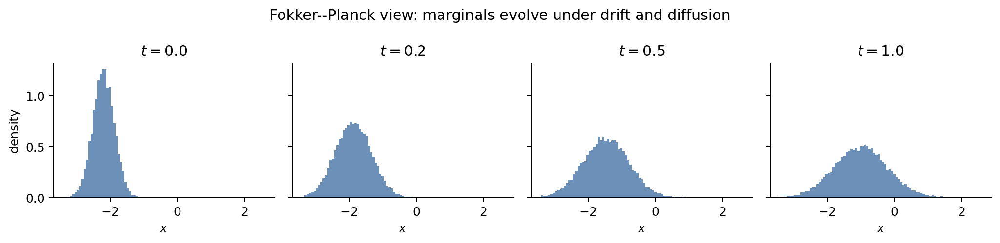

前一张图固定过程定义并重复采样 Brownian path；后一张图观察由这些随机路径诱导的 marginal evolution。

**Connection**

Score-based diffusion 选择一个已知 forward SDE 把数据破坏成先验，再学习足以定义 reverse-time SDE 的 score field。

---

## 11. 反向随机输运缺什么？Score 提供局部概率几何

**Motivation**

Forward 加噪易于设计，reverse 去噪却依赖 $p_t$。反向 drift 不需要完整的归一化密度，只需要

$$
s_t(x)=\nabla_x\log p_t(x).
$$

**Assumption**

forward diffusion 的终点必须足够接近已知 prior；噪声使 $p_t$ 在 $t>0$ 时平滑并具有可定义 score；神经网络 $s_\theta(x,t)$ 要能在所有噪声尺度上逼近它。

**Derivation**

对 forward SDE

$$
\mathrm dX_t=f(X_t,t)\,\mathrm dt+g(t)\,\mathrm dW_t,
$$

反时间 SDE 可写为（令时间变量从 $T$ 向 $0$ 积分）

$$
\mathrm dX_t
=\left[f(X_t,t)-g(t)^2s_t(X_t)\right]\mathrm dt
+g(t)\,\mathrm d\overline W_t.
$$

这里 $\mathrm dt<0$；若改用递增的反向时钟，drift 的符号也要相应改写。忽略这一约定是扩散推导中常见的符号错误。

去噪 score matching 可通过带条件噪声的可计算 target 训练：

$$
\mathbb E_{t,x_0,x_t}
\lambda(t)\left\lVert
s_\theta(x_t,t)-\nabla_{x_t}\log p(x_t\mid x_0)
\right\rVert_2^2.
$$

其 population optimum 等于边缘 score，原因同样是条件期望投影。

**Insight**

Diffusion 不直接学习每个粒子的 velocity；它学习每个 noisy marginal 的局部 log-density geometry，再把 score 放入由随机过程理论给出的 reverse dynamics。

score 只在 $p_t$ 高概率区域得到充分监督；低噪声时数据流形附近的场可能尖锐，高噪声时信号很弱。噪声权重、时间参数化与 solver 都影响训练和采样。

**Visualization**

Score 指向 log-density 上升最快方向：

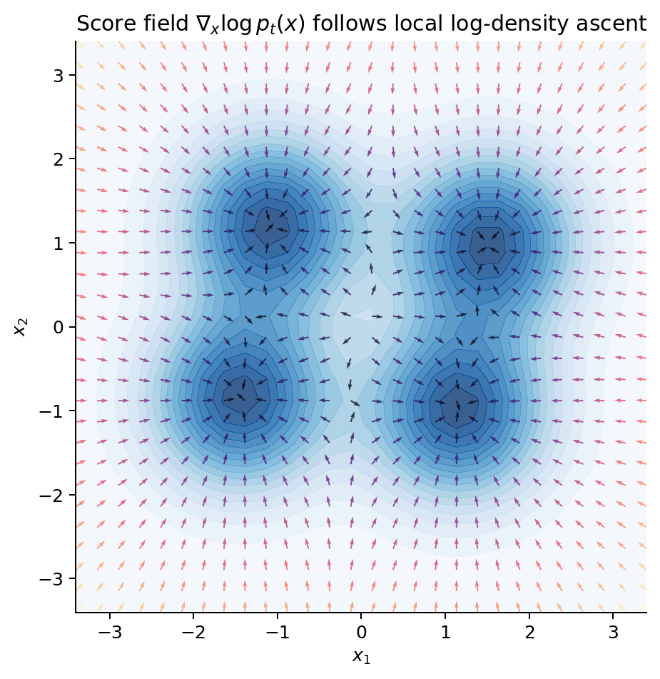

**Connection**

DDPM 是这套思想的离散高斯 Markov 实现；其 $\epsilon$ prediction 与 score estimation 只差一个已知比例。下一份笔记沿 ELBO 路线推导同一关系。

---

## 12. Probability Flow ODE：同一 marginal evolution 的另一种动力学

**Motivation**

既然 SDE 的目标是正确的 marginals，是否存在无随机扩散项、却保持同一 $p_t$ 的 ODE？答案是 probability flow ODE。

**Assumption**

需要可访问正确的 $p_t$ score，并满足相应正则条件。共享 marginals 不代表共享 path law，也不代表给定同一初值时终点逐样本对应。

**Derivation**

与上面的 SDE 共享边缘密度演化的 ODE 是

$$
\mathrm dX_t
=\left[f(X_t,t)-\frac{1}{2}g(t)^2\nabla_x\log p_t(X_t)\right]\mathrm dt.
$$

验证方式是把其 continuity equation 展开，与 SDE 的 Fokker--Planck equation 对齐。$1/2$ 的来源正是：ODE 没有显式 diffusion term，必须把相应概率流吸收到 drift 中。

**Insight**

Diffusion 并不要求采样时始终注入噪声。训练得到的 score 可以定义 stochastic reverse SDE，也可以定义 deterministic probability flow ODE；确定性与随机性是动力学层面的选择。

在近似 score 与有限步 solver 下，两种采样器不再保证精确共享 marginals；各自误差和最优离散策略不同。ODE 可计算 likelihood，但需要 divergence/trace 估计。

**Visualization**

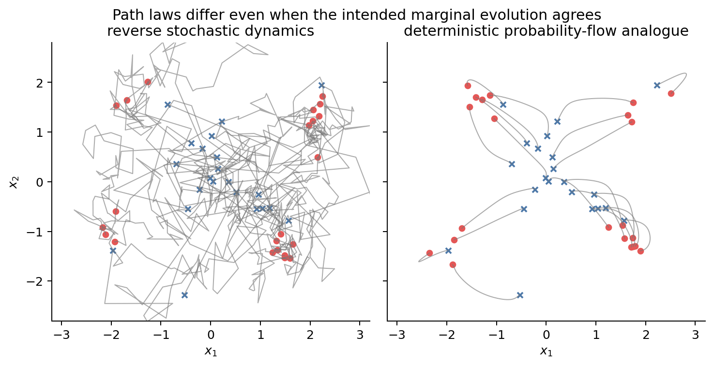

图给出一个离散 toy analogue：左侧路径含逐步随机项，右侧在固定初始噪声后完全确定。Probability flow ODE 对齐每个时间的 marginal；单条随机轨迹仍然具有不同的 path law。

**Connection**

| 问题 | Flow Matching | Score/Diffusion |
|---|---|---|
| 首先设计什么 | probability path / endpoint coupling | forward noising process |
| 网络学习什么 | velocity $v_\theta(x,t)$ | score $s_\theta(x,t)$ 或等价噪声 |
| 动力学 | 直接积分 ODE | reverse SDE 或 probability-flow ODE |
| 训练监督 | 条件路径速度 | 条件扰动 score / noise |
| 主要自由 | coupling 与 path geometry | noise schedule 与 reverse sampler |

统一来看，二者都学习 distribution evolution 所需的局部场。Flow Matching 直接学习 continuity equation 中的速度；Diffusion 学习 score，再借助 SDE/ODE 公式构造速度或反向 drift。Velocity 与 score 的换算依赖具体动力学及其时间系数。

---

## 13. 随机性应放在哪里？

一个合适的 deterministic map 已经可以把随机 base distribution 推到复杂数据分布，因此 pathwise stochasticity 属于可选的建模自由。接下来需要决定随机性放在哪一层：

- base sample $X_0\sim p_0$；
- transport dynamics 中持续注入的 Brownian noise；
- conditional latent 或 representation neighborhood；
- decoder/output distribution；
- 数值 sampler 的随机 transition。

路径噪声可能改变 pathwise coupling、局部探索、近似 score 下的误差修正和条件多样性。但这些价值依赖模型误差、条件任务和 solver，不能用一句“随机性更有表现力”结束。DDIM 将允许我们固定同一初始 latent，只改变 transition noise，从经验上隔离这层影响。

把前面的内容放回同一张表，可以看到这些方法究竟在哪些维度上不同：

| 构造 | 状态演化 | 学习对象 | 监督方式 | 人为路径设计 | 生成方式 |
|---|---|---|---|---|---|
| CNF | ODE | vector field + density change | likelihood | 由参数化/优化隐式决定 | ODE solver |
| Flow Matching | ODE | marginal velocity | conditional velocity regression | coupling + conditional path | ODE solver |
| Score SDE | SDE / PF-ODE | score | score matching | forward SDE | reverse SDE / PF-ODE |
| DDPM | discrete Markov chain | noise / reverse kernel | ELBO + noise regression | Gaussian corruption schedule | ancestral sampling |
| DDIM | generalized joint process | 复用 denoiser | 复用 diffusion training | same marginals, new dependence | stochastic/deterministic update |

这些列属于不同抽象层级。Neural ODE 是 parameterization，Flow Matching 是 training principle，OT 可以指导 coupling 与 path，solver 则处理数值积分；它们可以组合使用。

---

## 14. 小结

1. 本文把生成任务写成从简单随机源到目标分布的变换。
2. 分布表示与分布输运是两个正交问题；likelihood、sampling、inference 是不同能力。
3. 确定性 ODE 的样本仍然随机，因为初值随机；随机 SDE 在固定初值后仍有路径随机性。
4. Flow Matching 的核心是构造可监督的条件路径并回归 velocity，不需要训练时模拟模型 ODE。
5. 端点不决定 coupling，coupling 也不决定唯一曲线；trajectory 是独立的建模选择。
6. Diffusion 的 score 描述 noisy marginal 的局部 log-density geometry，reverse dynamics 来自随机过程反演。
7. 同一个 diffusion score 也能定义 probability flow ODE；共享 marginals 不等于共享 trajectories。

## 可复现实验

本篇所有图由同目录的 [`generate_transport_figures.py`](generate_transport_figures.py) 生成。关键实验与认知问题的对应关系是：

- `ode_vs_sde_fixed_initial`：固定初值后，pathwise noise 多出了什么？
- `ode_vector_field`：vector field、trajectory、flow map 和 pushforward 如何区分？
- `same_marginals_different_joint`：为什么时间切片不能决定 joint law？
- `flow_conditional_marginal_field`：conditional velocity 如何经条件平均变成 marginal field？
- `flow_matching_paths`：coupling 与 conditional trajectory 为什么是两个自由度？
- `score_field`：score 描述什么局部概率几何？
- `probability_flow`：共享目标 marginals 为何不意味着共享 trajectories？

这些 toy plots 用解析对象隔离概念；它们不比较真实模型的 FID、训练稳定性或高维 scaling。

运行：

```bash
uv run --extra docs python docs/research-notes/generate_transport_figures.py
```

脚本只使用 `numpy`、`scipy`、`matplotlib`。扩散相关图使用解析高斯混合分布和 oracle posterior mean，用于隔离动力学概念；真实网络的训练误差没有进入这些图。

## 主要文献

- Kingma & Welling, [Auto-Encoding Variational Bayes](https://arxiv.org/abs/1312.6114).
- Goodfellow et al., [Generative Adversarial Networks](https://arxiv.org/abs/1406.2661).
- Chen et al., [Neural Ordinary Differential Equations](https://arxiv.org/abs/1806.07366).
- Lipman et al., [Flow Matching for Generative Modeling](https://arxiv.org/abs/2210.02747).
- Tong et al., [Improving and Generalizing Flow-Based Generative Models with Minibatch Optimal Transport](https://arxiv.org/abs/2302.00482).
- Liu et al., [Flow Straight and Fast: Learning to Generate and Transfer Data with Rectified Flow](https://arxiv.org/abs/2209.03003).
- Song et al., [Score-Based Generative Modeling through Stochastic Differential Equations](https://arxiv.org/abs/2011.13456).
- Austin et al., [Structured Denoising Diffusion Models in Discrete State-Spaces](https://arxiv.org/abs/2107.03006).
- Rombach et al., [High-Resolution Image Synthesis with Latent Diffusion Models](https://arxiv.org/abs/2112.10752).
- Albergo, Boffi & Vanden-Eijnden, [Stochastic Interpolants: A Unifying Framework for Flows and Diffusions](https://arxiv.org/abs/2303.08797).
- Song et al., [Consistency Models](https://arxiv.org/abs/2303.01469).

下一篇：[Part II：DDPM——如何把不可直接获得的反向过程变成可训练问题](part-2-ddpm.md)
