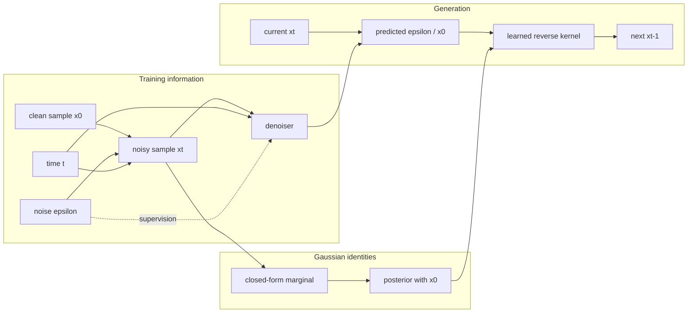
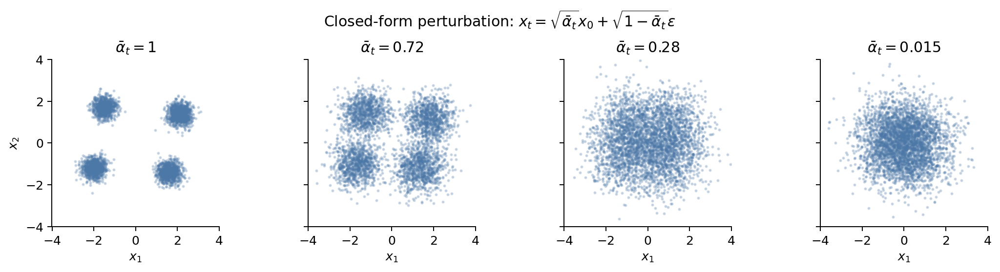
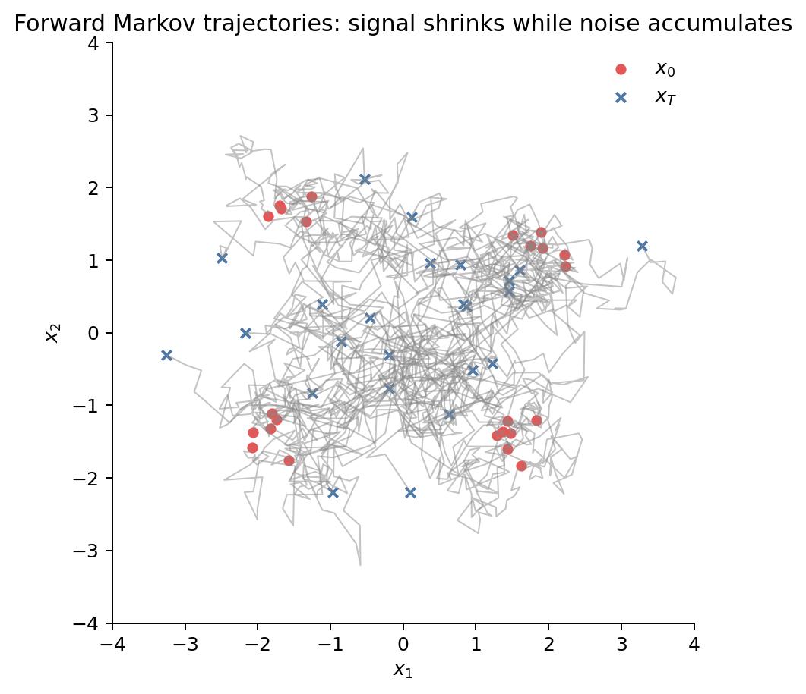
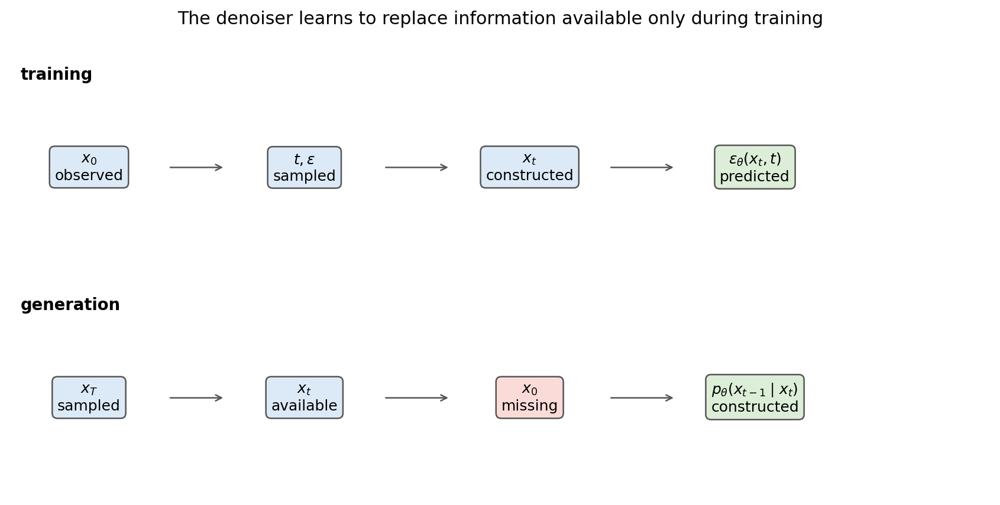
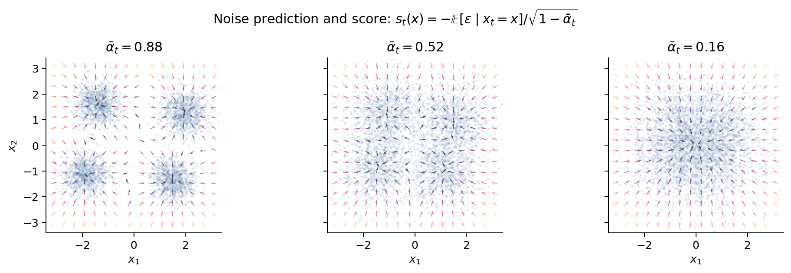
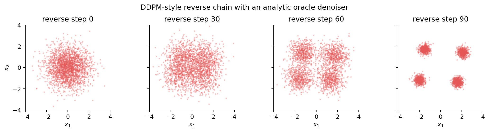

# Part II：DDPM——如何把不可直接获得的反向过程变成可训练问题

这篇笔记从反向生成需要的信息出发，说明 DDPM 为什么要人为设计一个 forward process，以及高斯闭式怎样把这个信息缺口变成可训练的去噪目标。

Forward corruption 只是手段；DDPM 的目标是从简单先验生成数据：

$$
x_T\sim p_T
\longrightarrow x_{T-1}\longrightarrow\cdots\longrightarrow x_0\sim p_{\mathrm{data}}.
$$

困难在于这条反向链的 transition 未知。DDPM 先构造一个完全已知的破坏过程，再利用训练时可见的 $x_0$，把 reverse problem 转成可监督的 denoising problem。

---

## 0. 符号

| 符号 | 含义 |
|---|---|
| $q(x_0)$ | 数据分布；只能通过样本访问 |
| $q(x_{1:T}\mid x_0)$ | 人为定义的 forward process |
| $p_\theta(x_{0:T})$ | 学习到的 reverse generative model |
| $\beta_t$ | 第 $t$ 步加入的方差 |
| $\alpha_t=1-\beta_t$ | 单步 signal retention |
| $\bar\alpha_t=\prod_{s=1}^t\alpha_s$ | 从 $0$ 到 $t$ 的累计 signal retention |
| $\epsilon$ | 构造 $x_t$ 时使用的标准高斯噪声 |
| $\epsilon_\theta(x_t,t)$ | 网络的噪声预测 |

---

### 实现中的三层时间语义

笔记始终使用标准数学时间：$x_0$ 是 clean sample，forward chain 为

$$
x_0\longrightarrow x_1\longrightarrow\cdots\longrightarrow x_T.
$$

从 $x_0$ 到 $x_T$ 共执行 $T$ 次 forward transition。公开 diffusion API 始终
使用上面的数学状态时间 $t\in\{0,\ldots,T\}$：$t=0$ 就是 clean state，
$t=T$ 就是 terminal noisy state，不存在负时间。

Noise schedule 为方便张量索引，只存储长度 $T$ 的公共 forward coefficient
table。其零基索引
$i\in\{0,\ldots,T-1\}$ 与数学状态时间的对应关系是

$$
i\longleftrightarrow t=i+1,
\qquad
\texttt{alpha\_bar\_t}[i]=\bar\alpha_{i+1}.
$$

因此 table index $0$ 表示第一次加噪后的 $x_1$。Clean endpoint $x_0$ 不占用 coefficient table，累计系数始终是 $\bar\alpha_0=1$。实现的 sampling loop 直接使用
数学状态序列 $T,T-1,\ldots,0$。每次 transition 的 source state 为 $t\ge1$，
内部 noise-schedule table index 和 model timestep 都取 $t-1$。因此实际模型条件序列仍是
OpenAI 风格的 $T-1,T-2,\ldots,0$，但公开返回的状态始终是 $x_T$ 到 $x_0$，
无需任何 ``-1`` sentinel。

代码中的 noise schedule 只拥有 $\beta_t$、$\alpha_t$、$\bar\alpha_t$ 及其
forward marginal 常用形式。DDPM 专用的 posterior variance 和 posterior mean
coefficients 由 DDPM sampler 从这条公共噪声路径派生并自行保存；linear beta 与
cosine alpha-bar 则是两种可替换的路径参数化，不再与 DDPM 类名形成笛卡尔积。
顶层 `NoiseSchedule` contract 不要求 beta，而要求公开时间域验证和 Gaussian
forward marginal scales $a(t),s(t)$，使
$x_t=a(t)x_0+s(t)\epsilon$；SNR 由这两个 scales 统一派生。
`DiscreteVPSchedule` 再负责长度 $T$ 的 VP coefficient tables 和离散状态查询；
`LinearBetaSchedule`、`CosineAlphaBarSchedule` 分别只负责自己的路径构造策略。
这些职责位于 `diffusion/noise_schedules/` 的独立模块中，不同时提供自由函数式 API。

---

## 主线导航

**Motivation**

生成需要 reverse kernel $q(x_{t-1}\mid x_t)$，训练数据只提供 clean sample $x_0$。两者之间缺少可直接监督的反向 transition。

**Assumption**

DDPM 人为选择 Gaussian Markov forward chain、variance schedule 和 Gaussian reverse parameterization。这些选择换来 Gaussian closure、解析 posterior 与逐时间步训练。

**Derivation**

推导按下面的依赖顺序展开：

$$
\begin{gathered}
q(x_t\mid x_{t-1}) \\
\downarrow \\
q(x_t\mid x_0) \\
\downarrow \\
q(x_{t-1}\mid x_t,x_0) \\
\downarrow \\
\mathrm{ELBO} \\
\downarrow \\
L_{\mathrm{simple}}
\end{gathered}
$$

**Insight**

网络用 $(x_t,t)$ 估计训练时已知、生成时缺失的 clean-signal information。预测 $\epsilon$、$x_0$、score 或 $v$ 是同一去噪关系的不同参数化。

**Visualization**



**Connection**

训练过程独立抽取单个 $t$，没有观察完整 trajectory。这个结构为 DDIM 留下了跨时间 joint dependence 与 sampler stochasticity 的自由。

---

## 1. 我们真正需要的是 reverse kernel

理想情况下，如果知道 forward joint distribution 的 reverse conditional

$$
q(x_{t-1}\mid x_t),
$$

就可以从一个简单终点分布开始逐步反演。但数据集只提供 $x_0$ 的独立样本，没有真实的“噪声到数据”轨迹，也没有可查询的 $q(x_0)$ 密度。

问题可以直接从 Bayes rule 看出来：

$$
q(x_{t-1}\mid x_t)
=\frac{q(x_t\mid x_{t-1})q(x_{t-1})}{q(x_t)}.
$$

即使 $q(x_t\mid x_{t-1})$ 由我们定义，$q(x_{t-1})$ 与 $q(x_t)$ 仍由未知数据分布诱导。直接“倒转一个已知加噪 kernel”是不够的。

训练时能够采样真实数据 $x_0$ 和标准高斯噪声，也可以自行定义 corruption process；一般的 $q(x_{t-1}\mid x_t)$ 仍然不可直接获得。DDPM 因此选择一条易分析的 data-to-noise process，让训练时可见的 $x_0$ 提供反向过程所缺少的信息。这条 forward chain 服务于可解性，并不描述真实数据的物理生成过程。

接下来的问题便很具体：怎样的 forward process 能同时给出简单终点、任意时间采样和解析 posterior？DDPM 选择 Gaussian Markov chain。

---

## 2. 为什么选择 Gaussian Markov forward chain？

DDPM 定义

$$
q(x_{1:T}\mid x_0)
=\prod_{t=1}^T q(x_t\mid x_{t-1}),
$$

其中

$$
q(x_t\mid x_{t-1})
=\mathcal N\!\left(
x_t;\sqrt{\alpha_t}x_{t-1},(1-\alpha_t)I
\right).
$$

等价的重参数化是

$$
x_t=\sqrt{\alpha_t}x_{t-1}+\sqrt{1-\alpha_t}\epsilon_t,
\qquad \epsilon_t\sim\mathcal N(0,I).
$$

### 构造中包含的选择

- **forward process 本身**：数据没有告诉我们应按这条路径被破坏；
- **Markov factorization**：当前状态只依赖前一状态；
- **Gaussian transition**：使用各向同性加性噪声；
- **variance schedule**：$\beta_t=1-\alpha_t$ 的取值；
- **离散时间网格**：$T$ 与各 step 的位置。

这些形式由 tractability considerations 决定；$p_{\mathrm{data}}$ 本身无法唯一确定它们。

### 高斯闭包带来的便利

1. 独立高斯的线性组合仍是高斯，提供 Gaussian closure；
2. cumulative marginal $q(x_t\mid x_0)$ 有闭式；
3. conditional posterior $q(x_{t-1}\mid x_t,x_0)$ 有闭式；
4. 当 $\bar\alpha_T\approx0$ 时，终点接近标准高斯；
5. 训练可以随机抽一个 $t$，不必模拟完整前向链。

根号系数控制 amplitude。若 $x_{t-1}$ 已近似单位方差且与 $\epsilon_t$ 独立，则

$$
\operatorname{Var}(x_t)
\approx\alpha_tI+(1-\alpha_t)I=I.
$$



上图是 marginal snapshots：它展示每个噪声等级的分布，却没有展示跨时间如何配对同一粒子。下面的图才是这一特定 Markov construction 的 sample trajectories。



### 这条路径并不唯一

Gaussian、各向同性、Markov 和预定 schedule 限制了 corruption geometry。DDIM 会利用这样一个事实：DDPM 的 denoising 训练并没有要求所有兼容过程都沿这条 forward joint law 运行。

---

## 3. 任意时间 marginal 的闭式

### 为什么不能每次都顺序加噪

若获得一个 $x_t$ 必须顺序执行 $t$ 次 transition，那么每个 SGD step 都要模拟长链，而且训练 target 也不易写成单次可监督噪声。我们希望从 $(x_0,t,\epsilon)$ 直接构造 $x_t$。

### 从两步展开到一般形式

展开两步：

$$
\begin{aligned}
x_2
&=\sqrt{\alpha_2}x_1+\sqrt{1-\alpha_2}\epsilon_2\\
&=\sqrt{\alpha_2\alpha_1}x_0
+\sqrt{\alpha_2(1-\alpha_1)}\epsilon_1
+\sqrt{1-\alpha_2}\epsilon_2.
\end{aligned}
$$

后两项是独立高斯的线性组合，其总方差为

$$
\alpha_2(1-\alpha_1)+(1-\alpha_2)
=1-\alpha_1\alpha_2.
$$

归纳得到

$$
q(x_t\mid x_0)
=\mathcal N\!\left(
x_t;\sqrt{\bar\alpha_t}x_0,(1-\bar\alpha_t)I
\right),
$$

以及训练中真正使用的 reparameterization：

$$
\boxed{
x_t=\sqrt{\bar\alpha_t}x_0
+\sqrt{1-\bar\alpha_t}\epsilon,
\qquad
\epsilon\sim\mathcal N(0,I)
}.
$$

### 从任意中间时刻 $s$ 走到 $t$

后面的 DDIM 推导会使用 $q(x_t\mid x_s)$，所以这里把同一个 Gaussian
closure argument 推广到任意 $0\le s<t\le T$。

从 $x_s$ 出发，第一步是

$$
x_{s+1}
=
\sqrt{\alpha_{s+1}}x_s
+
\sqrt{1-\alpha_{s+1}}\epsilon_{s+1}.
$$

再走一步：

$$
\begin{aligned}
x_{s+2}
&=
\sqrt{\alpha_{s+2}}x_{s+1}
+
\sqrt{1-\alpha_{s+2}}\epsilon_{s+2}\\
&=
\sqrt{\alpha_{s+2}\alpha_{s+1}}x_s\\
&\quad+
\sqrt{\alpha_{s+2}(1-\alpha_{s+1})}\epsilon_{s+1}
+
\sqrt{1-\alpha_{s+2}}\epsilon_{s+2}.
\end{aligned}
$$

后两项是相互独立的 Gaussian noise，它们的总方差为

$$
\begin{aligned}
&\alpha_{s+2}(1-\alpha_{s+1})
+(1-\alpha_{s+2})\\
&\qquad=
1-\alpha_{s+2}\alpha_{s+1}.
\end{aligned}
$$

每多走一步，signal coefficient 再乘一个 $\sqrt{\alpha_i}$，noise variance
则补到 $1-\prod\alpha_i$。归纳得到

$$
x_t
=
\sqrt{
\prod_{i=s+1}^{t}\alpha_i
}\,x_s
+
\sqrt{
1-\prod_{i=s+1}^{t}\alpha_i
}\,\epsilon_{s\to t},
$$

其中 $\epsilon_{s\to t}\sim\mathcal N(0,I)$。根据

$$
\bar\alpha_t
=
\prod_{i=1}^{t}\alpha_i,
\qquad
\bar\alpha_s
=
\prod_{i=1}^{s}\alpha_i,
$$

区间 $(s,t]$ 上的乘积为

$$
\prod_{i=s+1}^{t}\alpha_i
=
\frac{\bar\alpha_t}{\bar\alpha_s}.
$$

于是

$$
\boxed{
q(x_t\mid x_s)
=
\mathcal N\!\left(
x_t;
\sqrt{
\frac{\bar\alpha_t}{\bar\alpha_s}
}\,x_s,
\left(
1-
\frac{\bar\alpha_t}{\bar\alpha_s}
\right)I
\right).
}
$$

令 $s=0$ 并使用 $\bar\alpha_0=1$，就回到前面已经得到的
$q(x_t\mid x_0)$。因此这条公式只是 cumulative marginal 的区间版本。

### 训练时真正使用的结果

- 任意采样
  $t\sim\operatorname{Unif}\!\left(\{1,\ldots,T\}\right)$；
- 一步构造 $x_t$；
- 保存构造时使用的真实 $\epsilon$ 作为监督；
- 通过 $x_t$ 与 $\epsilon$ 反解 $x_0$；
- 不向网络展示完整 trajectory，也能覆盖所有 noise levels。

### 终点为何接近标准高斯？

当 $\bar\alpha_T\to0$，条件均值 $\sqrt{\bar\alpha_T}x_0\to0$，条件方差趋近 $I$。严格说有限 $T$ 只是近似，且 schedule 必须让残余 signal 足够小。

### 反向信息仍然缺失

我们能制造 noisy inputs，却仍没有生成时可用的真实 $x_0$。接下来要区分两个看似相似、实际完全不同的 posterior。

---

## 4. Reverse Markov 结构与 Gaussian 参数化是两件事

常见但不准确的说法是：“DDPM heuristic 地假设 forward 和 reverse 都是 Markov。”更精确的层次是：

1. forward Markov chain 是人为构造；
2. 一个给定 Markov chain 的精确时间反演仍可写成 Markov reverse kernels；
3. 真正未知的是 $q(x_{t-1}\mid x_t)$ 的内容；
4. DDPM 再选择 Gaussian family 参数化这些未知 kernels。

### 训练时可以计算的 posterior

知道 clean sample $x_0$ 时，Gaussian closure 给出

$$
q(x_{t-1}\mid x_t,x_0)
=\mathcal N\!\left(
x_{t-1};\tilde\mu_t(x_t,x_0),\tilde\beta_tI
\right),
$$

其中

$$
\tilde\beta_t
=\frac{1-\bar\alpha_{t-1}}{1-\bar\alpha_t}\beta_t,
$$

$$
\tilde\mu_t(x_t,x_0)
=\frac{\sqrt{\bar\alpha_{t-1}}\beta_t}{1-\bar\alpha_t}x_0
+\frac{\sqrt{\alpha_t}(1-\bar\alpha_{t-1})}{1-\bar\alpha_t}x_t.
$$

这是严格来自所选 Gaussian forward construction 的解析结果。

#### Posterior mean 与 variance 怎样得到？

下面直接把 Gaussian residual 拆成“能够由 $x_t$ 解释的部分”和“观察
$x_t$ 后仍然留下的部分”。记

$$
u_{t-1}
\coloneqq
x_{t-1}-\sqrt{\bar\alpha_{t-1}}x_0,
$$

所以

$$
u_{t-1}\mid x_0
\sim
\mathcal N\!\left(0,(1-\bar\alpha_{t-1})I\right).
$$

再把 $x_t$ 中由 $x_0$ 决定的 mean 去掉：

$$
y_t
\coloneqq
x_t-\sqrt{\bar\alpha_t}x_0.
$$

由相邻 forward transition

$$
x_t
=
\sqrt{\alpha_t}x_{t-1}
+
\sqrt{\beta_t}\epsilon_t,
\qquad
\beta_t=1-\alpha_t,
$$

以及 $\bar\alpha_t=\alpha_t\bar\alpha_{t-1}$，得到

$$
y_t
=
\sqrt{\alpha_t}u_{t-1}
+
\sqrt{\beta_t}\epsilon_t.
$$

这里 $u_{t-1}$ 是希望从 $y_t$ 中恢复的旧 residual，$\epsilon_t$ 是本步新加的
独立噪声。Variance 描述一个量自身的波动大小；covariance 描述两个量共同变化
的部分。在这里，covariance 衡量 $y_t$ 中包含了多少关于 $u_{t-1}$ 的信息。
逐坐标计算：

$$
\operatorname{Var}(u_{t-1}\mid x_0)
=
1-\bar\alpha_{t-1},
$$

$$
\begin{aligned}
\operatorname{Var}(y_t\mid x_0)
&=
\alpha_t(1-\bar\alpha_{t-1})+\beta_t\\
&=
1-\bar\alpha_t,
\end{aligned}
$$

$$
\operatorname{Cov}(u_{t-1},y_t\mid x_0)
=
\sqrt{\alpha_t}(1-\bar\alpha_{t-1}).
$$

选择线性系数

$$
K_t
\coloneqq
\frac{
\operatorname{Cov}(u_{t-1},y_t\mid x_0)
}{
\operatorname{Var}(y_t\mid x_0)
}
=
\frac{
\sqrt{\alpha_t}(1-\bar\alpha_{t-1})
}{
1-\bar\alpha_t
}.
$$

定义剩余量

$$
w_t
\coloneqq
u_{t-1}-K_ty_t.
$$

这个 $K_t$ 让 $w_t$ 与 $y_t$ 的 covariance 等于零：

$$
\begin{aligned}
\operatorname{Cov}(w_t,y_t\mid x_0)
&=
\operatorname{Cov}(u_{t-1},y_t\mid x_0)\\
&\quad-
K_t\operatorname{Var}(y_t\mid x_0)\\
&=0.
\end{aligned}
$$

$(w_t,y_t)$ 是 jointly Gaussian。对 jointly Gaussian variables，zero
covariance 意味着 independence。因此观察到 $y_t$ 后，$w_t$ 仍保持零均值
Gaussian，进而

$$
\mathbb E[u_{t-1}\mid y_t,x_0]
=
K_ty_t.
$$

把 residual 放回 $x_{t-1}$：

$$
\begin{aligned}
\mathbb E[x_{t-1}\mid x_t,x_0]
&=
\sqrt{\bar\alpha_{t-1}}x_0\\
&\quad+
K_t
\left(
x_t-\sqrt{\bar\alpha_t}x_0
\right)\\
&=
\left(
\sqrt{\bar\alpha_{t-1}}
-K_t\sqrt{\bar\alpha_t}
\right)x_0
+K_tx_t.
\end{aligned}
$$

先整理 $x_t$ coefficient：

$$
K_t
=
\frac{
\sqrt{\alpha_t}(1-\bar\alpha_{t-1})
}{
1-\bar\alpha_t
}.
$$

再整理 $x_0$ coefficient，并使用
$\bar\alpha_t=\alpha_t\bar\alpha_{t-1}$：

$$
\begin{aligned}
&\sqrt{\bar\alpha_{t-1}}
-K_t\sqrt{\bar\alpha_t}\\
&\quad=
\sqrt{\bar\alpha_{t-1}}
\left[
1-
\frac{
\alpha_t(1-\bar\alpha_{t-1})
}{
1-\bar\alpha_t
}
\right]\\
&\quad=
\sqrt{\bar\alpha_{t-1}}
\frac{
1-\bar\alpha_t
-\alpha_t
+\alpha_t\bar\alpha_{t-1}
}{
1-\bar\alpha_t
}\\
&\quad=
\frac{
\sqrt{\bar\alpha_{t-1}}(1-\alpha_t)
}{
1-\bar\alpha_t
}\\
&\quad=
\frac{
\sqrt{\bar\alpha_{t-1}}\beta_t
}{
1-\bar\alpha_t
}.
\end{aligned}
$$

两个 coefficient 合在一起，正好得到上面的
$\tilde\mu_t(x_t,x_0)$。

条件 variance 等于还没有被 $y_t$ 解释的 $w_t$ variance：

$$
\begin{aligned}
\operatorname{Var}(w_t\mid x_0)
&=
\operatorname{Var}(u_{t-1}-K_ty_t\mid x_0)\\
&=
\operatorname{Var}(u_{t-1}\mid x_0)
+K_t^2\operatorname{Var}(y_t\mid x_0)\\
&\quad-
2K_t\operatorname{Cov}(u_{t-1},y_t\mid x_0)\\
&=
\operatorname{Var}(u_{t-1}\mid x_0)
-
\frac{
\operatorname{Cov}(u_{t-1},y_t\mid x_0)^2
}{
\operatorname{Var}(y_t\mid x_0)
}\\
&=
(1-\bar\alpha_{t-1})
-
\frac{
\alpha_t(1-\bar\alpha_{t-1})^2
}{
1-\bar\alpha_t
}\\
&=
\frac{
(1-\bar\alpha_{t-1})
\left[
1-\bar\alpha_t
-\alpha_t(1-\bar\alpha_{t-1})
\right]
}{
1-\bar\alpha_t
}\\
&=
\frac{
1-\bar\alpha_{t-1}
}{
1-\bar\alpha_t
}
(1-\alpha_t)\\
&=
\frac{
1-\bar\alpha_{t-1}
}{
1-\bar\alpha_t
}\beta_t\\
&=
\tilde\beta_t.
\end{aligned}
$$

因此 $\tilde\beta_t$ 是 forward construction 推导出的 conditional
variance。它在选定 noise schedule 后已经固定，仍会随着时间 $t$ 改变。

#### 本节结论：训练时可计算的 DDPM posterior

后文需要引用 DDPM posterior 时，直接使用下面三条式子：

$$
\boxed{
q(x_{t-1}\mid x_t,x_0)
=
\mathcal N\!\left(
\tilde\mu_t(x_t,x_0),
\tilde\beta_tI
\right).
}
$$

$$
\boxed{
\begin{aligned}
\tilde\mu_t(x_t,x_0)
&=
\frac{
\sqrt{\bar\alpha_{t-1}}\beta_t
}{
1-\bar\alpha_t
}x_0\\
&\quad+
\frac{
\sqrt{\alpha_t}(1-\bar\alpha_{t-1})
}{
1-\bar\alpha_t
}x_t,
\end{aligned}
}
$$

$$
\boxed{
\tilde\beta_t
=
\frac{
1-\bar\alpha_{t-1}
}{
1-\bar\alpha_t
}\beta_t.
}
$$

#### 三个容易混淆的 variance

| 符号 | 来源 | 是否由推导得到 | “固定”的含义 |
|---|---|---|---|
| $\beta_t=1-\alpha_t$ | forward transition noise schedule | 人为选择 | 训练前给定，通常随 $t$ 变化 |
| $\tilde\beta_t$ | $q(x_{t-1}\mid x_t,x_0)$ 的 conditional variance | 由 $\beta_t$ 和 $\bar\alpha_t$ 推导 | schedule 给定后不再学习，仍随 $t$ 变化 |
| $\Sigma_\theta(x_t,t)$ | learned reverse kernel 的 variance | 参数化选择 | 可以固定为 time-dependent coefficients，也可以学习 |

论文或代码中的 ``fixed variance`` 通常表示该 variance 不依赖当前样本，也不由
网络学习；它仍然可以随 timestep 改变。原始 DDPM 实验比较过把 reverse
variance 固定为 $\beta_t$ 或 $\tilde\beta_t$。这里的 fixed 指一组预先计算好的
time-dependent constants，并不表示所有 timestep 共用同一个数值。后面的 DDIM
还会引入 sampler variance $\sigma_{t\to s}^2$，那是 inference process 的设计
参数。

### 生成时真正需要的 posterior

$$
q(x_{t-1}\mid x_t)
=\int q(x_{t-1}\mid x_t,x_0)
q(x_0\mid x_t)\,\mathrm dx_0.
$$

$q(x_0\mid x_t)$ 依赖未知数据分布。即使被积函数对给定 $x_0$ 是 Gaussian，积分后的 unconditional reverse kernel 一般是复杂 mixture，并不必然精确 Gaussian。

### 用 Gaussian family 表示未知 reverse kernel

模型设为

$$
p_\theta(x_{t-1}\mid x_t)
=\mathcal N\!\left(
x_{t-1};\mu_\theta(x_t,t),\Sigma_\theta(x_t,t)
\right).
$$

小步 Gaussian forward transition 使这个近似合理；常见实现固定或学习方差，把主要容量放在均值。这里 **Gaussian reverse model** 才是参数化/近似选择，不能与 reverse Markov structure 混为一谈。

### 训练与生成之间的信息差



训练时知道 $x_0$、$t$ 和注入的 $\epsilon$；生成时只有当前 $x_t$。网络需要从 $(x_t,t)$ 估计足以构造 reverse kernel 的 clean-signal information。

---

## 5. 用什么对象补回缺失的 $x_0$？

### 5.1 预测 noise

由 forward marginal 反解

$$
x_0
=\frac{x_t-\sqrt{1-\bar\alpha_t}\epsilon}
{\sqrt{\bar\alpha_t}}.
$$

令网络预测 $\epsilon_\theta(x_t,t)$，则

$$
\hat x_0(x_t,t)
=\frac{x_t-\sqrt{1-\bar\alpha_t}\epsilon_\theta(x_t,t)}
{\sqrt{\bar\alpha_t}}.
$$

Noise prediction 的依据来自监督可得性：训练时注入的 noise 已知，预测它也等价于在另一组坐标中恢复 clean component。

### 5.2 与 score 的精确关系

给定 $x_0$ 的 perturbation kernel score 是

$$
\nabla_{x_t}\log q(x_t\mid x_0)
=-\frac{x_t-\sqrt{\bar\alpha_t}x_0}{1-\bar\alpha_t}
=-\frac{\epsilon}{\sqrt{1-\bar\alpha_t}}.
$$

同一个 $x_t$ 可能对应多组 $(x_0,\epsilon)$。因此，噪声 MSE 的 population optimum 是条件均值

$$
\epsilon_\theta^\star(x_t,t)
=\mathbb E\!\left[\epsilon\mid X_t=x_t\right].
$$

利用 denoising score identity，边缘 score 满足

$$
\boxed{
\nabla_{x_t}\log q_t(x_t)
=-\frac{\mathbb E\!\left[\epsilon\mid X_t=x_t\right]}
{\sqrt{1-\bar\alpha_t}}
}.
$$

因此噪声预测与 score estimation 相差一个已知时间尺度。



### 5.3 等价的预测参数化

设 $a_t=\sqrt{\bar\alpha_t}$、$\sigma_t=\sqrt{1-\bar\alpha_t}$，常见网络输出包括：

- $\epsilon$-prediction：预测加性噪声；
- $x_0$-prediction：直接预测 clean sample；
- score prediction：预测 $\nabla_x\log q_t(x)$；
- $v$-prediction：常定义为 $v_t=a_t\epsilon-\sigma_t x_0$。

在给定 $(x_t,t)$ 和 schedule 后，它们可以线性互换。差别主要在 loss weighting、不同 SNR 下的数值尺度与优化性质。

### 下一步：这个回归目标从哪里来

我们已经知道监督信号为何存在，但尚未解释它为什么对应 maximum likelihood/variational training。ELBO 提供这条桥梁。

---

## 6. ELBO：把 global likelihood 拆成 local reverse matching

### 从数据 likelihood 出发

希望最大化

$$
\log p_\theta(x_0)
=\log\int p_\theta(x_{0:T})\,\mathrm dx_{1:T},
$$

但 latent trajectory 无法直接积分。

### Forward chain 作为 variational distribution

我们恰好拥有一个能采样、能计算密度的 forward distribution

$$
q(x_{1:T}\mid x_0).
$$

把它作为 variational distribution，Jensen inequality 给出

$$
\log p_\theta(x_0)
\ge
\mathbb E_q\left[
\log p_\theta(x_{0:T})-
\log q(x_{1:T}\mid x_0)
\right].
$$

### Markov factorization 带来的局部化

设

$$
p_\theta(x_{0:T})
=p(x_T)\prod_{t=1}^T p_\theta(x_{t-1}\mid x_t).
$$

通过 Bayes rewrite 与望远镜相消，negative ELBO 分解为

$$
L_{\mathrm{VLB}}
=L_T+\sum_{t=2}^T L_{t-1}+L_0,
$$

其中

$$
L_T=D_{\mathrm{KL}}\!\left(
q(x_T\mid x_0)\,\Vert\,p(x_T)
\right),
$$

$$
L_{t-1}=D_{\mathrm{KL}}\bigl(
q(x_{t-1}\mid x_t,x_0)
\,\Vert\,p_\theta(x_{t-1}\mid x_t)
\bigr),
$$

$$
L_0=-\log p_\theta(x_0\mid x_1).
$$

这个分解把 global latent-variable likelihood 变成了逐时间步的 reverse-kernel matching。

### 从 Gaussian KL 到 noise regression

若模型方差 $\sigma_t^2I$ 固定，中间 KL 与 $\theta$ 相关的部分是

$$
\frac{1}{2\sigma_t^2}
\left\lVert
\tilde\mu_t(x_t,x_0)-\mu_\theta(x_t,t)
\right\rVert_2^2.
$$

用 noise parameterization 可写出

$$
\mu_\theta(x_t,t)
=\frac{1}{\sqrt{\alpha_t}}
\left(
x_t-\frac{\beta_t}{\sqrt{1-\bar\alpha_t}}
\epsilon_\theta(x_t,t)
\right).
$$

于是每步 KL 化为带时间权重的 noise MSE：

$$
L_{t-1}
=\mathbb E\left[
\frac{\beta_t^2}
{2\sigma_t^2\alpha_t(1-\bar\alpha_t)}
\left\lVert
\epsilon-\epsilon_\theta(x_t,t)
\right\rVert_2^2
\right]+C.
$$

DDPM 实践中常用 simplified objective

$$
\boxed{
L_{\mathrm{simple}}
=\mathbb E_{x_0,t,\epsilon}
\left\lVert
\epsilon-\epsilon_\theta(x_t,t)
\right\rVert_2^2
}.
$$

它去掉了 ELBO 推导中的时间相关权重，是实践中常用的目标简化，并不保留完整 ELBO 的全部 weighting。

### 一次 SGD step 实际做什么？

1. $x_0\sim q(x_0)$；
2. $t\sim\operatorname{Unif}\!\left(\{1,\ldots,T\}\right)$；
3. $\epsilon\sim\mathcal N(0,I)$；
4. $x_t=\sqrt{\bar\alpha_t}x_0+\sqrt{1-\bar\alpha_t}\epsilon$；
5. 最小化 batch 中的
   $\lVert\epsilon-\epsilon_\theta(x_t,t)\rVert_2^2$。

模型在训练时没有观察完整 forward trajectory；DDIM 将利用这一点重新构造跨时间依赖。

---

## 7. Sampling：模型在每一步执行什么？

训练后从

$$
x_T\sim\mathcal N(0,I).
$$

开始。对 $t=T,T-1,\dots,1$：

1. 用 $\epsilon_\theta(x_t,t)$ 估计噪声；
2. 换算 $\hat x_0$ 或 reverse mean $\mu_\theta$；
3. 从 Gaussian reverse transition 抽样：

$$
x_{t-1}=\mu_\theta(x_t,t)+\sigma_t z,
\qquad z\sim\mathcal N(0,I),
$$

最后一步通常令 $z=0$。



图中使用解析的 Gaussian-mixture posterior mean，因此只展示 reverse dynamics 本身，不包含有限网络容量带来的近似误差。

### 两种随机性

- **initial randomness**：$x_T$ 是随机抽样；
- **pathwise randomness**：每个 reverse transition 继续抽样 $z$。

即使移除第二种，第一种也足以让确定性 transport 产生随机样本。逐步噪声的作用取决于 sampler family 的设计及其近似误差。

---

## 8. 哪些是构造，哪些是推导结果

| 内容 | 性质 | 它提供什么 | 它未保证什么 |
|---|---|---|---|
| forward process | 人为构造 | 可控 corruption 与监督 | 不描述数据的真实生成机制 |
| forward Markov property | 设计选择 | 简单 joint factorization | 仍存在其他训练兼容的 joint law |
| Gaussian transitions | 设计选择 | closure、解析 marginal/posterior | unconditional reverse 必然精确 Gaussian |
| schedule $\beta_{1:T}$ | 设计/离散化 | SNR path 与简单终点 | 唯一或最优路径 |
| reverse Markov structure | forward Markov chain 的时间反演结构 | 逐步生成 factorization | 已知 reverse kernels |
| Gaussian reverse model | 参数化/小步近似 | tractable learned kernels | 任意大步仍精确 Gaussian |
| noise prediction | 参数化与监督选择 | 恢复 $x_0$/score 信息 | 唯一训练对象 |
| simplified MSE | objective simplification | 稳定、简单的 Monte Carlo training | 完整保留 ELBO weighting |
| $T$ 个 ancestral steps | sampler/discretization choice | 小步反向模拟 | 训练网络只能走相邻一步 |

---

## 9. 回看整个构造

DDPM 要得到的是从简单 $p(x_T)$ 返回数据分布的 reverse process。困难不在于 forward noise kernel 本身，而在于生成时没有 $x_0$，所以无法使用解析的
$q(x_{t-1}\mid x_t,x_0)$；真正需要的 $q(x_{t-1}\mid x_t)$ 又依赖未知的
$q(x_0\mid x_t)$。

Gaussian Markov forward chain 同时提供了两个关键闭式：

$$
q(x_t\mid x_0),
\qquad
q(x_{t-1}\mid x_t,x_0).
$$

前者允许直接构造任意噪声等级的训练样本，后者给出局部 reverse transition 的理想形状。ELBO 将数据 likelihood 分解成这些局部 transition 的匹配问题；噪声回归再用训练时已知的 $\epsilon$，学习生成时缺失的 clean signal 或 score。

最终得到的是一个能在各个 noise level 上恢复局部去噪信息的网络；训练过程并未观察完整 reverse trajectory。训练样本主要来自单时刻 marginal

$$
q(x_t\mid x_0),
$$

并不包含完整的 $(x_1,\ldots,x_T)$。这留下了一个自然问题：如果保持所有这些单时刻 marginals 不变，能否改变跨时间依赖、transition stochasticity 或采样时间网格？DDIM 正是从这里开始。

---

## 可复现实验

本篇图由 [`generate_transport_figures.py`](generate_transport_figures.py) 中以下函数生成：

- `forward_diffusion`：closed-form marginals；
- `forward_diffusion_paths`：特定 Markov joint law 的 sample paths；
- `ddpm_information_structure`：训练/生成信息缺口；
- `noise_score_relation`：noise posterior mean 与 marginal score；
- `ddpm_reverse`：oracle reverse sampling。

运行：

```bash
uv run python docs/research-notes/generate_transport_figures.py
```

## 主要文献

- Ho, Jain & Abbeel, [Denoising Diffusion Probabilistic Models](https://arxiv.org/abs/2006.11239).
- Song et al., [Score-Based Generative Modeling through Stochastic Differential Equations](https://arxiv.org/abs/2011.13456).

上一篇：[Part I：从生成建模到分布动力学](part-1-distribution-transport.md)
下一篇：[Part III：DDIM——训练约束与轨迹自由度](part-3-ddim.md)
