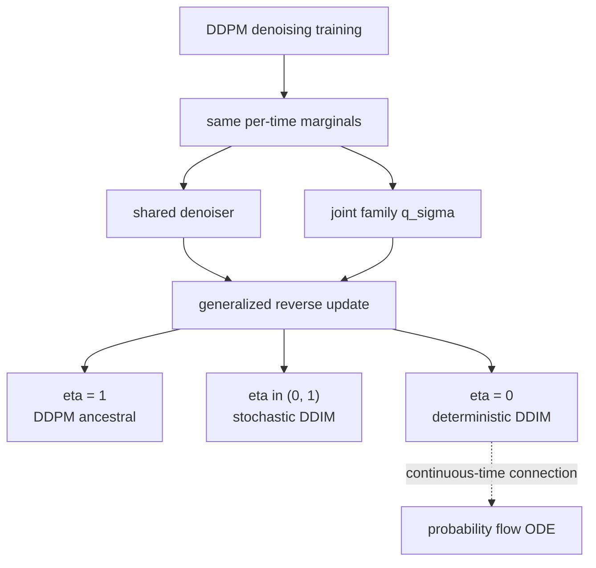
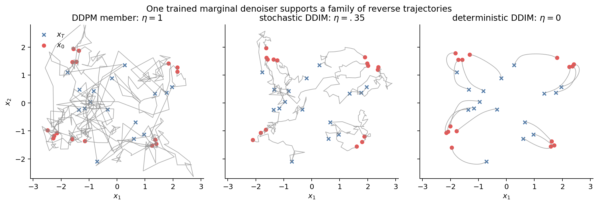
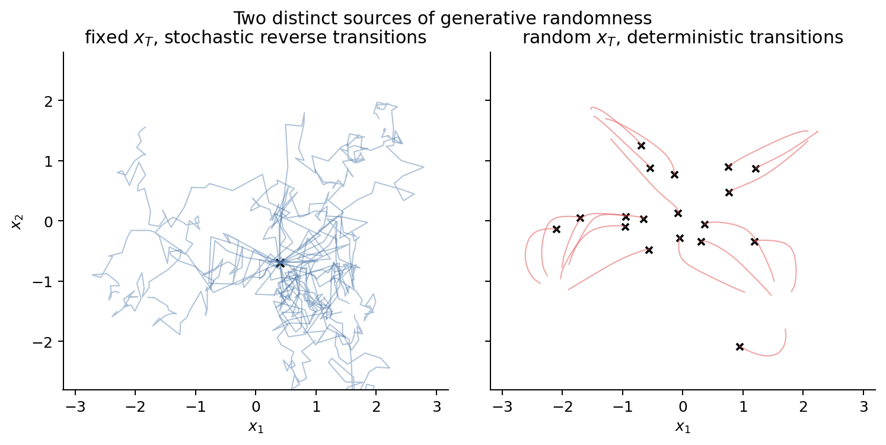
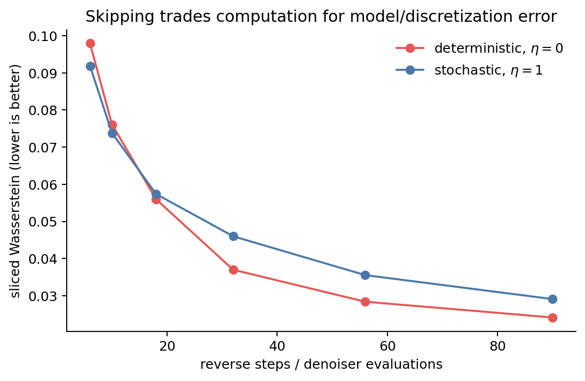
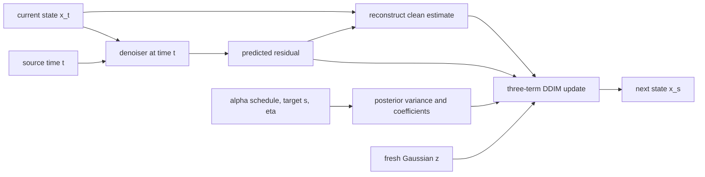

# Part III：DDIM——DDPM 的训练约束了什么，又留下了什么自由度？

DDIM 不重新训练 denoiser。它从一个更基本的问题出发：DDPM 的训练目标究竟确定了完整的随机过程，还是只确定了每个噪声等级上的去噪关系？

DDPM 训练通常独立采样 $(x_0,t,\epsilon)$：

$$
x_t=\sqrt{\bar\alpha_t}x_0
+\sqrt{1-\bar\alpha_t}\epsilon,
$$

然后让网络从 $(x_t,t)$ 预测 $\epsilon$、$x_0$ 或 score。网络没有看到整条

$$
x_1\longrightarrow x_2\longrightarrow\cdots\longrightarrow x_T.
$$

如果训练只直接使用每个时刻的 corruption marginal $q(x_t\mid x_0)$，它就不会唯一决定跨时间 joint process。DDIM 利用的正是这个区别：same marginals 不等于 same joint law。

---

## 0. 符号与时间方向

本篇沿用 Part II 的 DDPM 记号，并在进入 DDIM 构造前集中说明新增符号。

| 符号 | 含义 |
|---|---|
| $x_0$ | 数据端状态，时间 $0$ 的 clean sample |
| $x_t$ | 时间 $t$ 的 noisy state |
| $x_T$ | 噪声端状态，通常近似服从 $\mathcal N(0,I)$ |
| $T$ | 训练使用的最大离散时间索引 |
| $\beta_t$ | 第 $t$ 步 forward noise variance |
| $\alpha_t=1-\beta_t$ | 第 $t$ 步保留的 signal coefficient |
| $\bar\alpha_t=\prod_{i=1}^t\alpha_i$ | 从时间 $0$ 累积到 $t$ 的 signal coefficient；约定 $\bar\alpha_0=1$ |
| $\epsilon_\theta(x_t,t)$ | 网络根据当前 noisy state 与时间预测的 perturbation noise |
| $\hat x_0(x_t,t)$ | 由 $x_t$ 与网络输出重建的 clean sample estimate |
| $q_\sigma(x_{1:T}\mid x_0)$ | 与 DDPM per-time marginals 兼容的一族 conditional joint path laws |
| $\sigma_t$ 或 $\sigma_{t\to s}$ | generalized reverse update 中新注入噪声的 standard deviation |
| $\eta\in[0,1]$ | 控制 $\sigma$ 的 stochasticity parameter；$\eta=0$ 时不注入新的 transition noise |
| $z\sim\mathcal N(0,I)$ | reverse update 中新抽取的独立 Gaussian noise |
| $s<t$ | 一次 reverse update 的目标时刻 $s$ 与当前时刻 $t$ |
| $\{\tau_k\}_{k=0}^K$ | 从完整训练网格选出的采样子序列；第 8 节详细定义 |

实现沿用 Part II 的三层时间语义。公开 DDIM schedule 直接使用数学状态时间；
若执行 $K$ 次 reverse transition，则 schedule 包含 $K+1$ 个状态点：

$$
0=\tau_0<\tau_1<\cdots<\tau_K,
$$

公开 schedule 写成 $(\tau_K,\ldots,\tau_1,\tau_0)$，完整采样必须显式从
$T$ 开始并以 $0$ 结束。对每一对相邻状态 $t\to s$，只在 source state
$t\ge1$ 调用一次模型，并使用 model timestep $t-1$；noise schedule 同样读取内部
index $t-1$。Clean state $0$ 不调用模型，整个公开层不存在 ``-1``。

DDIM 与 DDPM 共享 Gaussian forward-training contract 和同一个 noise schedule
抽象，但二者是同级 sampler：DDIM 不继承也不分配 DDPM posterior coefficients。
DDIM reverse 只需要从公共噪声路径读取 source/target states 对应的
$\bar\alpha_t$ 与 $\bar\alpha_s$，并保存自己特有的 $\eta$ 和 inference schedule。

时间方向统一如下：

$$
\underbrace{x_0\longrightarrow x_1\longrightarrow\cdots\longrightarrow x_T}
_{\text{forward corruption: data to noise}},
$$

$$
\underbrace{x_T\longrightarrow x_{T-1}\longrightarrow\cdots\longrightarrow x_0}
_{\text{reverse generation: noise to data}}.
$$

因此，reverse update 总是从较大的时间索引 $t$ 移向较小的时间索引 $s$。文中的“方差”指 variance，例如 $\sigma_{t\to s}^2$；$\sigma_{t\to s}$ 本身是 standard deviation。

---

## 主线导航

**Motivation**

DDPM 训练好的 denoiser 是否只对应原始 ancestral chain？这个问题决定了能否改变 stochasticity、trajectory 和 sampling steps。

**Assumption**

新的 joint process 保持所有 per-time perturbation marginals $q(x_t\mid x_0)$。这样一来，训练网络看到的 $(x_0,x_t,t,\epsilon)$ 分布保持不变。

**Derivation**

DDIM 先构造 $q_\sigma(x_{1:T}\mid x_0)$，再用 $\hat x_0(x_t,t)$ 替换生成时未知的 $x_0$，得到由 $\sigma_t$ 或 $\eta$ 控制的一族 reverse updates。

**Insight**

Per-time marginals 决定单时刻去噪关系，完整 joint law 决定样本如何跨时间连接。DDPM training 固定了前者，同时为后者保留了自由。

**Visualization**



**Connection**

$\eta=1$ 恢复采用 posterior variance 的 DDPM-style update，$\eta=0$ 给出 deterministic DDIM。连续时间极限把 deterministic sampler 与 probability flow ODE 联系起来；Flow Matching 则从 velocity supervision 出发处理另一类 trajectory freedom。

### 核心公式索引

| 阅读时要找的结论 | 固定位置 |
|---|---|
| Compatible proposal distribution | 8.9「结论 A」 |
| Proposal 怎样变成 model reverse transition | 8.7 的五步替换 |
| Model reverse distribution 与 sampling equation | 8.9「结论 B」 |
| $\widetilde\beta_{t\to s}$ 为什么出现 | 9.2 |
| 最终 $\eta$ 形式 | 9.4 |
| 可直接翻译成 PyTorch 的计算顺序 | 9.7「实现卡」 |

---

## 1. DDPM 训练时模型实际看到了什么？

训练样本的联合构造是

$$
x_0\sim q(x_0),\quad
t\sim\operatorname{Unif}\!\left(\{1,\ldots,T\}\right),\quad
\epsilon\sim\mathcal N(0,I),
$$

$$
x_t=\sqrt{\bar\alpha_t}x_0
+\sqrt{1-\bar\alpha_t}\epsilon.
$$

网络输入是 $(x_t,t)$，监督是本次使用的 $\epsilon$。这个 Monte Carlo objective 不要求先生成 $(x_1,\dots,x_{t-1})$，也不向网络标注 $x_t$ 与其他时间状态如何联合出现。

### 单时刻去噪关系

它约束每个 $t$ 上，在

$$
q(x_t\mid x_0)
=\mathcal N\!\left(
\sqrt{\bar\alpha_t}x_0,(1-\bar\alpha_t)I
\right)
$$

下的 denoising relation。Population optimum 为
$\mathbb E[\epsilon\mid X_t=x_t]$，等价地提供 marginal score 或 posterior mean
$\mathbb E[X_0\mid X_t=x_t]$。

### 没有进入训练样本的信息

- 不同时间的 noise 是否相同；
- $x_s$ 与 $x_t$ 的 temporal correlation；
- 一条 trajectory 是 Markov 还是 non-Markovian；
- 反向更新中注入多少额外随机性；
- sampler 是否访问所有训练时间点。

这不表示任何 joint process 都能复用网络；兼容构造至少要保持网络训练所依赖的 per-time perturbation relation。

---

## 2. Same marginals 不等于 same joint process

### Marginal 与 joint law 的区别

一组 one-time conditional marginals

$$
\bigl\{q(x_t\mid x_0)\bigr\}_{t=1}^T
$$

只描述每个时间切片。完整 joint path law

$$
q(x_{1:T}\mid x_0)
$$

还必须描述所有时间之间的 dependence。许多 joint distributions 可以共享相同 marginals。

### 一个离散时间例子

固定一维 $x_0$ 和若干时间切片。对每个 $t_k$，只采样一次完全相同的点集

$$
\left\{x_{t_k}^{(i)}\right\}_{i=1}^n
\sim
\mathcal N\!\left(
\sqrt{\bar\alpha_{t_k}}x_0,1-\bar\alpha_{t_k}
\right).
$$

过程 A 按每个切片中的 rank 连接相邻点，过程 B 在每个切片随机打乱 particle labels 后连接。两张图在每个红色时间切片使用**逐点完全相同**的 empirical marginal，唯一变化是跨时间 coupling。对应到 population level，就是为同一组 marginals 选择不同 joint coupling。


红色切片处的点集完全相同，但路径连线不同。因此，即使知道所有单时刻 histograms，也无法恢复唯一 joint law。图中的线段只表示离散时间 coupling；切片之间的连续插值没有施加 marginal 约束。这是对 joint freedom 的示意，DDIM 的具体 forward family 将在下一节定义。

---

## 3. DDIM 构造新的 joint family

目标是构造一族 $q_\sigma(x_{1:T}\mid x_0)$，允许不同跨时间依赖，同时保持

$$
q_\sigma(x_t\mid x_0)
=q(x_t\mid x_0)
$$

对每个 $t$ 成立。

### 用反向 conditional 定义 joint distribution

DDIM 可用反向条件的形式定义 joint distribution：

$$
q_\sigma(x_{1:T}\mid x_0)
=q_\sigma(x_T\mid x_0)
\prod_{t=2}^T q_\sigma(x_{t-1}\mid x_t,x_0),
$$

其中

$$
q_\sigma(x_T\mid x_0)
=\mathcal N\!\left(
\sqrt{\bar\alpha_T}x_0,(1-\bar\alpha_T)I
\right),
$$

并定义

$$
q_\sigma(x_{t-1}\mid x_t,x_0)
=\mathcal N\!\left(
\mu_{t-1}(x_t,x_0),\sigma_t^2I
\right),
$$

$$
\begin{aligned}
\mu_{t-1}(x_t,x_0)
&=\sqrt{\bar\alpha_{t-1}}x_0\\
&\quad+\sqrt{1-\bar\alpha_{t-1}-\sigma_t^2}\,
\frac{x_t-\sqrt{\bar\alpha_t}x_0}
{\sqrt{1-\bar\alpha_t}}.
\end{aligned}
$$

对合适的 $0\le\sigma_t^2\le1-\bar\alpha_{t-1}$，可以递归验证

$$
q_\sigma(x_t\mid x_0)
=\mathcal N\!\left(
\sqrt{\bar\alpha_t}x_0,(1-\bar\alpha_t)I
\right).
$$

### 哪些量发生了变化

- 选择新的 conditional dependence 与 $\sigma_t$：人为设计；
- 由构造推出相同 per-time marginals：数学结果；
- 新 joint process 一般 non-Markovian：因为给定 $x_t$ 后，transition 仍显式依赖 $x_0$；
- 它不复制 DDPM 的 forward Markov trajectory，也不需要复制。

### 生成时仍然没有 $x_0$

上述 conditional 在生成时仍包含未知的 $x_0$。但 DDPM denoiser 恰好学习了从 $(x_t,t)$ 恢复它所需的信息。

---

## 4. 为什么已有 $\epsilon_\theta$ 仍然兼容？

### Per-time perturbation distribution 没有改变

新的 joint family 保持

$$
q_\sigma(x_t\mid x_0)
=q_{\mathrm{DDPM}}(x_t\mid x_0).
$$

因此单独抽取 $(x_0,x_t,t,\epsilon)$ 时，网络看到的 perturbation distribution 与原训练完全一致。Per-time perturbation marginals 的一致性直接保证了训练兼容性。

### 用网络估计未知的 $x_0$

$$
\hat x_0(x_t,t)
=\frac{x_t-\sqrt{1-\bar\alpha_t}\epsilon_\theta(x_t,t)}
{\sqrt{\bar\alpha_t}}.
$$

在 $q_\sigma(x_{t-1}\mid x_t,x_0)$ 中用 $\hat x_0$ 替代真实 $x_0$，就得到可执行的 generative transition。

### 兼容不等于误差不变

same marginals 保证的是 training compatibility，不保证有限网络在所有新 sampler、所有跳步幅度下误差相同。训练目标没有唯一识别 trajectory，并不等于 sampler 选择对近似误差无影响。

---

## 5. Reverse update 的三项结构：先保留 $\sigma_t$

给定当前 $x_t$，先预测

$$
\hat x_0
=\frac{x_t-\sqrt{1-\bar\alpha_t}\epsilon_\theta(x_t,t)}
{\sqrt{\bar\alpha_t}}.
$$

DDIM generalized update 为

$$
\begin{aligned}
x_{t-1}
&=\sqrt{\bar\alpha_{t-1}}\,\hat x_0 \\
&\quad+\sqrt{1-\bar\alpha_{t-1}-\sigma_t^2}\,
\epsilon_\theta(x_t,t) \\
&\quad+\sigma_t z.
\end{aligned}
$$

其中 $z\sim\mathcal N(0,I)$。

### 第一部分：predicted signal

$\hat x_0$ 把模型的 clean-data estimate 放到时间 $t-1$ 应有的 signal scale $\sqrt{\bar\alpha_{t-1}}$。

### 第二部分：residual/noise direction

它保留网络认为当前样本具有的 noise coordinate，使 signal 与 residual 的方差预算匹配目标 noise level。把它含糊地称为“朝 $x_0$ 的方向”并不准确；朝 clean estimate 移动的是三项合成后的效果。

### 第三部分：new path noise

$\sigma_t z$ 控制给定 $x_t$ 后 transition 的额外随机性。为了保持总 residual variance 为 $1-\bar\alpha_{t-1}$，第二项的系数必须同步减少。

$\sigma_t$ 目前仍是一个待选择的 transition standard deviation。本节先看清
reverse update 的结构；第 9 节会从 DDPM posterior variance 出发引入 $\eta$，
再把任意 selected pair $t\to s$ 的最终公式完整写出。



图固定了同一组初始 $x_T$。三列改变的是 transition noise；不同列终点不必逐样本相同，因为 sampler 定义了不同 pathwise coupling。

---

## 6. 广义采样族中的 DDPM 与 deterministic DDIM

### 采用 DDPM posterior variance

当使用所有相邻时间步，并令

$$
\sigma_t^2
=\frac{1-\bar\alpha_{t-1}}{1-\bar\alpha_t}
\left(1-\frac{\bar\alpha_t}{\bar\alpha_{t-1}}\right)
=\tilde\beta_t,
$$

对应 DDPM posterior-variance ancestral update。若某个 DDPM 实现采用另一种 reverse variance 约定，等价关系需相应限定。

### 令 $\sigma_t=0$：deterministic DDIM

当每条 transition 都取 $\sigma_t=0$ 时，更新不再抽取新 $z$。给定
$x_T$、网络参数和时间网格后，整串更新完全确定。

### 它们是同一构造中的并列成员

不能说“deterministic DDIM 是 DDPM 的 special case”，也不能反过来说 DDPM 是 deterministic DDIM 的 special case。DDPM-style stochastic sampler、$0<\eta<1$ 的中间形式和 deterministic DDIM，都是这个广义采样构造中的成员。

---

## 7. “确定性”没有消除生成分布的随机性

当所有 $\sigma_t=0$：

- 给定 $x_T$ 后，trajectory 是 deterministic discrete map sequence；
- 但 $x_T\sim\mathcal N(0,I)$，所以最终 $x_0$ 仍是随机样本；
- reverse transitions 的额外 pathwise noise 被移除，base distribution 仍然随机。



左图固定一个 $x_T$，多次 stochastic reverse 得到不同路径；右图使用不同 $x_T$，但每条 $\eta=0$ path 给定初值后唯一。

### 关于“平滑轨迹”的措辞

有限步 deterministic DDIM 是一串离散 deterministic maps。连续时间解释或足够细的离散极限，才对应平滑的 deterministic flow trajectory。

### 随机性是否必要？

随机 base 已足以让确定性 map 生成复杂分布，因此 pathwise noise 是可调的建模选择。实际模型中它可能改变探索、误差修正、条件多样性和 sample coupling；具体影响需要实验测量。

---

## 8. 为什么可以跳步？先定义 proposal transition，再组装子序列 process

**Motivation**

DDPM 沿完整网格

$$
T\to T-1\to\cdots\to0
$$

逐步生成，网络调用次数通常很大。减少步数意味着删掉部分中间状态。要让这种做法有理论依据，需要先回答两个问题：

1. 怎样直接定义从 selected time $t$ 到 selected time $s$ 的概率 transition？
2. 用这些 transitions 组成的新 process，是否仍保留 DDPM 训练时使用的 marginals？

**当前目标**

选择采样子序列

$$
0=\tau_0<\tau_1<\cdots<\tau_K=T,
\qquad K\le T.
$$

生成时按照反方向访问：

$$
x_{\tau_K}
\longrightarrow
x_{\tau_{K-1}}
\longrightarrow\cdots
\longrightarrow
x_{\tau_0}.
$$

对其中任意相邻 selected pair，记

$$
t=\tau_k,
\qquad
s=\tau_{k-1},
\qquad
s<t.
$$

我们要定义一个 conditional distribution

$$
q_{\sigma_{t\to s}}(x_s\mid x_t,x_0),
$$

然后用它们组装完整的 proposal joint process。

**手中的工具**

DDPM 已经规定每个时间点的 perturbation marginal：

$$
q_{\mathrm{DDPM}}(x_u\mid x_0)
=
\mathcal N\!\left(
\sqrt{\bar\alpha_u}x_0,
(1-\bar\alpha_u)I
\right).
$$

训练数据通过单个时间点构造：

$$
x_u
=
\sqrt{\bar\alpha_u}x_0
+
\sqrt{1-\bar\alpha_u}\,\epsilon,
\qquad
\epsilon\sim\mathcal N(0,I).
$$

因此，原 denoiser 的训练兼容性取决于每个 selected time 的 marginal。新的 process 可以重新设计时间点之间的 dependence。

**Assumption**

Proposal transition 是建模者显式指定的辅助 conditional distribution。它使用训练时已知的 $x_0$ 来完成概率构造，并包含一个可设计的 transition standard deviation $\sigma_{t\to s}$。神经网络会在生成阶段替代其中未知的 $x_0$ 与 noise residual。

**Insight**

DDIM 的提出者抓住了 DDPM training objective 的一个结构：训练时独立抽取 $t$，loss 只使用

$$
q(x_t\mid x_0)
$$

上的 denoising relation。这个 loss 固定了每个噪声等级的 marginal，却为完整的

$$
q(x_{1:T}\mid x_0)
$$

留下了自由。DDPM 的 forward Markov chain 是一种兼容 joint process；还可以构造具有相同 per-time marginals 的 non-Markovian joint family。因为训练分布保持一致，同一个 denoiser 可以服务于这些不同的 temporal couplings。

DDIM 进一步利用这份自由，把 transition stochasticity 写成可调参数 $\sigma$。当 $\sigma=0$ 时，给定初始噪声后的 trajectory 成为 deterministic；当 proposal 只定义在选定子序列上时，相邻 selected states 可以由一条 marginal-preserving transition 直接连接，从而减少网络调用次数。

算法的核心 insight 可以压缩为：

$$
\boxed{
\begin{gathered}
\text{same per-time}\\
\text{perturbation marginals}\\
\Downarrow\\
\text{same denoising}\\
\text{training distribution}\\
\Downarrow\\
\text{freedom to redesign}\\
\text{the joint process and sampler}
\end{gathered}
}
$$

下面先定义单条 proposal transition，再验证 marginal，随后组装完整 joint process。

**Derivation**

### 8.1 Proposal transition 究竟是什么？

先考虑 $0<s<t$ 的非退化 selected pair。Proposal transition

$$
q_{\sigma_{t\to s}}(x_s\mid x_t,x_0)
$$

回答下面这个条件问题：

> 已知 clean endpoint $x_0$ 和当前 noisy state $x_t$，怎样随机生成更接近数据端的状态 $x_s$？

它的各个部分如下。

| 项目 | 含义 |
|---|---|
| 条件输入 | 当前状态 $x_t$、clean endpoint $x_0$ |
| 随机输出 | 更低噪声状态 $x_s$ |
| 设计参数 | 新注入噪声的 standard deviation $\sigma_{t\to s}$ |
| 必须满足的约束 | 输入具有 DDPM 的 $t$ marginal 时，输出具有 DDPM 的 $s$ marginal |
| 在 joint process 中的作用 | 连接两个相邻 selected states |

最后一项约束可以写成一个明确的积分等式：

$$
\boxed{
\begin{aligned}
&\int
q_{\sigma_{t\to s}}(x_s\mid x_t,x_0)
q_{\mathrm{DDPM}}(x_t\mid x_0)
\,\mathrm dx_t\\
&\qquad=
q_{\mathrm{DDPM}}(x_s\mid x_0).
\end{aligned}
}
$$

左侧表示：先按照 DDPM 的 $t$ marginal 抽取 $x_t$，再通过 proposal transition 生成 $x_s$，最后忽略 $x_t$。得到的 $x_s$ distribution 必须等于右侧的 DDPM $s$ marginal。

接下来从这个要求出发构造 transition。

### 8.2 构造一个完整的 $t\to s$ proposal transition

下面的推导假设 $0<s<t$。数据端 $s=0$ 的 residual variance 为零，将在组装 joint process 时单独处理。

#### 第一步：从 $x_t$ 中取出标准化 residual

当前 marginal 可以重参数化为

$$
x_t
=
\sqrt{\bar\alpha_t}x_0
+
\sqrt{1-\bar\alpha_t}\,\epsilon_t,
\qquad
\epsilon_t\sim\mathcal N(0,I).
$$

从中解出

$$
\boxed{
\epsilon_t
=
\frac{
x_t-\sqrt{\bar\alpha_t}x_0
}{
\sqrt{1-\bar\alpha_t}
}.
}
$$

$\epsilon_t$ 表示当前 $x_t$ 相对于 clean endpoint $x_0$ 的标准化噪声坐标。减去 signal mean，再除以 noise standard deviation 后，它服从标准 Gaussian。

#### 第二步：写出目标状态 $x_s$ 应有的形式

目标 marginal 是

$$
q_{\mathrm{DDPM}}(x_s\mid x_0)
=
\mathcal N\!\left(
\sqrt{\bar\alpha_s}x_0,
(1-\bar\alpha_s)I
\right).
$$

因此我们希望构造

$$
x_s
=
\sqrt{\bar\alpha_s}x_0
+
\sqrt{1-\bar\alpha_s}\,\epsilon_s,
\qquad
\epsilon_s\sim\mathcal N(0,I).
$$

现在的问题只剩下：怎样从已有的 $\epsilon_t$ 构造一个新的标准 Gaussian $\epsilon_s$？

#### 第三步：决定保留多少旧 residual、加入多少新噪声

再抽取一份独立噪声

$$
z\sim\mathcal N(0,I),
\qquad
z\perp\epsilon_t.
$$

令

$$
\epsilon_s
=
A_{t\to s}\epsilon_t
+
B_{t\to s}z.
$$

两项都是独立 Gaussian，所以 $\epsilon_s$ 仍是 Gaussian。它的 covariance 为

$$
\operatorname{Var}(\epsilon_s)
=
\left(
A_{t\to s}^2+B_{t\to s}^2
\right)I.
$$

为了让 $\epsilon_s\sim\mathcal N(0,I)$，要求

$$
A_{t\to s}^2+B_{t\to s}^2=1.
$$

我们希望 $z$ 进入最终 $x_s$ 后的系数为 $\sigma_{t\to s}$。由于 $x_s$ 会把 $\epsilon_s$ 乘上 $\sqrt{1-\bar\alpha_s}$，选择

$$
B_{t\to s}
=
\frac{\sigma_{t\to s}}
{\sqrt{1-\bar\alpha_s}}.
$$

于是

$$
\begin{aligned}
A_{t\to s}
&=
\sqrt{1-B_{t\to s}^2}\\
&=
\sqrt{
\frac{
1-\bar\alpha_s-\sigma_{t\to s}^2
}{
1-\bar\alpha_s
}
}.
\end{aligned}
$$

根号内非负要求

$$
0\le
\sigma_{t\to s}^2
\le
1-\bar\alpha_s.
$$

所以目标 residual 被完整定义为

$$
\boxed{
\epsilon_s
=
\sqrt{
\frac{
1-\bar\alpha_s-\sigma_{t\to s}^2
}{
1-\bar\alpha_s
}
}\,
\epsilon_t
+
\frac{\sigma_{t\to s}}
{\sqrt{1-\bar\alpha_s}}\,
z.
}
$$

#### 第四步：把 $\epsilon_s$ 放回 $x_s$

代入

$$
x_s
=
\sqrt{\bar\alpha_s}x_0
+
\sqrt{1-\bar\alpha_s}\,\epsilon_s
$$

得到

$$
\begin{aligned}
x_s
&=
\sqrt{\bar\alpha_s}x_0\\
&\quad+
\sqrt{
1-\bar\alpha_s-\sigma_{t\to s}^2
}\,
\epsilon_t\\
&\quad+
\sigma_{t\to s}z.
\end{aligned}
$$

继续代入第一步的

$$
\epsilon_t
=
\frac{
x_t-\sqrt{\bar\alpha_t}x_0
}{
\sqrt{1-\bar\alpha_t}
},
$$

得到直接依赖 $x_t$ 与 $x_0$ 的采样式：

$$
\boxed{
\begin{aligned}
x_s
&=
\sqrt{\bar\alpha_s}x_0\\
&\quad+
\sqrt{
\frac{
1-\bar\alpha_s-\sigma_{t\to s}^2
}{
1-\bar\alpha_t
}
}
\left(
x_t-\sqrt{\bar\alpha_t}x_0
\right)\\
&\quad+
\sigma_{t\to s}z.
\end{aligned}
}
$$

#### 第五步：把采样式写成 conditional distribution

给定 $x_t$ 与 $x_0$ 后，前两项固定，唯一的新随机量是 $z$。因此刚刚构造出的 proposal transition 是

$$
\boxed{
q_{\sigma_{t\to s}}(x_s\mid x_t,x_0)
=
\mathcal N\!\left(
\mu_{t\to s}(x_t,x_0),
\sigma_{t\to s}^2I
\right),
}
$$

其中

$$
\boxed{
\begin{aligned}
\mu_{t\to s}(x_t,x_0)
&=
\sqrt{\bar\alpha_s}x_0\\
&\quad+
\sqrt{
\frac{
1-\bar\alpha_s-\sigma_{t\to s}^2
}{
1-\bar\alpha_t
}
}
\left(
x_t-\sqrt{\bar\alpha_t}x_0
\right).
\end{aligned}
}
$$

这两个 boxed equations 就是 proposal transition 的完整定义：

- mean 决定怎样利用 $x_t$、$x_0$ 和两个 noise levels；
- variance $\sigma_{t\to s}^2I$ 决定 transition 新加入多少随机性；
- 输入是 $(x_t,x_0)$；
- 输出是一个关于 $x_s$ 的 Gaussian distribution。

### 8.3 验证这条 transition 确实保持 marginal

现在回到 8.1 的 consistency requirement：

$$
q_{\sigma_{t\to s}}(x_s\mid x_0)
=
\int
q_{\sigma_{t\to s}}(x_s\mid x_t,x_0)
q_{\mathrm{DDPM}}(x_t\mid x_0)
\,\mathrm dx_t.
$$

记

$$
C_{t\to s}
\coloneqq
\sqrt{
\frac{
1-\bar\alpha_s-\sigma_{t\to s}^2
}{
1-\bar\alpha_t
}
}.
$$

采样式简写为

$$
x_s
=
\sqrt{\bar\alpha_s}x_0
+
C_{t\to s}
\left(
x_t-\sqrt{\bar\alpha_t}x_0
\right)
+
\sigma_{t\to s}z.
$$

已知

$$
\mathbb E[x_t\mid x_0]
=
\sqrt{\bar\alpha_t}x_0,
\qquad
\operatorname{Var}(x_t\mid x_0)
=
(1-\bar\alpha_t)I.
$$

先计算 mean：

$$
\begin{aligned}
\mathbb E[x_s\mid x_0]
&=
\sqrt{\bar\alpha_s}x_0\\
&\quad+
C_{t\to s}
\left(
\mathbb E[x_t\mid x_0]
-
\sqrt{\bar\alpha_t}x_0
\right)\\
&\quad+
\sigma_{t\to s}\mathbb E[z]\\
&=
\sqrt{\bar\alpha_s}x_0.
\end{aligned}
$$

再计算 variance。$x_t$ 的 residual 与新抽取的 $z$ 独立，所以

$$
\begin{aligned}
\operatorname{Var}(x_s\mid x_0)
&=
C_{t\to s}^2
\operatorname{Var}(x_t\mid x_0)
+
\sigma_{t\to s}^2I\\
&=
C_{t\to s}^2
(1-\bar\alpha_t)I
+
\sigma_{t\to s}^2I\\
&=
\left(
1-\bar\alpha_s-\sigma_{t\to s}^2
\right)I
+
\sigma_{t\to s}^2I\\
&=
(1-\bar\alpha_s)I.
\end{aligned}
$$

$x_s$ 是 Gaussian random variables 的 affine combination，因此 mean 与 covariance 唯一确定其 distribution：

$$
\boxed{
\begin{aligned}
q_{\sigma_{t\to s}}(x_s\mid x_0)
&=
\mathcal N\!\left(
\sqrt{\bar\alpha_s}x_0,
(1-\bar\alpha_s)I
\right)\\
&=
q_{\mathrm{DDPM}}(x_s\mid x_0).
\end{aligned}
}
$$

8.1 中提出的积分约束已经满足。这个结论对任意非退化 selected pair $0<s<t$ 成立。

### 8.4 用 proposal transitions 组装完整 joint process

现在 transition 已经定义清楚，可以开始组装 joint process。

#### Component A：时间子序列

$$
\boldsymbol\tau
=
(\tau_0,\tau_1,\ldots,\tau_K),
\qquad
0=\tau_0<\cdots<\tau_K=T.
$$

#### Component B：transition noise schedule

每个 selected pair 拥有自己的 standard deviation：

$$
\boldsymbol\sigma
=
\left(
\sigma_{\tau_K\to\tau_{K-1}},
\ldots,
\sigma_{\tau_2\to\tau_1}
\right).
$$

到数据端的最后一步固定为零方差，后面单独写成 point mass。
当 $K=1$ 时，$\boldsymbol\sigma$ 是空集合，proposal 只包含 terminal component 与数据端 point mass。

#### Component C：terminal distribution

噪声端保持 DDPM terminal marginal：

$$
q(x_{\tau_K}\mid x_0)
=
\mathcal N\!\left(
\sqrt{\bar\alpha_{\tau_K}}x_0,
(1-\bar\alpha_{\tau_K})I
\right).
$$

当 $\bar\alpha_T$ 足够小时，生成阶段通常用 $\mathcal N(0,I)$ 近似该 distribution。

#### Component D：所有 selected-pair transitions

对于 $k=K,K-1,\ldots,2$，使用已经构造的

$$
q_{\sigma_{\tau_k\to\tau_{k-1}}}
\left(
x_{\tau_{k-1}}
\mid
x_{\tau_k},x_0
\right).
$$

数据端另行处理。因为 $\tau_0=0$ 且 $x_0$ 已经是整个 proposal 的条件，令 $x_{\tau_0}$ 以概率 $1$ 等于该条件值。记号

$$
\delta_{x_0}(x_{\tau_0})
$$

表示这个 point mass。它是 $s\to0$ transition 的退化极限：目标 residual variance 为 $1-\bar\alpha_0=0$，所以不会保留或注入噪声。

#### Component E：joint factorization

将 terminal distribution 与所有 transitions 相乘：

$$
\boxed{
\begin{aligned}
&q_{\boldsymbol\sigma}^{\boldsymbol\tau}
\left(
x_{\tau_0:\tau_K}\mid x_0
\right)\\
&\quad=
\delta_{x_0}(x_{\tau_0})
q(x_{\tau_K}\mid x_0)
\prod_{k=2}^{K}
q_{\sigma_{\tau_k\to\tau_{k-1}}}
\left(
x_{\tau_{k-1}}
\mid
x_{\tau_k},x_0
\right).
\end{aligned}
}
$$

其中

$$
x_{\tau_0:\tau_K}
=
(x_{\tau_0},x_{\tau_1},\ldots,x_{\tau_K}).
$$

每个 conditional distribution 对自己的输出积分为 $1$，terminal distribution 的积分也为 $1$，所以这个乘积是归一化的 conditional joint distribution。

Factorization 按照噪声端到数据端书写，并且每条 transition 显式依赖 $x_0$。相应的 forward dependence 可以是 non-Markovian。

### 8.5 为什么整个子序列都保持 DDPM marginals？

现在使用一次 transition 的结论做递推。

**Base case**

Terminal component 已经满足

$$
q_{\boldsymbol\sigma}^{\boldsymbol\tau}
(x_{\tau_K}\mid x_0)
=
q_{\mathrm{DDPM}}(x_{\tau_K}\mid x_0).
$$

**Induction step**

假设某个 $x_{\tau_k}$ 具有正确 marginal，其中 $k\ge2$。令

$$
t=\tau_k,
\qquad
s=\tau_{k-1}.
$$

8.3 已经证明：

$$
q_{\mathrm{DDPM}}(x_t\mid x_0)
\overset{
q_{\sigma_{t\to s}}(x_s\mid x_t,x_0)
}{
\longrightarrow}
q_{\mathrm{DDPM}}(x_s\mid x_0).
$$

所以 $x_{\tau_{k-1}}$ 也具有正确 marginal。

从 $k=K$ 递推到 $k=2$，得到

$$
\boxed{
q_{\boldsymbol\sigma}^{\boldsymbol\tau}
(x_{\tau_k}\mid x_0)
=
q_{\mathrm{DDPM}}(x_{\tau_k}\mid x_0),
\qquad
k=1,\ldots,K.
}
$$

数据端 $x_{\tau_0}=x_0$ 由 point mass 固定。递推只访问非退化 selected pairs。被跳过的时间状态没有进入 joint factorization，也没有进入 marginal-preservation proof。因此任意递增子序列都可以用同一 construction 连接。

### 8.6 为什么保持 marginals 就不用重新训练？

DDPM denoising training 每次只构造一个 noisy state：

$$
(x_0,t,\epsilon)
\longmapsto
x_t
\longmapsto
\epsilon_\theta(x_t,t).
$$

网络没有接收完整 trajectory，也没有把 $x_t\to x_{t-1}$ edge 作为监督标签。

对于每个 selected time $\tau_k$，新的 proposal 满足

$$
q_{\boldsymbol\sigma}^{\boldsymbol\tau}
(x_{\tau_k}\mid x_0)
=
q_{\mathrm{DDPM}}(x_{\tau_k}\mid x_0).
$$

因此 $(x_0,x_{\tau_k},\tau_k,\epsilon)$ 的训练分布保持一致，原来的 $\epsilon_\theta(x_{\tau_k},\tau_k)$ 可以直接复用。

从 CS 的数据结构视角看，每个时间点上的训练 record 保持原样，proposal joint process 重新定义 records 之间的 edges。

### 8.7 Proposal distribution 怎样变成 model reverse transition？

8.2 得到的是训练分析阶段可以写出的 proposal：

$$
q_{\sigma_{t\to s}}(x_s\mid x_t,x_0)
=
\mathcal N\!\left(
\mu_{t\to s}(x_t,x_0),
\sigma_{t\to s}^2I
\right),
$$

其中

$$
\begin{aligned}
\mu_{t\to s}(x_t,x_0)
&=
\sqrt{\bar\alpha_s}x_0\\
&\quad+
\sqrt{
\frac{
1-\bar\alpha_s-\sigma_{t\to s}^2
}{
1-\bar\alpha_t
}
}
\left(
x_t-\sqrt{\bar\alpha_t}x_0
\right).
\end{aligned}
$$

这里仍然显式使用真实 $x_0$。下面逐步把它变成生成阶段只依赖 $x_t$ 的
model reverse transition。

#### 第一步：先把 Gaussian distribution 写成采样式

从 $\mathcal N(\mu,\sigma^2I)$ 抽样，可以先抽取
$z\sim\mathcal N(0,I)$，再令

$$
x=\mu+\sigma z.
$$

原因是 $\sigma z$ 的 mean 为零、covariance 为 $\sigma^2I$。因此 proposal
distribution 对应的采样式为

$$
\begin{aligned}
x_s
&=
\sqrt{\bar\alpha_s}x_0\\
&\quad+
\sqrt{
\frac{
1-\bar\alpha_s-\sigma_{t\to s}^2
}{
1-\bar\alpha_t
}
}
\left(
x_t-\sqrt{\bar\alpha_t}x_0
\right)\\
&\quad+
\sigma_{t\to s}z.
\end{aligned}
$$

#### 第二步：用 denoiser 构造 $x_0$ estimate

网络先预测当前状态中的 normalized residual：

$$
\hat\epsilon_t
\coloneqq
\epsilon_\theta(x_t,t).
$$

由 DDPM perturbation equation 反解 clean endpoint：

$$
\boxed{
\hat x_0^{(t)}
\coloneqq
\frac{
x_t-\sqrt{1-\bar\alpha_t}\,\hat\epsilon_t
}{
\sqrt{\bar\alpha_t}
}.
}
$$

#### 第三步：证明 proposal 中的 residual 同时变成 $\hat\epsilon_t$

Proposal mean 中的 $x_0$ 出现了两次：一次形成 clean signal，另一次位于
$x_t-\sqrt{\bar\alpha_t}x_0$ 中。把 $x_0$ 一致地换成
$\hat x_0^{(t)}$ 后，先计算

$$
\sqrt{\bar\alpha_t}\,\hat x_0^{(t)}
=
x_t-
\sqrt{1-\bar\alpha_t}\,\hat\epsilon_t.
$$

所以

$$
\begin{aligned}
x_t-
\sqrt{\bar\alpha_t}\,\hat x_0^{(t)}
&=
x_t-
\left(
x_t-\sqrt{1-\bar\alpha_t}\,\hat\epsilon_t
\right)\\
&=
\sqrt{1-\bar\alpha_t}\,\hat\epsilon_t.
\end{aligned}
$$

再乘 proposal 中原有的 coefficient：

$$
\begin{aligned}
&\sqrt{
\frac{
1-\bar\alpha_s-\sigma_{t\to s}^2
}{
1-\bar\alpha_t
}
}
\left(
x_t-
\sqrt{\bar\alpha_t}\,\hat x_0^{(t)}
\right)\\
&\qquad=
\sqrt{
\frac{
1-\bar\alpha_s-\sigma_{t\to s}^2
}{
1-\bar\alpha_t
}
}
\sqrt{1-\bar\alpha_t}\,
\hat\epsilon_t\\
&\qquad=
\sqrt{
1-\bar\alpha_s-\sigma_{t\to s}^2
}\,
\hat\epsilon_t.
\end{aligned}
$$

因此 clean estimate 与 residual estimate 来自同一次网络预测；这里没有额外
假设第二个独立 predictor。

#### 第四步：写出 model reverse conditional

把 proposal mean 中的真实 $x_0$ 替换完成后，定义 model mean

$$
\boxed{
\begin{aligned}
\mu_{\theta,t\to s}(x_t)
&=
\sqrt{\bar\alpha_s}\,\hat x_0^{(t)}\\
&\quad+
\sqrt{
1-\bar\alpha_s-\sigma_{t\to s}^2
}\,
\epsilon_\theta(x_t,t).
\end{aligned}
}
$$

对应的 model reverse transition 为

$$
\boxed{
p_{\theta,\sigma}(x_s\mid x_t)
=
\mathcal N\!\left(
\mu_{\theta,t\to s}(x_t),
\sigma_{t\to s}^2I
\right).
}
$$

它只依赖生成时已有的 $x_t$、时间 $t$、目标时间 $s$、schedule coefficients
和训练好的网络。

#### 第五步：从 model conditional 抽取 $x_s$

再次使用 Gaussian reparameterization：

$$
\boxed{
\begin{aligned}
x_s
&=
\sqrt{\bar\alpha_s}\,\hat x_0^{(t)}\\
&\quad+
\sqrt{
1-\bar\alpha_s-\sigma_{t\to s}^2
}\,
\hat\epsilon_t\\
&\quad+
\sigma_{t\to s}z,
\qquad
z\sim\mathcal N(0,I).
\end{aligned}
}
$$

现在 proposal 与 reverse update 之间的关系可以逐项对应：

| Proposal 中的量 | Model reverse 中的量 |
|---|---|
| 真实 $x_0$ | $\hat x_0^{(t)}$ |
| 真实 normalized residual $\epsilon_t$ | $\epsilon_\theta(x_t,t)$ |
| proposal variance $\sigma_{t\to s}^2I$ | sampler 继续采用同一个 variance |
| $q_{\sigma}(x_s\mid x_t,x_0)$ | $p_{\theta,\sigma}(x_s\mid x_t)$ |

Proposal 是已知 $x_0$ 时的精确概率构造；model reverse 使用 denoiser estimate，
其准确程度取决于网络。两者的结构相同，条件信息已经从 $(x_t,x_0)$ 变为
$x_t$。

当 $s=t-1$ 时，它连接完整网格中的相邻状态；当 $s<t-1$ 时，它直接连接两个
selected states。最后一次更新取 $s=0$。由于 $\bar\alpha_0=1$ 且
$\sigma_{t\to0}=0$，更新式给出 $x_0=\hat x_0^{(t)}$。

### 8.8 理论构造与实际误差

Proposal construction 使用真实 $x_0$，所以 8.3 和 8.5 的 marginal-preservation results 是精确结论。实际 sampler 使用 $\hat x_0^{(t)}$ 和 $\hat\epsilon_t$，会出现三类误差：

1. **Denoiser error**：网络估计偏离理想条件量；
2. **State-distribution shift**：早期跨步误差让后续状态偏离训练 marginals；
3. **Coarse-grid error**：selected points 太少时，离散 trajectory 对目标 dynamics 的近似变粗。

Proposal 对任意子序列给出合法 construction。训练后的模型可以稳定跳多大，仍取决于 denoiser accuracy、time grid 与 sampler。

### 8.9 本节结论：把 proposal 与 reverse transition 放在一起

完成第 8 节以后，后文只需要引用下面两组结论。

#### 结论 A：已知真实 $x_0$ 时的 proposal transition

对任意 selected pair $0<s<t$，先定义 proposal mean：

$$
\boxed{
\begin{aligned}
\mu_{q,t\to s}(x_t,x_0)
&\coloneqq
\sqrt{\bar\alpha_s}x_0\\
&\quad+
\sqrt{
\frac{
1-\bar\alpha_s-\sigma_{t\to s}^2
}{
1-\bar\alpha_t
}
}
\left(
x_t-\sqrt{\bar\alpha_t}x_0
\right).
\end{aligned}
}
$$

正式的 proposal distribution 为

$$
\boxed{
q_{\sigma_{t\to s}}(x_s\mid x_t,x_0)
=
\mathcal N\!\left(
\mu_{q,t\to s}(x_t,x_0),
\sigma_{t\to s}^2I
\right).
}
$$

对应的 sampling equation 为

$$
\boxed{
x_s
=
\mu_{q,t\to s}(x_t,x_0)
+
\sigma_{t\to s}z,
\qquad
z\sim\mathcal N(0,I).
}
$$

第 8.3 节已经证明，只要

$$
0
\le
\sigma_{t\to s}^2
\le
1-\bar\alpha_s,
$$

这条 transition 就把 DDPM 的 $t$ marginal 送到 DDPM 的 $s$ marginal。

#### 结论 B：生成时使用的 model reverse transition

网络给出

$$
\hat\epsilon_t
=
\epsilon_\theta(x_t,t),
$$

并由同一次预测恢复

$$
\hat x_0^{(t)}
=
\frac{
x_t-\sqrt{1-\bar\alpha_t}\,\hat\epsilon_t
}{
\sqrt{\bar\alpha_t}
}.
$$

把 proposal 中的真实 $x_0$ 一致地替换为 $\hat x_0^{(t)}$，得到 model mean：

$$
\boxed{
\begin{aligned}
\mu_{\theta,t\to s}(x_t)
&\coloneqq
\sqrt{\bar\alpha_s}\,\hat x_0^{(t)}\\
&\quad+
\sqrt{
1-\bar\alpha_s-\sigma_{t\to s}^2
}\,
\hat\epsilon_t.
\end{aligned}
}
$$

正式的 model reverse distribution 为

$$
\boxed{
p_{\theta,\sigma}(x_s\mid x_t)
=
\mathcal N\!\left(
\mu_{\theta,t\to s}(x_t),
\sigma_{t\to s}^2I
\right).
}
$$

采样时执行

$$
\boxed{
\begin{aligned}
x_s
&=
\sqrt{\bar\alpha_s}\,\hat x_0^{(t)}\\
&\quad+
\sqrt{
1-\bar\alpha_s-\sigma_{t\to s}^2
}\,
\hat\epsilon_t\\
&\quad+
\sigma_{t\to s}z,
\qquad
z\sim\mathcal N(0,I).
\end{aligned}
}
$$

结论 A 用来定义并证明 compatible process；结论 B 是 sampler 真正执行的
reverse transition。下一节只剩一个待定量：怎样把
$\sigma_{t\to s}$ 写成 $\eta$ 的函数。

**Visualization**



图中固定 denoiser、初始分布与 noise schedule，只改变子序列 $\boldsymbol\tau$。它展示网络调用次数减少时，终点 distribution discrepancy 如何变化。解析 Gaussian-mixture oracle 用来隔离时间网格的影响；具体曲线不代表所有高维模型。

**Connection**

这一节完成了完整链条：

$$
\begin{aligned}
&\text{define }q_{\sigma_{t\to s}}(x_s\mid x_t,x_0)\\
&\longrightarrow
\text{verify one selected-pair marginal}\\
&\longrightarrow
\text{assemble }q_{\boldsymbol\sigma}^{\boldsymbol\tau}\\
&\longrightarrow
\text{prove all selected marginals}\\
&\longrightarrow
\text{reuse }\epsilon_\theta\\
&\longrightarrow
\text{execute skipped-step sampling}.
\end{aligned}
$$

下一节把前面得到的 proposal、denoiser estimate 和 stochasticity parameter
合并起来，写成最终可执行的 DDIM reverse 公式。

---

## 9. 最终得到的 DDIM reverse 公式：$\eta$ 形式

**Motivation**

前面已经分别解决了三个问题：

1. 对任意 selected pair $t\to s$，怎样构造保持 DDPM marginal 的 proposal transition；
2. 生成时怎样用 $\epsilon_\theta(x_t,t)$ 补回 proposal 中未知的 $x_0$；
3. 为什么采样时间可以选用完整网格的子序列。

现在需要把这些结果合成一条可以直接计算的 reverse update。给定当前状态
$x_t$、目标时刻 $s<t$ 和参数 $\eta$，本节最终求出 $x_s$。

**Assumption**

本节沿用以下条件与设计选择：

- noise schedule 已给出 $\bar\alpha_t$ 和 $\bar\alpha_s$，其中
  $0\le s<t\le T$；
- 网络采用 $\epsilon$-prediction，输出
  $\epsilon_\theta(x_t,t)$；
- proposal transition 保持
  $q(x_s\mid x_0)=\mathcal N(\sqrt{\bar\alpha_s}x_0,
  (1-\bar\alpha_s)I)$；
- 新抽取的 $z\sim\mathcal N(0,I)$ 与当前计算独立；
- $\eta\in[0,1]$ 用来调节 transition 中新注入的 Gaussian noise。

**本节固定参照式**

从 8.9 的 model reverse sampling equation 出发：

$$
\boxed{
\begin{aligned}
x_s
&=
\sqrt{\bar\alpha_s}\,\hat x_0^{(t)}\\
&\quad+
\sqrt{
1-\bar\alpha_s-\sigma_{t\to s}^2
}\,
\hat\epsilon_t\\
&\quad+
\sigma_{t\to s}z.
\end{aligned}
}
$$

读到这里，公式中的量可以按下面的方式分类：

| 量 | 从哪里得到 |
|---|---|
| $x_t$、$t$、$s$ | 当前 sample state 与 sampling schedule |
| $\bar\alpha_t$、$\bar\alpha_s$ | 训练 noise schedule |
| $\hat\epsilon_t$ | 网络输出 $\epsilon_\theta(x_t,t)$ |
| $\hat x_0^{(t)}$ | 由 $x_t$ 与 $\hat\epsilon_t$ 反解 |
| $\sigma_{t\to s}$ | 本节将用 $\eta$ 确定 |
| $z$ | 每次 stochastic transition 新抽取的标准 Gaussian |

接下来的推导只完成两件事：先写清 $\hat x_0^{(t)}$，再求出
$\sigma_{t\to s}(\eta)$。完成后直接代回这条固定参照式。

**Derivation**

### 9.1 第一步：从 $x_t$ 估计 clean sample

DDPM 的单时刻 perturbation relation 为

$$
x_t
=
\sqrt{\bar\alpha_t}x_0
+
\sqrt{1-\bar\alpha_t}\,\epsilon_t.
$$

生成时已经拥有 $x_t$，缺少右侧的 $x_0$ 和 $\epsilon_t$。Denoiser 先给出

$$
\hat\epsilon_t
\coloneqq
\epsilon_\theta(x_t,t).
$$

把 perturbation equation 中的 $\epsilon_t$ 替换为 $\hat\epsilon_t$，再求解
$x_0$。先移走 residual term：

$$
\sqrt{\bar\alpha_t}x_0
\approx
x_t-
\sqrt{1-\bar\alpha_t}\,\hat\epsilon_t.
$$

两边除以 $\sqrt{\bar\alpha_t}$，得到 clean estimate：

$$
\boxed{
\hat x_0^{(t)}
=
\frac{
x_t-
\sqrt{1-\bar\alpha_t}\,
\epsilon_\theta(x_t,t)
}{
\sqrt{\bar\alpha_t}
}.
}
$$

这一步的目的很具体：proposal transition 需要真实 $x_0$，网络预测提供了生成时可用的替代量。

### 9.2 第二步：先说明为什么会出现 $\widetilde\beta_{t\to s}$

8.2 的 marginal-preserving proposal 已经允许

$$
0
\le
\sigma_{t\to s}^2
\le
1-\bar\alpha_s.
$$

因此，构造合法 proposal 并不需要 $\widetilde\beta_{t\to s}$。新的符号出现在
这里，是因为我们还希望用单个 $\eta$ 表达一条容易解释的路径：

$$
\eta=0
\quad\longrightarrow\quad
\text{no new transition noise},
$$

$$
\eta=1
\quad\longrightarrow\quad
\text{DDPM posterior-variance scale}.
$$

为了让第二个端点有明确含义，需要先算出原 DDPM forward process 在已知
$(x_t,x_0)$ 后，$x_s$ 还剩多少 conditional variance。我们把这个量命名为
$\widetilde\beta_{t\to s}$。

下面四个符号处在不同层次：

| 符号 | 含义 | 来源 |
|---|---|---|
| $\beta_i=1-\alpha_i$ | DDPM 第 $i$ 个 forward step 加入的 variance | 建模者预先设计的 schedule |
| $\widetilde\beta_{t\to s}$ | $q_{\mathrm{DDPM}}(x_s\mid x_t,x_0)$ 的 conditional variance | 由 forward schedule 推导 |
| $\sigma_{t\to s}^2$ | DDIM proposal / sampler 在 $t\to s$ transition 新加入的 variance | inference-time 设计选择 |
| $\eta$ | $\sigma_{t\to s}$ 相对于 DDPM posterior standard deviation 的比例 | sampler hyperparameter |

这里的 ``fixed`` 或 ``const`` 通常表示 coefficient 不由网络学习，也不依赖当前
样本 $x_t$；它依然可以随 timestep 或 selected pair 改变。

#### 用 residual decomposition 推导 conditional variance

下面处理非退化的 $0<s<t$。[Part II 第 3 节](part-2-ddpm.md)已经从逐步
forward transition 推导出

$$
q_{\mathrm{DDPM}}(x_t\mid x_s)
=
\mathcal N\!\left(
\sqrt{
\frac{\bar\alpha_t}{\bar\alpha_s}
}\,x_s,
\left(
1-\frac{\bar\alpha_t}{\bar\alpha_s}
\right)I
\right).
$$

为了缩短后面的式子，定义区间 signal coefficient

$$
r_{t\to s}
\coloneqq
\frac{\bar\alpha_t}{\bar\alpha_s}.
$$

因为 $s<t$，所以 $0<r_{t\to s}<1$。先把 $x_s$ 写成 signal 加 residual：

$$
x_s
=
\sqrt{\bar\alpha_s}x_0
+
u_s,
$$

其中

$$
u_s\mid x_0
\sim
\mathcal N\!\left(0,(1-\bar\alpha_s)I\right).
$$

从 $s$ 走到 $t$ 的 forward transition 可以重参数化为

$$
x_t
=
\sqrt{r_{t\to s}}x_s
+
\sqrt{1-r_{t\to s}}\,\xi,
\qquad
\xi\sim\mathcal N(0,I),
$$

其中 $\xi$ 与 $u_s$ 独立。把 $x_s$ 的表达式代入：

$$
\begin{aligned}
x_t
&=
\sqrt{r_{t\to s}}
\left(
\sqrt{\bar\alpha_s}x_0+u_s
\right)
+
\sqrt{1-r_{t\to s}}\,\xi\\
&=
\sqrt{\bar\alpha_t}x_0
+
\sqrt{r_{t\to s}}u_s
+
\sqrt{1-r_{t\to s}}\,\xi.
\end{aligned}
$$

第二行使用了
$r_{t\to s}\bar\alpha_s=\bar\alpha_t$。定义已经观察到的 noisy residual

$$
y_t
\coloneqq
x_t-\sqrt{\bar\alpha_t}x_0.
$$

于是

$$
\boxed{
y_t
=
\sqrt{r_{t\to s}}u_s
+
\sqrt{1-r_{t\to s}}\,\xi.
}
$$

现在问题变得很具体：$y_t$ 是 $u_s$ 加上额外 Gaussian noise 后的观测；已知
$y_t$ 时，$u_s$ 还剩多少无法确定的部分？

由于各个坐标具有相同的方差并且彼此独立，下面按一个坐标计算，最后把结果乘
$I$。Variance 描述一个量自身的波动大小；covariance 描述两个量共同变化的
部分。在当前问题中，covariance 衡量 noisy observation $y_t$ 含有多少
$u_s$ 的信息。首先有

$$
\operatorname{Var}(u_s\mid x_0)
=
1-\bar\alpha_s.
$$

根据 $y_t$ 的分解以及 $u_s\perp\xi$：

$$
\begin{aligned}
\operatorname{Var}(y_t\mid x_0)
&=
r_{t\to s}(1-\bar\alpha_s)
+
(1-r_{t\to s})\\
&=
1-r_{t\to s}\bar\alpha_s\\
&=
1-\bar\alpha_t.
\end{aligned}
$$

$y_t$ 中只有第一项含有 $u_s$，因此

$$
\operatorname{Cov}(u_s,y_t\mid x_0)
=
\sqrt{r_{t\to s}}(1-\bar\alpha_s).
$$

定义线性系数

$$
K_{t\to s}
\coloneqq
\frac{
\operatorname{Cov}(u_s,y_t\mid x_0)
}{
\operatorname{Var}(y_t\mid x_0)
}
=
\frac{
\sqrt{r_{t\to s}}(1-\bar\alpha_s)
}{
1-\bar\alpha_t
}.
$$

再定义 $y_t$ 无法解释的剩余量

$$
w_{t\to s}
\coloneqq
u_s-K_{t\to s}y_t.
$$

这个 $K_{t\to s}$ 被选成恰好消去 $w_{t\to s}$ 与 $y_t$ 的 covariance：

$$
\begin{aligned}
&\operatorname{Cov}(w_{t\to s},y_t\mid x_0)\\
&\quad=
\operatorname{Cov}(u_s,y_t\mid x_0)
-
K_{t\to s}\operatorname{Var}(y_t\mid x_0)\\
&\quad=0.
\end{aligned}
$$

$(u_s,y_t)$ 是 Gaussian variables 的线性组合，所以
$(w_{t\to s},y_t)$ jointly Gaussian。Jointly Gaussian variables 的 zero
covariance 会进一步给出 independence。因此观察到 $y_t$ 后，可以写成

$$
u_s
=
K_{t\to s}y_t
+
w_{t\to s},
$$

其中第一项已经由 $y_t$ 决定，第二项保留条件随机性。它的 variance 为

$$
\begin{aligned}
\operatorname{Var}(w_{t\to s}\mid x_0)
&=
\operatorname{Var}(u_s-K_{t\to s}y_t\mid x_0)\\
&=
\operatorname{Var}(u_s\mid x_0)
+K_{t\to s}^2\operatorname{Var}(y_t\mid x_0)\\
&\quad-
2K_{t\to s}
\operatorname{Cov}(u_s,y_t\mid x_0)\\
&=
\operatorname{Var}(u_s\mid x_0)
-
\frac{
\operatorname{Cov}(u_s,y_t\mid x_0)^2
}{
\operatorname{Var}(y_t\mid x_0)
}\\
&=
(1-\bar\alpha_s)
-
\frac{
r_{t\to s}(1-\bar\alpha_s)^2
}{
1-\bar\alpha_t
}\\
&=
\frac{
(1-\bar\alpha_s)
\left[
1-\bar\alpha_t
-r_{t\to s}(1-\bar\alpha_s)
\right]
}{
1-\bar\alpha_t
}.
\end{aligned}
$$

方括号逐步化简：

$$
\begin{aligned}
1-\bar\alpha_t
-r_{t\to s}(1-\bar\alpha_s)
&=
1-r_{t\to s}\bar\alpha_s
-r_{t\to s}
+r_{t\to s}\bar\alpha_s\\
&=
1-r_{t\to s}\\
&=
1-
\frac{\bar\alpha_t}{\bar\alpha_s}.
\end{aligned}
$$

所以

$$
\boxed{
\widetilde\beta_{t\to s}
\coloneqq
\operatorname{Var}(x_s\mid x_t,x_0)
=
\frac{
1-\bar\alpha_s
}{
1-\bar\alpha_t
}
\left(
1-
\frac{\bar\alpha_t}{\bar\alpha_s}
\right).
}
$$

由于 $x_s=\sqrt{\bar\alpha_s}x_0+u_s$，给定 $x_0$ 时，$x_s$ 与 $u_s$
具有相同的 conditional variance。完整 posterior 为

$$
\boxed{
\begin{aligned}
q_{\mathrm{DDPM}}(x_s\mid x_t,x_0)
=
\mathcal N\!\Bigl(&
\sqrt{\bar\alpha_s}x_0
+K_{t\to s}
\left(
x_t-\sqrt{\bar\alpha_t}x_0
\right),\\
&\widetilde\beta_{t\to s}I
\Bigr).
\end{aligned}
}
$$

#### 为什么 $\eta=1$ 会对齐这个 DDPM posterior？

上面的 variance 推导同时给出

$$
1-\bar\alpha_s-\widetilde\beta_{t\to s}
=
\frac{
r_{t\to s}(1-\bar\alpha_s)^2
}{
1-\bar\alpha_t
}.
$$

因此在 proposal 中选择
$\sigma_{t\to s}^2=\widetilde\beta_{t\to s}$ 时，它的 residual coefficient
化为

$$
\begin{aligned}
\sqrt{
\frac{
1-\bar\alpha_s-\widetilde\beta_{t\to s}
}{
1-\bar\alpha_t
}
}
&=
\sqrt{
\frac{
r_{t\to s}(1-\bar\alpha_s)^2
}{
(1-\bar\alpha_t)^2
}
}\\
&=
\frac{
\sqrt{r_{t\to s}}(1-\bar\alpha_s)
}{
1-\bar\alpha_t
}\\
&=
K_{t\to s}.
\end{aligned}
$$

此时 proposal 的 mean 与 variance 都和刚刚推导的 DDPM posterior 一致。
$\widetilde\beta_{t\to s}$ 因而成为 $\eta=1$ 的自然参考尺度。

### 9.3 第三步：用 $\eta$ 选择新注入噪声的大小

DDIM 用一个无量纲参数 $\eta$ 缩放上面的 posterior standard deviation：

$$
\boxed{
\sigma_{t\to s}(\eta)
=
\eta
\sqrt{\widetilde\beta_{t\to s}}
=
\eta
\sqrt{
\frac{1-\bar\alpha_s}{1-\bar\alpha_t}
\left(
1-\frac{\bar\alpha_t}{\bar\alpha_s}
\right)
}.
}
$$

因此

$$
\sigma_{t\to s}^2(\eta)
=
\eta^2\widetilde\beta_{t\to s}.
$$

还需要确认后面的平方根保持实数。先比较 posterior variance 与目标时刻的
residual variance：

$$
\begin{aligned}
\frac{
\widetilde\beta_{t\to s}
}{
1-\bar\alpha_s
}
&=
\frac{
1-\bar\alpha_t/\bar\alpha_s
}{
1-\bar\alpha_t
}\\
&=
\frac{
\bar\alpha_s-\bar\alpha_t
}{
\bar\alpha_s(1-\bar\alpha_t)
}
\le 1.
\end{aligned}
$$

最后一个不等式来自 $\bar\alpha_t\ge
\bar\alpha_s\bar\alpha_t$，因为 $0<\bar\alpha_s\le1$。于是

$$
0
\le
\eta^2\widetilde\beta_{t\to s}
\le
1-\bar\alpha_s,
$$

所以剩余 residual variance 始终非负。

目标时刻 $s$ 的总 residual variance 必须是 $1-\bar\alpha_s$。新噪声
$z$ 已经占用 $\sigma_{t\to s}^2(\eta)$，留给当前 predicted residual
direction 的 variance 为

$$
1-\bar\alpha_s-\sigma_{t\to s}^2(\eta).
$$

所以 predicted residual 的 coefficient 为

$$
\boxed{
c_{t\to s}(\eta)
=
\sqrt{
1-\bar\alpha_s
-\eta^2\widetilde\beta_{t\to s}
}.
}
$$

这两个 coefficient 满足

$$
c_{t\to s}^2(\eta)
+
\sigma_{t\to s}^2(\eta)
=
1-\bar\alpha_s,
$$

正好用完目标时刻的 residual variance budget。

### 9.4 第四步：代回三项式，得到最终 reverse update

把 clean estimate、predicted residual coefficient 和 new-noise coefficient
放回 proposal sampling equation：

$$
\boxed{
\begin{aligned}
x_s
&=
\sqrt{\bar\alpha_s}\,
\hat x_0^{(t)}\\
&\quad+
\sqrt{
1-\bar\alpha_s
-\eta^2\widetilde\beta_{t\to s}
}\,
\epsilon_\theta(x_t,t)\\
&\quad+
\eta
\sqrt{\widetilde\beta_{t\to s}}\,z,
\qquad
z\sim\mathcal N(0,I),
\end{aligned}
}
$$

其中

$$
\hat x_0^{(t)}
=
\frac{
x_t-\sqrt{1-\bar\alpha_t}\,
\epsilon_\theta(x_t,t)
}{
\sqrt{\bar\alpha_t}
},
$$

$$
\widetilde\beta_{t\to s}
=
\frac{1-\bar\alpha_s}{1-\bar\alpha_t}
\left(
1-\frac{\bar\alpha_t}{\bar\alpha_s}
\right).
$$

这就是任意 selected pair $t\to s$ 的 DDIM reverse 公式。第一项放置
predicted clean signal，第二项继承当前 denoiser 给出的 residual direction，
第三项注入由 $\eta$ 控制的新随机性。

### 9.5 展开 $\hat x_0^{(t)}$：便于实现的单行形式

代码可以先显式计算 $\hat x_0^{(t)}$，也可以把它代回更新式。先展开第一项：

$$
\begin{aligned}
\sqrt{\bar\alpha_s}\,\hat x_0^{(t)}
&=
\sqrt{\bar\alpha_s}
\frac{
x_t-\sqrt{1-\bar\alpha_t}\,
\epsilon_\theta(x_t,t)
}{
\sqrt{\bar\alpha_t}
}\\
&=
\sqrt{
\frac{\bar\alpha_s}{\bar\alpha_t}
}\,x_t
-
\sqrt{
\frac{
\bar\alpha_s(1-\bar\alpha_t)
}{
\bar\alpha_t
}
}\,
\epsilon_\theta(x_t,t).
\end{aligned}
$$

再与第二项合并，得到只含 $x_t$、网络输出、schedule coefficient 和新噪声
$z$ 的形式：

$$
\boxed{
\begin{aligned}
x_s
&=
\sqrt{
\frac{\bar\alpha_s}{\bar\alpha_t}
}\,x_t\\
&\quad+
\left[
\sqrt{
1-\bar\alpha_s
-\eta^2\widetilde\beta_{t\to s}
}
-
\sqrt{
\frac{
\bar\alpha_s(1-\bar\alpha_t)
}{
\bar\alpha_t
}
}
\right]
\epsilon_\theta(x_t,t)\\
&\quad+
\eta
\sqrt{\widetilde\beta_{t\to s}}\,z.
\end{aligned}
}
$$

两式由直接代数替换得到，表示同一条 transition。实际实现优先使用三项式：
变量含义清楚，也方便分别检查 predicted clean sample、direction coefficient
和 transition noise。展开式主要用于核对代数等价性。

### 9.6 三个边界情况

1. **$\eta=0$**

   此时 $\sigma_{t\to s}=0$，最终公式化为

   $$
   x_s
   =
   \sqrt{\bar\alpha_s}\,\hat x_0^{(t)}
   +
   \sqrt{1-\bar\alpha_s}\,
   \epsilon_\theta(x_t,t).
   $$

   给定 $x_t$ 后不再抽取新噪声，这就是 deterministic DDIM update。

2. **$\eta=1$ 且 $s=t-1$**

   此时 $\sigma_{t\to s}^2=\widetilde\beta_t$。在完整相邻时间网格上，
   更新采用 DDPM posterior variance，得到 DDPM-style ancestral member。

3. **$s=0$**

   此时 $q(x_0\mid x_0)$ 是集中在真实数据点上的 point mass，9.2 使用的
   非退化 Gaussian prior 计算不再适用。直接使用这个 point mass，或在已经整理的
   closed form 中取 $\bar\alpha_s\to\bar\alpha_0=1$，都得到
   $\widetilde\beta_{t\to0}=0$。根据
   $\bar\alpha_0=1$，同时
   $c_{t\to0}(\eta)=0$。最终一步退化为

   $$
   x_0=\hat x_0^{(t)}.
   $$

### 9.7 实现卡：可以直接翻译成代码的公式

实现一个 selected-pair reverse step 时，输入只有：

$$
x_t,\quad t,\quad s,\quad \eta,\quad
\bar\alpha_t,\quad\bar\alpha_s,\quad
\epsilon_\theta.
$$

按下面六行依次计算。

**1. 网络预测当前 residual**

$$
\hat\epsilon_t
=
\epsilon_\theta(x_t,t).
$$

**2. 恢复 predicted clean sample**

$$
\hat x_0^{(t)}
=
\frac{
x_t-\sqrt{1-\bar\alpha_t}\,\hat\epsilon_t
}{
\sqrt{\bar\alpha_t}
}.
$$

**3. 计算 selected-pair DDPM posterior variance**

$$
v_{t\to s}^{\mathrm{DDPM}}
\coloneqq
\frac{
1-\bar\alpha_s
}{
1-\bar\alpha_t
}
\left(
1-
\frac{\bar\alpha_t}{\bar\alpha_s}
\right).
$$

这里

$$
v_{t\to s}^{\mathrm{DDPM}}
=
\widetilde\beta_{t\to s};
$$

实现中使用带语义的变量名，可以减少它与 forward $\beta_t$ 的混淆。

**4. 用 $\eta$ 得到 transition standard deviation**

$$
\sigma_{t\to s}
=
\eta
\sqrt{v_{t\to s}^{\mathrm{DDPM}}}.
$$

**5. 计算 predicted residual direction 的 coefficient**

$$
d_{t\to s}
\coloneqq
\sqrt{
1-\bar\alpha_s-\sigma_{t\to s}^2
}.
$$

**6. 合成目标状态**

$$
\boxed{
x_s
=
\sqrt{\bar\alpha_s}\,\hat x_0^{(t)}
+
d_{t\to s}\hat\epsilon_t
+
\sigma_{t\to s}z,
\qquad
z\sim\mathcal N(0,I).
}
$$

对应的 Python-style pseudocode 为：

```python
model_timestep = t - 1  # mathematical state time -> zero-based model index
eps_hat = model(x_t, model_timestep)
x0_hat = (
    x_t - torch.sqrt(1.0 - alpha_bar_t) * eps_hat
) / torch.sqrt(alpha_bar_t)

ddpm_posterior_variance = (
    (1.0 - alpha_bar_s)
    / (1.0 - alpha_bar_t)
    * (1.0 - alpha_bar_t / alpha_bar_s)
)
sigma = eta * torch.sqrt(
    torch.clamp_min(ddpm_posterior_variance, 0.0)
)
direction_scale = torch.sqrt(
    torch.clamp_min(1.0 - alpha_bar_s - sigma.square(), 0.0)
)

z = torch.randn_like(x_t) if eta > 0.0 else torch.zeros_like(x_t)
x_s = (
    torch.sqrt(alpha_bar_s) * x0_hat
    + direction_scale * eps_hat
    + sigma * z
)
```

当 $s=0$ 时，$\bar\alpha_s=1$，所以
$v_{t\to0}^{\mathrm{DDPM}}=0$、$\sigma_{t\to0}=0$、
$d_{t\to0}=0$，代码返回 $x_0=\hat x_0^{(t)}$。`torch.clamp_min` 用于消除
floating-point rounding 可能产生的微小负数；它不改变上面的数学定义。

**Insight**

DDIM 提出者的核心 insight 是：DDPM denoising objective 可以由一族具有相同
per-time perturbation marginals 的 non-Markovian processes 共享。训练好的
denoiser 因而可以直接复用，reverse process 仍有可设计空间。具体到更新式，
denoiser 给出当前状态的 normalized residual direction；sampler 再决定目标时刻
的 residual variance 如何分配，一部分沿用模型预测的方向，另一部分由 $\eta$
控制的新噪声承担。这一自由度同时覆盖 stochasticity 与 sampling grid 的选择。

**Visualization**



**Connection**

$t$ 与 $s$ 由 sampling subsequence 决定，$\eta$ 决定 transition noise。完整相邻
网格配合 $\eta=1$ 给出 DDPM-style update；任意子序列配合 $\eta=0$ 给出常用的
deterministic skipped-step DDIM。下一节进入连续时间视角，说明 deterministic
DDIM 与 probability flow ODE 的联系边界。

---

## 10. Deterministic DDIM 与 probability flow ODE

### 相似之处

二者都可在给定初始噪声后定义 deterministic transport，并由同一个 diffusion denoiser/score 提供局部方向。在连续时间极限和相应时间参数化下，deterministic DDIM 与 probability flow ODE 有紧密联系。

Probability flow ODE 为

$$
\mathrm dX_t
=\left[
f(X_t,t)-\frac{1}{2}g(t)^2\nabla_x\log p_t(X_t)
\right]\mathrm dt.
$$

### 不应混同的层次

| deterministic DDIM | Probability flow ODE |
|---|---|
| 有限时间网格上的 discrete update | 连续时间 vector field |
| 更新式与选定 $\bar\alpha_{\tau_k}$ 绑定 | 可使用一般 ODE solver |
| 有 finite-step discretization error | solver 有自己的 truncation/adaptive error |
| $\eta=0$ 后 transition deterministic | 初值给定后 ODE trajectory deterministic |

因此，有限步 DDIM 可以视为相关 ODE dynamics 的一种离散化；两者的等价关系需要连续时间极限和相应参数化。

---

## 11. DDIM 与 Flow Matching：都揭示路径不唯一，但自由度来源不同

### Flow Matching

Flow Matching 从 transport design 开始：选择 endpoint coupling、conditional probability path 和 conditional velocity target，通过

$$
v_t(x)
=\mathbb E\!\left[u_t(X_t\mid Z)\mid X_t=x\right]
$$

直接训练 ODE 的 marginal velocity field。

### DDIM

DDIM 从已有 diffusion perturbation marginals 和 denoiser 开始：保持 $q(x_t\mid x_0)$ 以复用训练结果，重新构造 temporal joint dependence、transition stochasticity 与 sampling grid。

### 共同点

端点或 marginals 都不足以唯一确定 trajectory family。

### 自由度的来源并不相同

| 设计维度 | Flow Matching | DDIM |
|---|---|---|
| 训练对象 | velocity field | 复用 noise/score/clean predictor |
| conditional supervision | 人为 path 的 velocity | diffusion perturbation 的 noise/score |
| coupling 自由 | 可显式选择 source-target coupling | 受既有 diffusion marginal construction 约束 |
| sampler | ODE integration | generalized stochastic/deterministic updates |
| 路径自由的来源 | path/coupling design | same marginals 下 joint law 未识别 |

二者在不同约束条件下处理 distribution evolution，训练对象和路径自由的来源各不相同。

---

## 12. 哪些量被固定，哪些没有？

| 对象 | 被 DDPM denoising training 固定吗？ | DDIM 如何处理？ |
|---|---|---|
| 数据端与噪声端 | 基本固定 | 保持 |
| 每个 $q(x_t\mid x_0)$ | 训练直接依赖 | 保持以复用网络 |
| $q(x_{1:T}\mid x_0)$ | 未由单时刻 loss 唯一识别 | 重新构造 |
| temporal correlation | 未唯一固定 | 可改变 |
| Markov 性 | 原 DDPM forward 是 Markov | compatible family 可 non-Markovian |
| reverse transition noise | 非训练对象本身 | 用 $\sigma_t$ 或 $\eta$ 调节 |
| 初始噪声随机性 | 生成需要随机 base sample | 保持 |
| 采样时间网格 | 训练覆盖 noise levels，但不固定推理网格 | 可跳步 |
| 连续 ODE solver | 不由 DDPM training 固定 | 是另一种相关采样解释 |

---

## 13. 结语：Diffusion 不只对应一条反向轨迹

DDPM 的 noise-prediction objective 主要学习每个噪声等级上的 denoising relation。只要保持
$q(x_t\mid x_0)$，就可以复用这个网络，同时改变完整的 joint path law。DDIM 用
$q_\sigma(x_{1:T}\mid x_0)$ 明确构造了这样一族过程。

在这族 sampler 中，DDPM-style ancestral update 与 deterministic DDIM 是不同成员。令
$\eta=0$ 只移除了 transition randomness；初始 $x_T$ 仍然随机。采样时跳过部分时间点，改变的是数值时间网格，并不表示网络训练过这些大跨度 transition。

Deterministic DDIM 在连续极限下与 probability flow ODE 紧密相关，但有限步更新仍是离散 map sequence。它与 Flow Matching 都体现了 trajectory non-uniqueness，不过约束不同：DDIM 在既定 diffusion marginals 下重构 joint process 与 sampler；Flow Matching 则直接选择 conditional path，并学习对应的 velocity field。

---

## 可复现实验

本篇图由 [`generate_transport_figures.py`](generate_transport_figures.py) 中以下函数生成：

- `same_marginals_different_joint`：相同 $q(x_t\mid x_0)$、不同 path law；
- `ddim_paths`：固定初始噪声，比较 $\eta=1,0.35,0$；
- `ddim_randomness_sources`：初始随机性与 transition 随机性；
- `ddim_step_skipping`：step count 与 endpoint discrepancy。

运行：

```bash
uv run python docs/research-notes/generate_transport_figures.py
```

## 主要文献

- Song, Meng & Ermon, [Denoising Diffusion Implicit Models](https://arxiv.org/abs/2010.02502).
- Ho, Jain & Abbeel, [Denoising Diffusion Probabilistic Models](https://arxiv.org/abs/2006.11239).
- Song et al., [Score-Based Generative Modeling through Stochastic Differential Equations](https://arxiv.org/abs/2011.13456).

上一篇：[Part II：DDPM——把反向过程变成可训练问题](part-2-ddpm.md)
回到：[Part I：从生成建模到分布动力学](part-1-distribution-transport.md)
