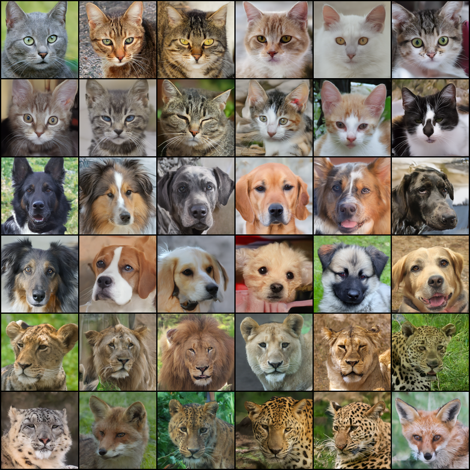

# AFHQ-v2 class-conditional generation showcase

这个可安装 example 展示一条完整、可恢复的 AFHQ-v2 生成数据流：

```text
官方 AFHQ-v2 archive
  -> AFHQV2ImageDataSource：读取、处理、完整性与安全审计
  -> 带类别语义和 official train/test 的确定性 128×128 managed artifact
  -> 内置 class_labeled_image Builder：分层划分、Dataset、Sampler、DataLoader
  -> 带 class_label 的 train/validation/test loaders
  -> ADM-UNet 或 DiT-B/8 类条件 Gaussian 训练
  -> training phase validation 与 epoch checkpoints
  -> epoch-end validation Evaluation 产生 FID/KID 并维护 best.pt
  -> frozen subject 的 one-shot official-test Evaluation
  -> EMA + classifier-free guidance DDIM sampling
  -> tensor、PNG、trajectory 与可追溯 manifest
  -> public full-official-test Evaluation、KID/FID 与可离线重放 predictions
```

这个 extension 只注册 `AFHQV2ImageDataSource`（`afhq-v2.official`）。它发布带
identity、类别映射和标签 inventory 的标准
`ClassLabeledImageFolderArtifactPayload`。配置使用 core
`class_labeled_image` Builder；Dataset、Sampler、collate 和 DataLoader 都不由 source
构造。ADM-UNet、DiT、Gaussian Process、训练 Strategy、CFG SamplingBuilder、
DDPM/DDIM、Trainer、EMA、checkpoint 和 artifact writers 也都使用 Stochaflow 的
内置注册路径；runner 中没有 AFHQ 名称分支。

## 数据与许可证

权威入口是 [ClovaAI StarGAN v2](https://github.com/clovaai/stargan-v2#animal-faces-hq-dataset-afhq)
维护的完整 AFHQ-v2 archive。数据采用
[CC BY-NC 4.0](https://creativecommons.org/licenses/by-nc/4.0/)；请先确认用途符合
非商业许可证要求。

packaged source lock 固定：

- 15,803 张 512×512 RGB PNG；
- `cat: 0`、`dog: 1`、`wild: 2`；
- official train/test 为 14,336/1,467；
- archive 大小为 6,955,288,636 bytes；
- 项目对完整官方 archive 审计得到的 SHA-256 为
  `6f2540f22c6d8ebb8879a2bc0227666dd4fc765cc355cb073b63a835d679e4e3`。

上游没有发布 checksum；这里的摘要是本项目对固定官方下载内容的审计值。source 不会在
官方入口失败时静默切换到第三方镜像。

`AFHQV2ImageDataSource` 对外提供 official train/test 及经过 source lock 认证的类别标签，数量为
14,336/1,467，不决定某次训练的 validation。内置 Builder 按
`partition.validation_per_class: 300` 从 official train 进行确定性、逐类分层划分；
loader 最终使用的 train/validation/test 数量为 13,436/900/1,467，其中 train 的
cat/dog/wild 数量为 4,765/4,378/4,293。

## 安装

这个 showcase 是独立的 uv project，并通过本地 editable source 使用当前 checkout 的
Stochaflow。在仓库根目录执行：

```bash
uv sync --project examples/showcases/afhq-v2 --locked
```

这会创建/同步 showcase 自己的环境、安装 example 命令，并注册 extension entry point
`stochaflow-afhq-v2`。该 entry point 注册 `afhq-v2.official`、正式 AFHQ
`EvaluationBuilder` 与 class-aware distribution Metric；训练配置调用内置
`class_labeled_image` Builder。example 不引入平行的 source envelope、image recipe 或
loader config 类型；模型、训练、采样和评估所需的通用配置与生命周期都来自
Stochaflow。

- `stochaflow-afhq-v2-prepare`；
- `stochaflow-afhq-v2-capacity`；
- public `stochaflow evaluate`。

### 当前 checkout 的正式 Evaluation 安装契约

正式 KID/FID 评估需要 showcase 声明的 optional `quality` extra。正式 Evaluation
当前必须从本仓库 checkout 同步，并使用以下完整命令：

```bash
uv sync --project examples/showcases/afhq-v2 --locked --extra quality
```

这条 source-checkout 路径通过 showcase 的 `[tool.uv.sources]` 把 Stochaflow 绑定到
同一 checkout，不会要求 AFHQ wheel 从已发布 core 解析当前尚未发布的 Evaluation API。
不要把独立安装 AFHQ wheel 当作当前正式 Evaluation 的入口。

仓库的 installed-wheel gate 会从当前 checkout 同时构建 core 与 AFHQ wheels，再以
`--no-deps --offline` 安装。它只验证 wheel 内容、隔离后的 extension entry point 与当前
core wheel 的 Evaluation 激活；不验证 AFHQ wheel 的 released-core resolver，也不证明
现有 GitHub Release core 包含这些尚未发布的 API。

协调 core/AFHQ 0.2 release，以及发布后在全新环境中只安装 AFHQ wheel、实际解析已发布
core 的 resolver smoke，是 post-release、non-blocking 的 follow-up。
它们不是当前 source-checkout Evaluation 的 merge blocker；真实 core release 存在前
不得写入未来 release wheel URL。

## 1. 准备并验证数据

第一次运行使用 `ensure`。它可以下载官方 archive，也可以使用已经下载的本地文件。
如果 v2 object 已存在，`ensure` 与 `require` 都直接从最终 artifact root 加载 payload，
不会进入下载或图片转换逻辑，也不要求原始 ZIP 仍然存在：

```bash
uv run --project examples/showcases/afhq-v2 stochaflow-afhq-v2-prepare \
  --cache-root ./data \
  --resolution 128 \
  --downloader auto
```

```bash
uv run --project examples/showcases/afhq-v2 stochaflow-afhq-v2-prepare \
  --cache-root ./data \
  --archive /path/to/afhq_v2.zip \
  --resolution 128
```

本地 archive 仍必须匹配 source lock 的字节数、SHA-256、ZIP inventory 和完整数据
contract。下载遵循标准 `HTTPS_PROXY`/`HTTP_PROXY` 环境变量；不要把含凭据的代理地址
写入 YAML。

准备成功后，用只读模式进行一次完整验证：

```bash
uv run --project examples/showcases/afhq-v2 stochaflow-afhq-v2-prepare \
  --cache-root ./data \
  --resolution 128 \
  --policy require \
  --verification full
```

`require` 不访问网络、不重建也不修复，因此所有 checked-in 训练配置都不会在启动时
悄悄下载或改变数据。ADM production 为降低每次 fresh training 启动时的完整 PNG
rehash 成本，固定使用 `require/manifest`；DiT production 与 smoke 固定使用
`require/full`。strict resume 注入 expected identity，因此无论原训练配置选择哪种
verification，恢复时都会强制执行 full verification。

prepare 命令通过注册的 `AFHQV2ImageDataSource` 执行，与内置 Builder 使用相同的
source 参数解析、materialization policy 和 identity 校验。命令只准备并汇报 official
train/test artifact；validation 参数属于 Builder，不是 prepare CLI 的输入。

未显式传入时，prepare CLI 的默认缓存根是 `./.stochaflow-cache`；checked-in 训练配置
显式使用 `./data`。统一 v2 cache 的相关部分如下：

```text
data/
├── source-acquisition/afhq-v2/raw/afhq-v2/<source-sha256>/afhq_v2.zip
└── data-artifacts/v2/managed/<artifact-type-digest>/
    ├── objects/<artifact-digest>/
    │   ├── manifest.json
    │   ├── inventory/
    │   └── data/
    │       ├── _index/images.json
    │       ├── train/{cat,dog,wild}/
    │       └── test/{cat,dog,wild}/
    ├── locators/
    ├── locks/
    ├── quarantine/
    └── staging/
```

消费者必须使用 payload inventory，不应绕过 DataSource 直接扫描缓存目录。
`AFHQV2ImageDataSource` 对外只暴露 official train/test。
准备阶段执行一次 Lanczos resize，不 crop，并使用固定 PNG 编码。训练阶段要求
authenticated size 精确为 128×128，不再在线 resize。DataBuilder 在内存中从 official
train 生成分层 validation，并输出 `(images, {"class_label": labels})`；shuffle 和
horizontal flip 都由 `(seed, epoch, sample identity)` 确定，因此 `num_workers: 2` 与
persistent workers 下的 epoch-boundary resume 仍可重建同一顺序和增强。

`manifest.json` 是 framework schema-v2 envelope；AFHQ 的 domain 只声明 resolution、
class mapping、official partition roots/counts 和 `_index/images.json` descriptor。
`verification: manifest` 验证 envelope 与这个 producer-defined cheap contract；
`verification: full` 还会认证 framework inventory 中的全部转换后 PNG。expected
identity 总是强制 full。旧 `prepared/afhq-v2` cache、`dataset_manifest.yaml`、
`files.sha256` 和 schema-v1 checkpoint binding 没有 reader 或迁移路径；升级后必须重新
materialize，并从新 run 开始。

## 2. 真实训练容量报告

准备好 AFHQ-v2 artifact 后，在目标 CUDA 主机运行真实训练 profiler：

```bash
uv run --project examples/showcases/afhq-v2 stochaflow-afhq-v2-capacity \
  --config examples/showcases/afhq-v2/experiments/production/train-adm-128-learned-range-v.yaml \
  --micro-batches 8 \
  --precisions bf16-mixed \
  --warmup-updates 5 \
  --measured-updates 25 \
  --output outputs/benchmarks/afhq-v2/adm-128-capacity.json
```

每个 trial 都通过已注册 DataBuilder、TrainingBuilder、Trainer 和 precision runtime 执行。
DataBuilder 通过 `ImageSourceFactory` 解析注册的 DataSource、验证同一 official
train/test artifact，再执行运行时分层划分并组装 loader；capacity 工具不会使用独立
source 或训练循环。工具按目标 effective batch 为每个 micro batch 解析 accumulation；上面的
production candidate 使用 micro batch 8 / accumulation 4。每个 trial warmup 5 次，并测量
25 次成功 optimizer updates；
报告 images/s、updates/s、allocated/reserved peak VRAM、data-wait/compute、细分
forward/backward/optimizer 时间和非有限 loss/gradient。若同一 batch 同时请求 FP32 与
BF16，报告还会提供 BF16 相对 FP32 的吞吐和显存差值。报告记录 Python、PyTorch、CUDA、
cuDNN、GPU 型号和 capability，便于比较结果。CUDA phase 使用异步 Events，整段测量仅在
开始和结束同步，因此 phase 观测不会在每次 forward/backward/optimizer 边界串行化训练。

报告固定同一 DataBuilder 返回的 source artifact bindings；运行时 partition policy 则由
每个 trial 的完整 resolved config、canonical SHA-256 和 seed 冻结。output directory、
core/extension 版本及 Python source tree digest 也会进入 code identity。device 和
precision support 在 meta model、DataBuilder 及 trial output 创建之前完成 preflight；
全部 precision 不受支持时不会读取数据或构建模型。

命令默认要求 CUDA，避免 `device: auto` 在无 CUDA 时静默运行巨型 CPU trial。仅做有界
测试或调试时显式传入 `--device cpu`；CPU 报告的 VRAM 字段为 `null`，不应用于
production batch 选择。

默认 fixed-variance ADM 的有效 schema-v3 sweep 来自 RTX 4090 24,564 MiB、PyTorch 2.11 /
cu128。它使用 canonical graph、五层 `[1,1,2,3,4]` / 8x8 scale layout、
105,197,187 parameters 与 BF16 mixed precision。四档都完成 5 次 warmup 和 25 次
measured optimizer updates：

| Micro batch | Accumulation | Effective batch | Images/s | Peak allocated (GiB) | Peak reserved (GiB) | Non-finite |
| ---: | ---: | ---: | ---: | ---: | ---: | ---: |
| 1 | 32 | 32 | 12.945 | 2.980 | 3.043 | 0 |
| 4 | 8 | 32 | 47.057 | 5.251 | 5.436 | 0 |
| 6 | 5 | 30 | 54.543 | 6.761 | 6.980 | 0 |
| 8 | 4 | 32 | 60.068 | 8.260 | 8.506 | 0 |

这是默认五层 ADM 的 operational capacity 与 25-update sustained evidence。micro batch 8
是该 sweep 已测候选中吞吐最高的一档，并不等于硬件可支持的绝对上限。

fresh learned-range-v production candidate 有自己的精确容量证据。它保留 canonical graph，
但联合使用四层 `[1,2,3,4]` / 16x16 scale layout 与 `2C` learned-range output；exact
parameter count 是 100,351,366。在同一 RTX 4090 / PyTorch 2.11 / CUDA 12.8 / BF16 环境下，
micro batch 8 / accumulation 4 完成 25 次 measured optimizer updates，吞吐为 45.17
images/s，peak reserved memory 为 10.455 GiB，non-finite loss/gradient observation 为 0。

两份 production YAML 都使用 8 / 4 并保持 effective batch 32、每 epoch 420 optimizer
updates 和总计 84,000 updates，但每份配置由自己的测量支持；不能把默认五层模型的吞吐或
显存数字外推给 candidate。两组报告都不证明长训练稳定性、收敛或生成质量；未来 DGX Spark
运行属于独立的跨设备证据。

## 3. 真实数据 smoke

smoke 配置使用已经准备好的真实 AFHQ-v2 artifact，而不是 synthetic data。它缩小
ADM-UNet、batch、diffusion steps 和采样步数，同时仍经过 class-aware loader、训练、
validation、official test、checkpoint、diagnostic 和最终 CFG sample：

```bash
uv run --project examples/showcases/afhq-v2 stochaflow train \
  --config examples/showcases/afhq-v2/experiments/smoke/train-adm-128.yaml \
  --limit-batches 4 \
  --limit-validation-batches 2 \
  --limit-test-batches 2
```

smoke 使用 CPU/FP32、micro batch 2、累积 2 次和 4 个训练 micro-batches，产生 2 次
optimizer update。它证明 wiring 与 artifact contract 可运行，不代表模型质量或
production 性能。

## 4. Production 训练

现有 v-prediction 主展示模型是 ADM-UNet：

```bash
uv run --project examples/showcases/afhq-v2 stochaflow train \
  --config examples/showcases/afhq-v2/experiments/production/train-adm-128.yaml
```

当前 production-quality 实验入口是 fresh learned-range-v ADM：

```bash
uv run --project examples/showcases/afhq-v2 stochaflow train \
  --config examples/showcases/afhq-v2/experiments/production/train-adm-128-learned-range-v.yaml \
  --device cuda
```

它固定 canonical ADM input/output-block graph、真实 AFHQ、cosine Process、v prediction、
BF16、micro batch 8 / accumulation 4、200 epochs / 84,000 updates 和 EMA decay 0.9999；
同时把默认五层 `[1,1,2,3,4]` / 8x8 scale layout 改为四层 `[1,2,3,4]` / 16x16，并把
fixed variance 改为 learned range。模型输出从 `C` 变为 `2C`：前半预测 v，后半插值
reverse-process log variance。hybrid objective 记录 simple loss 与 variational bound，
但 checkpoint selection 由下述完整 validation FID Evaluation 决定。该 run 必须从随机
初始化开始，不能恢复 fixed-variance 或旧 topology checkpoint。

因此它是 topology + variance 的联合 quality candidate，不是 isolated learned-variance
ablation，也不是 exact epsilon-prediction IDDPM reproduction。最终质量变化不能只归因于
learned variance。

DiT-B/8 候选配置使用与 fixed-variance v-prediction ADM 相同的 data、Process、
Objective、effective batch、scheduler、diagnostic 和 sampling protocol：

```bash
uv run --project examples/showcases/afhq-v2 stochaflow train \
  --config examples/showcases/afhq-v2/experiments/production/train-dit-128.yaml
```

`adm_unet` 现在直接表示 canonical ADM graph：initial convolution、每个 encoder
ResBlock 和每个 residual downsample 都保存 skip；decoder 每个 resolution 使用
`num_res_blocks + 1` 个 ResBlock，并逐 block 消费 skip。production 的
`num_res_blocks: 2` 因而表示 encoder 每级 2 blocks、decoder 每级 3 blocks。
默认 fixed-variance config 使用 `[1,1,2,3,4]`、到达 8x8、在
`attention_resolutions: [32, 16, 8]` 放置 attention，exact parameter count 是
105,197,187。learned-range quality candidate 使用同一 canonical graph，但采用
`[1,2,3,4]`、到达 16x16、在 `[32, 16]` 放置 attention，并输出 6 channels；它的 exact
parameter count 是 100,351,366。两者都使用 GroupNorm/QKV/output-projection residual
attention，middle 固定为 `ResBlock → Attention → ResBlock`。

这是 breaking cutover。旧 topology fields 与旧 ADM raw/EMA/optimizer checkpoint 都会
fail closed；没有 legacy mode、partial load、state adapter 或自动 config conversion，
必须 fresh train。

production 配置固定 effective batch 32，其中：

- ADM 使用实测 micro batch 8、gradient accumulation 4；
- DiT 使用 micro batch 32、gradient accumulation 1；
- 两者均训练 200 epochs；
- `bf16-mixed`、AdamW、EMA 和 step-level warmup cosine；
- class-condition dropout 0.1 和 `v` prediction；
- learned-range candidate 每 10 epochs 写 DDPM-100 + DDIM-50 training diagnostics；
- 从 epoch 100 开始每 10 epochs（包括 epoch 200）以 sampling batch 15 执行完整
  900-example EMA validation Evaluation；
- 每 50 epochs 保存周期 checkpoint，每 epoch 更新 `latest.pt`；
- validation Evaluation 以 aggregate FID 作为 `best.pt` monitor，同时记录 aggregate 和
  per-class KID/FID；普通 phase metrics 与 diagnostics 不获得选模 authority；
- official test 不在 fit 后自动读取，只对 validation 选出的唯一 checkpoint 单独运行。

在 `drop_last: true` 下，ADM 的更新计划为：

```text
micro-batches/epoch = floor(13,436 / 8) = 1,679
optimizer updates/epoch = ceil(1,679 / 4) = 420
total updates = 200 × 420 = 84,000
warmup updates = round(0.02 × 84,000) = 1,680
```

这组 8 / 4 设置由上面各自的 RTX 4090 schema-v3 capacity evidence 支持，并保持
effective batch 32 与 84,000-update schedule。它不是长期训练质量结论，也不声称 micro
batch 8 是硬件上限；迁移到其他设备时应重跑同一 capacity protocol，并记录 hardware
adaptation。

DiT 的更新计划为：

```text
micro-batches/epoch = floor(13,436 / 32) = 419
optimizer updates/epoch = ceil(419 / 1) = 419
total updates = 200 × 419 = 83,800
warmup updates = round(0.02 × 83,800) = 1,676
```

ADM 最后不足 4 个 micro-batches 的 accumulation window 会按实际长度 flush。scheduler、
EMA、global step 和 diagnostics 只在 optimizer update 成功后推进。learned-range production 固定
`device: cuda`，命令也显式传入 `--device cuda`；缺少 CUDA 时会在创建 run 前失败，不会
静默启动巨型 CPU 作业。CUDA 还必须支持 BF16。如果目标 CUDA 不支持 BF16，应先形成新的
容量验证与 hardware adaptation，而不是在一次正式运行中改写 precision。

TensorBoard：

```bash
uv run --project examples/showcases/afhq-v2 tensorboard --logdir outputs
```

## 5. Validation state 与 strict resume

learned-range-v 输出根目录是 `outputs/afhq-v2/adm-128-learned-range-v`，其下创建时间戳
run。要延长同一 recipe 的训练，使用该 run directory 或 `latest.pt` strict resume：

```bash
uv run --project examples/showcases/afhq-v2 stochaflow train \
  --resume outputs/afhq-v2/adm-128-learned-range-v/<run-id> \
  --epochs 200 \
  --artifact-verification-workers 8 \
  --device cuda
```

checkpoint v12 严格恢复 model、Process、Objective、optimizer、scheduler、EMA、
precision/scaler topology、global step、epoch-boundary RNG、训练循环状态和 data
artifact identity。epoch validation 的 profile digest、metric keys、cadence、完整的
interval/off-cadence-final observation history、last evaluated epoch 和最后一组 FID/KID
也会恢复；改变其中任一项必须 fresh train。恢复前会用
`require/full` 重新验证同一个 prepared artifact；source、
materialization、manifest 或内容 identity 不一致时，在恢复训练资产前失败。运行时
validation policy 不进入 artifact identity，而由 checkpoint 的 resolved config 与 seed
固定。artifact 哈希默认使用 `min(8, logical CPUs)` 个线程；可以在 YAML 的
`source.materialization.verification_workers` 配置 `1..8` 范围内的整数，或用
`--artifact-verification-workers` 仅覆盖本次启动。

当前 Gaussian inference recipe 还显式冻结 `variance.mode`（本 recipe 为
`learned_range`）。
v11 及更早 checkpoint 会被 strict resume 拒绝，框架不会补写或迁移；旧 ADM
checkpoint 还另外存在完整 topology/state 不兼容，因此 sampling 也会失败。

resume 创建新的 sibling run，不续写旧日志。它不能通过 config 替换 model、optimizer、
precision 或 accumulation。`--observability-config` 只用于允许的 diagnostics/logging
覆盖。

## 6. CFG 采样与结果

可以从训练 run 的 convenience `best.pt` 生成每类 12 张、共 36 张 DDPM-100 展示
sample。这个 profile 与 validation/official-test 使用相同 sampler contract，但独立展示
命令不决定 formal Evaluation subject：

```bash
uv run --project examples/showcases/afhq-v2 stochaflow sample \
  --checkpoint outputs/afhq-v2/adm-128-learned-range-v/<run-id>/checkpoints/best.pt \
  --config examples/showcases/afhq-v2/experiments/sampling/ddpm100-cfg2-readme.yaml \
  --device cuda \
  --output-dir outputs/afhq-v2/samples/adm-learned-range-v-best-ddpm100-cfg2
```

这份 profile 是完整、独立的 sample invocation：`sample:` 显式冻结 sampler、options、
shape、sample 数量、batch、seed 和 writers，不从 checkpoint config 继承采样默认值。
checkpoint 只提供训练时冻结的 inference recipe 与模型、Process 等推理资产。训练命令
不会自动执行这次采样；必须另行运行 `stochaflow sample`，并显式提供必填的 `--config`
来选择完整 profile。class 顺序为 cat、dog、wild。
非平凡 CFG scale 将 conditional 和 null labels 拼成双 batch，只进行一次模型
forward；DDIM 本身不解释 class 或 guidance。

默认五层 ADM production baseline 使用 fixed variance；当前四层 quality candidate 使用
learned range。class-conditional learned-range recipe 的 `2C` CFG 只 guide prediction
half；scale 0/1 返回完整 unconditional/conditional branch，其他 scale 保留 conditional
variance half。DDPM 消费 learned variance，DDIM 明确忽略 variance half。

### Corrected ADM 结果状态

canonical topology 切换前的指标与 sample panel 来自不兼容的 ADM graph，不能证明当前
模型。当前 learned-range-v run 已完成 200 epochs / 84,000 optimizer updates；11 次完整
900-image validation Evaluation 以 aggregate FID 选中 epoch 190 / step 79,800 的 EMA
`best.pt`。epoch 200 的 validation FID 为 25.7978，未优于 epoch 190 的 25.7572，因此
selector 正确保留 E190。

| Evidence | Aggregate FID | Aggregate KID mean ± std | Examples |
| --- | ---: | ---: | ---: |
| Validation-selected E190 | **25.7572** | **0.002426 ± 0.000863** | 900 |
| One-shot official test | **20.2478** | **0.002929 ± 0.000890** | 1,467 |

official-test 的 cat/dog/wild FID 分别为 27.0900、45.6332 和 15.0471；expected、observed
与 unique sample IDs 均为 1,467，没有 missing IDs。official test 在 validation 冻结唯一
checkpoint 后只运行一次，未参与 selection。



展示面板固定 EMA、DDPM-100、CFG 2.0、seed `20260726`，按 cat、dog、wild 各 12 张
排列；其 checkpoint SHA-256 为
`cd550951f04604fb6b170fc5b05fe82e8426ec429ceb5de6d2a1791238fccdfe`，与 official-test
subject 相同。该 candidate 同时改变 scale layout 与 variance head，因此结果不能归因成
isolated learned-range 或 topology ablation。它与 256×256 AFHQ translation 及单类
AFHQ-Dogs benchmark 的任务、split、样本数和 feature pipeline 也不同，不能直接按 FID
排名。

### Production 输出布局

一次 production run 的主要 artifact 如下：

```text
outputs/afhq-v2/adm-128-learned-range-v/<run-id>/
├── resolved_config.yaml
├── run_manifest.yaml
├── train.log
├── metrics.jsonl
├── tensorboard/
├── checkpoints/
│   ├── best.pt
│   ├── latest.pt
│   └── epoch_*.pt
└── diagnostics/class_conditional_diffusion_quality/epoch_*/
│   ├── manifest.yaml
│   ├── denoiser/
│   ├── ddpm_100/
│   └── ddim_50/
```

独立 `stochaflow sample` 命令指定的 sampling 目录包含 `samples.pt`、`samples.png`、
`trajectory.pt`、`trajectory.png`、`trajectory.gif` 和 `resolved_sampling.yaml`。
训练 manifest 记录 data artifact binding；checkpoint 记录同一 identity；sampling
manifest 记录 checkpoint lineage、seed、conditions、guidance、weights 和 artifact 路径，
因此结果可以追溯到同一训练输入。

## 7. 正式 KID/FID 评估

`train-adm-128-learned-range-v.yaml` 从 epoch 100 到 epoch 200 每 10 epochs 运行完整
validation Evaluation。每次到期都以 batch 15 对当前 EMA snapshot 生成 cat/dog/wild 各
300 张 fake，与 900 张 validation real 按 exact IDs 配对，并计算 aggregate/per-class
FID、KID mean 和 KID std。
aggregate FID 是 `best.pt` 的 lower-is-better monitor；KID 与 per-class 数值仍写入
`valid/metrics/*` 作为判断依据，但不形成另一套 selector。

这里的职责边界是：EvaluationBuilder 拥有采样、split、real/fake allocation、sample IDs
和 completeness；FID/KID 只是消费 image-pair updates 的 Metrics。普通 `valid/loss`、
phase-test metric 和 Diagnostic 都不会进入这条选择路径。非到期 epoch 不复用旧 FID、
不推进 patience；到期运行 incomplete 或 metric 非 finite 会终止训练。

因此不需要 heavyweight post-training selection runtime。对于训练过程中已纳入 cadence 的
候选，`best.pt` 已是 validation monitor 选中的 checkpoint；对于一组历史 checkpoints，
只需逐个运行同一 standalone validation Evaluation 并比较同一 aggregate FID/KID surface。
official test 必须保持未读，直到唯一 checkpoint 冻结。

checked-in `formal-ddim50-cfg2-official-test.yaml` 是与 standard-v/fixed-variance contract
匹配的 standalone 示例：

```bash
uv run --project examples/showcases/afhq-v2 stochaflow evaluate \
  --config examples/showcases/afhq-v2/experiments/evaluation/formal-ddim50-cfg2-official-test.yaml \
  --device cuda \
  --output-dir outputs/afhq-v2/evaluations/adm-ddim50-cfg2-official-test
```

learned-range-v 使用单独 checked-in 的
`formal-ddpm100-cfg2-official-test-learned-range-v.yaml`。它把 recipe contract 固定为
`prediction_type: v` 和 `variance: {mode: learned_range}`，复用 validation 已冻结的
DDPM-100 / CFG 2 字段，并把 expected allocation 改为 official test 的 cat/dog/wild
493/491/483：

```bash
uv run --project examples/showcases/afhq-v2 stochaflow evaluate \
  --config examples/showcases/afhq-v2/experiments/evaluation/formal-ddpm100-cfg2-official-test-learned-range-v.yaml \
  --device cuda \
  --output-dir outputs/afhq-v2/evaluations/adm-learned-range-v-ddpm100-cfg2-official-test
```

该 profile 只对 validation-selected `best.pt` 运行一次；fixed-variance profile 不能加载
`2C` checkpoint，official-test 结果也不能反向重选模型。

runtime 只把已经解析为 EMA（或另一个 profile 显式选择的 raw）的 primary model 注入
AFHQ Builder，Builder 不能再次选择权重。生成经由 checkpoint-bound
`EvaluationSamplingCapability` 调用与 `stochaflow sample` 共用的 SamplingBuilder execution
seam；该调用不发布普通 sampling writers。FID/KID provider 通过
当前 `MetricEngine` 的注入 registry authority 构造，AFHQ Metric 负责
aggregate/per-class scopes 和每类
reference/generated exact completeness。

成功目录为：

```text
outputs/afhq-v2/evaluations/adm-learned-range-v-ddpm100-cfg2-official-test/
├── predictions/
│   ├── prediction_manifest.json
│   └── predictions.jsonl
├── resolved_evaluation.yaml
├── result.json
└── evaluation_manifest.yaml
```

`predictions/` 冻结 exact sample plan、EMA/source checkpoint、data/split、采样 profile、
pre/postprocess、extension lineage、shard digests 和 deterministic gallery IDs。若要增加或
复核 metrics，复制已经冻结并实例化的 formal profile，并仅把 authority 改为：

```yaml
subject:
  kind: prediction_artifact
  path: ../../../../../outputs/afhq-v2/evaluations/adm-learned-range-v-ddpm100-cfg2-official-test/predictions/prediction_manifest.json
data:
  source: prediction_artifact
  split: test
```

然后继续运行 `stochaflow evaluate`。offline replay 认证 manifest/shards 并按 exact
sample plan 重放同一 AFHQ Metric，不加载 checkpoint、不构造模型、不再次执行
SamplingBuilder 或原 DataBuilder，也不修改 producer artifact。

早期 evaluator 的静态比较结果继续保留在仓库归档的开发记录中；可执行的 legacy
evaluator 和其私有配置 schema 已退休。新的 benchmark 与报告都必须来自 public
`stochaflow evaluate`。

public runtime 在评估开始前认证稳定 checkpoint snapshot、execution device、quality
provider 和严格 `DataArtifactBindings`。只有采样、metrics、prediction manifest、result
与 completion manifest 全部成功后才原子发布新目录；失败或并发目标冲突不会留下
半成品正式目录，也不会覆盖已有结果。

所有 data、checkpoint、benchmark 和普通 run artifacts 都位于被忽略的 `data/` 或
`outputs/`，不得提交到 Git。
